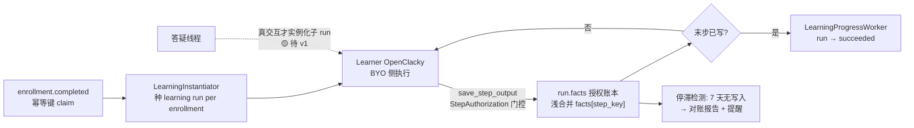

# 学习 workflow 详细设计（v1.0）

> 日期：2026-08-13 ｜ 作者：领域建模（claude，orchestrator/sole-writer） ｜ 状态：**v1.0 定稿**（care-pathway 三语义经 2026-08-13 用户签核 D6；协议形态经 slice E 整合计划批准，`docs/signoff/2026-08-13-001-slice-e-ideation-integration.md`）
> 依据：`docs/01-定稿设计/领域模型定稿.md`（§2.3 学习定位、:582-585 学习读写 MCP 工具、§4.7 BYO）、`docs/01-定稿设计/报名workflow详细设计.md`（§4.2 幂等键约定）、`docs/01-定稿设计/教研workflow详细设计.md`（§8 答疑交互、§5.1 产出落点）、`docs/adr/0005-workflow-run-worthiness.md`（run 需证成判据）、`docs/ideation/2026-08-12-course-event-slice-e-ideation.html`（Idea 2）、`docs/plans/2026-08-13-001-slice-e-integration-plan.md`（E-7 规格）
> 定位：第四个业务 workflow 的设计——但**不是 DAG 设计，而是协议设计**。学习执行在 Learner 侧 OpenClacky 运行（BYO），平台侧没有可编排的执行；平台产出 = 授权进度账本 + 投影。

## 1. 定位与 BYO 边界

- **执行方**：Learner 自己的 OpenClacky（BYO）。平台不编排、不催办、不跑 LLM。
- **平台角色**：① 触发——`enrollment.completed` 幂等种 learning run；② 授权账本——经门控的 `save_step_output` 逐 manual step 累积 `run.facts`；③ 投影——进度可查询；④ 停滞与对账——不进执行，只做检测（§6）。
- **run 判据**（ADR-0005）：learning 配得上 run——定义一次/多实例复用（同一学习定义按 enrollment 逐实例参数化）、分步授权（StepRole/报名学员本人）、跨角色语义（学员执行 + Tutor 答疑分支）同时成立。区别于报名（实体自序贯）。
- **触发约定**（报名 doc §4.2 已定）：`enrollment.completed` + 幂等键 `"enrollment.completed:" + enrollment_id`。本设计不新发信号，只做订阅方。

## 2. 协议总览

- **实例 key**：`"enrollment_" + enrollment_id`（一个报名 = 一个 learning run；expired 后可重提 → 新 enrollment → 新 key，request_id 语义与报名一致）。
- **幂等两层**：① signal_idempotency claim（PR #121，`(signal_type, idempotency_key)` 唯一，重复投递不重复实例化）；② find_or_create 非终态 run（`research_instantiator.ex` 同款，终态后可重新实例化）。
- **定义获取**：租户内已 published 的 `type=learning` 定义（多个取最新，version desc + inserted_at desc）。无 published 定义 → warning skip 供对账（同 `research_instantiator.ex:168-172` 模式；对账规则随实现登记，见 §6）。

## 3. 触发与实例化（LearningInstantiator）

- **模块**：`Cgc2046.Workflows.LearningInstantiator`（GenServer + `JidoAdapter.subscribe`，`ResearchInstantiator` 同款骨架）。
- **信号解析**：`enrollment.completed` data = `%{"enrollment_id", "user_id", "event_id" | "course_id"}`（报名 doc §4.2：subject=enrollment_id）。
- **校验链**：enrollment 存在且 status=confirmed（孤儿防护）→ 反查 entity 拿 workspace_id → claim 幂等键 → find_or_create run。
- **run 输入**：`%{key, enrollment_id, user_id, event_id | course_id, title}`——`enrollment_id` 是授权账本的锚（§4）。
- **异步 best-effort**：任一环节失败只记日志不崩溃（try/rescue），失败可见性交给对账扫描（E-10）。

## 4. 授权账本写路径（save_step_output）

现状（`mcp/tools/save_step_output.ex`）：`output` 浅合并进 `facts[step_key]`；`StepAuthorization.authorize_signal/4` 门控（owner/admin 豁免，其余按 StepRole，未配置不限制，读取失败 fail-closed）；终态 run 拒绝写入。**保持唯一写路径，不新增写工具。**

### 4.1 学员授权（本设计的核心接线）

张力：`update_facts_for_mcp` 要求 actor 是工作台成员（`workflow_run.ex:517-520`），而学员是**非成员**（D-A4 报名 ≠ 成员，J-Learner「非成员(Enrollment)」）。协议若要成立，授权账本必须对报名学员开放。

**定稿：学习 run 的步骤授权 = 「该 run 对应报名的本人」**：

- `StepAuthorization.authorize_signal` 对 `type=learning` 的定义增加学员豁免分支：run 反查 `input.enrollment_id` → Enrollment 存在、status=confirmed、`user_id == actor.id` → 放行（owner/admin 豁免不变）。
- 实现落点：工具层在 `authorize/4` 内先走既有 StepRole 判定，失败时对 learning run 补 enrollment 匹配（fail-closed 语义不变——两次判定都失败才拒绝）。
- 语义：学习 workflow 的 StepRole 对「报名学员」天然满足；`step_roles` 仍可用于 Tutor/Volunteer 等成员角色的补充授权（如 Tutor 代写某步产出）。
- D-A4 不被破坏：学员仍无 WorkspaceMembership，授权来自 Enrollment 记录本身——这是「授权账本」一词的实体含义。

### 4.2 variance 记录（D6 决策 1）

- `save_step_output` schema 加可选字段 `reason`（string，描述跳过/偏离原因）。
- 写入形态：`facts[step_key]["reason"]`（与 output 同次浅合并；无 reason 不写该键）。
- 语义：跳过步骤 = 写空 output + reason；偏离标准执行 = 写 output + reason。账本审计走既有 Thread journal（每次指令成对记录），variance 是其上的业务字段。

### 4.3 完成/出院（D6 决策 2）

- **discharge 标准**：定义的末个 manual step 的 `facts[step_key]` 已存在 ⇒ run 终结。
- **实现**：`LearningProgressWorker`（Oban cron，复用 `ApprovalExpiryWorker` 5min 模式）扫 `type=learning` 且 `status=running` 的 run：末步 key 已写 → 调既有 complete 动作置 `succeeded`（产出即工件——facts 全量即学习产物，同教研收尾段）。
- **save_step_output 保持不改状态**（单一职责、终态保护不变）；completion 检测由 worker 承担，代价是至多一个 cron 周期的延迟——BYO 协议下平台本不编排，可接受。
- 末步后继续写 → 终态保护拒绝（variance 补充须在末步前写入——顺序约束写入定义文档的操作说明）。

### 4.4 停滞升级（D6 决策 3）

- **检测**：learning run `status=running` 且 `facts` 无任何新增 > N 天（N=7，D6）→ ① 对账报告命中停滞规则（E-10）；② 经 `NotificationService` 提醒报名学员（复用 48h 提醒的 Oban 入队模式；新 miniprogram 模板 key 属运营配置，上线时登记）。
- **语义**：平台不编排、不自动 cancel——停滞是可见性事件，干预由人/学员侧决定（care-pathway 的 escalation 是「通知主治」，不是「自动转院」）。

## 5. 状态机映射

| WorkflowRun | 学习语义 | 谁驱动 |
|---|---|---|
| pending→running | 实例化后即 running（无平台侧执行步骤） | LearningInstantiator |
| running（长期） | 学员逐步写 facts | save_step_output |
| succeeded | 末步已写（discharge） | LearningProgressWorker |
| waiting | v1 不预期；答疑分支实例化子 run 时使用（🟡 待 v1） | — |
| failed/cancelled/expired | 报名取消联动取消（随 E-4/E-9 级联？不——报名 cancel 动作已有，学习 run 的取消订阅 `enrollment.cancelled` 随 E-2 订阅方落地） | — |

- 报名 cancelled → 订阅 `enrollment.cancelled` → 对应 learning run cancel（E-2 订阅方范围，实现随 E-7）。

## 6. 对账接口（E-10 对接）

- 随 E-7 实现登记规则（D8 纪律：规则随 workflow 落地维护）：**confirmed enrollment 无 learning run**（D8 规则①，E-7 后启用）+ **learning run running 且 facts 停滞 > 7 天**（§4.4）。
- 定义缺失 skip（§3）沿用 research 同款 warning 供对账；是否单列规则随实现评估。

## 7. 答疑分支（🟡 待 v1，非 slice E）

- Learner 提问 → Tutor 人工介入：`get_learner_history` / `reply_learner_question` 读写工具（领域模型 :582-585 规划，未建）。
- 真交互才实例化子 run（qna thread 按 key 隔离，教研 doc §6 同事件模式）；判定规则（自动应答 vs 人工）同教研 #8，v1 联调期细化。
- 不进 slice E 验收。

## 8. 租户 / 分区 / 审计

- partition：learning run 归 **Enrollment 所属实体（Event/Course）的 workspace**（与报名/教研一致，D-A5）。
- 审计：Thread journal 自动成对记录（`save_step_output` 调用 = instruction）；variance reason 落 facts 可随 journal 溯源。
- 多实例隔离：per enrollment key 隔离；不同学员互不串（facts 按 run 隔离，Postgres 唯一约束 + 状态机兜底）。

## 9. 开放问题清单

| # | 问题 | 结论 | 依据 |
|---|---|---|---|
| 1 | 学员（非成员）写授权 | ✅ 定稿：learning run 步骤授权 = 报名本人（§4.1） | D-A4 + Idea 2 协议必然推论 |
| 2 | variance 记录 | ✅ 定稿：save_step_output 可选 `reason` 字段（§4.2） | D6 决策 1 |
| 3 | completion/discharge | ✅ 定稿：末步已写 ⇒ run succeeded，LearningProgressWorker 检测（§4.3） | D6 决策 2 |
| 4 | 停滞升级 | ✅ 定稿：7 天无写入 → 对账报告 + 提醒，不自动干预（§4.4） | D6 决策 3 |
| 5 | 答疑交互 | 🟡 待 v1：工具未建，判定规则同教研 #8 | 领域模型 :582-585 / 教研 §8 |
| 6 | 报名取消联动 | ✅ 定稿：订阅 `enrollment.cancelled` → run cancel（随 E-2） | 报名 §3.4 |

**结论统计：✅ 定稿 5 项 ｜ 🟡 待 v1 1 项 ｜ 🔶 0 项（2026-08-13 用户签核 D6 全部落地）**

## 10. 修订记录

| 版本 | 日期 | 内容 |
|---|---|---|
| v1.0 | 2026-08-13 | 初版：协议形态（触发/实例化/授权账本/投影）+ care-pathway 三语义（D6 签核）+ 学员授权接线（§4.1）+ 停滞与对账接口。开放问题 ✅ 5 / 🟡 1 / 🔶 0 |
