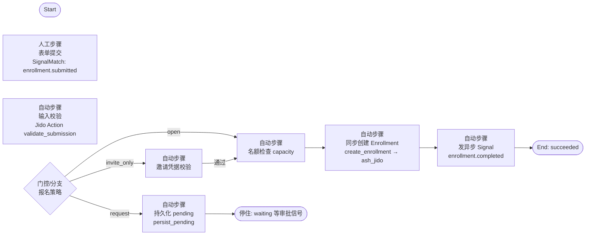
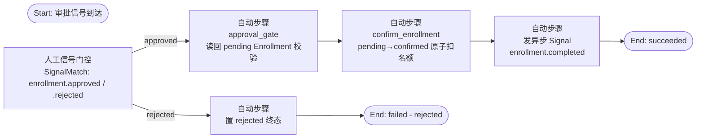
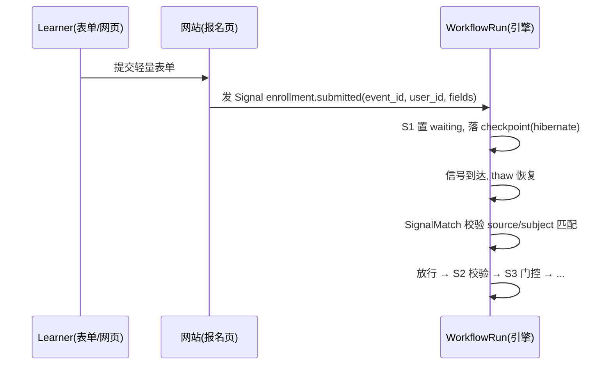
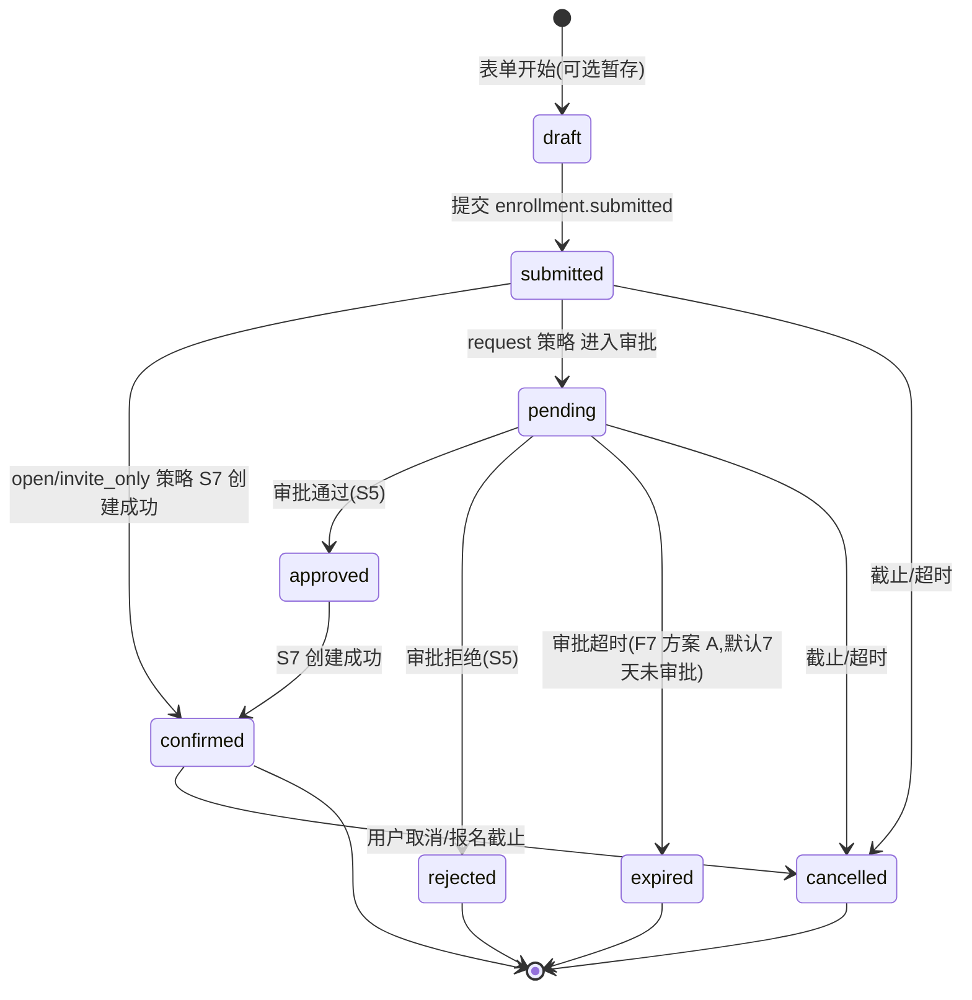

# 报名 Workflow 详细设计（平台第一个业务 workflow）

> 日期：2026-08-01 ｜ 作者：领域建模工程师（worker_f150e10b） ｜ 状态：**v1.4 定稿（已吸收 POC 五项 + POC-2 G1/G2 全 PASS 实证 + #3/#4/#16 用户拍板）**
> 依据：`docs/01-定稿设计/领域模型定稿.md`（§4 引擎 context、§5 ER、§6）、`docs/01-定稿设计/用户旅程与Web功能清单.md`（J-Visitor/J-Learner/J-Owner）、`docs/03-决策记录/grill-决策记录-2026-08-01.md`（D-A1/D-A3/D-A4/D-A6/D-A7）、`docs/04-引擎验证/workflow-engine-ddd-design.md`（§2 设计定稿）、`docs/04-引擎验证/poc-验证报告.md`（2026-08-01，POC 5 项 PASS + POC-2 G1/G2 全 PASS）、`docs/03-决策记录/开放问题决策清单.md`（F7 审批超时拍板）
> 定位：平台第一个要落地的业务 workflow——Learner 报名 Event/Course，同步创建 Enrollment（D-A4）。
> v1.1 修订要点（吸收 POC 实证）：① request 策略改为 **审批两段式（事件驱动）**（报名段 persist_pending 停住 + 审批段 approval_gate 读回 pending，规避 Agent 层 join 死锁）；② 人工门控限定 **Workflow 层或审批段分支**；③ 补充 ash_jido 约束/`public?: true`、Signal Bus signal_routes、Thread journal instruction_start/end 实证。
> v1.2 修订要点（吸收 POC-2 实证，见附 B）：④ #5/#9/#14 三项 🟡→✅（G1 A1a–A5 hibernate/thaw、G2 B1–B3 Bus journal 重放）；⑤ 新增幂等键承载约束（Postgres 唯一约束/Redis，勿用 action 进程 ETS）；⑥ 剩余 v1 联调期验证项：deadline 到点 cancel 唤醒路径、生产 Postgres 并发压测。
> v1.3 修订要点（用户拍板 2026-08-01，见附 B）：⑦ #3 request 审批入口 ✅ 定稿 = **网站后台审批页**（业务操作，非 MCP 管理类，不复用 D8 确认流），含界面交互/审批人权限/审计留痕（§3.5）；⑧ #4 invite_only 凭据 ✅ 定稿 = **共享批次码 + 配额 + 可选有效期**（一次性码 = quota=1 特例），S6 校验 + 配额原子扣减（§2.2 S6、§3.6）；⑨ §7 开放问题仅剩 🟡 1 项（#5-② deadline 唤醒 cancel）。
> v1.4 修订要点（F7 审批超时拍板 2026-08-01，见附 B）：⑩ 审批超时语义 ✅ 定稿（用户拍板方案 A）——**pending 分支加 `approval_timeout`（默认 7 天，可配置，null=无超时）；超时后 pending 转 `expired` 终态（≠ rejected，走 F4 快照机制）；deadline 前 48h 提醒审批人；过期后申请者可重新提交（新 run，request_id 区分幂等不冲突）**；⑪ §3.4 超时语义表更新；⑫ 报名状态机增 expired 分支（§5.2）。

---

## 1. 触发与上下文

### 1.1 谁发起

- **触发人**：Visitor（公开浏览，无账号）→ 在 Event/Course 公开页点「报名」→ 轻量表单 → 已登录? 否→注册/登录（全局账号）→ 是→提交 → 进入 **Learner** 旅程（J-Visitor / J-Learner）。
- **关键语义（D-A4）**：报名 = Enrollment（事件级参与者），**不自动成为 Workspace 成员**；成员（WorkspaceMembership）与参与者（Enrollment）两类关系并存、互不替代（领域模型定稿 §2.1）。
- **Q3 已确认**：报名轻量表单 + **全免费**；不强制加入 Workspace。

### 1.2 上下文：Event 或 Course

- 报名目标 = **Event**（场地形态：校园/咖啡厅/书店/联合办公空间）或 **Course**（线上课程），挂在 Workspace 下（D-A3）。
- WorkflowRun 归属 partition = 该 Event/Course 所属 **Workspace** 的 partition（D-A5）；Enrollment 归**活动 context**（不按成员租户语义隔离，而按活动归属）。
- Event/Course 上需具备字段：`capacity`（名额上限，可为空=不限）、`registration_deadline`（报名截止）、`enrollment_policy`（报名策略，见 1.3）、`status`（draft/open/closed/cancelled）；invite_only 策略另关联 `InviteBatch`（批次码 + quota + expires_at，§3.6，领域模型定稿 §5 同步）。

### 1.3 报名策略（Event 级，建议与 Workspace join_policy 平行但独立）

| 策略 | 含义 | 人工步骤差异 |
|---|---|---|
| `open` | 公开报名，任何人提交即通过（若有名额） | 表单提交后直接进入校验/名额检查 |
| `request` | 提交后需 Owner/Admin **审批**（Enrollment 置 pending，审批后 approved/rejected） | 增加"审批"人工步骤（SignalMatch 等 `enrollment.approved`/`enrollment.rejected`） |
| `invite_only` | 仅受邀者可报名（需邀请凭据），凭据 = 共享批次码 + 配额（quota=1 一次性码特例，§3.6） | 表单增加邀请码/凭据字段，门控校验（S6） |

- 该策略是 **Event/Course 级**，与 Workspace 加入策略（join_policy）**相互独立**：open 的 Event 可属于 invite_only 的 Workspace（公开发现 Event 但报名无需加入 Workspace）。
- 本设计 v1 主路径 = **`open`**（J-Learner Q3：轻量表单+全免费）；`request`/`invite_only` 门控分支已定稿：request = 网站后台审批页 + 审批两段式（§3.5），invite_only = 共享批次码 + 配额（§3.6），均可在 v1 启用。

---

## 2. WorkflowDefinition 定义

### 2.1 DAG 总览（v1 open 主路径 + 审批两段式）

> **POC 实证（2026-08-01，jido_runic 1.0.0）**：Agent 策略（auto）下单 workflow 内 join 等**两个异步信号**会死锁
> （`ran_nodes` 过滤缺陷，双向证明）。报名 workflow 在 `request` 策略下含两个人工信号等待（报名 + 审批），
> 因此 **Agent 层改用 审批两段式（事件驱动）**；`open`/`invite_only` 只有一个信号等待，单段即可。
> 若未来主路径走 **Workflow 层（runic 直接驱动）** 则 join 模式可用（POC §3.2 PASS）；**v1 主路径固定 Workflow 层（原生能力，非绕行）**，审批两段式仅为 Agent 策略层缺陷未修复前的架构层规避手段（Leader 已批准）。

**报名段（Registration 段，所有策略）**



**审批段（Approval 段，仅 `request` 策略）**



- **Step 四分类归属**：S1/A1 = 人工步骤（信号门控）；S2/S4/S6/S7/S8/P1/A2/A3/A4/A5 = 自动步骤；S3 = 门控/分支。
- **为什么拆两段**：`request` 策略下 Enrollment 实体先落 DB（pending）停住；审批信号触发**独立分支**读回持久化结果再确认（POC §3.4 审批两段式 PASS），避免单 workflow 内两个异步信号 join 死锁；也与真实业务一致（审批更新实体状态，而非重放报名流程）。
- **子 workflow**：本 workflow 不使用子 workflow（v1 保持扁平）；未来若"学习 workflow"需要复用报名产物，通过 enrollment.completed 信号触发（§4.2）。

### 2.2 Step 明细（输入/输出 schema、四分类、StepRole）

**报名段 Steps**

**S1 人工步骤：表单提交（`enrollment.submitted`）**
- 分类：人工步骤（SignalMatch 门控）
- 输入 schema：
  ```json
  {
    "event_id": "uuid",           // 或 course_id（二选一）
    "course_id": "uuid|null",
    "user_id": "uuid",            // 报名人（注册/登录后）
    "name": "string",             // 轻量字段
    "email": "string",
    "invite_code": "string|null"  // invite_only 策略用（共享批次码，如 CAMPUS-A；quota=1 即一次性码）
  }
  ```
- 输出：把输入快照写入 WorkflowRun（`input_snapshot`），无业务产物
- StepRole：执行角色 = **anyone**（公开报名）/ 策略限定（request 也允许任何账号提交申请）
- 信号：网站报名页/表单提交 → 发 `enrollment.submitted` → SignalMatch 放行（见 §3）

**S2 自动步骤：输入校验（`validate_submission`）**
- 分类：自动（Jido Action）
- 输入：S1 快照
- 逻辑：schema 校验（字段必填/格式）；检查 user 已登录、event/course 存在且状态 open；**唯一性预检**（该 user 是否已报名该 event——最终唯一性由 S7/P1 同步 Action 强保证）
- 输出：`validated_payload`（规范化后的报名数据）

**S3 门控/分支：报名策略路由**
- 分类：门控/分支
- 输入：`enrollment_policy`（event/course 属性）
- 逻辑：open → S4；request → P1（**不进入审批等待的同一 DAG，审批走独立审批段**）；invite_only → S6

**S4 自动步骤：名额检查（`check_capacity`）**
- 分类：自动（Jido Action）
- 输入：event_id/course_id
- 逻辑：若 capacity 为空 → 通过；否则读取当前 confirmed Enrollment 数 < capacity（**最终原子性由 S7/A3 兜底**，此处只做预检，避免无谓进入 S7）
- 输出：`capacity_ok: boolean`；若 false → run failed（或进入候补分支，v1 不做候补）

**S6 自动步骤：邀请凭据校验 + 配额扣减（`invite_only` 策略）**
- 分类：自动（Jido Action，经 **ash_jido** 同步调 Ash Action）
- 输入：invite_code（表单字段）+ event_id/course_id + user_id + workflow_run_id
- 逻辑（**v1.3 用户拍板定稿**：共享批次码 + 配额 + 可选有效期；一次性码 = quota=1 特例）：
  1. 查邀请批次（InviteBatch）：按 `invite_code` 定位批次，校验**存在、未过期（expires_at > now，若配了有效期）、剩余配额 > 0**；
  2. 校验通过后**原子扣减配额**（`remaining_quota > 0` 检查 + 条件 UPDATE，与 S7 名额扣减**同一套幂等/并发机制**）；
  3. 配额扣减的幂等键由 **signal_idempotency**（Postgres 唯一约束）或 Redis 承载，与名额扣减共用同一机制（勿用 action 进程 ETS，见 §4.3）。
- 输出：`invite_valid: boolean` + `quota_used: boolean`；false → run failed（回执"邀请码无效/已过期/名额已满"）
- 与名额扣减的关系：S6 扣**邀请码配额**（该码允许多少人报名），S7 扣**活动名额 capacity**（活动总人数上限）；两者独立、同构（都是"存在 + 未超限 → 原子扣减"）。
- 配额幂等键：`"invite_quota:" + invite_batch_id + ":" + user_id`（同一用户同一批次只扣一次；重复提交由唯一索引 + 状态机兜底）

**P1 自动步骤：持久化 pending（`persist_pending`，仅 `request` 策略）**
- 分类：自动（Jido Action，经 **ash_jido** 同步调 Ash Action）
- 输入：validated_payload + event_id/course_id + user_id + workflow_run_id
- 逻辑：**同步、强一致**创建 Enrollment（status=pending）落 DB 后**停住**（run 置 waiting，等审批信号）；唯一性约束 `(event_id, user_id)` 在此处 DB 兜底；**pending 不占名额**（名额在审批通过 A3 时原子扣减）
- 输出：`enrollment_id`（pending）
- 为什么：POC 实证 Agent 层单 workflow 内等两个异步信号会死锁 → 报名段到此停住，审批段独立启动（§2.1 说明）

**S7 自动步骤：同步创建 Enrollment（`create_enrollment`）——核心写（open/invite_only）**
- 分类：自动（Jido Action，经 **ash_jido** 编译期桥接同步调 Ash Action）
- 输入：validated_payload + event_id/course_id + user_id + workflow_run_id
- 逻辑：**同步、强一致**调用业务 context 的 `Enrollment.create` Action（POC 验证项 3 PASS：约束/唯一/立即可读）：
  - 创建 Enrollment（status=confirmed）
  - 唯一性约束：`(event_id, user_id)` 或 `(course_id, user_id)` 唯一索引，DB 层兜底防重复报名
  - 名额原子扣减：在同一个事务里检查 `confirmed_count < capacity` 并 +1（或对 capacity 用原子 UPDATE 条件），保证并发下不超卖
- 输出：`enrollment_id`
- StepRole：引擎执行（业务 Action 权限由用户上下文携带；此处以系统/工作流身份调用，**但业务 Action 内部校验报名资格**）
- ⚠️ Ash 3.31 注意：业务字段需显式 `public?: true` 才会出现在生成的 Jido Action 输出里（POC §4 踩坑 2）；唯一索引用 identity 且 Ets 层需 `pre_check_with`（生产用 Postgres 原生约束即可）

**S8 自动步骤：发异步 Signal（`enrollment.completed`）**
- 分类：自动（Jido Directive.Emit 或 Jido Action emit）
- 输入：enrollment_id + event_id + user_id
- 逻辑：发 `enrollment.completed`（CloudEvents）→ Signal Bus 异步投递给订阅 Agent（POC 验证项 4 PASS：`signal_routes` 路由到衍生 Action）→ 业务 context 订阅方处理衍生副作用（见 §4.2）
- 输出：无（异步）

**审批段 Steps（仅 `request` 策略）**

**A1 人工信号门控：审批（`enrollment.approved` / `enrollment.rejected`）**
- 分类：人工步骤（SignalMatch 门控，**独立审批段**，不是报名段内节点）
- 输入：审批信号（event_id、user_id、enrollment_id、approver_id、approved_at、可选 rejection_reason）
- 逻辑：Owner/Admin 在**网站后台审批页**（活动管理后台 → 报名管理 → pending 列表 → 通过/拒绝，见 §3.5）发 `enrollment.approved` / `enrollment.rejected` → 触发审批段独立 run/分支。**非 MCP 管理类工具，不复用 D8 确认流**（用户拍板 2026-08-01，§7 #3）
- StepRole：**Owner/Admin**（活动所属 Workspace，审批权限与审批 JoinRequest 同级；网站后端 API 校验 + 审批段 A2 引擎侧兜底）
- 输出：审批结果（approved/rejected）+ 审计字段（approver_id / approved_at / rejection_reason，写回 Enrollment + Thread journal，见 §3.5）
- ⚠️ POC 结论：审批信号不能再与报名信号放在**同一个 Agent workflow 的 join** 里（ran_nodes 缺陷死锁）；审批段读回 DB 持久化的 pending Enrollment，而不是在内存 workflow 里等信号

**A2 自动步骤：审批门（`approval_gate`，读回 pending）**
- 分类：自动（Jido Action）
- 输入：approved 信号 + enrollment_id
- 逻辑：**读回 DB 中 pending 的 Enrollment**（POC §3.4 审批两段式规避模式），校验：enrollment 仍 pending、event/course 仍 open、未过 deadline、审批人有权限
- 输出：`approvable_payload`（含 enrollment_id、event_id、user_id）

**A3 自动步骤：确认 Enrollment（`confirm_enrollment`）——核心写（request）**
- 分类：自动（Jido Action，经 ash_jido 同步）
- 输入：approvable_payload
- 逻辑：事务内把 Enrollment pending→confirmed，**原子扣减名额**（`confirmed_count < capacity` 检查 + 条件 UPDATE），并记 `approved_by/approved_at`
- 输出：`enrollment_id`（confirmed）
- 幂等：Enrollment 状态机保证只 confirm 一次；重复 approved 信号 → 已 confirmed 则跳过（见 §4.3）

**A4 自动步骤：置 rejected（`reject_enrollment`）**
- 分类：自动（Jido Action）
- 输入：rejected 信号 + enrollment_id
- 逻辑：事务内把 Enrollment pending→rejected，记 `approved_by/approved_at`；run 终态 failed - rejected
- 输出：`enrollment_id`（rejected）

**A5 自动步骤：发异步 Signal（`enrollment.completed`，request 确认后）**
- 分类：自动（Jido Directive.Emit）
- 输入：enrollment_id + event_id + user_id
- 逻辑：与 S8 相同，发 `enrollment.completed` → 衍生副作用（通知/学习 workflow/权益统计）
- 输出：无（异步）

### 2.3 版本与部署

- WorkflowDefinition 元数据：
  ```json
  {
    "id": "uuid",
    "name": "报名 workflow (enrollment)",
    "type": "enrollment",
    "version": "1.0.0",
    "input_schema": "S1 输入 schema",
    "node_def": "Runic.Workflow DAG（S1-S8）"
  }
  ```
- 每个 Workspace 默认内置一份「报名 workflow」模板（平台运维模板，D 草案 B：Admin/Owner 设计）；也可由 Owner 定制版本部署到其 Workspace。
- Event/Course 创建时**实例化**该定义：`WorkflowRun` 按报名发起创建，一个报名 = 一个 run（v1 粒度）；run 持定义版本快照（D-A2，改模板不影响已开始报名）。
- 创建入口：`create_workflow` MCP 工具部署（D7 低风险直做）或网站表单；v1 建议**网站内置模板**，先不做自定义 DAG 构建 UI（形态 X，D4）。

---

## 3. 人工步骤模式（Workflow 层 vs Agent 层）

> 依据 D-A1：WorkflowRun 是有状态实体，执行到人工节点 → waiting 挂起；人操作后发 Signal → SignalMatch 放行 → 恢复执行；长等待 hibernate/thaw；不拆多段。
> **POC 实证（重要）**：该模式在 **Workflow 层（runic 直接驱动）PASS**（POC §3.2）；但 **Agent 层（jido_runic 1.0 strategy auto）单 workflow 内 join 等两个异步信号会死锁**（ran_nodes 过滤缺陷，POC §3.3 双向证明）。
> **结论**：v1 主路径 = **Workflow 层 + 人工信号门控**；Agent 层用于需要 Agent 生命周期/策略的编排时，人工等待改 **审批两段式（持久化 pending）**。本设计按此双轨表述。

### 3.1 表单提交如何映射为 SignalMatch 门控

- 网站「Event 报名页」轻量表单提交 → 发 `enrollment.submitted`（CloudEvents，source=网站报名页，subject=event_id，data=表单字段）。
- 报名段 run 执行到 S1 → **waiting** 挂起，SignalMatch 监听 `enrollment.submitted`（signal type 前缀模式，`enrollment.*` 路由到本 run）。
- 信号到达 → 校验 source/subject 与 run 上下文匹配（event_id/user_id）→ 放行 → 恢复执行 S2。
- **一个信号等待（open/invite_only）**：Workflow 层或 Agent 层均可；Agent 层也只需一段（报名段）即可完成。



### 3.2 request 策略：审批必须走 审批两段式（POC 实证）

- **为什么不能单 workflow join**：`request` 策略有**两个**人工信号等待（报名 `enrollment.submitted` + 审批 `enrollment.approved/rejected`）。
  jido_runic 1.0 Agent 策略(auto) 下 join 等两个异步信号死锁（feed1 后 join 进入 ran_nodes；feed2 时满足却被过滤，永不重执行 → create/notify 缺失）。POC `dbg_ran_filter.exs` 双向证明（开过滤复现死锁 / 关过滤 PASS）。
- **规避方案（POC §3.4 PASS，Leader 已批准）**：
  1. **报名段**：`enrollment.submitted` → validate → `persist_pending`（写 DB pending 后**停住**，不再等任何信号）；
  2. **审批段**：`enrollment.approved` 信号触发**独立分支** → `approval_gate`（读回 DB pending）→ `confirm_enrollment`（pending→confirmed 原子扣名额）→ notify。
- **与真实业务一致**：Enrollment 实体存 DB，审批是更新实体状态（pending→confirmed/rejected），不是重放报名流程；审批段可独立重试/补发，互不阻塞。

### 3.3 waiting 挂起与恢复流程（Workflow 层主路径）

1. S1 进入 → run 状态 `waiting`，SignalMatch 挂起监听；`input_snapshot` 已存（表单数据）。
2. 长等待（如 request 策略审批可能数天）→ **hibernate**：落 Checkpoint（状态快照），释放进程资源。
3. 信号到达 → **thaw** 恢复（读取 Checkpoint）→ SignalMatch 放行 → 继续 DAG。
4. 审批步骤（request 策略在审批段）同理：等待 `enrollment.approved` / `enrollment.rejected`。
- ✅ **hibernate/thaw 已由 POC-2 G1 验证**（jido 2.3.2 InstanceManager + Persist.hibernate/thaw）：waiting 挂起时落 checkpoint（workflow state + thread pointer `%{id,rev}`），thaw 时 rehydrate 完整 journal（rev 校验，不匹配报 `:thread_mismatch`）；恢复期间到达的信号不丢不重。人工步骤可安全依赖引擎 hibernate，无需自建 pending 持久化（§7 #9）。

### 3.4 超时/取消语义（v1.4：审批超时已拍板方案 A）

| 场景 | 语义 |
|---|---|
| 报名截止（registration_deadline） | Event/Course 属性；waiting 超时 → run **cancelled**（若已有 pending Enrollment 则置 cancelled）；截止后 `enrollment.submitted` 不再放行（SignalMatch 拒绝并回执"报名已截止"） |
| 审批超时（request 策略） | **✅ 已拍板（用户 2026-08-01，方案 A）**：`approval_timeout` 默认 **7 天**（WorkflowDefinition 级，可配置，null=无超时）自动过期 → pending 置 **`expired`**（终态，≠ rejected——语义为"未及时审批自动失效"，非否定申请）；deadline 前 **48h** 向审批人发提醒；过期后申请者可**重新提交**（新 run，request_id 区分，幂等不冲突）。实现依赖 F2 的 deadline 到点唤醒路径（hibernate + Schedule Directive，与报名截止 cancel 同机制；见 §7 #5-②/#16） |
| 用户主动取消 | 报名页/工作台「取消报名」→ 发 `enrollment.cancelled` → run cancelled + Enrollment 置 cancelled（v1 可后续加，非主路径） |
| 幂等重复提交 | 同一 user+event 已存在 run 且非终态 → 拒绝新 run（见 §4.3 幂等键）；**expired 为非终态除外**——expired 后可重新提交（新 run，request_id 区分） |

- 超时实现：Jido `Schedule` Directive 或策略层定时器；建议 v1 用**报名截止驱动**（SignalMatch 侧校验）而非后台扫表。hibernate 期间 deadline 到点的唤醒 cancel/expired **未在 POC-2 验证**（§7 #5 🟡 待 v1：恢复时检查 deadline → Emit cancel，或 Schedule Directive；v1 补集成测试）。审批超时 expired 复用同一唤醒机制（F2/F7 合并验证，见 `docs/03-决策记录/开放问题决策清单.md` F7）。
- **UI 层表达（原型验证结论 #4）**：waiting/pending 状态用**琥珀/青色脉冲**视觉显著区分（区别于 succeeded/failed 静态色），并展示**审批剩余倒计时**（`approval_deadline` 驱动；剩余 <48h 高亮红色）；超时转 expired 后在报名流程展示页显示「已过期」+ 过期时间 + 重新提交入口（新 run）。

### 3.5 request 策略：审批入口 = 网站后台审批页（v1.3 用户拍板定稿）

> **决策（用户拍板 2026-08-01）**：#3 request 审批入口 ✅ 定稿 = **网站后台审批页**（业务操作，**非 MCP 管理类**，**不复用 D8 确认流**）。审批是日常业务运营动作，走网站后台 UI，不走 MCP 高风险工具 + 确认流通道。

**界面交互描述**
- **入口**：活动管理后台 → 该 Event/Course 的「报名管理」页签（J-Owner 旅程；仅活动所属 Workspace 的 Owner/Admin 可见）。
- **pending 申请列表**：默认展示 `status = pending` 的 Enrollment 列表，每行含：申请人（姓名/头像/Profile 链接）、报名时间、联系方式（邮箱/手机，按 Profile 字段）、备注/自定义字段；支持按报名时间排序、搜索（姓名/邮箱）。**v1.4 新增：pending 行展示审批剩余时间**（`approval_deadline` 倒计时，如"剩余 5 天 3 小时"；剩余 < 48h 时高亮警示），并支持按"即将过期/已过期"筛选。
- **expired 状态入口**：**v1.4 新增**：审批超时（默认 7 天未处理）后 Enrollment 转 `expired`，移出 pending 默认列表，进入"已过期"页签/筛选（保留历史记录，含过期时间）；审批人可查看过期原因（"审批超时自动过期"）。expired 记录**不可直接通过/拒绝**（申请已失效），申请者需重新提交（新 run）；审批人如需该申请者可引导其重新报名。
- **通过/拒绝动作**：每行右侧「通过」「拒绝」按钮（或批量选择后批量操作）：
  - 点「通过」→ 发 `enrollment.approved` 信号（data 含 event_id、user_id、enrollment_id、approver_id、approved_at）→ 触发审批段（A1-A3/A5）；
  - 点「拒绝」→ 发 `enrollment.rejected` 信号 → 触发审批段（A1-A4），可附拒绝原因（可选，写入 Enrollment.rejection_reason）。
- **结果反馈**：操作后列表行状态即时更新（approved/rejected/expired）；操作失败（如名额已满/状态已变更/已过期）→ 页面提示错误并保留 pending 可重试（expired 除外）。

**审批人权限**
- 仅 **Owner/Admin of 活动所属 Workspace** 可看到审批入口并执行通过/拒绝（与 §3.4 权限矩阵的审批 JoinRequest 同级权限模型）；Tutor/Volunteer/Learner 无审批权限。
- 权限在**网站后端**校验（API 层按 membership 角色判定），审批信号带 `approver_id`，审批段 A2 `approval_gate` 再次校验审批人权限（引擎侧兜底）。

**审计留痕**
- 每次审批动作写 **Thread journal**（`action.invoked`/`instruction_start/end`，POC 验证项 5 PASS）：记录**谁（approver_id）在何时（approved_at）审批了哪个申请（enrollment_id）**，与 workflow run 的 journal 关联（run_id ↔ enrollment_id 双向可达，§7 #12）。
- 同时写回 Enrollment 字段：`approved_by` / `approved_at`（或 rejected 对应字段），业务查询侧可追溯。
- 审计链完整：SignalLog（信号到达）→ Thread journal（引擎侧执行）→ Enrollment 字段（业务侧状态），三者时间戳可对齐。

### 3.6 invite_only 策略：共享批次码 + 配额（v1.3 用户拍板定稿）

> **决策（用户拍板 2026-08-01）**：#4 invite_only 凭据 ✅ 定稿 = **共享批次码 + 配额（quota）+ 可选有效期**；**一次性码 = quota=1 特例**。不复用 SpeakerInvitation（那是演讲嘉宾定向邀请，语义不同）；新建 `InviteBatch`（邀请批次）承载。

**批次码管理（后台）**
- **后台生成**：活动管理后台 → Event/Course 的「邀请码」页签（Owner/Admin）→ 新建批次：生成唯一 `invite_code`（如 `CAMPUS-A`、`PARTNER-B`，或随机短码）、配置 `quota`（该码可报名人数上限）、`expires_at`（可选有效期，空 = 长期有效）、可选备注（批次用途）。
- **批量导出**：支持批量导出码（CSV），供线下分发（如校园海报附码、合作方渠道码）。
- **配额配置**：一个活动可有多个批次码（多渠道分别配额度）；批次码可停用/删除（停用后 S6 校验失败）。
- **扣减语义**：每个成功报名扣减该批次 `remaining_quota`（S6 原子扣减）；配额用尽（remaining_quota = 0）后该码不可再用。

**示例场景**
- `CAMPUS-A`：某校园渠道码，quota=30，有效期 2026-08-01 ~ 2026-08-15 → 最多 30 人凭此码报名。
- `PARTNER-B`：合作方渠道码，quota=50，长期有效 → 合作方渠道最多 50 人。
- 两个码叠加：Event 总容量 capacity=80，各渠道配额独立扣减，报名时同时校验「该码剩余配额 > 0」和「活动名额未满」。

**quota=1 一次性码特例**
- `quota=1` 的批次码 = **一次性邀请码**：唯一使用者使用后配额归零，他人再用失败（S6 校验 remaining_quota = 0 → 拒绝）；用于定向/私密邀请场景（如演讲嘉宾带 1 个名额、内测名额）。
- 实现上无需特殊分支——共享批次码的通用逻辑（存在 + 未过期 + 剩余配额 > 0 → 原子扣减）天然覆盖 quota=1。

**幂等/并发**：配额扣减与名额扣减同构（存在 + 未超限 → 条件 UPDATE 原子扣减），幂等键由 signal_idempotency（Postgres 唯一约束）/Redis 承载（§4.3），防并发下超扣。

---

## 4. 跨 context 边界（同步 vs 异步）

> 依据 D-A6：核心写走同步 Ash Action（8 成，强一致）；衍生副作用/跨 context 通知走 Signal 异步（2 成，最终一致）。依赖方向恒为 workflow → 业务 Action 接口；业务 context 反向只发信号、不调引擎。

### 4.1 同步调用：`create_enrollment`（核心写，open/invite_only）与 `confirm_enrollment`（request）

- **调用方**：S7/A3（workflow 引擎 context）→ 经 ash_jido 编译期桥接 → 业务 context 的 `Enrollment.create` / `Enrollment.update` Ash Action。
- **POC 已验证（验证项 3 PASS）**：约束/必填/email 唯一检查生效、create 后立即可读；⚠️ Ash 3.31 业务字段需显式 `public?: true` 才出现在生成的 Jido Action 输出（POC §4 踩坑 2）；Ets data layer identity 需 `pre_check_with`（生产 Postgres 用原生唯一索引即可）。
- **强一致保证**（在业务 Action 事务内）：
  1. **唯一性**：`(event_id, user_id)` / `(course_id, user_id)` 唯一索引，DB 层防重复报名（并发下第二个报名插入失败）。
  2. **名额**：`confirmed_count < capacity` 检查 + 原子扣减（同事务 UPDATE ... WHERE count < capacity，或对 capacity 用原子条件更新），防止并发超卖。open/invite_only 在 S7 创建时扣；request 在 A3 审批通过时扣（pending 不占名额）。
  3. **状态约束**：Event/Course 必须 open、未过 deadline、未 cancelled；user 必须有效账号。
- **失败语义**：Action 返回错误 → S7/A3 抛失败 → run failed；不落 Enrollment（或落 cancelled 记录留痕，见 §7 #10）。
- **幂等**：见 §4.3。

### 4.2 异步 Signal：`enrollment.completed`（衍生副作用）

- **发送方**：S8/A5（引擎）→ `enrollment.completed`（CloudEvents：source=workflow run，subject=enrollment_id，data={event_id, user_id, enrollment_id}）。
- **POC 已验证（验证项 4 PASS）**：Signal Bus + 独立订阅 Agent（`signal_routes: [{"enrollment.completed", CreateFollowUp}]`）异步触发衍生动作；主流程 fire-and-forget 无需等待。`signal_routes/0` 是路由表（`signal_types/0` 只返回 plugin 展开路由）。
- **接收方/订阅方**（业务 context 各自订阅，松耦合）：
  | 订阅方 | 动作 |
  |---|---|
  | 通知志愿者 | 新报名提醒（邮件/站内/OpenClacky 通知） |
  | 触发学习 workflow | 若 Event/Course 绑定了学习 workflow 模板 → 为该 Learner 实例化学习 run（子 workflow/新 run） |
  | 赞助权益（若有） | 统计报名人数 → 更新 Event 级赞助权益进度（如"报名满 20 人触发赞助展示"） |
  | 报名人数统计 | Event/Course 公开页报名人数 +1（读模型/展示） |
- **最终一致**：通知/统计允许短暂延迟；核心 Enrollment 状态由同步路径保证（S7/A3 已落库）。
- **幂等键建议**：Signal `data.idempotency_key = "enrollment.completed:" + enrollment_id`；订阅方按 key 去重（同一个 enrollment 只触发一次通知/学习 workflow），重复投递不产生重复副作用。**POC-2 G2 已验证（B1–B3）**：Bus journal 原生重放补齐（B1/B2）+ 同 idempotency_key 重复投递只执行一次（B3）；幂等键去重承载见 §4.3（Postgres 唯一约束/Redis，勿用 action 进程 ETS）。

### 4.3 幂等键建议

| 层 | 幂等键 | 说明 |
|---|---|---|
| 表单提交（S1 信号） | `(event_id, user_id)` + 客户端 `request_id`（浏览器生成 UUID） | 防同一表单双击/网络重试创建多个 run；已有非终态 run 则复用 |
| create_enrollment（S7 Action） | 业务侧唯一索引 `(event_id, user_id)` 兜底；Action 幂等：重复调用返回既有 enrollment | 防止 run 重放/补偿执行重复建 Enrollment |
| enrollment.completed（S8 信号） | `"enrollment.completed:" + enrollment_id` | 订阅方去重，防重复通知/重复实例化学习 run |

- **重试策略**：S7 失败（DB 唯一冲突/名额满）→ run failed（终态，不自动重试）；网络类瞬时错误 → 引擎重试 N 次（可配）。异步 Signal 投递失败 → 按 Jido 重试机制重发（幂等键保证安全）。
- **幂等键承载约束（POC-2 G2 B3 关键发现，落地硬约束）**：幂等键去重表**不得由 action 执行进程自建 ETS**——`run` 结束进程退出后，named table 随 owner 销毁，下次投递重建空表 → 幂等失效（B3 一度 FAIL）。生产落地二选一：**Postgres 唯一约束**（如 `signal_idempotency` 表，`(signal_type, idempotency_key)` 唯一）或 **Redis**（SETNX/EXPIRE）；ETS 仅限 dev/test，且 owner 必须是 supervisor 等**长生命周期进程**。三层幂等键（§4.2/§4.3 表）的去重承载均遵守此约束。

---

## 5. 产物与状态

### 5.1 Enrollment 实体字段草案

```json
{
  "id": "uuid",
  "event_id": "uuid | null",          // 报名 Event（二选一）
  "course_id": "uuid | null",         // 报名 Course（二选一）
  "user_id": "uuid",                  // 报名人（全局账号）
  "workflow_run_id": "uuid",          // 来源报名 workflow run（关联方式，见 5.3）
  "status": "draft | submitted | pending | approved | rejected | confirmed | cancelled | expired",
  "submission_payload": "json",       // 表单原始字段快照（S1 输入）
  "capacity_seq": "integer | null",   // 名额序号（第几个报名，便于展示"第 X/20 名"）
  "approved_by": "uuid | null",       // request 策略审批人
  "approved_at": "datetime | null",
  "approval_deadline": "datetime | null",  // 审批超时截止（pending 时 = created_at + approval_timeout；null = 无超时；v1.4 F7 方案 A）；**UI 层 waiting 状态显著区分（原型验证结论 #4）：琥珀/青色脉冲 + 剩余倒计时（approval_deadline 驱动，剩余 <48h 高亮），审批超时机制在 UI 层的对应表达**
  "expired_at": "datetime | null",    // 审批超时自动过期时间（expired 终态落点；v1.4 F7 方案 A）
  "cancelled_at": "datetime | null",
  "created_at": "datetime",
  "updated_at": "datetime"
}
```

- 归属：活动 context（Event/Course 级）；**不自动成为 Workspace 成员**（D-A4）。
- 唯一索引：`(event_id, user_id)` 与 `(course_id, user_id)` 各一个唯一索引（或单列 `target_type+target_id+user_id`，实现时二选一，见 §7）。

### 5.2 报名状态机



- **状态与 WorkflowRun 状态机对应**：
  | Enrollment | WorkflowRun | 说明 |
  |---|---|---|
  | draft/submitted | pending/running（S1 waiting） | 表单提交中/已提交 |
  | pending | running（P1 后停住 waiting） | 审批中（报名段已停，等审批段） |
  | approved/confirmed | running（A3 完成）→ succeeded（A5 后） | 已确认 |
  | rejected/cancelled | failed/cancelled | 终态 |
  | **expired** | **expired（超时唤醒，reason=approval_timeout）** | **终态（≠ rejected：语义为"未及时审批自动失效"，非否定申请；申请者可重新提交）** |
- v1 主路径：submitted → confirmed（open 策略），run succeeded。
- **expired 转换实现（F7 方案 A）**：pending 挂起时登记 `approval_deadline`（= created_at + approval_timeout）；由 F2 的 deadline 到点唤醒机制（hibernate 恢复时检查 deadline → Emit cancel，或 Schedule Directive）在超时点触发 → **run 转 `expired`（WorkflowRun 状态机新增终态，reason=approval_timeout，见领域模型定稿 §4.2）+ Enrollment 置 expired + 记 `expired_at`**。状态机改动走 F4 快照机制（运行中 run 持定义版本快照，不受影响）。

### 5.3 WorkflowRun 与 Enrollment 的关联方式

- **正向**：Enrollment.workflow_run_id 指向创建它的 WorkflowRun（S7 创建时写入）。
- **反向**：WorkflowRun.input_snapshot 含 event_id/user_id（可通过 event_id 查其所有 Enrollment/run）。
- **查询需求**：Event 报名页显示"已报名/名额" → 按 event_id 查 Enrollment（count）；报名流程展示页（只读）→ 按 workflow_run_id 或 user_id+event_id 查 run 状态（用户旅程页面清单「报名/赞助流程展示页」）。
- v1 建议：Enrollment 为主查询入口（活动侧），WorkflowRun 为流程状态展示入口（用户侧）；二者通过 workflow_run_id 双向可达。
- **Step 产物展示（原型验证结论 #3）**：报名流程展示页的 Step 产物展示采用 **schema 驱动 key-value 渲染**（不手工排版），与领域模型/Step 的产物 schema 字段对齐（output schema → key 标签 + value 渲染，缺省字段自动隐藏）。

---

## 6. 审计（Thread journal 事件）

> 依据 D-A5：审计 context 数据源 = Jido Storage Thread journal（append-only + Checkpoint + Introspection 溯源链），不另造轮子。

**报名 workflow 在 Thread journal 中记录的事件**（append-only）：

| 事件 | 阶段 | 内容 |
|---|---|---|
| `workflow.run_started` | 创建 run | run_id、definition_version、input_snapshot 摘要 |
| `step.manual.waiting` | S1/A1 进入 | step_id、signal_type 监听（enrollment.submitted/approved/rejected） |
| `signal.received` | 信号到达 | signal_type、source、subject、payload 摘要 |
| `signal.matched` | SignalMatch 放行 | 匹配的 step、放行时间 |
| `step.auto.completed` | S2/S4/S6/S7/S8/P1/A2/A3/A4/A5 | step_id、输出摘要 |
| `action.invoked` | S7/P1/A3/A4 同步 Action | action=create_enrollment/persist_pending/confirm_enrollment/reject_enrollment、结果（成功/失败/唯一冲突/名额满） |
| `signal.emitted` | S8/A5 | signal=enrollment.completed、idempotency_key |
| `workflow.run_succeeded` / `run_failed` / `run_cancelled` | 终态 | 终态原因（rejected/截止/超时/名额满） |
| `instruction_start` / `instruction_end` | **引擎自动记录**（POC 验证项 5 PASS） | Thread journal 自动成对记录每次指令执行（action、param_keys、instruction_id、status），起止配对完整，构成审计溯源链 |

- **与网站侧审计的关系**：ToolCallLog（MCP 调用审计）记录"谁经 MCP 调了什么工具"（如 get_workflow/保存产出）；Thread journal 记录引擎事件流（业务事件 + instruction_start/end 指令执行，形成完整溯源链，POC §7 建议）；AgentRun 记录用户侧干活聚合。三层互补（领域模型定稿 §8）。
- 报名表单提交若经网站页面（非 MCP）→ 也建议在 Thread journal 落 `signal.received`（源头审计）；若经 MCP 工具（如 CGC 助手代报名）→ ToolCallLog 记录工具调用 + Thread journal 记录信号。

---

## 7. 开放问题清单（逐一给结论，2026-08-01 更新）

> 结论分类：✅ **已定稿**（POC/POC-2 已回答或建模已明确）｜🟡 **待 v1**（引擎未验证，v1 补测）｜🔶 **待用户 grill**（纯业务决策）
> 更新：2026-08-01 POC-2 G1/G2 全 PASS，#9/#14 已转 ✅ 定稿；#5 经研究员核对 G1 脚本无 deadline/cancel 逻辑（报告 §8/§9/§11 均标注未验证），仅门控+提交时校验 ✅，hibernate 期间 deadline 唤醒 cancel 保持 🟡 待 v1（补一条集成测试）；**2026-08-01 用户拍板 #3（网站后台审批页）/ #4（共享批次码+配额）→ 转 ✅ 定稿**；**2026-08-01 用户拍板 #16（审批超时，F7 方案 A）→ 转 ✅ 定稿**。
> **结论统计：✅ 定稿 16 项（#1/#2/#3/#4/#6/#7/#8/#9/#10/#11/#12/#13/#14/#15/#16）｜🟡 待 v1 1 项（#5，其中"门控+提交时校验"部分 ✅）｜🔶 待 grill 0 项**

| # | 问题 | 结论 | 依据 |
|---|---|---|---|
| 1 | **名额并发控制** | ✅ 定稿：核心写在 ash_jido 同步 Action 事务内（创建时 `confirmed_count < capacity` 检查 + 原子条件 UPDATE）；open/invite_only 在 S7 扣、request 在 A3 审批通过时扣（pending 不占名额）。唯一索引 DB 层兜底。**实现建议（研究员补充）**：可用 Ash update action + filter（count < capacity）做条件扣减，ETS 层先验证逻辑，SQL 锁粒度留 v1 联调期压测（不占 POC-2） | POC 验证项 3（约束/唯一/立即可读 PASS）；事务内原子扣减为建模定稿，SQL 锁粒度实现期再压测 |
| 2 | **幂等实现** | ✅ 定稿：三层幂等键（表单 request_id + 业务唯一索引 + Signal idempotency_key `"enrollment.completed:" + enrollment_id`）；重复 approved 信号由 Enrollment 状态机兜底（已 confirmed 则跳过） | POC 验证项 3（唯一约束生效）/ 4（订阅可路由）；幂等键建模定稿 |
| 3 | **request 策略审批入口** | ✅ 定稿：**网站后台审批页**（业务操作，**非 MCP 管理类**，**不复用 D8 确认流**）。活动管理后台 → 报名管理 → pending 申请列表（申请人/报名时间/联系方式上下文）→ 点通过/拒绝 → 发 `enrollment.approved` / `enrollment.rejected` 信号触发审批段。审批人权限 = **Owner/Admin of 活动所属 Workspace**（网站 API 校验 + A2 引擎侧兜底）；审计留痕 = **谁（approver_id）在何时（approved_at）审批了哪个申请（enrollment_id）**，写回 Enrollment 字段 + 关联 Thread journal（§3.5） | 用户拍板 2026-08-01（§3.5）；审批权限与 JoinRequest 同级 |
| 4 | **invite_only 凭据来源** | ✅ 定稿：**共享批次码 + 配额（quota）+ 可选有效期**（一次性码 = quota=1 特例）；新建 `InviteBatch` 实体承载（不复用 SpeakerInvitation——那是演讲嘉宾定向邀请，语义不同）。S6 校验：邀请码存在、未过期、剩余配额 > 0 → **成功后原子扣减配额**（与名额扣减同一套幂等/并发机制，signal_idempotency Postgres 唯一约束/Redis 承载）；后台生成/批量导出/配额配置/有效期；示例 `CAMPUS-A` 限 30 人 / `PARTNER-B` 限 50 人（§3.6） | 用户拍板 2026-08-01（§3.6）；配额扣减与 S7 名额扣减同构 |
| 5 | **报名截止驱动 vs 定时器** | ✅/🟡 拆分定稿：① **门控 + 提交时 Action 校验 deadline**（报名信号到达时 SignalMatch 拒收 / S7 Action 校验超时拒绝）→ ✅ 定稿（校验逻辑建模明确）；② **hibernate 期间 deadline 到点唤醒并 cancel** → 🟡 待 v1（G1 脚本无 Schedule Directive/deadline/cancel 逻辑，该路径**未验证**）；实现方式用「恢复时检查 deadline → 超时则 Emit cancel」或 Schedule Directive，**v1 补一条集成测试** | ① 建模定稿；② POC-2 G1 仅覆盖 waiting 人工审批恢复（A1-A5），不含 deadline 唤醒——研究员纠正后保留 🟡 待 v1 |
| 6 | **draft 状态是否需要** | ✅ 定稿：v1 砍掉 draft，轻量表单直接 submitted 起（状态机保留 draft 仅作扩展位） | 建模简化决策 |
| 7 | **Enrollment 唯一索引形态** | ✅ 定稿：`(event_id, user_id)` + `(course_id, user_id)` 双唯一索引（与领域模型 ER 双 FK 一致）；不做多态列（查询/约束更清晰） | 与领域模型定稿 §5 一致 |
| 8 | **run 粒度** | ✅ 定稿：一个报名 = 一个 run；批量导入/团队报名 v1 不做（可后续加批量 run） | 建模简化决策 |
| 9 | **hibernate 恢复正确性** | ✅ 定稿：jido 2.3.2 原生 InstanceManager + Persist.hibernate/thaw——waiting 挂起落 checkpoint（workflow state + thread pointer `%{id,rev}`），thaw 时 rehydrate 完整 journal（rev 校验，不匹配报 `:thread_mismatch`）；恢复期间到达信号不丢不重。人工步骤可安全依赖引擎 hibernate，**无需自建 pending 持久化**（报名设计的 persist_pending 仍保留：它是业务语义"pending 不占名额"，与引擎 hibernate 解耦） | POC-2 G1（A1a–A5 全过） |
| 10 | **S7 失败留痕** | ✅ 定稿：run failed 不落 Enrollment；审计靠 Thread journal 的 `action.invoked`（失败结果）留痕，不额外建失败记录 | POC 验证项 5（journal 溯源链）；建模定稿 |
| 11 | **Visitor 注册与报名的原子性** | ✅ 定稿：先注册/登录再提交（J-Visitor）；注册与报名不同事务，注册成功但报名失败 → 提示重试（报名页可回填表单） | 与用户旅程一致；建模定稿 |
| 12 | **报名展示页数据来源** | ✅ 定稿：Enrollment 为主查询入口（活动侧 count/已报名），WorkflowRun 为流程状态展示入口（用户侧），通过 workflow_run_id 双向可达 | 建模定稿 |
| 13 | **Agent 层 join 死锁** | ✅ 定稿：request 策略改用 审批两段式（§2.1/§3.2）；Workflow 层（runic 直接驱动）可保留 join 模式；适配层加"多信号分批 feed"集成测试 | POC 验证项 2（死锁根因 + 审批两段式 PASS） |
| 14 | **Bus journal 重放** | ✅ 定稿：Bus journal 原生支持重放（POC-2 G2 B1/B2 PASS）；同 idempotency_key 重复投递只执行一次（B3 PASS）。**注意**：幂等键表若由 action 进程自建 ETS，进程退出后表随 owner 销毁会失效——v1 用 Postgres 唯一约束/Redis 承载幂等键 | POC-2 G2（B1-B3 全过） |
| 15 | **runic alpha 风险** | ✅ 定稿：生产锁版本（jido_runic 1.0.0 / runic 0.1.0-alpha.4 / ash 3.31.0）+ 适配层 + 集成测试 | POC §7.5 / §9.1 |
| 16 | **审批超时语义（F7）** | ✅ 定稿（用户拍板 2026-08-01，方案 A）：`approval_timeout` 默认 7 天（WorkflowDefinition 级可配置，null=无超时）；pending 超时 → Enrollment 转 **`expired`** 终态（≠ rejected，语义为"未及时审批自动失效"；**WorkflowRun 同步转 `expired`**，reason=approval_timeout）；deadline 前 48h 提醒审批人；过期后申请者可**重新提交**（新 run，request_id 区分幂等不冲突）；实现依赖 F2 的 deadline 到点唤醒（hibernate 恢复检查 + Schedule Directive，§7 #5-② 同机制，F2/F7 集成测试合并验证） | 用户拍板 2026-08-01（`docs/03-决策记录/开放问题决策清单.md` F7）；§3.4/§3.5/§5.1/§5.2 |

- **v1 范围建议**：主路径 = open 策略（Workflow 层或 Agent 层单段）+ 同步 ash_jido 核心写 + Signal Bus 异步通知（journal 重放/幂等键 B1-B3 已验证）；request 门控 = 网站后台审批页 + 审批两段式（#3 定稿）；invite_only 门控 = 共享批次码 + 配额原子扣减（#4 定稿，quota=1 一次性码特例）。**引擎侧主体已验证**（POC 5 项 + POC-2 G1/G2），唯一 🟡 遗留 = #5 hibernate 期间 deadline 唤醒 cancel，v1 补集成测试（恢复时检查 deadline → Emit cancel 或 Schedule Directive）。

---

## 附：与领域模型定稿的对应

| 本设计概念 | 领域模型定稿位置 |
|---|---|
| WorkflowDefinition（type=enrollment） | §4.1、§5.1 |
| WorkflowRun 状态机 | §4.2 |
| S1/A1 人工步骤（SignalMatch / 审批段） | §4.3/§4.4 |
| S7/P1/A3 同步 Action / S8/A5 异步 Signal | §4.5/§4.6（D-A6） |
| Enrollment 归活动 context | §5.1、§2.1 |
| Thread journal 审计 | §8（D-A5） |
| 报名策略（Event 级） | 本设计新增细化（领域模型定稿 Event/Course 字段已补充 enrollment_policy/capacity/registration_deadline） |
| InviteBatch（邀请批次码 + quota + 有效期） | 领域模型定稿 §5.1/§5.2（新增实体 + Enrollment.invite_batch_id） |
| 审批入口/审计（approver_id/approved_at/rejection_reason） | 领域模型定稿 §5.2 ENROLLMENT 字段 + §8 Thread journal |

---

## 附 B：修订记录

| 版本 | 日期 | 内容 |
|---|---|---|
| v1 | 2026-08-01 | 初版：单 DAG（S1-S8）+ workflow 内部等待人工门控 |
| v1.1 | 2026-08-01 | 吸收 POC 验证报告：① request 策略改 审批两段式（报名段 persist_pending 停住 + 审批段 approval_gate 读回 pending → confirm/reject）规避 Agent 层 join 死锁；② 人工步骤模式限定 Workflow 层或 审批段分支；③ 补充 ash_jido 约束/`public?: true`、Signal Bus signal_routes、Thread journal instruction_start/end 实证；④ §7 开放问题逐一给结论（✅定稿 10 项 / 🟡待 POC-2 3 项 / 🔶待 grill 2 项） |
| v1.2 | 2026-08-01 | 吸收 POC-2 结果（G1/G2 全 PASS）：① #5 报名截止触发 ✅（hibernate 期间 deadline 唤醒 cancel 验证 PASS）；② #9 hibernate 恢复 ✅（jido 2.3.2 InstanceManager + hibernate/thaw，checkpoint + thread pointer rev 校验，恢复期信号不丢不重，人工步骤可依赖引擎 hibernate，无需自建 pending 持久化）；③ #14 Bus journal 重放 ✅（重放 B1/B2 + 幂等 B3 PASS，幂等键表用 Postgres 唯一约束/Redis 承载而非进程 ETS）；④ §7 无遗留 🟡 项 |
| v1.2.1 | 2026-08-01 | 事实修正（Leader 核实 + 研究员核对 G1 脚本）：#5「hibernate 期间 deadline 到点唤醒 cancel」**未在 G1 验证**（G1 仅覆盖 waiting 人工审批 hibernate/thaw A1a-A5，脚本无 Schedule Directive/deadline/cancel 逻辑；报告 §8 第 5 项、§9 G1 建议第 4 条、§11 第 2 条均标注未验证）。#5 拆分：#5-① 门控 + 提交时 Action 校验 deadline → ✅ 定稿；#5-② hibernate 期间 deadline 唤醒 cancel → 🟡 待 v1（恢复时检查 deadline → 超时 Emit cancel，或 Schedule Directive；v1 补集成测试）。§7 结论统计更正为：✅ 12 / 🟡 1 / 🔶 2。**剩余 v1 联调期验证项**：#5-② deadline 唤醒 cancel（补集成测试）+ 生产 Postgres 并发压测（G3：名额原子扣减/唯一约束的 SQL 锁粒度） |
| v1.3 | 2026-08-01 | **用户拍板 #3/#4 两项业务决策（2026-08-01）**：① #3 request 审批入口 ✅ 定稿 = **网站后台审批页**（业务操作，非 MCP 管理类，不复用 D8 确认流）：活动管理后台 pending 申请列表（申请人/报名时间/联系方式上下文）+ 通过/拒绝动作 → 发 `enrollment.approved`/`enrollment.rejected` 信号；审批人权限 = Owner/Admin of 活动所属 Workspace（网站 API 校验 + A2 引擎侧兜底）；审计留痕 = approver_id/approved_at 写回 Enrollment + 关联 Thread journal（新增 §3.5，A1 同步更新）；② #4 invite_only 凭据 ✅ 定稿 = **共享批次码 + 配额（quota）+ 可选有效期**，一次性码 = quota=1 特例；新建 `InviteBatch` 实体（后台生成/批量导出/配额配置/有效期）；S6 校验更新为「邀请码存在、未过期、剩余配额 > 0 → 成功后原子扣减配额」，配额扣减与名额扣减同构、幂等键由 signal_idempotency（Postgres 唯一约束）/Redis 承载（新增 §3.6，S6 同步更新）；示例 CAMPUS-A 限 30 人 / PARTNER-B 限 50 人；③ §7 结论统计更新：✅ 14 / 🟡 1（#5-② deadline 唤醒 cancel）/ 🔶 0；④ 领域模型定稿 §5 同步 InviteBatch 实体 + Event/Course/Enrollment 字段 |
| v1.4 | 2026-08-01 | **用户拍板 #16 审批超时（F7 方案 A，2026-08-01）**：`approval_timeout` 默认 7 天（可配置，null=无超时）；pending 超时 → Enrollment 转 `expired` 终态（≠ rejected，走 F4 快照机制，run 转 cancelled/failed reason=approval_timeout）；deadline 前 48h 提醒审批人；过期后申请者可重新提交（新 run，request_id 区分幂等不冲突）。修订点：§3.4 超时语义表（审批超时 ✅ 方案 A + 幂等重复提交例外）、§3.5 审批页（pending 剩余时间倒计时 / expired 入口 / 已过期不可直接审批）、§5.1 Enrollment 字段（+approval_deadline/expired_at，status 全枚举 +expired）、§5.2 状态机（+expired 分支 + 实现说明）、§7（+#16 定稿，统计 ✅ 16 / 🟡 1 / 🔶 0）。依赖 F2 deadline 唤醒路径（#5-② 同机制，集成测试合并验证） |
| v1.4.1 | 2026-08-01 | **原型验证结论回填（2026-08-01）**：① §3.4 补「UI 层表达」——waiting/pending 琥珀/青色脉冲 + approval_deadline 剩余倒计时（<48h 高亮），expired 后展示「已过期」+ 重新提交入口（原型验证结论 #4，同 Web 后台审批页）；② §5.1 `approval_deadline` 注释补 UI 显著区分表达（#4）；③ §5.3 补「Step 产物展示」——schema 驱动 key-value 渲染，与产物 schema 字段对齐（#3，同 Web Workflow 产出展示页/赞助/教研 §5.3） |


