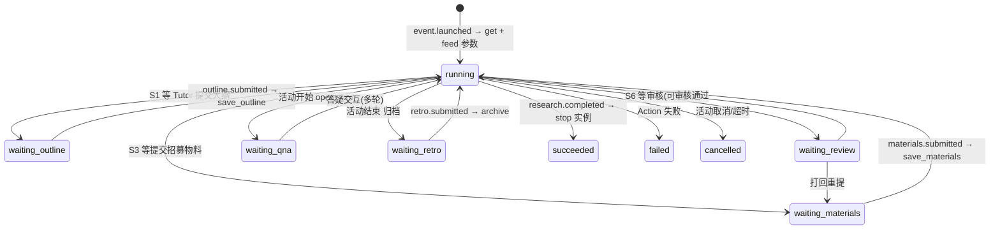

# 教研 Workflow 详细设计（平台第四个业务 workflow）

> 日期：2026-08-01 ｜ 作者：领域建模工程师（worker_f150e10b） ｜ 状态：**v1.1 定稿（9 项开放问题拍板已落地，见 §7 与附 B）**
> 依据：`docs/01-定稿设计/领域模型定稿.md`（§4 引擎 context、§5 ER、§8 审计）、`docs/01-定稿设计/用户旅程与Web功能清单.md`（J-Tutor / J-Volunteer / J-Owner）、`docs/03-决策记录/grill-决策记录-2026-08-01.md`（D-A2 定义复用、D-A5 partition、D-A6 同步/异步）、`docs/04-引擎验证/poc-验证报告.md`（§9.7 verify_8 D-A2a~D-A2d 全 PASS）、`poc/lib/poc/research_workflow.ex` 与 `actions/research.ex`（verify_8 源码）
> 定位：第四个业务 workflow——教研讲师（Tutor）为 Event/Course 产出教研材料（大纲、招募物料、答疑），配合现场辅导；**核心：定义一次、被多个 Event/Course 实例化复用（D-A2）**。
> **模板复用说明**：本设计复用报名/赞助/邀请的全部成熟模式（SignalMatch 门控、拆段（Agent 层兜底）、幂等承载 Postgres/Redis、partition + Thread journal 审计、hibernate/thaw、网站后台审批页），并吸收 verify_8 的新结论（定义-实例化、模板参数化、实例隔离、生命周期），只标注差异与复用点（§8）。

---

## 1. 触发与上下文

### 1.1 谁发起 / 谁参与

- **触发人**：Tutor（**Workspace 成员**，默认角色模板含 Tutor，D-A3）→ 在 Event/Course 教研任务开始时参与教研 workflow；Volunteer 参与招募物料步骤；Owner/Admin 可审核材料（**审核默认关闭、可配置启用，拍板 #2**，见 §2.2 S5/S6）。
- **Tutor 是否必须全局账号：是（成员身份）**——Tutor 是 Workspace 成员角色（WorkspaceMembership + MembershipRole），与 Sponsor/Speaker（非成员账号）不同；教研产出（大纲/材料）归其账号审计。
- **关键语义（D-A2）**：教研 workflow **定义一次**（WorkflowDefinition = Agent module + workflow_fn 模板），**被多个 Event/Course 实例化复用**（InstanceManager keyed singleton，key = event_id/course_id）——**这是本 workflow 与前三份最核心的差异**（报名/赞助/邀请是一个报名/赞助/邀请 = 一个 run；教研是一个定义 → 多实例 run，按 Event/Course 并行）。
- **触发入口**：Event/Course 创建/发布后（J-Owner 筹备流程）→ `event.launched` 信号 → 应用层订阅 → `InstanceManager.get(mgr, key)` 实例化教研 run（§2.3 生命周期）。

### 1.2 上下文：Event 级 vs Course 级

| 维度 | Event 级 | Course 级 |
|---|---|---|
| 目标 | 单场活动（场地形态，有 scheduled_at/end_at） | 线上课程（无场地/时间，长周期） |
| 教研需求 | 活动主题/受众/时长 → 大纲 + 现场物料 | 课程目标/章节 → 大纲 + 招募文案 |
| 产出落点 | Event 记录（event_id 隔离） | Course 记录（course_id 隔离） |
| 生命周期 | 随 Event（筹备 → 举办 → 结束） | 随 Course（发布 → 教学期 → 归档） |
| 实例 key | `"event_#{id}"` | `"course_#{id}"` |

- **partition 归属（关键）**：教研 run 归 **Course/Event 所属 Workspace 的 Jido partition**（D-A5，同前三份）；实例隔离用 key（进程级，verify_8 D-A2c），partition 是更粗租户维度，二者可叠加（verify_8 结论）。
- 领域模型定稿 §5.1：Event/Course 引用教研 workflow 产物（`workflow_run_id` FK）——教研产出是 Event/Course 的**内容来源**（大纲/材料经 workflow_run_id 关联）。

### 1.3 教研策略/入口（Event/Course 属性）

- 教研是否启用由 Event/Course 属性控制：
  | 属性 | 取值 | 说明 |
  |---|---|---|
  | `research_enabled` | boolean | 是否启用教研 workflow（默认 Event 开、Course 开） |
  | `curriculum_requirements` | json | 教研材料需求（主题/受众/时长/章节数/招募文案要求，作为 run input 注入） |
  | `research_flow` | string | 流程模板选择（v1 固定三段式；未来可多模板，verify_8 结论：定义即模板，多模板 = 多 Agent module） |
- v1 主路径 = **三段式**：教研产出段（大纲 + 招募物料）→ 现场辅导段（答疑）→ 收尾段（归档/复盘）。全部按 verify_8 模板机制实例化复用。

---

## 2. WorkflowDefinition 定义

### 2.1 DAG 总览（三段式模板，被多实例复用）

> **verify_8 结论（POC-2 §9.7 D-A2a 全 PASS）**：DAG 是**模板**（`WorkflowDefinition` ↔ Agent module + `workflow_fn: &Mod.build/0`）；`build/0` 每次返回全新不可变 `Runic.Workflow` struct，**不携带运行期状态**；每个 Event/Course 实例经 InstanceManager 独立启动，init 时调用模板构建自己的 workflow——**一个定义 → N 个 run，零引擎改动**。

```mermaid
flowchart LR
    subgraph 教研产出段（筹备期）
        S0[Start<br/>实例化 + 参数注入<br/>ResearchInit]
        S1[人工步骤<br/>Tutor 提交大纲<br/>SignalMatch: research.outline.submitted]
        S2[自动步骤<br/>保存大纲<br/>save_outline]
        S3[人工步骤<br/>Volunteer/Tutor 提交招募物料<br/>SignalMatch: research.materials.submitted]
        S4[自动步骤<br/>保存物料<br/>save_materials]
        S5{门控/分支<br/>审核?}
        S5 -->|需要审核| S6[人工步骤<br/>Owner 审核材料<br/>SignalMatch: research.materials.reviewed]
        S5 -->|免审核| S7
        S6 --> S7
    end
    subgraph 现场辅导段（活动/教学期）
        S7[自动步骤<br/>开启答疑<br/>open_qna]
        S8[人工/自动<br/>答疑交互<br/>SignalMatch: research.question<br/>自动应答 或 Tutor 介入]
        S9[门控/分支<br/>活动/课程结束?]
        S9 -->|进行中| S8
        S9 -->|结束| S10
    end
    subgraph 收尾段
        S10[自动步骤<br/>材料归档<br/>archive_materials]
        S11[人工步骤<br/>Tutor 复盘提交<br/>SignalMatch: research.retro.submitted]
        S12[自动步骤<br/>发异步 Signal<br/>research.completed]
        S12 --> END([End: succeeded → stop 实例])
    end
```

- **模板复用说明**：以上 DAG 是 `workflow_fn` 模板——course_1 / course_2 / event_3 各自实例化同一模板，运行期输入（course_id/event_id/教研需求）经 signal data 注入（verify_8 D-A2b），互不串扰（verify_8 D-A2c 进程级隔离实证：course_1 success 而 course_2 idle）。
- **Step 四分类归属**（领域模型定稿 §4.3）：S1/S3/S6/S8(人工部分)/S11 = 人工步骤（SignalMatch 门控）；S0/S2/S4/S7/S8(自动应答)/S10/S12 = 自动步骤；S5/S9 = 门控/分支；无子 workflow（v1，答疑可未来拆子 workflow，开放问题 #3）。
- **与 verify_8 源码对应**：POC `ResearchWorkflow.build/0` 为线性 outline → materials → qna 三节点模板；本设计在其基础上扩展为完整三段式（产出/现场/收尾），但**机制不变**——模板定义 + keyed 实例化 + 参数注入。
- **多人工信号注意**：本 workflow 含多个**顺序**人工信号等待（outline.submitted → materials.submitted → 答疑多轮 → retro.submitted）。**Workflow 层（runic 直接驱动）顺序等待 PASS（POC §3.2）**；**Agent 层多信号 join 死锁（POC §3.3）→ 若走 Agent 层需拆段（Agent 策略层缺陷规避）**（§3.2 详述）。v1 主路径建议 Workflow 层（同邀请 workflow 判断，无并发扣减）。

### 2.2 Step 明细（输入/输出 schema、四分类、StepRole）

**教研产出段 Steps**

**S0 自动步骤：实例化 + 参数注入（`ResearchInit`）——生命周期动作，非模板内节点**
- 分类：自动（InstanceManager.get 触发，`event.launched` 订阅）
- 逻辑：应用层订阅 `event.launched`（Event/Course 发布）→ `InstanceManager.get(mgr, key)`（key = `"event_#{id}"` / `"course_#{id}"`）→ 幂等（重复 get 返回同一实例）→ feed 参数化输入（signal data）
- 输入 schema（run input，verify_8 D-A2b：无占位符，靠 signal data → Runic Fact → ActionNode params merge → Action run(params)）：
  ```json
  {
    "key": "event_123 | course_456",     // 实例 key（= InstanceManager key）
    "course_id": "uuid | null",          // Course 级
    "event_id": "uuid | null",           // Event 级
    "title": "string",                   // 活动/课程标题
    "curriculum_requirements": {           // 教研材料需求
      "audience": "string",
      "duration_hours": "integer|null",
      "sections": "integer|null",
      "recruit_copy_needed": "boolean"
    }
  }
  ```
- 输出：workflow 实例就绪（status idle/running），参数注入各 ActionNode params
- StepRole：**应用层引擎动作**（无用户角色；由 event.launched 事件触发）

**S1 人工步骤：Tutor 提交大纲（`research.outline.submitted`）**
- 分类：人工步骤（SignalMatch 门控）
- 输入 schema（Tutor 在 OpenClacky 经 CGC 助手 / 网站教研页提交）：
  ```json
  {
    "key": "event_123 | course_456",
    "outline": { "title": "string", "sections": ["string"], "learning_objectives": ["string"] },
    "submitted_by": "uuid"              // Tutor（成员账号）
  }
  ```
- 逻辑：SignalMatch 监听 `research.outline.submitted`（key 前缀路由到本实例 run）→ 校验 key 匹配 + submitted_by 角色（Tutor，成员身份）→ 放行
- 输出：outline 快照（写入 WorkflowRun.facts 或业务表，见 §5.1）
- StepRole：**Tutor**（Workspace 成员；J-Tutor Step 1 大纲设计）

**S2 自动步骤：保存大纲（`save_outline`）**
- 分类：自动（Jido Action，经 ash_jido 同步调 Ash Action）
- 输入：S1 快照 + course_id/event_id
- 逻辑：**同步、强一致**保存大纲到业务 context（`CourseResearch`/`EventResearch` 记录或 Event/Course 关联表），**按 course_id/event_id 落点隔离**（verify_8 D-A2c：生产落点 = Action 把 course_id 写进业务表行，无需引擎层隔离）；校验必填（title/sections）
- 输出：`outline_id` + `status: drafted`
- StepRole：引擎执行（业务 Action 权限由用户上下文携带；内部校验 Tutor 资格）

**S3 人工步骤：提交招募物料（`research.materials.submitted`）**
- 分类：人工步骤（SignalMatch 门控）
- 输入 schema（Volunteer/Tutor 提交）：
  ```json
  {
    "key": "event_123 | course_456",
    "materials": { "poster_text": "string", "wechat_copy": "string", "attachments": ["string|null"] },
    "submitted_by": "uuid"
  }
  ```
- 逻辑：SignalMatch 监听 `research.materials.submitted` → 校验 key + 角色（**StepRole = Volunteer / Tutor**，J-Tutor Step 2 招募物料由 Volunteer 执行；角色并集放行）→ 放行
- 输出：materials 快照
- StepRole：**Volunteer / Tutor**（Workspace 成员）

**S4 自动步骤：保存物料（`save_materials`）**
- 分类：自动（Jido Action，同步）
- 输入：S3 快照 + course_id/event_id
- 逻辑：同步保存物料包（poster_text/wechat_copy/attachments），按 key 隔离落点；输出 `materials_id` + `status: ready`
- 输出：`materials_id` + `status: ready`

**S5 门控/分支：材料审核（`research.materials.reviewed`）**
- 分类：门控/分支（配置驱动）
- 逻辑：按 Event/Course 属性 `materials_review_required`（默认 false，**拍板 #2**）路由——需要审核 → S6；免审核 → 直达 S7。**审核默认关闭、可配置启用**；启用时复用网站后台审批页模式（§3.3）
- 输出：分支结果

**S6 人工步骤：Owner 审核材料（`research.materials.reviewed`，可选）**
- 分类：人工步骤（SignalMatch 门控）
- 逻辑：Owner/Admin 在**网站后台审批页**（教研材料审核，pending 列表 + 通过/打回，模式同报名 §3.5，**拍板 #2：默认关闭、可配置启用**）→ 发 `research.materials.reviewed`（approved/rejected）→ 通过 → S7；打回 → 回 S3 重提（或 run failed，v1 建议打回重提）
- StepRole：**Owner / Admin**（活动/课程所属 Workspace）
- ⚠️ 说明：仅当 `materials_review_required = true` 时本步骤参与；启用后 workflow 多一个人工信号等待——Workflow 层顺序等待 PASS；Agent 层需并入拆段（§3.2）

**现场辅导段 Steps**

**S7 自动步骤：开启答疑（`open_qna`，verify_8 OpenQnA 对应）**
- 分类：自动（Jido Action，同步）
- 输入：course_id/event_id + curriculum_requirements
- 逻辑：开启答疑线程（Thread journal metadata 带 course_id，verify_8 D-A2c：qna thread metadata 各带自己的 course_id）；写 `qna_opened` 事件
- 输出：`qna_opened: true` + `thread_rev`
- 触发：活动/课程开始（`event.started` 信号或 S7 在产出段完成后自动进入——v1 建议 event.started 驱动，活动未开始不提前开答疑）

**S8 人工/自动步骤：答疑交互（`research.question` / 自动应答 / Tutor 介入）**
- 分类：人工步骤（SignalMatch 门控：Learner 提问）+ 自动步骤（自动应答分支）
- 输入 schema（Learner 提问）：
  ```json
  {
    "key": "event_123 | course_456",
    "question": "string",
    "asked_by": "uuid"                // Learner（Enrollment 关联）
  }
  ```
- 逻辑（**循环**，S8 ↔ S9 直到活动结束）：
  1. Learner 发 `research.question` → SignalMatch 门控放行；
  2. 自动应答分支：答疑 Agent（可配，J-Tutor「答疑 Agent」）自动应答（知识库/大纲检索）→ 记录 qna thread；
  3. **决策点（门控，拍板 #3）**：问题是否需 Tutor 人工介入（自动应答置信度低/学员点名/复杂问题）→ 需要 → 发 `research.tutor_required` → **Tutor 人工步骤**（SignalMatch: research.answer）→ Tutor 在 OpenClacky 应答 → 记录 qna thread；不需要 → 自动应答即完成。**v1 不拆独立 run：Tutor 介入 = workflow 内门控决策点；判定规则（置信度阈值等）v1 联调期细化（关联 🟡 #8）**
- StepRole：**Learner**（提问，Enrollment 关联）；**Tutor**（人工介入应答）
- 输出：qna thread 持续追加（verify_8 D-A2c：qna 记录按 course_id 隔离）
- ⚠️ 现场辅导段是**长周期多轮交互**：Workflow 层单 run 内循环等待信号可行（每轮一个信号）；Agent 层需拆「答疑段」独立 run/子 workflow（§3.2 扩展，仅 Agent 层路径，v1 不走）；判定规则 v1 细化（🟡 #8）

**S9 门控/分支：活动/课程结束？**
- 分类：门控/分支
- 逻辑：`event.ended`（活动结束）或 `course.completed`（课程完结）信号 → 结束 → S10；否则回 S8 继续答疑

**收尾段 Steps**

**S10 自动步骤：材料归档（`archive_materials`）**
- 分类：自动（Jido Action，同步）
- 输入：outline_id + materials_id + qna thread 摘要 + course_id/event_id
- 逻辑：归档教研产出（大纲/物料/答疑记录）到 Event/Course 记录（`workflow_run_id` 关联）；标记 `status: archived`
- 输出：`archive_id` + `archived_at`

**S11 人工步骤：Tutor 复盘提交（`research.retro.submitted`，可选）**
- 分类：人工步骤（SignalMatch 门控）
- 输入：复盘文本（现场反馈/改进点/学员反馈摘要）
- 逻辑：Tutor 提交复盘 → 自动存入归档（Step facts）
- StepRole：**Tutor**
- 输出：retro 快照（facts）

**S12 自动步骤：发异步 Signal（`research.completed`）**
- 分类：自动（Jido Directive.Emit）
- 输入：key + archive_id
- 逻辑：发 `research.completed`（CloudEvents）→ 衍生副作用（通知 Owner/Volunteer、报名页露出大纲、关联后续 workflow）→ **应用层 `InstanceManager.stop(mgr, key)` 释放实例**（生命周期闭环，verify_8 D-A2d：stop 后进程终止、再次 get 重新实例化）
- 输出：无（异步）

### 2.3 定义一次 / 多实例复用的机制落法（verify_8 核心，D-A2）

| 机制 | verify_8 结论 | 教研 workflow 落法 |
|---|---|---|
| 定义 | Agent module + `workflow_fn: &Mod.build/0`（模板，build 返回全新不可变 Workflow） | `ResearchWorkflow.build/0`（扩展为三段式 DAG）；`ResearchAgent`（use Jido.Agent + strategy） |
| 实例化 | `InstanceManager.get(mgr, key)` keyed singleton | key 规则：**`"event_#{id}"`（Event 级）/ `"course_#{id}"`（Course 级）**；同一 key 幂等复用（重复 get 返回同一实例） |
| 参数化 | 无占位符；run input（signal data → Runic Fact → ActionNode params merge → Action run(params)） | 实例化后 feed `%{course_id, event_id, title, curriculum_requirements}`；Action schema 声明 `course_id/event_id` 必填（verify_8 源码：CreateOutline/PrepareRecruitMaterials/OpenQnA schema 均 required） |
| 隔离 | 进程级（AgentServer + strategy state 独立；产出按 key 落点） | 多 Event/Course 并行天然成立；业务表按 course_id/event_id 隔离产出；qna thread metadata 带 key |
| partition | partition 是更粗租户维度，与 key 叠加 | partition = **Course/Event 所属 Workspace**（D-A5）；key 实例隔离 + partition 租户隔离 |
| 生命周期 | on-demand：event.launched → get；idle 超时 hibernate；event 结束 stop | `event.launched` 订阅 → get；S8 长等待 idle → hibernate（G1 已验证 checkpoint/thaw）；`event.ended` → 收尾 → stop |
| 替代方案 | 不需要；未来运行期组装用 `Workflow.merge/2`（编译期模板组合） | v1 不引入 |

- **run input 传参设计**：教研材料需求（`curriculum_requirements`）在 Event/Course 创建时录入（J-Owner 表单/筹备 workflow 产物）→ `event.launched` 时随 run input 注入 → Action 从 params 读取。**无需为每个 Event 复制 Definition**（verify_8 D-A2b 实证：course_1/course_2 同一定义各自生成定向物料文案）。

### 2.4 版本与部署

- WorkflowDefinition 元数据：`id/name/type=research/version/input_schema/node_def`（同报名 §2.3；此处 node_def = workflow_fn 模板引用，input_schema = 教研需求 schema）。
- **定义一次**：每个 Workspace 默认内置一份「教研 workflow」模板（平台运维模板，D 草案 B：Admin/Owner 设计）；也可由 Owner 定制版本（= 另一 Agent module / workflow_fn）部署。
- **多实例**：Event/Course 创建后实例化（key 隔离）；一个 Event/Course = 一个教研 run（v1 粒度）；run 持定义版本快照（D-A2：模板版本不变更运行中实例）。
- 创建入口：v1 建议**网站内置模板** + `event.launched` 自动实例化；不做自定义 DAG 构建 UI（形态 X，D4）。

---

## 3. 人工步骤模式（SignalMatch 门控 + 顺序等待 / 拆段（Agent 层兜底））

> 复用前三份 §3 结论：单/顺序人工信号等待 Workflow 层 PASS（POC §3.2）；Agent 层多信号 join 死锁（POC §3.3）；hibernate/thaw 持久化（POC-2 G1 PASS）。

### 3.1 人工提交如何映射为 SignalMatch 门控

- 每个教研人工步骤（S1/S3/S6/S8 人工介入/S11）都是 SignalMatch 门控：run 执行到该步 → **waiting** 挂起 → 监听对应信号（`research.outline.submitted` / `research.materials.submitted` / `research.materials.reviewed` / `research.question` / `research.answer` / `research.retro.submitted`）→ 信号到达校验 key + 角色 → 放行。
- **key 前缀路由**：信号 subject = 实例 key（event_123/course_456），SignalMatch 按 key 路由到对应实例 run——**多实例信号不串**（verify_8 D-A2c 隔离实证）。
- **hibernate/thaw**：Tutor 提交大纲/物料、答疑等待都可能数天 → hibernate 落 checkpoint；信号到达 thaw 恢复（POC-2 G1 A1-A5 PASS；报名 §7 #9）。
- **StepRole 授权**：人工步骤由"该 Step 的执行角色"触发信号（领域模型定稿 §4.3）：S1/S11 = Tutor；S3 = Volunteer/Tutor；S6 = Owner/Admin；S8 提问 = Learner、介入应答 = Tutor。

### 3.2 多人工信号：Workflow 层顺序等待 vs Agent 层拆段（规避）

- **Workflow 层（runic 直接驱动）**：本 workflow 的人工信号是**顺序**的（outline → materials → [review] → 答疑多轮 → retro），每步一个信号等待、放行后继续——**顺序等待 PASS（POC §3.2 join 模式）**。答疑多轮（S8↔S9 循环）在单 run 内反复 waiting/thaw 可行。**v1 主路径建议 Workflow 层**（同邀请 workflow：无并发扣减、纯状态流）。
- **Agent 层（jido_runic strategy auto）**：多个**顺序**人工信号若同 DAG join → 死锁（POC §3.3 ran_nodes 缺陷）→ 若未来走 Agent 层需 **拆段**（同报名 §3.2 审批两段式规避，POC §3.4 PASS）：
  1. **产出段**：outline → materials → （review）→ persist 产出后停住；
  2. **现场段**：答疑独立 run/子 workflow（`research.question` 触发，读回上下文 → 应答 → 记录），可多轮；
  3. **收尾段**：`research.retro.submitted` 独立分支（读回 → 归档 → completed）。
  - 与报名 request 审批两段式同构（persist_pending + 独立分支读回 DB 规避模式）；仅分支信号不同。
- **结论**：v1 主路径 = Workflow 层单 run 三段式；Agent 层路径按上述拆段预留。

### 3.3 审核入口（拍板 #2：默认关闭、可配置启用）

- **已拍板（2026-08-01）**：教研材料审核**默认关闭**（`materials_review_required` 默认 false，S5 直通 S7）；Workspace 或 Event/Course 属性开启后走 S6 审核。
- 启用时审核入口 = **网站后台审批页**（教研材料审核页：pending 材料列表 + 通过/打回，模式同报名 §3.5 网站后台审批页——业务操作，非 MCP 管理类，不复用 D8 确认流）。
- 打回语义：`research.materials.reviewed`（rejected）→ 回 S3 重提（Enrollment 审批是终态 rejected；教研材料是**可迭代产物**，打回重提更合理）。
- 交付形式（拍板 #2）：用户侧 OpenClacky `save_step_output` 为主（Step facts）+ 网站教研页可查（§5.1 三层落点）。

---

## 4. 跨 context 边界（同步 vs 异步）

> 复用前三份 §4 结论（D-A6 8:2；幂等承载 Postgres/Redis）。

### 4.1 同步调用：save_outline / save_materials / open_qna / archive_materials

- **调用方**：S2/S4/S7/S10（workflow 引擎 context）→ 经 ash_jido 桥接 → 业务 context 的 Ash Action。
- **POC 已验证（验证项 3 PASS）**：约束/唯一/立即可读；⚠️ `public?: true`；生产 Postgres 原生唯一索引。
- **强一致保证**：
  1. **唯一性**：教研产出表 `(key, kind)` 唯一（同一 Event/Course 同类型产出不重复）；outline/materials 唯一索引兜底。
  2. **落点隔离**：所有产出行带 course_id/event_id（verify_8 D-A2c：生产落点 = Action 把 course_id 写进业务表行），跨实例不串。
  3. **状态约束**：目标 Event/Course 存在、`research_enabled = true`、Tutor/Volunteer 为有效成员。
- **失败语义**：Action 错误 → run failed；不落或落 cancelled 留痕。
- **幂等**：见 §4.3。

### 4.2 异步 Signal：`research.completed`（衍生副作用）

- **发送方**：S12（引擎）→ `research.completed`（CloudEvents：source=workflow run，subject=key，data={event_id/course_id, archive_id}）。
- **POC 已验证（验证项 4 + POC-2 G2 B1-B3 PASS）**：Signal Bus + signal_routes 异步触发；journal 重放 + 幂等键去重。
- **接收方/订阅方**：
  | 订阅方 | 动作 |
  |---|---|
  | 通知 | 通知 Owner/Volunteer「教研产出已归档」；通知 Tutor「复盘已归档」 |
  | 报名页露出（Event 级） | 报名页展示教研大纲/招募物料（教研产物 → 报名文案来源） |
  | 关联学习 workflow（未来） | Course 教研产物 → 学习 workflow 引用大纲（同 enrollment.completed 触发模式） |
  | 实例回收 | 应用层收到 completed 后 `InstanceManager.stop(mgr, key)`（生命周期闭环） |
- **幂等键建议**：`"research.completed:" + key`（订阅方去重）。

### 4.3 幂等键建议

| 层 | 幂等键 | 说明 |
|---|---|---|
| outline 提交（S1 信号） | `"research.outline:" + key` | 防 Tutor 重复提交；已有非终态产出则覆盖/复用 |
| materials 提交（S3 信号） | `"research.materials:" + key` | 防重复提交 |
| 审核（S6 信号） | `"research.review:" + key + ":" + rev` | 防重复审核同一版 |
| 答疑（S8 信号） | `"research.question:" + key + ":" + question_id` | 防 Learner 重复提问/重试 |
| 保存 Action（S2/S4/S7/S10） | 业务唯一索引 `(key, kind)` 兜底；Action 幂等 | 防 run 重放重复写产出 |
| research.completed（S12 信号） | `"research.completed:" + key` | 订阅方去重 |

- **重试策略**：同步 Action 失败（唯一冲突/目标无效）→ run failed（终态，不自动重试）；网络类瞬时错误 → 引擎重试 N 次。异步 Signal 失败 → Jido 重发（幂等键保证安全）。
- **幂等键承载约束（POC-2 G2 B3 关键发现，落地硬约束）**：去重表**不得由 action 进程自建 ETS**（进程退出后 named table 销毁 → 幂等失效）；生产用 **Postgres 唯一约束**（`signal_idempotency` 表）或 **Redis**（SETNX/EXPIRE）。**与报名/赞助/邀请共用 `signal_idempotency` 表**（横向复用点，§8）。

---

## 5. 产物与状态

### 5.1 教研产出字段草案（业务 context 落点）

```json
// 教研产出记录（Event 级 / Course 级各一行 kind）
{
  "id": "uuid",
  "key": "event_123 | course_456",        // 实例 key
  "event_id": "uuid | null",
  "course_id": "uuid | null",
  "kind": "outline | materials | archive",
  "status": "drafted | ready | archived",
  "workflow_run_id": "uuid",              // 来源教研 workflow run
  "outline": { "title": "string", "sections": ["string"], "learning_objectives": ["string"] } | null,
  "materials": { "poster_text": "string", "wechat_copy": "string", "attachments": ["string"] } | null,
  "archive": { "qna_summary": "json", "retro": "string | null", "archived_at": "datetime" } | null,
  "submitted_by": "uuid | null",          // Tutor/Volunteer
  "reviewed_by": "uuid | null",           // Owner/Admin（仅启用审核时写入，拍板 #2）
  "reviewed_at": "datetime | null",
  "created_at": "datetime",
  "updated_at": "datetime"
}
```

- **产出落点（verify_8 D-A2c）**：业务 Action 把 course_id/event_id 写进业务表行（按 key 隔离）；同时大纲/物料/复盘快照写入 **WorkflowRun.facts**（Step 产出，用户侧经 `save_step_output` 可查）；qna 记录在 **Thread journal thread metadata（带 key）**（verify_8 OpenQnA 实证）。三处落点：
  1. 业务表（强一致核心写，S2/S4/S7/S10 同步 Action）；
  2. WorkflowRun.facts（Step 产出，用户侧可见）；
  3. Thread journal thread（答疑记录，审计 + 溯源）。
- 归属：Event/Course context；partition = 所属 Workspace（§1.2）。
- 唯一索引：`(key, kind)` 唯一；`(event_id/course_id, kind)` 兜底。

### 5.2 教研 run 状态机



- **与 WorkflowRun 状态机对应**（领域模型定稿 §4.2：pending → running → waiting → succeeded/failed/cancelled）：
  | 教研阶段 | WorkflowRun | 说明 |
  |---|---|---|
  | 实例化 | running（S0 feed 参数） | event.launched |
  | 等大纲/物料/审核 | waiting（S1/S3/S6） | 人工信号门控 |
  | 现场答疑 | waiting/running 交替（S8↔S9） | 多轮信号 |
  | 收尾 | running → succeeded（S10-S12） | 归档 → completed → stop |
  | 失败/取消 | failed/cancelled | Action 失败/活动取消 |
- v1 主路径：running → waiting_outline → … → succeeded（Workflow 层单 run）。

### 5.3 WorkflowRun 与教研产出的关联方式

- **正向**：产出记录.workflow_run_id 指向创建它的 WorkflowRun（S2/S4/S10 写入）。
- **反向**：WorkflowRun.input_snapshot 含 key/course_id/event_id/curriculum_requirements；facts 含 outline/materials/retro 快照。
- **查询需求**：Event/Course 详情页显示教研产出（大纲/物料）→ 按 event_id/course_id 查产出记录；教研流程展示页 → 按 workflow_run_id 查 run 状态。
- v1 建议：产出记录为主查询入口（展示侧），WorkflowRun.facts 为产出内容入口（用户侧）；workflow_run_id 双向可达（同前三份 §5.3）。
- **Step 产物展示（原型验证结论 #3）**：教研流程展示页 / Event-Course 详情页的教研产出展示采用 **schema 驱动 key-value 渲染**（不手工排版），与领域模型/Step 的产物 schema 字段对齐（outline/materials/retro 按 output schema → key 标签 + value 渲染，缺省字段自动隐藏）。

---

## 6. 审计（Thread journal 事件）

> 依据 D-A5：审计 context 数据源 = Jido Storage Thread journal（append-only + Checkpoint + Introspection），不另造轮子。复用前三份 §6 事件模式；**答疑记录按 key 隔离在 thread metadata**（verify_8 OpenQnA 实证）。

**教研 workflow 在 Thread journal 中记录的事件**（append-only）：

| 事件 | 阶段 | 内容 |
|---|---|---|
| `workflow.run_started` | 实例化 | run_id、definition_version、key（event_id/course_id）、input_snapshot 摘要 |
| `step.manual.waiting` | S1/S3/S6/S8/S11 | step_id、signal_type 监听（research.*） |
| `signal.received` | 信号到达 | signal_type、source、subject（key）、payload 摘要 |
| `signal.matched` | SignalMatch 放行 | 匹配的 step、key、放行时间 |
| `step.auto.completed` | S0/S2/S4/S7/S10/S12 | step_id、输出摘要 |
| `action.invoked` | S2/S4/S7/S10 同步 Action | action=save_outline/save_materials/open_qna/archive_materials、结果 |
| `qna.opened` / `qna.answered` | S7/S8 | qna thread 事件（thread metadata 带 key，verify_8 实证） |
| `signal.emitted` | S12 | signal=research.completed、idempotency_key |
| `workflow.run_succeeded` / `run_failed` / `run_cancelled` | 终态 | 终态原因 |
| `instruction_start` / `instruction_end` | **引擎自动记录**（POC 验证项 5 PASS） | 每次指令执行起止配对，审计溯源链 |

- 人工提交审计：`submitted_by / reviewed_by / reviewed_at` 写回产出记录 + Thread journal（谁在何时提交/审核哪个实例的教研材料）。
- 材料产出审计：`save_step_output`（用户侧 OpenClacky）→ ToolCallLog + Step facts + Thread journal（三层互补，领域模型定稿 §8）。
- **实例级审计隔离**：Thread journal 按实例（key）独立（verify_5 partition + verify_8 D-A2c 实证）——course_1 与 course_2 的审计流不串。

---

## 7. 开放问题清单（逐一给结论，2026-08-01 初稿）

> 结论分类：✅ **已定稿**（建模已明确 / POC 已回答）｜🟡 **待 v1**（引擎未验证，v1 补测）｜🔶 **待用户 grill**（纯业务决策）

| # | 问题 | 结论 | 依据 |
|---|---|---|---|
| 1 | **Tutor 是否必须全局账号** | ✅ 定稿：Tutor 是 **Workspace 成员**（默认角色模板含 Tutor，WorkspaceMembership + MembershipRole），必须有全局账号；与 Sponsor/Speaker（非成员账号）不同 | 领域模型定稿 §2 角色建模 + D-A3 |
| 2 | **教研材料交付形式与审核入口** | ✅ 定稿（v1 拍板 #2）：交付形式 = 用户侧 OpenClacky `save_step_output` 为主（Step facts）+ 网站教研页可查；审核**默认关闭、可配置启用**（`materials_review_required` 默认 false），启用时复用**网站后台审批页模式**（pending 材料列表 + 通过/打回、打回重提，非 MCP 管理类、不复用 D8 确认流，§3.3） | 用户拍板（2026-08-01） |
| 3 | **现场辅导是否独立决策点** | ✅ 定稿（v1 拍板 #3）：**v1 不拆独立 run**——现场辅导 = 同一 workflow 内 S8↔S9 循环（Workflow 层）；**Tutor 介入 = workflow 内门控决策点**（自动应答置信度低/学员点名/复杂问题 → 转人工步骤 `research.answer`，不要求每次答疑人工确认）；判定规则 v1 联调期细化（关联 🟡 #8） | 用户拍板（2026-08-01） |
| 4 | **Course 级与 Event 级教研差异** | ✅ 定稿：**同一模板**（定义一次），差异仅在参数与落点——key 不同（event_# / course_#）、产出落点不同（Event 记录 vs Course 记录）、生命周期不同（随 Event 结束 vs 随 Course 教学期）；Action schema 用 course_id/event_id 参数化（verify_8 D-A2b） | verify_8 实证 + 建模定稿 |
| 5 | **定义一次/多实例复用机制** | ✅ 定稿：Agent module + workflow_fn 模板 + InstanceManager keyed singleton（key = event_id/course_id），零引擎改动；参数化靠 run input 注入；未来组装用 Workflow.merge/2 | POC-2 verify_8（D-A2a/D-A2b 全 PASS） |
| 6 | **实例隔离与 partition 归属** | ✅ 定稿：进程级隔离（key）+ 产出按 key 落点；partition = **Course/Event 所属 Workspace**（D-A5），二者可叠加 | verify_8（D-A2c）+ 建模定稿 |
| 7 | **生命周期** | ✅ 定稿：event.launched → get；idle 超时 hibernate；event.ended → 收尾 → stop（stop 后再次 get 重新实例化） | verify_8（D-A2d）+ G1 hibernate PASS |
| 8 | **答疑交互模式** | 🟡 待 v1：自动应答 vs Tutor 人工介入的判定规则（置信度阈值/学员点名）、多轮循环的 hibernate/thaw 压测、答疑段是否拆 run；v1 联调期细化 | 建模建议，v1 细化 |
| 9 | **幂等/并发** | ✅ 定稿：产出唯一索引 `(key, kind)` + 状态机 + signal_idempotency（Postgres/Redis 共用表）；多实例并行互不串 | POC-2 G2 B3 + verify_8 D-A2c + 建模定稿 |
| 10 | **招募物料执行人** | ✅ 定稿：StepRole = **Volunteer / Tutor**（J-Tutor Step 2 由 Volunteer 执行；角色并集放行，Tutor 可代做） | 用户旅程 J-Tutor/J-Volunteer + 建模定稿 |

> **结论统计：✅ 定稿 9 项（#1/#2/#3/#4/#5/#6/#7/#9/#10）｜🟡 待 v1 1 项（#8）｜🔶 0 项（2026-08-01 用户拍板全部落地）**

---

## 8. 与报名/赞助/邀请 workflow 的横向复用点

| 复用点 | 出处 | 教研 workflow 应用 |
|---|---|---|
| SignalMatch 门控 + hibernate/thaw | 报名 §3.1/§3.3（POC-2 G1 PASS） | 各人工提交步骤（S1/S3/S6/S8/S11）门控 + 长等待 hibernate（§3.1） |
| 拆段模式（Agent 层兜底） | 报名 §3.2（POC §3.3/§3.4 PASS） | 若走 Agent 层：产出段/现场段/收尾段拆段（§3.2） |
| 网站后台审批页模式（非 MCP，复用 D8 决策） | 报名 v1.3 §3.5（用户拍板 #3） | 材料审核入口（S6，若启用，§3.3/§7 #2） |
| 同步核心写（ash_jido）+ 异步 Signal（8:2） | 报名 §4.1/§4.2（POC 验证项 3/4 PASS） | S2/S4/S7/S10 同步 + S12 异步（§4） |
| 幂等键承载（Postgres 唯一约束/Redis，勿用 ETS） | 报名 §4.3（POC-2 G2 B3 PASS） | 共用 `signal_idempotency` 表（§4.3） |
| Thread journal 审计事件模式 | 报名 §6（POC 验证项 5 PASS） | 同事件模式 + qna thread 按 key 隔离（§6） |
| Step 产出落点（facts / save_step_output） | 邀请 §2.2 M1（材料产出落 facts） | 大纲/物料/复盘落 WorkflowRun.facts（§5.1） |
| deadline 唤醒 cancel（🟡 待 v1） | 报名 §7 #5 | 活动取消/超时处理复用同一模式（§7 #8 关联） |
| 定义一次/多实例复用 | **verify_8（D-A2，本 workflow 特有）** | 反向可为报名/赞助/邀请的未来「模板化」提供参考（同一报名表单多活动复用） |

---

## 附 B：修订记录

| 版本 | 日期 | 内容 |
|---|---|---|
| v1.0 | 2026-08-01 | 初版：三段式 DAG（教研产出段/现场辅导段/收尾段）+ 定义一次多实例复用机制（verify_8 D-A2a~D-A2d 全 PASS）；Step 明细（四分类/输入输出/StepRole）；信号门控与幂等（signal_idempotency 共用表）；partition = Course/Event 所属 Workspace + 实例 key 隔离；审计（Thread journal + qna thread 按 key）；开放问题 ✅ 7 / 🟡 1 / 🔶 2；横向复用点引用前三份 + verify_8 |
| v1.1 | 2026-08-01 | **9 项开放问题拍板落地**：#2 材料交付与审核 → ✅ 交付形式定稿（save_step_output + 网站可查）、审核默认关闭可配置启用（`materials_review_required` 默认 false，启用时复用网站后台审批页、打回重提）（§1.1/§2.2 S5/S6/§3.3/§5.1）；#3 现场辅导 → ✅ v1 不拆独立 run，Tutor 介入 = workflow 内门控决策点（自动应答置信度低转人工），判定规则 v1 细化（§2.2 S8）；#1/#4/#5/#6/#7/#9/#10 保持已定稿、#8 保持待 v1；开放问题统计 ✅ 9 / 🟡 1 / 🔶 0 |
| v1.2 | 2026-08-01 | **原型验证结论回填（2026-08-01）**：§5.3 补「Step 产物展示」——教研产出（outline/materials/retro）schema 驱动 key-value 渲染，与产物 schema 字段对齐（原型验证结论 #3，同 Web Workflow 产出展示页/报名/赞助 §5.3） |
