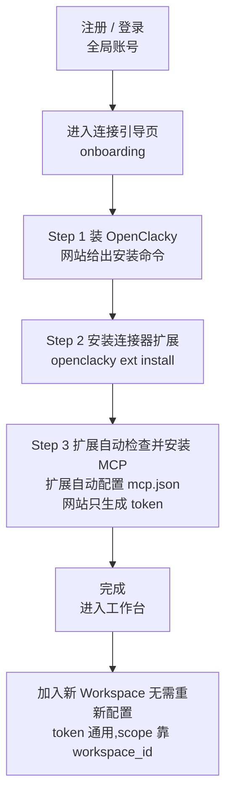
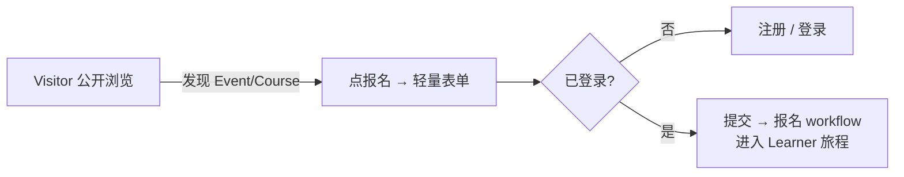
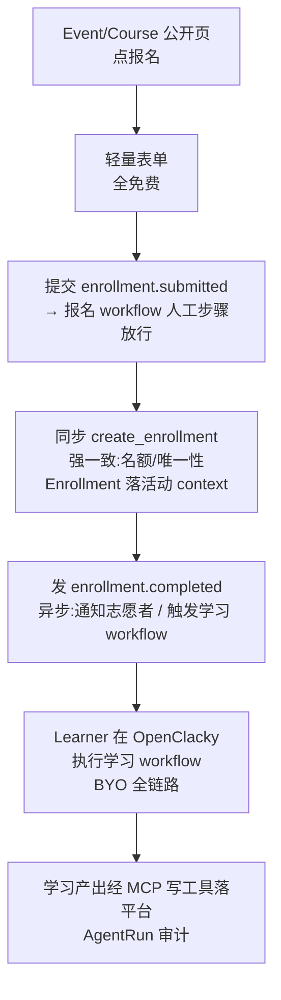
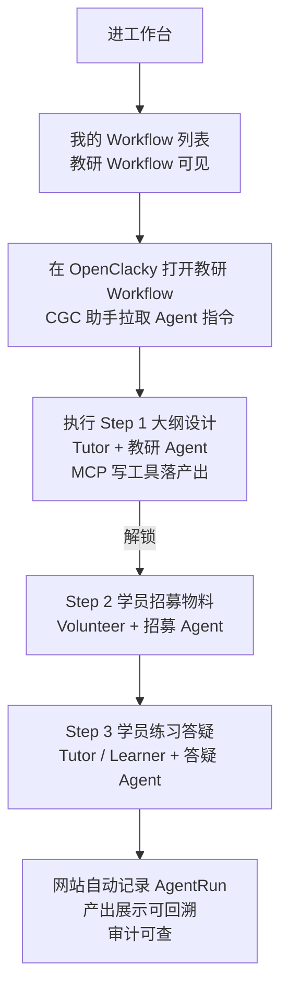
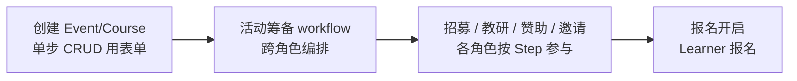
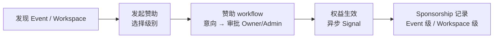
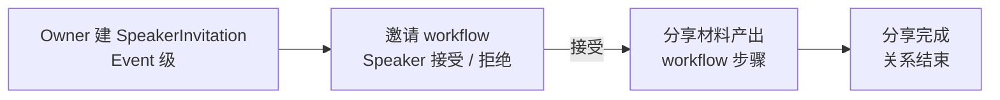
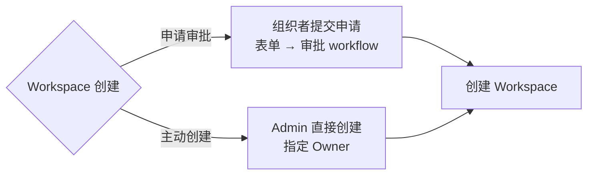
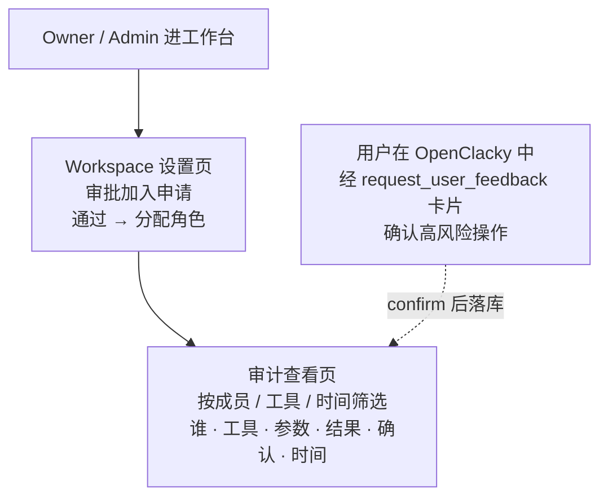

# 用户旅程与 Web 功能清单(定稿)

> 日期:2026-08-01(修订) · 原稿:2026-07-31
> 状态:**8 角色旅程已定稿**(Learner / Tutor / Volunteer / Owner / Sponsor / Speaker / Admin / Visitor);结构决策更新(Workspace = 组织单元,Event/Course 挂其下);J0 简化三步(扩展自动配置 mcp.json);保持形态 X(D4):网站无对话/执行页,专注业务中枢
> 依赖:docs/01-定稿设计/领域模型定稿.md、docs/03-决策记录/grill-决策记录-2026-08-01.md(D-A 系列)、docs/04-引擎验证/workflow-engine-ddd-design.md
> v1.4 补充(2026-08-01,F7 审批超时方案 A 拍板):后台审批页展示 pending 剩余时间倒计时(`approval_deadline`)与 expired 已过期入口;关键权限补报名/赞助审批角色行(见 §3/§4)

---

## 0. 结构决策与形态 X(BYO,已确认)

### 0.1 结构决策(D-A 系列)

- **Workspace = 组织单元**(如"北京 CGC 分会"):租户单元,承载成员/角色/Workflow(D-A5)。
- **Event(场地形态:校园 / 咖啡厅 / 书店 / 联合办公空间)与 Course(线上课程)挂在 Workspace 下**。
- **Enrollment = 事件级参与者**(报名记录),归活动 context,**不自动成为 Workspace 成员**(D-A4)。

### 0.2 形态 X(BYO,已确认)

- 网站 = **业务中枢**:工作台、成员/角色、Workflow 产出展示、审批、审计查看(D4)。
- **无对话页 / 无执行页**:聊天与 Agent 执行全在用户自己的 OpenClacky,经 MCP 调用网站(D4/D5)。
- 用户首次使用前需完成 **BYO 连接引导**(J0,三步)。

---

## 1. 八角色旅程总览

| 角色 | 一句话旅程 | 与 Workspace 关系 | 关键 workflow | 产物落点 |
| --- | --- | --- | --- | --- |
| Visitor | 公开浏览 → 报名时注册登录 | 无(游客) | 报名 workflow(触发注册) | 账号 → Enrollment |
| Learner | 事件级报名 → BYO 全链路学习 | 非成员(Enrollment) | 报名 workflow + 学习 workflow | Enrollment / 学习产出 |
| Tutor | 教研 workflow 产出大纲材料 → 现场辅导 | 成员 | 教研 workflow | 大纲/材料(Step 产出) |
| Volunteer | Workspace 长期成员 → 指派到 Event 支持任务 | 成员 | 教研/筹备 workflow 支持步骤 | 招募物料/支持记录 |
| Owner | 筹备活动/开课程 = 跨角色 workflow;单步 CRUD 用表单 | 成员(创始) | 筹备/课程发布 workflow | Event/Course/审批记录 |
| Sponsor | Event+Workspace 两级赞助 | 赞助方(非成员) | 赞助 workflow | Sponsorship(两级) |
| Speaker | Event 级被邀请,分享完关系结束 | 非成员 | 邀请 workflow | SpeakerInvitation/分享材料 |
| Admin | 平台级治理;Workspace 创建 = 申请审批 + 主动创建两级 | 全局标记 | Workspace 创建/审批 workflow | Workspace/审批记录 |

---

## 2. User Journey

### J0 连接你的 OpenClacky(BYO Onboarding,一次性三步)



- **简化修订(D-A7)**:三步 = 装 OpenClacky → 装扩展 → 扩展自动检查并安装 MCP;**扩展负责自动配置 mcp.json**,网站只生成 token(取代 D13 步骤 2 的手动粘贴 mcp.json 片段)。
- 单一配置点 = **mcp.json**(由扩展自动写入 cgc-2046 条目:URL + token);token 绑**用户不绑工作区**,scope 靠 workspace_id。

### J1 加入一个 Workspace(两条路径;适用于成员角色 Owner/Admin/Tutor/Volunteer)

```mermaid
flowchart TD
    A[注册 / 登录<br/>全局账号] --> B{如何进入?}

    %% 路径 A:主动发现
    B -->|A. 主动发现| C[浏览公开 Club 列表<br/>发现页]
    C --> D[查看 Club 公开主页<br/>名称 / 简介 / 成员数]
    D --> E{该 Workspace 加入策略}
    E -->|open| F[点击加入<br/>直接成为成员<br/>分配默认 Learner 角色]
    E -->|request| G[提交 JoinRequest<br/>显示「申请审批中」中间态<br/>(原型验证结论 #1)]
    G --> H[Owner / Admin 审批<br/>通过后分配角色]
    %% invite_only 空间不可被发现,不会出现在发现页/公开主页,无需此分支;收到邀请链接后显示「待凭据加入」中间态(原型验证结论 #1)

    %% 路径 B:邀请链接
    B -->|B. 收到邀请链接| J[点击链接<br/>slug + UUID 末4位]
    J --> K{已登录?}
    K -->|否| A
    K -->|是| L[校验链接<br/>预览 Club 公开页]
    L --> M[确认加入]
    M --> N{链接带预授权角色?}
    N -->|是| O[直接按角色入座]
    N -->|否| P[由 Owner / Admin 分配]

    F & H & O & P --> Q[进入工作台<br/>看到被授权的 Workflow]
    Q --> R{已完成 J0 连接引导?}
    R -->|否| S[先跳转连接引导页<br/>三步 onboarding]
    R -->|是| T[可经 OpenClacky 开始干活]
```

### J-Visitor 游客:公开浏览与报名注册

- **目标**:浏览公开内容(Workspace/Event/Course),发现感兴趣的报名入口。
- **触发事件**:访问公开发现页 / 公开主页(Workspace 公开页、Event 列表、Course 列表)。
- **关键决策点**:公开浏览无需登录;**报名时注册登录**(轻量表单,全免费)。
- **跨角色 workflow 涉及步骤**:报名 workflow 的第 1 个人工步骤(表单提交 `enrollment.submitted`)。
- **产物落点**:全局账号(注册/登录)→ 后续报名进入 Learner 旅程。



### J-Learner 学员:事件级报名 + BYO 全链路学习

- **目标**:报名参与 Event/Course,在自己 OpenClacky 完成学习(全链路数字化)。
- **触发事件**:在 Event/Course 公开页点报名 → 轻量表单提交。
- **关键决策点**:
  - **Q1 事件级报名**:报名 = Enrollment(事件级参与者),**不自动成为 Workspace 成员**;成员(WorkspaceMembership)与参与者(Enrollment)两类关系并存。
  - **Q2 BYO 全链路**:报名、学习执行、答疑全在 Learner 自己的 OpenClacky,经 Signal 与平台通信。
  - **Q3 轻量表单 + 全免费**:报名不收费、不强制加入 Workspace。
- **跨角色 workflow 涉及步骤**:
  - 报名 workflow:表单提交(人工步骤)→ 同步 `create_enrollment`(强一致:名额/唯一性)→ 发 `enrollment.completed`(异步:通知志愿者、触发学习 workflow)。
  - 学习 workflow:教研 workflow 实例化到 Event/Course 后,学习段由 Learner 在 OpenClacky 执行,产出经 MCP 写工具落平台。
- **产物落点**:Enrollment 记录(活动 context);学习产出/练习答疑记录(Step 产出);AgentRun 审计。



### J-Tutor 教练:教研 Workflow 产出 + 现场辅导

- **目标**:组织教研,产出大纲与材料,活动现场辅导学员。
- **触发事件**:创建/发布教研 Workflow;或 Event/Course 教研任务开始。
- **关键决策点**:教研 workflow 产出大纲材料(Step 产出落网站);现场辅导 = 答疑步骤(Tutor + 答疑 Agent);教研 workflow 定义一次,被 Event/Course 实例化复用(D-A2)。
- **跨角色 workflow 涉及步骤**:教研 workflow(大纲设计(Tutor)→ 招募物料(Volunteer)→ 练习答疑(Tutor/Learner))。
- **产物落点**:大纲/材料(Workflow Step 产出,网站存);AgentRun 审计。



### J-Volunteer 志愿者:Workspace 长期成员 + 事件支持

- **目标**:作为 Workspace 长期成员,支持活动筹备与现场。
- **触发事件**:加入 Workspace(或收到邀请)→ 被 Owner 指派到 Event 支持任务。
- **关键决策点**:**长期成员**(WorkspaceMembership + 角色),不是事件级参与者;支持任务由指派产生。
- **跨角色 workflow 涉及步骤**:教研 workflow 招募物料步骤;活动筹备 workflow 支持任务步骤(按 Step 授权执行)。
- **产物落点**:招募物料 / 支持任务产出(Step 产出);可生成邀请链接(不得预授权 Admin 级角色)。

### J-Owner 组织者:筹备活动/开课程 = 跨角色 workflow

- **目标**:运营 Workspace,筹备活动、开设课程。
- **触发事件**:创建 Event/Course → 启动筹备/发布流程。
- **关键决策点**:
  - **跨角色 workflow**:筹备活动/开课程 = 多步编排的 workflow(跨 Owner/Volunteer/Tutor/Sponsor/Speaker 协作)。
  - **单步 CRUD 用表单**:单条增删改(如改活动时间)直接用表单,不进 workflow。
- **跨角色 workflow 涉及步骤**:活动筹备 workflow(创建 Event → 招募(Volunteer)→ 教研(Tutor)→ 赞助(Sponsor)→ 邀请(Speaker)→ 报名开启(Learner));课程发布 workflow。
- **产物落点**:Event/Course 记录;审批记录(JoinRequest/赞助/邀请);审计。



### J-Sponsor 赞助方:Event+Workspace 两级赞助

- **目标**:赞助活动或整个 Workspace,获得对应权益。
- **触发事件**:在 Event/Workspace 公开页发起赞助。
- **关键决策点**:**两级赞助** = Event 级(单场活动)+ Workspace 级(长期);赞助方以账号身份参与**赞助 workflow**,不必成为成员。
- **跨角色 workflow 涉及步骤**:赞助 workflow(赞助意向(人工步骤)→ 审批(Owner/Admin)→ 权益生效(异步 Signal))。
- **产物落点**:Sponsorship 记录(Event 级 / Workspace 级);权益。



### J-Speaker 分享嘉宾:Event 级邀请,分享完关系结束

- **目标**:在 Event 分享,结束后关系结束。
- **触发事件**:Owner 创建 SpeakerInvitation(Event 级)→ 邀请。
- **关键决策点**:Event 级被邀请(不成为 Workspace 成员);**分享完关系结束**。
- **跨角色 workflow 涉及步骤**:邀请 workflow(邀请(人工步骤)→ 接受/拒绝(Signal)→ 分享材料产出(workflow 步骤)→ 结束)。
- **产物落点**:SpeakerInvitation 记录;分享材料(Step 产出)。



### J-Admin 平台管理员:Workspace 两级创建

- **目标**:平台级治理,创建/审批 Workspace。
- **触发事件**:收到 Workspace 创建申请;或主动创建。
- **关键决策点**:**两级创建** = ① 申请审批(组织者提交 → Admin 审批 → 创建)② 主动创建(Admin 直接创建 + 指定 Owner)。
- **跨角色 workflow 涉及步骤**:Workspace 创建/审批 workflow(表单提交 → 审批 → 创建 Workspace → 指定 Owner)。
- **产物落点**:Workspace 记录;审批记录;审计。



### J-审批与审计查看(业务中枢,通用)



- **报名/赞助审批（v1.4/F7 方案 A 补充）**：Owner/Admin 在「后台审批页」（报名管理/赞助管理）处理 pending 申请；列表展示**审批剩余时间倒计时**（`approval_deadline`，剩余 <48h 高亮）+ **expired 已过期入口**（超时记录含过期时间，不可直接通过/拒绝，申请者/赞助方重新提交）。
- 确认流语义(D8):「确认写入」→ confirm 落库;「继续讨论」→ pending 保留(可再次 confirm 或超时清理);仅当用户在 WebUI 明确取消/关闭时才置 rejected。

---

## 3. Web 页面清单(第一版)

| 页面 | 说明 | 可访问角色 |
| --- | --- | --- |
| 注册/登录页 | 全局账号;Visitor 报名时注册登录 | 所有人 |
| 连接引导页(Onboarding) | 三步:装 OpenClacky → 装扩展 → 扩展自动检查并安装 MCP(自动配置 mcp.json;网站只生成 token) | 登录用户(首次) |
| 连接设置页 | 生成/撤销每用户 MCP 连接 token(绑用户不绑工作区) | 登录用户(仅本人) |
| 公开发现页 | 浏览公开 Workspace(Club)/Event/Course 列表 | 游客/登录用户 |
| 公开主页(Workspace/Event/Course) | 名称/简介/成员数(Club)/场地形态(Event)/加入或报名入口 | 游客 |
| Event 报名页 | 轻量表单 + 全免费;提交 → 报名 workflow(Enrollment) | Visitor/Learner |
| 赞助发起/展示页 | 发起两级赞助(Event/Workspace)+ 赞助 workflow 状态展示(只读) | Sponsor/Owner/Admin |
| 工作台选择页 | 我的 Workspace 列表 + 平台管理员入口 | 成员/平台管理员 |
| Workspace 设置页 | 成员管理(授角色)/申请审批/角色管理/邀请链接管理/加入策略/Event 与 Course 管理;**加入策略三态 + 成员中间态 UI 区分:request 申请显示「申请审批中」、invite_only 受邀显示「待凭据加入」,不能只显示三态徽章(原型验证结论 #1);加入策略标准文案:开放加入 / 申请制 / 邀请制 + 一句 hint(如「任何人都可加入 / 提交申请后由管理员审批 / 凭邀请链接或批次码加入」)(原型验证结论 #2)** | Owner/Admin |
| 后台审批页（报名管理/赞助管理） | 报名/赞助 pending 审批列表：**v1.4/F7 方案 A 新增——pending 行展示审批剩余时间倒计时（`approval_deadline`，剩余 <48h 高亮）+ \"已过期\"筛选/入口（expired 记录含过期时间，不可直接通过/拒绝，申请者重新提交）**；通过/拒绝动作（approver 审计写回）。**waiting 状态显著区分（原型验证结论 #4）：waiting/pending 用琥珀/青色脉冲视觉 + 审批剩余倒计时（approval_timeout 字段驱动），v1.4 审批超时机制在 UI 层的对应表达** | Owner/Admin（Event 级）；Workspace 级赞助仅 Owner |
| 公共 Agent 列表/详情 | 建/编辑/停用/删除 + 授权角色 + OpenClacky 配置引用(openclacky_profile/model/system_prompt/skills) | Owner/Admin/Tutor |
| Workflow 产出展示页 | 当前用户可执行的 Step + 各 Step 产出/AgentRun 记录;\"在 OpenClacky 中执行\"引导入口;**Step 产物展示采用 schema 驱动 key-value 渲染(不手工排版),与 WorkflowDefinition/Step 的产物 schema 字段对齐(原型验证结论 #3)** | 按 Step 授权 |
| 报名/赞助流程展示页 | 报名 workflow / 赞助 workflow 当前状态与所处步骤(只读展示,不执行) | 参与者本人/Owner/Admin |
| 审计查看页 | 工具调用审计(谁/工具/参数/结果/确认/时间)+ AgentRun 聚合;可筛选 | Owner/Admin 看 workspace 全量;成员看本人 |
| 成员 Profile 页 | 公开资料(头像/简介/作品) | 成员 |
| 平台管理后台 | 创建 Workspace(申请审批 + 主动创建)+ 指定 Owner | 平台管理员 |

说明:

- **形态 X(D4)**:无"Workflow 执行页"、无"Agent 对话页"——执行与聊天全在用户自己的 OpenClacky;网站只做业务中枢与产出/审计展示
- **workflow 展示页(报名流程、赞助流程)为只读展示**(D-A 系列):显示 workflow 当前状态/所处步骤/产物,不提供执行;执行与推进在用户 OpenClacky 经 MCP/信号完成
- Workflow 构建不做独立 UI 页面:用户在 OpenClacky 中经 CGC 助手构建,经 MCP `create_workflow` 部署为 Workspace 的 Workflow
- 个人设置页:并入注册/账号体系,二期再补
- **审计查看页为 v1**(D6/D9:每次 MCP 工具调用 = 审计记录),不再二期
- 页面随开发过程按需增减
- **PROTOTYPE 浮动栏生产隐藏（原型验证结论 #5，工程约束）**：原型阶段使用的 PROTOTYPE 浮动栏为原型专用，生产构建（M3 前端）自动隐藏/移除，正式版不出现；原型结论回填本文档后，浮动栏仅用于原型迭代，不作为正式功能

---

## 4. 关键权限补充

| 操作 | 允许角色 |
| --- | --- |
| 创建 Workspace + 指定 Owner(主动创建 / 审批申请) | 仅平台管理员(is_platform_admin);组织者可提交申请 |
| 设置/修改加入策略 | Owner/Admin（#78 拍板口径；平台管理员亦保留） |
| 审批加入申请(request 空间) | Owner/Admin |
| 审批报名申请(request 策略) | Owner/Admin of 活动所属 Workspace |
| 审批赞助意向 | Event 级:Owner/Admin of 目标 Workspace;Workspace 级:仅 Owner |
| 创建/编辑 Event 与 Course(挂 Workspace 下) | Owner(组织者) |
| 指派 Volunteer 到 Event 支持任务 | Owner |
| 发起赞助(Event 级/Workspace 级) | Sponsor(账号);审批:Owner/Admin |
| 创建 SpeakerInvitation(Event 级) | Owner |
| 用 Agent 构建 Workflow + 部署进 Workspace | Owner/Admin/Tutor(同"创建 Workflow"矩阵) |
| 生成邀请链接 | Owner/Admin/Volunteer;Volunteer 的链接不可预授权 Admin 级角色 |
| 生成/撤销 MCP 连接 token | 登录用户(仅本人,D13:绑用户不绑工作区) |
| 查看审计 | Owner/Admin 看 workspace 全量;成员仅本人(D6/D9) |
| 确认高风险 MCP 操作 | 操作发起者本人(经 OpenClacky 卡片,D8) |
