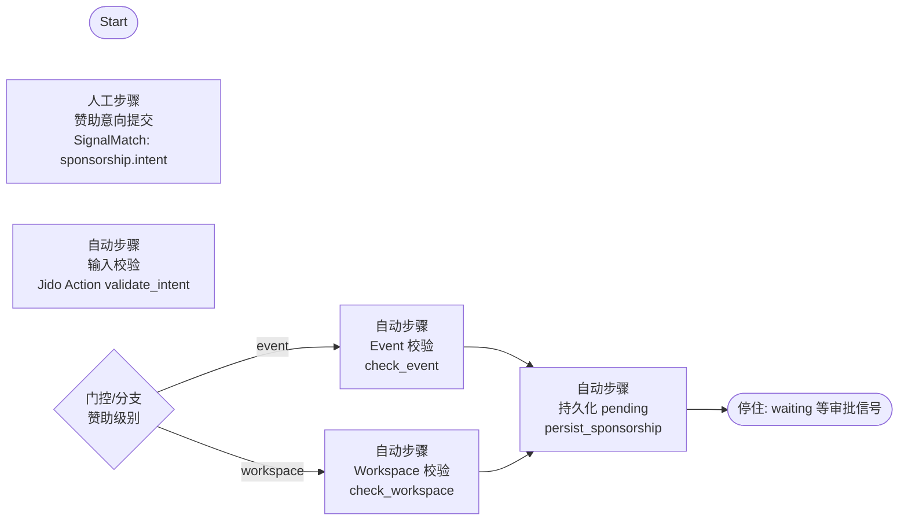
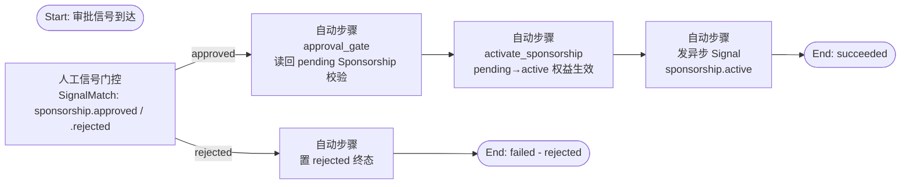
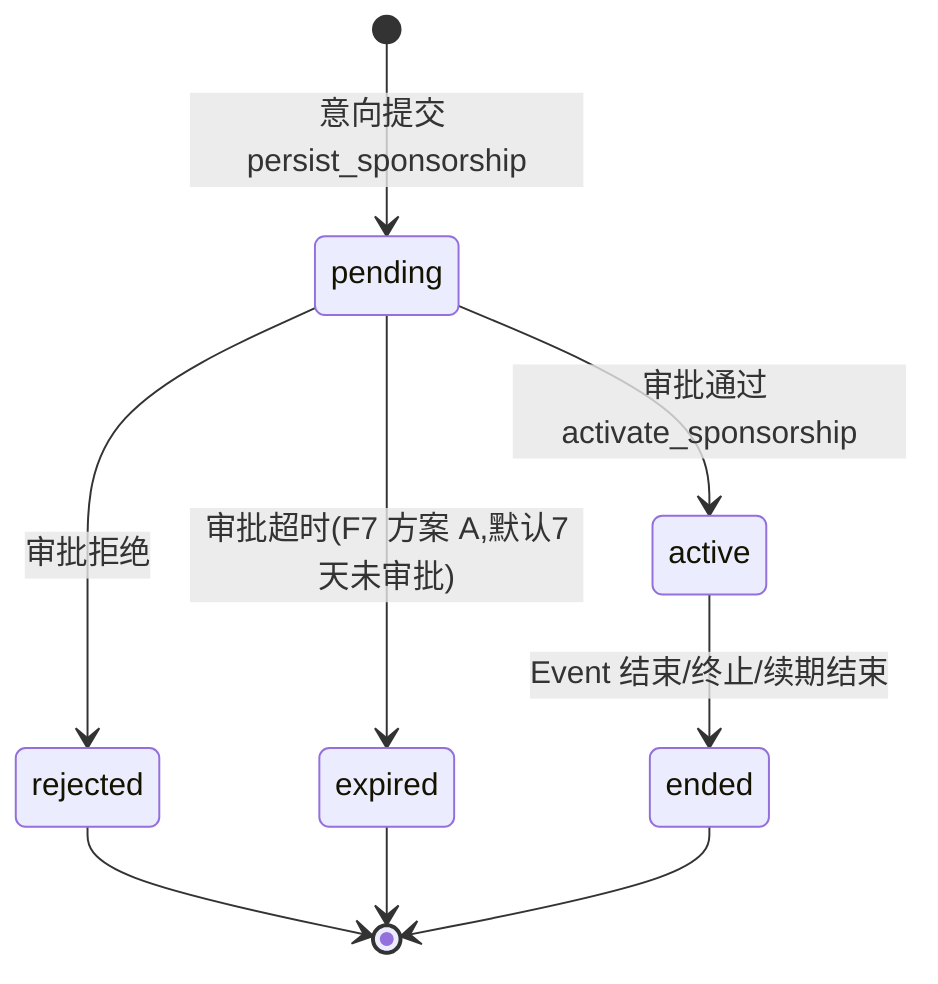

# 赞助 Workflow 详细设计（平台第二个业务 workflow）

> 日期：2026-08-01 ｜ 作者：领域建模工程师（worker_f150e10b） ｜ 状态：**v1.2 定稿（9 项开放问题拍板 + F7 审批超时拍板已落地，见 §7 与附 B）**
> 依据：`docs/01-定稿设计/领域模型定稿.md`（§4 引擎 context、§5 ER、§8 审计）、`docs/01-定稿设计/用户旅程与Web功能清单.md`（J-Sponsor）、`docs/03-决策记录/grill-决策记录-2026-08-01.md`（D-A3 Sponsor 角色、D-A5 partition、D-A6 同步/异步）、`docs/01-定稿设计/报名workflow详细设计.md`（v1.4，模板与 POC 实证来源）、`docs/03-决策记录/开放问题决策清单.md`（F7 审批超时拍板）
> 定位：第二个要落地的业务 workflow——Sponsor（非成员账号）在 Event/Workspace 公开页发起赞助，两级赞助 = Event 级（单场）+ Workspace 级（长期），审批后权益生效。
> **模板复用说明**：本设计复用报名 workflow 的全部模式结论（审批两段式、SignalMatch 门控、幂等承载 Postgres/Redis、partition + Thread journal 审计、hibernate/thaw 持久化），不再重复论证，只标注差异与复用点（§8）。

---

## 1. 触发与上下文

### 1.1 谁发起

- **触发人**：Sponsor（**非成员账号**，D-A3）→ 在 Event 公开页（单场赞助）或 Workspace 公开页（长期赞助）点「赞助我们」→ 赞助意向表单 → 已登录? 否→注册/登录（**全局账号**，不成为 Workspace 成员）→ 是→提交 → 进入 **J-Sponsor** 旅程。
- **Sponsor 是否需要账号：需要（全局账号）**——赞助是持续业务关系（权益展示、续期、开票等），不能匿名；但**不自动成为 Workspace 成员**（与 Enrollment 同理，D-A3/D-A4 语义扩展）。
- **关键语义**：Sponsorship（赞助关系）与 WorkspaceMembership 互不替代；赞助方以账号身份参与赞助 workflow，权益生效后以「赞助方」身份展示（非成员）。

### 1.2 上下文：Event 级 vs Workspace 级

| 维度 | Event 级（单场） | Workspace 级（长期） |
|---|---|---|
| 入口 | Event 公开页「赞助本场」 | Workspace 公开页「赞助我们」 |
| 目标 | 单场活动的赞助（品牌曝光/场地/物料等） | 整个 Workspace 长期赞助（持续合作） |
| 生命周期 | 随 Event 存续（Event 结束后关系结束） | 随 Workspace 存续（长期，可续期/终止） |
| 归属 context | 活动 context（Event） | Workspace context |
| 审批人 | 活动所属 Workspace 的 Owner/Admin | **仅 Owner**（长期承诺加严，拍板 #4；平台 Admin 备案二期） |
| 权益展示位 | Event 公开页/报名页 | Workspace 公开页/品牌位 |

- **partition 归属（关键）**：Sponsorship 无论 Event 级还是 Workspace 级，其 WorkflowRun **都归该 Workspace 的 Jido partition**（D-A5：Workspace = partition）。Event 级赞助的 Event 属于该 Workspace → 归同一 partition；Workspace 级赞助天然归该 partition。即：**Sponsorship 归活动/Workspace 所属 Workspace 的 partition**，与报名 workflow 一致（WorkflowRun.partition_id = workspace_id）。
- 领域模型定稿 §5.1：Sponsorship 实体 `level: event|workspace`、`event_id`（Event 级）/ `workspace_id`（Workspace 级）、`sponsor_user_id`（赞助方全局账号，非成员）、`tier_id`（关联 SPONSORSHIP_TIER，可选）/ `tier_name`（档位展示名冗余）、`status`（pending|active|rejected|ended）、意向登记字段（`amount/company_name/contact_email/contact_phone`）、审批审计字段（`approved_by/approved_at/rejection_reason`）、`workflow_run_id`（关联来源 run）。

### 1.3 赞助策略/入口（Event/Workspace 级属性）

- 赞助入口是否开放由 Event/Workspace 属性控制：
  | 属性 | 取值 | 说明 |
  |---|---|---|
  | `sponsorship_enabled` | boolean | 是否开放赞助入口（默认 Event 开、Workspace 开） |
  | `sponsorship_tiers` | json | 赞助档位配置实体 **SPONSORSHIP_TIER**（如「基础/标准/冠名」，各档**名称/建议金额/权益项列表**：logo 展示位、报名页露出、鸣谢页、现场物料位；Sponsorship 关联 `tier_id`，拍板 #3） |
  | `sponsorship_deadline` | datetime|null | 赞助意向截止（Event 级建议在活动开始前；Workspace 级可空=长期开放） |
- v1 主路径 = **意向提交 + 审批 + 权益生效**；**不收款**（见 §3.3 资金边界）。

---

## 2. WorkflowDefinition 定义

### 2.1 DAG 总览（审批两段式，与报名同构）

> **POC 实证结论（直接复用）**：request 式人工审批必须走**审批两段式**（业务异步审批需要 + Agent 策略层 join 死锁缺陷未修复前的架构层规避；Agent 层单 DAG join 两个异步信号死锁，POC §3.3；规避 PASS §3.4）。赞助 workflow 含两个人工信号等待（意向 + 审批）→ **必须审批两段式**，与报名 request 策略同构。

**赞助段（Intent 段，Event 级与 Workspace 级共用）**



**审批段（Approval 段，两级共用，参数化审批目标）**



- **与报名审批段的差异**（§3.4 详述）：报名 A3 是 pending→confirmed **扣名额**；赞助 A3 是 pending→active **生效权益**（无并发扣减；幂等点在"同一 sponsor 不重复生效"）。
- **Step 四分类归属**：S1/A1 = 人工步骤（信号门控）；S2/S4/S5/P1/A2/A3/A4/A5 = 自动步骤；S3 = 门控/分支。
- **为什么拆两段**：与报名相同——两个人工信号等待不能同 DAG（POC 死锁）；Sponsorship 实体先落 DB（pending）停住，审批信号触发独立分支读回持久化结果再生效。

### 2.2 Step 明细（输入/输出 schema、四分类、StepRole）

**赞助段 Steps**

**S1 人工步骤：赞助意向提交（`sponsorship.intent`）**
- 分类：人工步骤（SignalMatch 门控）
- 输入 schema：
  ```json
  {
    "level": "event | workspace",
    "event_id": "uuid | null",        // level=event 时必填
    "workspace_id": "uuid | null",    // level=workspace 时必填
    "sponsor_user_id": "uuid",        // 赞助方（注册/登录后的全局账号）
    "company_name": "string",         // 赞助方展示名/公司名
    "contact_email": "string",
    "contact_phone": "string|null",
    "tier_id": "uuid|null",            // 意向档位（关联目标 Workspace 配置的 sponsorship_tiers，可选，拍板 #3）
    "amount": "decimal|null",         // 意向金额（可选，v1 仅登记不收款）
    "message": "string|null"          // 备注/合作意向
  }
  ```
- 输出：把输入快照写入 WorkflowRun（`input_snapshot`），无业务产物
- StepRole：执行角色 = **anyone**（公开入口；未登录 → 先注册/登录全局账号）
- 信号：网站公开页「赞助」表单提交 → 发 `sponsorship.intent` → SignalMatch 放行（见 §3.1）

**S2 自动步骤：输入校验（`validate_intent`）**
- 分类：自动（Jido Action）
- 输入：S1 快照
- 逻辑：schema 校验（level 必填、event_id/workspace_id 与 level 匹配、联系方式必填）；检查 sponsor_user 有效账号、Event/Workspace 存在且 `sponsorship_enabled = true`；**唯一性预检**（该 sponsor 是否已有该 event/workspace 的非终态 Sponsorship——最终唯一性由 P1 同步 Action 强保证）
- 输出：`validated_payload`（规范化后的赞助意向数据）

**S3 门控/分支：赞助级别路由**
- 分类：门控/分支
- 输入：level
- 逻辑：event → S4；workspace → S5

**S4 自动步骤：Event 校验（`check_event`，Event 级）**
- 分类：自动（Jido Action）
- 输入：event_id
- 逻辑：Event 存在、`sponsorship_enabled = true`、未过 `sponsorship_deadline`（若配）、状态 open/筹备中
- 输出：`event_ok: boolean`；false → run failed（回执"本场暂未开放赞助"）

**S5 自动步骤：Workspace 校验（`check_workspace`，Workspace 级）**
- 分类：自动（Jido Action）
- 输入：workspace_id
- 逻辑：Workspace 存在、`sponsorship_enabled = true`
- 输出：`workspace_ok: boolean`；false → run failed

**P1 自动步骤：持久化 pending（`persist_sponsorship`，两级共用）**
- 分类：自动（Jido Action，经 **ash_jido** 同步调 Ash Action）
- 输入：validated_payload + level + target（event_id/workspace_id）+ sponsor_user_id + workflow_run_id
- 逻辑：**同步、强一致**创建 Sponsorship（status=pending）落 DB 后**停住**（run 置 waiting，等审批信号）；**pending 不生效权益**（权益在审批通过 A3 时生效）；唯一性约束 `(level, target_id, sponsor_user_id)` 在此处 DB 兜底（同一 sponsor 同一目标同一 level 不重复）
- 输出：`sponsorship_id`（pending）
- 为什么：与报名 P1 同构（POC §3.4 审批两段式 PASS）——两个人工信号等待不能同 DAG，赞助段到此停住，审批段独立启动

**审批段 Steps（两级共用，A1 审批目标由 pending Sponsorship 决定）**

**A1 人工信号门控：审批（`sponsorship.approved` / `sponsorship.rejected`）**
- 分类：人工步骤（SignalMatch 门控，**独立审批段**，不是赞助段内节点）
- 输入：审批信号（level、event_id/workspace_id、sponsor_user_id、sponsorship_id、approver_id、approved_at、可选 rejection_reason）
- 逻辑：Owner/Admin 在**网站后台审批页**（活动/Workspace 管理后台 → 赞助管理 → pending 列表 → 通过/拒绝，模式同报名 §3.5，见 §3.4）发 `sponsorship.approved` / `sponsorship.rejected` → 触发审批段独立 run/分支。**非 MCP 管理类工具，不复用 D8 确认流**（与报名 #3 同决策）
- **审批超时（v1.2 F7 方案 A）**：pending 挂起登记 `approval_deadline`（= created_at + `approval_timeout`，默认 7 天，可配置，null=无超时）；超时由 F2 deadline 唤醒机制触发（hibernate 恢复检查 + Schedule Directive）→ run 转 cancelled/failed（reason=approval_timeout）+ Sponsorship 置 `expired`（≠ rejected，可重提）；deadline 前 48h 提醒审批人
- StepRole：**Event 级 = Owner/Admin；Workspace 级 = 仅 Owner**（拍板 #4：长期承诺加严；审批人属目标所属 Workspace；网站 API 校验 + A2 引擎侧兜底）
- 输出：审批结果（approved/rejected/expired）+ 审计字段（approver_id / approved_at / rejection_reason，写回 Sponsorship + Thread journal）
- ⚠️ POC 结论：审批信号不能与意向信号同 Agent workflow join（死锁）；审批段读回 DB 持久化的 pending Sponsorship

**A2 自动步骤：审批门（`approval_gate`，读回 pending）**
- 分类：自动（Jido Action）
- 输入：approved 信号 + sponsorship_id
- 逻辑：**读回 DB 中 pending 的 Sponsorship**（POC §3.4 审批两段式规避模式），校验：sponsorship 仍 pending（**未 expired**）、目标 Event/Workspace 仍有效（enabled 未关闭）、审批人有权限（Owner/Admin of 目标 Workspace）
- 输出：`approvable_payload`（含 sponsorship_id、level、target_id、sponsor_user_id、tier、amount）

**A3 自动步骤：生效权益（`activate_sponsorship`）——核心写（两级共用）**
- 分类：自动（Jido Action，经 ash_jido 同步）
- 输入：approvable_payload
- 逻辑：事务内把 Sponsorship pending→active，写 `approved_by/approved_at`；**无并发扣减**（v1 不限额，拍板 #1；`tier.limit` 字段预留二期启用——启用后 active 计数 < limit 时 A3 事务内校验，同报名名额扣减机制）；幂等：Sponsorship 状态机保证只 activate 一次；重复 approved 信号 → 已 active 则跳过
- 输出：`sponsorship_id`（active）
- 权益生效点：状态置 active 即权益生效（展示位可见）；具体权益内容（logo/文案/位置）由异步 Signal 接收方应用（A5）

**A4 自动步骤：置 rejected（`reject_sponsorship`）**
- 分类：自动（Jido Action）
- 输入：rejected 信号 + sponsorship_id
- 逻辑：事务内把 Sponsorship pending→rejected，记 `approved_by/approved_at` + `rejection_reason`；run 终态 failed - rejected
- 输出：`sponsorship_id`（rejected）

**A5 自动步骤：发异步 Signal（`sponsorship.active`，生效后）**
- 分类：自动（Jido Directive.Emit）
- 输入：sponsorship_id + level + target_id + sponsor_user_id
- 逻辑：发 `sponsorship.active`（CloudEvents）→ 衍生副作用（权益展示更新、通知、开票登记等，见 §4.2）
- 输出：无（异步）

### 2.3 版本与部署

- WorkflowDefinition 元数据：`id/name/type=sponsorship/version/input_schema/node_def`（同报名 §2.3）。
- 每个 Workspace 默认内置一份「赞助 workflow」模板（平台运维模板，D 草案 B：Admin/Owner 设计）；也可由 Owner 定制版本部署。
- 一个赞助意向 = 一个 run（v1 粒度）；run 持定义版本快照（D-A2）。
- 创建入口：v1 建议**网站内置模板**（公开页「赞助」按钮触发实例化 run），不做自定义 DAG 构建 UI（形态 X，D4）。

---

## 3. 人工步骤模式（SignalMatch 门控 + 审批两段式）

> 复用报名 §3 全部结论：Workflow 层（runic 直接驱动）单信号等待 PASS（POC §3.2）；Agent 层（jido_runic strategy auto）两个异步信号 join 死锁（POC §3.3）；本 workflow 含两个人工信号（意向 + 审批）→ **必须 审批两段式**。

### 3.1 意向提交如何映射为 SignalMatch 门控

- 网站公开页「赞助」表单提交 → 发 `sponsorship.intent`（CloudEvents，source=网站赞助页，subject=event_id/workspace_id，data=表单字段）。
- 赞助段 run 执行到 S1 → **waiting** 挂起，SignalMatch 监听 `sponsorship.intent`（`sponsorship.*` 前缀路由到本 run）。
- 信号到达 → 校验 source/subject 与 run 上下文匹配（level/target/sponsor_user_id）→ 放行 → 恢复执行 S2。
- **hibernate/thaw**：长等待（审批可能数天）→ hibernate 落 checkpoint；信号到达 thaw 恢复（POC-2 G1 已验证，报名 §7 #9）。

### 3.2 审批必须走 审批两段式（POC 实证，同报名 §3.2）

- **为什么不能单 workflow join**：意向 `sponsorship.intent` + 审批 `sponsorship.approved/rejected` 两个人工信号等待 → Agent 层 join 死锁（POC §3.3 双向证明）。
- **规避方案（POC §3.4 PASS，Leader 已批准）**：
  1. **赞助段**：`sponsorship.intent` → validate → `persist_sponsorship`（写 DB pending 后**停住**）；
  2. **审批段**：`sponsorship.approved` 信号触发**独立分支** → `approval_gate`（读回 DB pending）→ `activate_sponsorship`（pending→active）→ `sponsorship.active` 异步通知。
- **与真实业务一致**：Sponsorship 实体存 DB，审批是更新实体状态（pending→active/rejected），不是重放赞助流程；审批段可独立重试/补发。

### 3.3 资金边界（重要，v1 明确不收款）

- **v1 只做意向 + 审批 + 权益生效，不收款**：S1 表单中的 `amount` 仅登记意向金额（可选），不做支付、不开票、不校验到账。
- 审批通过后 `sponsorship.active` 信号可带 amount 给订阅方（如财务登记），但**v1 不做支付集成**（无 Stripe/支付宝等）。
- **收款/支付 workflow 属二期**：若未来接支付，Sponsorship 状态机需插入 `payment_pending → paid` 状态（在 active 前），审批通过后先发 `sponsorship.payment_required` → 收款成功 → 再 activate；此路径 v1 不设计（开放问题 §7 #2）。
- 权益生效基于**意向审批**（信任制）：v1 假设审批即权益生效，不校验资金到账。

### 3.4 人工审批建模：与报名审批段的差异

| 维度 | 报名审批段（request 策略） | 赞助审批段（两级共用） |
|---|---|---|
| 待审实体 | Enrollment（pending） | Sponsorship（pending） |
| 审批通过动作 | pending→confirmed + **原子扣名额**（并发约束） | pending→active + **生效权益**（无并发扣减） |
| 并发/幂等点 | 名额不超卖（count < capacity） | 不重复生效（状态机 + 唯一索引 `(level, target_id, sponsor_user_id)`） |
| 审批人 | Owner/Admin of 活动所属 Workspace | Event 级 = Owner/Admin of 目标 Workspace；**Workspace 级 = 仅 Owner**（拍板 #4：长期承诺加严；平台 Admin 备案二期） |
| 审批入口 | 网站后台审批页（报名管理） | 网站后台审批页（赞助管理，pending 列表含 sponsor 公司/联系方式/档位/意向金额 → 通过/拒绝） |
| 审批后 Signal | enrollment.completed | sponsorship.active |
| 审批超时（v1.2 F7 方案 A） | `approval_timeout` 默认 7 天 → Enrollment 转 `expired`（≠ rejected，可重提） | 同：`approval_timeout` 默认 7 天 → Sponsorship 转 `expired`（≠ rejected，可重提） |
| 审计 | approver_id/approved_at → Enrollment + Thread journal | 同左（Sponsorship + Thread journal） |

- 两级赞助的流程差异：**仅审批目标与权限范围不同**（Event 级审批单场、Workspace 级审批长期），Step 结构与审批两段式完全同构——用 `level` 参数化审批目标，不拆两个 workflow。

---

## 4. 跨 context 边界（同步 vs 异步）

> 复用报名 §4 结论（D-A6 8:2；依赖方向 workflow → 业务 Action 接口；幂等承载 Postgres/Redis）。

### 4.1 同步调用：`persist_sponsorship`（P1）与 `activate_sponsorship`（A3）

- **调用方**：P1/A3（workflow 引擎 context）→ 经 ash_jido 编译期桥接 → 业务 context 的 `Sponsorship.create` / `Sponsorship.update` Ash Action。
- **POC 已验证（验证项 3 PASS）**：约束/唯一/立即可读；⚠️ Ash 3.31 业务字段需 `public?: true`；Ets identity 需 `pre_check_with`（生产 Postgres 原生唯一索引）。
- **强一致保证**（业务 Action 事务内）：
  1. **唯一性**：`(level, event_id/workspace_id, sponsor_user_id)` 唯一索引，DB 防重复赞助（同一 sponsor 同一目标不重复）。
  2. **状态约束**：目标 Event/Workspace `sponsorship_enabled = true`、未过 deadline（Event 级）；sponsor 有效账号。
  3. **无名额扣减**：赞助不限数量（v1 不限额，拍板 #1；`tier.limit` 二期启用）；若 S1 提交 `tier_id` → 校验 tier 存在且属于目标 Workspace 的 `sponsorship_tiers`（拍板 #3）。
- **失败语义**：Action 错误 → P1/A3 抛失败 → run failed；不落 Sponsorship（或落 cancelled 留痕）。
- **幂等**：见 §4.3。

### 4.2 异步 Signal：`sponsorship.active`（衍生副作用）

- **发送方**：A5（引擎）→ `sponsorship.active`（CloudEvents：source=workflow run，subject=sponsorship_id，data={level, event_id/workspace_id, sponsor_user_id, amount|null}）。
- **POC 已验证（验证项 4 + POC-2 G2 B1-B3 PASS）**：Signal Bus + signal_routes 异步触发衍生动作；journal 重放补齐 + 幂等键去重。
- **接收方/订阅方**（业务 context 各自订阅，松耦合）：
  | 订阅方 | 动作 |
  |---|---|
  | 权益展示 | Event/Workspace 公开页展示赞助方（logo/名称/档位，按 tier 渲染） |
  | 报名页露出（Event 级） | 报名页展示赞助位（若有） |
  | 通知 | 通知 Sponsor（赞助已生效）与 Workspace 运营（新赞助生效） |
  | 财务登记（v1 可选） | 登记意向金额到台账（不收款，见 §3.3） |
- **最终一致**：展示/通知允许短暂延迟；核心 Sponsorship 状态由同步路径保证（A3 已落库）。
- **幂等键建议**：Signal `data.idempotency_key = "sponsorship.active:" + sponsorship_id`；订阅方按 key 去重。

### 4.3 幂等键建议

| 层 | 幂等键 | 说明 |
|---|---|---|
| 表单提交（S1 信号） | `(level, target_id, sponsor_user_id)` + 客户端 `request_id` | 防双击/网络重试创建多个 run；已有非终态 run 则复用 |
| persist_sponsorship（P1 Action） | 业务唯一索引 `(level, target_id, sponsor_user_id)` 兜底；Action 幂等：重复调用返回既有 sponsorship | 防 run 重放重复建 Sponsorship |
| activate_sponsorship（A3 Action） | 状态机（pending→active 只一次）；重复 approved 信号 → 已 active 跳过 | 防重复生效 |
| sponsorship.active（A5 信号） | `"sponsorship.active:" + sponsorship_id` | 订阅方去重，防重复展示/通知 |

- **重试策略**：P1/A3 失败（唯一冲突/目标无效）→ run failed（终态，不自动重试）；网络类瞬时错误 → 引擎重试 N 次。异步 Signal 投递失败 → Jido 重发（幂等键保证安全）。
- **幂等键承载约束（POC-2 G2 B3 关键发现，落地硬约束）**：幂等键去重表**不得由 action 进程自建 ETS**（进程退出后 named table 销毁 → 幂等失效）；生产用 **Postgres 唯一约束**（`signal_idempotency` 表 `(signal_type, idempotency_key)` 唯一）或 **Redis**（SETNX/EXPIRE）。**与报名 workflow 共用同一张 `signal_idempotency` 表**（横向复用点，§8）。

---

## 5. 产物与状态

### 5.1 Sponsorship 实体字段草案

```json
{
  "id": "uuid",
  "level": "event | workspace",
  "event_id": "uuid | null",          // level=event
  "workspace_id": "uuid | null",      // level=workspace
  "sponsor_user_id": "uuid",          // 赞助方（全局账号）
  "workflow_run_id": "uuid",          // 来源赞助 workflow run
  "status": "pending | active | rejected | ended | expired",
  "tier_id": "uuid | null",            // 意向档位（关联 SponsorshipTier，拍板 #3）
  "tier_name": "string | null",        // 档位展示名（冗余，审批页/展示用）
  "amount": "decimal | null",         // 意向金额（v1 仅登记不收款）
  "company_name": "string",           // 展示名
  "contact_email": "string",
  "contact_phone": "string | null",
  "approved_by": "uuid | null",       // 审批人
  "approved_at": "datetime | null",
  "approval_deadline": "datetime | null",  // 审批超时截止（pending 时 = created_at + approval_timeout；null = 无超时；v1.2 F7 方案 A）；**UI 层 waiting 状态显著区分（原型验证结论 #4）：琥珀/青色脉冲 + 剩余倒计时（同报名 §3.4/§5.1）**
  "expired_at": "datetime | null",    // 审批超时自动过期时间（expired 终态落点；v1.2 F7 方案 A）
  "rejection_reason": "string | null",
  "started_at": "datetime",           // 生效开始（active 时间）
  "ended_at": "datetime | null",      // 结束（Event 结束/终止）
  "created_at": "datetime",
  "updated_at": "datetime"
}
```

- 归属：Event 级归活动 context（event_id），Workspace 级归 Workspace context（workspace_id）；**partition 均为目标所属 Workspace**（§1.2）。
- 唯一索引：`(level, event_id, sponsor_user_id)` 与 `(level, workspace_id, sponsor_user_id)`（实现时单列 target_type+target_id 或双索引二选一，同报名 §7 #7 决策）。

```json
// SPONSORSHIP_TIER 实体（Workspace 级配置，拍板 #3）
{
  "id": "uuid",
  "workspace_id": "uuid",
  "name": "string",                     // 档位名（基础/标准/冠名）
  "amount_suggestion": "decimal | null",// 建议金额（v1 仅登记不收款）
  "benefits": ["string"],               // 权益项列表（logo 展示位/报名页露出/鸣谢页/现场物料位）
  "limit": "integer | null",            // 限量（null = 不限；二期启用校验，拍板 #1）
  "enabled": "boolean",
  "created_at": "datetime",
  "updated_at": "datetime"
}
```

- SPONSORSHIP_TIER 归属 Workspace context；Sponsorship.tier_id → SPONSORSHIP_TIER.id（可选关联）；权益执行 = 网站自动露出（logo/报名页/鸣谢页，按 tier.benefits 渲染）+ 物料类权益由 Owner 审批通过后手动安排（拍板 #3）。

### 5.2 Sponsorship 状态机



- **与 WorkflowRun 状态机对应**：
  | Sponsorship | WorkflowRun | 说明 |
  |---|---|---|
  | pending | running（P1 后停住 waiting） | 审批中（赞助段已停，等审批段） |
  | active | running（A3 完成）→ succeeded（A5 后） | 已生效 |
  | rejected | failed | 终态 |
  | **expired** | **expired（超时唤醒，reason=approval_timeout）** | **终态（≠ rejected：语义为"未及时审批自动失效"，非否定申请；赞助方可重新提交）** |
  | ended | succeeded（外部事件，非 workflow 终态） | 关系结束（Event 结束/终止，另触发） |
- v1 主路径：pending → active（审批通过），run succeeded。
- **expired 转换实现（F7 方案 A）**：pending 挂起时登记 `approval_deadline`（= created_at + approval_timeout）；由 F2 的 deadline 到点唤醒机制（hibernate 恢复时检查 deadline → Emit cancel，或 Schedule Directive）在超时点触发 → **run 转 `expired`（WorkflowRun 状态机新增终态，reason=approval_timeout，见领域模型定稿 §4.2）+ Sponsorship 置 expired + 记 `expired_at`**。状态机改动走 F4 快照机制（运行中 run 持定义版本快照，不受影响）。

### 5.3 WorkflowRun 与 Sponsorship 的关联方式

- **正向**：Sponsorship.workflow_run_id 指向创建它的 WorkflowRun（P1 创建时写入）。
- **反向**：WorkflowRun.input_snapshot 含 level/target_id/sponsor_user_id。
- **查询需求**：公开页展示赞助方列表 → 按 event_id/workspace_id 查 active Sponsorship；赞助流程展示页 → 按 workflow_run_id 或 sponsor_user_id+target 查 run 状态。
- v1 建议：Sponsorship 为主查询入口（展示侧），WorkflowRun 为流程状态展示入口（Sponsor 侧）；二者通过 workflow_run_id 双向可达（同报名 §5.3）。
- **Step 产物展示（原型验证结论 #3）**：赞助流程展示页的 Step 产物展示采用 **schema 驱动 key-value 渲染**（不手工排版），与领域模型/Step 的产物 schema 字段对齐（output schema → key 标签 + value 渲染，缺省字段自动隐藏）。

---

## 6. 审计（Thread journal 事件）

> 依据 D-A5：审计 context 数据源 = Jido Storage Thread journal（append-only + Checkpoint + Introspection），不另造轮子。复用报名 §6 事件模式。

**赞助 workflow 在 Thread journal 中记录的事件**（append-only）：

| 事件 | 阶段 | 内容 |
|---|---|---|
| `workflow.run_started` | 创建 run | run_id、definition_version、input_snapshot 摘要 |
| `step.manual.waiting` | S1/A1 进入 | step_id、signal_type 监听（sponsorship.intent/approved/rejected） |
| `signal.received` | 信号到达 | signal_type、source、subject、payload 摘要 |
| `signal.matched` | SignalMatch 放行 | 匹配的 step、放行时间 |
| `step.auto.completed` | S2/S4/S5/P1/A2/A3/A4/A5 | step_id、输出摘要 |
| `action.invoked` | P1/A3/A4 同步 Action | action=persist_sponsorship/activate_sponsorship/reject_sponsorship、结果（成功/失败/唯一冲突） |
| `signal.emitted` | A5 | signal=sponsorship.active、idempotency_key |
| `workflow.run_succeeded` / `run_failed` / `run_cancelled` | 终态 | 终态原因（rejected/目标无效/关闭） |
| `instruction_start` / `instruction_end` | **引擎自动记录**（POC 验证项 5 PASS） | 每次指令执行起止配对，构成审计溯源链 |

- 审批动作审计：`approver_id / approved_at` 写回 Sponsorship 字段 + Thread journal `action.invoked`（谁在何时审批哪个 sponsorship），与报名审批审计同构（§3.5 模式复用）。
- 与网站侧审计关系：ToolCallLog（MCP 调用审计）↔ Thread journal（引擎事件流）↔ AgentRun（用户侧干活聚合），三层互补（领域模型定稿 §8）。

---

## 7. 开放问题清单（逐一给结论，2026-08-01 初稿）

> 结论分类：✅ **已定稿**（建模已明确 / POC 已回答）｜🟡 **待 v1**（引擎未验证，v1 补测）｜🔶 **待用户 grill**（纯业务决策）

| # | 问题 | 结论 | 依据 |
|---|---|---|---|
| 1 | **赞助数量/档位限制** | ✅ 定稿（v1 拍板 #1）：**v1 不限制赞助方数量**，tier 仅定义档位；`tier.limit` 字段**预留二期启用**（启用后 active 计数 < limit，A3 事务内校验，同报名名额扣减机制） | 用户拍板（2026-08-01） |
| 2 | **收款/支付** | ✅ 定稿（v1）：**v1 只做意向 + 审批 + 权益生效，不收款**（amount 仅登记）；支付 workflow 二期（状态机插 payment_pending → paid，见 §3.3） | Leader 指示 + 建模定稿 |
| 3 | **权益清单（赞助换什么）** | ✅ 定稿（v1 拍板 #3）：Workspace 配置 **SPONSORSHIP_TIER**（名称/建议金额/权益项列表：logo 展示位、报名页露出、鸣谢页、现场物料位），Sponsorship 关联 `tier_id`；权益执行 = **网站自动露出 + 物料类手动**（§5.1） | 用户拍板（2026-08-01） |
| 4 | **Workspace 级赞助审批权限** | ✅ 定稿（v1 拍板 #4）：**Workspace 级仅 Owner 审批**（长期承诺加严）；Event 级 Owner/Admin 可审；平台 Admin 备案二期 | 用户拍板（2026-08-01） |
| 5 | **Sponsorship 终止/续期** | 🟡 待 v1：Event 级随 Event 结束自动 ended（Event 状态机联动）；Workspace 级续期/终止入口与 workflow 化待 v1 细化 | 建模建议，v1 细化 |
| 6 | **Sponsor 账号与成员关系** | ✅ 定稿：Sponsor 需要**全局账号**（注册/登录），**不自动成为 Workspace 成员**；与 Enrollment 同理（D-A3/D-A4 语义扩展） | 用户旅程 J-Sponsor + 建模定稿 |
| 7 | **Sponsorship partition 归属** | ✅ 定稿：归**目标所属 Workspace 的 partition**（Event 级 = Event 所属 Workspace；Workspace 级 = 该 Workspace）；WorkflowRun.partition_id = workspace_id（D-A5） | 建模定稿（§1.2） |
| 8 | **审批两段式复用** | ✅ 定稿：含两个人工信号（意向 + 审批）→ 必须两段式（POC §3.3/§3.4 PASS）；与报名 request 策略同构 | POC 实证（报名 §3.2） |
| 9 | **幂等/并发** | ✅ 定稿：无名额扣减（不限额）；幂等点 = 唯一索引 + 状态机 + signal_idempotency（Postgres/Redis，与报名共用表） | POC-2 G2 B3 + 建模定稿 |
| 10 | **审批入口** | ✅ 定稿：网站后台审批页（赞助管理，非 MCP 管理类，不复用 D8 确认流）——与报名 #3 同决策 | 用户拍板（报名 v1.3 §3.5 复用） |
| 11 | **审批超时语义（F7）** | ✅ 定稿（用户拍板 2026-08-01，方案 A）：`approval_timeout` 默认 7 天（WorkflowDefinition 级可配置，null=无超时）；pending 超时 → Sponsorship 转 **`expired`** 终态（≠ rejected，语义为"未及时审批自动失效"；**WorkflowRun 同步转 `expired`**，reason=approval_timeout）；deadline 前 48h 提醒审批人；过期后赞助方可**重新提交**（新 run，request_id 区分幂等不冲突）；实现依赖 F2 的 deadline 到点唤醒（hibernate 恢复检查 + Schedule Directive，与报名 #16 同机制，F2/F7 集成测试合并验证） | 用户拍板 2026-08-01（`docs/03-决策记录/开放问题决策清单.md` F7）；§2.2 A1/A2、§3.4、§5.1/§5.2 |

> **结论统计：✅ 定稿 10 项（#1/#2/#3/#4/#6/#7/#8/#9/#10/#11）｜🟡 待 v1 1 项（#5）｜🔶 待 grill 0 项（2026-08-01 用户拍板全部落地）**

---

## 8. 与报名 workflow 的横向复用点

| 复用点 | 报名 workflow 出处 | 赞助 workflow 应用 |
|---|---|---|
| 审批两段式（业务异步审批需要 + Agent 层缺陷规避） | §2.1/§3.2（POC §3.3/§3.4 PASS） | 赞助段 + 审批段完全同构（§2.1） |
| SignalMatch 门控 + hibernate/thaw | §3.1/§3.3（POC-2 G1 PASS） | 意向/审批信号门控 + 长等待 hibernate（§3.1） |
| 网站后台审批页模式（非 MCP，复用 D8 决策） | §3.5（用户拍板 #3） | 赞助管理审批页（§3.4） |
| 同步核心写（ash_jido）+ 异步 Signal（8:2） | §4.1/§4.2（POC 验证项 3/4 PASS） | P1/A3 同步 + A5 异步（§4） |
| 幂等键承载（Postgres 唯一约束/Redis，勿用 ETS） | §4.3（POC-2 G2 B3 PASS） | 共用 `signal_idempotency` 表（§4.3） |
| Thread journal 审计事件模式 | §6（POC 验证项 5 PASS） | 同事件模式（§6） |
| 批次码/配额机制（#4） | §3.6（InviteBatch + quota） | 当前赞助不限名额；若未来「tier 限量」可复用配额扣减机制（§7 #1） |
| WorkflowRun 关联实体方式 | §5.3（workflow_run_id 双向） | 同构（§5.3） |

---

## 附 B：修订记录

| 版本 | 日期 | 内容 |
|---|---|---|
| v1.0 | 2026-08-01 | 初版：两级赞助（Event 级 + Workspace 级）审批两段式（赞助段 + 审批段）；v1 只做意向+审批+权益生效不收款；审批页复用报名 §3.5；开放问题 ✅ 6 / 🟡 1 / 🔶 3；横向复用点 9 项 |
| v1.1 | 2026-08-01 | **9 项开放问题拍板落地**：#1 数量档位 → ✅ v1 不限额，`tier.limit` 预留二期（§1.3/§2.2 A3/§5.1）；#3 权益清单 → ✅ 新增 **SPONSORSHIP_TIER 实体**（名称/建议金额/权益项列表），Sponsorship 关联 `tier_id`，权益执行 = 网站自动露出 + 物料类手动（§1.3/§2.2 S1/§4.1/§5.1）；#4 Workspace 级审批 → ✅ **仅 Owner**，Event 级 Owner/Admin，平台 Admin 备案二期（§1.2/§2.2 A1/§3.4）；#2/#5/#6/#7/#8/#9/#10 保持已定稿/待 v1；开放问题统计 ✅ 9 / 🟡 1 / 🔶 0 |
| v1.1.1 | 2026-08-01 | 一致性修正（Leader 拍板）：§1.2 引用「领域模型定稿 §5.1 Sponsorship 实体」更新为最新字段（`tier_id`/`tier_name`、`sponsor_user_id`、`status` 全枚举 pending\|active\|rejected\|ended、意向登记字段、审批审计字段、`workflow_run_id`）；WorkflowDefinition `type=sponsorship` 与统一枚举一致（平台统一：platform_ops\|learning\|enrollment\|sponsorship\|speaker_invitation\|research） |
| v1.2 | 2026-08-01 | **用户拍板 #11 审批超时（F7 方案 A，2026-08-01）**：`approval_timeout` 默认 7 天（可配置，null=无超时）；pending 超时 → Sponsorship 转 `expired` 终态（≠ rejected，走 F4 快照机制，run 转 cancelled/failed reason=approval_timeout）；deadline 前 48h 提醒审批人；过期后赞助方可重新提交（新 run，request_id 区分幂等不冲突）。修订点：§2.2 A1（审批超时语义）/A2（未 expired 校验）、§3.4 差异表（审批超时行）、§5.1 Sponsorship 字段（+approval_deadline/expired_at，status 全枚举 +expired）、§5.2 状态机（+expired 分支 + 实现说明）、§7（+#11 定稿，统计 ✅ 10 / 🟡 1 / 🔶 0）。依赖 F2 deadline 唤醒路径（与报名 #16 同机制，集成测试合并验证） |
| v1.2.1 | 2026-08-01 | **原型验证结论回填（2026-08-01）**：① §5.1 `approval_deadline` 注释补 UI 显著区分表达——waiting 琥珀/青色脉冲 + 剩余倒计时（原型验证结论 #4，同报名 §3.4/§5.1）；② §5.3 补「Step 产物展示」——schema 驱动 key-value 渲染，与产物 schema 字段对齐（#3，同 Web Workflow 产出展示页/报名/教研 §5.3） |
