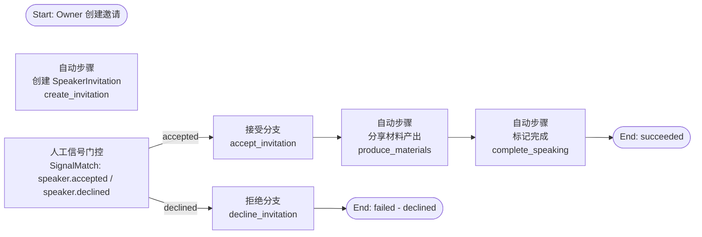
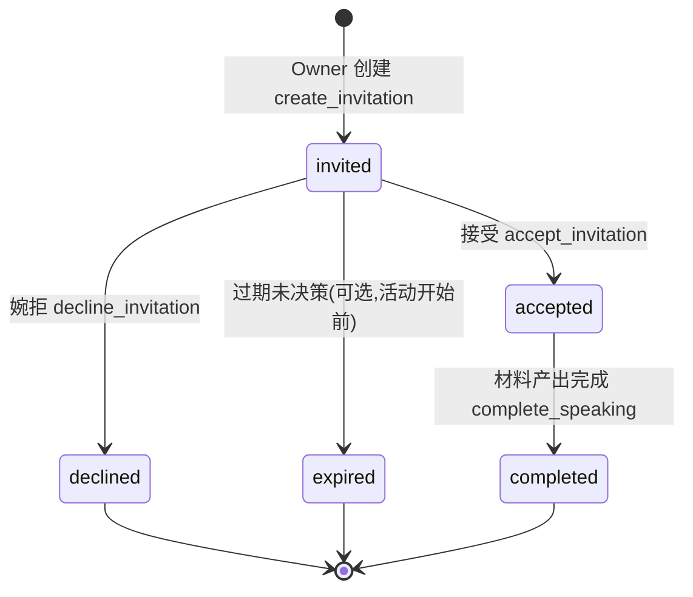

# 邀请 Workflow 详细设计（Speaker 分享嘉宾邀请）

> 日期：2026-08-01 ｜ 作者：领域建模工程师（worker_f150e10b） ｜ 状态：**v1.1 定稿（9 项开放问题拍板已落地，见 §7 与附 B）**
> 依据：`docs/01-定稿设计/领域模型定稿.md`（§4 引擎 context、§5 ER、§8 审计）、`docs/01-定稿设计/用户旅程与Web功能清单.md`（J-Speaker）、`docs/03-决策记录/grill-决策记录-2026-08-01.md`（D-A3 Speaker 角色、D-A5 partition、D-A6 同步/异步）、`docs/01-定稿设计/报名workflow详细设计.md`（v1.3，模板与 POC 实证来源）
> 定位：第三个业务 workflow——Owner 创建 SpeakerInvitation（Event 级逐人邀请）→ Speaker 接受/拒绝 → 接受后分享材料产出 → 分享完关系结束。
> **模板复用说明**：本设计复用报名/赞助 workflow 的模式结论（SignalMatch 门控、审批两段式、幂等承载 Postgres/Redis、partition + Thread journal 审计、hibernate/thaw），只标注差异与复用点（§8）。

---

## 1. 触发与上下文

### 1.1 谁发起 / 谁参与

- **发起人**：**Owner**（活动所属 Workspace 的 Owner；建议 Admin 也可，见 §7 #6）→ 在活动管理后台创建 SpeakerInvitation（Event 级）→ 触发邀请 workflow。
- **被邀请人**：Speaker（**Event 级被邀请，分享完关系结束**，D-A3）→ 收到邀请链接 → 接受/拒绝 → 若接受，产出分享材料 → 分享完成，关系结束。
- **Speaker 是否需要账号：✅ 必须全局账号（v1 拍板 #1）**——接受邀请时注册/登录（与 Sponsor #6 定稿对齐：材料产出归属、审计、互动都需要账号身份）；**不成为 Workspace 成员**（D-A3）。
- **关键语义**：SpeakerInvitation 是**逐人定向邀请**（一对一），区别于报名 invite_only 的**共享批次码**（一对多，§2.2 对比详述）。

### 1.2 上下文与 partition 归属

- SpeakerInvitation **归 Event context**（领域模型定稿 §5.1：`event_id` FK）；WorkflowRun **归该 Event 所属 Workspace 的 Jido partition**（D-A5，同报名/赞助）。
- 邀请对象：Event 级（单场分享嘉宾）；Workspace 级长期讲师/合作嘉宾**不在本 workflow**（属成员/合作关系建模，**二期议题，拍板 #5**；v1 只做 Event 级）。
- 生命周期：随 Event 存续；分享完成关系结束（SpeakerInvitation 状态 accepted + 材料产出归档；无长期 membership）。

### 1.3 邀请入口与凭据形式

- **入口**：活动管理后台 → Event 详情 → 「邀请 Speaker」→ 表单（Speaker 姓名/邮箱 + 可选项：分享主题、日期时间、备注）→ 创建 SpeakerInvitation → 生成**逐人邀请链接**。
- **凭据形式（与报名 invite_only 的差异）**：
  | 维度 | 报名 invite_only（InviteBatch） | Speaker 邀请（SpeakerInvitation） |
  |---|---|---|
  | 模式 | **共享批次码** + quota（一对多） | **逐人定向** token（一对一） |
  | 使用人 | 任何持码人可自报（先到先得） | 指定被邀请人（email/姓名），仅其可用 |
  | 校验 | S6 校验码存在/未过期/剩余配额>0 → 扣配额 | 校验 token 有效/未过期/未被接受 → **一次性**（接受后失效） |
  | 配额 | quota 可 >1（多人共享） | 无配额（一人一邀请） |
  | 用途 | 公开渠道限量报名 | 定向邀请分享嘉宾 |
- 邀请链接格式：`/events/{event_slug}/speaker-invite/{token}`（token = 随机 UUID/hash 存储）；链接含 event 上下文，Speaker 打开 → 登录/注册 → 看到邀请卡片（Event 信息、分享主题、时间）→ 接受/拒绝。

---

## 2. WorkflowDefinition 定义

### 2.1 DAG 总览（接受/拒绝双分支 + 材料产出）

> **POC 实证结论（直接复用）**：单 workflow 内**一个**人工信号等待（Speaker 接受/拒绝，双分支）在 **Workflow 层（runic 直接驱动）join 多信号 PASS**（POC §3.2）；**Agent 层（jido_runic strategy auto）等两个异步信号会死锁**（POC §3.3，ran_nodes 缺陷）→ 若主路径走 Agent 层（拆段），接受/拒绝需拆独立分支（同报名 request 审批两段式规避）。

**邀请段（Invitation 段，创建 + 等待 Speaker 决策）**



- **说明**：S2 是**一个人工步骤节点**的两个互斥出边（SignalMatch 匹配 `speaker.accepted` 或 `speaker.declined` 均放行本步，按信号类型分支）。Workflow 层此模式 PASS（单节点多信号 feed，POC §3.2）；Agent 层需拆段（§3.2 详述）。
- **Step 四分类归属**：S1/M1/M2/A1/R1 = 自动步骤；S2 = 人工步骤（信号门控，双分支）。
- **为什么接受/拒绝不拆两个 workflow**：两者是同一个决策点的互斥结果，天然单 DAG 双分支表达；与报名（两个**顺序**人工信号 submitted→approved）不同——那必须 拆段（Agent 层兜底）。若主路径走 Agent 层（拆段），则拆为「邀请段（S1 后停住）」+「接受段/拒绝段（各自独立分支）」（§3.2）。

### 2.2 Step 明细（输入/输出 schema、四分类、StepRole）

**S1 自动步骤：创建 SpeakerInvitation（`create_invitation`）——核心写**
- 分类：自动（Jido Action，经 **ash_jido** 同步调 Ash Action）
- 触发：Owner 在活动管理后台提交「邀请 Speaker」表单（网站页面）→ 引擎实例化 run → S1
- 输入 schema（Owner 表单）：
  ```json
  {
    "event_id": "uuid",
    "speaker_name": "string",
    "speaker_email": "string | null",   // 定向投递（可空 = 手动转发链接）
    "topic": "string | null",           // 分享主题
    "scheduled_at": "datetime | null",  // 分享时间（可选）
    "note": "string | null",
    "invited_by": "uuid"                // Owner（审批人权限，§7 #6）
  }
  ```
- 逻辑：**同步、强一致**创建 SpeakerInvitation（status=invited）落 DB；生成邀请 token（随机，DB 存 hash）；唯一性：同一 Event 同一 speaker_email 未终态不重复邀请
- 输出：`speaker_invitation_id` + `invitation_token`（链接用）
- StepRole：执行角色 = **Owner**（网站后台发起；API 校验活动所属 Workspace 的 Owner/Admin 权限）

**S2 人工信号门控：接受/拒绝（`speaker.accepted` / `speaker.declined`）**
- 分类：人工步骤（SignalMatch 门控，**单节点双分支**）
- 输入：决策信号（speaker_invitation_id、token、actor_user_id、决策）
- 逻辑：Speaker 打开邀请链接 → **登录/注册全局账号（必须，拍板 #1）** → 看到邀请卡片 → 点「接受」/「婉拒」→ 发 `speaker.accepted` / `speaker.declined`（CloudEvents，source=邀请页，subject=speaker_invitation_id，data 含 token + user_id）→ SignalMatch 匹配本步 → 按信号类型分支
- 校验：token 有效（存在/未过期/状态=invited）、actor 已登录且与被邀请人匹配（email 或登录账号，拍板 #1：账号身份为硬约束）
- StepRole：执行角色 = **anyone with valid token**（被邀请人；token 即凭据，不接受他人代操作——由 token + 账号匹配双重校验）
- 输出：决策结果（accepted/declined）

**A1 自动步骤：接受邀请（`accept_invitation`）**
- 分类：自动（Jido Action，经 ash_jido 同步）
- 输入：accepted 信号 + speaker_invitation_id
- 逻辑：事务内 SpeakerInvitation invited→accepted，记 `accepted_by / accepted_at`；**token 置失效**（一次性）；幂等：状态机保证只 accept 一次（重复 accepted 信号 → 已 accepted 跳过）
- 输出：`speaker_invitation_id`（accepted）

**R1 自动步骤：拒绝邀请（`decline_invitation`）**
- 分类：自动（Jido Action，经 ash_jido 同步）
- 输入：declined 信号 + speaker_invitation_id
- 逻辑：事务内 SpeakerInvitation invited→declined，记 `declined_at`；token 失效；run 终态 failed - declined
- 输出：`speaker_invitation_id`（declined）

**M1 自动步骤：分享材料产出（`produce_materials`）——Step 产出落点**
- 分类：自动（Jido Action；**产出落 Step facts**）
- 输入：accepted 后的 speaker_invitation_id + event_id + speaker_user_id
- 逻辑：邀请 Speaker 产出分享材料（大纲/PPT 链接/讲稿/现场物料清单），**产出落点 = Step facts（WorkflowRun.facts）**：
  - 经用户侧 OpenClacky 保存（`save_step_output`，用户旅程「产出 → Step 产出」）→ Step facts 记录 `materials: [{type: "link|text|file", value, title}]`；
  - 或经网站表单/附件上传（可选，v1 用户侧 OpenClacky 为主，同教研 workflow 产物模式）
- 输出：`materials`（写入 WorkflowRun.facts；可引用为 Event 的分享材料，Event 已引用教研 workflow 产物 workflow_run_id，本 workflow 产出可并入或独立 facts）
- StepRole：**Speaker（被邀请人）**在用户侧 OpenClacky 执行产出步骤；引擎侧 M1 为"等待产出完成"的自动收集步骤（人工在 OpenClacky 完成材料后发 `speaker.materials_ready` 信号，或 M1 轮询 facts——v1 建议**信号驱动**：`speaker.materials_ready` 到达后 M1 校验 facts 完整性）
- ⚠️ 说明：M1 若等待用户产出信号，则 workflow 有第二个人工信号（`speaker.materials_ready`）——Agent 层同样要拆段（§3.2 扩展）；Workflow 层单 run 可顺序等待（POC §3.2 PASS）。v1 建议主路径 Workflow 层（此 workflow 无并发扣减类需求，可全程 Workflow 层）。

**M2 自动步骤：标记完成（`complete_speaking`）**
- 分类：自动（Jido Action）
- 输入：materials 摘要 + event_id
- 逻辑：SpeakerInvitation accepted→completed（分享完成，关系结束）；写 `completed_at`；可发异步 `speaker.completed`（通知/归档，§4.2）
- 输出：`speaker_invitation_id`（completed）；run succeeded

**（可选）扩展：分享现场/复盘**：若未来分享流程复杂（彩排/答疑/复盘），可由 `speaker.accepted` 或 `speaker.completed` 信号触发独立「分享 workflow」（同 enrollment.completed 触发学习 workflow 模式，§4.2）——**v1 不拆（拍板 #4：材料产出内嵌 M1，保留触发扩展点，二期再议）**。

### 2.3 版本与部署

- WorkflowDefinition 元数据：`id/name/type=speaker_invitation/version/input_schema/node_def`（同报名 §2.3）。
- 每个 Workspace 默认内置「邀请 workflow」模板；Event 详情页「邀请 Speaker」按钮实例化 run；一个邀请 = 一个 run（v1 粒度）；run 持定义版本快照（D-A2）。

---

## 3. 人工步骤模式（SignalMatch 门控 + 双分支）

> 复用报名 §3 结论：单信号等待 Workflow 层 PASS（POC §3.2）；Agent 层多信号 join 死锁（POC §3.3）。本 workflow 的接受/拒绝是**同一决策点的互斥双分支**（单节点双信号），与报名 request（两个顺序信号）结构不同。

### 3.1 接受/拒绝如何映射为 SignalMatch 门控

- Speaker 打开邀请链接 → **登录/注册全局账号（必须，拍板 #1）** → 决策页 → 点「接受」→ 发 `speaker.accepted`；点「婉拒」→ 发 `speaker.declined`。
- run 执行到 S2 → **waiting** 挂起，SignalMatch 监听 `speaker.accepted|speaker.declined`（`speaker.*` 前缀路由到本 run）。
- 信号到达 → 校验 token/speaker_invitation_id 与 run 上下文匹配 → 放行 → 按信号类型走 A1 或 R1 分支。
- **hibernate/thaw**：等待可能数天 → hibernate 落 checkpoint；信号到达 thaw 恢复（POC-2 G1 已验证）。

### 3.2 双分支 vs 拆段（Agent 层兜底）（Workflow 层 vs Agent 层）

- **Workflow 层（runic 直接驱动）**：单 run 内 S2 双信号分支 PASS（POC §3.2 join 模式；同节点多信号 feed）。M1 等待材料产出（`speaker.materials_ready`）为第二个人工信号——**顺序等待**（先 accept 后 materials_ready），Workflow 层可顺序 feed（POC §3.2 PASS）。**本 workflow v1 建议主路径 = Workflow 层**（无并发扣减，纯状态流，不涉 Agent 生命周期）。
- **Agent 层（jido_runic strategy auto）**：两个人工信号（决策 + 材料产出）若同 DAG join → 死锁（POC §3.3）→ 需 拆段（Agent 层兜底）：
  1. **邀请段**：S1 创建 invited → 停住（等决策）；
  2. **决策段**：`speaker.accepted` 独立分支（读回 invited → accepted）；`speaker.declined` 独立分支（置 declined 终态）；
  3. **产出段**：accepted 后停住 → `speaker.materials_ready` 独立分支（读回 → 收材料 → completed）。
  - 与报名 request 的审批两段式同构（persist_pending + approval_gate 规避模式，POC §3.4 PASS）；仅分支信号不同（报名 approved/rejected；本 workflow accepted/declined/materials_ready）。
- **结论**：v1 主路径 = Workflow 层单 run（S1→S2→A1/R1→M1→M2）；Agent 层路径按上述拆段预留（若未来要接 Agent 生命周期/策略）。

### 3.3 邀请链接/凭据（与报名 invite_only 的差异）

- **逐人 token**：每个 SpeakerInvitation 生成唯一 token（DB 存 hash，链接明文），**一次性**（accept/decline 后失效），定向投递（email 或手动转发）。
- **与报名 InviteBatch 对比**（详表见 §1.3）：批次码 = 共享 + quota（多对多）；Speaker token = 一对一 + 一次性（无配额）。
- **复用点**：token 的**幂等/防重**机制可复用 signal_idempotency（§4.3）；**候选池/批量邀请 = 二期**（拍板 #3：v1 逐人邀请，一个 Speaker = 一个 run；二期复用 InviteBatch 的 quota 概念扩展批量创建，§7 #3）。

---

## 4. 跨 context 边界（同步 vs 异步）

> 复用报名 §4 结论（D-A6 8:2；幂等承载 Postgres/Redis）。

### 4.1 同步调用：`create_invitation`（S1）与 `accept_invitation`/`decline_invitation`（A1/R1）

- **调用方**：S1/A1/R1（workflow 引擎 context）→ 经 ash_jido 桥接 → 业务 context 的 `SpeakerInvitation.create/update` Ash Action。
- **POC 已验证（验证项 3 PASS）**：约束/唯一/立即可读；⚠️ `public?: true`；生产 Postgres 原生唯一索引。
- **强一致保证**：
  1. **唯一性**：`(event_id, speaker_email)` 未终态不重复邀请（同一人同一场不重复建邀请）；token 唯一索引。
  2. **状态约束**：Event 存在、状态 open/筹备中；发起人（Owner）有效且有权限。
  3. **一次性**：accept/decline 事务内校验 status=invited + token 有效 → 更新状态 + token 失效（原子）。
- **失败语义**：Action 错误 → S1/A1/R1 抛失败 → run failed；不落或落 cancelled 留痕。
- **幂等**：见 §4.3。

### 4.2 异步 Signal：`speaker.completed`（衍生副作用）

- **发送方**：M2（引擎）→ `speaker.completed`（CloudEvents：source=workflow run，subject=speaker_invitation_id，data={event_id, speaker_user_id}）。
- **POC 已验证（验证项 4 + POC-2 G2 B1-B3 PASS）**：Signal Bus + signal_routes 异步触发；journal 重放 + 幂等键去重。
- **接收方/订阅方**：
  | 订阅方 | 动作 |
  |---|---|
  | 通知 | 通知 Owner「Speaker 已接受/已产出材料/分享完成」；通知 Speaker「材料已归档」 |
  | 活动页面展示 | Event 页展示 Speaker 名单（accepted 后）/分享材料（completed 后） |
  | 归档 | 分享材料归档到 Event 记录（教研 workflow 产物联动，可选） |
  | 触发分享 workflow（二期） | 若分享流程复杂 → 独立「分享 workflow」（拍板 #4：v1 不拆，保留扩展点） |
- **幂等键建议**：`"speaker.completed:" + speaker_invitation_id`（订阅方去重）。

### 4.3 幂等键建议

| 层 | 幂等键 | 说明 |
|---|---|---|
| 创建邀请（S1） | `(event_id, speaker_email)` 业务唯一索引；Action 幂等 | 防 Owner 重复点提交建重复邀请 |
| 决策信号（S2） | token + speaker_invitation_id；状态机（invited→accepted/declined 只一次） | 防双击/重试重复处理 |
| 材料产出信号（M1） | `"speaker.materials_ready:" + speaker_invitation_id` | 防重复收材料 |
| speaker.completed（M2 信号） | `"speaker.completed:" + speaker_invitation_id` | 订阅方去重 |

- **重试策略**：S1/A1/R1 失败（唯一冲突/token 失效）→ run failed（终态，不自动重试）；网络类瞬时错误 → 引擎重试 N 次。异步 Signal 失败 → Jido 重发（幂等键保证安全）。
- **幂等键承载约束（POC-2 G2 B3 关键发现，落地硬约束）**：去重表**不得由 action 进程自建 ETS**；生产用 **Postgres 唯一约束**（`signal_idempotency` 表）或 **Redis**（SETNX/EXPIRE）。**与报名/赞助共用 `signal_idempotency` 表**（横向复用点，§8）。

---

## 5. 产物与状态

### 5.1 SpeakerInvitation 实体字段草案

```json
{
  "id": "uuid",
  "event_id": "uuid",                  // 归 Event context
  "speaker_user_id": "uuid | null",    // 接受后绑定（登录账号）
  "speaker_name": "string",
  "speaker_email": "string | null",
  "topic": "string | null",
  "scheduled_at": "datetime | null",
  "note": "string | null",
  "invited_by": "uuid",                // 发起人（Owner）
  "token_hash": "string",              // 邀请 token（hash 存储）
  "status": "invited | accepted | declined | completed",
  "accepted_by": "uuid | null",
  "accepted_at": "datetime | null",
  "declined_at": "datetime | null",
  "completed_at": "datetime | null",
  "expires_at": "datetime | null",     // token 有效期（可选，默认活动开始前）
  "workflow_run_id": "uuid",           // 来源邀请 workflow run
  "created_at": "datetime",
  "updated_at": "datetime"
}
```

- 归属：Event context（event_id）；partition = Event 所属 Workspace（§1.2）。
- 唯一索引：`(event_id, speaker_email)` 未终态唯一；`token_hash` 唯一。
- **材料产出落点**：WorkflowRun.facts（Step 产出）`materials: [...]`；SpeakerInvitation 本身不存材料正文（只存状态与关联），材料经 `workflow_run_id` 可达（同报名 §5.3 关联方式）。

### 5.2 SpeakerInvitation 状态机



- **与 WorkflowRun 状态机对应**：
  | SpeakerInvitation | WorkflowRun | 说明 |
  |---|---|---|
  | invited | running（S2 waiting） | 等 Speaker 决策 |
  | accepted | running（A1 后，等材料） | 已接受，产出材料中 |
  | declined | failed | 终态（婉拒） |
  | completed | succeeded | 分享完成，关系结束 |
  | expired | cancelled（可选） | 过期未决策（§7 #2） |
- v1 主路径：invited → accepted → completed，run succeeded。

### 5.3 WorkflowRun 与 SpeakerInvitation 的关联方式

- **正向**：SpeakerInvitation.workflow_run_id 指向创建它的 WorkflowRun（S1 写入）。
- **反向**：WorkflowRun.facts 存 materials；input_snapshot 含 event_id/speaker 信息。
- **查询需求**：Event 管理页 Speaker 列表 → 按 event_id 查 SpeakerInvitation；分享材料展示 → 按 workflow_run_id 查 facts。
- v1 建议：SpeakerInvitation 为主查询入口（活动侧），WorkflowRun.facts 为材料产出入口（用户侧）；workflow_run_id 双向可达。

---

## 6. 审计（Thread journal 事件）

> 依据 D-A5：审计 context 数据源 = Jido Storage Thread journal（append-only + Checkpoint + Introspection），不另造轮子。复用报名 §6 事件模式。

**邀请 workflow 在 Thread journal 中记录的事件**（append-only）：

| 事件 | 阶段 | 内容 |
|---|---|---|
| `workflow.run_started` | 创建 run | run_id、definition_version、input_snapshot 摘要 |
| `step.manual.waiting` | S2 进入 | step_id、signal_type 监听（speaker.accepted/declined） |
| `signal.received` | 信号到达 | signal_type、source、subject（token/speaker_invitation_id）、payload 摘要 |
| `signal.matched` | SignalMatch 放行 | 匹配的 step、分支（accepted/declined）、放行时间 |
| `step.auto.completed` | S1/A1/R1/M1/M2 | step_id、输出摘要 |
| `action.invoked` | S1/A1/R1/M1/M2 同步 Action | action=create_invitation/accept_invitation/decline_invitation/complete_speaking、结果 |
| `signal.emitted` | M2 | signal=speaker.completed、idempotency_key |
| `workflow.run_succeeded` / `run_failed` / `run_cancelled` | 终态 | 终态原因（declined/expired） |
| `instruction_start` / `instruction_end` | **引擎自动记录**（POC 验证项 5 PASS） | 每次指令执行起止配对，审计溯源链 |

- 邀请人/被邀请人审计：`invited_by / accepted_by / accepted_at / declined_at / completed_at` 写回 SpeakerInvitation + Thread journal `action.invoked`（谁在何时创建/接受/完成）。
- 材料产出审计：`save_step_output`（用户侧 OpenClacky）→ ToolCallLog + Step facts + Thread journal（三层互补，领域模型定稿 §8）。

---

## 7. 开放问题清单（逐一给结论，2026-08-01 初稿）

> 结论分类：✅ **已定稿**（建模已明确 / POC 已回答）｜🟡 **待 v1**（引擎未验证，v1 补测）｜🔶 **待用户 grill**（纯业务决策）

| # | 问题 | 结论 | 依据 |
|---|---|---|---|
| 1 | **Speaker 是否需要账号** | ✅ 定稿（v1 拍板 #1）：**必须全局账号**——接受邀请时注册/登录（与 Sponsor #6 定稿对齐）；**不成为 Workspace 成员**；账号身份为接受分支硬约束（§2.2 S2） | 用户拍板（2026-08-01） |
| 2 | **邀请过期未决策** | 🟡 待 v1：`expires_at`（默认活动开始前）到期 → run cancelled + status=expired（复用 §7 #5 deadline 唤醒模式：恢复时检查 → Emit cancel）；具体过期策略 v1 细化 | 建模建议，v1 细化 |
| 3 | **批量邀请演讲者候选池** | **二期**（拍板 #3）：v1 逐人邀请（一个 Speaker = 一个 run）；候选池/批量邀请 = 二期复用 InviteBatch quota 机制扩展（§3.3，批量创建 N 个邀请 run + 批量 token 管理） | 用户拍板（2026-08-01） |
| 4 | **接受后是否自动关联分享 workflow** | ✅ 定稿（v1 拍板 #4）：**v1 不拆独立分享 workflow**——材料产出为邀请 workflow 内步骤（M1，Step facts 落点）；保留 `speaker.accepted` 触发扩展点，二期分享复杂化时再拆（同 enrollment.completed 触发模式，§4.2） | 用户拍板（2026-08-01） |
| 5 | **Workspace 级讲师/长期嘉宾** | **二期**（拍板 #5）：v1 仅 Event 级；Workspace 级长期讲师属成员/合作关系建模（与 Tutor 成员身份、Sponsor 非成员关系均不同），作为独立议题二期设计（§1.2） | 用户拍板（2026-08-01） |
| 6 | **邀请人权限（Owner vs Admin）** | ✅ 建模定稿：**Owner 必可**；Admin 建议也可（与审批 JoinRequest 同级权限，同报名 #3 决策）。实现时按角色矩阵校验 | 与报名/赞助审批权限一致（用户拍板模式） |
| 7 | **partition 归属** | ✅ 定稿：SpeakerInvitation 归 **Event context**；WorkflowRun 归 **Event 所属 Workspace 的 partition**（D-A5） | 建模定稿（§1.2） |
| 8 | **双分支 vs 拆段** | ✅ 定稿：接受/拒绝 = 单决策点双分支，**Workflow 层单 run 可表达**（POC §3.2 PASS）；Agent 层需拆段（§3.2）；v1 主路径 Workflow 层 | POC 实证 |
| 9 | **幂等/一次性** | ✅ 定稿：token 一次性 + 状态机 + signal_idempotency（Postgres/Redis 共用表） | POC-2 G2 B3 + 建模定稿 |
| 10 | **材料产出落点** | ✅ 定稿：Step facts（WorkflowRun.facts），经用户侧 OpenClacky `save_step_output` 保存；与教研 workflow 产物模式一致 | 用户旅程 + 建模定稿 |

> **结论统计：✅ 定稿 7 项（#1/#4/#6/#7/#8/#9/#10）｜🟡 待 v1 1 项（#2）｜🔶 0 项（#3/#5 已明确为二期，2026-08-01 用户拍板全部落地）**

---

## 8. 与报名/赞助 workflow 的横向复用点

| 复用点 | 出处 | 邀请 workflow 应用 |
|---|---|---|
| SignalMatch 门控 + hibernate/thaw | 报名 §3.1/§3.3（POC-2 G1 PASS） | 接受/拒绝信号门控 + 长等待 hibernate（§3.1） |
| 拆段（Agent 层兜底）模式（Agent 层兜底） | 报名 §3.2（POC §3.3/§3.4 PASS） | 若走 Agent 层：邀请段 + 决策段 + 产出段（§3.2） |
| 一次性凭据/幂等（#4 模式） | 报名 §3.6（InviteBatch） | 逐人 token（一对一 + 一次性），幂等/防重复用 signal_idempotency（§3.3/§4.3） |
| 同步核心写（ash_jido）+ 异步 Signal（8:2） | 报名 §4.1/§4.2（POC 验证项 3/4 PASS） | S1/A1/R1 同步 + M2 异步（§4） |
| 幂等键承载（Postgres 唯一约束/Redis，勿用 ETS） | 报名 §4.3（POC-2 G2 B3 PASS） | 共用 `signal_idempotency` 表（§4.3） |
| Thread journal 审计事件模式 | 报名 §6（POC 验证项 5 PASS） | 同事件模式（§6） |
| Step 产出落点（facts） | 报名 §5.3 / 教研 workflow 产物模式 | 材料产出落 WorkflowRun.facts（§2.2 M1/§5.1） |
| 审批权限（Owner/Admin，非 MCP） | 报名 v1.3 §3.5（用户拍板） | 邀请人权限 Owner/Admin（§7 #6） |
| deadline 唤醒 cancel（🟡 待 v1） | 报名 §7 #5 | 邀请过期处理复用同一模式（§7 #2） |

---

## 附 B：修订记录

| 版本 | 日期 | 内容 |
|---|---|---|
| v1.0 | 2026-08-01 | 初版：SpeakerInvitation 逐人定向 token（一对一、一次性）；接受/拒绝单决策点双分支（Workflow 层单 run，Agent 层 拆段（Agent 层兜底）预留）；材料产出内嵌 M1（Step facts 落点）；开放问题 ✅ 5 / 🟡 1 / 🔶 4；横向复用点 10 项 |
| v1.1 | 2026-08-01 | **9 项开放问题拍板落地**：#1 Speaker 账号 → ✅ **必须全局账号**，接受分支加登录/注册硬约束（§1.1/§2.2 S2/§3.1）；#4 分享 workflow → ✅ **v1 不拆**，材料产出内嵌 M1，保留 `speaker.accepted` 触发扩展点（§2.2/§4.2）；#3 候选池批量邀请 → **二期**（复用 InviteBatch quota 机制扩展，§3.3）；#5 Workspace 级讲师 → **二期**（属成员/合作关系建模，§1.2）；#2/#6/#7/#8/#9/#10 保持已定稿/待 v1；开放问题统计 ✅ 7 / 🟡 1 / 🔶 0（2 项明确二期） |
