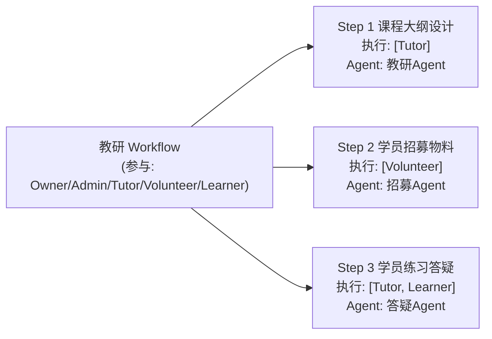
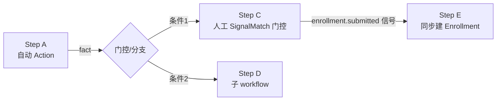
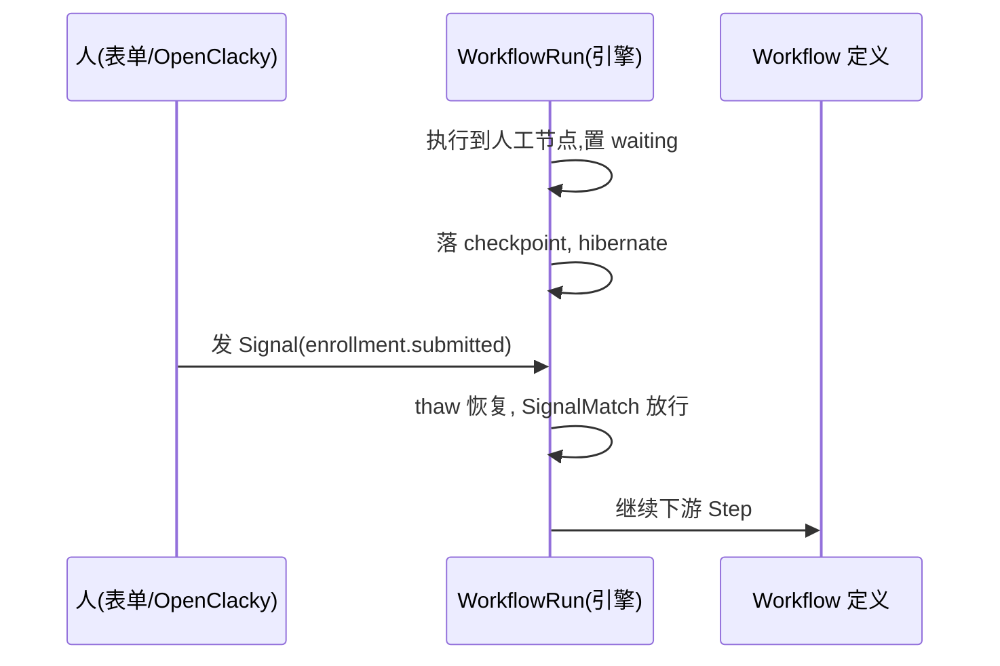
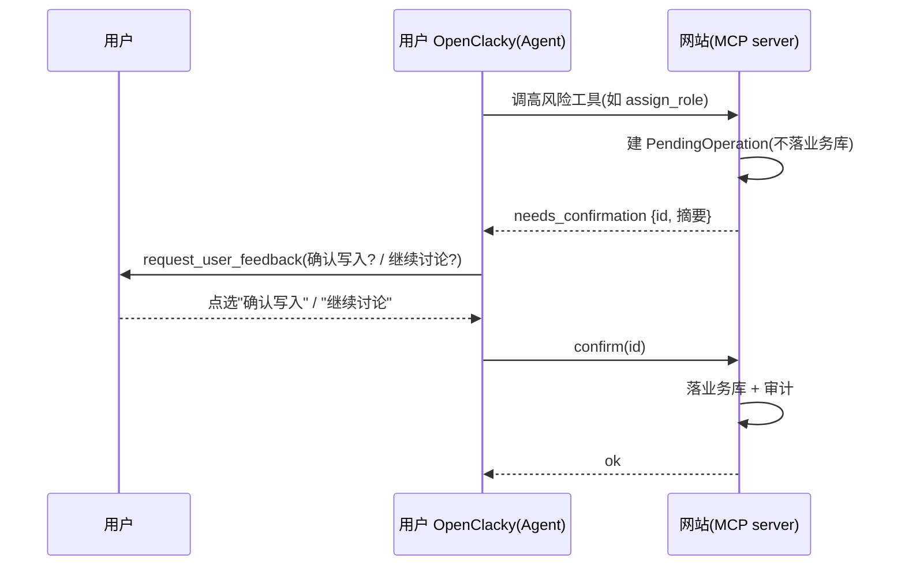

# CGC 平台领域模型定稿

> 日期：2026-08-01（workflow-first 重建版）· 原稿：2026-07-31 · 上一版：2026-08-01（BYO 修订版）
> 状态：**workflow-first + Jido 架构**已与用户（方伯）达成共识（D-A1–D-A7）；保留已确认的 BYO/MCP 地基（D1-D14）与多租户/角色/Agent 权限矩阵；引擎 context 核心重建为 WorkflowDefinition / WorkflowRun；引擎可靠性假设（waiting hibernate/thaw、Signal Bus journal 重放）已由 **POC-2 G1/G2 全 PASS** 实证（见 `docs/04-引擎验证/poc-验证报告.md` §9.6）
> 依赖：docs/03-决策记录/grill-决策记录-2026-08-01.md、docs/docs/04-引擎验证/workflow-engine-ddd-design.md、docs/adr/0001-website-as-mcp-server-byo.md、docs/adr/0002-workflow-first-jido.md、docs/02-调研分析/multitenancy-调研.md
> 决策编号说明：D1–D14 为 BYO/MCP 架构决策（grill）；D-A1–D-A7 为 workflow-first/Jido 追加决策（见 CONTEXT.md 与 ADR-0002）

---

## 0. 执行架构转向（BYO，保留）

- **网站不再自行执行 Agent（D1）**：不跑 LLM/ToolLoop，平台零 AI 成本。
- **用户自带 OpenClacky 执行（D3）**：Agent 执行全部发生在用户本地 OpenClacky，经 **MCP 调用**网站（用户侧主动连、出站、无隧道）。
- 网站角色 = **业务中枢 + MCP server（D5/D6）**：暴露一个 MCP server（anubis_mcp），被用户的 OpenClacky 调用；每用户一个连接 token，RBAC 强制。
- 用户离线则该用户 Agent 任务不可用（接受，D3）。
- **workflow-first 不改变 BYO**：网站侧新增的 Workflow 引擎只做**确定性编排**（DAG 执行、人工步骤等待/放行、事件驱动），不承担 LLM 推理；凡需 LLM 的步骤仍按 BYO 由用户侧 OpenClacky 完成（见 §4.7）。

---

## 1. 多租户地基（保留 + Jido partition）

- 隔离级别：共享表 + tenant_id（Ash attribute 策略），不走 schema-per-tenant
- 账号模型：一人多 Workspace，全局账号（User/Identity/Token 全局）
- 租户解析：邀请链接（slug + UUID 末 4 位）+ 登录后工作台选择；子域名二期
- 租户标识：UUID 主键 + slug 展示，slug 全局唯一
- 全局资源：User、Workspace、Identity、Token
- 租户资源：WorkspaceMembership、MembershipRole、Role、WorkflowDefinition、WorkflowRun、Step、Agent、AgentRun、Invitation、JoinRequest、Profile、Event、Course、PendingOperation、ToolCallLog、SignalLog、Enrollment、Sponsorship、SpeakerInvitation
- **MCP 作用域 = workspace_id（D12）**：所有 MCP 工具带**必填 `workspace_id`**（无状态、每调用鉴权 + 审计）；"当前工作区"由用户侧 CGC 助手维护，服务端不存会话状态。详见 §7.3。
- **平台管理员**（全局，非租户角色）：User 上 `is_platform_admin` 标记，可多人；负责创建 Workspace 并指定 Owner，普通用户不可自助创建
- **Workspace 加入策略**（Owner 可设置）：
  - `open`：公开可发现，任何人直接加入，**无需审批**
  - `request`：公开可发现，申请后由 Owner/Admin 审批
  - `invite_only`：私密，不可被发现，仅邀请链接可加入
- **Jido partition 映射（新增）**：每个 Workspace = 一个 Jido partition（D-A5）——registry identity、persistence、lineage、telemetry 均按 partition 隔离；WorkflowRun 归属 partition（§4.2、§8）。
- **Workspace 创建**：平台管理员创建（申请审批 + 主动创建两级，D-A3）并指定 Owner。

---

## 2. 角色建模（保留 + 两类关系）

- 角色是**租户内可扩展实体**（非写死枚举），权限挂在角色上（RBAC）
- 平台提供**默认角色模板**，新 Workspace 初始化自动生成：
  - **Owner**（创始人）：一切权限
  - **Admin**（管理员）：管理成员/角色/公共 Agent/Workflow
  - **Tutor**（教练）：创建个人 Agent、教研/教学类 Workflow、公共 Agent（教学向）
  - **Volunteer**（志愿者）：执行被授权的 Workflow 步骤，不可建公共 Agent
  - **Learner**（学员）：执行被授权的学习向步骤，不可建公共 Agent
- **一人多角色**：一个用户在一个 Workspace 可有多个角色（如 Owner 同时报名课程成为 Learner）
  - 存储：WorkspaceMembership（1 条/人/租户）+ MembershipRole 关联表（N:M Role）
  - 权限判定：**所有角色权限取并集**，命中任一角色即放行
  - Step 执行授权同理：用户角色集合命中 Step 的执行角色集合即可执行
  - Step/Agent 上存 `role_id` 引用；GraphQL 返回时嵌套 `role { id, name }`，前端展示名称

### 2.1 两类关系（workflow-first 澄清，新增）

| 关系 | 归属 | 表达 | 生命周期 |
| --- | --- | --- | --- |
| **Workspace 成员**（运营团队：Owner/Admin/Tutor/Volunteer/Learner） | 租户级、长期 | WorkspaceMembership + MembershipRole | 随成员关系存续 |
| **Event/Course 参与者**（Learner 事件级） | 活动/课程级 | Enrollment | 随活动/课程存续 |

> 注记（2026-08-02 拍板）：切片 A 阶段角色为**平台统一六枚举**（owner/admin/member/tutor/volunteer/learner），member 为默认兜底成员角色；UI 角色分配/展示模板仍为五角色（不含 member，只作兼容输入）。本表与 §3.2 图中的「五角色」均为展示模板语义，非完整枚举；自定义角色为未来能力。详见 `docs/00-CGC平台设计总纲.md` 角色扩展注记。

- Learner 既可以是 Workspace 成员（运营团队角色），也可以是某 Event/Course 的参与者（Enrollment）；两类关系**互不替代**：判断"谁能执行某个 Step"看成员角色；判断"谁报名了某活动"看 Enrollment。
- Enrollment 由**报名 workflow** 创建（§4.6 同步路径），归活动 context（§5）。

---

## 3. Agent 权限矩阵（保留）

> **Agent 的定位已重定义（D2）**：Agent 不是网站侧执行实体，而是**授权/配置登记**——`type / allowed_roles / owner` + **OpenClacky 配置引用**（`openclacky_profile / model / system_prompt / skills`）。实际执行发生在用户本地 OpenClacky；网站按此登记做授权判定与指令分发。

### 3.1 Agent 两种形态

| 形态 | 归属 | 例子 |
| --- | --- | --- |
| 个人 Agent（角色分身） | 用户本人，仅本人可见 | 教练的"教学 Agent" |
| 公共 Agent（空间级） | Workspace，基于 Workflow 协作 | "活动筹备 Agent" |

- **Agent 定义存网站**（D10 任务指令模式）：公共 Agent 资源含 prompt/skills/授权；用户侧 CGC 助手经 MCP `get_agent_instruction(workspace_id, agent_id)` 拉取定义后按定义工作。
- 公共 Agent **动态创建天然支持**（定义存库即可被发现）；**不做运行时下发文件**（热加载未验证、工程风险高）。

### 3.2 授权最小单元：Workflow Step（保留，映射为 DAG 节点）

WorkflowDefinition 由多个 Step（节点）组成，每个 Step 声明：**哪些角色可执行本步 + 本步用哪个 Agent**。Step 四分类见 §4.3；授权判定逻辑不变（角色集合命中即放行）。

- 学员只能执行自己角色对应的 Step，其他 Step 的 Agent 不可见 → 堵死学员误用公共 Agent
- 长 Workflow、多角色参与天然支持

### 3.3 Agent 两层授权（取并集）

| 层 | 说明 | 默认 |
| --- | --- | --- |
| ① 独立使用 | Agent 自身声明"哪些角色可直接用我"（Workflow 之外） | 创建者角色 + Admin/Owner |
| ② Workflow 内使用 | 跟随 Step 的执行角色 | 见 3.2 |

Learner 默认两层都拿不到，除非某 Step 明确授权（如答疑 Step）。

### 3.4 权限矩阵表

| 操作 | Owner | Admin | Tutor | Volunteer | Learner |
| --- | --- | --- | --- | --- | --- |
| 创建个人 Agent | ✅ | ✅ | ✅ | ✅ | ✅ |
| 使用自己的个人 Agent | ✅ | ✅ | ✅ | ✅ | ✅ |
| 使用他人个人 Agent | ❌ | ❌ | ❌ | ❌ | ❌ |
| 创建公共 Agent | ✅ | ✅ | ✅ | ❌ | ❌ |
| 编辑/停用公共 Agent | ✅ | ✅ | ✅ | ❌ | ❌ |
| 删除公共 Agent | ✅ | ✅ | ❌ | ❌ | ❌ |
| 独立使用公共 Agent | ✅ | ✅ | ✅(仅被授权的) | 按 Agent 声明 | 按 Agent 声明 |
| 执行 Workflow Step | ✅ | ✅ | 按 Step 授权 | 按 Step 授权 | 按 Step 授权 |
| 创建 WorkflowDefinition | ✅ | ✅ | ✅ | ❌ | ❌ |

> 本矩阵同时约束**网站页面**与 **MCP 管理类工具**（D7）：Agent = 用户的执行分身，工具调用以**用户本人身份**判定，MCP 无额外权限（越权被拒，D6）。

---

## 4. Workflow 引擎 context（workflow-first 核心，新增）

> 依据：`docs/docs/04-引擎验证/workflow-engine-ddd-design.md` §2 草案 A/B（已与用户达成共识，D-A1–D-A6）+ ADR-0002。网站侧新增 Jido 工作流引擎，承载多步编排；引擎只做确定性编排，不承担 LLM（§4.7）。

### 4.1 核心 aggregate：WorkflowDefinition（DAG 蓝图）

- **定义**：可复用的 DAG 蓝图 = Runic.Workflow 数据流 + 业务元数据（id/name/type/version/输入 schema/节点定义）（D-A1）。
- **结构**：Step（节点）是 `input → output` 函数；Fact 是数据流单元；lazy 并发求值，天然支持分支/并行/扇出。
- **`approval_timeout`（F7 方案 A，2026-08-01 新增）**：人工审批等待超时参数，**默认 7 天**、可配置（`null` = 无超时）；进入 waiting 时登记 deadline（= 进入时间 + approval_timeout），到点由 F2 的 deadline 唤醒机制（hibernate 恢复检查 / Schedule Directive）触发 run 转 `expired`；报名/赞助 workflow 的 pending 审批分支使用（见 `docs/01-定稿设计/报名workflow详细设计.md` §3.4、`docs/01-定稿设计/赞助workflow详细设计.md` §2.2 A1）。
- **版本管理**：教研 workflow 定义一次，被 Event/Course 实例化复用；**改定义不影响已开始 run**（运行中的 run 持定义快照）（D-A2）。
- **生命周期**：draft → published → archived（保留原 Workflow 状态机语义）。
- **谁设计**：Admin/Owner 定义平台运维与教研 workflow 模板；Tutor 通过教研 workflow 产出大纲/材料；**使用者只运行实例，不直接改定义**（D 草案 B）。

### 4.2 核心 aggregate：WorkflowRun（执行实例）

- **定义**：一个运行中的 DAG 实例；**归属 partition（= Workspace，D-A5）**。
- **状态机**：`pending → running → waiting（人等信号）→ succeeded / failed / cancelled / expired`（**expired 为 F7 方案 A 新增终态**：人工审批等待超时（`approval_timeout` 到点）时 run 转 expired，reason=approval_timeout；语义 ≠ rejected——未及时审批自动失效，业务实体可重新提交，见 §4.1 与报名/赞助 workflow 状态机）。
- **持有**：输入快照（启动时参数）、产物 facts（各 Step 输出）、signal 日志（收到的外部信号）。
- **执行**：`Workflow.react_until_satisfied/2`；ActionNode 把 Jido Action 包装为节点；SignalMatch 按 signal type 前缀模式门控下游。
- **恢复点**：waiting 时落 Checkpoint（hibernate），信号到达 thaw 恢复（§4.4）。

### 4.3 Step 四分类

| 分类 | 实现 | 例子 |
| --- | --- | --- |
| ① 自动步骤 | Jido Action（纯函数/可含副作用，schema 驱动校验） | 计算名额、读业务数据 |
| ② 人工步骤 | SignalMatch 门控等待外部信号 | 报名表单提交、审批、Learner 提交作业 |
| ③ 门控/分支 | 按 Fact 条件路由下游 | 名额满则走候补分支 |
| ④ 子 workflow | 嵌套 DAG（复用其他 WorkflowDefinition） | 学习 workflow 内嵌"单元测验"子流程 |

- 授权（§3.2）挂在 Step 上：人工步骤由"该 Step 的执行角色"触发信号，自动/门控/子 workflow 步骤由引擎执行（不另授权）。

### 4.4 人工步骤模式：workflow 内部等待为主（不拆多段）

- **决策（D-A1）**：WorkflowRun 是有状态实体，执行到人工节点 → **waiting 挂起**；人操作后发 Signal（如 `enrollment.submitted`）→ SignalMatch 放行 → **恢复执行**。
- Y 是 DAG 下游节点：X 完成后 workflow 自动走到 Y，人触发的是"**恢复**"而非"启动下一段"。
- **长等待资源占用由 hibernate/thaw 解决**：waiting 时落 checkpoint 休眠，信号到达 thaw 恢复。**POC-2 G1 已验证 PASS**：jido 2.3.2 InstanceManager + Persist.hibernate/thaw 原生支持（checkpoint = workflow state + thread pointer `%{id,rev}`，thaw rehydrate 完整 journal，rev 不匹配报 `:thread_mismatch`；恢复期间到达信号不丢不重）。人工步骤可安全依赖引擎 hibernate，**无需自建 pending 持久化**。注：hibernate 期间 **deadline 到点唤醒 → cancel 的路径未在 POC-2 覆盖**（报告 §11），属超时/取消语义，v1 联调期补测（见 §5.3 与 `docs/01-定稿设计/报名workflow详细设计.md` §7 #5）。
- **POC 实证（2026-08-01）修正**：该模式在 **Workflow 层（runic 直接驱动）成立**；但 **Agent 层（jido_runic 1.0 strategy auto）单 workflow 内 join 等两个以上异步信号会死锁**（`ran_nodes` 过滤缺陷，POC 双向证明）。
  - **约束**：人工步骤信号门控限定在 **Workflow 层**，或 **Agent 层用审批两段式/事件驱动**（分段 + 持久化中间状态，审批等第二个人工信号触发独立分支读回持久化结果再继续，如报名 workflow request 策略：报名段 persist_pending 停住 → 审批段 approval_gate → confirm）。
  - 依赖两个独立外部信号的人工流程（如报名 + 审批）在 Agent 层**不得**用单 DAG join；在 Workflow 层可用 join（进程内多信号 feed）。
- 拆多段（独立 run + 人为/订阅触发）仅未来"段间有明显人为决策间隔且输入差异大"时再考虑；v1 由子 workflow 覆盖"相对独立段"。

> 注：报名 workflow 的 request 策略（两个人工信号）已按审批两段式细化，见 `docs/01-定稿设计/报名workflow详细设计.md` §2/§3。

### 4.5 跨 context 解耦：workflow → 业务 Action 接口

- **依赖方向恒为：workflow → 业务 Action 接口**（ash_jido 编译期把 Ash Resource 的 action 生成 Jido Action 模块；context 需 domain/actor/tenant）。
- 业务 context **反向只发信号、不调引擎**：业务侧订阅 Signal 后更新自己的 aggregate（如报名 workflow 产物 → Enrollment）。
- 落地形态：业务 context 声明"我能做什么（Action）/ 我关心什么（Signal）"，workflow 编排"何时做、按什么顺序"。

### 4.6 同步 vs 异步（8:2，已确认）

- **同步直接调 Ash Action（强一致，约 8 成，D-A6）**：业务核心状态的主写入口，写完立即可读/约束检查。例：报名 workflow 最后一步创建 Enrollment（保证名额/唯一性不变量）。**POC 已验证**：ash_jido 同步 Action 约束/唯一/立即可读 PASS（⚠️ Ash 3.31 业务字段需 `public?: true` 才出现在 Jido Action 输出）。
- **发 Signal 异步最终一致（约 2 成，D-A6）**：衍生副作用 / 跨 context 通知。例：`enrollment.completed` → 赞助权益更新、通知志愿者、触发学习 workflow。**POC 已验证**：Signal Bus + Agent `signal_routes` 异步订阅触发衍生动作 PASS；**POC-2 G2 已验证（B1–B3）**：`jido_signal 2.2.2` Bus journal 原生重放（无订阅者 publish → journal；订阅者重启后 replay 补齐，与在线一致）+ 同 idempotency_key 重复投递只执行一次。
- **幂等键承载约束（POC-2 G2 B3 关键发现，落地硬约束）**：异步副作用去重表**不得由 action 执行进程自建 ETS**——进程退出后 named table 随 owner 销毁 → 幂等失效（B3 一度 FAIL）。生产用 **Postgres 唯一约束**（如 `signal_idempotency` 表 `(signal_type, idempotency_key)` 唯一）或 **Redis**（SETNX/EXPIRE）承载幂等键；ETS 仅限 dev/test 且 owner 为 supervisor 等长生命周期进程。落地示例见 `docs/01-定稿设计/报名workflow详细设计.md` §4.2/§4.3。
- 理由：先把报名/开课主链路做稳；通知与衍生动作走信号，松耦合、可扩展。

### 4.7 与 BYO 的关系（不矛盾说明）

- 引擎在网站侧运行，但**不跑 LLM**：自动步骤是确定性 Jido Action（API/DB 副作用），人工步骤等待的是"人"的信号，门控/子 workflow 是图结构控制。
- 凡需 LLM 推理的步骤仍按 BYO 由用户侧 OpenClacky 完成：用户经 CGC 助手按 Agent 指令干活，结果经 MCP 工具/信号回到引擎（如 `save_step_output` → 触发信号放行）。
- 因此 D1（网站不自行实现 AI Agent）不受影响；D3（用户自带 OpenClacky）保持不变。

---

## 5. 资源清单与 ER（重建）

### 5.1 资源全集

**全局资源**：User、Identity、Token、Workspace

**按租户资源（含引擎 context 新增）**：

| 资源 | context | 说明 |
| --- | --- | --- |
| WorkspaceMembership | 身份/租户 | 成员关系（1 条/人/租户），存 user_id/workspace_id/加入时间/邀请人 |
| MembershipRole | 身份/租户 | 多角色关联表（membership_id, role_id） |
| Role | 身份/租户 | 可扩展角色，默认模板自动生成 |
| Profile | 身份/租户 | 成员公开资料：头像、简介、标签（含 Portfolio 作品展示） |
| Invitation | 身份/租户 | 邀请链接：token(hash)、expires_at、邀请人、预授权角色、目标邮箱（空=公开链接）、状态 |
| JoinRequest | 身份/租户 | 加入申请：申请人、Workspace、状态；审批通过时分配角色 |
| **WorkflowDefinition** | 引擎 | **DAG 蓝图（新增）**：Runic.Workflow 节点定义 + 元数据（id/name/type/version/输入 schema）；**`approval_timeout`（F7 方案 A：人工审批等待超时，默认 7 天、可配置、null=无超时）**；带版本管理；draft→published→archived |
| **WorkflowRun** | 引擎 | **执行实例（新增）**：状态机 pending→running→waiting→succeeded/failed/cancelled/**expired**（expired 为 F7 审批超时终态，reason=approval_timeout）；输入快照/facts/signal 日志；归属 partition |
| Step | 引擎 | DAG 节点，四分类（自动/人工/门控/子 workflow）；声明执行角色 + 使用的 Agent（§4.3） |
| **SignalLog** | 引擎 | 收到的外部信号日志（signal type/payload/时间），审计与溯源用（§8） |
| Agent | Agent/MCP | 授权/配置登记（非执行实体，D2）：type personal\|public、allowed_roles、owner、OpenClacky 配置引用 |
| AgentRun | Agent/MCP | 领域操作聚合记录（D9）：按 Step 聚合（操作序列摘要、关联 Step、操作者）；v1 就做 |
| PendingOperation | Agent/MCP | 确认流 pending 记录（D8）：高风险 MCP 工具调用先建 pending，无 confirm 不落业务库 |
| ToolCallLog | Agent/MCP | MCP 工具调用审计（D6/D9）：谁/工具/参数/结果/确认/时间 |
| Event / Course | 业务 | 活动/课程（D-A3）：Event 为场地形态（校园/咖啡厅/书店/联合办公空间），Course 为线上课程；挂 Workspace 下；引用教研 workflow 产物（WorkflowRun facts）。报名字段：`enrollment_policy`（open\|request\|invite_only）、`capacity`（名额上限）、`registration_deadline`（报名截止）、`status`（draft/open/closed/cancelled）。赞助字段（v1.1）：`sponsorship_enabled`（是否开放赞助入口，默认开，Event/Workspace 级）、`sponsorship_deadline`（赞助意向截止，Event 级建议活动开始前，可空=长期）。教研字段（v1.1 拍板 #2）：`materials_review_required`（教研材料审核是否启用，**默认 false、可配置启用**，启用走 S6 网站后台审批页） |
| **Enrollment** | 业务 | 事件级报名（新增，D-A4）：归活动 context，由报名 workflow 最后一步**同步调 `create_enrollment` Action** 创建（强一致：名额/唯一性）；**不自动成为 Workspace 成员**。审批字段（request 策略）：`approved_by` / `approved_at` / `rejection_reason`（§3.5 审计留痕，与 Thread journal 关联）。**F7 方案 A（2026-08-01）：status 增 `expired`（审批超时，≠ rejected）；pending 时登记 `approval_deadline`（= created_at + approval_timeout，默认 7 天）；超时落 `expired_at`；申请者可重新提交**。**缴费闭环（2026-08-15，ADR-0007）：status 增 `payment_pending`（收费目标占位后待支付，2h 限时窗）；免费路径行为零变化** |
| **InviteBatch** | 业务 | 邀请批次（新增，#4 定稿）：invite_only 凭据 = **共享批次码 + 配额（quota）+ 可选有效期**；一次性码 = quota=1 特例；后台生成/批量导出/配额配置/有效期（见 `docs/01-定稿设计/报名workflow详细设计.md` §3.6） |
| **Order（缴费订单）** | 业务/缴费 | 缴费闭环（新增，ADR-0007）：座位保留型限时订单（默认 2h，= min(下单+2h, registration_deadline)）；持 `out_trade_no`（全局唯一）/ `transaction_id` / tier 快照 + `amount_cents`（**分**）/ provider（wechat_jsapi\|wechat_native\|alipay_page\|alipay_wap）/ 状态机 pending→paid→refunding→refunded（cancelled/expired 终态，refund_failed 可 retry_refund 重入）；**一个 Enrollment 至多一个非终态 Order**（部分唯一索引）；**退款即取消**：全额退款同事务取消报名并释放名额 |
| **PriceTier（价格档位）** | 业务/缴费 | 收费 Event/Course 的嵌入式定价配置（`pricing_enabled` + `price_tiers`，先例 sponsorship_tiers）：id / name / amount_cents（下限 1 分，无 0 元档）/ available_until（过期档报名面自动隐藏）；下单即快照（tier_snapshot），改价/删档不追溯 |
| **Sponsorship** | 业务 | 两级赞助（新增，D-A3）：Event 级（单场）+ Workspace 级（长期）；赞助方以账号身份参与，**不必成为成员**。字段（v1.1 拍板 #3）：`tier_id`（关联 SPONSORSHIP_TIER，可选）、`tier_name`（档位展示名冗余，审批页/展示用）、`sponsor_user_id`（赞助方全局账号，非成员）、`level/event_id/workspace_id/status`（pending\|active\|rejected\|ended\|**expired**）、`amount/company_name/contact_email/contact_phone`（意向登记，v1 不收款）、`approved_by/approved_at/rejection_reason`（审批审计，写回 + Thread journal）；`workflow_run_id` 关联来源 run。**F7 方案 A（2026-08-01）：status 增 `expired`（审批超时，≠ rejected）；pending 时登记 `approval_deadline`（= created_at + approval_timeout，默认 7 天）；超时落 `expired_at`；赞助方可重新提交**（对应 `docs/01-定稿设计/赞助workflow详细设计.md` §5.1） |
| **SponsorshipTier** | 业务 | 赞助档位配置（新增，v1.1 拍板 #3）：**Workspace 级配置**（`workspace_id/name/amount_suggestion` 建议金额/`benefits` 权益项列表：logo 展示位、报名页露出、鸣谢页、现场物料位/`enabled`）；`limit` 字段预留二期限量（拍板 #1，null = 不限） |
| **ResearchOutput** | 业务 | 教研产出记录（新增，v1.1 核对补全）：Event/Course 级各一行 kind=outline\|materials\|archive，status drafted\|ready\|archived；`submitted_by`（Tutor/Volunteer）、`reviewed_by/reviewed_at`（Owner/Admin，**仅 `materials_review_required=true` 启用审核时写入**，拍板 #2）；唯一索引 `(key, kind)`；关联 `workflow_run_id`（对应 `docs/01-定稿设计/教研workflow详细设计.md` §5.1） |
| **SpeakerInvitation** | 业务 | 演讲邀请（新增，D-A3）：Event 级逐人定向邀请，分享完关系结束，**不成为 Workspace 成员**。**Speaker 必须全局账号**（接受时注册/登录，拍板 #1），`speaker_user_id` 接受后绑定；`token_hash` 唯一且**一次性**（accept/decline 后失效）；`status` invited\|accepted\|declined\|completed（expired 可选）；审计字段 `invited_by/accepted_by/accepted_at/declined_at/completed_at`；`expires_at` 可选（默认活动开始前）；关联 `workflow_run_id`（对应 `docs/01-定稿设计/邀请workflow详细设计.md` §5.1） |

### 5.2 ER 关系

```mermaid
erDiagram
    %% 全局资源(不按租户):USER / IDENTITY / TOKEN / WORKSPACE
    %% 其余实体按租户隔离(tenant_id)

    USER {
        uuid id PK
        string email
        boolean is_platform_admin
    }
    IDENTITY {
        uuid id PK
        uuid user_id FK
        string provider
    }
    TOKEN {
        uuid id PK
        uuid user_id FK
    }
    WORKSPACE {
        uuid id PK
        string slug UK
        string name
        string join_policy "open|request|invite_only"
        boolean sponsorship_enabled "是否开放赞助入口(默认开)"
    }
    WORKSPACE_MEMBERSHIP {
        uuid id PK
        uuid user_id FK
        uuid workspace_id FK
    }
    MEMBERSHIP_ROLE {
        uuid id PK
        uuid membership_id FK
        uuid role_id FK
    }
    ROLE {
        uuid id PK
        string name
    }
    PROFILE {
        uuid id PK
        uuid membership_id FK
        string avatar
        string intro
        string portfolio
    }
    WORKFLOW_DEFINITION {
        uuid id PK
        string name
        string type "platform_ops|learning|enrollment|sponsorship|speaker_invitation|research"
        string version
        json input_schema
        json node_def "Runic.Workflow 节点定义"
        string status "draft|published|archived"
        integer approval_timeout "人工审批等待超时(默认7天,null=无超时,F7)"
    }
    WORKFLOW_RUN {
        uuid id PK
        uuid definition_id FK
        string status "pending|running|waiting|succeeded|failed|cancelled|expired"
        json input_snapshot
        json facts "产物"
        uuid partition_id "= workspace_id"
        datetime started_at
        datetime finished_at
    }
    STEP {
        uuid id PK
        uuid definition_id FK
        string type "auto|manual|gate|subworkflow"
        string title
        uuid agent_id FK "人工步骤使用的 Agent"
        uuid sub_definition_id FK "子 workflow 指向的 WorkflowDefinition(引用自身定义表)"
    }
    STEP_ROLE {
        uuid id PK
        uuid step_id FK
        uuid role_id FK
    }
    SIGNAL_LOG {
        uuid id PK
        uuid run_id FK
        string signal_type
        json payload
        uuid actor_id FK "信号来源(人或 Agent)"
        datetime received_at
    }
    AGENT {
        uuid id PK
        string type "personal|public"
        uuid owner_id FK "个人:成员ID;公共:空"
        string openclacky_profile "OpenClacky 配置引用"
        string model
        text system_prompt
        map skills "本地技能引用(cgc2046-<ws>- 前缀)"
    }
    AGENT_ROLE {
        uuid id PK
        uuid agent_id FK
        uuid role_id FK "公共 Agent 独立使用授权"
    }
    AGENT_RUN {
        uuid id PK
        uuid agent_id FK
        uuid step_id FK "关联 Step(按 Step 聚合)"
        uuid operator_id FK "操作者(membership)"
        string summary "操作序列摘要"
        string status "pending|running|succeeded|failed"
        datetime started_at
        datetime finished_at
    }
    PENDING_OPERATION {
        uuid id PK
        uuid actor_id FK
        string tool "高风险 MCP 工具名"
        json params
        string summary "确认展示摘要"
        string status "pending|confirmed|rejected(仅明确取消)|cancelled(超时清理)"
        datetime expires_at
    }
    TOOL_CALL_LOG {
        uuid id PK
        uuid actor_id FK
        string tool
        json params
        json result
        uuid confirm_id FK "对应 PendingOperation(如有)"
        string status "ok|denied|pending|confirmed|rejected"
        datetime created_at
    }
    INVITATION {
        uuid id PK
        string token_hash
        datetime expires_at
        uuid inviter_id FK
        uuid workspace_id FK
        string target_email "空=公开链接"
        string status "active|used|revoked"
    }
    JOIN_REQUEST {
        uuid id PK
        uuid user_id FK
        uuid workspace_id FK
        string status "pending|approved|rejected"
    }
    EVENT {
        uuid id PK
        string title
        uuid workflow_run_id FK "引用教研 workflow 产物"
        datetime start_at
        datetime end_at
        string enrollment_policy "open|request|invite_only"
        integer capacity "名额上限,空=不限"
        datetime registration_deadline "报名截止"
        string status "draft|open|closed|cancelled"
        boolean sponsorship_enabled "开放赞助入口(默认开)"
        datetime sponsorship_deadline "赞助意向截止(可空=长期)"
        boolean materials_review_required "教研材料审核(默认 false,可配置启用)"
    }
    COURSE {
        uuid id PK
        string title
        uuid workflow_run_id FK "引用教研 workflow 产物"
        string enrollment_policy "open|request|invite_only"
        integer capacity "名额上限,空=不限"
        datetime registration_deadline "报名截止"
        string status "draft|open|closed|cancelled"
        boolean materials_review_required "教研材料审核(默认 false,可配置启用)"
    }
    ENROLLMENT {
        uuid id PK
        uuid event_id FK "报名活动(二选一)"
        uuid course_id FK "报名课程(二选一)"
        uuid user_id FK
        uuid run_id FK "由报名 workflow run 创建"
        string status "pending|confirmed|rejected|cancelled|expired"
        uuid invite_batch_id FK "invite_only 策略使用的批次(可空)"
        uuid approved_by FK "审批人(membership, request 策略)"
        datetime approved_at "审批时间(request 策略)"
        string rejection_reason "拒绝原因(可选)"
        datetime approval_deadline "审批超时截止(= created_at + approval_timeout,默认7天,null=无超时,F7)"
        datetime expired_at "审批超时自动过期时间(F7)"
    }
    INVITE_BATCH {
        uuid id PK
        uuid event_id FK "所属活动(二选一)"
        uuid course_id FK "所属课程(二选一)"
        string invite_code UK "共享批次码,如 CAMPUS-A"
        integer quota "该码可报名人数上限"
        integer remaining_quota "剩余配额(原子扣减)"
        datetime expires_at "可选有效期,空=长期"
        string status "active|disabled"
        string remark "批次用途备注"
    }
    SPONSORSHIP {
        uuid id PK
        string level "event|workspace"
        uuid event_id FK "Event 级赞助"
        uuid workspace_id FK "Workspace 级赞助"
        uuid sponsor_user_id FK "赞助方(全局账号,非成员)"
        uuid tier_id FK "意向档位(关联 SPONSORSHIP_TIER,可选)"
        string tier_name "档位展示名(冗余)"
        string status "pending|active|rejected|ended|expired"
        datetime approval_deadline "审批超时截止(= created_at + approval_timeout,默认7天,null=无超时,F7)"
        datetime expired_at "审批超时自动过期时间(F7)"
    }
    ORDER {
        uuid id PK
        uuid workspace_id FK
        uuid enrollment_id FK
        string out_trade_no UK "平台全局唯一商户单号"
        string transaction_id "渠道交易号"
        string provider "wechat_jsapi|wechat_native|alipay_page|alipay_wap"
        int amount_cents "金额(分)"
        json tier_snapshot "下单时档位快照"
        string status "pending|paid|refunding|refunded|refund_failed|cancelled|expired"
        datetime expire_at "限时窗截止(min(下单+2h,报名截止))"
        datetime refunded_at
        string cancel_reason
    }
    SPONSORSHIP_TIER {
        uuid id PK
        uuid workspace_id FK "所属 Workspace 配置"
        string name "档位名(基础/标准/冠名)"
        decimal amount_suggestion "建议金额(v1 仅登记不收款)"
        list benefits "权益项列表(logo展示位/报名页露出/鸣谢页/现场物料位)"
        integer limit "限量(null=不限,二期启用校验)"
        boolean enabled
    }
    SPEAKER_INVITATION {
        uuid id PK
        uuid event_id FK
        uuid speaker_user_id FK "接受后绑定全局账号(拍板#1)"
        string speaker_name
        string speaker_email
        string token_hash UK "逐人邀请 token(一次性,accept/decline 后失效)"
        uuid invited_by FK "发起人(Owner)"
        string status "invited|accepted|declined|completed"
        uuid accepted_by FK
        datetime accepted_at
        datetime declined_at
        datetime completed_at
        datetime expires_at "可选,默认活动开始前"
        uuid workflow_run_id FK "来源邀请 workflow run"
    }
    RESEARCH_OUTPUT {
        uuid id PK
        string key "实例 key(event_#|course_#)"
        uuid event_id FK "教研产出(二选一)"
        uuid course_id FK "教研产出(二选一)"
        string kind "outline|materials|archive"
        string status "drafted|ready|archived"
        uuid workflow_run_id FK "来源教研 workflow run"
        uuid submitted_by FK "提交人(Tutor/Volunteer)"
        uuid reviewed_by FK "审核人(Owner/Admin,仅启用审核时)"
        datetime reviewed_at "审核时间(仅启用审核时)"
    }

    USER ||--o{ IDENTITY : "认证身份"
    USER ||--o{ TOKEN : "登录令牌"
    USER ||--o{ WORKSPACE_MEMBERSHIP : "加入"
    USER ||--o{ JOIN_REQUEST : "提交申请"
    USER ||--o{ ENROLLMENT : "报名"
    USER ||--o{ SPEAKER_INVITATION : "受邀演讲"
    USER ||--o{ SPONSORSHIP : "赞助"
    WORKSPACE ||--o{ WORKSPACE_MEMBERSHIP : "包含成员"
    WORKSPACE ||--o{ ROLE : "定义角色"
    WORKSPACE ||--o{ WORKFLOW_DEFINITION : "承载流程"
    WORKSPACE ||--o{ AGENT : "承载 Agent"
    WORKSPACE ||--o{ INVITATION : "发出邀请"
    WORKSPACE ||--o{ JOIN_REQUEST : "收到申请"
    WORKSPACE ||--o{ PENDING_OPERATION : "确认流"
    WORKSPACE ||--o{ TOOL_CALL_LOG : "工具调用审计"
    WORKSPACE ||--o{ EVENT : "举办活动"
    WORKSPACE ||--o{ COURSE : "开设课程"
    WORKSPACE ||--o{ SPONSORSHIP : "赞助关系"
    WORKSPACE ||--o{ SPONSORSHIP_TIER : "配置档位"
    SPONSORSHIP_TIER ||--o{ SPONSORSHIP : "tier_id 关联"
    WORKSPACE_MEMBERSHIP ||--o{ MEMBERSHIP_ROLE : "拥有角色"
    ROLE ||--o{ MEMBERSHIP_ROLE : "被授予"
    WORKSPACE_MEMBERSHIP ||--o| PROFILE : "公开资料"
    WORKFLOW_DEFINITION ||--o{ STEP : "分解节点"
    WORKFLOW_DEFINITION ||--o{ WORKFLOW_RUN : "实例化"
    WORKFLOW_RUN ||--o{ SIGNAL_LOG : "信号日志"
    STEP }o--|| AGENT : "使用(人工步骤)"
    STEP ||--o{ STEP_ROLE : "执行角色"
    ROLE ||--o{ STEP_ROLE : "授权执行"
    AGENT ||--o{ AGENT_ROLE : "独立使用授权"
    ROLE ||--o{ AGENT_ROLE : "授权使用"
    AGENT ||--o{ AGENT_RUN : "执行记录"
    STEP ||--o{ AGENT_RUN : "按 Step 聚合"
    TOOL_CALL_LOG }o--o| PENDING_OPERATION : "确认关联"
    WORKFLOW_RUN ||--o{ ENROLLMENT : "创建报名"
    EVENT ||--o{ ENROLLMENT : "报名"
    COURSE ||--o{ ENROLLMENT : "报名"
    EVENT ||--o{ SPONSORSHIP : "Event 级赞助"
    EVENT ||--o{ SPEAKER_INVITATION : "邀请演讲者"
    EVENT ||--o{ INVITE_BATCH : "邀请批次"
    EVENT ||--o{ RESEARCH_OUTPUT : "教研产出"
    COURSE ||--o{ INVITE_BATCH : "邀请批次"
    COURSE ||--o{ RESEARCH_OUTPUT : "教研产出"
    WORKFLOW_RUN ||--o{ RESEARCH_OUTPUT : "创建教研产出"
    INVITE_BATCH ||--o{ ENROLLMENT : "批次扣减"
    ENROLLMENT ||--o{ ORDER : "缴费(至多一非终态单,部分唯一索引)"
```

说明：ORDER 为缴费订单（Payments domain，ADR-0007）：ENROLLMENT（payment_pending 态）与支付渠道之间的资金事实源，「至多一个非终态订单」由部分唯一索引强制；退款即取消报名。PriceTier 为 Event/Course 嵌入式属性（`pricing_enabled` + `price_tiers`，无独立表，先例 sponsorship_tiers）。EVENT/COURSE 引用教研 workflow 产物（`workflow_run_id`），体现"Event/Course 引用教研 workflow 产物"。WORKFLOW_RUN.partition_id = workspace_id（每个 Workspace 一个 Jido partition）。ENROLLMENT 由报名 workflow run 创建（同步路径，§4.6）。INVITE_BATCH 承载 invite_only 凭据（共享批次码 + quota + 有效期），ENROLLMENT.invite_batch_id 记录批次归属，配额原子扣减与名额扣减同构（`docs/01-定稿设计/报名workflow详细设计.md` §3.6/S6）。SPONSORSHIP_TIER 为 Workspace 级档位配置，SPONSORSHIP.tier_id 可选关联（v1.1 拍板 #3）；Sponsorship 唯一索引 `(level, target_id, sponsor_user_id)`（Event 级 target_id=event_id，Workspace 级=workspace_id，`docs/01-定稿设计/赞助workflow详细设计.md` §5.1）。RESEARCH_OUTPUT 承载教研产出（outline/materials/archive，唯一索引 `(key, kind)`），reviewed_by/reviewed_at 仅 `materials_review_required=true` 启用审核时写入（`docs/01-定稿设计/教研workflow详细设计.md` §5.1）。SPEAKER_INVITATION.token_hash 一次性（accept/decline 后失效），speaker_user_id 接受时绑定全局账号（`docs/01-定稿设计/邀请workflow详细设计.md` §5.1）。

### 5.3 待细化（编码阶段）

- ~~AgentRun token 用量~~（已移除：D9 规定用户侧 token/对话不进 AgentRun）
- Invitation 的撤销流程（revoked 状态 + 到期清理）
- JoinRequest 审批通过时如何分配角色（申请人可请求角色 vs 仅审批方指定）
- 邀请链接权限：Volunteer 可生成链接但不得赋予 Admin 级角色（预授权角色范围受限）
- 报名审批入口与 invite_only 凭据：**已定稿（用户拍板 2026-08-01，见 `docs/01-定稿设计/报名workflow详细设计.md` §3.5/§3.6）**——#3 审批入口 = 网站后台审批页（Owner/Admin，非 MCP 管理类，不复用 D8 确认流，approver_id/approved_at 写回 Enrollment + Thread journal 审计）；#4 凭据 = InviteBatch 共享批次码 + quota + 可选有效期（一次性码 = quota=1 特例），S6 校验 + 配额原子扣减（signal_idempotency Postgres 唯一约束/Redis 承载幂等键）
- PendingOperation 过期清理策略 + confirm 幂等/过期处理（D8）
- auto_approve 模式 10s 倒计时自动决策的冷却期（二期，D8 已知风险）
- 审计：每次 MCP 工具调用 = 审计记录（v1，见 §8）；通用 AuditLog 聚合/导出二期（接 ash_paper_trail）
- 人工步骤超时/取消语义：waiting 状态需定义超时与取消（如报名截止后取消 run）。**F7 方案 A 已拍板（2026-08-01）**：审批超时 = WorkflowDefinition `approval_timeout`（默认 7 天，null=无超时）→ run 转 `expired` + 业务实体（Enrollment/Sponsorship）转 expired（≠ rejected，可重提），deadline 前 48h 提醒审批人；报名截止 cancel 仍待 F2 集成测试。POC-2 已实证 hibernate 恢复（G1 A1a–A5），但 **deadline 到点唤醒 → cancel/expired 路径未覆盖**，v1 联调期补集成测试（恢复时检查 deadline → Emit cancel 或 Schedule Directive；见 `docs/01-定稿设计/报名workflow详细设计.md` §7 #5-②、`docs/03-决策记录/开放问题决策清单.md` F7）
- 异步 Signal 路径幂等键与重试策略（v1 设计阶段明确，D-A6）：**已明确**——幂等键三层（request_id + 业务唯一索引 + Signal idempotency_key），去重承载用 Postgres 唯一约束/Redis（勿用 action 进程 ETS，POC-2 G2 B3）；重试策略见 `docs/01-定稿设计/报名workflow详细设计.md` §4.3
- Runic alpha 版本锁定 + 适配层（ADR-0002）
- Checkpoint/hibernate 持久化粒度与恢复策略：**POC-2 G1 已实证**（InstanceManager + Persist.hibernate/thaw，checkpoint + thread pointer rev 校验）；生产 storage 选型（ETS→Postgres/文件）与恢复窗口在实现期确认
- 生产 Postgres 并发压测（G3）：名额原子扣减/唯一约束的 SQL 锁粒度，v1 联调期执行（ETS 逻辑已验，见 `docs/01-定稿设计/报名workflow详细设计.md` §7 #1）
- Workspace 创建两级入口（平台管理员申请审批 + 主动创建）的权限细节（D-A3）

---

## 6. Workflow 构建与部署（保留 + 更新）

- **不做可视化/表单式构建 UI**；构建发生在**用户自带 OpenClacky**：经连接器扩展（cgc-2046）内置的 CGC 助手/工作区技能完成（D10/D14）
- 构建产物经 **MCP 工具 `create_workflow`** 部署为 Workspace 的 **WorkflowDefinition**（draft → published；Step 节点：执行角色 + Agent + 类型）（D7 低风险直做）
- **执行由引擎承载**：published 的 WorkflowDefinition 可被实例化为 WorkflowRun；人工步骤由人在 OpenClacky / 网页触发信号放行；自动步骤由引擎执行
- 关键权限：
  - 可用 Agent 构建 WorkflowDefinition：Owner/Admin/Tutor（同"创建 Workflow"权限矩阵）
  - 可部署进 Workspace：同上；部署即保存为 WorkflowDefinition/Step 资源，按 Step 授权生效
  - MCP 工具与网站页面共享同一权限矩阵（D6）

---

## 7. MCP 工具集与执行语义（保留 + 与引擎关系）

> 依据 grill 决策 D7/D8/D9/D12。网站暴露**一个** MCP server（anubis_mcp）；用户侧 OpenClacky 经 MCP 调用平台；每次调用 = 用户本人身份 + 网站 RBAC 强制（Agent 权限 = 用户权限，越权被拒）。

### 7.1 工具集（D7）：读 + 写 + 管理类全进

原则：**工具 = 形状、租户 = 过滤器、每次工具调用 = 审计记录**（D6）。

| 类别 | 工具 | 说明 |
| --- | --- | --- |
| 读 | `get_workspace_context` | 定向工作区上下文：当前用户角色 / 可见 Agents / Skills / Steps（D10/D12） |
| 读 | `get_workflow` | 读取 WorkflowDefinition 及 Step 结构 |
| 读 | `get_step_output` | 读取 Step 产物（供后续步骤使用；对应 WorkflowRun facts） |
| 读 | `list_members` | 成员列表（按角色可见范围） |
| 读 | `get_learner_history` | 学员学习历史（学习者本人 / 被授权角色） |
| 读 | `get_agent_instruction` | 拉取 Agent 定义（workspace_id, agent_id）→ prompt/skills/授权（D10） |
| 写 | `save_step_output` | 保存 Step 产出（落库；可触发信号放行引擎 waiting 步骤） |
| 写 | `reply_learner_question` | 回复学员提问 |
| 管理(低风险直做) | `create_agent` / `create_workflow` 等 | 创建类，直接执行（受 RBAC 约束） |
| 管理(高风险确认流) | `approve_join_request` / `assign_role` / `create_invitation` / `update_join_policy` / 删除类 | 先建 pending，确认后落库（见 7.2） |

- 管理类进 MCP 的原因（用户拍板）：**Agent = 用户的执行分身**，管理操作也应能被 Agent 代表用户执行；安全由 RBAC 兜底，不因"管理"而排除在 MCP 之外。
- 所有工具**必须**携带 `workspace_id`（D12）；网站按目标资源判定租户。

### 7.2 确认流（D8）：原生 request_user_feedback，无 confirm 不落库

高风险工具（审批/授权/邀请/策略/删除类）一律走确认流：

1. Agent 调高风险 MCP 工具 → 网站**不落业务库**，建 **PendingOperation**（pending）→ 返回 `needs_confirmation: {id, 摘要}`
2. Agent 调内置 `request_user_feedback(question, options: ["确认写入", "继续讨论"])` → 用户 OpenClacky WebUI 弹**可点击卡片**，Agent 停下等待
3. 用户点「确认写入」→ 文本回传 Agent → Agent 调 `confirm(id)` → 网站**落业务库 + 审计**，PendingOperation 置 confirmed
4. **网站永远不偷偷执行**（无 confirm 不落库）：用户点「继续讨论」→ PendingOperation 保持 pending（可再次 confirm 或超时清理）；仅当用户在 WebUI 明确取消/关闭时才置 rejected，工具返回取消

- 已知风险：auto_approve 模式 10s 倒计时自动决策（二期可加冷却期）。
- 低风险工具（读 / 创建类）不走确认流，直接执行。

### 7.3 多工作区作用域（D12）：无状态 workspace_id

- **决定性事实**：OpenClacky 的 MCP client 是 **server 级全局长连接**（`@clients = {name => Client}`，进程级共享）→ 不能存服务端会话状态（会跨会话串）。
- 因此所有 MCP 工具带**必填 `workspace_id`**（无状态、每调用鉴权 + 审计）。
- "当前工作区" = 对话上下文，由用户侧 CGC 助手维护：`get_workspace_context(workspace_id)` 定向，返回角色 / 可见 Agents / Skills / Steps。
- 本地技能加工作区前缀 `cgc2046-<ws>-<skill>` 防多工作区撞名；网站生成 Agent 指令时引用带前缀的本地技能名。
- **Skill 本地同步的角色过滤在网站侧（D11）**——扩展只拉到该用户角色可见的技能。
- **不做**"每工作区一个 MCP server"（工具名合并冲突）。

---

## 8. 多租户与审计（Jido Storage Thread journal）

- **每 Workspace = 一个 Jido partition（D-A5）**：registry identity、persistence、lineage、telemetry 按 partition 隔离（ADR-0002）。
- **审计 context 数据源 = Jido Storage Thread journal（D-A5）**（append-only + Checkpoint + Introspection 溯源链），不另造轮子：
  - **Thread**：append-only 事件日志（Signal/Directive/状态迁移），是引擎 context 的审计流。
  - **Checkpoint**：状态快照，断点恢复（waiting hibernate 落盘）。
  - **Introspection**：`provenance_chain` + `execution_summary` 提供溯源链（SignalFact 保留 jidocause → fact ancestry）。
- **AgentRun / ToolCallLog 概念对应关系（保留并说明）**：

| 概念 | 引擎侧对应 | 关系说明 |
| --- | --- | --- |
| ToolCallLog（MCP 工具调用审计） | Thread journal 中的人工步骤信号/工具事件 | 互补：ToolCallLog 记录"谁经 MCP 调了平台什么工具"；Thread journal 记录"引擎 run 收到什么信号、状态如何迁移" |
| AgentRun（按 Step 聚合的领域操作记录） | WorkflowRun 的人工 Step 执行段 + SignalLog | 用户侧 MCP 干活（save_step_output 等）→ 引擎信号放行 → WorkflowRun 推进；AgentRun 聚合该 Step 的操作序列，WorkflowRun 记录整体状态机与产物 |
| PendingOperation（确认流） | Thread journal 中的 confirm 事件 | 确认流仍以 PendingOperation/ToolCallLog 落库；Thread journal 记录引擎侧事件 |

- **审计原则不变**：每次 MCP 工具调用 = 审计记录（v1，ToolCallLog）；网站侧引擎事件入 Thread journal；通用 AuditLog 聚合/导出二期（接 ash_paper_trail）。

---

## 9. 决策依赖与版本说明

- **决策依赖**：docs/03-决策记录/grill-决策记录-2026-08-01.md（D1-D14）、docs/docs/04-引擎验证/workflow-engine-ddd-design.md（workflow-first 共识 D-A1-D-A7）、docs/adr/0001-website-as-mcp-server-byo.md、docs/adr/0002-workflow-first-jido.md、docs/02-调研分析/multitenancy-调研.md
- **版本说明**：2026-08-01（workflow-first 重建版）——保留 BYO/MCP 地基（§0-§3、§6-§7）与多租户/角色/Agent 权限矩阵；新增 Workflow 引擎 context（§4）、重建资源/ER（§5）、审计数据源（§8）。
- **v1.3 同步（2026-08-01）**：#3/#4 用户拍板后同步——Event/Course 增加 `enrollment_policy/capacity/registration_deadline/status` 字段；ENROLLMENT 增加 `rejected` 状态 + `invite_batch_id/approved_by/approved_at/rejection_reason`；新增 INVITE_BATCH 实体（共享批次码 + quota + 有效期，一次性码 = quota=1 特例）。对应 `docs/01-定稿设计/报名workflow详细设计.md` v1.3 §2.2 S6 / §3.5 / §3.6 / §7。
- **v1.1 同步（2026-08-01）**：赞助/邀请/教研 9 项开放问题拍板后同步——SPONSORSHIP 增加 `tier_id`；新增 SPONSORSHIP_TIER 实体（Workspace 配置，权益项列表 + `limit` 预留二期）；SPEAKER_INVITATION 增加 `speaker_user_id` 必填语义（接受时绑定全局账号，拍板 #1）；教研 Event/Course 增加 `materials_review_required`（默认 false，拍板 #2）。对应 `docs/01-定稿设计/赞助workflow详细设计.md` v1.1 / `docs/01-定稿设计/邀请workflow详细设计.md` v1.1 / `docs/01-定稿设计/教研workflow详细设计.md` v1.1。
- **v1.1 一致性核对（2026-08-01，文档修订工程师）**：与四份业务 workflow 设计（报名 v1.3 / 赞助 v1.1 / 邀请 v1.1 / 教研 v1.1）全面核对后补全——① ER 补 SPONSORSHIP_TIER 实体（workspace_id/name/amount_suggestion/benefits/limit/enabled），SPONSORSHIP 补 `tier_id/tier_name/sponsor_user_id`、status 全枚举 pending\|active\|rejected\|ended（原 ER 仅 active\|ended 且用旧字段 `tier`）；② SPEAKER_INVITATION 补 `token_hash`（一次性）/`invited_by`/审计字段/`expires_at`/`workflow_run_id`，status 修正为 invited\|accepted\|declined\|completed（原 pending\|accepted\|declined 与邀请设计矛盾）；③ Event/Course 补 `materials_review_required`（默认 false）、EVENT 补 `sponsorship_enabled/sponsorship_deadline`、COURSE/WORKSPACE 补 `sponsorship_enabled`；④ 新增 RESEARCH_OUTPUT 实体（教研产出记录，`reviewed_by/reviewed_at` 落点，唯一索引 `(key, kind)`）；⑤ 报名 v1.3 §3.5/§3.6 与 ENROLLMENT/INVITE_BATCH 核对一致，无回退。
- **v1.4 同步（2026-08-01）**：F7 审批超时方案 A 用户拍板后同步——WorkflowDefinition 新增 `approval_timeout`（默认 7 天，null=无超时）；WorkflowRun 状态机增 `expired` 终态（reason=approval_timeout）；ENROLLMENT 增 `expired` 状态 + `approval_deadline/expired_at`；SPONSORSHIP 增 `expired` 状态 + `approval_deadline/expired_at`。对应 `docs/01-定稿设计/报名workflow详细设计.md` v1.4（#16）、`docs/01-定稿设计/赞助workflow详细设计.md` v1.2（#11）、`docs/03-决策记录/开放问题决策清单.md` F7。
- **WorkflowDefinition.type 枚举统一（2026-08-01，Leader 拍板）**：ER 中 `type` 枚举统一为 **platform_ops | learning | enrollment | sponsorship | speaker_invitation | research**（原 `invitation` → `speaker_invitation`、原 `teaching_research` → `research`，以设计文档命名为准）；与四份设计文档 type 值一致（报名 enrollment / 赞助 sponsorship / 邀请 speaker_invitation / 教研 research）。对应 `docs/01-定稿设计/赞助workflow详细设计.md` §1.2/附 B v1.1.1。
- **一致性处理**：若本文档与旧版（2026-07-31 / 2026-08-01 BYO 版）存在不一致，**以最新共识为准**——即 grill 决策（D1-D14）+ workflow-first 设计定稿（docs/04-引擎验证/workflow-engine-ddd-design.md §2，D-A1-D-A7）。
- **术语同步**：本文件术语与 CONTEXT.md（单一事实源）一致；CONTEXT.md 已同步 workflow-first 词条（WorkflowDefinition/WorkflowRun/partition/Thread journal/人工步骤/Jido 生态等）。
