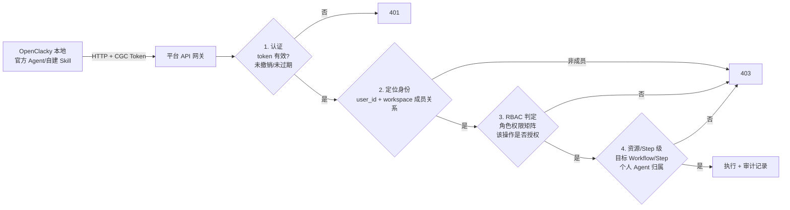
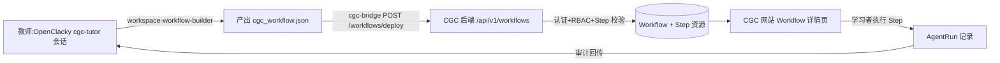

# CGC 扩展(OpenClacky)设计与严格授权架构实施计划

> 调研日期:2026-07-31 · 范围:OpenClacky 官方文档(扩展系统 / WebUI / HTTP API / 运行时补丁 / SKILL.md / Agent 配置 / API 接入)
> 来源文档:what-is-openclacky · extension-system · ext-manifest · extend-webui · extend-api · extend-patches · skill-frontmatter · agent-config · extend-host-api · api-reference
> 本文件回答:**CGC 扩展(人人安装的统一入口)如何承载平台 Agent/个人 Agent 对应的技能与助手,平台如何对"用户经 OpenClacky 发起的一切操作"做严格认证与授权**。

---

## 一、OpenClacky 平台认知(调研结论)

### 1.1 一句话定位

OpenClacky 是运行在**用户本地电脑**上的 AI Agent:通过 **Skill**(预设工作流)完成专业任务,可读写文件、执行命令、操作浏览器、调用 API;支持终端 / Web UI / IM 多种入口;多 Session 管理 + 长期记忆;可打包成品牌化产品分发(加密、license 门控)。

### 1.2 扩展系统(一个容器 × 三层来源 × 七种贡献)

```
扩展容器(目录)
└── ext.yml          # 清单:id/name/version/contributes
    └── contributes: # 七种贡献,可任意组合
        panels    → Web UI 面板/可视化
        api       → HTTP 后端接口(挂 /api/ext/<id>/)
        skills    → 教 AI 新技能(SKILL.md)
        agents    → 带专属人格/面板/技能的助手
        channels  → 新 IM 渠道
        patches   → 运行时补丁(prepend,带指纹漂移保护)
        hooks     → 拦截/审计工具调用
```

- **三层来源(覆盖优先级)**:`builtin` < `installed`(市场装)< `local`(自己写,`~/.clacky/ext/local/<id>/`)。
- **CLI 闭环**:`clacky ext new` → `verify`(当"编译器")→ `list` → `pack` → `install` → `search` → `publish`(可 `--status draft`)。
- **热更新**:改 view.js / handler.rb 即时生效;改 ext.yml 需重载。
- **隔离兜底**:面板回调 try/catch;`?pure=true` 逃生;扩展只能经 `Clacky.ext` 入口接触主框架。
- **变现**:`origin: self`(明文)vs `origin: marketplace` + `protected: true`(加密/license 门控)。

### 1.3 与我们最相关的四种贡献

| 贡献 | 承载 | 关键能力 |
|---|---|---|
| **skills** | SKILL.md + scripts/references | frontmatter 触发(description)/工具约束(forbidden_tools / allowed-tools)/隔离(fork_agent)/模型(model: lite)/注入(context)/执行后 hook(after_task);渐进加载(元数据常驻 → 正文触发时 → 资源按需) |
| **agents** | prompt.md + 引用 | 专属人格;`panels: [id]` 挂面板、`skills: [id]` 绑技能;一个容器可定义**多个 Agent**(数组) |
| **panels** | 普通 JS(无构建工具链) | `Clacky.ext.ui.mount(slot, render, opts?)` 挂具名插槽;`Clacky.ext.subscribe` 监听;`Clacky.ext.api.register` 注册数据源 |
| **api** | Ruby handler.rb | 挂 `/api/ext/<id>/`;get/post/put/patch/delete DSL;**强能力**:`create_session` / `submit_task` / `dispatch_to_session`;公开接口需 `public_endpoint` + ext.yml `public: true` 双重声明 |

### 1.4 用户自建 Skill/Agent(与官方扩展的边界)

Skill 加载优先级(三级):**项目级** `.clacky/skills/<name>/` → **用户级** `~/.clacky/skills/<name>/` → **内置 gem**。用户可在任一层自建 SKILL.md,也可装市场扩展、自写 agent。

> 结论:**用户自建 Skill/Agent 与官方扩展是两个独立来源**。官方扩展负责"提供能力 + 统一出入口";用户自建的东西想操作 CGC 平台,要么走官方扩展的桥,要么直连平台 API——**平台侧一律按同一套严格授权链判定,不区分客户端来源**。详见 §3。

### 1.5 主服务原生 HTTP API 与云端 API

- 主服务原生接口:面板与主服务同源,`fetch("/api/...")` 自动带 access key(会话/记忆/技能/定时任务/账单等)。——这是 OpenClacky 本地能力,**与 CGC 平台无关**。
- 云端 API(`api.openclacky.com`):OpenAI 兼容 LLM 网关,按量计费——**调 LLM 用的,不是管会话/扩展用的**。

---

## 二、CGC 扩展设计(人人安装的统一入口)

### 2.1 定位与命名

- **扩展就叫 CGC**(容器 id `cgc`,展示名 CGC),对应用户说的"codingirlsclub"。**每个平台用户都安装**——不是教师专属工具,而是用户在 OpenClacky 里操作 CGC 平台的统一入口。
- **命名规范:技能与 Agent 统一加 `workspace-` 前缀**(面向 CGC Workspace 的操作),面板/接口沿用。
- 扩展内**官方预置**的技能与 Agent,与平台领域模型中的 Agent 形态对应:
  - **公共 Agent**(Workspace 级、按 Workflow 授权)→ 扩展预置的官方 Agent(如教研助手、活动筹备)。
  - **个人 Agent**(角色分身、仅本人可见可用)→ 用户在扩展内通过**个人 Agent 构建技能**自建(创建时经平台 API 落个人 Agent 记录,受权限矩阵约束)。

### 2.2 容器结构

```
~/.clacky/ext/local/cgc/
├── ext.yml                        # 清单
├── skills/                        # 官方预置技能(全部 workspace- 前缀)
│   ├── workspace-workflow-builder/    # Workspace Workflow 构建器(核心)
│   │   ├── SKILL.md
│   │   └── workflow_dsl.rb
│   └── workspace-agent-builder/       # 个人 Agent 构建器(可选 v0.2)
│       ├── SKILL.md
│       └── agent_dsl.rb
├── agents/                        # 官方预置 Agent(对应公共 Agent)
│   ├── workspace-tutor.md             # CGC 教研助手(公共 Agent:教研类)
│   └── workspace-event-prep.md        # 活动筹备助手(公共 Agent:协作类)
├── panels/
│   ├── workspace-workflow-viewer/     # Workflow 可视化面板
│   │   └── view.js
│   └── workspace-agent-manager/       # 个人 Agent 管理面板
│       └── view.js
└── api/
    ├── handler.rb                 # cgc-bridge:平台唯一出入口
    └── data/                      # 扩展私有数据(token 不落盘于此,见 §3.4)
```

```yaml
# ext.yml
id: cgc
name: CGC
title: CGC
description: CGC(Coding Girls Club)平台官方扩展。提供 Workspace Workflow 构建器、个人 Agent 构建器、教研助手等技能与 Agent,并通过 cgc-bridge 与 CGC 平台安全对接。每个 CGC 用户都应安装。
version: "0.1.0"
author: CGC
origin: self
contributes:
  skills:
    - id: workspace-workflow-builder
      dir: skills/workspace-workflow-builder/
    - id: workspace-agent-builder
      dir: skills/workspace-agent-builder/
  agents:
    - id: workspace-tutor
      title: Workspace 教研助手
      prompt: agents/workspace-tutor.md
      panels: [workspace-workflow-viewer]
      skills: [workspace-workflow-builder]
    - id: workspace-event-prep
      title: Workspace 活动筹备
      prompt: agents/workspace-event-prep.md
      panels: [workspace-workflow-viewer]
  panels:
    - id: workspace-workflow-viewer
      title: Workflow
      view: panels/workspace-workflow-viewer/view.js
      attach: [workspace-tutor, workspace-event-prep]
    - id: workspace-agent-manager
      title: 我的 Agent
      view: panels/workspace-agent-manager/view.js
  api: api/handler.rb
```

### 2.3 skills / workspace-workflow-builder(核心)

```markdown
---
name: workspace-workflow-builder
description: >
  当用户想为 CGC 平台构建/设计一个 Workspace 教研 Workflow 时触发。
  典型触发:"帮我设计一个入门 HTML 课程的工作流"、"把这份大纲变成
  Workflow"、"workspace-workflow-builder"。构建产物通过 cgc-bridge 部署
  到 CGC 平台(受平台严格授权校验)。
fork_agent: true
allowed-tools: [file_reader, web_fetch, write, safe_shell]
model: default
context:
  - ~/.clacky/memories/cgc.md   # CGC 领域常识(角色/Step 授权约定)
---

# Workspace Workflow 构建器

把教研需求转化为平台可执行的 Workflow(产出 Workflow DSL,JSON)。

## 产出格式
{
  "name": "HTML 入门第一课",
  "description": "...",
  "steps": [
    { "position": 1, "title": "大纲设计", "type": "content",
      "allowed_roles": ["Tutor"], "agent_hint": "..." },
    { "position": 2, "title": "招募物料", "type": "content",
      "allowed_roles": ["Volunteer"], ... },
    { "position": 3, "title": "答疑", "type": "discussion",
      "allowed_roles": ["Tutor", "Learner"], ... }
  ]
}

## 流程
1. 澄清需求:面向谁(Learner 画像)、目标、内容规模、时长。
2. 拆 Step:每步给 position/title/type/allowed_roles(与平台 Role 对齐)。
3. 校验:Step 顺序合理、角色存在、无遗漏。
4. 输出完整 JSON(写到会话工作目录 cgc_workflow.json)。
5. 调用 cgc-bridge 部署(见 §2.5)。

## 权限提示
部署动作由平台侧严格授权:只允许"创建/部署 Workflow"权限的角色
(Owner/Admin/Tutor)。若被平台拒绝(401/403),如实告知用户,不要尝试绕过。
```

### 2.4 agents / 官方预置(对应公共 Agent)

```markdown
# agents/workspace-tutor.md

你是 CGC 平台的 Workspace 教研助手,帮助老师把课程想法落地为平台可执行的
Workflow。你默认绑定 workspace-workflow-builder 技能与 Workflow 面板。

- 说话简洁、结构化,面向非技术教研老师。
- 构建前澄清:面向谁 / 目标 / 规模 / 时长。
- 角色命名必须与 CGC 平台角色一致(Owner/Admin/Tutor/Volunteer/Learner)。
- 所有对平台的操作一律经 cgc-bridge 发出;平台拒绝时如实转告,绝不绕过。
```

### 2.5 api / cgc-bridge(平台唯一出入口)

```ruby
# api/handler.rb —— 用户经 OpenClacky 操作平台的一切请求都从这里走
class CgcBridge < Clacky::ApiExtension
  def platform
    base = config["cgc_base_url"] || "https://api.cgc.dev"
    [base, config["cgc_api_token"]]   # token 由用户在平台签发,见 §3.4
  end

  # GET  /api/ext/cgc/workflow?workspace_slug=xxx
  get "/workflow" do
    # 读本地草稿 cgc_workflow.json(未部署前预览,纯本地)
    path = File.join(working_dir, "cgc_workflow.json")
    File.exist?(path) ? json(JSON.parse(File.read(path))) : error!("not found", 404)
  end

  # POST /api/ext/cgc/workflows/deploy  → 平台 /api/v1/workflows
  post "/workflows/deploy" do
    forward(:post, "/api/v1/workflows", json_body)
  end

  # POST /api/ext/cgc/agents         → 创建个人 Agent(受权限矩阵约束)
  post "/agents" do
    forward(:post, "/api/v1/agents", json_body)
  end

  # GET  /api/ext/cgc/me             → 查询 token 对应身份与权限(前端可渲染"我能做什么")
  get "/me" do
    forward(:get, "/api/v1/me", {})
  end

  private

  # 统一转发:附加平台 token + 客户端标识(审计用)
  def forward(method, path, body)
    base, token = platform
    resp = Net::HTTP.send(method, URI("#{base}#{path}"),
      body.to_json,
      "Authorization" => "Bearer #{token}",
      "X-CGC-Client" => "openclacky-ext-cgc/#{version}",
      "Content-Type" => "application/json")
    status = resp.code.to_i
    payload = JSON.parse(resp.body) rescue {}
    status < 400 ? json(payload) : error!(payload["error"] || "platform error", status: status)
  end
end
```

**设计要点**:
- cgc-bridge 是**唯一出入口**:官方 Agent/Skill、面板、用户自建 Skill 都经它访问平台(用户自建 Skill 也可直连,但同样过平台严格鉴权,见 §3)。
- **不开放** `public_endpoint`:一切平台操作都要求身份。

---

## 三、严格授权架构(平台侧,核心)

### 3.1 原则:平台永不信任客户端

- **token 只是身份凭证,不是权限凭证**。权限(角色 × 操作 × 资源 × Step 授权)永远在平台侧**每次请求实时计算**。
- **与客户端无关**:无论是 CGC 扩展、用户自建 Skill、还是用户手动 curl,平台对同一身份给同一判定。
- **防绕过**:用户自建 Skill 无法通过"换个请求头"获得更多权限——平台不看客户端声明,只看 token 身份 + 服务端权限模型。
- **审计闭环**:一切平台操作(网站 UI 或 OpenClacky)统一记录 actor / client / 资源 / 结果。

### 3.2 授权链(每次请求)



1. **认证**:验证平台 API token(格式/签名/有效期/撤销状态)。
2. **定位身份**:token → user;校验该用户在目标 `workspace_slug` 的**成员关系与角色**(实时查,不缓存)。
3. **RBAC 判定**:查角色权限矩阵,该操作(如 `workflow.create` / `agent.create` / `step.execute`)是否允许。
4. **资源级/Step 级**:目标 Workflow/Step 是否属于该 workspace;个人 Agent 操作校验 agent.owner == user;Step 执行校验 Step.allowed_roles 命中当前用户角色。
5. **执行 + 审计**:记录 actor(user)、client(如 `openclacky-ext-cgc/0.1.0` 或 `custom-skill/<name>`)、操作、资源、结果、时间。

### 3.3 与领域模型权限矩阵的衔接

| 平台操作(经 OpenClacky) | 平台侧强制校验 | 备注 |
|---|---|---|
| 部署 Workflow(workspace-workflow-builder) | RBAC:`workflow.create/deploy` 授权角色(Owner/Admin/Tutor) | 与领域模型 §5 一致 |
| 执行 Agent Step | RBAC + Step.allowed_roles + 成员关系 | Learner/Volunteer 按 Workflow 授权 |
| 创建个人 Agent(workspace-agent-builder) | 成员身份(任何成员可建自己的) | 个人 Agent owner = 创建者,仅本人可见可用 |
| 使用公共 Agent | RBAC + 成员关系 | 公共 Agent 是 Workspace 级,按 Workflow 授权 |
| 读取/修改 Workspace 内容 | RBAC 对应权限 | 严格按角色 |

### 3.4 CGC API Token 设计(平台签发)

| 字段 | 说明 |
|---|---|
| 签发方 | CGC 平台(网站"设置 → API Token"页) |
| 绑定 | `user_id` + `workspace_id`(单 workspace 一个 token,多 workspace 各自签发) |
| 能力域(可选) | `read` / `workflow:write` / `agent:write` —— 最小权限签发 |
| 有效期 | 默认 30 天,可自定义;到期自动失效 |
| 撤销 | 网站一键撤销,立即全局失效(黑名单/DB 校验) |
| 存储 | **只存用户本地**;OpenClacky 扩展 config 由用户粘贴;平台只存 hash,不落明文 |

> 提示:token 是"该用户的身份"。若用户自建 Skill 用它操作,平台按同一身份 + 权限矩阵判定——**用户的越权尝试(如 Learner 想部署 Workflow)会被 403 拒绝,与客户端无关**。

### 3.5 审计与告警(可选增强)

- 审计日志:所有 API 请求落表(`actor_id, client, action, resource, workspace_id, ip, result, created_at`)。
- 异常告警:同一 token 高频 403 / 尝试访问他人 workspace 资源 → 标记、提示改密或撤销。
- 网站管理页可查"我的审计记录"(普通用户看自己的;Owner/Admin 看 workspace 的)。

---

## 四、网站适配方案(Next.js 侧)

### 4.1 端到端闭环



### 4.2 网站适配点清单

| # | 适配点 | 位置 | 说明 |
|---|---|---|---|
| 1 | **部署回调 API** | 后端 `/api/v1/workflows`(REST) | cgc-bridge 调用;走 §3 完整授权链;幂等(同 name+workspace 更新) |
| 2 | **API Token 签发/撤销页** | 网站设置页 | 按 workspace 签发、设有效期、一键撤销;展示"我能做什么"(调 /me 渲染权限) |
| 3 | **Workflow 结构展示** | Workflow 详情页 | 按 Step 渲染流程(含 allowed_roles/agent_hint) |
| 4 | **"在 OpenClacky 中编辑"入口** | Workflow 详情页按钮 | 安装引导 + 触发指引;本地 OpenClacky 可用时提供直达 |
| 5 | **扩展安装引导页** | 网站新增一页 | 面向所有用户的"装 CGC 扩展 + 签发 token + 粘贴配置"步骤 |
| 6 | **AgentRun 执行记录展示** | Workflow/Step 详情 | 平台内与 OpenClacky 侧统一落 AgentRun,网站只读展示 |
| 7 | **Workspace 设置页** | 设置页 | 展示构建/部署权限(Owner/Admin/Tutor)与 token 状态 |

### 4.3 关键约束:本地 vs 云端

- OpenClacky 在用户本地;网站是云服务。两者经平台后端间接协作,网站**不直接**访问本地服务(跨源 + token 不可控)。
- 网站给用户的"编辑入口"是引导:打开本地 OpenClacky → cgc-tutor 会话 → 说需求 → 部署回流平台。

---

## 五、端到端 TDD 实施计划

### P0:OpenClacky CGC 扩展(local 层自测)

| # | 步骤 | 动作 | 验证 |
|---|---|---|---|
| 0.1 | 生成骨架 | `clacky ext new cgc --full` | `clacky ext verify` 绿 |
| 0.2 | 写 workspace-workflow-builder | 编辑 SKILL.md(§2.3) | cgc-tutor 会话内触发 → 产出合法 JSON |
| 0.3 | 写官方 Agent | workspace-tutor / workspace-event-prep | 新会话出现 Agent 卡片;面板出现 |
| 0.4 | 写面板 | workflow-viewer / agent-manager | verify 过;浏览器渲染;`?pure=true` 逃生 |
| 0.5 | 写 cgc-bridge handler | handler.rb(§2.5) | `curl /api/ext/cgc/me` 返回身份;verify 过 |
| 0.6 | 本地联调 | 构建→预览→deploy(后端未就绪先 mock) | 请求完整发出 |

### P1:CGC 后端严格授权链(Elixir,TDD —— 本阶段核心)

| # | 功能 | 测试(先写) | 实现 | 验证 |
|---|---|---|---|---|
| 1.1 | token 认证 | 无/错/过期/撤销 token → 401 | token 校验中间件(Ash Authentication 扩展或 plug) | `mix test` 绿 |
| 1.2 | 身份与成员关系 | token 用户非 workspace 成员 → 403 | 实时查成员关系 | 绿 |
| 1.3 | RBAC 判定 | 角色权限矩阵;无权限操作 → 403 | 自研 Rbac 模块(角色 × 操作 × 资源) | 绿 |
| 1.4 | 资源/Step 级 | 跨 workspace 资源 → 403;个人 Agent 归属不符 → 403 | set_tenant + owner 校验 + Step.allowed_roles | 绿 |
| 1.5 | Workflow 入库 | 合法 DSL → Workflow+Step 落库;幂等更新 | action/controller | 绿 |
| 1.6 | Step 校验 | allowed_roles 引用不存在角色 → 422 | DSL 校验 | 绿 |
| 1.7 | 审计落表 | 每次成功/失败请求记 audit_log | 审计插件/中间件 | 绿 |
| 1.8 | 多租户隔离 | 跨租户 token 写入拒绝 | token 绑定 workspace + set_tenant | 绿 |

### P2:网站适配(Next.js,TDD)

| # | 功能 | 测试 | 实现 | 验证 |
|---|---|---|---|---|
| 2.1 | Workflow 详情页(Step 流程渲染) | 组件测试 | Apollo query + 渲染 | 手动绿 |
| 2.2 | API Token 签发/撤销页 | 组件测试 | 表单 + 撤销交互 | 手动绿 |
| 2.3 | 扩展安装引导页 | 组件测试 | 步骤 + 探测指引 | 手动绿 |
| 2.4 | "在 OpenClacky 中编辑"入口 | 组件测试 | 引导弹层 | 手动绿 |
| 2.5 | AgentRun 记录展示 | 组件测试 | 列表/详情 | 手动绿 |

### P3:联调与发布

- 真机端到端:用户装扩展 → 签发 token → 粘贴配置 → 构建 Workflow → 部署 → 网站可见 → 学习者执行 → AgentRun 审计回传。
- 越权演练:Learner 尝试部署 → 403;个人 Agent 访问他人 → 403。
- 发布:`clacky ext publish cgc --status draft`(先草稿)→ 市场正式版。

---

## 六、风险与注意点

1. **技术栈跨界**:扩展是 Ruby(api)/ 普通 JS(panels)/ Markdown(skills),后端是 Elixir——只通过 HTTP 对接,不共享代码/进程。
2. **本地 vs 云端**:OpenClacky 在用户本地,平台是云服务;部署是"本地 → 平台后端"单向推送。
3. **鉴权链(最重要)**:token 泄露 = 身份被冒用 → token 短期、可撤销、按 workspace+能力域最小签发;平台只存 hash;异常高频 403 告警。
4. **防绕过**:用户自建 Skill/Agent 是"合法客户端",但不代表"额外权限"——平台授权链与客户端无关,任何越权尝试一律 403 + 审计。
5. **多租户**:token 绑定 workspace,后端严格 set_tenant,跨租户写入拒绝。
6. **DSL 版本**:Workflow DSL 是平台与扩展的契约,Workflow 资源加 `dsl_version` 字段。
7. **面板热更新陷阱**:render 首参是 container(不是 ctx);面板异常只降级自身,靠 verify + 控制台兜底。
8. **补丁慎用**:本方案不需要 patches;若未来要改内置行为优先 skill/agent 方案。
9. **扩展 ≠ 安全边界**:扩展只负责"方便与统一入口",安全边界 100% 在平台侧。文档、实施、验收都要以此为准。

---

## 七、与既有文档的关系

| 文档 | 关系 |
|---|---|
| `docs/领域模型定稿.md` §2/§5 | 角色建模与 Workflow 部署权限是本方案授权链的输入;Agent 两形态(个人/公共)对应扩展内 Agent 的组织方式 |
| `docs/用户旅程与Web功能清单.md` | 网站适配点(4.2)对应页面清单 |
| `docs/技术调研与实施计划.md` M1/M2 | 平台的 Workflow/Step/AgentRun 资源与执行底座;本方案把"构建"环节搬到 OpenClacky,并新增"严格授权链"作为 P1 核心 |
