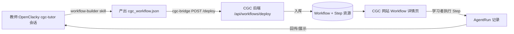

# OpenClacky 扩展调研与 CGC 平台适配实施计划

> 调研日期:2026-07-31 · 范围:OpenClacky 官方文档(扩展系统 / WebUI / HTTP API / 运行时补丁 / SKILL.md / Agent 配置 / API 接入)
> 来源文档:what-is-openclacky · extension-system · ext-manifest · extend-webui · extend-api · extend-patches · skill-frontmatter · agent-config · extend-host-api · api-reference
> 本文件回答:**Workflow 构建器如何以 OpenClacky 扩展(容器)交付,网站如何配套适配**,并给出端到端 TDD 实施计划。

---

## 一、OpenClacky 平台认知(调研结论)

### 1.1 一句话定位

OpenClacky 是运行在**用户本地电脑**上的 AI Agent:通过 **Skill**(预设工作流)完成专业任务,可读写文件、执行命令、操作浏览器、调用 API;支持终端 / Web UI / IM(飞书、企微、微信)多种入口;多 Session 管理 + 长期记忆;可打包成**品牌化产品**分发(加密、license 门控)。

### 1.2 扩展系统(本调研的核心)

**一个容器 × 三层来源 × 七种贡献**——以前散落的各种定制能力,现在统一收敛为"一个目录 + 一份 `ext.yml`":

```
扩展容器(目录)
└── ext.yml          # 清单:id/name/version/contributes
    └── contributes: # 七种贡献,可任意组合
        panels    → Web UI 面板/按钮/可视化
        api       → HTTP 后端接口(挂 /api/ext/<id>/)
        skills    → 教 AI 新技能(SKILL.md)
        agents    → 带专属人格/面板/技能的助手
        channels  → 新 IM 渠道
        patches   → 给内置方法打运行时补丁(prepend,带指纹漂移保护)
        hooks     → 拦截/审计工具调用(before_tool_use 等)
```

- **三层来源(覆盖优先级)**:`builtin`(gem 内置)< `installed`(市场装的)< `local`(自己写的,`~/.clacky/ext/local/<id>/`)。同 id 时 local 整体覆盖 builtin——不改 gem 源码即可覆盖官方行为。
- **CLI 闭环**:`clacky ext new <id>` 建骨架 → `clacky ext verify` 校验(给 AI 当"编译器")→ `clacky ext list` 看覆盖关系 → `clacky ext pack` 打包 → `clacky ext install` 安装 → `clacky ext search` 搜市场 → `clacky ext publish` 发布(可 `--status draft`)。
- **热更新**:改 view.js / handler.rb 下次请求即生效;改 ext.yml 才需重载。
- **隔离兜底**:每个面板回调 try/catch;`?pure=true` 一键回到纯净官方界面;扩展只能经 `Clacky.ext` 唯一入口接触主框架。
- **变现**:`origin: self`(明文,可 fork)vs `origin: marketplace` + `protected: true`(加密、license 门控、不可 fork)。

### 1.3 与我们最相关的四种贡献(能力要点)

| 贡献 | 承载 | 关键能力 |
|---|---|---|
| **skills** | SKILL.md + 脚本 | frontmatter 控制触发(description)/工具约束(forbidden_tools / allowed-tools)/隔离(fork_agent)/模型(model: lite)/注入(context)/执行后 hook(after_task) |
| **agents** | prompt.md + 引用 | 专属人格 system prompt;`panels: [id]` 挂面板、`skills: [id]` 绑技能(可引用本容器或别处公共件) |
| **panels** | 普通 JS(无构建工具链) | `Clacky.ext.ui.mount(slot, render, opts?)` 挂具名插槽;`Clacky.ext.subscribe(event, fn)` 监听;`Clacky.ext.api.register(name, fn)` 注册数据源;插槽分全局空白区 / 设置页 / Session 级(含 tab 容器 session.aside) |
| **api** | Ruby handler.rb | 挂 `/api/ext/<id>/`;`get/post/put/patch/delete` DSL;上下文白名单( params/json()/error!()/data_path() 等);**强能力**:`create_session` / `submit_task` / `dispatch_to_session`(驱动 agent 干活);超时默认 10s 上限 600s;公开接口需 `public_endpoint` + ext.yml `public: true` 双重声明 |

### 1.4 主服务原生 HTTP API(面板可直接 fetch)

面板与主服务同源,`fetch("/api/...")` 自动带 access key 鉴权。能力域:会话(GET/POST /api/sessions、消息、文件、git、时光机、切换模型)、回收站(/api/trash*)、技能(/api/skills)、Agent(/api/agents)、模型(/api/providers)、记忆(GET/POST /api/memories)、定时任务(/api/cron-tasks)、账单(/api/billing/*)、文件(/api/upload、/api/file-action)、媒体生成(/api/media/*,计费)。

### 1.5 云端 API(与我们后端对接无关,但值得知道)

`https://api.openclacky.com` 提供 OpenAI 兼容端点(chat/images/videos/audio、Anthropic、Gemini、Bedrock 风格),Bearer Key 鉴权、按量计费——**这是给"调用 LLM"用的,不是给"管理会话/扩展"用的**。

---

## 二、CGC 扩展设计:一个容器,四种贡献

> 决策来源:`docs/领域模型定稿.md §5`——不做可视化/表单式构建 UI,Workflow 由 OpenClacky 的 Agent/Skill 构建,产物**部署为 Workspace 的 Workflow**。

### 2.1 容器总览

```
~/.clacky/ext/local/cgc-workflow-builder/
├── ext.yml                    # 清单(见下)
├── skills/
│   └── workflow-builder/
│       ├── SKILL.md           # 构建器技能(核心)
│       └── workflow_dsl.rb    # 可选:Workflow 定义校验/生成脚本
├── agents/
│   └── cgc-tutor.md           # CGC 教研助手人格
├── panels/
│   └── workflow-viewer/
│       └── view.js            # Workflow 可视化面板
└── api/
    ├── handler.rb             # 平台对接桥(部署/查询)
    └── data/                  # 扩展私有数据(可选)
```

```yaml
# ext.yml
id: cgc-workflow-builder
name: CGC Workflow 构建器
description: 为 CGC 平台构建并部署教研 Workflow 的扩展(Workflow 构建器 + 教研助手 + 可视化面板 + 平台桥)
version: "0.1.0"
author: CGC
origin: self
contributes:
  skills:
    - id: workflow-builder
      dir: skills/workflow-builder/
  agents:
    - id: cgc-tutor
      title: CGC 教研助手
      prompt: agents/cgc-tutor.md
      panels: [workflow-viewer]
      skills: [workflow-builder]
  panels:
    - id: workflow-viewer
      title: Workflow
      title_zh: Workflow 结构
      view: panels/workflow-viewer/view.js
      attach: [cgc-tutor]
  api: api/handler.rb
```

### 2.2 skills / workflow-builder(Workflow 构建器 —— 核心)

```markdown
---
name: workflow-builder
description: >
  当用户想为 CGC 平台构建/设计一个教研 Workflow 时触发。
  典型触发:"帮我设计一个入门 HTML 课程的工作流"、"把这份大纲变成 Workflow"、
  "workflow-builder"。构建产物通过 cgc-bridge API 部署到 CGC 平台 Workspace。
fork_agent: true            # 独立子 Agent,隔离工具调用、不污染主对话
allowed-tools:              # 白名单:只读 + 写 Workflow 定义文件
  - file_reader
  - web_fetch
  - write
  - safe_shell
model: default
context:
  - ~/.clacky/memories/cgc.md   # 注入 CGC 领域常识(角色/Step 授权约定)
---

# Workflow 构建器

你是 CGC 平台的 Workflow 设计师。把教研需求转化为平台可执行的 Workflow。

## 产出格式(Workflow DSL, JSON)
{
  "name": "HTML 入门第一课",
  "description": "...",
  "steps": [
    { "position": 1, "title": "大纲设计", "type": "content",
      "allowed_roles": ["Tutor"], "agent_hint": "..." },
    { "position": 2, "title": "招募物料", "type": "content",
      "allowed_roles": ["Volunteer"], ... },
    { "position": 3, "title": "答疑", "type": "discussion",
      "allowed_roles": ["Tutor", "Learner"], ... }
  ]
}

## 流程
1. 澄清需求:面向谁(Learner 画像)、目标、内容规模、时长。
2. 拆 Step:每步给 position/title/type/allowed_roles(角色名要与平台 Role 对齐)。
3. 校验:Step 顺序合理、角色存在、无遗漏。
4. 输出完整 JSON(写到会话工作目录 cgc_workflow.json)。
5. 调用平台桥部署(见 api/handler.rb)或告知用户"已就绪,可部署"。
```

**权限说明**:允许谁用这个 skill 构建 Workflow = OpenClacky 侧由"谁能使用 cgc-tutor agent"(安装/授权层面)控制;平台侧由部署 API 的 CGC token 角色(Owner/Admin/Tutor)控制——**双层闸门**,与领域模型 §5 一致。

### 2.3 agents / cgc-tutor(CGC 教研助手)

```markdown
# CGC 教研助手

你是 Coding Girls Club 的教研助手,帮助老师把课程想法落地为平台可执行的
Workflow。你默认绑定 workflow-builder 技能和 Workflow 可视化面板。

- 说话简洁、结构化,面向非技术教研老师。
- 构建 Workflow 前先澄清:面向谁 / 目标 / 规模 / 时长。
- 角色命名必须与 CGC 平台角色一致(Owner/Admin/Tutor/Volunteer/Learner)。
- 构建产物默认落盘 cgc_workflow.json,部署动作走 cgc-bridge API。
```

### 2.4 panels / workflow-viewer(Workflow 可视化面板)

```javascript
// panels/workflow-viewer/view.js —— 普通 JS,无构建工具链
// 挂到 main.workspace(主内容区整块面板)+ session.aside(tab)
Clacky.ext.ui.mount("main.workspace", (container, ctx) => {
  container.innerHTML = `<h3>CGC Workflow</h3><div id="cgc-wf"></div>`;
  const render = async () => {
    const res = await fetch("/api/ext/cgc-workflow-builder/workflow");
    const data = await res.json();
    document.getElementById("cgc-wf").innerHTML = stepsToHTML(data.workflow);
  };
  render();
  // 监听会话文件变化 → 重新渲染
  Clacky.ext.subscribe("session:files_changed", render);
});

Clacky.ext.ui.mount("session.aside", { tab: { id: "cgc-wf", label: "Workflow" } },
  (container, ctx) => { /* 精简版:步骤列表 + 状态 */ });
```

### 2.5 api / cgc-bridge(平台对接桥)

```ruby
# api/handler.rb
class CgcBridge < Clacky::ApiExtension
  # 平台 API 地址与 token 写在 ext.yml config: 段
  def cgc_api
    base = config["cgc_base_url"] || "http://localhost:4000"
    token = config["cgc_api_token"]
    [base, token]
  end

  # GET /api/ext/cgc-workflow-builder/workflow
  # 读取会话工作目录里的 cgc_workflow.json(未部署前的预览)
  get "/workflow" do
    path = File.join(working_dir, "cgc_workflow.json")
    File.exist?(path) ? json(JSON.parse(File.read(path))) : error!("not found", status: 404)
  end

  # POST /api/ext/cgc-workflow-builder/deploy
  # 部署 Workflow 到 CGC 平台(远程后端):body = { workspace_slug, workflow }
  post "/deploy" do
    payload = json_body["workflow"]
    workspace = json_body["workspace_slug"]
    base, token = cgc_api
    resp = Net::HTTP.post(URI("#{base}/api/workflows/deploy"), payload.merge(workspace_slug: workspace).to_json,
      "Authorization" => "Bearer #{token}", "Content-Type" => "application/json")
    resp.code == "201" ? json(JSON.parse(resp.body)) : error!("deploy failed", status: 502)
  end

  # POST /api/ext/cgc-workflow-builder/run —— 可选:把 Workflow 执行交给平台 AgentRun
  post "/run" do
    # dispatch_to_session(...) 或调用平台执行 API,记录 AgentRun
  end
end
```

**鉴权说明**:OpenClacky 侧默认非 loopback 请求需 access key(浏览器同源自动带);CGC 侧用 `config["cgc_api_token"]`(平台签发、带 workspace/角色上下文)。**不开放** `public_endpoint`——deploy 是特权操作。

---

## 三、网站适配方案(Next.js 侧)

### 3.1 端到端闭环(Mermaid)



### 3.2 网站适配点清单

| # | 适配点 | 位置 | 说明 |
|---|---|---|---|
| 1 | **部署回调 API** | Phoenix 后端新增 `/api/workflows/deploy`(或走 GraphQL mutation) | OpenClacky cgc-bridge 调用;校验 CGC API token + workspace 上下文;幂等(同 name+workspace 更新) |
| 2 | **Workflow 结构展示** | 网站 Workflow 详情页 | 前端按 Step 渲染流程(含 allowed_roles/agent_hint);数据来自平台库,与 OpenClacky 无关 |
| 3 | **"在 OpenClacky 中编辑"入口** | Workflow 详情页按钮 | deep link 引导:展示安装/使用指引(如何装 cgc-workflow-builder 扩展、如何触发 cgc-tutor);本地 OpenClacky 服务可用时提供直达链接 |
| 4 | **扩展安装引导页** | 网站新增一页 | 面向教师的"怎么装 CGC 扩展"步骤(`clacky ext install` 或市场搜索);可内嵌主服务地址探测 |
| 5 | **AgentRun 执行记录展示** | 网站 Workflow/Step 详情 | 平台内执行(学习者侧)与 OpenClacky 侧执行(教师侧)统一落 AgentRun,网站只读展示 |
| 6 | **Workspace 设置页适配** | 设置页 | 展示"构建/部署权限"(Owner/Admin/Tutor)与当前 CGC token 状态 |

### 3.3 关键约束:本地 vs 云端

- OpenClacky 跑在**教师本地**;CGC 网站是**云服务**。两者通过**平台后端**间接协作(本地→后端 deploy API),**不直接**网站→本地(除非同机开发环境)。
- 网站给教师的"编辑入口"本质是**引导**:告诉教师打开本地 OpenClacky、进 cgc-tutor 会话、说需求;构建完成点部署即回流平台。网站不做 iframe 嵌入本地服务(跨源 + access key 不可控)。

---

## 四、端到端 TDD 实施计划

> 顺序:P0(OpenClacky 侧,本地可自测)→ P1(后端 deploy API,TDD)→ P2(网站适配)。
> OpenClacky 侧"测试"= `clacky ext verify` + 手动/curl 验证(扩展是 Ruby/JS 运行时,官方无单测框架,以 verify + 冒烟为主);后端/网站照常 TDD。

### P0:OpenClacky 扩展(local 层,自测闭环)

| # | 步骤 | 动作 | 验证 |
|---|---|---|---|
| 0.1 | 生成骨架 | `clacky ext new cgc-workflow-builder --full` | 目录生成,`clacky ext verify` 绿 |
| 0.2 | 写 workflow-builder skill | 编辑 SKILL.md(§2.2) | 在 cgc-tutor 会话里说"帮我设计一个入门 HTML 工作流"→ 产出合法 JSON |
| 0.3 | 写 cgc-tutor agent | 编辑 agents/cgc-tutor.md + ext.yml 引用 | 新会话出现 cgc-tutor 卡片;面板出现 |
| 0.4 | 写 workflow-viewer panel | 编辑 view.js(§2.4) | `clacky ext verify` 过;浏览器刷新后面板渲染;`?pure=true` 可逃生 |
| 0.5 | 写 cgc-bridge handler | 编辑 handler.rb(§2.5) | `curl /api/ext/cgc-workflow-builder/workflow` 返回 JSON;`clacky ext verify` 过 |
| 0.6 | 本地联调 | 完整走一遍 §3.1 闭环(后端未就绪时先 mock) | 构建→预览→deploy 请求发出 |

### P1:CGC 后端 deploy API(Elixir,TDD)

| # | 功能 | 测试(先写) | 实现 | 验证 |
|---|---|---|---|---|
| 1.1 | 部署端点鉴权 | 无/错 token → 401;token 角色非 Owner/Admin/Tutor → 403 | 平台 API token 校验 + 角色判定(复用自研 Rbac) | `mix test` 绿 |
| 1.2 | Workflow 入库 | POST 合法 DSL → Workflow+Step 落库;同 name 幂等更新 | Controller/action(或 GraphQL mutation) | 绿 |
| 1.3 | Step 校验 | allowed_roles 引用了不存在的角色 → 422 | DSL 校验逻辑 | 绿 |
| 1.4 | 多租户隔离 | workspace_slug 对应 workspace 上下文;跨租户 token 拒绝 | set_tenant + Rbac | 绿 |

### P2:网站适配(Next.js,TDD)

| # | 功能 | 测试 | 实现 | 验证 |
|---|---|---|---|---|
| 2.1 | Workflow 详情页(Step 流程渲染) | 组件测试 | Apollo query + 流程渲染 | 手动绿 |
| 2.2 | 扩展安装引导页 | 组件测试 | 安装步骤 + 探测指引 | 手动绿 |
| 2.3 | "在 OpenClacky 中编辑"入口 | 组件测试 | deep link/指引弹层 | 手动绿 |
| 2.4 | AgentRun 记录展示 | 组件测试 | 列表/详情 | 手动绿 |

### P3:联调与发布

- 真机端到端:教师机装扩展 → 构建 → 部署 → 网站可见 → 学习者执行 → AgentRun 回传。
- 发布:`clacky ext publish cgc-workflow-builder --status draft`(先草稿)→ 市场正式版。

---

## 五、风险与注意点

1. **技术栈跨界**:扩展是 Ruby(api)/ 普通 JS(panels)/ Markdown(skills),后端是 Elixir——**只通过 HTTP 对接**,不共享代码/进程。
2. **本地 vs 云端**:OpenClacky 在教师本地,网站是云服务。部署是"本地 → 平台后端"单向推送;网站不直接访问本地服务。
3. **鉴权链**:CGC token(config 里配置,带 workspace+角色上下文)泄露 = 可越权部署 → token 应短期、可撤销,部署 API 校验 workspace 匹配。
4. **多租户**:deploy 请求必须携带 workspace 上下文,后端严格按 token 的 workspace 隔离(防止跨租户写入)。
5. **DSL 版本**:Workflow DSL(JSON 结构)是平台与扩展的**契约**,要版本化(Workflow 资源加 `dsl_version` 字段),扩展升级不破坏存量数据。
6. **面板热更新陷阱**:render 首参是 container(不是 ctx),写错参数会静默失效;面板异常只降级自己,靠 `clacky ext verify` + 控制台兜底。
7. **补丁慎用**:本方案**不需要 patches**(无内置方法需改动);若未来要改内置行为,优先 skill/agent 方案,避免供应链风险。
8. **实验性功能**:`ash_ai.gen.chat` 仍不采用;OpenClacky 承担"构建"心智,平台承担"执行与记录",职责清晰。

---

## 六、与既有文档的关系

| 文档 | 关系 |
|---|---|
| `docs/领域模型定稿.md` §5 | 本方案的输入(Workflow 构建器 = OpenClacky Agent/Skill;部署权限 Owner/Admin/Tutor) |
| `docs/用户旅程与Web功能清单.md` | 网站适配点(2.1–2.4)对应页面清单的 Workflow 执行页/Agent 对话页/Profile 页 |
| `docs/技术调研与实施计划.md` M1/M2 | 平台的 Workflow/Step/AgentRun 资源与执行(本方案 P1 的底座);本方案把"构建"环节从平台内搬到 OpenClacky |
