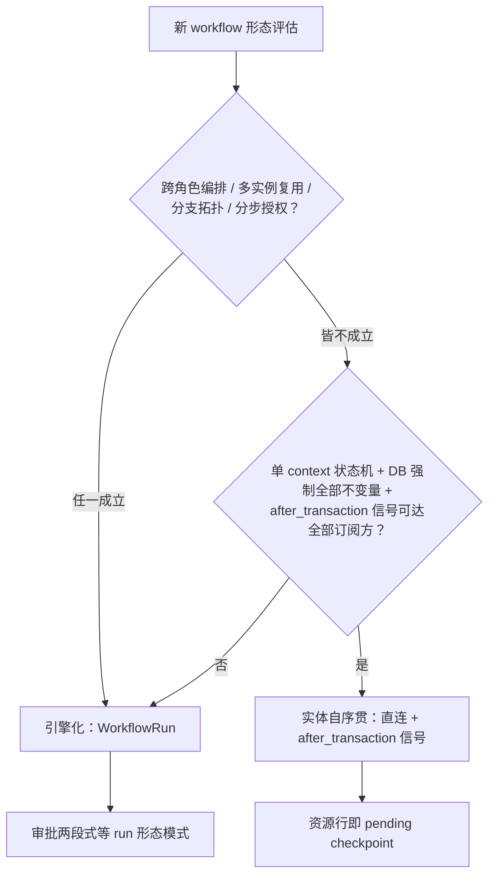

# Workflow Run 判据与报名最小接线 - Plan

## Goal Capsule

- **Objective:** 产出「什么配得上 WorkflowRun」判据 ADR，并首例应用于报名——Enrollment 保持实体自序贯，只补信号与提醒覆盖，正式退稿报名 DAG；「实体自序贯」作为第三种正式模式收入总纲 §6 模式库。
- **Product authority:** 用户（product owner）；判据默认倾向已在范围综合中确认为「实体自序贯优先、run 需证成」。
- **Execution profile:** code；4 个实施单元（U1-U2 文档，U3-U4 后端），由 ce-work 或等价执行器消费。
- **Stop conditions:** 出现推翻实体自序贯前提的新证据（如 Enrollment 不变量层被要求改造），停止并回到 ce-brainstorm。
- **Tail ownership:** 执行方负责测试绿与文档交叉引用可解析；Deferred to Follow-Up Work 由后续 plan 认领。
- **Open blockers:** 无。六项关键 repo 声明已由独立 verifier 全部确认（见 Sources / Research）。

---

## Product Contract

### Summary

写一份判据 ADR 回答「什么配得上 WorkflowRun」，默认实体自序贯、run 需证成；报名按判据落地为实体自序贯——补 `enrollment.submitted/completed` 信号、修复无 run 报名的 48h 提醒盲区、退稿报名 DAG；同时把「实体自序贯」立为总纲 §6 模式库的第三种正式模式，config-not-code 的旗舰证明留给赞助 workflow。

### Problem Frame

slice E 开工在即，报名 workflow 面对一个未被检验的隐含假设：所有业务 workflow 都该引擎化。现实是 Enrollment context 已全量建成——并发不变量由 DB 条件 UPDATE、partial unique index、action 事务承担（`backend/lib/cgc_2046/events/enrollment.ex:3-10`），审批的「persist_pending 停住 → 读回」由资源行的 `status=pending` 天然表达。报名定稿文档的 DAG（S1-S8 + 审批段 A1-A5）与已建动作 1:1 映射，引擎化带来的增量只剩 journal 可观测性，而 `Enrollment.status` 已表达同一时间线。

这个假设的代价已经可见：`enrollment.submitted/completed` 信号全库无生产者，学习 workflow 的触发约定悬在空中；48h 提醒只按 `workflow_run_id` 反查，无 run 的 pending Enrollment 覆盖率是 0%（`backend/lib/cgc_2046/workers/approval_reminder_worker.ex:117`）。同时，若每个 workflow 都默认上引擎，赞助/邀请/学习将逐个重开「要不要 run」的辩论，没有判据可查。

### Key Decisions

- **报名保持实体自序贯，不引擎化** (session-settled: user-directed — chosen over 引擎化接线：Enrollment 不变量已由 DB 承担、资源行即 pending checkpoint，引擎化零增量不变量；保留 B→A 可逆性)。Governs R3, R4, R5。
- **判据即产出，默认「实体自序贯、run 需证成」** (session-settled: user-directed — chosen over 预设引擎定位（默认载体 / 编排专用）：定位问题由判据文档回答，不预设)。Governs R1。
- **config-not-code 旗舰证明移到赞助** (session-settled: user-directed — chosen over 在报名热路径接线证明：赞助资源与 DAG 均需新建，证明力更强，报名不付仪式成本)。赞助设计不在本单元。
- **「实体自序贯」收入总纲 §6 模式库** (session-settled: user-directed — chosen over 仅写 ADR：词汇复利，防止「不引擎化」被误读为妥协)。Governs R2。
- **退稿报名 DAG 不退稿审批两段式** (session-settled: user-approved — chosen over 连同两段式一并退稿：赞助/邀请无自序贯实体且含两个顺序人工信号，仍依赖两段式)。Governs R2。

### Actors

- A1. **Learner（报名人）：** 提交报名、接收结果通知；非成员（D-A4）。
- A2. **Owner/Admin（审批人）：** 在网站后台审批页（#3 拍板入口）通过/拒绝；接收 48h 到期提醒。
- A3. **平台订阅方：** 通知服务、未来的学习触发器——消费 `enrollment.submitted/completed` 信号。

### Requirements

**判据与词汇**

- R1. 产出判据 ADR「什么配得上 WorkflowRun」，默认倾向为：实体自序贯是默认形态，run 需要证成。证成理由至少四项——跨角色编排、定义需多实例复用、分支/子 workflow 拓扑、超出实体 policy 的分步授权；判负条件为——单 context 状态机、DB 已强制全部并发不变量、after_transaction 信号可达全部订阅方。
- R2. 总纲 §6 模式库新增「实体自序贯」条目，与「审批两段式」并列：资源行即 pending checkpoint、信号经 action 的 after_transaction 直发、审批入口仍为网站后台审批页；条目注明两段式继续适用于无自序贯实体的双人工信号 workflow（赞助/邀请）。

**报名最小接线**

- R3. Enrollment 的 create action 在 after_transaction 发 `enrollment.submitted`；任何路径到达 `confirmed`（create 内 open/invite_only 自动确认，或 confirm action 审批通过）都在 after_transaction 发 `enrollment.completed`，幂等键沿用 `"enrollment.completed:" + enrollment_id` 约定（docs/01-定稿设计/报名workflow详细设计.md §4.2）。订阅方契约：`submitted` = 行已持久化（含已确认），仅用于提交可观测；`completed` = 生命周期终态，是学习触发的唯一依据；open/invite_only 路径两信号于同一 after_transaction 先后发出。
- R4. 48h 审批提醒覆盖无 WorkflowRun 的 pending Enrollment：提醒判定以 `approval_deadline` 为准，不再以 `workflow_run_id` 为唯一反查条件；有 run 与无 run 的待审批实体享受同等提醒覆盖。
- R5. 正式修订 docs/01-定稿设计/报名workflow详细设计.md：仅 DAG（报名段 S1-S8 + 审批段 A1-A5）标记退稿，记录理由（零增量不变量、资源行即 checkpoint、可逆性优先）并引用判据 ADR；审批两段式与 §4.2 幂等键约定明确标注继续有效。



### Key Flows

- F1. 报名提交
  - **Trigger:** Learner 在报名入口提交表单。
  - **Actors:** A1、A3。
  - **Steps:** create action 事务内完成策略路由（request → pending + `approval_deadline`；open/invite_only → 原子占位直接 confirmed）→ after_transaction 发 `enrollment.submitted`；若结果为 confirmed，同钩子里再发 `enrollment.completed`。
  - **Outcome:** 任何策略下订阅方都可观测提交；open/invite_only 路径的学习触发不缺失。
  - **Covers R3。**
- F2. 审批通过
  - **Trigger:** Owner/Admin 在审批页通过。
  - **Actors:** A2、A3。
  - **Steps:** confirm action 原子占位 + 状态转 confirmed（既有行为）→ after_transaction 发 `enrollment.approved`（既有，审批结果通知）与 `enrollment.completed`（新增，生命周期终态，幂等键去重）。
  - **Outcome:** 学习触发器等订阅方获得唯一、可去重的触发信号。
  - **Covers R3。**
- F3. 到期前提醒（无 run）
  - **Trigger:** pending Enrollment 的 `approval_deadline` 进入 48h 窗口。
  - **Actors:** A2。
  - **Steps:** 提醒扫描按 `approval_deadline` 直接命中该 Enrollment（不反查 `workflow_run_id`）→ 经既有通知链路发提醒。
  - **Outcome:** run-less 报名与 run 驱动实体同等覆盖；到期未决仍按既有 expire 路径处理（F7 语义不变）。
  - **Covers R4。**

### Acceptance Examples

- AE1. Given 一个 `enrollment_policy=request` 的活动（status=open），When Learner 提交报名，Then Enrollment 落 `status=pending` 且 `approval_deadline` 为创建后 7 天（既有行为），且信号总线可观测到一条 `enrollment.submitted`（payload status=pending），不发出 `enrollment.completed`。
  - **Covers R3。**
- AE2. Given 一条 `workflow_run_id` 为空的 pending Enrollment，When 时间进入其 `approval_deadline` 前 48h 窗口，Then 对应审批人收到一次到期提醒；当前行为下该提醒永远不会发出。
  - **Covers R4。**
- AE3. Given 判据 ADR 已发布，When 评估一个新 workflow（两个顺序人工信号、但实体行自承载 pending 状态），Then 判据给出「实体自序贯」结论，与报名先例一致；当该 workflow 涉及跨角色编排且无自序贯实体时，判据给出「引擎化 + 两段式」结论，与赞助先例一致。
  - **Covers R1, R2。**
- AE4. Given 一条 pending Enrollment，When confirm action 被重复调用，Then 只有第一次成功转换发出 `enrollment.completed`（既有状态机守卫），payload 携带幂等键供未来订阅方去重。
  - **Covers R3。**
- AE5. Given 一个 `enrollment_policy=open` 的活动，When Learner 提交报名且名额充足，Then create 直接落 confirmed（既有行为），且信号总线可观测到 `enrollment.submitted` 与 `enrollment.completed` 各一条。
  - **Covers R3。**

### Success Criteria

- 下一个 workflow（赞助）的形态决策通过查判据一次完成，不再重开「要不要 run」辩论；本 plan 内的验收证据为 AE3（判据对两类假想 workflow 的分类与报名/赞助先例一致）。
- 无 run 的 pending Enrollment 48h 提醒覆盖率从 0% 升至 100%。
- 每条到达 confirmed 的路径都尝试发布 `enrollment.completed`、发布失败必记录日志（best-effort 语义；可靠投递由后续 outbox/对账工作承担），学习 workflow 的触发前置解除。

### Scope Boundaries

**Deferred for later:**

- 赞助/邀请/学习 workflow 的设计与实现；赞助承载 config-not-code 旗舰证明（见 Key Decisions）。
- ideation 其余六个方向：公开发现面、审批控制台、生命周期级联、赞助履约账本、对账扫描（docs/ideation/2026-08-12-course-event-slice-e-ideation.html）。
- `signal_idempotency` 表落库——四份 workflow 文档共同规定、零开放决策的执行项，建议作 slice E 首批 migration，不依赖本判据。

**Outside this product's identity:**

- 不改变既有拍板：#3（审批入口 = 网站后台审批页）、F7（7 天过期 + 48h 提醒 + 可重提）、D-A6（同步/异步 8:2）、D-A4（报名 ≠ 成员）。
- Event/Course 收敛为单一 Offering（迁移负担最高，收益在第三个 workflow 机制落地前是推测）。

### Deferred to Follow-Up Work

- `enrollment.cancelled` / `enrollment.expired` 信号：退稿的报名文档 §3.4 规定了 cancelled，但当前无订阅方；有消费者时再补（各一行 after_transaction 镜像）。
- 提醒审计标记：`SignalLog.run_id` 当前 not-null 使标记模式对无 run 实体不可用；若未来需要提醒审计行，再评估 nullable run_id 或独立标记资源。
- `approval_deadline` 作为 create 可接受属性的入参校验（防过去时间导致即时静默过期）。
- 无 Owner/Admin 工作台的提醒兜底（当前静默过期，无平台管理员回退）。
- 信号发布的 outbox/至少一次投递：当前 best-effort，系统性答案是对账扫描（ideation 方向之一）。

### Dependencies / Assumptions

- 既有依赖：`enrollment.approved/.rejected` 已在 confirm/reject 的 after_transaction 发出（`backend/lib/cgc_2046/events/enrollment.ex:130-134,147-151`）；ApprovalExpiryWorker 按 `approval_deadline` 过期 Enrollment、不依赖 run（verifier 确认）。
- 假设：判据 ADR 默认倾向为「实体自序贯优先」——范围综合中用户未要求中立措辞。
- 假设：`signal_idempotency` 表在学习触发器等订阅方落地前已存在；本单元只发信号，订阅方去重依赖该表。

### Sources / Research

- docs/ideation/2026-08-12-course-event-slice-e-ideation.html — Idea 1 及独立 verifier 裁决（两条路径均 sound）。
- docs/01-定稿设计/报名workflow详细设计.md — 待退稿的 DAG 设计（S1-S8 + A1-A5）与 §4.2 幂等键约定。
- docs/00-CGC平台设计总纲.md §6（:181-197）— 模式库现状：9 条全为 workflow-run 形态。
- docs/adr/0002-workflow-first-jido.md、docs/adr/0003-pi-inspired-architecture-refactor.md — workflow-first 与薄内核纪律。
- 独立 claim verifier（2026-08-12）确认：信号生产者空缺、reminder 盲区、DB 不变量兜底、无隐式 run 依赖、模式库无对应条目、DAG 全映射——6/6 confirmed。
- 流程分析（2026-08-12）发现并已吸收：open/invite_only 自动确认路径不发 completed（C1）；SignalLog.run_id not-null 使标记去重不可用（C2）；run 扫描与 Enrollment 扫描双属主会重复提醒（I1）。

---

## Planning Contract

Product Contract preservation: restructured, no scope change — R3 措辞扩展至「任何到达 confirmed 的路径」（吸收流程分析 C1）；AE1 措辞消除 policy/status 歧义（M2）；AE4 改为生产者恰好一次 + 载荷带键（M3）；新增 AE5 覆盖 open 路径；原两条 Outstanding Questions 分别由 KTD1（载荷形状）与 KTD2/KTD3（提醒实现选型）解答后移除。

### Key Technical Decisions

- KTD1. **`enrollment.completed` 覆盖所有到达 confirmed 的路径**：create 内 open/invite_only 自动确认与 confirm action 都发；`enrollment.submitted` 在每次 create 发出。open 是默认策略，只在 confirm 发 completed 会让学习触发在主路径上永远缺失（流程分析 C1）。Governs R3。实施于 U3。
- KTD2. **run-less 提醒去重依赖 Oban unique（3600s）+ NotificationWorker 7 天全 args unique**：args 含 enrollment 身份与 deadline，同一报名的提醒在窗口内只入队一次；不写 SignalLog 标记行（`run_id` not-null 使该模式对无 run 实体不可用）。Governs R4。实施于 U4。
- KTD3. **Enrollment 提醒由「按 `approval_deadline` 的扫描」单属主承担**：退役 run 扫描里的 Enrollment 反查分支——两条扫描算出的 deadline 不同会让同一报名收到双份提醒，且该分支 `read_one` 只提醒首条；run 扫描保留给非 Enrollment 的 waiting runs。Governs R4。实施于 U4。
- KTD4. **信号发布保持 best-effort，新 helper 自行承担失败日志**：既有 `publish_approval_signal` 以 `_ = JidoAdapter.publish(...)` 静默丢弃返回值、全程无日志（enrollment.ex:528）；新的 submitted/completed 发布 helper 必须自行对 `{:error, reason}` 调 Logger.error。至少一次投递交给未来的 `signal_idempotency` 表与对账扫描（Deferred to Follow-Up Work）。Governs R3。实施于 U3。

### High-Level Technical Design

```mermaid
flowchart TB
  subgraph Enrollment 动作
    CR[create<br/>request→pending<br/>open/invite→confirmed]
    CF[confirm<br/>pending→confirmed]
  end
  CR -->|after_transaction| S1[enrollment.submitted]
  CR -->|结果=confirmed| S2[enrollment.completed<br/>幂等键]
  CF -->|after_transaction| S2
  S2 --> BUS[(cgc_workflow_bus)]
  S1 --> BUS
  BUS --> SUB[未来订阅方<br/>学习触发 / 通知]
  SWEEP[ApprovalReminderWorker<br/>hourly cron] -->|status=pending<br/>deadline∈(now,now+48h]| ENQ[enqueue_reminder<br/>approval_reminder 模板]
  ENQ --> NW[NotificationWorker<br/>7 天 args-unique 去重]
  NW --> NS[NotificationService]
```

### Assumptions

- 信号载荷键镜像 `publish_approval_signal`（enrollment_id / workspace_id / user_id / status），另加 event_id/course_id 与 enrollment_policy；`idempotency_key` 置于 data 内。
- run-less 提醒不写审计标记行；NotificationWorker 入队记录即提醒证据。
- `enrollment.cancelled/.expired` 在有订阅方前不实现。
- 提醒扫描沿用现有 hourly cron（`17 * * * *`），不新增调度。

### Sequencing

U1 → U2 → (U3 ∥ U4)。U1/U2（文档）与 U3/U4（代码）之间无编译依赖，但文档先行让决策先于实现落盘；U3 与 U4 可并行。

---

## Implementation Units

### U1. 判据 ADR-0005

- **Goal:** 把「什么配得上 WorkflowRun」判据落为 ADR，默认「实体自序贯优先、run 需证成」。
- **Requirements:** R1
- **Dependencies:** 无
- **Files:** docs/adr/0005-workflow-run-worthiness.md（新建）
- **Approach:** 遵循 docs/adr/0001-0004 约定：文件名 NNNN-kebab-title.md；头部 blockquote 含 日期/状态/决策者/关联/触发，状态行写 `状态：**已接受（Accepted）**`。内容四段：背景（报名 DAG 定稿与 Enrollment 自序贯现实的张力）、判据（R1 的四证成理由与判负条件，逐条给出本仓库先例）、决定（默认实体自序贯；报名为先例；两段式模式保留给无自序贯实体的 workflow）、后果（workflow-first 收紧为 workflow-where-it-earns；未来 workflow 设计先查判据）。
- **Patterns to follow:** docs/adr/0002-workflow-first-jido.md、docs/adr/0004-per-workspace-profile.md 的头部与章节骨架。
- **Test scenarios:** Test expectation: none — 纯决策文档。
- **Verification:** ADR 头部与结构同 0002-0004 约定；判据完整覆盖 R1 的四理由与判负条件；报名先例明确引用 enrollment.ex（退稿标记链接在 U2 落盘后补齐）。

### U2. 模式库条目与报名定稿退稿标记

- **Goal:** 总纲 §6 新增「实体自序贯」模式行；报名workflow详细设计.md 标记退稿并指向 ADR-0005。
- **Requirements:** R2, R5
- **Dependencies:** U1（引用 ADR 编号）
- **Files:** docs/00-CGC平台设计总纲.md（§6 表，约 :181-197）；docs/01-定稿设计/报名workflow详细设计.md（头部状态行，第 3 行附近）
- **Approach:**
  1. 总纲 §6 表为 3 列 `| 模式 | 说明 | 出处 |`；新增一行「实体自序贯」——说明含：资源行即 pending checkpoint、信号经 action after_transaction 直发、适用条件（单 context 状态机 + DB 已强制不变量）、与审批两段式的并存关系；出处写 ADR-0005 与 `backend/lib/cgc_2046/events/enrollment.ex`。
  2. 报名 doc 头部状态行由 `状态：**v1.4 定稿（...）**` 改为：`状态：**部分退稿**——仅报名 DAG（§2.1 报名段 S1-S8 + 审批段 A1-A5）由 ADR-0005 退稿（理由：零增量不变量、资源行即 checkpoint、可逆性优先）；审批两段式模式与 §4.2 幂等键约定继续有效。docs/ 无既有退稿先例，本次创立格式。
- **Patterns to follow:** 总纲 §6 既有表行格式；docs/01-定稿设计/ 各文档头部状态行约定。
- **Test scenarios:** Test expectation: none — 纯文档编辑。
- **Verification:** 表格渲染列数一致；退稿标记含 ADR 链接与一句话理由；§4.2 幂等键约定保留。

### U3. Enrollment 信号生产者

- **Goal:** create/confirm 路径按 KTD1 发出 `enrollment.submitted` 与 `enrollment.completed`。
- **Requirements:** R3（KTD1, KTD4）
- **Dependencies:** 无
- **Files:** backend/lib/cgc_2046/events/enrollment.ex；backend/test/cgc_2046/events/enrollment_test.exs
- **Approach:** 参照既有 `publish_approval_signal` 的 after_transaction/best-effort 结构，但注意它 `_ = JidoAdapter.publish(...)` 静默丢弃返回值（enrollment.ex:528）——新的发布 helper 须自行对错误返回 Logger.error（KTD4）。create：任何策略都发 `enrollment.submitted`；结果为 confirmed（open/invite_only 自动确认）时同钩子发 `enrollment.completed`。confirm：既有 `enrollment.approved` 之外增发 `enrollment.completed`。completed 的 data 带 `idempotency_key: "enrollment.completed:" <> enrollment_id`（报名 doc §4.2 约定）。载荷形状 per Assumptions。
- **Execution note:** 先写失败测试——测试内订阅 bus 后 assert_receive（参照 backend/test/cgc_2046/workflows/jido_adapter_test.exs 与 teaching_learning_test.exs 的订阅断言模式）。发布失败用例的故障注入：代码库无 mock 库，用 Process.whereis 找到 :cgc_workflow_bus 后 GenServer.stop 令发布返回错误，ExUnit.CaptureLog 断言 Logger.error 输出。
- **Patterns to follow:** `publish_approval_signal`（enrollment.ex:518-530 附近）；jido_adapter_test.exs 的 bus subscribe + assert_receive。
- **Test scenarios:**
  - Covers AE1. request 策略 create → 收到 `enrollment.submitted`（payload status=pending），无 `enrollment.completed`。
  - Covers AE5. open 策略 create 且名额充足 → `submitted` 与 `completed` 各收到一条；completed 载荷带幂等键。
  - invite_only + 有效邀请码 create → 发出 `completed`。
  - Covers AE4. 重复 confirm（第二次返回 already_processed 类错误）→ `completed` 只发一次。
  - reject → 无 `completed`。
  - 发布失败（bus 报错）→ action 仍成功且错误被记录。
- **Verification:** 新测试绿；enrollment_test.exs 既有断言不回归。

### U4. run-less 报名的 48h 提醒覆盖

- **Goal:** 无 WorkflowRun 的 pending Enrollment 进入 48h 窗口即提醒审批人；提醒路径单属主。
- **Requirements:** R4（KTD2, KTD3）
- **Dependencies:** 无（与 U3 可并行）
- **Files:** backend/lib/cgc_2046/workers/approval_reminder_worker.ex；backend/test/cgc_2046/workers/approval_reminder_worker_test.exs；如复用需要：backend/lib/cgc_2046/notification_subscriber.ex
- **Approach:** worker 新增 Enrollment 扫描分支：`status=pending ∧ approval_deadline ∈ (now, now+48h]`，逐条经既有通知链路（enqueue_reminder → NotificationWorker）发 approval_reminder；入队 args 必须含 recipient identity 与 enrollment_id + deadline，使 NotificationWorker 7 天 args-unique 既不重复也不把不同报名/不同收件人折叠（KTD2）；不写 SignalLog 标记行（SignalLog.run_id not-null）。退役 run 扫描中的 Enrollment 反查分支（KTD3）；run 扫描保留给非 Enrollment 的 waiting runs。
- **注意（实现时必做）：** 既有测试「关联 pending Enrollment 时只提醒工作台 Owner/Admin」用 run 的 approval_timeout 建窗、其 Enrollment 的 approval_deadline 默认创建后 7 天——单属主切换后落在 48h 窗口外，必须重写（把 approval_deadline 放进窗口）；其余既有 reminder/expiry 测试不回归。
- **Patterns to follow:** approval_expiry_worker.ex 的 Enrollment 扫描段（:66-78 附近的 filter + 逐条处理模式）；approval_reminder_worker.ex 现有窗口判定（:62-74）。
- **Test scenarios:**
  - Covers AE2. 无 run 的 pending Enrollment 进入 48h 窗口 → perform_job 后 assert_enqueued 对应审批人的提醒。
  - 窗口外（超过 48h 或已过期）→ refute_enqueued。
  - 连续两次 perform_job → 不重复入队。
  - 同一报名不会被两条扫描路径重复提醒（退役反查分支后只有单属主）。
  - 带非空 workflow_run_id 的 pending Enrollment 处于窗口内 → 同样且仅由 Enrollment 扫描产生每收件人一条提醒（R4 对等覆盖）。
  - 多审批人（Owner + Admin）→ 每个 identity 各入队一条。
- **Verification:** worker 测试绿（Oban.Testing perform_job/assert_enqueued 约定）；既有 run 关联提醒测试按上方注意点重写，其余既有 reminder/expiry 测试不回归。

---

## Verification Contract

- `cd backend && mix test test/cgc_2046/events/enrollment_test.exs` — U3 信号行为。
- `cd backend && mix test test/cgc_2046/workers/approval_reminder_worker_test.exs` — U4 提醒覆盖。
- `cd backend && mix test` — 全量回归（U3/U4 触及既有 action 与 worker）。
- 文档（U1/U2）：人工 review ADR 编号/头部约定、总纲表渲染、退稿标记链接可解析。

## Definition of Done

- **Global:** Verification Contract 全部命令绿；R1-R5 各有落点（ADR、模式库条目、退稿标记、信号、提醒覆盖）；无 abandoned-attempt 代码；文档交叉引用可解析。
- **U1:** ADR-0005 落盘，结构与状态行符合 docs/adr/ 约定，判据完整。
- **U2:** 总纲 §6 表新增行渲染正确；报名 doc 状态行显示已退稿并链接 ADR-0005。
- **U3:** AE1/AE4/AE5 对应测试全绿；发布失败路径有日志断言。
- **U4:** AE2 对应测试绿；无 run 与有 run 的待审批实体提醒行为一致且唯一。

---

## Risks & Dependencies

- **信号丢失（best-effort 发布）**：接受。commit 后发布失败仅 Logger.error，无 outbox——与既有 approved/rejected 同语义；系统性答案是对账扫描（Deferred to Follow-Up Work）。
- **提醒迟于过期**：hourly 提醒与 5 分钟过期扫描存在竞态，审批人可能收到已过期报名的提醒；F7 的可重提语义兜底，接受。
- **无 Owner/Admin 的工作台**：提醒无接收对象，报名静默过期；记录于 Deferred to Follow-Up Work。
- **依赖：** 无新外部依赖（许可门禁不触发）；approval_reminder 通知模板已配置（backend/config/config.exs）。
