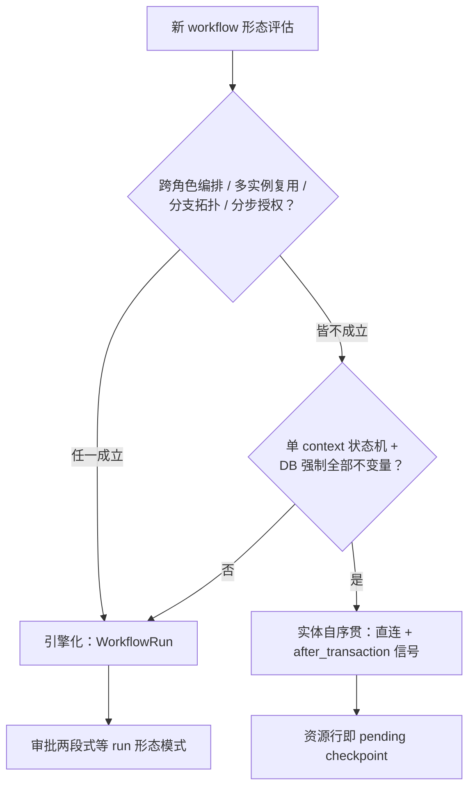

# Workflow Run 判据与报名最小接线 - Plan

## Goal Capsule

- **Objective:** 产出「什么配得上 WorkflowRun」判据 ADR，并首例应用于报名——Enrollment 保持实体自序贯，只补信号与提醒覆盖，正式退稿报名 DAG；「实体自序贯」作为第三种正式模式收入总纲 §6 模式库。
- **Product authority:** 用户（product owner）；判据默认倾向已在范围综合中确认为「实体自序贯优先、run 需证成」。
- **Open blockers:** 无。六项关键 repo 声明已由独立 verifier 全部确认（见 Sources / Research）。

---

## Product Contract

### Summary

写一份判据 ADR 回答「什么配得上 WorkflowRun」，默认实体自序贯、run 需证成；报名按判据落地为实体自序贯——补 `enrollment.submitted/completed` 信号、修复无 run 报名的 48h 提醒盲区、退稿报名 DAG；同时把「实体自序贯」立为总纲 §6 模式库的第三种正式模式，config-not-code 的旗舰证明留给赞助 workflow。

### Problem Frame

slice E 开工在即，报名 workflow 面对一个未被检验的隐含假设：所有业务 workflow 都该引擎化。现实是 Enrollment context 已全量建成——并发不变量由 DB 条件 UPDATE、partial unique index、action 事务承担（`backend/lib/cgc_2046/events/enrollment.ex:3-10`），审批的「persist_pending 停住 → 读回」由资源行的 `status=pending` 天然表达。报名定稿文档的 DAG（S1-S8 + 审批段 A1-A5）与已建动作 1:1 映射，引擎化带来的增量只剩 journal 可观测性，而 `Enrollment.status` 已表达同一时间线。

这个假设的代价已经可见：`enrollment.submitted/completed` 信号全库无生产者，学习 workflow 的触发约定悬在空中；48h 提醒只按 `workflow_run_id` 反查，无 run 的 pending Enrollment 覆盖率是 0%（`backend/lib/cgc_2046/workers/approval_reminder_worker.ex:117`）。同时，若每个 workflow 都默认上引擎，赞助/邀请/学习将逐个重开「要不要 run」的辩论，没有判据可查。

### Key Decisions

- **报名保持实体自序贯，不引擎化** (session-settled: user-directed — chosen over 引擎化接线：Enrollment 不变量已由 DB 承担、资源行即 pending checkpoint，引擎化零增量不变量；保留 B→A 可逆性)。Governs R3, R4, R5。
- **判据即产出，默认「实体自序贯、run 需证成」** (session-settled: user-directed — chosen over 预设引擎定位（默认载体 / 编排专用）：定位问题由判据文档回答，不预设)。Governs R1。
- **config-not-code 旗舰证明移到赞助** (session-settled: user-directed — chosen over 在报名热路径接线证明：赞助资源与 DAG 均需新建，证明力更强，报名不付仪式成本)。赞助设计不在本单元。
- **「实体自序贯」收入总纲 §6 模式库** (session-settled: user-directed — chosen over 仅写 ADR：词汇复利，防止「不引擎化」被误读为妥协)。Governs R2。
- **退稿报名 DAG 不退稿审批两段式** (session-settled: user-approved — chosen over 连同两段式一并退稿：赞助/邀请无自序贯实体且含两个顺序人工信号，仍依赖两段式)。Governs R2。

### Actors

- A1. **Learner（报名人）：** 提交报名、接收结果通知；非成员（D-A4）。
- A2. **Owner/Admin（审批人）：** 在网站后台审批页（#3 拍板入口）通过/拒绝；接收 48h 到期提醒。
- A3. **平台订阅方：** 通知服务、未来的学习触发器——消费 `enrollment.submitted/completed` 信号。

### Requirements

**判据与词汇**

- R1. 产出判据 ADR「什么配得上 WorkflowRun」，默认倾向为：实体自序贯是默认形态，run 需要证成。证成理由至少四项——跨角色编排、定义需多实例复用、分支/子 workflow 拓扑、超出实体 policy 的分步授权；判负条件为——单 context 状态机、DB 已强制全部并发不变量、after_transaction 信号可达全部订阅方。
- R2. 总纲 §6 模式库新增「实体自序贯」条目，与「审批两段式」并列：资源行即 pending checkpoint、信号经 action 的 after_transaction 直发、审批入口仍为网站后台审批页；条目注明两段式继续适用于无自序贯实体的双人工信号 workflow（赞助/邀请）。

**报名最小接线**

- R3. Enrollment 的 create action 在 after_transaction 发 `enrollment.submitted`；confirm action 在 after_transaction 发 `enrollment.completed`，幂等键沿用 `"enrollment.completed:" + enrollment_id` 约定（docs/01-定稿设计/报名workflow详细设计.md §4.2）。
- R4. 48h 审批提醒覆盖无 WorkflowRun 的 pending Enrollment：提醒判定以 `approval_deadline` 为准，不再以 `workflow_run_id` 为唯一反查条件；有 run 与无 run 的待审批实体享受同等提醒覆盖。
- R5. 正式修订 docs/01-定稿设计/报名workflow详细设计.md：DAG（报名段 S1-S8 + 审批段 A1-A5）标记退稿，记录理由（零增量不变量、资源行即 checkpoint、可逆性优先）并引用判据 ADR；文档状态由定稿改为已退稿。

### Key Flows

- F1. 报名提交（request 策略）
  - **Trigger:** Learner 在报名入口提交表单。
  - **Actors:** A1、A3。
  - **Steps:** create action 事务内落 pending + `approval_deadline`（既有行为）→ after_transaction 发 `enrollment.submitted`。
  - **Outcome:** 订阅方可观测报名提交，无需 WorkflowRun 存在。
  - **Covers R3。**
- F2. 审批通过
  - **Trigger:** Owner/Admin 在审批页通过。
  - **Actors:** A2、A3。
  - **Steps:** confirm action 原子占位 + 状态转 confirmed（既有行为）→ after_transaction 发 `enrollment.approved`（既有）与 `enrollment.completed`（新增，幂等键去重）。
  - **Outcome:** 学习触发器等订阅方获得唯一、可去重的触发信号。
  - **Covers R3。**
- F3. 到期前提醒（无 run）
  - **Trigger:** pending Enrollment 的 `approval_deadline` 进入 48h 窗口。
  - **Actors:** A2。
  - **Steps:** 提醒机制按 `approval_deadline` 直接命中该 Enrollment（不反查 `workflow_run_id`）→ 发提醒。
  - **Outcome:** run-less 报名与 run 驱动实体同等覆盖；到期未决仍按既有 expire 路径处理（F7 语义不变）。
  - **Covers R4。**

### Acceptance Examples

- AE1. Given 一个 request 策略的 open 活动，When Learner 提交报名，Then Enrollment 落 `status=pending` 且 `approval_deadline` 为创建后 7 天（既有行为），且信号总线可观测到一条 `enrollment.submitted`。
  - **Covers R3。**
- AE2. Given 一条 `workflow_run_id` 为空的 pending Enrollment，When 时间进入其 `approval_deadline` 前 48h 窗口，Then 对应审批人收到一次到期提醒；当前行为下该提醒永远不会发出。
  - **Covers R4。**
- AE3. Given 判据 ADR 已发布，When 评估一个新 workflow（两个顺序人工信号、但实体行自承载 pending 状态），Then 判据给出「实体自序贯」结论，与报名先例一致；当该 workflow 涉及跨角色编排且无自序贯实体时，判据给出「引擎化 + 两段式」结论，与赞助先例一致。
  - **Covers R1, R2。**
- AE4. Given 一条 pending Enrollment，When confirm action 被重复调用，Then 只有第一次转换发出 `enrollment.completed`（既有状态机守卫 + 幂等键），订阅方按幂等键去重后不重复触发。
  - **Covers R3。**

### Success Criteria

- 下一个 workflow（赞助）的形态决策通过查判据一次完成，不再重开「要不要 run」辩论。
- 无 run 的 pending Enrollment 48h 提醒覆盖率从 0% 升至 100%。
- `enrollment.completed` 信号可观测，学习 workflow 的触发前置解除。

### Scope Boundaries

**Deferred for later:**

- 赞助/邀请/学习 workflow 的设计与实现；赞助承载 config-not-code 旗舰证明（见 Key Decisions）。
- ideation 其余六个方向：公开发现面、审批控制台、生命周期级联、赞助履约账本、对账扫描（docs/ideation/2026-08-12-course-event-slice-e-ideation.html）。
- `signal_idempotency` 表落库——四份 workflow 文档共同规定、零开放决策的执行项，建议作 slice E 首批 migration，不依赖本判据。

**Outside this product's identity:**

- 不改变既有拍板：#3（审批入口 = 网站后台审批页）、F7（7 天过期 + 48h 提醒 + 可重提）、D-A6（同步/异步 8:2）、D-A4（报名 ≠ 成员）。
- Event/Course 收敛为单一 Offering（迁移负担最高，收益在第三个 workflow 机制落地前是推测）。

### Dependencies / Assumptions

- 既有依赖：`enrollment.approved/.rejected` 已在 confirm/reject 的 after_transaction 发出（`backend/lib/cgc_2046/events/enrollment.ex:130-134,147-151`）；ApprovalExpiryWorker 按 `approval_deadline` 过期 Enrollment、不依赖 run（verifier 确认）。
- 假设：判据 ADR 默认倾向为「实体自序贯优先」——范围综合中用户未要求中立措辞。
- 假设：`signal_idempotency` 表在学习触发器等订阅方落地前已存在；本单元只发信号，订阅方去重依赖该表。

### Outstanding Questions

- **Deferred to Planning:** `enrollment.submitted` 的信号载荷形状（哪些字段进 data）。
- **Deferred to Planning:** R4 的实现选型——扩展 ApprovalReminderWorker 的扫描条件，还是改为按记录定时；选型不影响覆盖语义。

<!-- ce-section: work-relationships -->
### How This Work Fits Together

本 plan 只拥有「判据 + 报名最小接线」这一个单元；下列周边工作是当前理解，不是承诺的路线图。

- 赞助 workflow（含 config-not-code 旗舰证明）
  - Depends on 本 plan 的判据（报名实体自序贯先例、判据默认倾向、旗舰证明定位）。
- 学习 workflow 设计
  - Depends on R3 的 `enrollment.completed` 信号；其触发约定已在报名设计文档 §4.2 写死。
- 邀请 workflow
  - Can proceed independently of 本 plan（无自序贯实体，仍走引擎化 + 两段式）。
- ideation 其余方向（公开发现面、审批控制台、生命周期级联、履约账本、对账扫描）
  - Can proceed independently of 本 plan；其中审批控制台在「报名实体自序贯」决策下更简单——`enrollment.approved/.rejected` 信号本就存在，无需审批段门控接线。
- **Still to decide:** 赞助形态决策的会议结论是否回写判据 ADR 的第二个先例。

### Sources / Research

- docs/ideation/2026-08-12-course-event-slice-e-ideation.html — Idea 1 及独立 verifier 裁决（两条路径均 sound）。
- docs/01-定稿设计/报名workflow详细设计.md — 待退稿的 DAG 设计（S1-S8 + A1-A5）与 §4.2 幂等键约定。
- docs/00-CGC平台设计总纲.md §6（:181-197）— 模式库现状：9 条全为 workflow-run 形态。
- docs/adr/0002-workflow-first-jido.md、docs/adr/0003-pi-inspired-architecture-refactor.md — workflow-first 与薄内核纪律。
- 独立 claim verifier（2026-08-12）确认：信号生产者空缺、reminder 盲区、DB 不变量兜底、无隐式 run 依赖、模式库无对应条目、DAG 全映射——6/6 confirmed。
