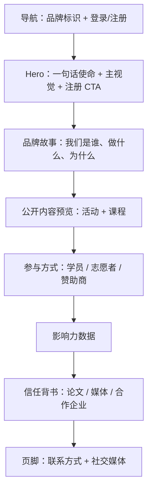

# Public Homepage - Plan

## Goal Capsule

- **Objective:** 让 `/` 对未登录访客渲染完整品牌门面首页——品牌故事、公开活动/课程预览、参与方式、影响力数据、信任背书一次上齐；已登录用户保持现有工作区分发行为不变。
- **Product authority:** 产品方在 brainstorm 对话中拍板全部范围决策（首要目的、访客、分流行为、板块集合、上线形态）。
- **Open blockers:** 策展素材（品牌故事文案、论文清单、媒体报道链接、合作企业名单、影响力数字）尚未交付；全量一次到位的上线形态以素材齐备为前置。

---

## Product Contract

### Summary

未登录访客访问 `/` 时看到完整品牌门面首页：Hero、品牌故事、公开内容预览、参与方式、影响力数据、信任背书（论文/媒体报道/合作企业）、联系与社交页脚七个板块一次上齐。已登录用户访问 `/` 时保持现有工作区分发行为。策展内容全部以静态形式随页面维护，不引入 CMS。

### Problem Frame

今天 `/` 是登录后的工作区分发器，未登录访客会被重定向到 `/login`——任何从外部点进来的人（被分享的链接、搜索、口碑推荐）第一眼看到的是登录墙，而不是 CGC 是谁。平台没有一张对外的脸。

E-5 #50 已让 `/events`、`/courses` 及其详情页对游客免登录开放，公开内容面已经存在；缺的是把这些内容串起来的站点级入口。分享一个活动链接能看详情，但分享站点本身仍然撞墙，品牌叙事无处安放。

### Key Decisions

- **品牌门面为首要目的** (session-settled: user-directed — chosen over 内容发现与转化注册: 首页核心任务是回答「CGC 是谁、做什么」，events/courses 作为佐证内容)。Governs R4, R5, R10
- **泛公众为首要访客** (session-settled: user-directed — chosen over 潜在学员/志愿者/赞助商细分: 页面对任何被分享链接点进来的人都要讲得通，参与方式板块再分流向三类人群)。Governs R8
- **`/` 分流：游客看首页、登录者直进工作区** (session-settled: user-directed — chosen over 统一首页与登录态个性化首页: 保留现有分发逻辑，已登录用户不被营销内容打断)。Governs R1, R2
- **全量一次到位** (session-settled: user-directed — chosen over 骨架先行两阶段与动态枢纽: 门面第一次亮相即完整，接受上线时间由策展内容产出速度决定)。Governs R9, R10, R12
- **影响力数字手填策展** (session-settled: user-directed — chosen over 数据库实时统计与暂缓该板块: 不新增公开统计查询，数字作为静态文案随内容更新手动改)。Governs R9, R12
- **预览空态显示占位文案** (session-settled: user-directed — chosen over 整块隐藏与回退静态内容: 页面结构保持完整，访客知道这里会有内容)。Governs R7

### Actors

- A1. **游客（未登录泛公众）**：被分享链接、搜索或推荐带入，对 CGC 认知从零到有的首要对象。
- A2. **已登录用户**：平台成员；访问 `/` 时走现有分发，首页对其不可见。
- A3. **内容策展方（平台运营）**：提供并维护品牌故事、影响力数字与信任背书素材。

### Requirements

**分流与入口**

- R1. 未登录访客访问 `/` 时渲染品牌门面首页，全程不发生向 `/login` 的重定向。
- R2. 已登录用户访问 `/` 时保持现有工作区分发行为（默认工作区或空态引导），首页不对其渲染。
- R3. 首页提供明确的登录与注册入口。

**内容板块**

- R4. Hero 板块呈现一句话使命、主视觉与注册入口。
- R5. 品牌故事板块回答「CGC 是谁、做什么、为什么」。
- R6. 公开内容预览板块展示 open+public 活动与课程条目，并链接到对应 `/events`、`/courses` 公开详情页。
- R7. 当前无 open+public 内容时，预览板块显示「筹备中」占位文案而不是整块隐藏。
- R8. 参与方式板块为学员、志愿者、赞助商三类访客各提供一个加入入口。
- R9. 影响力数据板块展示手填策展数字（如累计学员数、活动场次）。
- R10. 信任背书板块展示发表的论文、媒体报道与合作企业的策展内容。
- R11. 页脚呈现联系方式与社交媒体入口（如微信公众号、小红书）。

**维护与发现性**

- R12. 品牌故事、影响力数字与信任背书等策展内容以静态形式随页面更新，v1 不引入 CMS。
- R13. 首页提供面向搜索引擎与社交分享的基础 metadata（至少 title 与 description），替换现有占位值。

### Key Flows

- F1. 游客内容漏斗
  - **Trigger:** 未登录访客访问 `/`。
  - **Actors:** A1
  - **Steps:** 浏览品牌门面 → 点击公开活动/课程卡片 → 进入对应公开详情页 → 点击报名 → 被引导至登录，登录后回到详情页继续报名。
  - **Outcome:** 游客无需登录即可理解品牌并浏览公开内容；报名仍是登录后行为。
  - **Covered by:** R1, R3, R6
- F2. 已登录用户直进工作区
  - **Trigger:** 已登录用户访问 `/`。
  - **Actors:** A2
  - **Steps:** 按现有逻辑分发到默认工作区；无工作区时看到空态引导去 `/join`。
  - **Outcome:** 已登录用户体验与今天一致。
  - **Covered by:** R2

### Acceptance Examples

- AE1.
  - **Covers:** R1, R3
  - **Given** 未登录访客，**When** 访问 `/`，**Then** 渲染品牌门面首页、全程无 `/login` 重定向，且页面可见登录与注册入口。
- AE2.
  - **Covers:** R2
  - **Given** 已登录且拥有 active 工作区的用户，**When** 访问 `/`，**Then** 被分发到默认工作区，不看到首页内容。
- AE3.
  - **Covers:** R7
  - **Given** 当前无任何 open+public 活动与课程，**When** 游客访问 `/`，**Then** 公开内容预览板块显示「筹备中」占位文案而非整块消失。
- AE4.
  - **Covers:** R6
  - **Given** 存在 open+public 活动，**When** 游客点击首页预览卡片，**Then** 进入对应 `/events/[slug]` 公开详情页且全程无需登录。

### Success Criteria

- 把 `/` 链接发给未接触过 CGC 的人，对方仅凭首页能说出 CGC 是做什么的。
- 首页在任何数据状态下（含无公开内容）都不出现登录墙或强制跳转。
- 上线形态为七个板块全部以真实策展内容呈现；唯一允许的占位是预览板块由数据驱动的「筹备中」空态（per R7）。
- 上线后 `/events`、`/courses` 公开页行为不回归。

### Scope Boundaries

- 已登录用户的 `/` 分发器与站点内部页的登录墙逻辑原样保留，本次只做游客面。
- `/events`、`/courses` 公开页与报名流程本体不改，仅被首页引用。
- 数据库实时影响力统计不做（Deferred for later）：手填策展数字先行。
- CMS / 后台内容管理不做（Deferred for later）：策展内容随代码更新。
- 往期回顾、学员故事动态流与首页多语言本次不做。

### Dependencies / Assumptions

- 依赖已上线的 E-5 #50 公开面：`/events`、`/courses` 列表与详情页，以及匿名 GraphQL 白名单查询（见 Sources / Research）。
- 假设：品牌故事文案、论文清单、媒体报道链接、合作企业名单与影响力数字由产品方提供；用户提到的以往活动网站与经历可作为素材来源。上线时间取决于素材交付。
- 约束：现有匿名白名单字段为标题、简介、状态、报名政策与报名截止，无封面图与时间地点；预览卡片的信息丰富度以此为准（扩展见 Q1）。
- 约束：当前站点 CSP 为 `img-src 'self' data:`，外部图片不可用；信任背书的展示形式受其约束，本地资源或 CSP 调整由 planning 决定。

### Outstanding Questions

- Q1. **Deferred to Planning.** 预览卡片是否需要比现有白名单更丰富的字段（如封面图、时间地点）？若需要则涉及后端白名单扩展，planning 时评估取舍。
- Q2. **Deferred to Planning.** 参与方式三类入口的具体去向（学员 → 注册、志愿者 → `/join`、赞助商 → 联系方式）在 planning 确认落地路径。

### Sources / Research

- `web/app/page.tsx:74-76` — 现行 `/` 对未登录用户重定向 `/login` 的位置。
- `web/components/public-offerings.tsx` — E-5 #50 公开发现页实现（无 WorkspaceShell、匿名查询、只列 open+public）。
- `web/components/public-offering-detail.tsx` — E-5 #50 公开宿主页（游客看详情、报名引导登录后回本页）。
- `web/lib/graphql/events.ts:356-438` — 匿名可读白名单字段与公开查询定义。
- `web/app/layout.tsx:29-32` — 现行站点 metadata 占位值。
- `web/proxy.ts` — CSP 头定义（`img-src 'self' data:`）。
- `CONTEXT.md` — 领域词汇（WorkspaceShell 未认证壳、J-Visitor → J-Learner 漏斗）。
