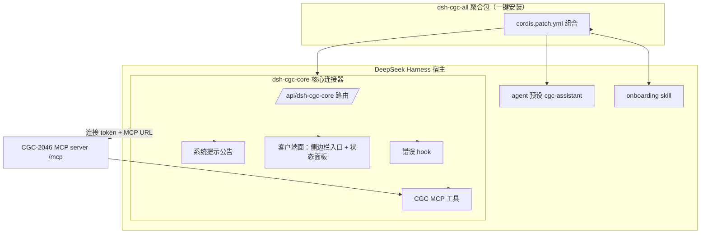
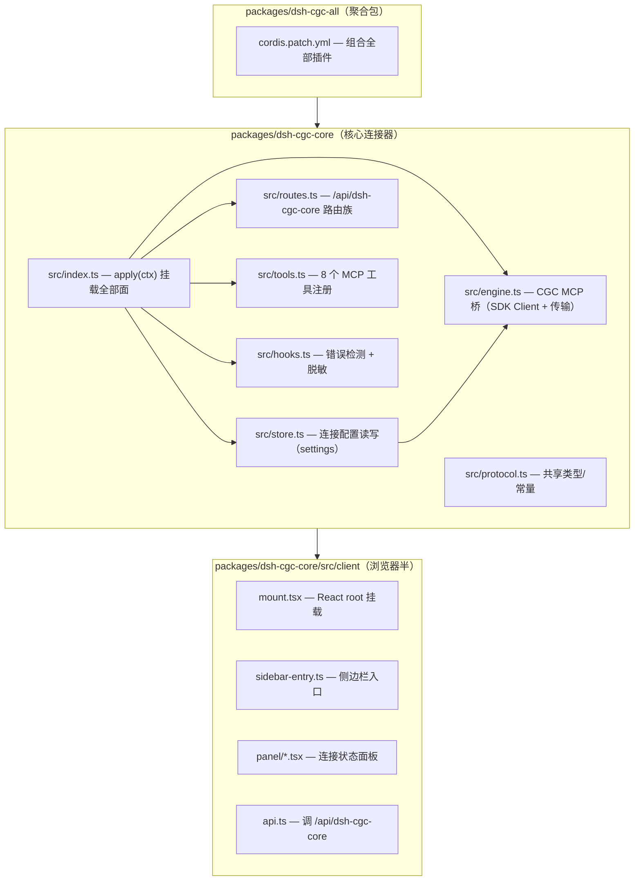

# DSH CGC Plugin Family - Plan

## Goal Capsule

- **Objective:** 建立 dsh-cgc 插件家族的第一个可交付——把 CGC-2046 平台接入 DeepSeek Harness，让 DSH 成为与 OpenClacky 平级的一等 BYO agent 通道，并立好可组合的家族骨架（命名/仓库/聚合包），角色与场景插件按平台真实能力后续增量加入。
- **Product authority:** 产品方在 brainstorm 对话中拍板全部范围决策（服务 CGC 平台最终用户、核心先行+家族骨架、独立新 repo dsh-cgc）；ce-doc-review 修正了工具数量与 workspace 定位等事实错误。
- **Stop conditions:** v1 交付 8 个 MCP 工具可用的连接器 + 状态面板 + cgc-assistant 预设 + onboarding skill + 错误 hook + 系统提示公告 + 聚合包骨架；不实现工作流构建/Agent 构建等依赖不存在工具的插件。
- **Tail ownership:** 核心连接器 v1 由本计划交付；角色/场景插件、workflow 插件由后续计划在家族骨架上增量建。

---

## Product Contract

### Summary

建立独立插件家族 `dsh-cgc`，面向 CGC-2046 平台最终用户（tutor/volunteer/learner/admin 等），让 DSH 成为与 OpenClacky 平级的一等 BYO agent 通道。v1 交付核心连接器插件 `dsh-cgc-core`（MCP 连接管理 + 连接状态面板 + 基础 cgc-assistant 预设 + onboarding skill + 错误 hook + 系统提示公告），同时立好家族骨架（命名规范、仓库布局、聚合包 `dsh-cgc-all`），角色/场景插件按平台真实能力增量添加。

### Problem Frame

CGC-2046 平台是「网站 = 业务中枢 + MCP server」架构，用户自带 agent（BYO）经 MCP 通道读写平台。平台的 MCP 客户端面已文档化多个 agent（OpenClacky / OMP / OpenCode，共用 `/mcp` + Bearer token 约定），其中 OpenClacky 是唯一带官方连接器扩展的通道。DeepSeek Harness 开源后支持 Cordis 插件体系，团队已有 `dsh-web-ui` 插件家族（dsh-ssh 等）作为成熟参考，但平台尚无 DSH 通道——DSH 用户无法连接 CGC-2046 工作台。

原始连接器设计（`docs/02-调研分析/OpenClacky扩展调研与实施计划.md`）设想了一个比当前 openclacky-ext v0.1 更完整的扩展（workflow-builder / agent-builder / 公共 Agent / 面板），但其中工作流构建与个人 Agent 构建依赖的平台 MCP 工具尚不存在。平台当前真实能力是 8 个 MCP 工具（读/写/管理混合，含 two-tool 确认流）。DSH 插件模型（Cordis 组合层）与 OpenClacky 的单体内 ext 不同：插件是独立 TS 模块，经 cordis.yml 组合挂载，天然支持「积木式」功能拼装——这使「多插件组合成完整功能全谱」成为 DSH 的差异化能力，也是本方案采用插件家族而非单插件的原因。

### Key Decisions

- **核心先行 + 家族骨架** (session-settled: user-directed — chosen over 完整家族现在建/单插件事后拆分: 平台尚无 workflow-builder/agent-builder 工具，预建空壳违背「不交易可用产品换未完成复杂度」；家族架构现在立起来比 monolith 事后拆便宜)。Governs R1-R17
- **服务 CGC 平台最终用户** (session-settled: user-directed — chosen over 开发团队角色/两者都要: 让 DSH 成为 CGC-2046 的一等 BYO agent 通道，而非团队开发工作台)。Governs R5-R10
- **独立新 repo dsh-cgc** (session-settled: user-directed — chosen over 本工作区/并入 dsh-web-ui: 平台与连接器通道分离，独立发布，复用 dsh-web-ui 模式但不复用其代码)。Governs R11-R17
- **角色分层 = 薄的预设/skill 使用面而非权限隔离**：平台 RBAC 已在服务端强制角色权限，插件家族组合价值在使用面（不同人设/技能/引导），不在能力门控。Governs R5-R9
- **平台当前面 = 现有 8 个 MCP 工具**：v1 只覆盖平台真实存在的能力（读/写/管理混合，含 two-tool 确认流），不做依赖不存在工具的壳。Governs R1-R9
- **跨仓库契约放 dsh-cgc repo** (session-settled: user-directed — chosen over cgc_2046 平台仓库: 契约从连接器侧定义平台必须满足的约定，平台仓库引用它，OpenClacky/DSH 双通道共用)。Governs R15

### Actors

- A1. **CGC 平台最终用户**：平台上的真实角色（tutor/volunteer/learner/admin 等），用 DSH 作为自己的 agent 读写 CGC-2046 工作台。
- A2. **CGC-2046 平台（MCP server）**：暴露 8 个读/写/管理 MCP 工具的远程 MCP server，按连接 token 鉴权。
- A3. **DSH 宿主**：加载插件家族、执行 agent、渲染 Web GUI 面板。### Requirements

**连接与 MCP 集成**

- R1. 插件提供「连接」能力：用户连接一次，DSH 内的 agent 即能通过 CGC MCP 工具读写平台；连接配置（MCP URL + 连接 token）持久化，token 不泄漏；非 loopback 的 MCP URL 必须为 HTTPS，loopback（localhost/127.0.0.1）允许 http；改变已存 URL 而未在同一请求重新提交 token 时，已存 token 失效（防 token 转发到新端点）。
- R2. 插件提供「状态」查询：返回 configured / url / token_configured / connected / web_url / activity，永不返回 token 或 headers；configured 只表达本地配置存在性，connected 表达当前活跃连接；activity 是 recent-activity 列表（连接错误事件 + 写工具调用记录，见 R9），含脱敏后的 last_error 项。
- R3. 插件提供「断开连接」：移除 CGC 连接能力，不触碰其它 MCP 配置。
- R4. CGC MCP 工具以 DSH 原生工具形态暴露给 agent（`mcp__<serverName>__<rawName>` 命名，遵循 mcp-client 的 publicToolName 规范化规则），覆盖平台现有 8 个 MCP 工具（get_workspace_context / list_members / get_workflow / get_step_output / save_step_output / create_invitation / confirm_operation / cancel_operation）；工具在宿主全局层注册，连接后对所有 agent/预设可见（非 cgc-assistant 预设会话也能用）。

**Agent 面**

- R5. 提供基础 cgc-assistant 预设：DSH 会话可选用该预设获得 CGC 助手人设与 CGC 工具引导（8 工具已由 R4 全局注册，预设只加人设与引导）；预设要求 agent 调用除确认类（confirm_operation/cancel_operation）外的 CGC 工具时提供 workspace_id，未知时向用户询问而非编造 UUID（与 OpenClacky cgc-assistant 纪律一致）。
- R6. 系统提示公告：插件向 agent 公告自身存在、能力边界与使用约束，使 agent 知道「提到 CGC-2046 时用此插件」；公告需说明 two-tool 确认流（create_invitation 返回 needs_confirmation + pending_id，agent 展示摘要并向用户确认后调用 confirm_operation，拒绝则 cancel_operation），并注明 pending 确认窗口（平台 PendingOperation 10 分钟过期，过期 confirm 报业务错误 → 重新 create_invitation）；公告含凭证纪律——agent 永不读取/回显连接 token（settings.yaml 明文 0600 可被带文件工具的 agent 读到，接受为文档化姿态）。
- R7. onboarding skill：引导最终用户创建连接 token、完成连接、验证状态的流程；验证失败（无效 token / 服务器不可达）时给出错误面与重试引导。

**面板（客户端）**

- R8. 侧边栏提供 CGC-2046 连接状态入口：展示 configured / url / token 状态，支持连接（connect 表单：MCP URL + token 字段，提交 POST /api/dsh-cgc-core/connect）、断开连接与跳转平台网站。
- R9. 面板展示 CGC MCP 连接错误事件与写工具调用记录，经插件自有事件传输（KTD4）推送；记录为客户端侧 recent-activity（经 GET /status 轮询、限内存环形、断开清空、非持久化），非审计级证据。

**错误 hook**

- R10. 检测 CGC MCP 工具调用及首次连接的连接错误形态并推送到面板；错误文本脱敏（抹凭证）。

**家族骨架**

- R11. 命名规范：插件 id 与包名统一为 `dsh-cgc-*`（核心连接器 `dsh-cgc-core`），与 openclacky-ext 的 `cgc-2046` 命名对齐。
- R12. 仓库布局：dsh-cgc 为独立 repo，采用 packages/ 多包布局，核心连接器为一包，聚合包 `dsh-cgc-all` 一键安装全部。
- R13. 安装/挂载：遵循 dsh-ssh 模式——cordis.patch.yml insert + `dsh plugin --profile <name> add`，不改 DSH 源码。
- R14. 客户端/宿主双面：宿主面（routes/tools/system prompt）+ 客户端面（React 面板/侧边栏），经 package.json `dsh` manifest 声明。
- R15. 跨仓库契约：连接 token 语义（绑用户不绑工作区）与 MCP URL 约定需一份契约，覆盖所有已文档化 MCP 客户端（DSH/OpenClacky/OMP/OpenCode）共享的约定，避免通道漂移。
- R16. 聚合包可组合：每个插件可独立开关，聚合包只是便利入口，不强制全装。
- R17. 角色/场景插件预留：家族架构经 KTD7 定义插入点（客户端面板仲裁 tab、侧边栏排序、宿主 `/api/dsh-cgc-core` 契约、`mcp__cgc-2046` 命名空间核心包独占），v1 不预建角色/场景插件空壳，但契约使其可插入。

### Key Flows

- F1. 首次连接
  - **Trigger:** 最终用户首次使用 DSH 连接 CGC-2046。
  - **Actors:** A1, A2, A3
  - **Steps:** 用户创建连接 token → 运行 onboarding skill → 完成连接（MCP URL + token 持久化）→ 状态面板显示已连接 → agent 会话可调用 CGC MCP 工具。
  - **Covered by:** R1, R2, R7, R8

- F2. 断开连接
  - **Trigger:** 用户点击面板「断开连接」。
  - **Actors:** A1, A3
  - **Steps:** 移除 CGC 连接配置 → 状态变未连接 → agent 不再有 CGC 工具。
  - **Covered by:** R3, R8

- F3. MCP 错误上报
  - **Trigger:** agent 调用 CGC MCP 工具失败（连接错误）。
  - **Actors:** A1, A2, A3
  - **Steps:** 错误 hook 检测 → 脱敏 → 推送到面板「最近活动」→ 面板实时展示。
  - **Covered by:** R9, R10

### Acceptance Examples

- AE1. 用户完成连接后，状态查询返回 `configured:true` 且响应不含 token；`token_configured:true` 正确。**Covers R2**
- AE2. 断开连接后，状态返回 `configured:false`；再次连接无需重启 DSH。**Covers R3**
- AE3. agent 以 cgc-assistant 预设开启会话，提供 workspace_id 调用 `get_workspace_context` 成功返回工作台信息，工具名为 `mcp__cgc-2046__get_workspace_context`。**Covers R4, R5**
- AE4. 错误场景：CGC MCP server 未启动时 agent 调用工具，面板显示脱敏错误（不含 Bearer token）。**Covers R9, R10**
- AE5. two-tool 确认流：agent 调 create_invitation 返回 needs_confirmation + pending_id → 展示摘要 → 用户同意后 confirm_operation 成功；拒绝则 cancel_operation；pending 过期后 confirm 报业务错误，agent 引导重新 create_invitation。**Covers R6**

<!-- ce-section: work-relationships -->
### How This Work Fits Together

本计划拥有 dsh-cgc 插件家族中「核心连接器 + 家族骨架」这一块。用户愿景的完整功能全谱（多个按角色/场景组合的插件，覆盖多个 CGC-2046 项目与多个角色）是当前理解，不是已承诺路线图；周边区域如下：

  - **角色/场景插件**（tutor/learner/admin 预设分化、按功能域划分的插件）：Depends on 本计划立起的家族骨架与核心连接器；Can proceed independently of 核心连接器 v1；平台加对应 MCP 工具后按真实需求增量建。
  - **工作流构建 / 个人 Agent 构建插件**（原始设计的工作流构建器/Agent 构建器）：Depends on 平台新增对应 MCP 工具；当前平台面是 8 个读/写/管理 MCP 工具。
  - **聚合包多插件组合示例**（dsh-cgc-all 的多插件编排）：Depends on 家族骨架；Enables 一键安装完整功能谱。
  - **跨仓库契约**（连接 token 语义与 MCP URL 约定）：Shares 平台连接约定（与 openclacky-ext 共用）；归属已定放 dsh-cgc repo 的 CONTRACT.md（Governs R15）。

### Scope Boundaries

**Deferred for later（家族蓝图 deferred 子插件，职责与依赖见 Planning Contract 家族蓝图）**
- `dsh-cgc-workflow`（工作流构建）与 `dsh-cgc-persona`（个人 Agent 构建）——依赖平台尚不存在的 MCP 工具/API，平台补齐后再做。
- `dsh-cgc-role-<role>`（tutor/learner/admin 角色场景分化）——按真实用户分化需求增量加，v1 不预建空壳。
- dsh-cgc-all 聚合包的多插件组合示例——v1 立骨架，完整编排示例后续补。

**审批姿态（v1 决策）**：confirm_operation/create_invitation 不挂 DSH 原生审批门（ctx.approval pre-execute ask）——平台 two-tool 确认流（needs_confirmation → 用户同意 → confirm_operation）是平台设计的 agent 安全门，OpenClacky 通道同为软姿态；R5/R6 预设与公告承担纪律。DSH 原生审批门作为未来强化（parity 注记）。

**Outside this product's identity**
- 平台侧 MCP server 的任何改动（后端团队范围）。
- openclacky-ext 本身的改动（保留为 OpenClacky 通道）。
- dsh-web-ui 家族仓库的改动（独立 repo，只复用其模式，不复用其代码）。

### Dependencies / Assumptions

- 依赖 DSH 宿主能力：`ctx.webServer`（路由）、`ctx.tools`（工具注册）、`ctx.systemPrompt.section`、`@deepseek-ai/dsh-settings`（settings 持久化）、client 端面板挂载。
- 依赖 CGC-2046 平台：MCP server 端点 `/mcp`（Bearer 连接 token 鉴权）、8 个 MCP 工具、token 生成入口（网站「MCP」页）。
- 假设：DSH 的 mcp-client 支持 streamable-http 传输与 headers（研究确认 `transport: 'streamable-http'` 与 headers 字段存在）；`@modelcontextprotocol/sdk`（MIT，AGPL 兼容）支持 streamable-http 客户端。

### Sources / Research

- `docs/02-调研分析/OpenClacky扩展调研与实施计划.md` — 原始连接器设计意图（workflow-builder/agent-builder/公共 Agent/面板）。
- DSH 仓库（`/Users/ywen8/Code/github.com/deepseek-ai/deepseek-harness`）：`docs/user/develop/framework/index.md`（Cordis 插件生命周期）、`docs/user/develop/basic/index.md`（首个插件）、`packages/host/webserver/README.md`（webServer 路由）、`packages/mcp/mcp-client/README.md` + `src/connection.ts`（MCP 客户端与连接监督）、`packages/preset/agent-presets/README.md`（agent 预设）、`packages/skill/skill-filesystem/README.md`（skill 扫描根）、`docs/tool-execution-pipeline.md`（工具生命周期事件）。
- 参考插件 `@linxin666/dsh-ssh`（本机 `~/.dsh/profiles/web/node_modules/@linxin666/dsh-ssh`）— 团队插件模式全貌（host/client 双面、cordis.patch.yml、package.json `dsh` manifest、routes loopback fence、client DOM 注入）。---

## Planning Contract

### Key Technical Decisions

- KTD1. **插件自带 CGC MCP 桥（直接实现），非 mcp-client 组合行**：连接器插件用 `@modelcontextprotocol/sdk`（DSH 自己的 mcp-client 也用同一 SDK）的 `Client` + `StreamableHTTPClientTransport` 直连 CGC `/mcp`，自管连接生命周期（connect/disconnect），工具经 `ctx.tools.register()` 以 `mcp__cgc-2046__<rawName>` 命名注册。理由：dsh-mcp-client 的 `package.json` 只发布 `lib/index.js` + types，其 `startConnection`/工具注册/命名函数在源码里但不出现在已发布 npm 产物，且实例是静态 cordis.yml 行（HMR 重读配置而非用户 settings）——外部 repo 无法在运行时复用其连接 API；dsh-ssh 先例就是插件自带引擎 + 直接注册工具。U2 须显式界定桥的边界（见 U2 Approach）：v1 不做重连监督（Streamable HTTP 对不可达 server 逐调用重试）、不做 `tools/list_changed` 重同步（平台是固定 8 工具集）。Deferred follow-up：上游为 dsh-mcp-client 加公开运行时 `ctx.mcp.connect()/disconnect()` API，让家族插件不再重实现桥。Resolves Outstanding Question 1。Governs R1, R3, R4, R9, R10
- KTD2. **配置持久化用 installSettingsSection + settingsNamespace('dsh-cgc-core')，token 声明 role('secret')**：token 与 MCP URL 存 `~/.dsh/settings.yaml`（DSH atomic-write 平台强制 0600 新 inode，无 chmod 竞态）；token 字段 `z.string().role('secret')` 使 DSH settings 从一切 wire surface 剥离该字段（settings UI 渲染、host api proxy 的 describe 均 redactSecrets），否则「token 不泄漏」只是单个路由的手写承诺、settings 编辑器会泄 token。dsh-ssh 的凭证是独立 `~/.dsh/dsh-ssh.json`（不进 settings 服务）；本插件走 settings 但必须靠 role('secret') 补足同一保密效果。connect/disconnect 经 settings 变更驱动 MCP 桥重建。Resolves Outstanding Question 2 的持久化部分。Governs R1, R2, R3
- KTD3. **面板用 DOM 级注入（dsh-ssh 先例）**：DSH 侧边栏无外部 slot，sidebar-entry 用 MutationObserver 自愈注入入口行，panel 用 React root 挂到 `[data-pane="conversation"]` 网格项 + data 属性切换可见性。Resolves Outstanding Question 2。Governs R8, R9
- KTD4. **错误 hook 走 tools/post-execute 瀑布 + 插件自有事件传输**：宿主→浏览器的事件转发白名单在 DSH core 硬编码（`packages/api/remotes/src/remote-events.ts` 的 `API_REMOTE_FORWARDED_EVENTS`），新增事件需改 DSH 源码、违反 R13——故面板事件走插件自有路由：`GET /api/dsh-cgc-core/status` 轮询（含 last-error 列表，dsh-ssh fetch 面板先例）+ 连接状态经 `GET /status` 返回。错误分类代码化而非文本特征：桥在引擎层抛带类型码的 HarnessError（`CGC_MCP_CONNECTION`/`CGC_MCP_AUTH`/`CGC_MCP_TIMEOUT`/`CGC_MCP_BUSINESS`），post-execute hook 按 `exec.name` 匹配 `mcp__cgc-2046__*` 且按 error code 过滤（非连接错误不推送）；脱敏集中在桥层（错误消息永不内嵌 URL/headers 带 token），redaction 参考平台自己的 `backend/lib/cgc_2046/mcp/redact.ex`。Governs R9, R10
- KTD5. **打包/挂载遵循 dsh-ssh**：每个插件 package.json 声明 `dsh` manifest（`bundle.patch` + `client.inject` + `client.platform`），`cordis.patch.yml` insert 行挂载，`dsh plugin --profile <name> add` 安装；聚合包 `dsh-cgc-all` 走 profile-bundles 系统——`dsh.profile.bundles` 依次解析每个 bundle 的 patch 层，聚合包声明全部子包为 deps 并 insert 它们的行。Governs R11-R16
- KTD6. **预设与 skill 的内容投放：激活时幂等物化到用户根 + 卸载清理**：agent-presets 只扫配置根 + `~/.dsh/.agent-presets/`，skill-filesystem 扫 `~/.dsh/skills/`（rank 400）——插件包内目录不会被自动发现。U4/U5 采用在插件激活时把 cgc-assistant 预设物化到 `~/.dsh/.agent-presets/cgc-assistant/`（含 `preset.yml` + `agent.cordis.yml`）、onboarding SKILL.md 物化到 `~/.dsh/skills/cgc-core-onboarding/`（幂等、版本键控、重物化覆盖快照漂移），dsh-ssh 运行时写用户目录先例。逆向生命周期：插件卸载时移除插件自有的这两个子目录（不触碰用户其它内容）；单 profile 停用因目录为用户全局、可为其它 profile 服务而保留并在文档说明。Governs R5, R7
- KTD7. **家族共享契约（R17 落地）**：核心连接器定义家族可见的插入点——客户端面：面板仲裁（单容器 tab 化，避免多插件抢 conversation 列）、侧边栏排序规则；宿主面：标准 `/api/dsh-cgc-core` 作为连接状态/错误查询契约；工具命名空间 `mcp__cgc-2046` 声明为核心包独占（mcp-client 有 `activeServerNames` 防重复 serverName 的先例）。角色/场景插件 v1 不建，但此契约使它们能插进来。Governs R17

### 家族蓝图（Family Blueprint）

界定整个 `dsh-cgc` 家族的子插件及职责。v1 只建核心连接器与聚合包骨架，其余为 deferred，但职责与依赖一次界定。

**v1 交付：**

| 子插件 | 职责 | 状态 |
|--------|------|------|
| `dsh-cgc-core` | 核心连接器：CGC MCP 桥（8 工具）、连接/状态管理、状态面板、onboarding skill、系统提示公告、cgc-assistant 预设。独占 `mcp__cgc-2046` 工具命名空间、`/api/dsh-cgc-core` 宿主路由、连接状态。 | v1 建 |
| `dsh-cgc-all` | 聚合包：一键安装全部子插件（profile-bundles 系统）。 | v1 骨架 |

**Deferred（依赖核心连接器，KTD7 契约使其可插入）：**

| 子插件 | 职责 | 依赖 | 状态 |
|--------|------|------|------|
| `dsh-cgc-workflow` | 工作流构建：skill 引导 agent 设计、配置、部署工作流（原始设计 workflow 构建助手）。 | 平台「部署/定义 Workflow」MCP 工具（尚不存在） | Deferred |
| `dsh-cgc-persona` | 个人 Agent 构建：skill 引导用户自建角色分身 agent（仅本人可见可用；创建时经平台 API 落个人 Agent 记录，受权限矩阵约束）。 | 平台个人 Agent API（尚不存在） | Deferred |
| `dsh-cgc-role-<role>` | 角色场景：按平台角色（tutor/learner/admin）分化的预设 + 针对性引导（如教研助手、活动筹备助手等公共 Agent 的 DSH 呈现）。 | 平台角色工具 + 真实用户分化信号 | Deferred |

**边界原则：** 核心连接器独占工具命名空间、宿主路由、连接状态；deferred 子插件只加人设/引导/面板 tab（KTD7 面板仲裁 tab 位），不重连、不注册工具。公共 Agent（workspace 级、按 workflow 授权）由 `dsh-cgc-role-*` 承载；个人 Agent（角色分身、仅本人可见）由 `dsh-cgc-persona` 承载。

### High-Level Technical Design

**宿主面（node 半）结构**（新 repo `dsh-cgc`，monorepo packages/）

家族共享契约（KTD7）：客户端面板仲裁（单容器 tab 化）+ 侧边栏排序规则；宿主面 `/api/dsh-cgc-core` 作为连接状态契约；`mcp__cgc-2046` 命名空间核心包独占。

**CGC MCP 桥（engine.ts）核心行为**：

- 连接 = 用 store 的 URL + token 创建 `StreamableHTTPClientTransport`（headers 带 `Authorization: Bearer <token>`），`Client.connect()`，`listTools()` 后逐个 `ctx.tools.register()` 为 `mcp__cgc-2046__<rawName>`。
- 断开 = 注销已注册工具 + `Client.close()` + 清空连接状态；不触碰其它插件/MCP 配置。
- 状态 = `configured`（store 有 URL+token）/ `connected`（当前有活跃连接）/ `lastError`（最近一次连接错误，脱敏后）。
- 两类连接错误源（引擎 connect 期失败 + 工具调用期 post-execute hook 捕获）走同一「连接错误」事件路径 → 脱敏 → 存 lastError 供 `GET /status` 轮询。

**路由族（routes.ts）**（loopback fence 复制 dsh-ssh）`/api/dsh-cgc-core/`：

- `POST /connect` — body 收 `{url?, token}`，校验 URL scheme（非 loopback 必须 https，拒绝 userinfo 与非 http(s) scheme），原子写 store，触发桥重建；若请求改了已存 URL 而未重新提交 token，则使已存 token 失效（防 token 转发到新端点）。
- `GET /status` — 返回 `{configured, url, token_configured, connected, web_url, activity}`，永不返回 token/headers；activity 为 recent-activity 列表（连接错误事件 + 写工具调用记录，限内存环形，断开清空）。
- `DELETE /connect` — 清空 store 的 cgc-2046 条目，触发断开。

**Agent 面**：

- cgc-assistant 预设 = `preset.yml` + `agent.cordis.yml`（人设 + 工具引导 + workspace_id 纪律 + two-tool 确认流），激活时按 KTD6 物化到 `~/.dsh/.agent-presets/cgc-assistant/`，经 agent-presets 发现。预设是 `dsh-persona` 的 `config.text` 行（cordis 预设先例），8 个 CGC 工具已由插件宿主面全局注册，预设只加人设与引导。
- onboarding skill = SKILL.md 激活时按 KTD6 物化到 `~/.dsh/skills/cgc-core-onboarding/`（frontmatter 带 name/description + 调用策略），经 skill-filesystem 扫描发现。
- 系统提示公告 = `ctx.systemPrompt.section({name: 'plugin:dsh-cgc-core', order: 150, text})`。

**客户端面（client）**：

- `sidebar-entry.ts` MutationObserver 自愈注入侧边栏入口；`mount.tsx` 挂 React root 到 conversation 列；`panel/SshPanel` 同构的 `CgcPanel` 展示 configured/url/token/connected 状态 + 断开按钮 + 「在平台吊销」链接 + 跳转平台网站 + 「最近活动」列表（写工具调用 + 连接错误，经 `GET /status` 轮询，KTD4 插件自有传输）。

### Assumptions

- `@modelcontextprotocol/sdk` 的 streamable-http 客户端可用（DSH mcp-client 依赖它，版本 `^1.12.0`）。
- 平台 `Authorization: Bearer <token>` 头鉴权（`mcp_auth_plug.ex` 确认）。
- loopback 默认 MCP URL `http://localhost:4102/mcp`（openclacky-ext 联调值），生产域名未定，CONTRACT.md 定稿。

### Sequencing

U1 → U2 → U3 → (U4 ‖ U5 ‖ U7) → U6 → U8。U2 依赖 U1；U3 依赖 U2；U4/U5/U7 依赖 U3；U6 依赖 U3；U8 依赖全部。

### Risks & Dependencies

**威胁模型**：同机进程/同 profile 内其它插件（共享明文 0600 settings.yaml，dsh-ssh 信任模型）；DSH 页面内同源代码（F2 token 转发，KTD3 面板 DOM 注入扩大同源面）；LAN 暴露部署（DSH webserver 无 TLS/auth/origin policy）；平台作为外部边界（token 无过期、仅 revoked_at）。

**敏感边界**：
- settings 章节（token 必须 role('secret')，KTD2）。
- `/api/dsh-cgc-core/*` 必须 loopback-only（LAN 暴露 = 配置篡改/DoS，非直接 token 窃取）；fence 保留 `origin === undefined → true` 放宽给 onboarding 面板路径。
- `Authorization` 头在 `/mcp` 请求：永不写日志，HTTPS + 主机名校验不关闭。
- 错误面（R10/KTD4）：统一脱敏。

**控制**：
- role('secret') token 字段（F1）。
- URL 变更使已存 token 失效（F2）。
- 401/403 归为凭证失败，停止重连并 surface，不进网络退避（F4）。
- 负向日志/token 测试（U2/U7）。
- 写工具调用活动列表（F6，R9）。
- onboarding/CONTRACT.md：设备命名 token + 平台侧吊销指引（F3）。

**外部依赖**：`@modelcontextprotocol/sdk`（MIT，AGPL 兼容，DSH mcp-client 同款）、DSH 宿主包（webServer/tools/settings/systemPrompt/client 各包）、CGC-2046 平台 MCP server（外部边界，8 工具 + Bearer 鉴权）。**上游依赖**：`@deepseek-ai/dsh-mcp-client` 无公开运行时连接 API（KTD1 已 deferred upstream 建议）。

**运维**：面板「在平台吊销」链接指平台 MCP 页（F3）；连接状态经 `GET /status` 轮询呈现（KTD4）。---

## Implementation Units

### U1. 仓库脚手架与打包骨架

- **Goal:** 建独立 repo `dsh-cgc`（monorepo），核心包 `packages/dsh-cgc-core` 的 package.json `dsh` manifest + `cordis.patch.yml` 立起来，能在本地 DSH profile 加载空插件。
- **Requirements:** R11, R12, R13, R14
- **Files:**
  - `package.json`（root workspace）
  - `packages/dsh-cgc-core/package.json`（`dsh.bundle.patch` + `dsh.client.inject/platform`，peer deps 对齐 dsh-ssh）
  - `packages/dsh-cgc-core/cordis.patch.yml`（`- insert: [{id: dsh-cgc-core, name: '@.../dsh-cgc-core'}]`）
  - `packages/dsh-cgc-core/tsconfig.json`、`src/index.ts`（空 apply）、`vitest.config.ts`
  - `packages/dsh-cgc-core/src/client/index.ts`（空 client apply）
  - `packages/dsh-cgc-core/src/client/tsconfig.json`
- **Approach:** 复制 dsh-ssh 的包结构与 manifest 模式（`dsh` 字段、exports `./client`、peer deps），裁剪为空壳。
- **Test Scenarios:**
  - `dsh plugin --profile <test> add <repo>` 成功，`dsh` 列出 `dsh-cgc-core`。
  - Web GUI 无报错，侧边栏无入口（空壳预期）。
  - `pnpm build` / typecheck 通过。
- **Verification:** `pnpm -r typecheck`、`pnpm build` 绿。

### U2. CGC MCP 桥引擎（engine.ts + store.ts）

- **Goal:** 实现连接/断开/状态管理的 MCP 桥：`StreamableHTTPClientTransport` 连 `/mcp`（Bearer token），8 工具以 `mcp__cgc-2046__<rawName>` 注册到 `ctx.tools`；store 用 settings 持久化 URL + token。
- **Requirements:** R1, R3, R4, R10
- **Files:**
  - `packages/dsh-cgc-core/src/engine.ts`
  - `packages/dsh-cgc-core/src/store.ts`
  - `packages/dsh-cgc-core/src/protocol.ts`
  - `packages/dsh-cgc-core/src/tools.ts`（8 工具注册；可先与 U2 同拆）
  - `packages/dsh-cgc-core/test/engine_test.ts`、`store_test.ts`
- **Approach:** 参照 mcp-client `connection.ts` 的连接监督 + dsh-ssh `store.ts` 的原子写；KTD1/KTD2。U2 边界（KTD1）：v1 不做重连监督（不可达 server 逐调用重试，mcp-client 的 Streamable HTTP 行为）、不做 `tools/list_changed` 重同步（平台固定 8 工具）；工具命名复制 mcp-client `publicToolName` 的 64 字符规范化 + 12-hex hash 规则，保证与任何 mcp-client 连接命名一致；错误抛带类型码 HarnessError（KTD4）。token 字段 `role('secret')`（KTD2）。apply 时恢复：插件激活时若 store 有 URL+token，异步重建桥，连接失败走同一 CGC_MCP_CONNECTION/AUTH 错误路径（喂 GET /status）。
- **Test Scenarios:**
  - store：connect 写入 URL+token 后 status 正确；token 字段 role('secret') 使 describe 描述不含 token（红act 断言）。
  - engine：mock MCP server（`server-everything` 或最小 streamable-http server）下 connect → 8 工具注册名正确；断开 → 工具注销。
  - 连接失败（server 未启动）→ 抛 CGC_MCP_CONNECTION 错误、工具不注册。
  - 401/403（token 吊销/无效）→ 归为凭证失败 CGC_MCP_AUTH，停止重连并 surface（不进网络重试退避），负向测试。
  - URL 校验：非 loopback http 拒绝、userinfo 拒绝、非 http(s) scheme 拒绝，localhost http 接受（KTD1）。
  - 改 URL 未重提交 token → 已存 token 失效（负向）。
  - boot-restore：apply 时 store 有 URL+token → 桥异步重建，工具重新注册。
  - boot-with-unreachable-server：apply 时 server 不可达 → 抛 CGC_MCP_CONNECTION，经错误路径喂 GET /status，工具不注册。
- **Verification:** `pnpm -r test -- engine store` 绿。

### U3. /api/dsh-cgc-core 路由族

- **Goal:** 提供 connect/status/disconnect HTTP 端点，loopback fence，token 不泄漏。
- **Requirements:** R1, R2, R3
- **Files:**
  - `packages/dsh-cgc-core/src/routes.ts`
  - `packages/dsh-cgc-core/test/routes_test.ts`
- **Approach:** 复制 dsh-ssh routes.ts 的 `isLoopbackRequest` fence + `writeJson` + body 上限；`ctx.webServer.register` 挂 exact 路由。KTD5 挂载。
- **Test Scenarios:**
  - `POST /connect`（loopback）写配置成功 200；带 token 的响应体不含 token。
  - 非 loopback 请求被拒（403）。
  - `GET /status` 返回 `{configured, url, token_configured, connected, web_url, activity}` 正确形状；activity 含连接错误与写调用记录，响应不含 token。
  - `DELETE /connect` 后 configured:false，其它 server 条目无损。
  - URL 变更未重提交 token → 已存 token 失效（负向，token 不转发到新端点）。
  - URL scheme 校验：userinfo/非 http(s) 拒绝。
- **Verification:** `pnpm -r test -- routes` 绿。

### U4. 系统提示公告 + cgc-assistant 预设

- **Goal:** `ctx.systemPrompt.section` 公告插件；cgc-assistant agent 预设（agent.cordis.yml）含人设、工具引导、workspace_id 纪律、two-tool 确认流。
- **Requirements:** R5, R6
- **Files:**
  - `packages/dsh-cgc-core/src/index.ts`（section 注册 + KTD6 物化触发）
  - `packages/dsh-cgc-core/agents/cgc-assistant/preset.yml` + `agent.cordis.yml`
  - `packages/dsh-cgc-core/src/prompt.ts`（公告文案常量）
  - `packages/dsh-cgc-core/test/prompt_test.ts`
- **Approach:** 参照 dsh-ssh 的 `SSH_GUIDANCE` section（order 150）+ agent-presets 的 `dsh-persona` `config.text` 行格式（cordis 预设先例）；预设经 KTD6 物化到 `~/.dsh/.agent-presets/cgc-assistant/`。
- **Test Scenarios:**
  - systemPrompt.section 返回 disposer，文案含 two-tool 确认流、workspace_id 纪律与凭证纪律。
  - 激活后 `ctx.agentPresets.list()` 返回 cgc-assistant（不是仅 fixture 校验）；persona text 含确认流与 workspace_id 纪律。
  - 断开后 section 移除（disposer 生效）。
  - 卸载后：`~/.dsh/.agent-presets/cgc-assistant/` 与 `~/.dsh/skills/cgc-core-onboarding/` 被移除（负向断言）。
  - 结果级 parity：cgc-assistant 会话可调用 `mcp__cgc-2046__get_workspace_context` 收到工作台（AE3 作为行为复现）；无 workspace_id 时询问用户而非编造 UUID。
- **Verification:** `pnpm -r test -- prompt` 绿。

### U5. onboarding skill

- **Goal:** SKILL.md 引导创建 token → 引导用户在面板 connect 表单粘贴 token → 验证状态；失败给错误面与重试。
- **Requirements:** R7
- **Files:**
  - `packages/dsh-cgc-core/skills/cgc-core-onboarding/SKILL.md`（frontmatter 含 name/description + 调用策略：model-invocable 与 user-invocable 双面）
  - 激活时按 KTD6 物化到 `~/.dsh/skills/cgc-core-onboarding/`
  - `packages/dsh-cgc-core/test/skill_frontmatter_test.ts`
- **Approach:** DSH agent 无剪贴板——不沿用 openclacky-ext 的剪贴板 → stdin 管道（token 会经工具调用进会话历史，违反 R1/R10）；onboarding skill 引导用户在面板 connect 表单粘贴 token（POST /api/dsh-cgc-core/connect 由浏览器同源发起），agent 永不回显/写入 token。onboarding 同时说明设备命名 token 与平台侧吊销（R7）。
- **Test Scenarios:**
  - SKILL.md frontmatter 含 name/description（skill 工具可发现），含调用策略。
  - 激活后 skill 出现在 `ctx.skills` 目录（skill-filesystem 扫描 `~/.dsh/skills` rank 400）。
  - skill 正文无「agent 执行含 token 的命令」指令（负向：token 不进 agent 工具调用）。
  - 流程覆盖成功与失败（无效 token / server 不可达）两分支，失败给出重试引导与平台吊销指引。
- **Verification:** `pnpm -r test -- skill` 绿。

### U6. 客户端面板（sidebar + 状态面板）

- **Goal:** 浏览器半注入侧边栏入口 + 连接状态面板（configured/url/token + 断开 + 跳转网站 + 最近活动错误列表）。
- **Requirements:** R8, R9
- **Files:**
  - `packages/dsh-cgc-core/src/client/index.ts`（apply：locale + mount + sidebar）
  - `packages/dsh-cgc-core/src/client/sidebar-entry.ts`
  - `packages/dsh-cgc-core/src/client/mount.tsx`
  - `packages/dsh-cgc-core/src/client/api.ts`
  - `packages/dsh-cgc-core/src/client/panel/CgcPanel.tsx`（+ tabs + ConnectForm.tsx）
  - `packages/dsh-cgc-core/src/client/locales.ts`
- **Approach:** 复制 dsh-ssh client 的 DOM 注入模式（sidebar MutationObserver 自愈 + mount React root 到 conversation 列 + data 属性切换）；KTD3。
- **Test Scenarios:**
  - 侧边栏入口在会话创建后出现（MutationObserver 自愈）。
  - 面板显示 configured/url/token/connected 状态正确（mock API）。
  - connect 表单提交 POST /connect 成功 → 状态变已连接；表单永不显示/回显 token。
  - 断开按钮调 DELETE /connect，状态变未连接；「在平台吊销」链接指向平台 MCP 页。
  - 「最近活动」经 GET /status 轮询展示 MCP 错误事件与写工具调用记录（工具名/时间戳/workspace_id，无参数无 token）。
- **Verification:** `pnpm -r test -- client` + agent-browser 结构断言（侧边栏入口存在）。

### U7. 错误 hook

- **Goal:** 检测 CGC MCP 工具调用及首次连接的连接错误形态，脱敏后存入 last_error，经插件自有 `GET /api/dsh-cgc-core/status` 轮询路由供面板展示（KTD4）。
- **Requirements:** R10
- **Files:**
  - `packages/dsh-cgc-core/src/hooks.ts`
  - `packages/dsh-cgc-core/src/redact.ts`（脱敏：Bearer/cgc_ 前缀/裸 JWT）
  - `packages/dsh-cgc-core/test/redact_test.ts`、`hooks_test.ts`
- **Approach:** 走 tools/post-execute 瀑布检测错误（KTD4），按 `exec.name` 匹配 `mcp__cgc-2046__*` 且按 HarnessError code 过滤（CGC_MCP_*，代码化而非文本特征）；脱敏集中在桥层，redaction 参考平台 `backend/lib/cgc_2046/mcp/redact.ex` 与 openclacky-ext 的 `hooks/after_tool_use.rb`。同时记录成功写/管理工具调用（save_step_output / create_invitation / confirm_operation / cancel_operation）进 activity 列表（仅工具名 + 时间戳 + workspace_id，绝不捕获参数或结果，禁 create_invitation 的一次性 invitation_token）。
- **Test Scenarios:**
  - 工具调用连接错误（CGC_MCP_CONNECTION/AUTH）→ 事件推送，文本无 token、无 Authorization 头。
  - 首次连接错误（引擎 connect 期）→ 同样推送。
  - 非连接错误（CGC_MCP_BUSINESS / 业务失败）→ 不推送（R9 范围收敛，代码判定）。
  - 成功写/管理调用 → 记录进 activity（工具名/时间戳/workspace_id），无参数、无 invitation_token。
  - 负向：错误/日志全文无 `cgc_` + 43 base64url 形态的 token 串。
- **Verification:** `pnpm -r test -- hooks redact` 绿。

### U8. 聚合包 dsh-cgc-all + CONTRACT.md

- **Goal:** `dsh-cgc-all` 聚合包一键安装全部子包；`CONTRACT.md` 定稿跨仓库契约（token 语义、MCP URL、工具清单）。
- **Requirements:** R12, R15, R16
- **Files:**
  - `packages/dsh-cgc-all/package.json`（profile bundles 列全部）
  - `packages/dsh-cgc-all/cordis.patch.yml`
  - `CONTRACT.md`（repo 根）
  - `packages/dsh-cgc-core/README.md`
- **Approach:** 聚合走 profile-bundles 系统（`dsh.profile.bundles` 依次解析每个 bundle 的 patch 层，app-boot `profile.ts`）；CONTRACT.md 列举平台约定的稳定锚点（绑用户不绑工作区、/mcp 端点、8 工具清单、URL scheme 规则、`mcp__cgc-2046` 命名空间保留、设备命名 token 指引 + 平台侧吊销、token 无过期仅 revoked_at）。
- **Test Scenarios:**
  - `dsh plugin --profile <test> add dsh-cgc-all` 后全部子插件行出现。
  - CONTRACT.md 与平台现状一致（8 工具、Bearer 鉴权、token 绑用户）——核对集含 `server.ex`、`mcp_auth_plug.ex`、`token.ex`、`mcp/tools/*.ex`。
- **Verification:** `dsh plugin list` 显示全部子包；CONTRACT.md 与平台源码交叉核对。---

## Verification Contract

| Gate | Command | Applies to | Done signal |
|------|---------|-----------|-------------|
| Typecheck | `pnpm -r typecheck` | All units | 0 errors |
| Build | `pnpm build` | All units | dist 产出 |
| Unit tests | `pnpm -r test` | U2-U7 | 全部绿（engine/store/routes/prompt/skill/client/hooks/redact） |
| Plugin install smoke | `dsh plugin --profile <test> add <repo>` + `dsh plugin list` | U1, U8 | 插件行出现 |
| GUI 结构断言 | `agent-browser` 断言侧边栏入口存在、面板状态正确 | U6 | 数值/结构断言过 |
| 平台契约核对 | CONTRACT.md 与 `backend/lib/cgc_2046/mcp/server.ex`、`mcp_auth_plug.ex` 交叉核对 | U8 | 无漂移 |

测试在 dsh-cgc 独立 repo 跑（其自身 vitest + dsh plugin CLI）。验证 CGC-2046 平台侧的 MCP 行为需要本地起后端 + mock 或真实 `/mcp` server。

---

## Definition of Done

**Global DoD（全部满足才算完成）**

- U1-U8 全部实现并通过 Verification Contract 各 gate。
- 用户在 DSH 里连接一次 → 8 个 `mcp__cgc-2046__*` 工具对 agent 可用（AE3 可复现）。
- 状态面板展示 configured/url/token，断开连接后 configured:false 且再次连接无需重启 DSH（AE1/AE2）。
- 连接错误被检测、脱敏、面板展示（AE4），token 不进任何日志。
- 无死代码/未用实验分支残留（清理标准）。
- 聚合包 `dsh-cgc-all` 一键安装全部；`CONTRACT.md` 定稿并与平台现状核对。

**Per-unit done**

| Unit | Done when |
|------|-----------|
| U1 | 空插件可被 dsh 加载，typecheck/build 绿 |
| U2 | 连接/断开/状态管理 + 8 工具注册/注销测试绿 |
| U3 | connect/status/disconnect 路由测试绿，loopback fence + token 不泄漏 |
| U4 | systemPrompt section + cgc-assistant 预设可装载 |
| U5 | onboarding SKILL.md frontmatter 有效，流程覆盖成败两分支 |
| U6 | 侧边栏入口 + 状态面板结构断言过，断开按钮生效 |
| U7 | 错误检测 + 脱敏 + 事件推送测试绿 |
| U8 | 聚合包安装全绿，CONTRACT.md 与平台核对无漂移 |