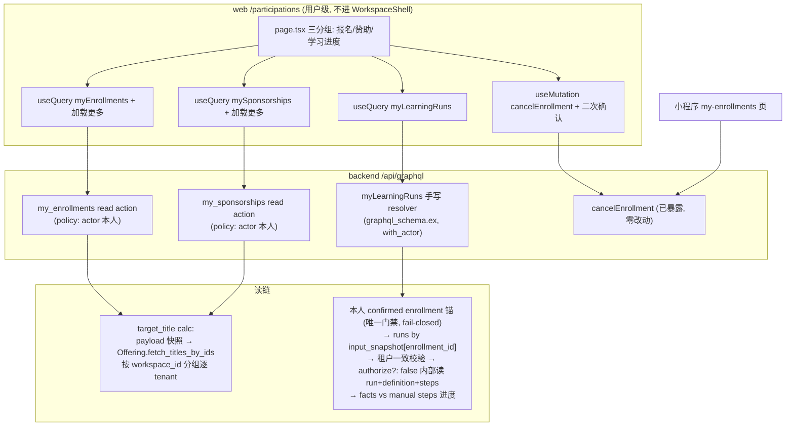

# feat: 用户级「我的参与」页（我的报名 + 取消 + 我的赞助 + 学习进度）

## Goal Capsule

- **Objective**: 新增 web 用户级 `/participations` 页，一页解决审计断点 A2（web 无「我的报名」、取消报名两端无 UI）与 A3（Sponsor 提交意向后无状态查看、学员无进度页）；同时补齐小程序取消报名入口。
- **Authority hierarchy**: 产品范围由用户 goal 拍板（D1 完整版：报名含取消 + 赞助 + 学习进度）；技术决策由本 plan KTD 承载；实现细节 writer 以本 plan 为唯一设计真源。
- **Stop conditions**: 发现 plan 与代码事实冲突（如 GraphQL 面已被他人改动）时停下报告，不自行扩大范围；跨租户读授权若无法做到 fail-closed，视为阻塞。
- **Execution profile**: sop-omp 流水线（writer14 → advisor14 → gate → merge），后端 Elixir/Ash + 前端 Next.js 双栈。
- **Tail ownership**: 合并后关闭 issue #153（A2）、#155（A3）；清理 worktree 与 pane。#158（A4）不在关闭范围。

## Product Contract

### Summary

为非成员参与者（Learner / Sponsor）与所有用户提供一个用户级「我的参与」页面：我的报名（含取消）、我的赞助（含交付履约）、我的学习进度。后端补三个 actor-scoped 读面，前端一页三分组展示，小程序补取消按钮。本页同时承接 #158（A4 通知最小版）的「状态自助查询」半边（仅查询侧；A4 的角标/触达另立 plan，本 plan 不关闭 #158）。

### Problem Frame

审计（`show-me-role-journey-breakpoints.html`，2026-08-15）确认：后端能力与前端体验断层。Enrollment cancel 与 Sponsorship 本人读 policy 后端已实现，但 web 无任何用户级页面承接；WorkflowRun 读策略只放行工作台成员，非成员学员的学习进度在平台侧完全不可见。两个非成员核心角色提交后进入「黑洞」，而「非成员参与者的平台侧体验」恰是产品区别于普通社区平台的核心卖点。

### Key Decisions

- D1 拍板完整版：页面范围 = 我的报名（含取消）+ 我的赞助 + 学习进度，不做最简版（仅报名）。(session-settled: user-directed — chosen over 最简版（仅报名+取消）: 用户 goal 明确选定完整版，一页解决 A2/A3)。Governs R1, R3, R4。
- 小程序取消纳入本次：A2 断点原文「取消报名按钮 web / 小程序两端皆无」，小程序已有「我的报名」页（`miniprogram/src/pages/my-enrollments/index.tsx`），只差取消按钮，属小成本完整关闭 A2。(session-settled: user-approved — 目标为补全断点所有功能，小程序按钮属断点原文范围)。Governs R2。

### Requirements

#### 我的报名（A2）

- R1. 登录用户可在 web `/participations` 看到自己跨全部工作台的报名记录：状态（pending/confirmed/rejected/expired/cancelled）、目标标题、提交/审批/取消时间、拒绝原因；仅本人可见。
- R2. 用户可对 pending/confirmed 状态的报名发起取消，需二次确认（确认文案提示名额即时释放、操作不可恢复）；取消成功后名额即时释放（复用既有 `cancel_enrollment` CAS）；取消入口在 web 与小程序「我的报名」页均可用，两端确认文案口径一致。

#### 我的赞助（A3-Sponsor）

- R3. Sponsor 可看到自己提交的全部赞助意向（Event 级 + Workspace 级）：状态（pending/active/rejected/expired/ended）、档位、审批与履约时间；active 状态可见交付履约行（benefit / due_date / fulfilled_at）；仅本人可见。

#### 学习进度（A3-Learner）

- R4. 学员可看到自己每条 confirmed 报名对应的学习 run 进度：run 状态（running/waiting/succeeded/failed 等）、步骤完成度（已完成 manual 步骤数 / 总 manual 步骤数）、当前等待中的步骤标题。完成（100%）判定以 `LearningProgressWorker` 口径为基准（末个 manual step 的 fact 存在）；步骤完成度按各 manual 步骤 fact 存在性计数。
- R5. 未产生学习 run 的报名（如活动未配学习 workflow、run 尚未实例化）显示「暂无学习进度」占位，不报错。

#### 访问与安全

- R6. `/participations` 为用户级页面：登录即可访问，不依赖任何工作台成员身份；未登录跳转 `/login?next=/participations`。
- R7. 越权防护：三个读面与取消操作均以 actor 身份为唯一输入；任何用户不能读取或取消他人的报名/赞助/学习进度；跨租户内部读取必须先通过本人 Enrollment 归属校验，fail-closed。

### Scope Boundaries

非目标（本次不做）：

- 通知角标 / 未读计数（#158 P1-3：fanout 仅有出站 Oban 投递，无站内读模型，需先定义持久化事实来源，另立 plan）。
- InviteBatch 管理面板或 invite_only 裁剪（P1-2，D2 待拍板）。
- draft 可见性收紧（B4）、平台管理员只读放行（B5）等 P2 错位项。
- 邮件 / 站内信触达（P3）。
- 小程序「我的赞助 / 学习进度」页（小程序明确不做学习侧，赞助状态查询待小程序端排期）。

Deferred to Follow-Up Work：

- enrollments 表 `user_id` leading 索引：当前无 user_id 前导索引，跨工作台 my 列表在数据量增长后可能退化；v1 量小暂不加，观测后再补。
- 取消报名幂等化：重复取消当前返回 `:already_processed` 错误；本次前端容错（见 KTD5），后端语义改造 deferred。
- `graphql_schema.ex` 已约 1990 行，本次 myLearningRuns resolver 并入后继续增长；拆分议题另行评估。

## Planning Contract

### Key Technical Decisions

- KTD1. 三个独立 actor-scoped query（`myEnrollments` / `mySponsorships` / `myLearningRuns`），不做单一聚合 query。三段数据各自独立加载与测试：myEnrollments / mySponsorships 分页（keyset），myLearningRuns 不分页（单人报名量级小，见 U3）。理由：并行 `useQuery`、贴合 web 按领域拆分合约文件的惯例；聚合 query 会把手写 resolver 复杂化且无分页收益。
- KTD2. Enrollment / Sponsorship 读面用 Ash read action（`my_enrollments` / `my_sponsorships`，filter `user_id == actor(:id)` / `sponsor_user_id == actor(:id)`）+ `ash_graphql` managed list 暴露。先例拆分：read action + actor policy 仿 `backend/lib/cgc_2046/accounts/portfolio_item.ex` `read :my_portfolio`（注意其 GraphQL 暴露是 `graphql_schema.ex` 手写 resolver）；managed list DSL 仿 `enrollment.ex` / `sponsorship.ex` 既有 `list(:xxx, :read)`。「managed list + actor-filtered read action」组合为仓库首例，若 ash_graphql 生成面行为异常（如暴露宽 filter），回退 `graphql_schema.ex` 手写 resolver（myPortfolio 同款）。`my_*` action 的 policy 单独定义为 actor 本人，不用现有通用 `enrollments(filter: {userId})`（通用 query 面向管理端，用户页不应复用）。
- KTD3. 目标标题用 `target_title` 计算字段：优先读 `submission_payload["targetTitle"]` 快照（小程序 `real.ts` 已依赖此模式；web 创建的报名无快照，回退为主路径），miss 时经 `Cgc2046.Events.Offering.fetch_titles_by_ids/2`（009 plan 锁定的 seam）内部批量补齐。该函数为 per-tenant 签名（`(ids_by_kind, tenant)`），跨工作台列表须按记录的 workspace_id 分组、逐 tenant 调用后合并（`pending_approvals.ex` 同款形状）。不复制 Event/Course 查询分叉，不放开 Event 读 policy（非成员对 closed/cancelled 活动无读权）。Sponsorship 目标标题同口径（event 级标题 / workspace 名）。
- KTD4. 学习进度 `myLearningRuns` 为手写 GraphQL resolver + type，落位 `backend/lib/cgc_2046_web/graphql_schema.ex`（既有单文件，全部 with_actor resolver 所在；006 plan 惯例：手写 resolver + `with_actor` 统一门与 unauthorized 错误契约）。**单门模式**：查询根锚定本人 confirmed（非 cancelled）enrollments——「本人 enrollment 锚 → run 反查」是唯一门禁，`authorize?: false` 内部读无资源层 policy 兜底，不得反向先取 run 再校验。流程：actor → 本人 confirmed 报名 → 按 `input_snapshot["enrollment_id"]` 锚反查 learning runs（`enrollment.workflow_run_id` 实测不被回写，不可依赖）→ 校验 `run.workspace_id == enrollment.workspace_id`（租户一致）且 `enrollment.user_id == actor.id` → 通过后 `authorize?: false` 内部读 run + definition + steps，计算进度；任一校验失败跳过该行（fail-closed，不报错不泄露存在性）。不修改 WorkflowRun 通用读 policy，不新建 ActorIsEnrolledLearner 读豁免。
- KTD5. 取消报名后端零改动：`cancelEnrollment(id: ID!)` 已暴露（`backend/lib/cgc_2046/events/enrollment.ex` GraphQL DSL）。前端二次确认（参考 `/approvals` reject 模式，确认文案提示名额即时释放、不可恢复）；对 `already_processed` 类错误容错：忽略错误直接 refetch，以服务端最新状态为准展示（取消幂等展示，不改后端语义）。
- KTD6. web 路由 `/participations` 根级页面（不包 `WorkspaceShell`），模式基准 `web/app/approvals/page.tsx`（`useAuthed` + `useQuery` + 登录守卫 + loading/error/空态）；入口三处：`web/components/workspace-switcher-menu.tsx` Account 子菜单（`/join`、`/approvals` 旁）、首页无工作区空态（`web/app/page.tsx`）、公开活动/课程详情页报名成功反馈处一行引导（「在『我的参与』查看报名状态」链接）。页面三分组纵向布局（我的报名 / 我的赞助 / 学习进度），不做 tab 路由。

### High-Level Technical Design

### Assumptions

- `submission_payload["targetTitle"]` 仅小程序端写入（客户端随 payload 提交）；web 创建的报名一律走 KTD3 回退路径，U1 测试「有快照」场景靠夹具构造 payload 覆盖。
- `enrollment.workflow_run_id` 不回写（全仓 grep 仅 attr/accept，无 link action）；反查一律走 `input_snapshot["enrollment_id"]`。
- learning run 在 `enrollment.completed` 后由 `LearningInstantiator` 幂等创建（key = `enrollment_<id>`），非终态去重；终态后可重建属既有语义，进度页如实展示当前 run。
- `node_def["steps"]` 的步骤 map 仅含 `id` / `type`（及可选 next/action/condition），不含 `step_key` / `title`；步骤标题只存在于 `Step` 资源行（step_key/title/type，经 `WorkflowDefinition has_many :steps`）。

### Risks & Dependencies

- **跨租户内部读（KTD4）为最大安全敏感点**：单门模式无资源层 policy 兜底，「本人 enrollment 锚 → run 反查」顺序不可倒置；租户错配（run.workspace_id ≠ enrollment.workspace_id）必须有专门测试钉住（U3/U6）。advisor 按 deep 深度评审此链路。
- `myLearningRuns` 完成判定（末 manual step fact 存在）与完成度计数（各 manual step fact 存在）在乱序 facts 时会分叉（显示 n-1/n 但 run 已 succeeded）；以 worker 口径为完成基准，测试断言按 R4 括注双口径写。
- ash_graphql managed list + actor-filtered read action 为仓库首例（KTD2）；生成面异常时回退手写 resolver，爆炸半径小但改变 U1/U2 实现形态。
- 存量报名无 `targetTitle` 快照：KTD3 回退路径覆盖；极端情况（Event 已删）显示占位标题。
- 三 query 并行加载，最慢段决定首屏；v1 接受（无 SLA 压力），不引入聚合。
- 报名列表 × 学习进度差集（R5 占位）依赖 enrollment_id 关联与两段时序；并行加载下占位行可能短暂闪烁，接受为 UX 边角。

## Implementation Units

### U1. Enrollment my 读面 + target_title

- **Goal**: `myEnrollments` actor-scoped 分页 query，含目标标题。
- **Requirements**: R1, R6, R7
- **Dependencies**: 无
- **Files**:
  - `backend/lib/cgc_2046/events/enrollment.ex`（read action + calc + GraphQL DSL）
  - `backend/priv/graphql/schema.graphql`（生成物，随 mix 任务更新）
  - `backend/test/cgc_2046_web/graphql_enrollment_my_query_test.exs`（新建，扁平命名与既有 `graphql_sponsorship_test.exs` 同目录同式）
- **Approach**:
  1. `read :my_enrollments`，filter `expr(user_id == ^actor(:id))`，policy 单独定义 actor 本人（不动通用 read 的 Owner/Admin 分支）。
  2. `target_title` calc：`submission_payload["targetTitle"]` 优先，miss 时按记录 workspace_id 分组、逐 tenant 调 `Offering.fetch_titles_by_ids/2` 后合并（`pending_approvals.ex` 同款形状）；calc 批量加载避免 N+1；Offering 内部读不带 actor 授权，属服务端内部数据。
  3. GraphQL：managed list `myEnrollments(first/after/...)`；字段为封闭枚举，仅含 id/status/targetTitle/eventId/courseId/approvedAt/rejectionReason/approvalDeadline/expiredAt/cancelledAt/insertedAt，明确不暴露 `submissionPayload`；sort 补 `inserted_at`（现有 `EnrollmentSortField` 缺该枚举）。
- **Patterns to follow**: `backend/lib/cgc_2046/accounts/portfolio_item.ex` `read :my_portfolio`（read action + policy）；`backend/lib/cgc_2046/events/sponsorship.ex` `list(:sponsorships, :read)`（managed list DSL）。
- **Test scenarios**:
  - 本人查询返回自己的跨工作台报名，含全部状态与 targetTitle。
  - 用户 A 查询不包含用户 B 的记录（filter 强制 actor，无法经参数越权）。
  - 未登录（无 actor）查询被拒。
  - targetTitle：有快照直接返回；无快照经 Offering 回退补齐（跨两个 workspace 的记录各补各的）；Event 已删返回占位。
  - keyset 分页翻页正确。
  - schema 不含 myEnrollments 的 submissionPayload 字段。
- **Verification**: `mix test` 新增测试通过；生成 SDL 含 `myEnrollments`。

### U2. Sponsorship my 读面

- **Goal**: `mySponsorships` actor-scoped 分页 query，含目标标题与交付履约。
- **Requirements**: R3, R6, R7
- **Dependencies**: U1（calc 与批量补齐模式复用，实现时按 U1 落地形态微调）
- **Files**:
  - `backend/lib/cgc_2046/events/sponsorship.ex`
  - `backend/priv/graphql/schema.graphql`（生成物）
  - `backend/test/cgc_2046_web/graphql_sponsorship_my_query_test.exs`（新建）
- **Approach**:
  1. `read :my_sponsorships`，filter `expr(sponsor_user_id == ^actor(:id))`，policy actor 本人；Sponsorship 为 global 资源（`global?` multitenancy），本人跨工作台读取无租户屏障问题，但 action 内不得放宽其他 filter。
  2. 目标标题 calc：event 级经 event_id → Offering 标题；workspace 级显示 workspace 名称（内部读，同 KTD3 口径）。
  3. GraphQL：`mySponsorships` 字段仅含 id/level/status/tierName/amount/targetTitle/approvedAt/rejectionReason/endedAt + `deliveries { benefit dueDate fulfilledAt }`（deliveries 读已有 `sponsorship_delivery_readable` policy 经父关系放行）。
- **Patterns to follow**: U1 模式；`backend/test/cgc_2046/events/sponsorship_delivery_read_test.exs`。
- **Test scenarios**:
  - 本人查询返回 Event 级 + Workspace 级全部意向与状态。
  - 用户 A 查不到用户 B 的赞助；未登录被拒。
  - active 意向带 deliveries 行；pending 无交付行。
  - event 级标题与 workspace 级名称正确展示。
- **Verification**: `mix test` 通过；SDL 含 `mySponsorships`。

### U3. 学习进度投影 myLearningRuns

- **Goal**: 非成员学员可读自己学习 run 的进度投影。
- **Requirements**: R4, R5, R7
- **Dependencies**: U1（enrollment 读取与 targetTitle 复用）
- **Files**:
  - `backend/lib/cgc_2046_web/graphql_schema.ex`（myLearningRuns resolver + MyLearningRun type，并入既有单文件）
  - `backend/lib/cgc_2046/workflows/learning_progress.ex`（进度计算纯函数，新建）
  - `backend/test/cgc_2046_web/graphql_my_learning_runs_test.exs`（新建）
  - `backend/test/cgc_2046/workflows/learning_progress_test.exs`（新建，纯函数单测）
- **Approach**:
  1. resolver（`with_actor` 门，单门模式见 KTD4）：查本人 confirmed（非 cancelled）报名 → 对每条按 `input_snapshot["enrollment_id"]`（且 definition.type == learning）反查 run → 校验 `enrollment.user_id == actor.id` 且 `run.workspace_id == enrollment.workspace_id` 通过后 `authorize?: false` 内部读 run + definition + steps（按 definition_id 预载 `WorkflowDefinition.steps`）→ 产出投影行；任一校验失败跳过该行（fail-closed，不报错不泄露存在性）。
  2. 进度计算纯函数：输入 definition `node_def["steps"]`（步骤 map 仅含 id/type）+ `Step` 资源行（step_key/title，以 id == step_key join）+ run `facts` + `status`；输出 `{run_id, enrollment_id, target_title, status, completed_manual_steps, total_manual_steps, current_step_title}`；完成判定与 `LearningProgressWorker` 同口径（末个 manual step 的 fact 存在）；完成度按各 manual 步骤 fact 存在计数；当前步骤 = 首个无 fact 的 manual 步骤（取 Step.title）。
  3. GraphQL type `MyLearningRun` + root query `myLearningRuns: [MyLearningRun!]!`（不分页，单人报名量级小；如实现时发现需要分页再补 keyset）。
- **Patterns to follow**: `backend/lib/cgc_2046_web/graphql_schema.ex` 既有 `with_actor` resolver 惯例（注意：非 `save_step_output` 双门——本投影是单门读路径，无资源层 policy 兜底）；`backend/lib/cgc_2046/workers/learning_progress_worker.ex`（完成判定口径与 manual 步骤匹配式 `%{"type" => "manual", "id" => id}`）。
- **Test scenarios**:
  - 学员查自己的 run：状态、步骤完成度、当前步骤标题正确；与 `LearningFlowTest` 造数链路对齐（enrollment.completed → run running → save_step_output → 完成）。
  - 非学员用户（无 enrollment）查询返回空列表。
  - 报名无对应 run（未配学习 workflow）→ 该报名不出现（R5 由前端对报名列表做差集占位）。
  - 越权：构造他人 enrollment_id 无法读取其 run（归属校验 fail-closed）。
  - 租户错配：构造 `run.workspace_id ≠ enrollment.workspace_id` 的 input_snapshot 锚 → 该行不返回（租户一致校验 fail-closed）。
  - 未登录（无 actor）查询 → unauthorized（with_actor 门）。
  - run 终态（succeeded）进度显示全满；waiting 状态显示当前等待步骤标题。
  - 进度纯函数：manual-only 步骤计数、跳过非 manual 步骤、空 facts、乱序 facts（完成度 n-1/n 与 succeeded 并存）。
- **Verification**: `mix test` 通过；`graphql_workflow_test.exs` 既有「非成员 list 空」断言不回归（未改通用 policy）。

### U4. web 我的参与页

- **Goal**: `/participations` 一页三分组 + 取消报名。
- **Requirements**: R1, R2, R3, R4, R5, R6
- **Dependencies**: U1, U2, U3
- **Files**:
  - `web/lib/graphql/participations.ts`（新建：三个 query + cancel mutation 合约，TypedDocumentNode）
  - `web/app/participations/page.tsx`（新建）
  - `web/app/participations/page.test.tsx`（新建）
  - `web/components/workspace-switcher-menu.tsx`（Account 组加入口）
  - `web/app/page.tsx`（无工作区空态加入口）
  - `web/components/public-offering-detail.tsx`（报名成功反馈处加「在『我的参与』查看报名状态」链接）
- **Approach**:
  1. 合约按领域文件惯例手写（`web/lib/graphql/shared.ts` 的 MutationError/MutationResult 单源）；状态中文词表对齐 `web/lib/graphql/events.ts` 既有映射并补全（expired/ended/deliveries 等），统一为模块内常量防口径漂移。
  2. 页面：`useAuthed` 守卫（未登录 replace `/login?next=/participations`）；三段并行 `useQuery`（skip: !authed）；每段独立 loading/error/空态。报名段单一形态：按「进行中（pending/confirmed，含取消按钮）」与「已结束（rejected/expired/cancelled，只读）」两组分组展示，分组标题与空态文案随分组独立给出。
  3. 分页交互：报名与赞助两段 `first: 20` keyset + 行尾「加载更多」按钮（loading 时禁用、无更多时隐藏）；不引入路由分页参数。
  4. 取消：按钮仅 pending/confirmed 可见；点击展开二次确认（确认文案提示名额即时释放、不可恢复）；成功或 `already_processed` 错误均 refetch `myEnrollments`。
  5. 学习进度段：`myLearningRuns` 按 enrollment 关联展示；进度行显示「学习进度：x/y 步」，run 状态用中文状态词（running=进行中 / waiting=等待中 / succeeded=已完成 / failed=已失败），waiting 时附当前步骤标题；「manual」仅存在于后端口径，不进入任何用户可见文案。报名存在但无 run 的行显示「暂无学习进度」。
  6. 复用既有 UI 原语（badge/notice/空态组件），不引新依赖。
- **Patterns to follow**: `web/app/approvals/page.tsx`（用户级列表 + 操作 + refetch + 分组）；`web/app/apply/page.tsx` 与 `web/app/apply/page.test.tsx`（提交 + 我的列表 + 测试基准）。
- **Test scenarios**:
  - 未登录跳转 `/login?next=/participations`。
  - 三段数据渲染：报名状态词、赞助含 deliveries、学习进度「x/y 步」与中文状态词、waiting 附当前步骤标题。
  - 报名行落位：进行中/已结束两组内行落位正确。
  - 空态：无报名 / 无赞助 / 无学习进度各自占位。
  - 分页：加载更多追加下一页且去重；无更多时按钮隐藏。
  - 取消流程：确认弹层出现（文案含名额释放提示）→ 确认后 mutation 调用 → refetch → 状态变 cancelled；`already_processed` 错误同样走 refetch 不报错条。
  - 取消按钮仅 pending/confirmed 行可见。
  - 公开详情页报名成功反馈含「我的参与」链接。
  - GraphQL 错误展示 error notice。
- **Verification**: `pnpm typecheck` / `pnpm lint` / `pnpm test` / `pnpm build` 通过；e2e 按 AGENTS.md 分层：结构断言（路由可达、三分组标题、取消按钮可见性、加载更多）优先。

### U5. 小程序取消报名

- **Goal**: 小程序「我的报名」页补取消入口。
- **Requirements**: R2
- **Dependencies**: 无（后端 mutation 已暴露）
- **Files**:
  - `miniprogram/src/api/operations.ts`（CancelEnrollment operation）
  - `miniprogram/src/api/real.ts`（cancelEnrollment 方法）
  - `miniprogram/src/api/mockTransport.ts`（cancel 分支）
  - `miniprogram/src/domain/models.ts`（接口签名唯一落点）
  - `miniprogram/src/pages/my-enrollments/index.tsx`（按钮 + 二次确认 handler）
- **Approach**: pending/confirmed 行加「取消报名」；Taro `showModal` 二次确认，content 文案与 web 对齐、须包含名额即时释放与不可恢复提示（如「取消后名额将即时释放，此操作不可恢复」），确认/取消按钮文案随 Taro 默认；成功后刷新列表；`already_processed` 容错同 KTD5。
- **Patterns to follow**: 页内既有「重新提交」按钮 handler；`real.ts` 既有 getSession + mutate 模式。
- **Test scenarios**:
  - mock transport：cancel 分支返回后列表刷新、状态变 cancelled。
  - 确认弹层文案含名额释放提示；取消弹层则不发请求。
  - 仅 pending/confirmed 显示按钮。
- **Verification**: 小程序测试/类型检查命令按 `miniprogram/package.json` 既有脚本通过。

### U6. 端到端验证

- **Goal**: 三端行为链闭环验证（含越权演练）。
- **Requirements**: R7
- **Dependencies**: U1, U2, U3, U4, U5
- **Files**:
  - `backend/test/cgc_2046_web/`（越权用例并入 U1–U3 测试文件，扁平落位，不单列）
  - e2e 脚本/操作记录（按 web 仓库既有 e2e 惯例）
- **Approach**:
  1. 后端：用户 A/B 双账号用例覆盖三读面 + cancel 越权（A 取消 B 的报名被拒）+ 租户错配（并入 U3 场景）。
  2. web e2e（agent-browser，结构断言层）：登录 → `/participations` 三分组渲染 → 取消一条 pending → 状态变更断言（computed 断言优先，不用视觉模型）。
  3. 数据准备走 dev 环境种子或测试夹具，不改生产数据。
- **Test scenarios**:
  - A 读不到 B 的任何数据（三面各一用例）。
  - A cancel B 的 enrollment → unauthorized。
  - e2e 全链：报名 → 取消 → 状态 reflected。
- **Verification**: 全部套件绿；e2e 结构断言通过。

## Verification Contract

- backend: `cd backend && mix format --check-formatted && mix compile --warnings-as-errors && MIX_ENV=test mix test`（×2 seeds，sop-omp 自查套件）。
- web: `cd web && pnpm typecheck && pnpm lint && pnpm test && pnpm build`。
- miniprogram: 按 `miniprogram/package.json` 既有 test/typecheck 脚本。
- e2e: web Dev 服务 + agent-browser 结构断言（AGENTS.md 确定性分层第 1/2 层）。
- 越权为 release 前置门：U6 越权用例（含租户错配）全红→绿才可进 gate。

## Definition of Done

- 全部 R1–R7 满足且对应测试场景绿；三端自查套件（backend/web/miniprogram）全绿。
- `/participations` 页面以非成员账号（仅有报名、无任何工作台成员身份）可达且三段数据正确。
- 越权用例（A/B 双账号四面 + 租户错配）全部通过。
- advisor 评审 PASS、hard stops 0；PR 合并进 develop；issue #153、#155 以落地说明关闭。
- 无残留实验代码 / 死分支；`git status` 干净；worktree 与临时 pane 清理。
