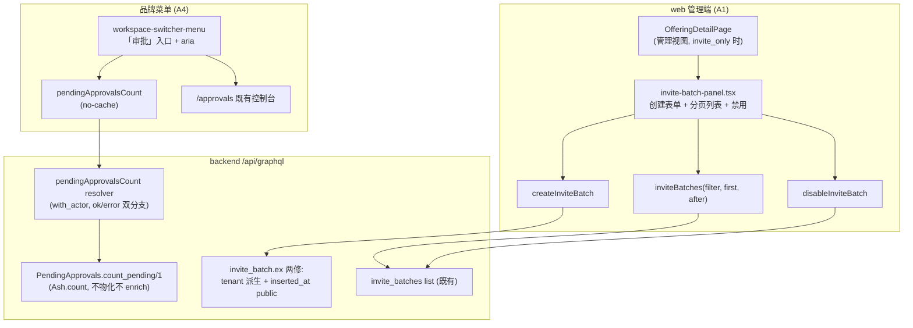

# feat: InviteBatch 批次码管理面板 + 待办审批角标（A1 + A4 最小版）

## Goal Capsule

- **Objective**: 关闭审计断点 A1（`invite_only` 批次码无创建入口，策略产品上不可用）与 A4 的角标半边（web 零通知触达 → 待办审批角标最小版）。两块改动运行时无依赖，按两条独立交付线验收（A1 线 = U1；A4 线 = U2 + U3），分别开 PR、分别关闭对应 issue。A4 的「状态自助查询」半边已由 plan 014（`/participations` 页）承接，本 plan 不重复。
- **Authority hierarchy**: D2 决策已由 product owner 拍板选项 A（补 InviteBatch 管理面板，不裁剪 invite_only）(session-settled: user-directed — chosen over v1 裁剪 invite_only: 保留已完整的后端能力，改动集中在 web 端)；技术决策由本 plan KTD 承载。
- **Stop conditions**: 发现后端 GraphQL 面与本 plan 已验证事实不符（如 SDL 再生成后 filter 面收窄）时停下报告，不自行改后端 policy；不扩 InviteBatch 后端 action 面（编辑/删除/批量生成）。
- **Execution profile**: sop-omp 流水线（writer → advisor → gate → merge），两线各一个 PR；U1 含两处后端小修（create tenant 派生 + `inserted_at` 公开，见 KTD2）+ U2 一个后端模块函数，无迁移、无数据回填。
- **Tail ownership**: A1 线合并后关闭 issue #148；A4 线随 plan 014 合并后一并关闭 #158（角标本 plan + 查询 014，两半齐才闭环）；清理 worktree 与 pane。

## Product Contract

### Summary

两块独立改动：其一，为 `invite_only` 报名策略补运营入口——工作台 Owner/Admin 在 Event/Course 管理详情页内创建、查看、禁用报名批次码（InviteBatch），使 invite_only 活动可运营；其二，为审批人补最小触达——工作台品牌菜单「审批」入口显示跨工作台待办数角标，待办不再依赖进入审批页才发现。

### Problem Frame

审计 A1：InviteBatch 后端（含 GraphQL create/list/disable、配额条件 UPDATE 扣减、租户校验）基本完整，但 web / 小程序零 UI，运营方无处创建批次码，`invite_only` 策略形同虚设（issue #148）。审计 A4：审批/邀请/赞助履约等异步流程的结果零通知触达（issue #158）；其中参与者侧「状态自助查询」已由 plan 014 解决，审批人侧缺一个低成本「有待办」信号。仓库已有 `myPendingApprovals` 跨工作台查询（E-8 #123 审批控制台数据源），角标是其天然衍生物，无需引入通知读模型（通知中心列 P3 另立 plan）。

既有 AshAdmin 治理面（`/ops/admin`，`invite_batch.ex` 已配置 `AshAdmin.Resource`）只服务平台管理员，工作台 Owner/Admin 无法使用，不能替代本面板；面板目标受众是工作台运营者，这是建面板而非复用 AshAdmin 的理由。

### Key Decisions

- D2 拍板选项 A：补 InviteBatch 管理面板，不裁剪 invite_only。(session-settled: user-directed — 保留后端完整能力，改动集中在 web 端) Governs R1, R2, R3。
- A4 范围定为「角标」而非通知系统：派生既有审批数据面，零新表零新 worker；站内信/邮件/通知中心不在本次。(session-settled: user-approved — issue #158 修复方向原文即「状态自助查询 + 角标」，查询半边在 plan 014) Governs R4, R5。
- 批次码面板入口收窄为工作台 Owner/Admin：平台管理员不经 web 业务面操作批次码（后端 policy 放行与 AshAdmin 治理面保持现状不动）。平台管理员是否进业务工作台属待拍板决策 D5（#147，倾向选项 B「只在 /admin 治理」），本 plan 取与之一致的保守口径，不替 D5 拍板。Governs R1, R3, R6。

### Requirements

#### 批次码管理（A1）

- R1. 工作台 Owner/Admin 可在 Event/Course 管理详情页（工作台内）创建报名批次码：填写邀请码（`[A-Za-z0-9_-]{1,64}`，全平台唯一，提供「生成」辅助按钮）、配额（≥1）、可选过期时间（按运营者本地时区解释、提交 UTC，不允许提交过去时间）与备注；创建成功后立即可见，剩余配额 = 配额。活动处于 open 状态时可创建；非 open（draft/closed/cancelled）时创建表单禁用并提示原因。
- R2. 同页可查看该活动全部批次码（分页加载，见 KTD7）：邀请码、配额/剩余配额、状态、过期时间、创建时间、备注；可一键复制邀请码；active 且未过期的批次可禁用（二次确认，确认文案说明「禁用后剩余配额立即作废，不可恢复」；禁用后不可恢复）。列表有独立的 loading / 加载失败（含重试，不显示空态）/ 空态；禁用操作有提交中（锁定该行）与失败（保留 active、行级错误、可重试）状态。
- R3. 面板仅在该活动 `enrollmentPolicy == invite_only` 且访问者为该工作台 Owner/Admin 时显示；普通成员与未登录不可见（前端门控为 UX，后端 policy 为兜底安全边界）。平台管理员沿用既有 AshAdmin 面治理，不在本面板范围内（见 Key Decisions 3）。

#### 待办审批角标（A4 最小版）

- R4. 登录用户在工作台品牌菜单（workspace-switcher）的「审批」入口看到待办数角标：本人作为 Owner/Admin 的跨工作台 pending 项总数（Enrollment + JoinRequest + Sponsorship，可操作口径——已过审批截止的 pending 不计，见 KTD8）；0 时无角标；点击进入既有审批控制台。每次菜单打开都发起网络查询（不走缓存）。
- R5. 角标为纯派生展示，不做已读状态、不做清零交互、不引入通知表；待办处理完毕（审批通过/拒绝）后角标随下次查询立即反映。角标只挂在品牌菜单；`/approvals` 直达页本身无菜单为既有结构，v1 接受（入口以工作台内为主）。

#### 访问与安全

- R6. InviteBatch 全部操作走既有后端 policy（Owner/Admin / 平台管理员），前端不做权限放大；平台管理员可经 AshAdmin 面治理（现状）。批次码列表仅管理详情页可见，不在公开活动页暴露任何批次码信息。
- R7. `pendingApprovalsCount` 仅返回本人数字，不含可枚举他工作台的条目信息。

### Scope Boundaries

非目标（本次不做）：

- 通知中心 / 站内信 / 邮件触达（#158 P3，待读模型定义后另立 plan）。
- InviteBatch 的编辑（改配额/改码）、删除、批量生成——后端无对应 action，不扩后端面。
- 平台管理员的 web 业务面板入口（D5 未拍板，保持 /admin + AshAdmin 治理路径）。
- 小程序端批次码管理（运营动作归 web 管理端）。
- 报名者侧凭码报名的 UI 优化（`/join` invite 分支已有；本 plan 只补运营侧创建入口）。
- B/C 级错位与断链项（#149-#152、#154、#156-#157、#160-#161）。

Deferred to Follow-Up Work:

- 批次码列表按状态筛选（分页已做，见 KTD7）。
- 角标轮询 / WebSocket 推送（v1 每次菜单打开现查）。

## Planning Contract

### Key Technical Decisions

- KTD1. 批次码面板落位 Event/Course 管理详情页内（`offering-pages.tsx` 的 `OfferingDetailPage` 管理视图区块），不落 settings 子域。理由：InviteBatch 是 per-Event/Course 资源（`exactly one of event_id/course_id` 约束），与活动报名策略同上下文；settings 子域是 per-workspace 语义（members/requests/invitations），放错层级。面板区块顺序固定：生命周期区块之后、赞助管理（SponsorshipManagement）之前；Event 与 Course 用同一组件同一标题「报名批次码」。
- KTD2. 后端三处小修（评审与实施中证伪「零改动」后的最小集）：(a) `create_invite_batch` 的 tenant 缺口——GraphQL pipeline 不注入 tenant（`graphql_create_enrollment_test.exs` 注释记录的 #104 同款事实），`invite_batch.ex` 的 `force_change_attribute(:workspace_id, changeset.tenant)` 在 GraphQL 路径拿到 nil。修法：create action 内从 event_id/course_id 服务端派生 workspace_id 并回填 tenant（#104 createEnrollment 的既有派生模式），`validate_target_tenant` 保持原语义。(b) `inserted_at` 未公开——SDL 的 `InviteBatch` type 无 `insertedAt`（Ash timestamp 默认非 public），改 `create_timestamp(:inserted_at, public?: true)` 后再生成 SDL。(c) `update :disable` 补 `require_atomic?(false)`——AshGraphQL 1.10 update mutation 走 `Ash.bulk_update`，纯 `set_attribute` action 被原子升级后 changeset 为 `OriginalDataNotAvailable`，`WorkspaceActorIsOwnerOrAdmin` 的 `get_attribute` 抛 ArgumentError（writer15 实测 disableInviteBatch 恒败）；仓库全部其余 update action（confirm_enrollment / approve / launch 等 30+ 处）均带该行的惯例对齐。三修均在 `backend/lib/cgc_2046/events/invite_batch.ex`，policy module 零改动。
- KTD3. 面板组件独立成 `web/components/invite-batch-panel.tsx`（与 `speaker-invitation-panel.tsx` 同粒度），由 `OfferingDetailPage` 在管理视图按 `enrollmentPolicy === "invite_only"` 且 `manage`（既有 `canManageEvents(ws.myRoleNames)`，仅 owner/admin）条件渲染；不把面板逻辑内联进 `offering-pages.tsx`（该文件已 28KB）。平台管理员不扩前端门控（Key Decisions 3）。
- KTD4. 待办角标数据面：`PendingApprovals` 模块新增 `count_pending/1` 轻量计数函数——复用 `managed_workspace_ids(actor)` 收窄（Owner/Admin 唯一真源不动），对 Enrollment / JoinRequest / Sponsorship 三类资源直接做过滤后的计数查询（`Ash.count/3` 或等价），不物化全行、不执行 enrich（list 的摘要装配与多次 read 不进计数路径）。`graphql_schema.ex` 追加 `pendingApprovalsCount: Int!` 根 query（`with_actor` 门），resolver 对 `{:ok, n}` 与 `{:error, reason}` 双分支透传。不复用 `myPendingApprovals` 全列表在前端数行数。
- KTD5. 角标挂点与缓存语义：`web/components/workspace-switcher-menu.tsx`「审批」菜单项右侧数字角标（>99 显示 99+）；query 显式 `fetchPolicy: "no-cache"`（Apollo InMemoryCache 默认 cache-first 会在菜单卸载重挂后复用旧值，直接违背 R5/U4 的「重开菜单即最新」），`skip: !authed`。复用 `l-badge l-badge-pending` 既有样式。工作台侧边栏不加——审批控制台是用户级页，入口唯一挂品牌菜单，避免双源。
- KTD6. 禁用批次码二次确认用 `offering-pages.tsx` 既有 inline 确认模式（reject 二次确认同款），不引 modal 组件；确认中锁定该行，失败保留 active 态 + 行级错误 + 重试。
- KTD7. 列表分页：`LIST_INVITE_BATCHES` 固定 `first: 50` + 消费 `endKeyset` 的「加载更多」按钮（keyset，SDL 上限 250 但不依赖一次性取全）；R2 的「全部批次码」由翻页兜底，单活动量小一般一页即全。
- KTD8. 角标口径 = 可操作 pending：计数过滤同时排除 `approval_deadline <= now` 的 pending 行（与 `/approvals` 页 ApprovalChip「已过期」视觉同语义：过期项不可再审批，不应占用待办数；expired 落库 worker（5 分钟一拍）转换前后的窗口差由该过滤消除）。与 `/approvals` 页 `pendingRows`（按 status=pending 展示、含过期只读行）存在有意口径差：展示含过期、计数不含，差异在 KTD/测试注释钉住。

### High-Level Technical Design

### Assumptions（已验证事实与前提）

- 已验证：`invite_batches` list 的 filter 面含 `eventId` / `courseId` eq 过滤（`backend/priv/graphql/schema.graphql` `InviteBatchFilterInput`）。
- 已验证：GraphQL pipeline 不注入 tenant（`backend/test/cgc_2046_web/graphql_create_enrollment_test.exs` #104 注释），create 必须服务端派生——KTD2(a) 修法有直接先例。
- 已验证：SDL `InviteBatch` type 现无 `insertedAt` 字段（timestamp 未 public），KTD2(b) 必要。
- 已验证：`OfferingDetailPage` 管理判断为 `manage = canManageEvents(ws.myRoleNames)`（仅 owner/admin），已有同款条件挂载先例（`SpeakerInvitationPanel`、`SponsorshipManagement`）；平台管理员非成员时 `myRoleNames` 为空，前端不可达——已由 Key Decisions 3 收窄口径消化。
- 已验证：`PendingApprovals.list/2` 默认 `include_expired: false`；但角标不直接复用 list（KTD4 轻量路径 + KTD8 口径）。
- 已验证：`invite_code` 唯一 identity 为全局（`identity(:unique_invite_code, [:invite_code])`，无 tenant scope）——跨活动不可复用同一码，表单须注明并提供生成辅助。
- 已验证：`web/lib/clipboard.ts` 存在（含 false 返回约定的复制工具），复制交互复用之。
- 已验证：Apollo client 为裸 `InMemoryCache`（无 defaultOptions），cache-first 默认成立——KTD5 no-cache 必要。
- 已验证（writer15 实施发现）：`inviteBatches` list 经 GraphQL（global 资源、无 tenant 注入）时，`MembershipContext.resolve_workspace_id(query)` 只能从 filter 提取 `workspaceId`——仅带 eventId/courseId filter 时 Owner/Admin 分支解析不出工作台被拒（PlatformAdmin 分支可过）。修法：web LIST 合约 filter 携带 `workspaceId`（面板上下文已有 ws id），后端零改动。
- 已验证（writer15 实施发现）：`disableInviteBatch` 失败根因见 KTD2(c)——`OriginalDataNotAvailable{reason: :atomic_query_update}`，补 `require_atomic?(false)` 即恢复 changeset.data 路径。
- 已验证：`globals.css` 无 `l-badge-active/disabled` 变体；现有族为 owner/admin/tutor/volunteer/learner/member/pending/success/danger/muted——状态映射用 `l-badge-success`（active）/ `l-badge-muted`（disabled / 已过期 / 已用尽）。
- plan 014（`/participations`）与本 plan 的唯一文件交集是 `workspace-switcher-menu.tsx` 的 Account 子菜单邻域（014 加 `/participations` 入口、本 plan 动 `/approvals` 项加角标），Git 行级自动合并不保证语义正确——U3 以「plan 014 已合并」为前置（见 U3 Dependencies）。

### Risks & Dependencies

- **A4 线对 plan 014 的顺序依赖**（`workspace-switcher-menu.tsx` 同一 JSX 邻域）：U3 前置条件为 014 已合入 develop（或明确 rebase barrier），实施后跑菜单测试覆盖 `/participations` 入口与角标共存。
- KTD2(a) tenant 派生改动触及既有 create 语义：跨租户拒绝、配额初始化、identity 唯一约束行为以 U1 后端测试钉住（含平台管理员直调与跨租户拒绝用例）。
- 角标口径与 `/approvals` 页展示的刻意口径差（KTD8）：两处测试各自钉住，注释互引，防未来「顺手统一」。
- InviteBatch quota 扣减是 Enrollment 事务内条件 UPDATE（既有并发不变量），本 plan 只读展示 remaining_quota，无并发新增面。
- 两线虽独立 PR，共享 `backend/priv/graphql/schema.graphql` 生成物：A4 的 SDL 再生成若与 A1 并发，以后合并者 rebase 重跑生成任务即可（生成物冲突机械可解）。

## Implementation Units

### U1. 批次码：后端两修 + web 合约 + InviteBatchPanel（A1 线全部）

- **Goal**: 批次码创建链路真实可用（含后端 tenant/字段两修），面板组件（创建 + 分页列表 + 禁用 + 复制）条件渲染进管理详情页。
- **Requirements**: R1, R2, R3, R6
- **Dependencies**: 无
- **Files**:
  - `backend/lib/cgc_2046/events/invite_batch.ex`（KTD2 三修：create 内 event/course → workspace_id 派生回填 tenant；`create_timestamp(:inserted_at, public?: true)`；`update :disable` 补 `require_atomic?(false)`）
  - `backend/priv/graphql/schema.graphql`（生成物随 mix 任务更新，含 InviteBatch.insertedAt）
  - `backend/test/cgc_2046_web/graphql_invite_batch_test.exs`（新建：GraphQL create/list/disable 经真实 HTTP 入口，含跨租户拒绝）
  - `web/lib/graphql/invite-batch.ts`（新建：list query + create/disable mutation 合约，TypedDocumentNode）
  - `web/lib/graphql/invite-batch.test.ts`（新建，合约断言对齐 `events.test.ts` 惯例）
  - `web/components/invite-batch-panel.tsx`（新建）
  - `web/components/invite-batch-panel.test.tsx`（新建）
  - `web/components/offering-pages.tsx`（管理视图条件渲染挂点，位置见 KTD1）
- **Approach**:
  1. 后端：invite_batch.ex create action 先按 event_id/course_id 查目标行取 workspace_id，派生回填 `changeset.tenant` 与 `workspace_id`（#104 createEnrollment 派生模式），再走既有 `validate_target_tenant` / quota 初始化；`inserted_at` 公开；`update :disable` 补 `require_atomic?(false)`（KTD2c）。SDL 再生成。后端测试：Owner/Admin 经 HTTP mutation 创建成功（tenant 正确落库）；跨租户 event_id 拒绝；平台管理员直调放行（policy 现状回归）；invite_code 全局唯一冲突错误；disable 成功。
  2. web 合约：`LIST_INVITE_BATCHES`（filter workspaceId + eventId/courseId + `first: 50` + after 游标，字段 id/inviteCode/quota/remainingQuota/status/expiresAt/remark/insertedAt + endKeyset；workspaceId 为 policy 解析工作台的必需 filter，见 Assumptions）、`CREATE_INVITE_BATCH`（eventId|courseId 恰一 + inviteCode + quota + expiresAt? + remark?，result/errors 形状同既有 mutation）、`DISABLE_INVITE_BATCH`（id，result/errors）。
  3. 组件 props：`kind: OfferingKind` / `offeringId: string` / `offeringStatus: string`；内部 useQuery + useMutation，创建/禁用成功后 refetch 列表；活动非 open 时表单禁用并提示「活动当前状态不可创建批次码」。
  4. 列表交互状态（完整契约）：初始 loading 骨架/文案；加载 error 显示错误条 +「重试」按钮（不误显空态）；空态文案；kind/offeringId 切换时数据 stale 处理（沿用 `speaker-invitation-panel.tsx` 的 loading/ok/error 结构）。行状态派生优先级：disabled > expired（active 且 `expiresAt < now`）> exhausted（active 且 `remainingQuota == 0`，显示「已用尽」）> active；徽章映射 `l-badge-success`（active）/ `l-badge-muted`（disabled、已过期、已用尽）。行动作：active 且未过期显示禁用按钮（exhausted 同样可禁用——终止该码）。
  5. 禁用状态机：点击展开 inline 确认（文案含配额作废提示）→ 确认后该行锁定（提交中禁止重复点击）→ 成功 refetch；失败保留 active 态 + 行级错误 + 重试；取消确认不发请求。
  6. 复制：复用 `web/lib/clipboard.ts`；成功显示短暂状态提示；失败显示「请手动复制邀请码」并保持码文本可选中；按钮键盘可达（原生 button）+ aria-label「复制邀请码」。
  7. 创建表单：邀请码输入 + 「生成」按钮（10 位 `[A-Za-z0-9]` 随机、生成后仍可编辑；help 文本注明「邀请码全平台唯一，跨活动不可复用」）、配额（min 1）、过期时间（datetime-local，`min` 为当前时刻，本地时区解释转 UTC 提交）、备注；字段显式 label 关联，错误经 aria-describedby 关联到字段；重复码（后端 identity 全局唯一）映射表单级错误文案。
  8. 挂点：`OfferingDetailPage` 管理视图「生命周期」区块后、「赞助管理」前插入，条件 `manage && offering.enrollmentPolicy === "invite_only"`。
- **Patterns to follow**: `web/components/speaker-invitation-panel.tsx`（同粒度面板：列表 + 行动作 + loading/ok/error）；`web/lib/graphql/events.ts`（filter 包装 query + mutation 合约）；`web/app/w/[slug]/settings/requests/page.tsx`（inline 二次确认）；`backend/test/cgc_2046_web/graphql_create_enrollment_test.exs`（tenant 派生 + 真实 HTTP 入口测试模式）。
- **Test scenarios**:
  - 后端：HTTP createInviteBatch 成功（workspace_id 落库正确）；跨租户目标拒绝；invite_code 重复冲突错误；disable 成功；list filter 按 eventId/courseId 过滤正确；非 Owner/Admin 成员经 GraphQL 被拒（policy 兜底）；SDL 含 InviteBatch.insertedAt。
  - invite_only 活动管理页渲染面板；open/request 活动不渲染；非 Owner/Admin 不渲染。
  - 列表：loading / error+重试 / 空态三分支；行状态派生（active/disabled/已过期/已用尽）与徽章类名；remaining/quota 展示。
  - 创建成功：mutation 参数正确（含 UTC 过期时间）→ refetch 含新行（remaining == quota）；过去时间被前端拦截；生成按钮产出合法字符集；重复码错误文案。
  - 禁用：仅 active 且未过期行可见按钮（exhausted 可见）→ 确认文案含配额作废 → 提交中锁定 → 成功状态变 disabled；mutation 失败保留 active + 行级错误；取消不发请求。
  - 复制：成功提示（mock clipboard true）；失败降级提示 + 码可选中（mock false）。
  - 分页：>50 行时「加载更多」取下页并追加；无更多时隐藏。
  - 表单可达性：getByLabelText 定位各字段；错误信息 aria 关联。
  - 合约测试：LIST/CREATE/DISABLE 文档形状断言。
- **Verification**: `cd backend && mix format --check-formatted && mix compile --warnings-as-errors && MIX_ENV=test mix test`（×2 seeds）；`cd web && pnpm typecheck && pnpm lint && pnpm test && pnpm build`。

### U2. 后端 PendingApprovals.count_pending + pendingApprovalsCount resolver（A4 线后端）

- **Goal**: 跨工作台可操作待办计数（轻量查询 + GraphQL 根 query）。
- **Requirements**: R4, R7
- **Dependencies**: 无（与 U1 可并行；两线独立 PR 时注意 SDL 生成物 rebase）
- **Files**:
  - `backend/lib/cgc_2046/events/pending_approvals.ex`（新增 `count_pending/1`）
  - `backend/lib/cgc_2046/events/pending_approvals_test.exs`（追加 count 用例，若文件名不同以既有为准）
  - `backend/lib/cgc_2046_web/graphql_schema.ex`（query 追加）
  - `backend/priv/graphql/schema.graphql`（生成物）
  - `backend/test/cgc_2046_web/graphql_pending_approvals_count_test.exs`（新建，扁平命名）
- **Approach**:
  1. `count_pending(actor)`：`managed_workspace_ids(actor)` 收窄后，三类资源分别构造过滤查询（`status == :pending` 且排除 `approval_deadline <= now`，nil deadline 视为未过期）以 `Ash.count/3`（或等价 count 查询）求和；不调 `list/2`、不物化、不 enrich。多工作台时批量/逐租户口径与 list 的逐租户读一致（按 workspace 分组计数后求和）。
  2. `field :pending_approvals_count, non_null(:integer)`，`with_actor` 门（无 actor → unauthorized，与 `my_pending_approvals` 同错契约）；resolver `case PendingApprovals.count_pending(actor) do {:ok, n} -> {:ok, n} {:error, reason} -> {:error, reason} end`（error 透传为 GraphQL error，前端静默分支的前提）。
  3. desc 注明口径：「当前用户作为 Owner/Admin 的跨工作台可操作待办总数（Enrollment + JoinRequest + Sponsorship 的 pending 且未过审批截止）；已过期不计（KTD8 口径，与 /approvals 展示含过期行存在有意差异）」。
- **Patterns to follow**: `graphql_schema.ex` 既有 `my_pending_approvals`（with_actor + PendingApprovals 消费）；`pending_approvals.ex` 既有 `managed_workspace_ids`。
- **Test scenarios**:
  - Owner/Admin 跨两工作台共 2 条可操作 pending → 2。
  - deadline 已过但 status 仍 pending 的行 → 不计入（worker 未拍窗口）。
  - 普通成员（非任何工作台 Owner/Admin）→ 0。
  - 未登录 → unauthorized。
  - 双账号：A 的计数不含 B 的待办。
  - count 路径不发摘要查询（可用 telemetry/查询计数断言或至少断言不依赖 enrich 的正确性）。
- **Verification**: `mix test` 新增/追加用例通过；SDL 含 `pendingApprovalsCount`。

### U3. web 审批入口角标（A4 线前端）

- **Goal**: 品牌菜单「审批」入口显示待办数角标（每次打开即最新）。
- **Requirements**: R4, R5
- **Dependencies**: U2；**前置：plan 014 已合入 develop**（同文件 Account 子菜单邻域，见 Risks；若 014 最终放弃则解除此前置）
- **Files**:
  - `web/lib/graphql/approvals.ts`（追加 `PENDING_APPROVALS_COUNT` 合约）
  - `web/lib/graphql/approvals.test.ts`（追加合约断言）
  - `web/components/workspace-switcher-menu.tsx`（「审批」菜单项角标）
  - `web/components/workspace-switcher-menu.test.tsx`（追加用例，覆盖与 014 新入口共存）
- **Approach**:
  1. 合约：`query PendingApprovalsCount { pendingApprovalsCount }`，TypedDocumentNode。
  2. 菜单组件：`useQuery(PENDING_APPROVALS_COUNT, { skip: !authed, fetchPolicy: "no-cache" })`；count > 0 时菜单项文本右侧 `` 数字（>99 显示 99+），菜单项的 accessible name 含待办数（如 aria-label「审批中心，N 项待办」）；0 / loading / error 不渲染角标（error 静默，不阻塞菜单）。
  3. 无已读交互、无轮询（KTD5 / R5）。
- **Patterns to follow**: `web/lib/graphql/approvals.ts` 既有 MY_PENDING_APPROVALS；`workspace-switcher-menu.test.tsx` 既有 mock useQuery 模式。
- **Test scenarios**:
  - count 3 → 菜单项含角标「3」且 accessible name 含「3 项待办」。
  - count 0 → 无角标节点。
  - 未登录（skip）→ 无角标。
  - query error → 菜单正常渲染、无角标、不抛错。
  - count > 99 → 显示 99+。
  - 缓存语义：mock 两次不同返回，组件重挂载（模拟菜单关-开）后取第二次值（钉 no-cache）。
  - 与 plan 014 共存：Account 子菜单同时含 `/participations` 入口与本角标。
  - 合约断言：文档含 `pendingApprovalsCount`。
- **Verification**: `pnpm typecheck` / `pnpm lint` / `pnpm test` / `pnpm build` 通过。

### U4. 端到端验证（两线各自闭环）

- **Goal**: 两线行为链闭环（结构断言层），各自验收、互不阻塞。
- **Requirements**: R3, R6, R7
- **Dependencies**: A1 链依赖 U1；A4 链依赖 U2 + U3（+ dev 环境 plan 014 已部署或本地分支包含）
- **Files**:
  - e2e 操作记录写入各 PR 描述（结构断言输出粘贴）；不新增仓库内脚本文件（仓库无既有 e2e harness，v1 以 agent-browser 会话证据为验收，不伪装成自动化 gate）
- **Approach**:
  1. 环境启动：`cd backend && mix phx.server`（dev）+ `cd web && pnpm dev`；数据准备用 dev seed / psql 造 invite_only 活动 + Owner 账号 + pending 报名（不改生产数据；涉及登录态时按 AGENTS.md 备份/恢复 `users.hashed_password` 流程）。
  2. A1 链（U1 合并前跑）：Owner 登录 → invite_only 活动管理页 → 面板可见 → 创建批次码（生成按钮 + 表单）→ 列表行出现（断言 inviteCode 文本与 remaining==quota）→ 复制 → 凭码在 `/join` 报名一次 → 回面板 refetch 断言 remaining 减一 → 禁用 → 徽章类名断言；open 活动管理页断言面板不渲染。
  3. A4 链（U2/U3 合并前跑）：有 pending 的 Owner → 打开品牌菜单 → 角标数字 = `/approvals` 页可操作 pending 行数（双源断言）→ 处理一条审批 → 重开菜单 → 数字减一（钉 no-cache 时效性）。
- **Test scenarios**:
  - 两链 e2e 结构断言全过（computed 数值断言优先，不用视觉模型）。
- **Verification**: agent-browser e2e 记录（粘贴进 PR）通过；A1 链通过即可合 A1 PR，A4 链通过即可合 A4 PR。

## Verification Contract

- backend: `cd backend && mix format --check-formatted && mix compile --warnings-as-errors && MIX_ENV=test mix test`（×2 seeds）。
- web: `cd web && pnpm typecheck && pnpm lint && pnpm test && pnpm build`。
- e2e: web Dev 服务 + agent-browser 结构断言（AGENTS.md 分层第 1/2 层），记录进 PR 描述；按线独立执行。

## Definition of Done

- A1 线：R1–R3、R6 满足且测试场景绿（含后端 GraphQL 真实入口测试）；backend/web 自查套件全绿；Owner 可在 invite_only 活动管理页完成创建→复制→凭码报名扣减→禁用全链路（e2e）；advisor 评审 PASS、PR 合并进 develop；issue #148 以落地说明关闭。
- A4 线：R4、R5、R7 满足且测试场景绿；角标每次打开即最新（no-cache 断言）；角标数字与 `/approvals` 页可操作 pending 行数一致（e2e 双源断言）；PR 合并进 develop；#158 待 plan 014 合并后一并关闭（关闭评论注明两 plan 分工与口径差）。
- 两线共同：无残留实验代码；`git status` 干净；worktree 与临时 pane 清理。
