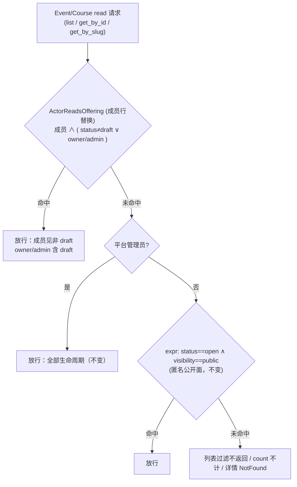

# fix: Event/Course draft 可见性收紧 + 概览页过时文案清理（B4 + C3）

## Goal Capsule

- **Objective**: 关闭审计错位 B4（2046 双重身份 → 草稿全员可见，issue #157）与断链 C3 的文案半边（概览页过时文案，issue #156）。draft 状态的 Event/Course 收紧为 Owner/Admin + 平台管理员可见，普通成员在 web 读面（list / get by id / get by slug / 分页 count）零可见；概览页清理「（切片 E）」等残余措辞并补课程真实入口卡。
- **Authority hierarchy**: D4 已由 product owner 拍板收紧（session-settled: user-directed — chosen over 大厅约定/接受现状: 权限边界由代码保证，不依赖运营纪律）；本拍板 **supersedes #127 的「成员（含普通成员）可见本工作台全部活动（draft/open/closed/cancelled 全生命周期）」验收条款**（合并后在 #127 追加 supersede 评论，非 draft 部分维持）；两分叉已拍板：完全隐藏、文案替换为真实入口（见 Key Decisions）；技术决策由本 plan KTD 承载。
- **Stop conditions**: KTD1 的关系 filter 表达式在 Ash 3 下经首步编译验证不可表达、或需引入新 check 机制时停下报告，不自行降级为 SimpleCheck 方案（get 路径会 404 Owner 的 draft）；不引入第四可见性轴（E-11 已拍板）。
- **Execution profile**: 读路径收紧（policy + 一处 raw SQL 条件）+ 文案清理 + 详情页错误态补齐；无迁移、无数据回填、无 GraphQL schema 形状变化（行为过滤，不改查询面）。
- **Tail ownership**: 合并后关闭 #157（D4 落地说明 + #127 supersede 评论）；#156 关闭评论注明：文案半边本 plan 落地，`/admin/openclacky` 占位页半边**已随 #112（R11，PR #113）交付、非遗留项**（现状为 OpenClacky 入口实页，2026-08-15 复核）；评审中发现的其余 stale 文案按 U2 的全仓扫描结果处置（遗漏项另立 issue）。

## Product Contract

### Summary

两块改动：其一，Event 与 Course 的 draft（未发布）内容在 web 读面对普通成员完全隐藏——列表与详情查询不再返回 draft（完全隐藏，无占位行、无元数据泄露），分页 count 不计 draft，公开匿名面行为不变（仅 open+public）；明确两个**有意例外**：speaker invitation 一次性 token 持有者可读受邀 draft 的卡片元数据（draft 阶段邀请 Speaker 是核心运营流），Owner/Admin + 平台管理员全生命周期可读。其二，web 工作台概览页清理「（切片 E）」等过时措辞、修正收紧后对成员失真的「草稿」字样，并补课程入口卡。

### Problem Frame

审计 B4（issue #157）：全员注册自动成为默认工作台 2046 成员，而 Event/Course 读 policy 的成员分支放行全部生命周期——每条未发布活动/课程对全平台注册用户可见，发布公告提前泄露。E-11（#127）已拍板 visibility 仅 public|workspace 两轴、不引入第四轴，故收紧落在 status 轴：draft 仅管理角色可见。

筹备协作影响（重写自评审修正）：draft 状态不实例化任何 workflow run——教研 run 由 `event.launched` / `course.launched` 信号触发创建（`research_instantiator.ex`）且校验 status=open；Tutor/Volunteer 的任务获取与写入走 launch 后的 WorkflowRun + StepAuthorization / `get_workflow` / `save_step_output` MCP 工具，不依赖 web 侧 draft 列表（`get_workspace_context` 仅返回 workspace + 角色，本就不是任务发现面）。因此收紧 web offering list/get 不影响筹备协作；引擎链路全部 `authorize?: false`（见 Assumptions）。

审计 C3 文案半边（issue #156）：「报名/赞助即将开放」占位卡已在 E-11（commit `3db8b75`）被替换为活动真实链接卡；`/admin/openclacky` 已是 R11 实页（#112 已关）。残余为过时代码注释、「（切片 E）」内部 jargon 外漏、课程无入口卡、工作台列表页头「草稿、开放报名与已结束」措辞在收紧后对普通成员失真。**当前无独立 search/autocomplete 接口**：Event/Course 的 GraphQL 查询面即 list/get/get_by_slug，filter 复用同一 read policy——收紧自动覆盖，无单独搜索面需处理（若未来新增搜索接口，继承同一 policy 为既定约束）。

### Key Decisions

- D4 拍板：收紧 draft 读权限为管理角色可见（Owner/Admin + 平台管理员豁免），supersedes #127 成员可见全生命周期 AC（见 Goal Capsule）。(session-settled: user-directed — chosen over 大厅约定/接受现状) Governs R1, R2, R3。
- draft 对普通成员完全隐藏（列表/详情/count 零返回），不做打码占位。(session-settled: user-directed — chosen over 打码占位行: 零信息泄露，「未发布即不存在」语义) Governs R1。
- 概览页过时文案替换为真实入口（含补课程入口卡），非直接删除。(session-settled: user-directed — chosen over 直接删除: 概览页保留成员导航价值) Governs R5, R6。
- **Speaker token 例外**：`speakerInvitationCard` 公开 token 面允许受邀者读 draft Event 的卡片元数据（title/status 等）——这是「创建 → 邀请 Speaker → 发布」核心流程的依赖（`ensure_event_eligible` 明确允许 draft），收紧该面会打断运营。例外显式化并钉回归测试；无 token 不可达。Governs R1。
- **Sponsorship raw SQL 同步收紧**：`eligible_target` 的 raw SQL 不查 status，普通 sponsor 可凭创建成功/失败差异枚举 draft 存在（draft public event 创建成功 = oracle）——不满足「无元数据泄露」。SQL 补 `status='open'` 条件并入本 plan（一行 WHERE，非另立 issue）。Governs R1。

### Requirements

#### draft 可见性（B4）

- R1. draft 状态的 Event 与 Course 对普通成员（tutor/volunteer/learner/member 任意组合，即不含 owner/admin 的 membership）完全不可见：列表不返回行、按 id/slug 详情返回 NotFound（GraphQL 层为 null + not_found error）、分页 `count` 不计 draft；无占位行、无标题/元数据泄露。跨租户不变量：actor 在工作台 A 为 Owner/Admin、在 B 仅普通成员/非成员时，B 的 draft 同样 NotFound。例外仅两处：speaker 一次性 token 面（Key Decisions 4）、平台管理员豁免（R2）。
- R2. Owner/Admin（纯工作台角色，非平台管理员身份）与平台管理员可读全部生命周期（含 draft），行为与收紧前一致；匿名公开面（status==open 且 visibility==public）行为不变。
- R3. 非 draft 状态（open/closed/cancelled）× visibility 两轴（public/workspace）的成员可见性不变——visibility 轴语义不动（E-11），成员仍可见工作台内全部非 draft offering。

#### 概览页与文案（C3 文案半边）

- R4. **全员可见面**（概览页入口卡、列表页头）不含内部 jargon（「切片 E」「即将开放」）与对普通成员失真的「草稿」字样；管理视角的状态徽章（EventStatusTag 对 Owner/Admin 渲染 draft 标签）**保留不动**——R4 约束的是说明性文案，非状态标签。
- R5. 概览页提供活动与课程两个真实入口卡（课程入口为新增），指向工作台对应列表页，**全员可见无角色门控**；既有活动卡断言行为保持。
- R6. 工作台活动/课程列表页头文案不再依赖「草稿」表述。
- R7. web 三处 + backend 两处「成员可读全部（含 draft）」注释/文档同步更新（KTD5 清单）；验收为提交内容 review，不设运行时断言。

#### 读路径不变量

- R8. 内部链路（workflow Instantiator / Oban worker / 信号订阅者 / 审批标题装配 / Offering.fetch）对 draft 的既有读取零回归。

### Scope Boundaries

非目标（本次不做）：

- Speaker invitation token 面的行为变化（例外保留，见 Key Decisions 4；其 `list_for_event` 的 forbidden/event_not_found 错误差异**修复**见 KTD3——那是泄露，不是例外）。
- visibility 第四轴 / 成员级可见性（E-11 已拍板不引入；本次只动 status 轴）。
- 小程序端改动（discover 只查 open；成员 draft 深链收紧后走既有「活动/课程不存在或不可访问」错误文案，属预期，U3 作现状回归确认）。
- #156 若 U2 全仓扫描发现新的 stale 文案遗漏项：登记 issue，不在本 plan 逐项扩面。

Deferred to Follow-Up Work：

- draft 活动的「预告」机制（打码占位/敬请期待）——已否决，发布节奏需求出现再议。
- 概览页指向公开发现页 /events /courses 的外链卡（本次入口卡指向工作台内列表）。
- events/courses 表的 workspace_id/status 索引（规模小 + 查询先经 workspaceId 收窄，U1 EXPLAIN 核对后视结论再议）。

## Planning Contract

### Key Technical Decisions

- KTD1. 收紧落点为单一新 FilterCheck（`Cgc2046.Policies.ActorReadsOffering`，文件 `backend/lib/cgc_2046/policies/actor_reads_offering.ex`）。**最小可编译 filter 形状**（经 Event/Course 既有的 `belongs_to :workspace` 关系，不必补 has_many）：
  ```
  expr(
    exists(workspace.memberships, membership_id_ref: membership_id_ref) and
    (status != :draft or exists(workspace.memberships.roles, role_name in ^Role.manage_roles()))
  )
  ```
  实际形状以仓库既有 FilterCheck（`actor_is_workspace_member_via.ex`）与 `read_workspace_profile_by_visibility.ex:27-43` 的 exists 用法为骨架拼装；**仓库无 membership→roles 多跳 exists 生产先例**，故实施第一步 = 写出表达式并编译 + 单条 owner/draft 用例真实验证（Ash 官方 policies 文档明确 filter checks 对 list/get 同路径生效：get 被过滤即 NotFound），此步不过再触发 Stop condition。角色唯一真源 `Role.manage_roles/0`（role.ex:38-49）。**跨租户 sentinel 测试是括号错写的唯一兜底**：A 台 Owner 探 B 台 draft 必须 NotFound（wrong-parentheses 变体会放行，测试必红）。替换 event.ex / course.ex read policy 中的成员行；`PlatformAdmin` 与 open+public expr 两行保留原序（成员行 → PlatformAdmin → public）。
- KTD2. 不用「authorize_if(成员) + forbid_if(expr(status == :draft))」顺序组合：forbid 与多条 authorize 的求值顺序语义易错，且 owner/admin 放行与成员 draft 禁止需在同 check 内 AND 表达。`sponsorship.ex:276-279` 的 SimpleCheck+expr 先例不适用于本处——其工作台列表恒带 workspaceId filter，Event/Course get 路径不带。
- KTD3. 测试改写与新增（fixture 关键修正：**现有 event_visibility_test 的 admin = platform_admin + workspace owner 二合一，只能命中 PlatformAdmin bypass，测不到新 FilterCheck 的 owner/admin 分支**——Owner 用例须用 `AccountsFixtures.workspace_with_member/1`（test/support/accounts_fixtures.ex:77-105）的纯 Owner，Admin 用例 register_user + add_member(:admin)）：
  - `event_visibility_test.exs` L82-103「成员读全部」断言反转为 NotFound（`{:error, %{errors: [%Ash.Error.Query.NotFound{}]}}` 形状）；模块 describe 文案同步（成员不再读全部）。
  - 新建 `course_visibility_test.exs` 同构覆盖（**现有 Course anonymous 断言保留/迁移进来**，非从零写）。
  - 表驱动角色组合：member/tutor/volunteer/learner 单角色与两两组合读 draft 均 NotFound；owner/admin 单独命中。
  - GraphQL HTTP 层：member `event(id)` / `course(id)` / `getEventBySlug` draft → null + not_found；**错误同形 sentinel**：member 对 draft id 与随机不存在 id 的顶层错误 code/message 完全同形（FilterCheck 语义是过滤→NotFound；若误写为 Forbidden 类错误即红，防差异泄露）；`listEvents/listCourses { count }` member 不计 draft（count 侧信道钉住）。
  - `speakerInvitationCard`：有效 token 对 draft event 仍返回（例外钉住）；无效 token 不可达。`list_for_event` 对 member+存在 draft event 与随机不存在 id **统一 not_found**（消除枚举 oracle，resolver 映射改一行 + 差异测试）。
  - sponsorship：draft public event `createSponsorship` → sponsorship_not_open（KTD5 收紧的回归）。
  - **Global list sentinel**：`listEvents/listCourses` filter 参数可选，攻击者可省略 workspaceId 做全局列表——member token 无 filter 全局 list 只返回其所属工作台的非 draft（不返回任何跨租户/非成员 draft，open+public 除外）；FilterCheck 关联错写在此面最易泄露。
  - 性能核对：EXPLAIN 一条 member list（workspaceId filter + 新 check），确认走索引计划可接受（不达预期才议索引，见 Deferred）。
- KTD4. web 概览页（`web/app/w/[slug]/page.tsx`）：删过时注释；活动卡子标题去 jargon，改为**中性措辞**（如「浏览工作台活动与报名信息」——全员卡不含「管理」字样，Owner/Admin 的管理能力在列表页/按钮表达，不在全员卡）；新增课程入口卡——复用既有内联 Link 卡结构（icon 圆框 + 标题 + 子标题 + arrow，同 `grid gap-4 sm:grid-cols-2` 网格），指向 `/w/[slug]/courses`，无角色门控；`page.test.tsx` 既有 events 卡断言保持。
- KTD5. 文案与注释同步（扩面清单）：web——`offering-pages.tsx` 页头（约 L173）与文件头注释（L6）、`web/lib/events.ts:35` 注释、`web/lib/graphql/events.ts:13` 注释；backend——`event.ex` policy 注释（成员行描述，约 L510）、`course.ex` 同（约 L475）、`event_visibility_test.exs` 模块 describe。**sponsorship raw SQL 收紧**：`sponsorship.ex:361-377` eligible_target SQL 的 WHERE 补 `AND status = 'open'`（与 `sponsorship_enabled` 并列），消除 draft 创建成功 oracle。
- KTD6. 零迁移、零前端查询改动：存量 draft 不需处理（收紧只影响读路径）；web `LIST_EVENTS`/`LIST_COURSES` 本就无 status filter，后端过滤后成员列表自动少 draft 行；`rbac_contract.json` 七项能力（含 create_workspace）与 Event/Course 读 policy 无耦合（已核实；**无 offering read ability 为刻意设计**——offering 可见性由资源 policy 表达而非能力矩阵，跨端一致性由 KTD3 GraphQL 断言 + U3 e2e 兜住），无需再生成。Governs R3, R8（cross-cutting constraint，无独立 R）。
- KTD7. **详情页错误态补齐**（评审证伪「自动错误态」）：`OfferingDetailPage` 当前 `offering === null` 只渲染永久 skeleton（`offering-pages.tsx:462-468`），后端 NotFound → GraphQL null 不会进 error state。修法：fetchOffering 返回 null 时渲染「该活动/课程不可访问或不存在」错误态（对齐 `public-offering-detail.tsx:123-143` 既有文案与结构），区分 not-found 与网络错误可后置（v1 统一不可访问文案）；error 分支不把 raw GraphQL error message 直接渲染给用户（现 `offering-pages.tsx:186-188,262-272` 直显 e.message，统一为友好文案）；page/component 测试断言错误态文本。

### High-Level Technical Design

收紧后的 Event/Course 读 policy 决策流（policy 行序 = 现状行序，成员行被替换；图中分支为逻辑 OR，非求值顺序）：



### Assumptions（已验证事实）

- 内部链路全走 `authorize?: false`，收紧 policy 不波及：`Offering.fetch/fetch_titles_by_ids`（`backend/lib/cgc_2046/events/offering.ex:40-47, 96-101`）、ResearchInstantiator（`backend/lib/cgc_2046/workflows/research_instantiator.ex`）、LearningInstantiator（`backend/lib/cgc_2046/workflows/learning_instantiator.ex`）、EventLifecycleWorker、Notification/Speaker 订阅者、PendingApprovals 标题装配（`pending_approvals.ex:238-250`）。
- `offeringReadiness` 是全 schema 唯一**显式** `authorize?: true` 的 Offering fetch helper（`graphql_schema.ex:1981-1987`；GraphQL list/get/get_by_slug 本身也是 policy-authorized actor read，措辞以此为准）——它本就是 Owner/Admin 发布前 GO/NO-GO 工具，成员查 draft 变 not_found 可接受；现有 readiness 测试用 platform_admin，无成员用例需改。
- web `GetEvent`/`GetCourse` 仅按 id 查询、无 workspace filter（`web/lib/graphql/events.ts:134/154`）——KTD1 的依据。
- 赞助意向 `eligible_target` 走 raw Repo SQL 不经 Ash policy——但其 draft oracle 由 KTD5 一并收紧（不再是纯零影响面）。
- 小程序 discover 仅 `filter: { status: { eq: "open" } }`（`miniprogram/src/api/operations.ts:3/17`）；event-detail 按 id 无客户端 status 过滤，成员 draft 深链 → 既有「活动/课程不存在或不可访问」错误文案（`miniprogram/src/api/real.ts:113-127`），属预期。
- 「即将开放」占位卡已被 E-11（commit `3db8b75`）替换为活动真实链接卡；`/admin/openclacky` 已是 R11 实页（#112 CLOSED，PR #113）。
- GraphQL KeysetPageOfEvent/Course 公开 `count` 字段——count 经 authorized query 计算，理论不泄露 draft，以 KTD3 回归钉住。
- Event/Course 无 GraphQL 嵌套关系暴露（workspace.events 之类不存在）、无 search/autocomplete 资源——收紧面 = list/get/slug + count，已全覆盖。
- 仓库 exists 先例仅 `read_workspace_profile_by_visibility.ex`（依赖其专属 has_many）与 workspace.ex 单跳——membership→roles 多跳无生产先例，KTD1 首步验证由此而来。

### Risks & Dependencies

- **KTD1 filter 可表达性**（首步验证点，Stop condition 兜底）：多跳 exists 在 Ash 3 expr 支持但仓库无先例；跨租户 sentinel 是错写兜底。
- **plan 015 在途同文件竞态**（`web/components/offering-pages.tsx`：015 U1 挂批次码面板（管理视图），本 plan 改页头文案/注释/错误态（列表页头 + 详情）——同文件多区块，015 先合并则基于最新 develop 实施，冲突机械可解）。
- launch/close/cancel 按钮门控依赖详情可达性：成员拿不到 draft 详情即看不到按钮，收紧后自动收窄，无额外处理。
- sponsorship SQL 收紧对既有测试的影响：若有测试造 draft event 的 sponsorship 成功用例，需同步改 fixture 为 open（实施时跑全套发现）。

## Implementation Units

### U1. 后端 draft 读收紧（Event + Course + sponsorship SQL + speaker 错误统一）

- **Goal**: read policy 收紧——draft 仅 Owner/Admin + 平台管理员可见； sponsorship oracle 与 speaker 错误差异同步消除。
- **Requirements**: R1, R2, R3, R8
- **Dependencies**: 无
- **Files**:
  - `backend/lib/cgc_2046/policies/actor_reads_offering.ex`（新建：FilterCheck）
  - `backend/lib/cgc_2046/events/event.ex`（read policy 成员行替换 + policy 注释同步）
  - `backend/lib/cgc_2046/events/course.ex`（同构 + 注释）
  - `backend/lib/cgc_2046/events/sponsorship.ex`（eligible_target SQL 补 status='open'，约 L361-377）
  - `backend/lib/cgc_2046_web/graphql_schema.ex`（speakerInvitationCard list_for_event 错误映射统一 not_found，约 L148-163）
  - `backend/test/cgc_2046/events/event_visibility_test.exs`（L82-103 反转 + describe 同步 + 表驱动/跨租户/角色组合）
  - `backend/test/cgc_2046/events/course_visibility_test.exs`（新建，迁移既有 anonymous 断言 + 同构覆盖）
  - `backend/test/cgc_2046_web/graphql_offering_draft_visibility_test.exs`（新建：HTTP 层 get/slug/count null+not_found、speaker card 例外、list_for_event 统一错误、sponsorship not_open）
- **Approach**:
  1. **首步验证**（Stop condition 判据）：写 ActorReadsOffering filter 表达式（KTD1 形状）→ 编译 → 单条 owner/draft + member/draft 用例真跑。通过才继续；不过即停报告。
  2. event.ex / course.ex 成员行替换为 ActorReadsOffering；注释同步（KTD5 清单）。
  3. sponsorship SQL 补 status 条件；graphql_schema 错误映射统一。
  4. 测试全套落位（KTD3 清单：反转/新建/表驱动/跨租户 sentinel/HTTP 层/例外钉住/count/sponsorship）。
  5. EXPLAIN 性能核对一条 member list。
- **Patterns to follow**: `actor_is_workspace_member_via.ex`（FilterCheck 骨架）；`read_workspace_profile_by_visibility.ex`（exists 用法）；`accounts_fixtures.ex:77-105`（纯 Owner fixture）；`event_visibility_test.exs`（中文 test 名 + NotFound 形状）。
- **Test scenarios**（KTD3 全清单 + 以下）:
  - 纯 Owner（非平台管理员）读 draft event/course：ok；纯 Admin：ok；平台管理员：ok（bypass 回归）。
  - member/tutor/volunteer/learner 单角色 + 两两组合读 draft：NotFound（表驱动）。
  - 跨租户：A 台 owner，B 台 member → B 台 draft NotFound（sentinel）。
  - 成员读 open×public / open×workspace-only / closed / cancelled：ok（R3 参数化）。
  - `get_event_by_slug` draft + 成员：NotFound；HTTP GraphQL member draft get → null + not_found error。
  - listEvents/listCourses count：member 视角不含 draft。
  - speakerInvitationCard：有效 token + draft event → 返回（例外）；list_for_event member：存在 draft 与不存在 id 同错误（not_found）。
  - createSponsorship 对 draft public event：sponsorship_not_open。
  - 匿名读 open+public：ok；匿名读 draft：不可见（既有断言回归）。
  - 引擎不变量（R8）：instantiator / lifecycle / speaker_flow / readiness 既有套件全绿。
  - EXPLAIN：member list 走可接受计划（记录进 PR）。
- **Verification**: `cd backend && mix format --check-formatted && mix compile --warnings-as-errors && MIX_ENV=test mix test --seed 1 && MIX_ENV=test mix test --seed 2`；`git diff --exit-code -- backend/priv/graphql/schema.graphql`（SDL 零 diff）。

### U2. web 概览页文案 + 课程入口卡 + 详情错误态 + 注释同步

- **Goal**: 概览页过时措辞清零、真实入口覆盖活动与课程、draft 不可达时详情页有明确错误态；页头与注释同步收紧后语义。
- **Requirements**: R4, R5, R6, R7（+ R1 的 web 侧错误态）
- **Dependencies**: 无（与 U1 并行；错误态文案按收紧后语义编写，mock null 即可测，不依赖 U1 合并顺序）
- **Files**:
  - `web/app/w/[slug]/page.tsx`（删过时注释；活动卡子标题中性化；新增课程入口卡）
  - `web/app/w/[slug]/page.test.tsx`（补课程卡 href、jargon 不存在、**member 视角**课程卡断言）
  - `web/components/offering-pages.tsx`（页头文案 + 文件头注释 + **OfferingDetailPage null 错误态**）
  - `web/components/offering-pages.test.tsx`（**新建**：页头不含「草稿」两 kind 断言 + 详情 null 错误态文本——该文件现无组件测试，R6 无运行时锚点，必须新建）
  - `web/lib/events.ts`（注释）
  - `web/lib/graphql/events.ts`（注释）
- **Approach**:
  1. 概览页：删注释；活动卡子标题中性措辞（KTD4，最终措辞从中性语义断言约束而非自由发挥：文案必须含「活动」与「报名」语义、不含「管理」「切片」「草稿」「即将开放」）；课程卡复用既有 Link 卡结构，指向 `/w/[slug]/courses`。
  2. offering-pages：页头去 draft 措辞；OfferingDetailPage：`offering === null && !loading` → 「该活动/课程不可访问或不存在」错误态（对齐 public-offering-detail 既有文案结构）。
  3. 注释同步 KTD5 全清单（web 三处 + backend 两处在 U1 做）。
  4. 测试：page.test 补 member slug 视角课程卡；offering-pages.test 新建（页头 + 错误态）；jargon 断言（/切片 E|即将开放|草稿/ 于全员面）。
- **Patterns to follow**: `public-offering-detail.tsx:123-143`（错误态文案结构）；`page.tsx:168-184`（Link 卡）。
- **Test scenarios**:
  - 概览页（admin 与 member 双视角）：活动卡 + 课程卡均渲染、href 正确、无 jargon。
  - 列表页头（event+course 两 kind）：不含「草稿」。
  - 详情页：mock offering null → 错误态文本渲染（非永久 skeleton）。
  - 既有 events 卡断言保持绿。
- **Verification**: `cd web && pnpm typecheck && pnpm lint && pnpm test && pnpm build`。

### U3. 端到端验证

- **Goal**: 收紧行为链在真实 UI 闭环（结构断言层）。
- **Requirements**: R1, R2, R5
- **Dependencies**: U1, U2（合并前跑）
- **Approach**（可复现步骤）:
  1. dev 环境：`cd backend && mix phx.server` + `cd web && pnpm dev`；psql `cgc_2046_dev` 造数：draft event + draft course + open event（同一 workspace）+ Owner 账号 + 普通成员账号（登录态按 AGENTS.md 备份/恢复 `users.hashed_password` 流程，验证后必须恢复）。
  2. 成员视角：`/w/[slug]/events`、`/w/[slug]/courses` 无 draft 行（queryByText draft 标题不存在）；直连 draft 详情 URL → 「不可访问或不存在」错误态文本；概览页双入口卡 href 断言。
  3. Owner 视角：draft 行存在、详情可开、launch 按钮可见、状态徽章含「草稿」。
  4. 匿名视角：`/events` 无 draft、open+public 正常。
  5. 记录（命令 + 断言输出）粘贴 PR 描述。
- **Verification**: agent-browser 结构断言全过（数值/DOM 断言，不用视觉模型）。

## Verification Contract

- backend: `cd backend && mix format --check-formatted && mix compile --warnings-as-errors && MIX_ENV=test mix test --seed 1 && MIX_ENV=test mix test --seed 2`；SDL 零 diff：`git diff --exit-code -- backend/priv/graphql/schema.graphql`。
- web: `cd web && pnpm typecheck && pnpm lint && pnpm test && pnpm build`。
- e2e: web Dev 服务 + agent-browser 结构断言（AGENTS.md 第 1/2 层），记录进 PR 描述。

## Definition of Done

- R1–R8 全部满足且 KTD3 测试清单绿（含跨租户 sentinel、speaker 例外钉住、count、sponsorship not_open）；backend/web 自查套件全绿（双 seed）；SDL 零 diff；EXPLAIN 结果记录。
- e2e：普通成员在列表与详情直连两条路径均看不到 draft、详情页有明确错误态；Owner/Admin 与匿名公开面行为与收紧前一致；概览页无 jargon、双入口卡就位。
- Tail checklist（合并后执行，不属代码验收）：#157 关闭附 D4 落地说明；#127 追加 supersede 评论；#156 关闭评论注明文案半边落地 + /admin/openclacky 半边已随 #112 交付；worktree 与临时 pane 清理；`git status` 干净。
