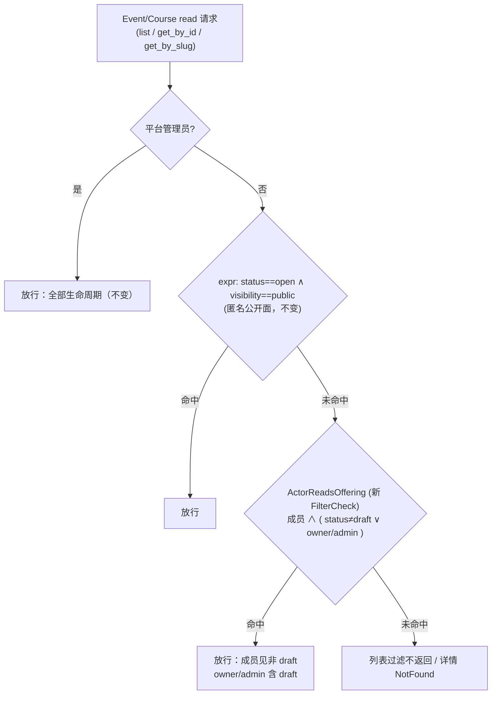

# fix: Event/Course draft 可见性收紧 + 概览页过时文案清理（B4 + C3）

## Goal Capsule

- **Objective**: 关闭审计错位 B4（2046 双重身份 → 草稿全员可见，issue #157）与断链 C3 的文案半边（概览页过时文案，issue #156）。draft 状态的 Event/Course 收紧为 Owner/Admin + 平台管理员可见，普通成员完全隐藏；概览页清理「（切片 E）」等残余措辞并补课程真实入口卡。
- **Authority hierarchy**: D4 已由 product owner 拍板收紧（session-settled: user-directed — chosen over 大厅约定/接受现状: 权限边界由代码保证，不依赖运营纪律）；两分叉已拍板：完全隐藏、文案替换为真实入口（见 Key Decisions）；技术决策由本 plan KTD 承载。
- **Stop conditions**: 若 KTD1 的关系 filter 表达式在 Ash 3 下不可表达或需引入新 check 机制时停下报告，不自行降级为 SimpleCheck 方案（get 路径会 404 Owner 的 draft）；不引入第四可见性轴（E-11 已拍板）；不修 sponsorship eligible_target 的 status 预存缺口（另立 issue）。
- **Execution profile**: 纯读路径收紧 + 文案清理，无迁移、无数据回填、无 GraphQL schema 形状变化（行为过滤，不改查询面）。
- **Tail ownership**: 合并后关闭 #157（D4 落地说明）；#156 关闭时注明文案半边本 plan 落地、/admin/openclacky 半边留 #105（切片G）；研究中发现的 sponsorship eligible_target 不查 status 缺口开新 issue 登记。

## Product Contract

### Summary

两块改动：其一，Event 与 Course 的 draft（未发布）内容仅 Owner/Admin 与平台管理员可读——普通成员的列表与详情查询不再返回 draft（完全隐藏，无占位行、无元数据泄露），公开匿名面行为不变（仅 open+public）；其二，web 工作台概览页清理「（切片 E）」等过时措辞、修正收紧后对成员失真的「草稿」字样，并补课程入口卡，使真实入口覆盖活动与课程两面。

### Problem Frame

审计 B4（issue #157）：全员注册自动成为默认工作台 2046 成员，而 Event/Course 读 policy 的成员分支放行全部生命周期——每条未发布活动/课程对全平台注册用户可见，发布公告提前泄露，且「公开页为什么看不到」造成困惑。E-11（#127）已拍板 visibility 仅 public|workspace 两轴、不引入第四轴，故收紧落在 status 轴：draft 仅管理角色可见。筹备协作不受影响：Tutor/Volunteer 接任务的真源是 OpenClacky 侧 `get_workspace_context`（workflow 步骤授权），不依赖 web 草稿列表；引擎链路已验证全走 `authorize?: false`（见 Assumptions）。

审计 C3 文案半边（issue #156）：「报名/赞助即将开放」占位卡已在 E-11（commit `3db8b75`）被替换为活动真实链接卡，残余为过时代码注释、「（切片 E）」内部 jargon 外漏、课程无入口卡；工作台列表页头「草稿、开放报名与已结束」措辞在收紧后对普通成员失真。#156 的另一半（/admin/openclacky 占位页）按 issue 自身修复方向随 #105 切片G 处理，不在本 plan。

### Key Decisions

- D4 拍板：收紧 draft 读权限为管理角色可见（Owner/Admin + 平台管理员豁免）。(session-settled: user-directed — chosen over 大厅约定/接受现状: 权限边界由代码保证，不依赖运营纪律) Governs R1, R2, R3。
- draft 对普通成员完全隐藏（列表/详情零返回），不做打码占位。(session-settled: user-directed — chosen over 打码占位行: 零信息泄露，「未发布即不存在」语义) Governs R1。
- 概览页过时文案替换为真实入口（含补课程入口卡），非直接删除。(session-settled: user-directed — chosen over 直接删除: 概览页保留成员导航价值) Governs R5, R6。

### Requirements

#### draft 可见性（B4）

- R1. draft 状态的 Event 与 Course 对普通成员（tutor/volunteer/learner/member 任意组合）完全不可见：列表查询不返回行，按 id/slug 详情查询返回 NotFound；无占位行、无标题/元数据泄露。
- R2. Owner/Admin 与平台管理员可读全部生命周期（含 draft），行为与收紧前一致；匿名公开面（status==open 且 visibility==public）行为不变。
- R3. 非 draft 状态（open/closed/cancelled）的成员可见性不变——visibility 轴语义不动（E-11），成员仍可见工作台内全部非 draft offering。

#### 概览页与文案（C3 文案半边）

- R4. 概览页与列表页不含内部 jargon（「切片 E」「即将开放」）与对普通成员失真的「草稿」字样；措辞对管理与非管理成员同时成立。
- R5. 概览页提供活动与课程两个真实入口卡（课程入口为新增），指向工作台对应列表页；既有活动卡断言行为保持。
- R6. 工作台活动/课程列表页头文案不再依赖「草稿」表述。
- R7. web 侧三处「成员可读全部（含 draft）」代码注释同步更新，不误导后续开发。

#### 读路径不变量

- R8. 内部链路（workflow Instantiator / Oban worker / 信号订阅者 / 审批标题装配 / Offering.fetch）对 draft 的既有读取零回归。

### Scope Boundaries

非目标（本次不做）：

- /admin/openclacky 占位页（#156 另一半，随 #105 切片G 平台管理后台交付）。
- B5 平台管理员只读放行业务工作台（独立错位项，#154 系）。
- visibility 第四轴 / 成员级可见性（E-11 已拍板不引入；本次只动 status 轴）。
- sponsorship `eligible_target` 不查 status=open 的预存缺口（研究中发现，raw SQL 不经 Ash policy；合并后开 issue 登记，不在本 plan 扩面）。
- 小程序端改动（discover 只查 open；成员 draft 深链收紧后 404 属预期，U3 回归确认即可）。

Deferred to Follow-Up Work：

- draft 活动的「预告」机制（打码占位/敬请期待）——本次已否决，发布节奏需求出现再议。
- 概览页指向公开发现页 /events /courses 的外链卡（本次入口卡指向工作台内列表；公开页入口已有全局导航）。

## Planning Contract

### Key Technical Decisions

- KTD1. 收紧落点为单一新 FilterCheck（建议名 `Cgc2046.Policies.ActorReadsOffering`，文件 `backend/lib/cgc_2046/policies/actor_reads_offering.ex`）：filter = actor 在目标记录 workspace 的 membership 存在 ∧（status != :draft ∨ 该 membership 含 owner/admin 角色），替换 event.ex / course.ex read policy 中的成员行；`PlatformAdmin` 与 open+public expr 两行保留原序。理由：owner/admin 判定必须对 `get_by_id`（web `GetEvent`/`GetCourse` 仅按 id 查询、无 workspace filter）同样生效——`WorkspaceActorIsOwnerOrAdmin` 是 SimpleCheck，从 filter/tenant 解析工作台，get 路径解析不到会误拒 Owner 的 draft 详情；FilterCheck 的关系 filter 对 list/get 同路径且 SQL 下推（先例 `actor_is_workspace_member_via.ex`）。
- KTD2. 不用「authorize_if(成员) + forbid_if(expr(status == :draft))」顺序组合：forbid 与多条 authorize 的求值顺序语义易错，且 owner/admin 放行与成员 draft 禁止需在同 check 内 AND 表达。`sponsorship.ex:276-279` 的 SimpleCheck+expr 先例不适用于本处——其工作台列表恒带 workspaceId filter，Event/Course get 路径不带。
- KTD3. 测试改写：`backend/test/cgc_2046/events/event_visibility_test.exs` L82-103「成员读全部 status/visibility」断言反转为 NotFound（沿用 `{:error, %{errors: [%Ash.Error.Query.NotFound{}]}}` 形状）；Course 当前无独立可见性测试，新建 `course_visibility_test.exs` 同构覆盖。`graphql_public_offering_test.exs` L101（成员读 workspace-only open）是匿名面/成员面回归锚点，不改语义。
- KTD4. web 概览页（`web/app/w/[slug]/page.tsx`）：删除 L146-147 过时注释（「即将开放」角标描述）；活动卡子标题去「（切片 E）」与「草稿」字样，改为对管理与非管理成员同时成立的措辞；新增课程入口卡——复用既有内联 Link 卡结构（icon 圆框 + 标题 + 子标题 + arrow，同一 `grid gap-4 sm:grid-cols-2` 网格），指向 `/w/[slug]/courses`；`page.test.tsx:285-294` 既有 events 卡断言（`getByRole("link", { name: /活动/ })`、`queryByText("报名 / 赞助")` 为 null）保持可匹配。
- KTD5. 文案与注释同步：`web/components/offering-pages.tsx:173` 页头「本工作台的全部活动：草稿、开放报名与已结束」改为不依赖 draft 的措辞；三处「成员可读全部（含 draft）」注释同步（`web/lib/events.ts:35`、`web/lib/graphql/events.ts:13`、`web/components/offering-pages.tsx:6`）。
- KTD6. 零迁移、零前端查询改动：存量 draft 不需处理（收紧只影响读路径）；web `LIST_EVENTS`/`LIST_COURSES` 本就无 status filter，后端过滤后成员列表自动少 draft 行；`rbac_contract.json` 六能力与 Event/Course 读 policy 无耦合，无需再生成。

### High-Level Technical Design

收紧后的 Event/Course 读 policy 决策流（两资源同构，`ActorReadsOffering` 为新增 check）：

### Assumptions（已验证事实）

- 内部链路全走 `authorize?: false`，收紧 policy 不波及：`Offering.fetch/fetch_titles_by_ids`（`backend/lib/cgc_2046/events/offering.ex:40-47, 96-101`）、ResearchInstantiator（`backend/workflows/research_instantiator.ex:151, 167, 191-193`）、LearningInstantiator（`learning_instantiator.ex:142, 158-166`）、EventLifecycleWorker（L48, 61-62）、Notification/Speaker 订阅者、PendingApprovals 标题装配（`pending_approvals.ex:238-250`）。
- `offeringReadiness` 是全 schema 唯一 actor 感知（authorize?: true）的 Event/Course 读（`graphql_schema.ex:1981-1987`）——它本就是 Owner/Admin 发布前 GO/NO-GO 工具，成员查 draft 变 not_found 可接受；若有测试用成员查 readiness 需同步修正。
- web `GetEvent`/`GetCourse` 仅按 id 查询、无 workspace filter（`web/lib/graphql/events.ts:134/154`）——KTD1 的依据。
- 赞助意向 `eligible_target` 走 raw Repo SQL 不经 Ash policy，收紧零影响。
- 小程序 discover 仅 `filter: { status: { eq: "open" } }`（`miniprogram/src/api/operations.ts:3/17`）；event-detail 按 id 无客户端 status 过滤，成员 draft 深链收紧后 404 → PageState error，属预期。
- 「即将开放」占位卡已被 E-11（commit `3db8b75`）替换为活动真实链接卡（`web/app/w/[slug]/page.tsx:168-184`）——C3 残余即 KTD4/KTD5 所列。

### Risks & Dependencies

- **KTD1 filter 复杂度**：membership → membership_roles → roles 的关系 filter（含 `exists`）在 Ash 3 expr 下的可表达性需实施首步验证；回退方案为 get 路径由 web 详情查询补 workspaceId filter 并采用 sponsorship 式 SimpleCheck 分支（列表本就带 filter）——回退会多改 web 查询，故先试单 FilterCheck。
- **plan 015 在途同文件竞态**（`web/components/offering-pages.tsx`：015 U1 挂批次码面板，本 plan 改页头文案与注释——同文件不同区块，可自动合并）；015 先合并则基于最新 develop 实施。
- launch/close/cancel 按钮门控（`allowedTransitions` + `canManageEvents`）依赖详情可达性：成员拿不到 draft 详情（404）即看不到按钮，收紧后该门控面自动收窄，无额外处理。

## Implementation Units

### U1. 后端 draft 读收紧（Event + Course）

- **Goal**: Event/Course read policy 收紧——draft 仅 Owner/Admin + 平台管理员可见，成员完全隐藏。
- **Requirements**: R1, R2, R3, R8
- **Dependencies**: 无
- **Files**:
  - `backend/lib/cgc_2046/policies/actor_reads_offering.ex`（新建：FilterCheck）
  - `backend/lib/cgc_2046/events/event.ex`（read policy 成员行替换，policies block 约 L509-523）
  - `backend/lib/cgc_2046/events/course.ex`（同构，约 L474-488）
  - `backend/test/cgc_2046/events/event_visibility_test.exs`（L82-103 反转 + 补例）
  - `backend/test/cgc_2046/events/course_visibility_test.exs`（新建：Course 同构覆盖）
- **Approach**:
  1. 新建 `ActorReadsOffering` FilterCheck：filter = actor 在记录 workspace 的 membership 存在 ∧（`status != :draft` ∨ 该 membership 含 owner/admin 角色）；骨架参照 `actor_is_workspace_member_via.ex`（含钉测惯例）。
  2. event.ex / course.ex 的 `policy action_type(:read)`：成员行（`ActorIsWorkspaceMemberVia`）替换为 `ActorReadsOffering`；`PlatformAdmin`、open+public expr 两行保留原序不动。
  3. 实施首步先写 filter 表达式并跑一条 draft 用例验证（Risks 回退判断点）。
  4. event_visibility_test 改写 + course_visibility_test 新建（KTD3）。
- **Patterns to follow**: `backend/lib/cgc_2046/policies/actor_is_workspace_member_via.ex`（FilterCheck 骨架与 filter 形状）；`backend/test/cgc_2046/events/event_visibility_test.exs`（中文 test 名 + Fixtures/EventFixtures helper + NotFound 形状）。
- **Test scenarios**:
  - 成员读 draft event：列表不含、`reload/get` 返回 NotFound（原有 L99 断言反转）。
  - 成员读 draft course：同上（新文件同构）。
  - Owner 读 draft event/course：ok；Admin 同；非成员平台管理员：ok（治理读豁免回归）。
  - 成员读 open + workspace-only：ok（回归锚点，对齐 `graphql_public_offering_test.exs:101` 语义）。
  - 成员读 closed/cancelled：ok（R3 回归）。
  - 成员多角色（member + tutor）读 draft：NotFound（权限并集不含 owner/admin）。
  - `get_event_by_slug` draft + 成员：NotFound。
  - 匿名读 open+public：ok；匿名读 draft：不可见（既有断言回归）。
  - offeringReadiness：Owner 查 draft event：ok；若有成员查 draft readiness 的既有用例，改用 Owner actor。
  - 引擎不变量（R8）：既有 instantiator / lifecycle / speaker_flow / readiness 测试套件全绿，无一处因收紧红。
- **Verification**: `cd backend && mix format --check-formatted && mix compile --warnings-as-errors && MIX_ENV=test mix test`（×2 seeds）；`backend/priv/graphql/schema.graphql` 无 diff（行为过滤不改 schema 形状）。

### U2. web 概览页文案 + 课程入口卡 + 注释同步

- **Goal**: 概览页过时措辞清零、真实入口覆盖活动与课程；列表页头与注释同步收紧后语义。
- **Requirements**: R4, R5, R6, R7
- **Dependencies**: 无（与 U1 并行；文案措辞按收紧后语义编写，不依赖 U1 合并顺序）
- **Files**:
  - `web/app/w/[slug]/page.tsx`（删 L146-147 注释；活动卡子标题改写；新增课程入口卡）
  - `web/app/w/[slug]/page.test.tsx`（补课程卡与文案断言，保持既有 events 断言）
  - `web/components/offering-pages.tsx`（页头文案 L173 + 文件头注释 L6）
  - `web/lib/events.ts`（L35 注释）
  - `web/lib/graphql/events.ts`（L13 注释）
- **Approach**:
  1. 概览页：删除「即将开放角标」过时注释；活动卡子标题改为不列「草稿」、不含「（切片 E）」的措辞（如「浏览与管理活动：报名、嘉宾与赞助」，最终措辞实施时定）；同一网格新增课程入口卡（复用既有 Link 卡结构与 Icon，指向 `/w/[slug]/courses`，子标题同风格）。
  2. offering-pages：页头改为「本工作台的全部活动」类不依赖 draft 的措辞；同步三处「成员可读全部（含 draft）」注释为收紧后语义（KTD5 清单）。
  3. page.test：保留 `getByRole("link", { name: /活动/ })` 与 `queryByText("报名 / 赞助")` null 断言；新增课程卡 href 断言与 jargon 不存在断言。
- **Patterns to follow**: `web/app/w/[slug]/page.tsx:168-184`（既有内联 Link 卡结构）；`web/components/workspace-ui.tsx`（InfoCard/Icon 复用）。
- **Test scenarios**:
  - 概览页渲染活动卡（既有断言保持绿）与课程卡（link href 指向 `/w/[slug]/courses`）。
  - `queryByText(/切片 E/)` 与 `queryByText(/即将开放/)` 为 null。
  - 活动卡子标题与列表页头均不含「草稿」字样。
  - 课程卡无角色门控（全员可见，与活动卡一致）。
  - 注释同步无行为断言（R4 文案断言已覆盖）。
- **Verification**: `cd web && pnpm typecheck && pnpm lint && pnpm test && pnpm build`。

### U3. 端到端验证

- **Goal**: 收紧行为链在真实 UI 闭环（结构断言层）。
- **Requirements**: R1, R2, R5
- **Dependencies**: U1, U2
- **Files**:
  - e2e 操作按 web 仓库 agent-browser 惯例（AGENTS.md 分层第 1/2 层）
- **Approach**:
  1. dev 环境造 draft 活动 + draft 课程 + Owner 与普通成员账号（种子或 psql 夹具，不改生产数据）。
  2. 成员视角：`/w/[slug]/events`、`/w/[slug]/courses` 无 draft 行（queryByText 断言 draft 标题不存在）；直连 draft 详情 URL → 错误态；概览页活动/课程双入口卡 href 断言。
  3. Owner 视角：draft 行存在、详情可开、launch 按钮可见。
  4. 匿名视角：`/events` 无 draft、open+public 正常。
- **Test scenarios**:
  - e2e 结构断言全过（数值/DOM 断言优先，不用视觉模型）。
- **Verification**: agent-browser e2e 记录通过。

## Verification Contract

- backend: `cd backend && mix format --check-formatted && mix compile --warnings-as-errors && MIX_ENV=test mix test`（×2 seeds）。
- web: `cd web && pnpm typecheck && pnpm lint && pnpm test && pnpm build`。
- e2e: web Dev 服务 + agent-browser 结构断言（AGENTS.md 第 1/2 层）。

## Definition of Done

- R1–R8 全部满足且对应测试场景绿；backend/web 自查套件全绿（×2 seeds）。
- e2e：普通成员在列表与详情直连两条路径均看不到 draft；Owner/Admin 与匿名公开面行为与收紧前一致。
- 概览页无内部 jargon，活动与课程双入口卡就位；列表页头与注释为收紧后语义。
- PR 合并进 develop；#157 以 D4 落地说明关闭；#156 关闭评论注明文案半边本 plan 落地、/admin/openclacky 半边留 #105；sponsorship eligible_target status 缺口已开新 issue。
- 无残留实验代码；`git status` 干净；worktree 与临时 pane 清理。
