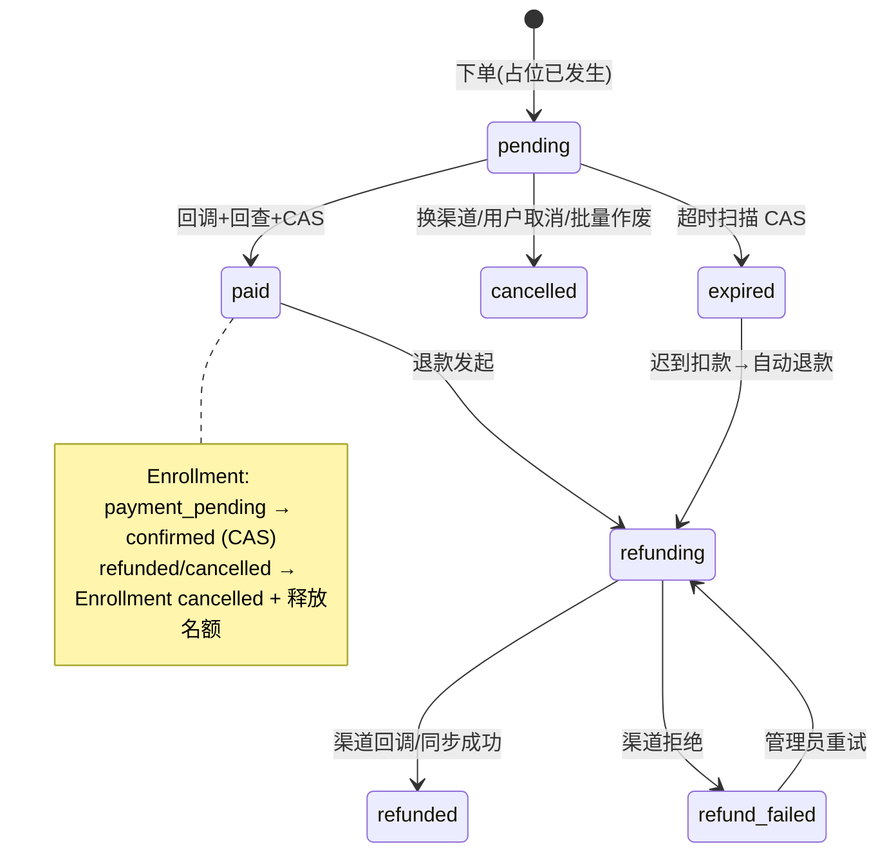
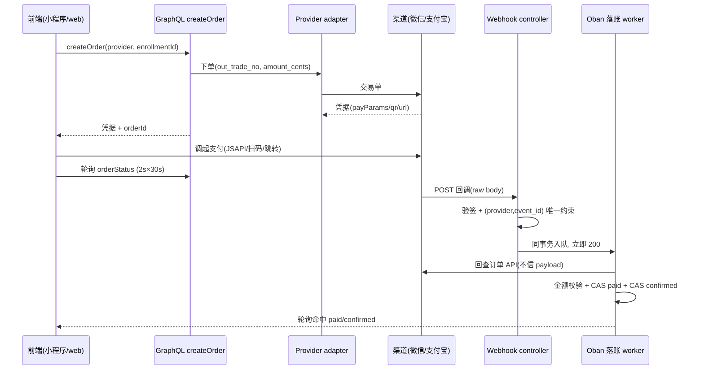
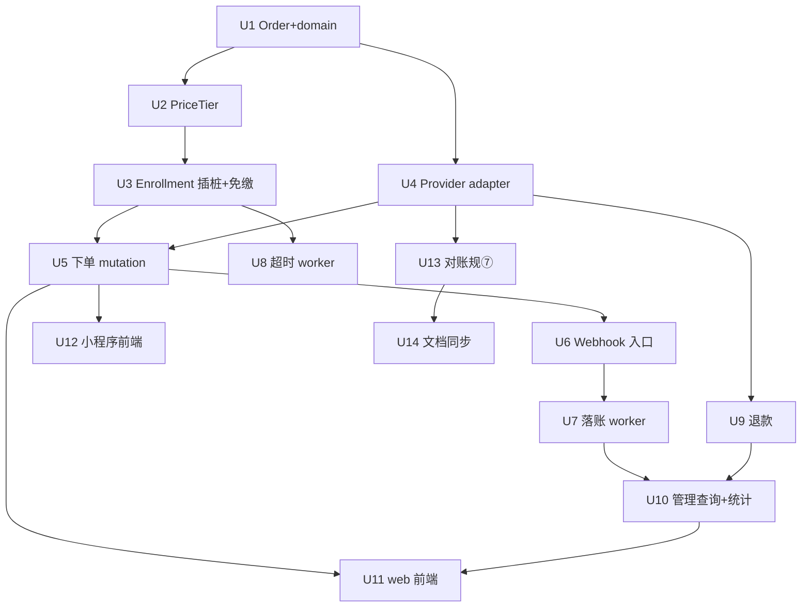

# 缴费闭环:PriceTier 定价、Order 限时支付、双渠道收款与线上退款 - Plan

## Goal Capsule

- **目标**:按 #172 spec 实现缴费闭环——PriceTier 定价、报名占位限时支付(Order 2h)、微信/支付宝双渠道四 provider 收款、线上全额退款(退款即取消)、对账规⑦。三端交付:backend / web / miniprogram。
- **权威层级**:ADR-0007(`docs/adr/0007-payment-architecture.md`)> #172 spec > CONTEXT.md 词条(PriceTier / Order / 管理员免缴)> 本计划 KTD。冲突时高层胜出;发现冲突即停并上报,不静默改写。
- **停止条件**:全部 R 满足、验证契约通过、免费报名路径行为零变化、文档同步完成。遇到「渠道 API 与 SDK 能力不符」或「ADR-0007 不变量无法在实现中维持」时停止上报。
- **执行画像**:14 个实施单元,依赖序 U1→U4 打底,U5-U9 资金主链,U10-U12 前端与治理面,U13-U14 对账与文档。每层可独立验收。
- **尾部归属**:`ce-work` 或 goal 执行器;收尾含真实小额支付人工验收(自动化覆盖不到渠道签名/证书)。

---

## Product Contract

### Summary

Event/Course 增加可选收费配置(PriceTier 档位制)。收费活动报名时原子占名额、生成限时订单(2 小时),小程序内微信 JSAPI 调起,web 端微信 Native 扫码或支付宝跳转;支付回调落账后报名最终确认,超时未付自动释放名额。管理员可单笔/批量发起原路全额退款(退款即取消报名),可对个案免缴。全部资金经平台统一商户号,夜间对账差异进对账报告。免费(不配置定价)仍是默认,现有免费报名路径行为完全不变。

### Problem Frame

报名闭环已上线(三种策略、原子占位、审批、容量),但无缴费能力。社区组织者只能线下收款:确认与收款脱节、未付占位无法量化、退款全靠手动操作渠道、无平台记录可对账。平台已具备微信支付+支付宝商户资质(单主体)。

### Requirements

**定价配置**

- R1. Event/Course 支持嵌入式价格档位配置:id / name / amount_cents / available_until;金额下限 1 分,无 0 元档。
- R2. 报名面只展示未过 `available_until` 的档位;全部过期且收费开启时报名被拒并给出明确错误。
- R3. 订单持下单时档位快照(tier_snapshot + amount_cents),改价/删档不追溯已生成订单。
- R4. `pricing_enabled: false`(默认)时报名路径与现状完全一致,零行为变化。

**报名与支付**

- R5. 收费活动报名先原子占名额(`confirmed_count` 机制不变),Enrollment 进入 `payment_pending` 并创建 pending 订单。
- R6. 订单截止 = min(下单 + 2h, registration_deadline);订单持 out_trade_no(平台生成全局唯一)。
- R7. 支付回调经验签、幂等、回查渠道、金额校验后 Order → paid、Enrollment → confirmed,并发支付成功通知与 `order.paid` 信号。
- R8. 超时未付:订单 expired、报名 expired、名额释放,可重新报名。
- R9. 订单过期后渠道侧迟到扣款 → 自动原路全额退款并记录。
- R10. 审批制(request)收费活动:审批通过后才占位并进入支付;invite_only 收费活动:报名时校验邀请码并扣批次配额,然后进入支付。
- R11. 换渠道:旧 pending 订单 cancelled + 新订单(新 out_trade_no);一个 Enrollment 至多一个非终态订单(部分唯一索引 DB 强制)。
- R12. 用户可取消 `payment_pending` 报名:报名 cancelled、pending 订单作废、名额释放。
- R13. 四渠道支付凭据:小程序 wechat_jsapi(JSAPI 调起参数)、web wechat_native(二维码链接)、alipay_page(电脑跳转)、alipay_wap(手机跳转)。
- R14. 前端支付后轮询自家订单状态(约 2s × 30s),不实时外呼渠道查单。

**退款与免缴**

- R15. Workspace Owner/Admin 可对 paid 订单发起全额原路退款;Event cancelled 触发批量退款全部已支付订单;closed 后单笔仍可退。
- R16. 退款成功 → 订单 refunded、报名 cancelled、名额释放(退款即取消,ADR-0007)。
- R17. 渠道退款异步差异在 adapter 内吸收,业务面统一 refunding → refunded / refund_failed;refund_failed 可重试。
- R18. 管理员免缴:`payment_pending` 报名直接置 confirmed,不建订单,审计留痕,权限面同审批。
- R19. 平台 Admin 持退款兜底权(资金主体),跨租户订单只读。

**治理与可靠性**

- R20. 金额一律分(integer);回调金额 ≠ 订单金额 → 拒绝落账 + 告警。
- R21. 回调幂等:webhook 事件表 (provider, event_id) 唯一约束,重复投递恰好一次落账。
- R22. 支付成功 → 报名人;退款结果(成功/失败)→ 报名人 + 发起管理员;经 NotificationFanout。
- R23. 夜间对账规⑦:拉渠道账单核对 paid 订单,差异(渠道有我无 / 我有渠道无 / 金额不符 / 长期 pending)落 Reconciliation Finding。
- R24. 平台 Admin 跨租户只读浏览全部订单;Owner 可看收费活动收款统计(已收/待收/已退)。

### Key Decisions

- **平台统一商户号**(session-settled: user-directed — chosen over per-workspace 商户号配置: 分会多非独立法人,平台集中配置与合规责任)— ADR-0007。Governs R13, R15, R19。
- **占位 → 限时支付**(session-settled: user-directed — chosen over 支付成功才占位: 避免付款瞬间名额被抢的被动退款)— ADR-0007。Governs R5, R6, R8, R9。
- **退款即取消报名**(session-settled: user-approved — chosen over 仅退钱保留报名: 杜绝退钱占坑的名额泄漏)— ADR-0007。Governs R16。
- **档位制 + 下单快照 + 无 0 元档**(session-settled: user-directed — chosen over 统一价 + 0 元档: 快照杜绝纠纷,免费场景走整场免费或免缴)— Governs R1, R2, R3。
- **线上全额退款,v1 无部分退款/用户自助**(session-settled: user-directed — chosen over 线下退款登记: 原路退回体验与批量退款是社区运营刚需)— Governs R15, R17。
- **管理员免缴为个案免费唯一入口**(session-settled: user-approved — chosen over 按角色免缴配置: 复用权限面,不引入配置面)— Governs R18。

### Actors

- A1 报名者(Learner):选档、支付、轮询、取消、收通知。
- A2 Workspace Owner/Admin:定价配置、审批、退款、免缴、统计。
- A3 平台 Admin:跨租户只读 + 退款兜底。
- A4 支付渠道(微信/支付宝):下单、回调、退款回调、对账单。

### Key Flows

- F1 支付主链(收费 open 活动)
  - **Trigger**: 报名者提交报名(选档)
  - **Actors**: A1, A4
  - **Steps**: 占位 → payment_pending + pending 订单 → 渠道下单 → 前端凭据调起 → 渠道回调 → 验签/幂等/回查/金额校验 → paid → confirmed → 通知+信号 → 前端轮询见 confirmed。
  - **Covered by**: R5, R6, R7, R13, R14, R20, R21, R22
- F2 超时链
  - **Trigger**: 订单 expire_at 到点未付
  - **Actors**: 系统扫描 worker
  - **Steps**: 扫描 → CAS 订单 pending→expired → 报名 expired → 释放名额;迟到扣款回调发现 expired → 自动退款。
  - **Covered by**: R8, R9
- F3 退款链
  - **Trigger**: 管理员单笔 / Event cancelled 批量
  - **Actors**: A2 / A3, A4
  - **Steps**: refund action → refunding → 渠道退款 API → 回调/同步结果 → refunded + 报名 cancelled + 释放名额 + 通知;失败 → refund_failed 可重试。
  - **Covered by**: R15, R16, R17, R22

- AE1. **Given** capacity=1 收费 open 活动 **When** 甲报名并支付成功 **Then** 甲 confirmed 且 capacity_seq=1;乙随后报名 → capacity 错误。Covers R5, R7。
- AE2. **Given** 甲的订单已 expired(超时) **When** 渠道迟到扣款回调到达 **Then** 订单不落 paid,自动进入退款链,名额保持已释放。Covers R9。
- AE3. **Given** 甲 payment_pending **When** 管理员免缴且支付回调同秒到达 **Then** 恰好一方成功:免缴先落 → 回调触发自动退款;回调先落 → 免缴 action 被状态守卫拒绝。Covers R7, R18, R21。
- AE4. **Given** 同一报名已有 pending 订单 **When** 换渠道开新单 **When** 并发双开 **Then** 旧单 cancelled + 新单唯一,部分唯一索引兜底。Covers R11。
- AE5. **Given** 免费活动(未配置定价) **When** 全流程回归 **Then** 行为与本计划实施前完全一致。Covers R4。

### Success Criteria

- `mix precommit` 全绿(compile --warnings-as-errors + deps.unlock --unused + format + test);三端既有测试零回归。
- 依赖门禁通过:`mix cgc2046.check_licenses` + 三端 `pnpm check:licenses`(wechat_sdk / alipay_sdk 均 Apache-2.0)。
- 真实小额人工验收一次(上线前,渠道沙箱不可靠)。

### Scope Boundaries

**不做(继承 #172 Out of Scope)**:部分退款、退款审批流、用户自助退款、档位限量、优惠码、定金/分期、开票、赞助收款、自动分账、per-workspace 商户号、缴费进 MCP 工具集/确认流、支付过半提醒、Course 分期续费。

**Deferred to Follow-Up Work**

- 领域模型定稿.md §5.2 ER 与 diagrams 状态机图同步 → 本计划 U14(在 scope 内,单列)。
- 支付宝沙箱真联通调(视账号可得性);微信侧以 mock 为主。
- 渠道账单下载权限开通后的真实拉单联调(规⑦ 解析逻辑先以本地样例文件交付)。

### Open Questions

无阻塞项。非阻塞默认假设见 Planning Contract「Assumptions」,实施中若推翻任一假设,在单元内记录决策并继续。

---

## Planning Contract

### Key Technical Decisions

- KTD1. **Payments 为第三个 Ash domain**:新建 `Cgc2046.Payments`(`use Ash.Domain`,authorize?: true 同 Api 纪律),`graphql_schema.ex` 的 `use AshGraphql, domains:` 列表加一项。Order 挂 Payments,WebhookEvent 挂 Payments(内部资源不进 GraphQL)。先例:Api / GlobalApi 双 domain 结构。
- KTD2. **Order 状态迁移全部走 DB 级 CAS**(session-settled: user-approved — chosen over 应用层状态守卫: 并发竞态是资金安全主战场,DB 条件 UPDATE 是 repo 既有纪律):claim_pending / status_transition 同款条件 UPDATE,num_rows=0 即竞态拒绝;所有迁移 action 的 before_action 内完成。参照 `events/enrollment.ex` prepare_* 家族与 `events/sponsorship.ex` 独占位守卫。
- KTD3. **Payments.Provider behaviour 隔离两 SDK**(session-settled: user-approved — chosen over 直接 mock SDK 层: 微信/支付宝接口形状不同,mock 三组调用要写两套,adapter + fake 测试面更小):callback 契约 = 下单(返回凭据)/ 查单 / 退款 / 验签 / 对账单拉取;`WechatPay.Provider` / `Alipay.Provider` 实现;测试注入 FakeProvider。SDK 依赖:wechat_sdk(公众号+支付 APIv3,复用现有小程序登录同库)、alipay_sdk。
- KTD4. **Webhook 入口**:endpoint.ex 全局 `Plug.Parsers` 加 caching body_reader(缓存 raw body 到 conn.private,不改解析行为;选全局而非路由级,因为 endpoint 层 Parsers 先于 router 解析 JSON,路由级方案需绕过全局 Parsers,复杂度更高;代价 = 每请求一份 body 内存,可接受);新 `:webhooks` pipeline + `POST /api/payments/webhooks/:provider` controller(不过 `:graphql`,无 actor);controller 只做验签 → webhook 事件表 upsert(唯一约束)→ 同事务入队 Oban → 立即 200。渠道回调不可走 GraphQL(#172 已定 seam)。
- KTD5. **payment_expiry_worker 复刻 ApprovalExpiryWorker 模式**:@expiry_specs 声明式规格(Order pending + expire_at 列 < now,SQL 下推)、per-record `:expire` 领域 action、unique period 与 cron 周期对齐(分钟级)、单记录失败 warning 跳过。
- KTD6. **Enrollment 插桩点清单**:status 枚举 + `payment_pending`;两个部分唯一索引 where 子句扩 `payment_pending`;`cancel` 适用状态扩 `payment_pending` **且显式释放名额**(现 prepare_cancel 只认 confirmed——payment_pending 占位发生在创建时,释放路径必须补);expire 路径由 payment worker 驱动订单+报名联动;审批制收费:`prepare_confirm` 分叉为收费目标 → payment_pending(占位此时发生)而非直接 confirmed。
- KTD7. **渠道密钥配置同 SendCloud 模式**:runtime.exs 环境变量块(微信 mchid/serial/private_key/apiv3_key/appid;支付宝 appid/private_key/public_key);dev.exs/test.exs 占位;不进 git。
- KTD8. **通知走 NotificationFanout**:deliver(recipients, template_key, data, job_meta, unique 预设);新增模板键:支付成功 / 退款成功 / 退款失败;不做过半提醒(#172 拍板)。
- KTD9. **GraphQL 契约**:Event/Course 查询加 `pricingEnabled` / `priceTiers`(已过滤过期);`createEnrollment` 加 tierId 参数(收费时必填);新 mutation:createOrder(provider)/cancelOrder/refundOrder/waivePayment;新查询:myOrders、orderStatus(轮询轻量)、workspacePaymentStats。SDL 由 ash_graphql auto_generate 产出,小程序 codegen 消费。
- KTD10. **前端支付确认统一轮询自家订单状态**:小程序 `Taro.requestPayment` 消费 JSAPI 参数;web 微信 Native 渲染二维码、支付宝 window 跳转;两端轮询 2s × 30s 后转手动刷新态。
- KTD11. **对账规⑦ 进 ReconciliationScanWorker**:新增 nightly Oban job(或 worker 内分支),拉 T+1 账单经 Provider behaviour;差异 upsert Finding(唯一键 rule="payment_recon"),复用刷新语义;账单拉取失败告警不阻塞。
- KTD12. **免缴与回调竞态的落账规则**:回调 worker 先 CAS 订单 pending→paid,再 CAS 报名 payment_pending→confirmed;报名 CAS 失败时查现状——已 confirmed(被免缴)→ 已收金额自动退款;已 expired/cancelled → 迟到退款。两条路径共用「收款但无对应占位 → 退款」不变量。

### High-Level Technical Design

**Order 状态机**(与 Enrollment 联动):

**回调链时序**:

**单元依赖**:

### Assumptions

(来自流程序缺口分析,全部可实施中推翻并记录)

- invite_only × 收费顺序:报名时校验邀请码并扣批次配额,然后占位 + payment_pending;支付超时释放名额但**不退批次配额**;重报名校验同一邀请码,配额按「同一用户同一批次仅消费一次」幂等判定,不二次扣减。
- 批量退款(Event cancelled):paid → refunding 逐笔;pending 订单直接 cancelled 并释放名额;expired/cancelled/refunding 跳过。
- 回调 worker 的报名 CAS 失败分支按 KTD12 处理;`rejected/expired` 报名的迟到收款同样走自动退款。
- 通知失败不影响资金状态(best-effort,现有体系语义)。
- 对账差异 v1 全部人工处置( Finding 报告),不自动动账。
- GraphQL 订单查询 tenant 派生同 createEnrollment 先例(从 enrollment/workspace 派生,不信任入参);平台 Admin 跨租户读走 PlatformAdmin policy 放行。

### System-Wide Impact

- **endpoint 全局 Parsers 变更**:body_reader 缓存对所有请求生效(仅缓存,零行为变化);需回归现有 GraphQL/MCP 测试。
- **Enrollment 状态机扩展**:所有消费 status 的下游(PendingApprovals / 通知 / 学习实例化 / 对账规①②)需核对 `payment_pending` 语义——规②「pending 无 approval_deadline」扫描需排除或覆盖 payment_pending(实施时以 pending 含 payment_pending 的 UNION 语义核对)。
- **新依赖两枚**:wechat_sdk 引入 tesla/finch(与现有 req 并存);license 门禁必须先行。
- **多租户**:Order 为租户资源(attribute 策略,global? true 同 Enrollment,回调链无 actor 内部操作带 tenant)。

### Risks & Dependencies

- alipay_sdk 2024-07 后未更新:验签/退款实现需人工 review,adapter 隔离使其成为局部风险。缓解:FakeProvider 契约测试 + 真实小额验收。
- 微信沙箱不可靠:以 mock 为主(已定);真实验收依赖商户号+小程序 AppID 绑定(已有资质)。
- 账单下载权限:规⑦ 真实拉单依赖商户后台开通;缺权限时按「解析逻辑 + 本地样例」交付(scope 已声明)。
- 名额吊死窗口:payment_pending 最长 2h,热门活动周转率下降——ADR-0007 已接受。
- Oban unique 是建议性去重:webhook 幂等以 DB 唯一约束为准(调研结论,KTD4)。

### Sources & Research

- 外部调研(本会话,Ash manual actions 模式 / transactional inbox + Oban webhook 幂等 / wechat_sdk + alipay_sdk 选型)→ 落 ADR-0007 与 #172;load-bearing。
- Repo 模式:`backend/lib/cgc_2046/events/enrollment.ex`(prepare_* CAS 家族)、`events/sponsorship.ex`(两段式+独占位守卫)、`events/sponsorship_tier.ex`(嵌入式档位校验)、`workers/approval_expiry_worker.ex`(@expiry_specs)、`lib/cgc_2046/api.ex` + `cgc_2046_web/graphql_schema.ex`(domain 接入)、`config/runtime.exs`(SendCloud 密钥模式)、`web/src/app/`(Next.js app router)、`miniprogram/src/pages/`(Taro 页面族)。
- 两个研究 subagent 因后端配额失败,模式与缺口分析由主会话 in-thread 完成(独立验证缺失,置信见验证契约)。

---

## Implementation Units

### Unit Index

| U-ID | 标题 | 主要文件 | 依赖 |
|---|---|---|---|
| U1 | Payments domain + Order 资源 + 迁移 | backend/lib/cgc_2046/payments/, backend/priv/repo/migrations/ | — |
| U2 | PriceTier 嵌入式配置与校验 | backend/lib/cgc_2046/events/price_tier.ex 等 | U1 |
| U3 | Enrollment payment_pending 插桩 + 免缴 | backend/lib/cgc_2046/events/enrollment.ex | U2 |
| U4 | Provider behaviour + 双渠道 adapter + 密钥 | backend/lib/cgc_2046/payments/providers/ | U1 |
| U5 | 下单链路 GraphQL | backend/lib/cgc_2046/payments/order.ex(actions) | U3, U4 |
| U6 | Webhook 入口 | backend/lib/cgc_2046_web/ | U5 |
| U7 | 回调落账 worker | backend/lib/cgc_2046/workers/ | U6 |
| U8 | 超时释放 worker | backend/lib/cgc_2046/workers/payment_expiry_worker.ex | U3 |
| U9 | 退款 action + 批量 job | backend/lib/cgc_2046/payments/, workers/ | U4, U7 |
| U10 | 管理查询 + 统计 + 通知模板 | payments/order.ex, notification 相关 | U7, U9 |
| U11 | web 前端 | web/src/ | U5, U10 |
| U12 | 小程序前端 | miniprogram/src/ | U5 |
| U13 | 对账规⑦ | workers/reconciliation_scan_worker.ex | U4 |
| U14 | 文档同步 | docs/01-定稿设计/, docs/diagrams/ | 全部 |

### U1. Payments domain + Order 资源 + 迁移

- **Goal**:Order 资源与 WebhookEvent 资源就位,状态机骨架 + 全部 DB 不变量可测。
- **Requirements**: R5, R6(字段), R11, R20(字段), R21。
- **Dependencies**: 无。
- **Files**:
  - `backend/lib/cgc_2046/payments.ex`(domain)
  - `backend/lib/cgc_2046/payments/order.ex`
  - `backend/lib/cgc_2046/payments/webhook_event.ex`
  - `backend/priv/repo/migrations/2026xxxx_create_payments_orders.exs`(含 webhook_events 表 + 部分唯一索引)
  - `backend/test/cgc_2046/payments/order_test.exs`
- **Approach**:
  1. domain 按KTD1;Order 属性:id / workspace_id(租户,global? true)/ enrollment_id / provider(atom 四值)/ out_trade_no(唯一)/ transaction_id / amount_cents / tier_snapshot(map)/ status(pending|paid|refunding|refunded|refund_failed|cancelled|expired)/ expire_at / refunded_at / cancel_reason / 时间戳。
  2. 状态迁移 action 按KTD2:每个迁移一个 update action,before_action 内条件 UPDATE(num_rows 守卫);非法迁移 domain error(already_processed 同款)。
  3. 部分唯一索引:`enrollment_id` WHERE status IN ('pending','paid','refunding','refund_failed')(非终态)——identity_wheres_to_sql 同 enrollment 先例。
  4. WebhookEvent:provider / event_id 唯一复合索引 + raw payload(map)/ 处理状态。
- **Patterns to follow**: `events/enrollment.ex`(claim CAS / identity_wheres_to_sql);`events/sponsorship.ex`(moduledoc 并发不变量纪律)。
- **Test scenarios**:
  - 状态机全迁移矩阵:合法迁移逐条成功;非法迁移(如 pending→refunded)逐条拒 already_processed。
  - 同 enrollment 并发两非终态订单:第二个 insert 撞唯一索引。
  - paid→cancelled 与 refund_failed→refunded 被拒。
  - webhook_event 同 (provider, event_id) 二次插入唯一冲突。
- **Verification**: `mix test test/cgc_2046/payments/order_test.exs` 绿;迁移 up/down 幂等。

### U2. PriceTier 嵌入式配置与校验

- **Goal**:Event/Course 支持 pricing_enabled + price_tiers,校验与过滤纯函数族就位。
- **Requirements**: R1, R2, R3(快照字段在 U1 已备), R4。
- **Dependencies**: U1。
- **Files**:
  - `backend/lib/cgc_2046/events/price_tier.ex`(纯函数族 + Resource.Validation)
  - `backend/lib/cgc_2046/events/event.ex` / `course.ex`(字段 + graphql 暴露)
  - `backend/priv/repo/migrations/2026xxxx_add_pricing_to_offerings.exs`
  - `backend/test/cgc_2046/events/price_tier_test.exs`
- **Approach**:
  1. 复刻 sponsorship_tier.ex 形状:valid?/find/available?(available_until 过滤);金额 integer ≥ 1;键白名单 id/name/amount_cents/available_until。
  2. Event/Course 加 `pricing_enabled`(boolean, default false)与 `price_tiers`(array map, default []);create/update 接受;Validation 挂两资源(同 SponsorshipTiersValidation 挂法)。
  3. graphql:public 字段暴露 pricingEnabled/priceTiers;价格档位计算字段 `availablePriceTiers`(过滤过期)供报名面。
  4. `pricing_enabled: true` 且 price_tiers 空 → Validation 拒绝。
- **Patterns to follow**: `events/sponsorship_tier.ex` 全套。
- **Test scenarios**:
  - 合法档位列表通过;0 元 / 负数 / 缺 name / 未知键被拒。
  - available_until 过去/未来/nil 三态的 available? 行为。
  - pricing_enabled=true 空 tiers 拒;false 空 tiers 过(R4)。
  - 免费 Event graphql 响应与改动前一致(R4 回归)。
- **Verification**: 单测绿;既有 event/course graphql 测试零回归。

### U3. Enrollment payment_pending 插桩 + 免缴 action

- **Goal**:收费报名进入 payment_pending,免缴特权 action 就位,容量释放路径完整。
- **Requirements**: R5, R10, R12, R18。Covers AE3(免缴半)/ AE5。
- **Dependencies**: U2。
- **Files**:
  - `backend/lib/cgc_2046/events/enrollment.ex`
  - `backend/test/cgc_2046/events/enrollment_test.exs`(扩展)
  - `backend/test/cgc_2046_web/graphql_create_enrollment_test.exs`(扩展)
- **Approach** 按 KTD6 清单:
  1. status 枚举 + payment_pending;两个 identity where 扩列 + identity_wheres_to_sql 同步。
  2. prepare_create 分叉:目标 pricing_enabled → open/invite_only 占位后 status=payment_pending(而非 confirmed);request 保持 pending(审批后进支付)。
  3. prepare_confirm 分叉:收费目标 → payment_pending(占位此时发生);免费目标不变(R4)。
  4. prepare_cancel 扩:payment_pending 也释放名额(条件 UPDATE 同 confirmed 分支)。
  5. 新 action `waive_payment`:payment_pending → confirmed CAS;Owner/Admin + PlatformAdmin policy;LogAdminAction。
  6. `enrollment.completed` 信号只在真正 confirmed(paid 落账或免缴)时发——SignalEmitter 挂点相应调整(pending→payment_pending 不发 completed)。
- **Patterns to follow**: prepare_policy 三分叉现结构;confirm/cancel CAS。
- **Test scenarios**:
  - open 收费:HTTP 报名 → payment_pending + 占位(confirmed_count+1)+ capacity_seq;免费 open:现状 confirmed 不变。
  - request 收费:报名 pending;审批通过 → payment_pending + 占位。
  - invite_only 收费:code 校验+扣配额+占位+payment_pending。
  - cancel payment_pending → 名额释放 + 可重报名。
  - waive:Owner/Admin 成功、普通成员 403、pending/confirmed 态调用被状态守卫拒、审计行落库。
  - 免费活动全路径回归:三策略行为逐条对比现状( golden)。
- **Verification**: 扩展测试绿;`graphql_create_enrollment_test` 既有断言零改动通过(R4)。

### U4. Provider behaviour + 双渠道 adapter + 密钥配置
- **Goal**:渠道边界统一,两 SDK 隔离其内,测试可注入 fake。
- **Requirements**: R13, R15(能力面), R17。
- **Dependencies**: U1。
- **Files**:
  - `backend/lib/cgc_2046/payments/provider.ex`(behaviour)
  - `backend/lib/cgc_2046/payments/providers/wechat_pay.ex` / `alipay.ex`
  - `backend/lib/cgc_2046/payments/providers/fake.ex`(test)
  - `backend/mix.exs`(wechat_sdk + alipay_sdk 依赖)
  - `backend/config/runtime.exs` / `dev.exs` / `test.exs`
  - `backend/test/cgc_2046/payments/providers_test.exs`
- **Approach**:
  1. behaviour 回调:create_payment(order, ctx) → {:ok, 凭据(map per provider)} / fetch_transaction(out_trade_no) → {:ok, 渠道侧状态+金额+transaction_id} / refund(order) → :ok | {:error, reason} / verify_webhook(raw_body, headers) → {:ok, event} | :error / fetch_statement(date) → {:ok, rows}(KTD3)。
  2. wechat_pay:wechat_sdk WeChat.Pay APIv3(JSAPI/Native 下单、查单、退款、回调验签 RSA + 平台证书、账单);JSAPI 凭据带 openid(下单参数由 U5 从用户 miniprogram identity 提供)。
  3. alipay:alipay_sdk(page/wap 下单、查单、退款同步返回、RSA2 验签、对账单)。
  4. 密钥按 KTD7;FakeProvider 可脚本化返回(成功/迟到/金额不符/退款失败)。
- **Patterns to follow**: runtime.exs sendcloud 块;req 现有 HTTP 生态并存(不动)。
- **Test scenarios**:
  - FakeProvider 契约:五回调形状与 behaviour 一致(dialyzer/测试双验)。
  - license:两依赖过 `mix cgc2046.check_licenses`。
  - verify_webhook 错签返回 :error(以官方样例签名向量);alipay 验签覆盖 RSA2。
- **Verification**: providers 测试绿;license gate 绿;`mix deps.unlock --unused` 干净。
- **Execution note**: 先加依赖跑 license gate 再写实现,避免返工。

### U5. 下单链路 GraphQL

- **Goal**:报名后可下单/换渠道/取消订单,前端拿到支付凭据。
- **Requirements**: R6, R11, R12, R13, R14(查询面)。
- **Dependencies**: U3, U4。
- **Files**:
  - `backend/lib/cgc_2046/payments/order.ex`(actions:create_for_enrollment / replace_provider / cancel_pending)
  - `backend/lib/cgc_2046_web/graphql_schema.ex`(如需手工 query 接线)
  - `backend/test/cgc_2046_web/graphql_order_test.exs`
- **Approach**:
  1. create_for_enrollment(仅本人报名):校验 enrollment=payment_pending + actor 是报名者 → provider 下单(FakeProvider/test)→ 同事务 insert order(expire_at 按 R6 + tier_snapshot 从 Event/Course 当前档位快照)。
  2. replace_provider:同事务 CAS 旧 pending→cancelled + insert 新单(新 out_trade_no);唯一索引兜底并发。
  3. cancel_pending:本人取消 pending 订单(报名保持 payment_pending,可再下单);报名取消走 enrollment.cancel(U3)。
  4. 渠道下单失败 → 整个 action 回滚,不产生订单(无凭据无订单)。
  5. graphql mutations + myOrders / orderStatus 轻量查询(id + status + expire_at);SDL 自动生成。
- **Patterns to follow**: enrollment mutations graphql 块;create_enrollment 的 tenant 派生。
- **Test scenarios**:
  - 下单成功:订单 pending、快照金额=档位当时价、expire_at=min 规则三态(无 deadline / deadline 远 / deadline 近于 2h)。
  - 非 payment_pending(免费 confirmed/pending 审批中)下单被拒。
  - 换渠道:旧 cancelled 新 pending;并发双换恰一笔成功。
  - 非本人下单 403;渠道下单失败零订单残留。
  - orderStatus 轮询只暴露本人订单。
- **Verification**: graphql_order 测试绿;SDL diff 检查(schema.graphql 生成物提交)。

### U6. Webhook 入口

- **Goal**:渠道回调安全进门:raw body 验签 + 幂等 + 快速 200。
- **Requirements**: R7(入口段), R21。
- **Dependencies**: U5。
- **Files**:
  - `backend/lib/cgc_2046_web/plugs/caching_body_reader.ex`
  - `backend/lib/cgc_2046_web/endpoint.ex`(Parsers body_reader)
  - `backend/lib/cgc_2046_web/controllers/payment_webhook_controller.ex`
  - `backend/lib/cgc_2046_web/router.ex`(:webhooks pipeline + route)
  - `backend/test/cgc_2046_web/controllers/payment_webhook_test.exs`
- **Approach** 按 KTD4:controller verify → webhook_events upsert(on_conflict: nothing,唯一索引命中=重复)→ 命中即 200 重复;新事件同事务 Oban.insert(落账 job,args 存 webhook_event_id + provider,不存 payload struct)→ 200。验签失败 400 并记 telemetry。支付宝回调的应答格式(alipay 要求特定 ack)在 adapter 层给应答体。
- **Patterns to follow**: router scope 结构(:mcp 先例——不过 :graphql);Oban 事务入队先例(forja 模式,调研结论)。
- **Test scenarios**:
  - 合法回调:200 + webhook_event 落库 + Oban job 入队(assert_enqueued)。
  - 同 (provider, event_id) 重放:200 + 不再入队 + 业务状态恰好一次变化(配合 U7 的集成断言)。
  - 错签:400 + 零落库零入队。
  - 未知 provider 路由:404。
  - endpoint body_reader 回归:现有 graphql/mcp/router 测试全绿。
- **Verification**: controller 测试绿;`mix test` 全量零回归(body_reader 是全局变更)。

### U7. 回调落账 worker

- **Goal**:资金落账唯一路径:回查 + 金额校验 + CAS 落账 + 联动 + 通知。
- **Requirements**: R7, R9(迟到段), R16(收款无占位退款段), R20, R22。Covers F1(落账段)/ AE1 / AE3。
- **Dependencies**: U6(refund job 的执行 worker 在 U9 落地;本单元只迁移状态 + 入队)。
- **Files**:
  - `backend/lib/cgc_2046/workers/payment_settlement_worker.ex`
  - `backend/lib/cgc_2046/payments/order.ex`(settle/内部 action)
  - `backend/test/cgc_2046/workers/payment_settlement_worker_test.exs`
- **Approach** 按 KTD12:
  1. perform:load webhook_event → 解析 out_trade_no → Provider.fetch_transaction 回查 → 未支付则标记跳过(等下个回调/对账)。
  2. 金额校验:渠道 total == amount_cents,不符 → 订单不落账 + Logger + telemetry + Finding(规⑦ 前置兜底)。
  3. CAS 订单 pending→paid(transaction_id 回填)→ CAS 报名 payment_pending→confirmed;报名 CAS 失败分支:已 confirmed(免缴先落)或 expired/cancelled → 走 U1 状态机的 refund 迁移 action(paid→refunding / expired→refunding)并**入队 refund job**(args: order_id),渠道调用与退款收尾由 U9 的 worker 消费——本单元不直接调渠道退款,消除 U7↔U9 环。
  4. 成功后:SignalEmitter `order.paid` + NotificationFanout 支付成功模板 + webhook_event 标 processed。
  5. Oban 重试语义:max_attempts 5,最终 discarded 由规⑥/规⑦ 死信可见。
- **Patterns to follow**: Oban.Testing perform_job;signal_emitter after_action;notification_fanout deliver。
- **Test scenarios**:
  - 正常落账:paid + confirmed + transaction_id + 信号 + 通知入队 + event processed。
  - 重放两次投递:业务状态只变一次(R21 端到端)。
  - 金额不符:不落账 + Finding + 告警。
  - 回查未支付:无状态变化,等待。
  - 迟到(订单 expired,AE2):CAS expired→refunding + refund job 入队(assert_enqueued),报名保持 expired。
  - 免缴竞态(AE3):confirmed 先落 → paid 落账 + refund job 入队;回调先落 → 免缴 action 被拒。
  - worker 崩溃重试:Oban 状态可重入,无半落账(CAS 原子性)。
- **Verification**: worker 测试绿;U6+U7 集成场景(重复投递端到端)绿。

### U8. 超时释放 worker

- **Goal**:超时订单与报名自动过期,名额回池。
- **Requirements**: R8。Covers AE2(超时段)/ F2。
- **Dependencies**: U3。
- **Files**:
  - `backend/lib/cgc_2046/payments/order.ex`(:expire action)
  - `backend/lib/cgc_2046/workers/payment_expiry_worker.ex`
  - `backend/config/config.exs`(oban cron)
  - `backend/test/cgc_2046/workers/payment_expiry_worker_test.exs`
- **Approach** 按 KTD5:@expiry_specs 单条(Order pending + expire_at < now SQL 下推);expire_record:订单 CAS expired → 报名 CAS payment_pending→expired → 释放名额(同一事务);与回调 worker 竞态由双方 CAS 天然裁决(任一先落,另一方 num_rows=0 warning 跳过)。cron 分钟级,unique 与周期对齐。
- **Patterns to follow**: approval_expiry_worker.ex 全套(sweep/expire_record/handle_expire_result)。
- **Test scenarios**:
  - 过期订单扫描后:expired + 报名 expired + confirmed_count 回落 + 可重新报名。
  - 未到期/paid/cancelled 不扫中(SQL 下推断言)。
  - 与落账同秒竞态(barrier 模式):恰好一方成功,无双重状态。
  - 空表/全非 pending:零动作。
- **Verification**: worker 测试绿;EnrollmentConcurrencyTest 模式的竞态用例绿。

### U9. 退款 action + 批量 job

- **Goal**:单笔/批量退款原路退回,退款即取消。
- **Requirements**: R15, R16, R17, R19。Covers F3。
- **Dependencies**: U4, U7(消费其入队的 refund job;refunding 迁移 action 定义在 U1)。
- **Files**:
  - `backend/lib/cgc_2046/payments/order.ex`(refund / retry_refund actions)
  - `backend/lib/cgc_2046/workers/payment_refund_worker.ex`(渠道调用 + 结果处理)
  - `backend/lib/cgc_2046/workers/event_cancel_refund_worker.ex`(批量,Event cancelled 信号订阅触发或 cron 分批)
  - `backend/test/cgc_2046/payments/refund_test.exs`
- **Approach**:
  1. refund action(Owner/Admin 或 PlatformAdmin policy;LogAdminAction):CAS paid→refunding → Provider.refund(Oban worker 异步调渠道)→ 微信等退款回调 / 支付宝同步结果(KTD9 adapter 吸收)→ refunded:CAS + 报名 cancelled + 释放名额 + 通知双方;失败 → refund_failed。
  2. retry_refund:refund_failed→refunding 重入同一链。
  3. 批量:Event cancelled 信号订阅(enrollment/sponsorship 订阅方同款)→ 分批入队(批大小常量);paid→refund, pending→cancelled+释放, 其余跳过(Assumptions)。
  4. closed 后单笔仍可(refund action 不校验 Event status);cancelled 触发的批量入口独占。
  5. 退款结果兜底:渠道退款回调丢失时,worker 重试路径主动查单退款状态(Provider.fetch_transaction 同源能力),以查单结果推进 refunded/refund_failed,不只等回调。
- **Patterns to follow**: signal_subscriber 订阅方结构;oban 分批(notification_worker 按工作台分组先例)。
- **Test scenarios**:
  - 单笔成功:refunding→refunded + 报名 cancelled + 名额释放 + 双方通知。
  - 渠道拒绝:refund_failed + 通知;retry 后成功路径。
  - 权限:Owner/Admin ✅ / 成员 403 / PlatformAdmin ✅(R19 兜底)。
  - 批量:paid 逐笔退款、pending 作废释放、refunding 跳过、部分失败不阻塞其余(逐笔隔离)。
  - 退款回调重放:refunded 幂等(已 refunded 再回调零变化)。
  - 退款即取消后名额可被他人报名。
  - 退款重试查单路径:模拟回调丢失,重试后以查单结果收敛 refunded。
- **Verification**: refund 测试绿;批量隔离用例绿。

### U10. 管理查询 + 收款统计 + 通知模板接线

- **Goal**:管理面数据与通知完整。
- **Requirements**: R22(模板), R24。
- **Dependencies**: U7, U9。
- **Files**:
  - `backend/lib/cgc_2046/payments/order.ex`(list 查询 / stats 计算字段)
  - `backend/lib/cgc_2046/notification_service.ex` 或模板所属模块(三模板)
  - `backend/test/cgc_2046_web/graphql_payment_admin_test.exs`
- **Approach**:
  1. workspace 订单列表查询(Owner/Admin + PlatformAdmin policy,含 enrollment/tier 信息 load);平台 Admin 跨租户只读(GlobalApi admin_result 模式或 Payments 内 policy 放行)。
  2. workspacePaymentStats 计算:已收(paid 总额)/ 待收(pending 非过期)/ 已退(refunded 总额)。
  3. 三通知模板(支付成功/退款成功/退款失败)+ Fanout 接线收口(U7/U9 调用点已埋,此处模板与 unique 预设定稿)。
- **Patterns to follow**: graphql_schema admin_result;notification_fanout deliver + 命名 unique。
- **Test scenarios**:
  - 管理列表:Owner/Admin 可读本租户、成员 403、PlatformAdmin 跨租户可读。
  - stats 数值:构造 3 paid + 1 pending + 1 refunded 断言三分量。
  - 三模板触发端到端(配合 U7/U9 场景)。
- **Verification**: admin 测试绿;模板渲染快照绿。

### U11. web 前端(Next.js)

- **Goal**:web 端报名→支付→确认可视闭环 + 管理后台缴费面。
- **Requirements**: R2(展示), R13, R14, R15(入口), R18(入口), R24。
- **Dependencies**: U5, U10。
- **Files**:
  - `web/src/app/events/[slug]/`(或等价详情页:价格档位展示)
  - `web/src/app/orders/[id]/page.tsx`(订单页:倒计时/二维码/跳转/轮询)
  - `web/src/app/participations/`(我的报名:待支付入口与状态)
  - `web/src/app/admin/`(工作台管理:缴费列表/退款/免缴/统计)
  - `web/src/lib/payment.ts`(轮询与凭据分派,纯逻辑)
  - `web/src/**/__tests__/`(组件测试)
- **Approach**:
  1. 详情页:availablePriceTiers 渲染 + 报名表单带 tierId;免费活动零变化(R4)。
  2. 订单页:provider 选择(微信扫码/支付宝)→ createOrder → 凭据分派(native:二维码渲染;page/wap:跳转)→ 轮询 orderStatus(2s×30s)→ 成功跳确认/超时转手动刷新 + 倒计时展示 expire_at。
  3. 管理后台:订单列表(状态筛选)+ 退款按钮(确认弹窗)+ 免缴按钮 + 统计卡;沿用现有 admin 页模式与 myAbilities 门控。
  4. 类型与数据获取沿用 web 现有 Apollo 用法(web 端无 graphql-codegen,不引入;手写 query 文档与 TS 类型,同现状模式)。小程序端走其既有 codegen。
- **Patterns to follow**: web/src/app/admin 现有管理页;participations 现有列表;apollo-provider 数据层。
- **Test scenarios**(组件 + 纯逻辑,支付调起 mock):
  - 凭据分派:native→二维码、page/wap→跳转的纯逻辑。
  - 轮询:2s 间隔、30s 停、成功即停的 fake timers 断言。
  - 倒计时:expire_at 渲染与过期态。
  - 管理列表:状态徽章、退款确认流、免缴按钮按角色显隐。
- **Verification**: `pnpm test` 绿 + `pnpm typecheck` + codegen diff 干净;agent-browser 结构断言(订单页元素/管理列表渲染/错误分支),按 AGENTS.md E2E 分层。
- **Execution note**: UI 验证以结构/样式断言为主(agent-browser eval + computed style),截图仅兜底。

### U12. 小程序前端(Taro)

- **Goal**:小程序内报名→JSAPI 支付→确认闭环。
- **Requirements**: R2, R13(jsapi), R14, R16 状态展示。
- **Dependencies**: U5。
- **Files**:
  - `miniprogram/src/pages/event-detail/`(档位展示)
  - `miniprogram/src/pages/register-form/`(tierId 选择)
  - `miniprogram/src/pages/order-pay/`(新页面:倒计时/调起/轮询)
  - `miniprogram/src/pages/my-enrollments/`(缴费状态)
  - `miniprogram/src/domain/payment.ts`(纯逻辑)
  - `miniprogram/tests/`(vitest)
- **Approach**:createOrder(provider: wechat_jsapi)→ payParams → `Taro.requestPayment`;轮询同 U11 共用逻辑形状(端内各自实现);codegen 同步; diversion 检查脚本不受影响。
- **Patterns to follow**: 现有 pages 结构 + api-client + state;tests/domain.test.ts 风格。
- **Test scenarios**:
  - payParams→requestPayment 参数映射纯逻辑。
  - 轮询/倒计时逻辑(fake timers)。
  - my-enrollments 状态渲染(payment_pending/paid/refunded)。
- **Verification**: `pnpm test:unit` + `pnpm check:ci`(codegen/typecheck/build:weapp)绿;e2e 止于订单生成+凭据返回(真实支付调起不可自动化,#172 已定)。

### U13. 对账规⑦

- **Goal**:夜间对账差异落 Finding。
- **Requirements**: R23。
- **Dependencies**: U4。
- **Files**:
  - `backend/lib/cgc_2046/workers/payment_reconciliation_worker.ex`
  - `backend/lib/cgc_2046/workers/reconciliation_scan_worker.ex`(注册规⑦ 或旁挂)
  - `backend/priv/repo/migrations/`(如 Finding 需扩 rule 枚举)
  - `backend/test/cgc_2046/workers/payment_reconciliation_worker_test.exs`
  - `backend/test/fixtures/statement_samples/`(微信/支付宝样例账单文件)
- **Approach** 按 KTD11:夜间 cron 拉 T+1 两渠道账单(Provider.fetch_statement)→ 与 paid/pending/refunding 订单比对 → 差异 upsert Finding(rule 唯一键),刷新语义同现有(未命中删除);拉取失败 Logger + telemetry 不阻塞;无账单权限环境以样例文件驱动解析逻辑(Assumptions/Scope)。
- **Patterns to follow**: reconciliation_scan_worker upsert/刷新语义;样例文件 fixture。
- **Test scenarios**:
  - 五类差异各自命中:渠道有我无 / 我 paid 渠道无 / 金额不符 / pending 超期(阈值常量)/ refunding 卡死超期(refund worker 查单兜底之上再兜底)。
  - 无差异 → 空报告(未命中删除语义)。
  - 样例文件解析:两渠道格式各自字段提取。
  - 拉取失败:告警 + 不抛。
- **Verification**: worker 测试绿;Finding 页面(/admin/reconciliation)能看到规⑦ 行(manual smoke)。

### U14. 文档同步

- **Goal**:设计文档与实现对齐。
- **Requirements**: 支撑 R 全集可追溯。
- **Dependencies**: U1-U13(语义定稿后写)。
- **Files**:
  - `docs/01-定稿设计/领域模型定稿.md`(§5.2 ER:PriceTier/Order/payment_pending)
  - `docs/diagrams/entity-state-machines.puml`(Enrollment 新态 + Order 状态机)
  - `docs/diagrams/workflow-sponsorship.puml` 相关注释核对(不改语义)
- **Approach**: 增量更新既有多源文档;CONTEXT.md 与 ADR-0007 已在位,不重写。
- **Test scenarios**: 无行为变更 —— Test expectation: none -- 文档单元。
- **Verification**: 图与代码状态枚举一致(人工核对清单)。

---

## Verification Contract

| 门 | 命令/动作 | 适用 |
|---|---|---|
| 后端全量 | `cd backend && mix precommit` | 全部 backend 单元(compile --warnings-as-errors + deps.unlock --unused + format + test) |
| License 门禁 | `cd backend && mix cgc2046.check_licenses` | U4 先行 |
| web | `cd web && pnpm test && pnpm typecheck && pnpm lint` | U11 |
| 小程序 | `cd miniprogram && pnpm test:unit && pnpm check:ci` | U12 |
| web license | `cd web && pnpm check:licenses`(+miniprogram 同) | U11/U12 |
| GraphQL 契约 | SDL 生成物 diff(`priv/graphql/schema.graphql`)+ 小程序 codegen diff | U5/U10/U12 |
| E2E 结构断言 | agent-browser:订单页/管理列表/错误分支(AGENTS.md 分层 1-2) | U11 |
| 真实小额验收 | 微信 JSAPI + 支付宝 page 各一笔真实支付+退款(上线前人工) | 收尾 |

质量信号:测试只断言外部行为(状态转移/计数/HTTP 形状/入队),幂等测试断言「重放两次投递业务状态恰好一次变化」;免费路径以既有测试零改动通过为回归证明。

## Definition of Done

- 全部 R(R1-R24)满足并有对应测试/验收证据;AE1-AE5 各有端到端用例覆盖。
- 三端既有测试零回归;`mix precommit` + 三端 pnpm 门全绿。
- ADR-0007 不变量全程成立:至多一个非终态订单 / 金额校验 / 迟到退款 / 退款即取消(CAS 用例为证)。
- 无残留:FakeProvider 之外的脚手架、被否决方案的死代码、TODO 桩全部清除;渠道密钥零入库。
- 文档同步(U14)完成;CONTEXT.md 若实施中引入新术语(如 refund_failed)补词条。
- #172 关联:完成后在 issue 留验收摘要。
