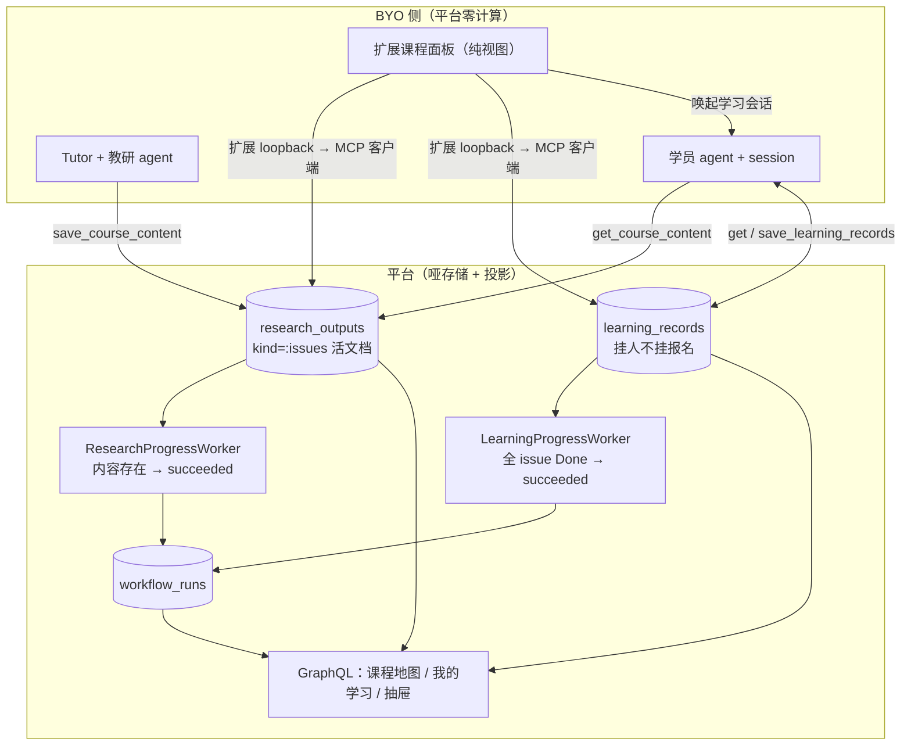

# 课程 Issue 学习闭环（切片H） - Plan

## Goal Capsule

- **Objective:** 打通「教研产 issue 卡 → 平台存储 → 学员 agent 自适应学习 → 学习记录回流 → 进度投影」的最小闭环：两张新表（research_outputs / learning_records）、四个新 MCP 工具、双完成判定 worker、双定义与双 Agent 指令种子、Web 三处界面（课程地图 / 我的学习 / 管理页露出）、OpenClacky 扩展课程面板。
- **Product authority:** 产品决策全部经 2026-08-16 brainstorm + grill 两轮（Q1-Q14）用户拍板，规格固化为 issue #180（切片H），权威设计为 `docs/01-定稿设计/课程issue学习闭环详细设计.md` v1.0；领域术语已同步 CONTEXT.md。
- **Stop conditions:** 上列九个实现单元全部落地、仓库全部门禁绿、agent-browser E2E 结构断言通过、MCP 工具契约（12 个）断言通过即止；不做教研聚合、QnA、审核开关、导出端点等后置项。
- **Tail ownership:** DSH 侧同构面板（独立仓库 cgc_2046-dsh-plugin）与两通道契约文件同步由跟进计划承接；教研设计三段式 DAG（S0-S12）为远期蓝图，不由本计划交付。

---

## Product Contract

### Summary

以 Linear 为交互隐喻（Course = Project、学习单元 = Issue）打通完整闭环：教研侧产出 issue 卡（User-Story 式内容契约，kind 分 thoughtwork / handwork）存为课程内容本体；学员 agent 经 MCP 拉内容与个人学习记录跑自适应八步循环，checklist 复盘结果写回学习记录（记忆挂人不挂报名）；平台 Web 只做「地图」与「账本」；OpenClacky 扩展加课程面板做学习导航台。学习 run 完成语义升级为「全部 issue Done」，教研 run 在内容提交后即完成，Course 恒走教研链路（删 `research_enabled` 列）。

### Problem Frame

课程在平台上只是一个「报名容器」：没有课程内容本体，教研产出躺在 run facts JSONB 里学员看不到、agent 拿不到；学习 run 的完成语义是「走完了」而非「学会了」；学员学习历史无结构化沉淀。教研侧断裂：教研 run 无完成机制（永久挂起）、workflow 定义无种子（Readiness 空警告）、课程管理页看不到教研状态、报名页露不出教研产出。动机与决策过程见 `docs/01-定稿设计/课程issue学习闭环详细设计.md`（v1.0，grill 两轮定稿）与 issue #180。

### Requirements

**内容模型与存储**

- R1. 课程内容 = issue 卡集（`{goals[], issues[]}`；issue 含 id / kind / title / story{as_a, given, goal, materials, checklist}），经 MCP `save_course_content` 提交，存为 ResearchOutput(`kind=:issues`) 活文档，run 终态后仍可更新。(#180 US12-14, US23)
- R2. issue id 与 checklist item id 发布后不改不删；`save_course_content` 校验 id 非空且 issue 内 / checklist 内唯一。(#180 US14)
- R3. 学习记录按 `(course_id, user_id, issue_id, item_id)` upsert 最新为准（记忆挂人不挂报名，跨 enrollment 延续），enrollment_id / run_id 为审计列，记录 done + evidence + recorded_at。(#180 US8-9)

**MCP 工具与授权**

- R4. 新增四个 MCP 工具：`get_course_content`（读）、`get_learning_records`（读，course_id 可选 = 本人全部）、`save_learning_records`（直接写）、`save_course_content`（教研侧写）；平台工具面 8 → 12。(#180 US20-23)
- R5. 学员侧三工具不设工作区成员门槛（成员门槛延后名单），授权 = 本人 confirmed enrollment 或记忆持有者；写工具校验课程非 close/cancel（拒写保读）。(#180 US9-10, US24)
- R6. `save_course_content` 授权 tutor ∪ owner/admin；学习 run 置 succeeded 后学习记录仍可写（记忆终身，完成只是进度投影）。(#180 US14, US23)

**进度与完成**

- R7. issue 三态 Todo / In Progress / Done 由学习记录派生（Todo = 无 done 记录，In Progress = 部分 done，Done = 全部 done），不提供手动切换。(#180 US11)
- R8. 学习 run 完成条件 = 全部 issue Done → succeeded；教研 run 完成条件 = ResearchOutput(`kind=:issues`) 存在 → succeeded。(#180 US25-26)
- R9. 学习进度 GraphQL 字段直接替换为 issue 级（doneIssues / totalIssues / currentIssueTitle），不留兼容层。(#180 US2)

**Web 界面**

- R10. 公开课程详情页露课程地图（issue key + 标题 + kind 标签 + goal 一行），不露 checklist，匿名可读。(#180 US1, US17)
- R11. 参与页升级「学习 / 报名 / 赞助」子导航（学习默认 tab）：按课程分组、行 = 状态图标 + issue key + 标题 + kind 标签 + checklist 进度（n/m）、点击开右侧抽屉（story 全文 + checklist 逐条 + evidence 摘要 + OpenClacky CTA）。(#180 US2-4)
- R12. 课程管理页露教研 run 状态与内容完成度，并加教研需求自由文本框（落 research_requirements）。(#180 US15-16)

**种子与开关**

- R13. 内置学习/教研 workflow 定义种子（对称极简：单 manual step 协议容器）与学习/教研 Agent 指令模板种子（八步循环含 kind 分支与产物实查规则 / 教研起草指令）。(#180 US27)
- R14. Course 删除 `research_enabled` 列、恒走教研实例化；对账规则④与 Readiness 教研项对 Course 无条件化；Event 保留该开关（event-only 门控）。(#180 US18-19)

**扩展**

- R15. OpenClacky cgc-2046 扩展新增课程面板：课程/issue 导航 + 当前 issue 卡 + checklist 打勾 + 「和导师学这一节」唤起学习会话；面板为纯视图，数据经扩展 loopback 路由 → MCP 客户端拉取。(#180 US5, US28)

### Key Decisions

- **Linear 交互隐喻与 issue 术语**（session-settled: user-directed — chosen over 自创交互词汇与 section/story 卡叫法：Linear 的布局/样式/交互词汇表成熟且用户熟悉）。Governs R1, R7, R10, R11
- **kind 二分 thoughtwork / handwork，证据在哪为界；动手卡 ≠ 技能**（session-settled: user-directed — chosen over 知识型/动手型耦合技能分发：逐卡配技能会引爆教研工作量）。Governs R1, R13
- **记忆在平台、算法在 agent（平台零计算）**（session-settled: user-directed — chosen over 平台侧做掌握度聚合/推荐：BYO 架构下教学决策属 agent 指令层）。Governs R4, R13
- **记忆挂人不挂报名**（session-settled: user-approved — chosen over 唯一键挂 enrollment：退款重报记忆不清零，记忆是「人的」）。Governs R3, R5
- **research_enabled 语义分家：Course 删列 / Event 保留**（session-settled: user-directed — chosen over 双侧保留或双侧删除：开关在 Course 是死路径，Event 需要轻聚会退出通道）。Governs R14
- **扩展 v1 并入 cgc-2046、面板纯视图、执行在 session**（session-settled: user-directed — chosen over 单独课程扩展：一次安装全都有，将来拆分成本低）。Governs R15
- **公开课程地图只露 goal 不露 checklist**（session-settled: user-approved — chosen over 全量露出：地图太长且评分细则泄底，goal 即招募承诺）。Governs R10
- **GraphQL 进度字段直接替换不留兼容层**（session-settled: user-approved — chosen over 新旧并存：AGENTS.md 不保留兼容路径）。Governs R9
- **双种子对称极简（单 manual step 协议容器），三段式教研 DAG 降级远期蓝图**（session-settled: user-approved — chosen over 落地 S0-S12 三段式：v1 无信号消费者，容器 + 外部数据派生完成即够）。Governs R8, R13
- **学习 run succeeded 后记录仍可写**（session-settled: user-approved — chosen over run 完成即封笔：记忆终身，完成只是进度投影）。Governs R6
- **issue key 短码（`PY-02` 式）采纳，派生非存储**（session-settled: user-approved — chosen over 仅用内部 id：成本近零、贴 Linear 味）。Governs R10

### Scope Boundaries

**非目标（本产品身份外）**

- DSH（DeepSeek Harness）侧 dgc-cgc-core 同构面板 —— 独立仓库（cgc_2046-dsh-plugin），见 Tail ownership。
- 小程序（miniprogram/）课程页改动 —— 不露课程地图。
- 教研聚合读工具（tutor 看学员掌握度、反哺迭代 issue 卡）、QnA 答疑段、`materials_review_required` 审核开关、ResearchOutput 的 `:materials` / `:archive` kinds、记忆导出端点（schema 已预留）、富记忆（对话摘要/错误模式/偏好）、kind 枚举扩展、Event 侧 research_enabled UI、三段式教研 DAG。

**Deferred to Follow-Up Work**

- OpenClacky 扩展与 DSH 插件两通道的契约文件（CONTRACT.md 族）随 12 工具同步 —— 平台侧只保证工具注册与契约断言；跨仓文件由 DSH 跟进计划与扩展发布流程承接。
- #120（bus 重启后信号订阅方不重订阅）为实施期验证项，不阻塞本计划。

---

## Planning Contract

### Key Technical Decisions

- KTD1. ResearchOutput 是课程内容的唯一持久层：`(key, kind)` 唯一（key = `course_<id>`），活文档按 key 更新；`save_course_content` 是唯一写入口（`save_step_output` 仅浅合并 run facts、不写业务表——代码事实锚定），成功时向教研 run facts 镜像一份（run 非终态时）。(session-settled: user-approved — chosen over 从 facts 投影业务表：显式写入与 `save_learning_records` 对称，读写路径单一)
- KTD2. 学员侧三工具进 `Wrapper` 成员门槛延后名单（学员是事件级参与者、非工作区成员），授权在工具层锚 user_id：本人 confirmed enrollment 或已有记忆；`get_course_content` 另放行 workspace 成员（tutor/教研编辑需要读）。(session-settled: user-approved — chosen over 给学员自动建 membership：两类关系并存是既有领域决策)
- KTD3. 完成判定走 `WorkflowRun :complete`（允许 running/waiting → succeeded 直达，代码事实锚定）：学习侧改判 LearningProgressWorker（全 issue Done），教研侧新增独立 ResearchProgressWorker（内容存在即完成），同一 cron 节奏。
- KTD4. 不引入内容版本号：靠 id 稳定纪律 + 学习记录引用 id，内容编辑不破坏进行中学员。(session-settled: user-approved — chosen over 语义化版本 + run 快照：YAGNI)
- KTD5. 教研产卡不实现 S1 信号门控：现状代码无 `research.outline.submitted` 消费者，信号改名仅是设计词汇层，无代码连带；v1 产出确认 = `save_course_content` 落库成功。
- KTD6. issue key 展示层派生：课程 slug 短码化（大写、截短）+ issue 在 content 中的序号（`PY-02`），不入库；派生函数单源，Web 与扩展共用形状约定。
- KTD7. 实施约束锚点（转移合法性、授权三层、GraphQL 耦合点、seeds 现状等）以 `docs/01-定稿设计/课程issue学习闭环详细设计.md` §11 为准，本计划不重述；单元内只引用。

### High-Level Technical Design

### Actors

- A1. 学员（Learner）—— 事件级参与者（Enrollment），非工作区成员；MCP 授权锚其 user_id。
- A2. Tutor —— 工作区成员角色；教研产卡与内容修订。
- A3. Owner / Admin —— 工作区管理；可读内容、可设教研需求。
- A4. 学员 agent —— BYO 执行体；八步循环消费内容与记忆、写回记录。
- A5. 教研 agent —— BYO 执行体；从 research_requirements 起草 issue 卡。

### Key Flows

- F1. 教研产卡：Owner 建课（含教研需求自由文本）→ launch → ResearchInstantiator 实例化教研 run → Tutor 与教研 agent 起草 → `save_course_content` 落库 + facts 镜像 → ResearchProgressWorker 置 run succeeded。Covers R1, R8, R12-R14
- F2. 学员自适应循环：报名 confirmed → 学习 run 实例化（既有链路）→ 学员 agent `get_learning_records`（含课程列表）→ `get_course_content` → 扫描起点（全 Done 跳过 / 部分 Done 记缺口 / 无记录候选）→ kind 分支教学 → checklist 复盘（产物条目实查）→ `save_learning_records` 写回 → 循环。Covers R4-R7
- F3. 进度投影：记录变更 → LearningProgressWorker 判全 issue Done → run succeeded → GraphQL 进度字段 / 我的学习页 / 扩展面板呈现三态。Covers R7-R9, R11

### Acceptance Examples

- AE1. Covers R3, R5: Given 学员已确认报名并写过学习记录，When 该 enrollment 因退款被取消且学员重新报名同一课程，Then 新旧记录同键合并（记忆延续），我的学习页进度不归零。
- AE2. Covers R5: Given 课程已 close，When 学员 agent 调 `save_learning_records`，Then 返回明确业务错误（拒写）；When 调 `get_learning_records` / `get_course_content`，Then 正常返回（保读）。
- AE3. Covers R6, R8: Given 学员全部 issue Done、学习 run 已 succeeded，When 学员回访复习并再次 `save_learning_records`，Then 写入成功且 run 状态不变。
- AE4. Covers R14: Given 某课程 open 且工作台无 published 教研定义，When 对账扫描运行，Then 规则④无条件命中该课程（不再看 research_enabled）。

### Risks & Dependencies

- Rsk1. 删列 migration 不可逆：当前无生产部署（dev 阶段），风险可接受；migration 与消费方改动同单元落地。
- Rsk2. #120（bus 重启后信号不重订阅）可能影响 course.launched → 实例化链路：实施期验证，不影响本计划设计。
- Rsk3. 扩展面板「唤起学习会话」依赖 OpenClacky 会话 API 的实际形态：实现期以 dsh-cgc-core 的面板-会话联动模式为参照，必要时 v1 降级为复制任务指令文本。
- Dep1. 上游：issue #180（规格）、设计文档 v1.0、CONTEXT.md 新词条（均已就绪）。

---

## Implementation Units

### U1. ResearchOutput 资源与迁移（内容本体落库）

- **Goal:** 建 `research_outputs` 表与 Ash 资源：`(key, kind)` 唯一、`kind=:issues` 承载 course content JSONB、submitted_by / workflow_run_id 审计关联、按 key 的活文档更新 action。
- **Requirements:** R1, R2
- **Dependencies:** 无
- **Files:** `backend/priv/repo/migrations/*_create_research_outputs.exs`（新）、`backend/lib/cgc_2046/workflows/research_output.ex`（新）、`backend/lib/cgc_2046/api.ex`（域注册）、`backend/test/cgc_2046/workflows/research_output_test.exs`（新）
- **Approach:** 租户资源（workspace_id 多租户，同 workflow 家族）；内容形状校验放资源 changeset（goals 非空数组、issues 非空、每 issue 的 id/kind/title/story 必填、issue id 与 checklist item id 在卡集内唯一）；`upsert_content` 按 (key, kind) 更新 data 与 submitted_by。不做对内容 JSONB 的外键级联（id 纪律，见 KTD4）。
- **Patterns to follow:** `workflow_definition.ex` / `workflow_run.ex` 的租户资源 + policy 骨架；`sponsorship_tiers` 嵌入式校验风格。
- **Test scenarios:**
  - 首次保存 `kind=:issues` 内容成功，key 形如 `course_<id>`，(key,kind) 唯一索引生效。
  - 同 key 二次保存为更新（活文档），不产生第二行。
  - issues 为空 / issue 缺 id / checklist item id 重复 / kind 非法值 → changeset 报错（Covers R2）。
  - 跨租户读写被 policy 拒绝。
- **Verification:** `mix test test/cgc_2046/workflows/research_output_test.exs` 绿；迁移可 up/down。

### U2. LearningRecord 资源与迁移（个人记忆库）

- **Goal:** 建 `learning_records` 表与 Ash 资源：唯一键 `(course_id, user_id, issue_id, item_id)` upsert，done/evidence/recorded_at，enrollment_id/run_id 审计列。
- **Requirements:** R3
- **Dependencies:** 无
- **Files:** `backend/priv/repo/migrations/*_create_learning_records.exs`（新）、`backend/lib/cgc_2046/learning/learning_record.ex`（新）、`backend/lib/cgc_2046/api.ex`（域注册）、`backend/test/cgc_2046/learning/learning_record_test.exs`（新）
- **Approach:** 租户资源；`upsert_records` 批量 action（工具层一次会话多条）；course_id 外键到 courses，issue_id/item_id 为字符串引用（无内容外键，KTD4）；课程终态拦截放工具层（U3），资源层不拦。
- **Patterns to follow:** 同 U1；upsert 参考 enrollment `reserve_capacity` 的裸 SQL 唯一索引配套风格（本单元用 Ash upsert 即可，无并发扣减）。
- **Test scenarios:**
  - 新建记录成功；同键二次写覆盖 done/evidence/recorded_at（upsert 最新为准，Covers R3）。
  - 同 issue 不同 item 独立成行；同 user 跨 enrollment（不同 enrollment_id 审计值）同键仍合并（AE1 底座）。
  - 越权（actor ≠ 行 user_id）读写被拒。
  - issue_id/item_id 空字符串拒；不校验内容存在性（宽存，KTD4）。
- **Verification:** `mix test test/cgc_2046/learning/learning_record_test.exs` 绿；迁移可 up/down。

### U3. 四个 MCP 工具 + 契约（工具面 8→12）

- **Goal:** 实现并注册 `get_course_content` / `get_learning_records` / `save_learning_records` / `save_course_content`，学员侧进成员门槛延后名单，授权按 KTD2，server 工具数契约断言 12。
- **Requirements:** R1, R4, R5, R6
- **Dependencies:** U1, U2
- **Files:** `backend/lib/cgc_2046/mcp/tools/get_course_content.ex`、`save_course_content.ex`、`get_learning_records.ex`、`save_learning_records.ex`（均新）、`backend/lib/cgc_2046/mcp/server.ex`（注册）、`backend/lib/cgc_2046/mcp/wrapper.ex`（`@membership_deferred` 名单）、`backend/test/cgc_2046/mcp/tools/`（四个新测试）、server 契约测试（新）
- **Approach:**
  1. 一文件一工具（anubis_mcp 声明式注册，加行即可——设计文档 §11 锚点）。
  2. 学员侧三工具加入 `@membership_deferred`；工具层授权：workspace 成员 OR（本人 confirmed enrollment OR 本人已有记忆）；`save_learning_records` 另校验课程 status ∈ {draft, open}（close/cancel 拒写保读，R5）。
  3. `save_course_content` 授权 tutor ∪ owner/admin；校验后写 ResearchOutput（U1 action），run 非终态时向 `facts["issues"]` 浅合并镜像（KTD1）。
  4. `get_learning_records` 恒以 actor 为 user_id（无他人查询面）；course_id 缺省返回全部课程记录。
- **Patterns to follow:** `save_step_output.ex` 的授权三层结构（wrapper 名单 → 工具层 → 资源 policy）；`StepAuthorization.enrolled_learner?` 的报名判定语义。
- **Test scenarios:**
  - 学员（confirmed enrollment、非成员）四工具全通（名单生效，Covers R5/US24）。
  - 未报名非成员学员：读被拒、写被拒；曾学过（有记忆）读放行。
  - tutor 保存内容成功并镜像 facts；owner/admin 放行；learner 调 `save_course_content` 拒（R6）。
  - 课程 close 后 `save_learning_records` 返回业务错误、两读工具正常（AE2）。
  - run succeeded 后 `save_learning_records` 成功（AE3 的缝级前置）。
  - `get_learning_records` 缺省 course_id 返回多课程记录；带 course_id 过滤。
  - server 注册工具数 = 12 的契约断言。
- **Verification:** `mix test test/cgc_2046/mcp/` 绿；契约断言入 CI 门禁集。

### U4. 学习完成判定与进度投影升级

- **Goal:** LearningProgressWorker 完成条件从「末个 manual step 的 facts 已写」改为「全部 issue Done」；`LearningProgress.project` 分子分母切到 learning_records，产出 doneIssues / totalIssues / currentIssueTitle（+ issue key）。
- **Requirements:** R7, R8, R9（投影核心部分）
- **Dependencies:** U1, U2（数据），U5（定义种子先行更稳，可并行）
- **Files:** `backend/lib/cgc_2046/workflows/learning_progress.ex`、`backend/lib/cgc_2046/workflows/learning_progress_worker.ex`（无新文件）、`backend/test/cgc_2046/workflows/learning_progress_test.exs`、`backend/test/cgc_2046/workflows/learning_progress_worker_test.exs`
- **Approach:** 判定数据源 = 该 enrollment 对应 course content（ResearchOutput）+ 该 user 学习记录；无内容课程跳过判定（不完成）；currentIssue = 首个非 Done issue（无则课程 Done 态）。完成动作走 `:complete`（KTD3）。
- **Patterns to follow:** 既有 worker 的 `maybe_complete` 结构与 tenant/authorize?: false 纪律。
- **Test scenarios:**
  - 全部 issue Done → run succeeded；部分 Done → 保持 running；无记录 → Todo 全量。
  - 无内容课程（无 ResearchOutput）→ 不判完成。
  - currentIssueTitle / issue key 派生正确（KTD6 形状）。
  - 记录更新后下一轮扫描完成（F3 集成）。
- **Verification:** `mix test` 学习进度族全绿；投影字段供 U7 直接消费。

### U5. 教研 discharge + 双定义种子 + 双 Agent 指令种子

- **Goal:** 新增教研 run 完成判定（内容存在 → succeeded）；seeds 落四件：教研定义、学习定义（均单 manual step 协议容器、published）、学习 Agent 指令（八步循环 + kind 分支 + 产物实查规则 + 产物不采信口头完成）、教研 Agent 指令（起草规则含 id 稳定纪律）。
- **Requirements:** R8（教研半）, R13
- **Dependencies:** U1
- **Files:** `backend/lib/cgc_2046/workflows/research_progress.ex`（新）、`backend/lib/cgc_2046/workers/research_progress_worker.ex`（新）、`backend/config/config.exs`（cron 注册，与 learning 同节奏）、`backend/priv/repo/seeds.exs`（填充）、`backend/test/cgc_2046/workflows/research_progress_worker_test.exs`（新）、seeds 冒烟测试
- **Approach:** 判定 = 目标 course 的 ResearchOutput(kind=:issues) 存在且关联 run 非终态 → `:complete`；终态不动。种子进默认 workspace（slug `2046`），幂等（存在即跳过）；Agent 指令以公共 Agent 定义形态落库（任务指令模式消费面 `get_agent_instruction`）。
- **Patterns to follow:** `learning_progress_worker.ex` 全套结构；`research_run_reaper.ex` 的 research run 查询过滤。
- **Test scenarios:**
  - 内容存在 + run waiting/running → succeeded；run 已终态不动；无内容不动。
  - seeds 幂等：跑两遍不重复；两定义 published 且含单 manual step。
  - Readiness 对种子后的工作台教研项 pass（与 U6 联动前的既有语义）。
- **Verification:** `mix test` 绿；`mix run priv/repo/seeds.exs` 幂等。

### U6. research_enabled 删列与消费方收紧

- **Goal:** drop `courses.research_enabled`；`ResearchInstantiator.ensure_research_enabled` 退化为 event-only 门控；对账规则④ course 无条件、Readiness 教研项对 course 无条件；GraphQL `researchEnabled` 字段移除。
- **Requirements:** R14
- **Dependencies:** U5（种子先行避免对账误报窗口）
- **Files:** `backend/priv/repo/migrations/*_drop_courses_research_enabled.exs`（新）、`backend/lib/cgc_2046/events/course.ex`、`backend/lib/cgc_2046/workflows/research_instantiator.ex`、`backend/lib/cgc_2046/workers/reconciliation_scan_worker.ex`、`backend/lib/cgc_2046/events/readiness.ex`、`backend/test/cgc_2046/events/readiness_test.exs`、`backend/test/cgc_2046/workflows/reconciliation_scan_worker_test.exs`、`web/lib/graphql/events.ts`（若拉过该字段）
- **Approach:** migration 与消费方同单元原子落地（Rsk1）；course 路径实例化无条件（ensure 只对 `event_<id>` key 生效）；Event 全链路不动。
- **Patterns to follow:** 既有删列/收紧类变更（无兼容层，AGENTS.md）。
- **Test scenarios:**
  - course launch 恒实例化教研 run（原 false 跳过分支删除后的行为）。
  - open 课程无 published 定义 → 规则④命中（AE4）；有定义不命中；Event 侧 research_enabled=false 仍合法不命中。
  - Readiness course 教研项无条件检查。
- **Verification:** `mix test` 全绿（含既有 course/reconciliation/readiness 族更新）。

### U7. GraphQL 面：课程地图 + 进度替换 + 抽屉数据

- **Goal:** 公开课查询扩展课程地图投影（issue key/title/kind/goal，匿名只读、不露 checklist）；`myLearningRuns` 字段替换为 doneIssues/totalIssues/currentIssueTitle(+issueKey)；新增学员视角的课程学习详情查询（content + 记录合成，供抽屉）。
- **Requirements:** R9, R10, R11（数据部分）
- **Dependencies:** U4（投影核心）
- **Files:** `backend/lib/cgc_2046/events/course.ex`（GraphQL 字段）、`backend/lib/cgc_2046_web/graphql_schema.ex`（resolver / 新查询）、`backend/priv/graphql/schema.graphql`（生成物）、`backend/test/cgc_2046_web/graphql_public_offering_test.exs`、`graphql_enrollment_my_query_test.exs`、新学习详情查询测试、`web/lib/graphql/events.ts`、`web/lib/graphql/participations.ts`
- **Approach:** 课程地图挂公开课详情查询（同 seam，匿名 policy 同既有公开课可见性）；学习详情查询按 actor 组装（content from ResearchOutput + records by user），一次往返供抽屉；旧进度字段直接删除（KD8）。
- **Patterns to follow:** `resolve_my_learning_runs` 的 actor/tenant 纪律；公开课查询的匿名只读 policy。
- **Test scenarios:**
  - 匿名拉公开课课程地图：public+open 可见、workspace-only/draft 不可见、响应无 checklist 字段（R10）。
  - myLearningRuns 新字段返回正确；旧字段不存在（schema 断言）。
  - 学习详情查询：本人有记录/无记录两种形状；越权（他人视角）不可构造（恒 actor）。
- **Verification:** `mix test` GraphQL 族绿；`web` 侧 typecheck 通过（配合 U8 查询改造）。

### U8. Web 三页：课程地图 / 我的学习 / 管理页露出

- **Goal:** 公开详情页加课程地图区块；参与页重构为「学习/报名/赞助」子导航（学习默认 tab、按课程分组、行 + 右侧抽屉 + OpenClacky CTA）；课程管理页加教研 run 状态与内容完成度露出、教研需求自由文本框。
- **Requirements:** R10, R11, R12
- **Dependencies:** U7
- **Files:** `web/app/courses/[slug]/page.tsx`、`web/components/public-offering-detail.tsx`、`web/app/participations/page.tsx`、`web/components/learning/`（新组件族：tab 导航、课程分组列表、issue 行、抽屉）、`web/app/w/[slug]/courses/[id]/page.tsx`、`web/components/offering-pages.tsx`、`web/lib/graphql/events.ts`、`web/lib/graphql/participations.ts`、Vitest 组件测试、E2E 脚本
- **Approach:** 视觉仿 Linear 设计语言（行密度、三态图标、kind 标签 chip、右侧抽屉交互）；抽屉数据用 U7 学习详情查询；CTA 用 #92 OpenClackyCta 模式；管理页文本框写 research_requirements（自由文本，Q10/KD 语义）。
- **Patterns to follow:** `WorkspaceShell` 的导航/权限过滤模式；`public-offering-detail.tsx` 既有报名表单结构；`facts-tree.tsx` 的 schema 驱动渲染思路（抽屉 checklist 区）。
- **Test scenarios（Vitest + agent-browser E2E 分层）:**
  - 组件：三态行渲染（状态图标 + issue key + 标题 + kind 标签 + n/m）；抽屉开合与字段；tab 切换保状态。
  - E2E 结构断言：课程地图行含 goal、DOM 无 checklist 文本（R10）；我的学习按课程分组、抽屉逐条 evidence；CTA href 指向 OpenClacky。
  - E2E 交互：tab 切换 → 课程展开 → issue 点击开抽屉 → 关闭（成功分支）；无在学课程空态（边界）。
  - 管理页：教研状态块出现、需求文本框保存后回显。
- **Verification:** `pnpm typecheck && pnpm lint && pnpm test && pnpm build` 绿；agent-browser E2E 断言全过（结构断言优先，视觉复核兜底）。

### U9. OpenClacky 扩展课程面板

- **Goal:** `openclacky-ext/cgc-2046` 新增课程面板（panels 多面板机制）：我的课程 → issue 列表（三态）→ 当前 issue 卡（goal/given/materials/checklist 打勾）→「和导师学这一节」唤起学习 agent 会话。
- **Requirements:** R15
- **Dependencies:** U3（工具就绪）
- **Files:** `openclacky-ext/cgc-2046/panels/cgc-course/`（新）、`openclacky-ext/cgc-2046/api/`（loopback 路由：课程列表/内容/记录）、`openclacky-ext/cgc-2046/ext.yml`（面板注册）、`openclacky-ext/cgc-2046/test/`（面板测试）
- **Approach:** 面板 fetch 扩展自有 loopback 路由 → 扩展 core 作为 MCP 客户端调 `get_learning_records`（课程列表）/ `get_course_content`（dsh-cgc-core 已验证模式，无待验证前提）；唤起会话按 Rsk3 处置（必要时降级为复制任务指令文本）；面板纯视图，不做任何写操作（记录写回发生在 session）。
- **Patterns to follow:** 既有面板的 `Clacky.ext.ui.mount` / subscribe 结构；dsh-cgc-core 的 routes + MCP client 封装形态。
- **Test scenarios:**
  - 面板渲染：课程列表、三态行、当前卡字段、checklist 打勾态（有记录数据时）。
  - 路由：loopback 三端点返回 MCP 透传 JSON；未连接态（无 token）给出引导视图。
  - 唤起：按钮触发会话注入任务指令（或降级复制路径）可达。
- **Verification:** `openclacky-ext` 自身测试绿；本地连接平台后手动冒烟（面板能看到种子课程与记录）。

---

## Verification Contract

| 门禁 | 命令 | 适用单元 |
| --- | --- | --- |
| 后端编译与警告 | `cd backend && mix compile --warnings-as-errors` | 全部 |
| 后端格式 | `cd backend && mix format --check-formatted` | 全部 |
| 后端测试 | `cd backend && mix test` | U1-U7 |
| 依赖合规 | `cd backend && mix cgc2046.check_licenses` | 全部（本计划不新增依赖） |
| 前端静态 | `cd web && pnpm typecheck && pnpm lint` | U7-U8 |
| 前端测试与构建 | `cd web && pnpm test && pnpm build` | U8 |
| MCP 契约 | server 注册工具数 = 12 断言（随 `mix test`） | U3 |
| E2E | agent-browser 分层验证：结构/样式数值断言为主、交互走通、视觉兜底（AGENTS.md 纪律） | U8（U9 手动冒烟） |
| RBAC 契约 | `mix cgc2046.gen_rbac_contract --check`（本计划无角色变更，防回归） | 全部 |

## Definition of Done

- 九个单元全部落地，依赖顺序满足（U1/U2 → U3 → U4/U5 → U6 → U7 → U8 → U9）。
- Verification Contract 全表绿；E2E 结构断言全过。
- 规格对齐抽验：#180 的 28 条 user stories 中 learners/tutor/平台主线（US1-4, US8-9, US12-14, US20-23, US25-28）逐条可演示。
- CONTEXT.md 术语已同步（前置完成），无需再动；`docs/01-定稿设计/课程issue学习闭环详细设计.md` 保持权威。
- 清理门槛：实现期的实验代码、降级尝试、死分支全部清除，不留在 diff（含 Rsk3 降级路径若未采用）。
