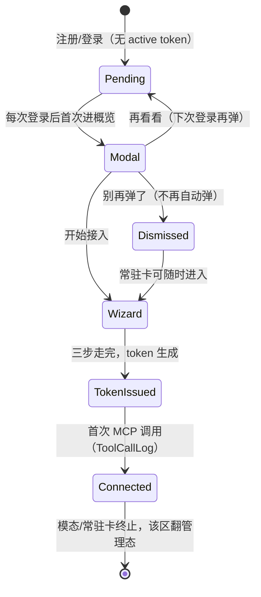

# 第一公里引导 - Plan

## Goal Capsule

- **Objective:** 注册后的 web 新成员不再「落地即死」——每位未接入成员都会被邀请、被引导完成 agent 宿主接入（OpenClacky 可用，DSH 占位），直到平台第一次被其 agent 调用；概览页从漏斗终点变为接入起点。
- **Means:** 概览页模态邀请 + 常驻接入卡（KTD5）；`settings/integrations/agents` 新增区入口页承载向导/管理两态，四个子页原样保留（KTD1）。
- **Product authority:** 全部范围决策由产品方在 brainstorm 对话中拍板（见 Key Decisions 的 session-settled 标注）；plan-time 技术决策经 scoping synthesis 确认（见 KTD 标注）。
- **Stop conditions:** 全部 unit 的 DoD 达成且 Verification Contract 全绿即交付；出现与 session-settled 决策冲突的证据（如 token 语义与调研不符）即停，回到产品方。
- **Execution profile:** 依赖序 U1 → U2 → U3/U4 → U5；浏览器分层验证与 PR 归执行者。
- **Open blockers:** 无。DSH 以占位呈现，不阻塞本 plan。

---

## Product Contract

### Summary

实现挂两个触点：工作区概览页（每次登录的邀请模态 + 通联前常驻提醒卡）和 `settings/integrations/agents` 区（新增入口页承载向导/管理两态，四个宿主子页不动、URL 不改名）。除 User 一个全局「已拒绝邀请」字段外无新数据面：token 与通联信号全部复用现有查询在客户端派生。覆盖 brainstorm 全范围，无收窄。

### Problem Frame

注册即自动加入默认工作区 2046，但新成员落地概览页后没有任何下一步引导——这是 #293 用户漏斗记录的最大漏水点。接入引导 UI 其实已存在，却深埋在设置区（全站唯一提示是 MCP 页空态的一条回链），新成员不可能摸到。在 BYO 架构下，不接入 agent 宿主，平台核心价值（agent 帮你学课程、干活）对用户等于不存在；落地即流失，landing 转化来的用户在这里漏光。

### Key Decisions

- **终点线 = 完成宿主接入三步** (session-settled: user-directed — chosen over 首次社区参与/分阶段链路/最小止血: BYO 架构下接入是核心价值通道，CONTEXT.md §7 本就如此定义 Onboarding)。Governs R4, R6
- **渠道只圈 web 端** (session-settled: user-directed — chosen over 小程序做桥/两端都做: 装宿主是桌面行为，小程序端第一公里终点不同，另行立项)。
- **DSH 占位标注** (session-settled: user-directed — chosen over 与 DSH 同步上线/先只露 OpenClacky: 选择结构现在就立，不被 dsh-cgc-core 发布节奏阻塞)。Governs R5
- **宿主选择扩编为 OpenClacky 默认推荐 + OMP/OpenCode 并列可选** (session-settled: user-approved — chosen over 仅 OpenClacky + DSH: plan 调研发现 OMP/OpenCode 连接引导页已存在，synthesis call-out 确认)。Governs R5
- **模态邀请，每次登录弹直到明确拒绝** (session-settled: user-directed — chosen over 强制跳转向导页/只弹一次: 引导而非强制，带目的地的落地（活动报名回跳）零打扰)。Governs R1, R2, R3
- **原地重构 settings/integrations/agents + 向导/管理两态** (session-settled: user-directed — chosen over 新建独立向导页/Tab+步骤条混合: 配置、管理、引导单一归属；两态互斥、各自自洽)。Governs R4, R7
- **两段式完成判定** (session-settled: user-directed — chosen over token 生成即完成/首次调用才算完成: 向导不被用户侧配置故障阻塞，真实通联仍可观测、可提醒)。Governs R6, R8

### Actors

- A1. **未接入成员**——新注册或存量、无 active 连接 token 的成员；注册即自动加入默认工作区 2046。本功能的唯一目标对象。
- A2. **已接入成员**——持有 active token 且已发生首次 MCP 调用的成员；模态与常驻卡对其不可见（per R8：首次调用后卡消失）。
- A3. **CGC 助手**——连接器扩展内置的通用 Agent（host 侧）；完成态种子话术把用户送向它，其在 host 内的教学职责属第二公里，不在本 plan。

### Requirements

**邀请与触达**

- R1. 未接入成员每次登录后首次进入工作区概览页时，看到一次接入邀请模态：欢迎语、「为什么接入」的价值说明、主 CTA「开始接入」与次动作「再看看」。未接入 = 无 active 连接 token 且未明确拒绝（per R2）；判定不区分账号新旧，存量未接入成员同样进入此循环；token 全部撤销或闲置过期的回归成员视同未接入，重新进入本循环。
- R2. 模态提供「暂时不用，别再弹了」明确拒绝项；拒绝后模态不再自动弹出，拒绝状态持久化且跨设备一致，常驻卡不受影响（per R8）。
- R3. 登录分发逻辑不因此功能改变：带 next 目的地的注册/登录直达目的地；邀请只挂在概览页，不劫持活动报名等链路。

**向导态**

- R4. `settings/integrations/agents` 区对未接入成员呈现向导态：自带开场（欢迎 + 为什么接入），纵向 stepper 依序承载 ① 选宿主 ② 装宿主 ③ 装扩展并自动配 MCP；步骤内容从该区现有宿主引导页与 MCP token 页重排而来，不产生第二处内容源。
- R5. 第①步宿主选择：OpenClacky 默认推荐，OMP/OpenCode 并列可选；DSH 以「即将推出」占位呈现，选中时展示说明而非进入接入流程。
- R6. token 生成成功即向导完成：完成态展示种子话术卡（引导用户对新接入的 CGC 助手说「我在 2046 能做什么？」）与出口（去概览 / 看活动）。
- R7. 向导态与管理态互斥：已接入成员看到该区现有 Tab 管理态，向导收起为「已接入 ✓ · 重新查看引导」入口。

**通联提醒**

- R8. 概览页新增常驻接入卡：未接入成员恒可见（模态拒绝后仍在）；token 已生成但首次 MCP 调用未发生时呈「等待你的 agent 第一次连接」提醒态；首次调用发生后卡消失。

**边界与卫生**

- R9. 该区 URL 可按需改名，但须留重定向或同步更新外部引用——`openclacky-ext/cgc-2046/README.md:50` 与 `openclacky-ext/cgc-2046/skills/cgc2046-onboarding/SKILL.md:19` 引用 `/w/<slug>/settings/integrations/agents/mcp`。v1 不改名（KTD1），本条为改名时的守护约束。
<!-- preservation note: brainstorm 版 R9 称 system_prompt.md 亦引用该路径，plan 调研 grep 未命中，已按事实校正为上述两处（2026-08-22）。 -->
- R10. 该区是成员个人的连接配置面，对所有成员可见可用，不纳入工作区管理能力门控（与 members/permissions 等管理页的门控不同类）。
- R11. 全部新增文案中英双语，`web/messages/` 两语言文件 key 对齐（`pnpm check:i18n` 通过）。

### Key Flows

邀请/接入/通联的状态逻辑：



- F1. 无目的地新用户首登
  - **Trigger:** web 注册成功，无 next 目的地。
  - **Actors:** A1
  - **Steps:** 分发器进 `/w/2046` 概览 → 模态弹出 →「开始接入」→ 向导态三步 → token 生成 → 完成态（种子话术卡 + 出口）。
  - **Outcome:** 待通联；首次 MCP 调用后常驻卡消失。
  - **Covered by:** R1, R4, R5, R6, R8
- F2. 带目的地注册（活动报名回跳）
  - **Trigger:** 公开活动页点报名被强制登录/注册，携带 next。
  - **Actors:** A1
  - **Steps:** 直达活动页完成报名，无模态；之后首次进入概览时模态弹出。
  - **Outcome:** 报名转化不被引导打断。
  - **Covered by:** R1, R3
- F3. 拒绝与再弹
  - **Trigger:** 模态弹出。
  - **Actors:** A1
  - **Steps:** 「再看看」→ 本次关闭、下次登录再弹；「暂时不用，别再弹了」→ 持久拒绝、不再弹；两条路径常驻卡均在。
  - **Covered by:** R1, R2, R8
- F4. 通联翻转
  - **Trigger:** 该用户任一 token 首次被使用（前端以 `lastUsedAt` 非空判定，KTD3；后端对应 ToolCallLog 首条记录）。
  - **Actors:** A1
  - **Steps:** 常驻卡消失；该区由向导态翻为 Tab 管理态。
  - **Covered by:** R7, R8
- F5. 存量未接入成员遇新版本
  - **Trigger:** 存量成员首次登录含本功能的版本。
  - **Actors:** A1
  - **Steps:** 与新用户同规则进入邀请循环（判定不区分账号新旧）。
  - **Covered by:** R1

### Acceptance Examples

- AE1. **Covers R3.** Given 用户从公开活动页点报名被强制注册，When 注册成功，Then 直达该活动页且不弹模态；And 其之后首次进入概览页时模态弹出。
- AE2. **Covers R1, R2.** Given 未接入成员上次登录点了「再看看」，When 其下次登录进入概览，Then 模态再次弹出；Given 其点了「暂时不用，别再弹了」，Then 后续任何登录都不再弹，常驻卡仍可见。
- AE3. **Covers R5.** Given 向导态第①步，When 选中 DSH，Then 展示「即将推出」说明且无法进入后续步骤；When 选中 OpenClacky（或 OMP/OpenCode），Then 可继续。
- AE4. **Covers R6, R7.** Given 向导态第③步 token 生成成功，Then 进入完成态（种子话术卡 + 出口）；And 下次访问该区时呈现 Tab 管理态与「重新查看引导」入口。
- AE5. **Covers R8.** Given token 已生成但无首次 MCP 调用，Then 常驻卡呈「等待你的 agent 第一次连接」态；Given 该用户任一 token 发生首次使用（lastUsedAt 非空），Then 常驻卡消失。
- AE6. **Covers R10.** Given myAbilities 仅成员基准的普通成员，When 访问该区，Then 向导态/管理态均正常可用。

### Success Criteria

- 漏斗可观测：后端段时间戳即可还原「token 生成（insertedAt）→ 首次调用（lastUsedAt）」转化；前端埋点（模态曝光/CTA 点击）v1 不建，见 Scope Boundaries。
- 通联率：token 生成用户中发生首次 MCP 调用的比例（token lastUsedAt / ToolCallLog 可观测；ToolCallLog 写库为 best-effort，存在极小丢记录窗口，作信号源可接受）。
- 产品尚未发布、无基线：上述指标用于上线后观察，不设达标门槛。

### Scope Boundaries

- 小程序端第一公里——终点是报名首个活动而非装宿主，后续单独立项。
- 接入后用法教学（第二公里）——归连接器扩展与助手人设（`openclacky-ext/cgc-2046` 与 dsh-cgc 各自的 onboarding skill）；其中活动/课程枚举、跨 workspace 发现与加入依赖平台新增 MCP 工具面，另行立项。
- DSH 真实接入流程——占位先行，随 dsh-cgc-core 发布增量加入。
- #293 漏斗后续项——公开活动/课程页升级、概览页留存整体改造；本 plan 对概览页只加模态与常驻卡。

#### Deferred to Follow-Up Work

- 前端埋点通道（模态曝光、CTA 点击、拒绝率）——v1 不建前端埋点设施；漏斗后端段靠 token insertedAt/lastUsedAt 时间戳观测。

### Dependencies / Assumptions

- 复用现有内容源：`settings/integrations/agents/` 下 openclacky/omp/opencode 三个宿主引导页与 `agents/mcp` token 页（内容段组件化共享，不产生第二处内容源，per R4）。连接 token 绑用户不绑工作区，每用户 active 上限 10 枚（`backend/lib/cgc_2046/mcp/token.ex`）。
- 拒绝状态跨设备一致由 User 全局字段实现（KTD2）； brainstorm 阶段的「倾向用户态服务端记录」假设就此闭环。
- 注册自动加入默认工作区 2046 并建 per-workspace profile（`backend/lib/cgc_2046/accounts/membership_context.ex`）；本 plan 不改注册与登录分发链路。

<!-- ce-section: work-relationships -->
### How This Work Fits Together

本 plan 拥有：web 端注册后第一公里（邀请 → 接入 → 通联提醒）。以下是当前理解，不是承诺的路线图：

- 第二公里：host 内用法教学。Depends on 本 plan（接入完成是其入口）；主人为连接器扩展两侧（OpenClacky 与 DSH 对齐）。
- 平台 MCP 工具面扩展（活动/课程枚举、跨 workspace 发现与加入）。Enables 第二公里的教学内容；Can proceed independently of 本 plan。
- #293 漏斗后续（公开活动/课程页升级、概览留存改造）。Can proceed independently of 本 plan；本 plan 的完成态 CTA 与常驻卡为其预留衔接点。
- 小程序端第一公里。Still to decide 立项时机；形态与终点均不同于本 plan。

### Sources

- 现状证据：`web/app/[locale]/home-client.tsx`（登录分发器）、`web/app/[locale]/(auth)/login/use-auth-submit.ts`（next 回跳）、`web/app/[locale]/w/[slug]/settings/integrations/agents/openclacky/page.tsx`（现有三步引导）、`web/app/[locale]/w/[slug]/settings/integrations/agents/mcp/page.tsx`（token 管理）、`web/app/[locale]/w/[slug]/agents/page.tsx:236`（hasActiveToken 派生先例）、`backend/lib/cgc_2046/mcp/wrapper.ex`（ToolCallLog best-effort）、`backend/lib/cgc_2046/accounts/membership_context.ex`（注册自动入 2046）。
- 领域定义：`CONTEXT.md` §7 Onboarding（三步接入）、§2 Profile（默认工作区 2046）。
- DSH 走向：`docs/plans/2026-08-14-001-feat-dsh-cgc-plugin-family-plan.md`。
- 漏斗排序：GitHub issue #293（本 plan 对应其 item 1）。

---

## Planning Contract

### Key Technical Decisions

- KTD1. **向导态落新增的区入口页 `settings/integrations/agents/page.tsx`，四个子页原样保留、URL 不改名。** (session-settled: user-approved — chosen over 改名 + 重定向: synthesis call-out 确认；该路径今天 404 无冲突，v1 不改名使 R9 的重定向义务 vacuous，`openclacky-ext` 零同步。) 实现产品决策「原地重构 + 向导/管理两态」（Governs R4, R7, R9）：入口页对无 active token 成员呈向导态、对已接入成员呈 Tab 管理态；子页路由与外观不变，其内容段组件化后被向导复用（单一内容源，per R4）。
- KTD2. **拒绝状态 = User 资源新增全局字段 `onboarding_invitation_dismissed_at` + 手写 GraphQL mutation，全链仿 `update_locale`。** (session-settled: user-approved — chosen over localStorage/WorkspaceProfile 字段: 拒绝须跨设备一致（R2）；token 绑用户不绑工作区（D13），拒绝状态同为用户级全局，WorkspaceProfile 是 per-workspace 不适用。) 链路：`user.ex` 加 `:utc_datetime` 属性 + `dismiss_onboarding_invitation` update action（幂等）+ `OwnUser` policy + `graphql_schema.ex` 手写 `dismissOnboardingInvitation` resolver——与 `update_locale`（user.ex:191 / graphql_schema.ex:1035）逐段对应。Governs R2.
- KTD3. **连接/通联信号全部客户端派生，零新增查询。** (session-settled: user-approved — chosen over 新增 ToolCallLog 聚合查询/per-workspace myWorkspaceToolCalls 信号: token 是 user 级语义，「任一工作区通联即不再提醒」的判定与用户级一致；`fetchMyMcpTokens` 已存在。) 未接入 = `tokens.some(t => t.status === "active")` 为假（派生先例 `web/app/[locale]/w/[slug]/agents/page.tsx:236`；`mapMcpToken` 的 idle_expired 90 天规则见 `web/lib/mcp.ts`）；通联 = 任一 token `lastUsedAt != null`（#222 rolling-expiry 已定 nil = 从未使用）。Governs R1, R8.
- KTD4. **「每次登录」节奏 = sessionStorage 旗标，模态展示时写入。** (session-settled: user-approved — chosen over 服务端 last_login 戳: 零新字段；per-tab-session 近似「每次登录」；隐私模式写失败静默降级为「多弹一次」而非「不弹」（先例 `web/lib/order-credential.ts` 的 try/catch 语义）。) Governs R1.
- KTD5. **模态与常驻卡挂概览页 `w/[slug]/page.tsx`，不改登录分发器；fail-closed。** (session-settled: user-approved — chosen over 改 home-client/use-auth-submit 分发链: R3 要求不劫持带目的地链路；挂概览页覆盖全部首次到达路径。) 挂载条件：ws 成员态 + token 列表 + 拒绝状态三者均就绪才求值；任一加载失败则不弹不挂卡（静默降级，下次进页重试）；`readOnlyVisitor`（平台管理员审计视图）不弹不挂卡。Governs R1, R3, R8.

### High-Level Technical Design

触点与数据流（非规范性草图，实现细节以 unit 为准）：

```
┌ 概览页 w/[slug]/page.tsx ────────────────────────────────┐
│  <OnboardingInviteModal>   <OnboardingConnectCard>        │
│     │ 开始接入 → /w/:slug/settings/integrations/agents    │
│     │ 别再弹了 → dismissOnboardingInvitation mutation     │
└─────┼─────────────────────────────────────────────────────┘
      │ 共用
      ▼
web/lib/onboarding.ts（U2，单 hook 派生态）
   me { onboardingInvitationDismissedAt }  +  fetchMyMcpTokens()
   → { dismissed, hasActiveToken, connected, sessionShown }
        │                                   ▲
        ▼                                   │ lastUsedAt 非空即 connected
┌ settings/integrations/agents/page.tsx（U4，新增入口页）───┐
│  无 active token → 向导态：stepper ①选宿主 ②装宿主        │
│     ③装扩展/配置 + 内嵌签发（明文确认 = 完成态）          │
│  有 active token → 管理态：IntegrationsAgentsTabs 四子页  │
└───────────────────────────────────────────────────────────┘
        │ dismiss mutation / me 查询
        ▼
backend: User.onboarding_invitation_dismissed_at（U1，仿 update_locale 链）
```

状态机（邀请/接入/通联）见 Product Contract Key Flows 的 mermaid stateDiagram，两处语义一致：本图标数据归属，彼图标状态流转。

### Implementation Constraints

- 不引入组件库、全局 toast 或埋点设施：模态仿 `web/components/payment-checkout-dialog.tsx`（role=dialog、Esc、focus trap、无 portal），错误一律内联 `role="alert"`（先例 mcp 页 formError、workspace-shell signOutError）。
- 富文本文案用 `t.rich` 模式（先例 `openclacky/page.tsx:86`）。
- 后端改 resource attribute 后跑 `mix ash_postgres.generate_migrations --snapshots-only` 同步 snapshot（迁移手写，backend/AGENTS.md）。
- i18n key 随各 unit 双语增量提交；`pnpm check:i18n`（key 对齐 + CJK AST 扫描）在每个 unit 边界保持绿。

---

## Implementation Units

### U1. 后端：User 拒绝字段与 dismissOnboardingInvitation mutation

- **Goal:** 拒绝邀请状态服务端持久化，跨设备一致（R2 的数据面）。
- **Requirements:** R2（KTD2）
- **Files:** `backend/lib/cgc_2046/accounts/user.ex`、`backend/lib/cgc_2046_web/graphql_schema.ex`、`backend/priv/repo/migrations/`（新增一个手写迁移）、`backend/priv/resource_snapshots/`（snapshot 同步）、`backend/test/cgc_2046/accounts/user_test.exs`（或相邻既有测试文件，随现状归属）。
- **Approach:** 全链仿 `update_locale`：
  1. `user.ex` attributes 加 `attribute :onboarding_invitation_dismissed_at, :utc_datetime`（allow_nil，public，writable；null = 未拒绝）。
  2. `update :dismiss_onboarding_invitation`：`require_atomic?(false)`；change 写 `DateTime.utc_now`；幂等——已拒绝再调返回现值不报错。
  3. policies 加 `policy action(:dismiss_onboarding_invitation)` → `authorize_if(Cgc2046.Policies.OwnUser)`（仿 user.ex:439）。
  4. `graphql_schema.ex` 手写 mutation `dismissOnboardingInvitation`（无入参，返回 User 最小面），仿 :1035 `update_my_locale` resolver 段（含 `to_ash_graphql_errors` 错误映射）。
  5. 手写迁移加列（`mix ecto.gen.migration`），再跑 `mix ash_postgres.generate_migrations --snapshots-only` 同步 snapshot。
- **Test Scenarios:**
  - happy path：本人调用成功，`onboarding_invitation_dismissed_at` 落非空时间戳。
  - 幂等：重复调用返回成功且时间戳不被覆盖（或允许覆盖——实现时任选其一并在测试钉死）。
  - 权限：以他人为 actor 调用被拒（OwnUser policy）。
  - GraphQL：mutation 经 schema 调用通，错误映射不裸抛。
  - snapshot：`mix ash_postgres.generate_migrations --check` 无 pending codegen。
- **Verification:** `cd backend && mix test`；`mix precommit`。

### U2. web 数据层：onboarding 状态派生与 session 旗标

- **Goal:** 单 hook 输出 `{ dismissed, hasActiveToken, connected, loading }`，供模态/常驻卡/向导页三处消费。
- **Requirements:** R1, R2, R8（KTD2, KTD3, KTD4）
- **Files:** `web/lib/graphql/onboarding.ts`（新增：me 查询含 `onboardingInvitationDismissedAt` + `DISMISS_ONBOARDING_INVITATION` mutation doc，仿 `web/lib/graphql/profile.ts` 的 TypedDocumentNode 风格）、`web/lib/onboarding.ts`（新增：fetchers + 派生函数 + session 旗标读写）、`web/lib/onboarding.test.ts`（新增）。
- **Approach:**
  - `deriveOnboardingState(tokens, dismissedAt)` 纯函数：`hasActiveToken = tokens.some(t => t.status === "active")`；`connected = tokens.some(t => t.lastUsedAt != null)`；`dismissed = dismissedAt != null`。
  - `useOnboardingState()` hook 合并 me 查询与 `fetchMyMcpTokens()`，任一失败返回 `error` 态（消费方 fail-closed，per KTD5）。
  - session 旗标 `cgc:onboarding-invite-shown`：`markInviteShown` / `hasInviteShownThisSession`，try/catch 静默（仿 `web/lib/order-credential.ts`）。
- **Test Scenarios:**
  - derive 矩阵：无 token / 全 revoked / 全 idle_expired / 有 active 无 lastUsedAt / 有 lastUsedAt → 各组合布尔正确（覆盖回归成员视同未接入，per R1）。
  - 旗标：写入后同 session 读取为真；sessionStorage 抛错（隐私模式）时不抛出、读为假。
  - hook：两源任一 reject → error 态（mock apollo client，仿 `web/lib/mcp.test.ts` 与组件测试的 `vi.mock` 数据源模块风格）。
- **Verification:** `cd web && pnpm vitest run lib/onboarding.test.ts`。

### U3. 概览页：邀请模态 + 常驻接入卡

- **Goal:** R1/R2/R8 的两个触点上线；不改登录分发器。
- **Requirements:** R1, R2, R3, R8（KTD4, KTD5）
- **Files:** `web/components/onboarding-invite-modal.tsx`（新增）、`web/components/onboarding-connect-card.tsx`（新增）、`web/app/[locale]/w/[slug]/page.tsx`（挂载点）、两组件各一个 colocated `.test.tsx`、`web/messages/zh-CN.json` + `en.json`（`onboarding` namespace 增量）。
- **Approach:**
  - 模态仿 `payment-checkout-dialog.tsx`：`role="dialog"`、开框 `dialogRef.focus()`、Esc 关、Tab focus trap（`FOCUSABLE_SELECTOR`）、无 portal；触发 = 概览页 `useState<boolean>`。
  - 弹出条件（全真才弹）：`useOnboardingState` 就绪且无 error + `!hasActiveToken` + `!dismissed` + `!hasInviteShownThisSession()` + ws 为 active 成员（非 `readOnlyVisitor`）。展示即 `markInviteShown()`。
  - 三动作：「开始接入」→ 跳 `/w/:slug/settings/integrations/agents`；「再看看」→ 关闭；「暂时不用，别再弹了」→ `dismissOnboardingInvitation` mutation，失败不关框、内联错误 `role="alert"`。
  - 常驻卡挂 `ws ? <>` 块内（现有卡网格旁）：`!connected` 即渲染——未接入呈邀请态（CTA 同模态主 CTA），已有 active token 但未通联呈「等待你的 agent 第一次连接」态；`connected` 后不渲染。dismissed 不影响卡（per R2）。
- **Test Scenarios:**
  - 门控矩阵（happy/edge）：未接入弹；已接入不弹；dismissed 不弹但卡在；`readOnlyVisitor` 不弹不挂卡；数据 error 不弹不挂卡；同 session 二次进页不弹。
  - 交互：三动作各自路由/关闭/mutation 调用；mutation 失败 → 框留 + 内联错误（AE2）。
  - 卡三态：邀请态 / 等待首联态 / connected 消失（AE5）。
  - 不改分发器：F2 场景由「模态只挂概览页」结构性保证，测试断言登录页组件树无本模态。
- **Verification:** `cd web && pnpm vitest run`；`pnpm typecheck`。

### U4. 设置区入口页：向导/管理两态

- **Goal:** R4–R7 落地；该区获得入口页，子页与 URL 不动。
- **Requirements:** R4, R5, R6, R7, R9, R10（KTD1, KTD3）
- **Files:** `web/app/[locale]/w/[slug]/settings/integrations/agents/page.tsx`（新增）、`web/components/onboarding-wizard.tsx`（新增，stepper 与步骤内容）、共享内容段组件化（从 openclacky/omp/opencode 页与 mcp 页签发表抽取，原子页改为消费共享组件，路由与外观不变）、对应 `.test.tsx`、`web/messages/` 双语（`agentConnect`/`onboarding` namespace 增量）。
- **Approach:**
  - 入口页用 `useOnboardingState`（U2）分流：无 active token → 向导态；有 → 管理态（渲染 `IntegrationsAgentsTabs` + 四子页入口卡 + 「已接入 ✓ · 重新查看引导」只读回看入口）。
  - 向导态：开场（欢迎 + 为什么接入）+ 纵向 stepper 三步，无硬门、进度不落库；重进二分（无 active token 从头，有则翻管理态）。
  - ① 选宿主：OpenClacky（默认推荐徽标）/OMP/OpenCode 单选卡 + DSH 占位卡（选中只展示「即将推出」说明，AE3）；选择门控 ②③ 内容。
  - ②③ 内容按宿主映射现有页内容段（共享组件，单一内容源，per R4）。
  - ③ 内嵌签发自 mcp 页同一共享组件：签发表单 + 一次性明文 + 「我已保存」确认；确认即完成判定（两段式第一段，per Key Decision），进完成态：种子话术卡（「对 CGC 助手说：我在 2046 能做什么？」）+ 出口（去概览 / 看活动）。token 上限等签发错误复用 mcp 页内联模式。完成态仅当次会话；「重新查看引导」为只读回看，签发归 mcp tab。
  - 有任何 token 记录（含全撤销/过期）的用户在向导态保留管理态入口（链 mcp tab）。
  - 未接入用户直达子页不硬挡（per R10，该区不做能力门控）。
- **Test Scenarios:**
  - 两态分流：无 active token → 向导；有 → 管理态 + 回看入口（AE4 后半）。
  - 宿主门控：DSH 选中呈占位说明且②③不展开；OpenClacky/OMP/OpenCode 各自②③内容正确映射（AE3）。
  - 签发成功 → 明文一次性展示 → 「我已保存」→ 完成态（种子话术卡 + 两出口链接正确）（AE4 前半）。
  - 签发失败（如上限）→ 内联错误，向导不前进不丢进度。
  - 全 revoked 用户：向导态 + 管理态入口可见。
  - 管理态「重新查看引导」→ 只读向导，无签发面。
- **Verification:** `cd web && pnpm vitest run`；`pnpm typecheck`；`pnpm check:i18n`。

### U5. 双语收口与全量验证

- **Goal:** i18n 契约全绿；真实浏览器按分层套路走通主链路。
- **Requirements:** R11
- **Files:** `web/messages/zh-CN.json`、`web/messages/en.json`（收口审计，无遗漏 key）。
- **Approach:**
  - `pnpm check:i18n`（key 对齐 + CJK AST 扫描）+ 全量 `pnpm test` / `typecheck` / `lint`。
  - 按 AGENTS.md「E2E validation」分层验证（dev web:3000 / api:4000）：结构/样式断言（模态 overlay、stepper 选中态、常驻卡三态的几何与样式数值）→ 交互走通（F1/F3/F4 主链路与拒绝分支）→ 视觉复核仅兜底主观项。登录态优先 `agent-browser connect` 复用已登录浏览器；需重置密码时先备份 `users.hashed_password` 并事后恢复。
- **Test Scenarios:** 本 unit 为验证收口，无新增功能测试；浏览器验证覆盖 F1、F3、F4、AE2、AE4、AE5。
- **Verification:** `cd web && pnpm test && pnpm typecheck && pnpm lint`；`cd backend && mix test`。

---

## Verification Contract

- web 单测与契约：`cd web && pnpm test`（= `pnpm check:i18n` + `vitest run`）。
- web 静态：`cd web && pnpm typecheck && pnpm lint`。
- 后端：`cd backend && mix test`；提交级 `mix precommit`；attribute 变更后 `mix ash_postgres.generate_migrations --check` 无 pending。
- 证明本 plan 的测试：U1 的 action/GraphQL 测试、U2 的 `lib/onboarding.test.ts`、U3/U4 组件测试；浏览器分层验证（U5）覆盖 F1/F3/F4 与 AE2/AE4/AE5。
- 本 plan 无 `release:validate` 适用面；无行为类 skill 评测要求。

## Definition of Done

全局：

- U1–U5 全部完成，Verification Contract 列出的命令全绿。
- AE1–AE6 均有对应实现与测试/浏览器验证锚点。
- 无废弃尝试代码残留在 diff（含被否决方案的脚手架）。
- `web/messages/` 双语 key 对齐，`pnpm check:i18n` 通过（R11）。
- 既有页面零回归：`agents/mcp`、`agents/openclacky`、`agents/omp`、`agents/opencode` 四子页路由与外观不变；概览页对已接入成员零变化；登录分发器（`home-client.tsx` / `use-auth-submit.ts`）零改动。

按 unit：

- U1：migration + snapshot 同步入库；`dismissOnboardingInvitation` 经 GraphQL 可调且仅本人。
- U2：`useOnboardingState` 三消费方共用；derive 矩阵测试绿。
- U3：模态三动作与门控矩阵测试绿；常驻卡三态正确；fail-closed 路径有测试。
- U4：两态分流、宿主门控、签发完成态、只读回看测试绿；四子页内部重构后既有测试不红。
- U5：全量验证命令绿；浏览器分层验证走通 F1/F3/F4。
