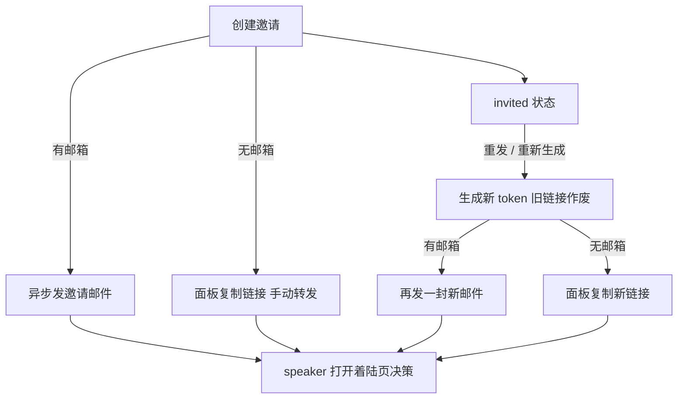

# Speaker 邀请邮件与链接重发 - Plan

## Goal Capsule

- **Objective:** 组织者填了邮箱创建 speaker 邀请后,speaker 直接收到一封可点开着陆页的邀请邮件,不再依赖组织者手动转发链接;邮件没收到或链接丢失时,组织者在邀请列表一键重发/重新生成,任何未决策邀请都不再陷入「链接永久丢失」的死锁。
- **Product authority:** 产品决策由项目 owner 在 brainstorm 对话中拍板;本计划只管 Event 的 speaker 邀请这一封邮件及其重发,workspace 成员邀请与状态变更通知不是本轮范围。
- **Open blockers:** 无。

---

## Product Contract

### Summary

创建 speaker 邀请时若填写了邮箱,系统在请求路径内异步发出一封中文邀请邮件(活动、workspace、邀请人、主题、时间、备注、着陆页链接);邀请列表中所有 invited 状态的行提供「重发/重新生成链接」——重新生成 token 使旧链接作废,有邮箱的再发一封新邮件,没邮箱的返回新链接供组织者复制转发。

### Problem Frame

邀请表单收集了 speaker 邮箱,但今天它只用于接受时的账号匹配校验——邀请链接仍要组织者从创建响应里手动复制、自行转发。更尖锐的是三个既有约束叠加成死锁:明文 token 只在创建那一刻返回一次(库中只存哈希),组织者刷新页面后链接不可重建;同一 Event 同一邮箱在邀请未终结前被唯一索引挡住,无法重新邀请;资源没有作废(cancel)动作。组织者一旦忘记复制链接,或转发的链接丢失,这条邀请就只能等 speaker 永远等不到的决策,除非人工改库。

### Key Decisions

- KD1. **邮件在创建/重发请求路径内异步直发(尽力而为),不走队列重试,也不走既有信号/通知系统。** 明文 token 不落库是既有安全设计,而 Oban job args 与信号 outbox 都持久化落库;发送失败的补救是 KD2 的重发,不是基础设施重试。(session-settled: user-approved — chosen over 可靠队列投递: 明文链接不落库,发丢了由重发按钮补救) Governs R4, R11。
- KD2. **重发 = 重新生成 token,旧链接作废,再发一封。** 库中只存哈希,系统自己也无法重发「同一封」邮件;重新生成同时覆盖存量邀请与刷新丢链接场景。(session-settled: user-directed — chosen over 只发送不重发 / 作废后重邀: 邮件未达目前没有自救路径,重发一键覆盖全部场景) Governs R6, R7。
- KD3. **重发对所有 invited 邀请开放,不限有邮箱的。** 没填邮箱的邀请(手动转发场景)同样受刷新丢链接死锁影响,对它们「重发」表现为重新生成链接、不发邮件。(session-settled: user-directed — chosen over 仅对有邮箱邀请开放: 同一个死锁问题一并解决) Governs R6, R8。
- KD4. **邮件为中文单语。** 现有邮件先例(密码重置)即中文硬编码;着陆页本身已有中英双语承接。(session-settled: user-approved — chosen over locale 感知双语邮件: 目标社区以中文为主,双语邮件另议) Governs R3。

### Actors

- A1. 组织者:workspace 的 Owner/Admin,创建邀请、触发重发。
- A2. 被邀请 speaker:收件人,可能尚无平台账号;经邮件链接到达着陆页完成接受/婉拒。

### Key Flows

- F1. 创建即发送
  - **Trigger:** A1 在 Event 详情页提交邀请表单,填写了 speaker 邮箱。
  - **Steps:** 邀请创建成功(现有流程不变,面板可复制链接)→ 系统异步向该邮箱发出邀请邮件 → A2 点邮件链接到达着陆页,登录/注册后接受或婉拒(现有流程)。
  - **Outcome:** A2 无需任何人转发即可决策;发送失败不影响邀请已创建的事实。
- F2. 重发 / 重新生成链接
  - **Trigger:** A1 在邀请列表对一条 invited 状态的邀请点「重发」(有邮箱)或「重新生成链接」(无邮箱)。
  - **Steps:** 系统重新生成 token(旧链接即刻作废)→ 新明文链接返回给面板供复制 → 有邮箱的同时异步发出新邮件。
  - **Outcome:** 「没收到 / 进垃圾箱 / 刷新丢链接」都有一键自救;持旧链接打开着陆页的人看到现有的统一无效态。

### Requirements

**发送**

- R1. 创建邀请时填写了 speaker 邮箱,系统自动向该邮箱发出邀请邮件;未填邮箱则不发,保留现有手动转发语义。
- R2. 邮件内容包含:活动名称、活动所在 workspace 名称、邀请人名字和邮箱、分享主题(如有)、分享时间(如有)、备注(如有)、指向 speaker 着陆页的邀请链接。
- R3. 邮件为中文单语。Per KD4。
- R4. 发送异步进行且尽力而为:不阻塞、不回滚邀请创建;失败记录日志与遥测,不回写邀请状态。Per KD1。
- R5. 邀请人账号无邮箱时(如手机号注册用户),邮件中只显示邀请人名字,省略邮箱,不阻塞发送。

**重发与重新生成**

- R6. 所有 invited 状态的邀请提供重发/重新生成入口;终态(declined/completed)与 accepted 状态不提供。Per KD2, KD3。
- R7. 重发/重新生成即重新生成 token:旧链接立即失效,持旧链接访问着陆页呈现现有的统一无效态。Per KD2。
- R8. 操作成功后面板立即持有新明文链接可复制;有邮箱的邀请同时发出新邮件,无邮箱的仅更新链接。Per KD3。
- R9. 重发/重新生成的权限与创建邀请一致(workspace Owner/Admin)。
- R10. 重发有轻量防误触保护(如短时冷却/连点保护),防止组织者误发多封;严格的后端限流不在本轮。

**反馈**

- R11. 界面对发送结果的措辞不承诺送达(如「邀请邮件已发出」),因为发送是尽力而为;创建成功与重发成功各有明确提示。Per KD1。

### Acceptance Examples

- AE1. **Covers R1, R2.** Given 组织者创建邀请并填写邮箱,When 创建成功,Then 该邮箱收到中文邀请邮件,含活动名、workspace 名、邀请人名字和邮箱、链接;点链接到达着陆页并可决策。
- AE2. **Covers R1.** Given 创建邀请未填邮箱,When 创建成功,Then 不发出任何邮件,面板行为与现状一致。
- AE3. **Covers R4.** Given 邮件通道故障,When 组织者创建带邮箱的邀请,Then 邀请仍创建成功、面板链接仍可复制,失败仅落日志/遥测。
- AE4. **Covers R5.** Given 邀请人账号无邮箱,When 邮件发出,Then 邮件只显示邀请人名字,无邮箱行。
- AE5. **Covers R6, R7, R8.** Given 一条 invited 且有邮箱的邀请,When 组织者点重发,Then 新邮件发出、面板可复制新链接;speaker 打开旧邮件里的链接看到统一无效态。
- AE6. **Covers R6, R8.** Given 一条 invited 且无邮箱的邀请(组织者已刷新过页面,原链接丢失),When 点重新生成链接,Then 面板持有可复制的新链接,且未发出邮件。
- AE7. **Covers R6.** Given 邀请已是 accepted/declined/completed,When 查看邀请列表,Then 该行不出现重发/重新生成入口。

### Scope Boundaries

- 不做可靠队列投递、送达状态跟踪(webhook/打开率)——KD1 的取舍。
- 不做接受/婉拒/完成时的邮件通知(站内通知已有,邮件化另议)。
- 不做 workspace 成员邀请的同构邮件——独立后续工作。
- 不做作废(cancel)动作——重发已覆盖本轮要解决的死锁。
- 不做双语/locale 感知邮件——KD4 的取舍。
- 不做严格后端限流——与既有安全加固 backlog(issue #297)同类,一并另议。

<!-- ce-section: work-relationships -->
### How This Work Fits Together

本计划只管 Event 的 speaker 邀请邮件与重发。周边是当前理解,不是承诺的路线图:

- workspace 成员邀请(`backend/lib/cgc_2046/accounts/invitation.ex`,`target_email` 同样存在且今天同样不发邮件)——Shares 本轮确立的「请求路径内直发 + 重新生成」模式,Can proceed independently of 本计划。
- 状态变更(接受/婉拒/完成)的邮件通知——Depends on 通知系统增加 email 通道的决策,与本轮的 token 邮件是不同通道,Still to decide 是否值得做。

### Dependencies / Assumptions

- 生产邮件通道(SendCloud)与 `web_base_url` 已配置且被密码重置邮件使用中——复用同一通道与发件身份。
- 假设邮件链接与密码重置先例一致,不带 locale 前缀,由前端默认 locale 承接。
- 假设发件人身份沿用全局配置(from/from_name),邮件内的「邀请人」以正文内容呈现,不改发件人。

### Outstanding Questions

- Deferred to Planning: 重发防误触的具体形式(前端冷却时长/禁用策略)。
- Deferred to Planning: 邮件模板的呈现细节(沿用密码重置的简洁 HTML 风格即可,具体排版由实现定)。
- Deferred to Planning: 重发动作与现有状态机/条件更新的具体衔接(仅 invited 可重发的并发保证)。

### Sources / Research

- `backend/lib/cgc_2046/events/speaker_invitation.ex` — 邀请资源:一次性明文 token(`issue/3`)、未终态唯一索引、无 cancel/resend 动作、信号为事务内 outbox(明文不可入)。
- `backend/lib/cgc_2046/accounts/send_password_reset_email.ex` — 邮件先例:请求路径内 `Task.start` 异步直发、失败日志+遥测、中文正文、`web_base_url` 拼链接。
- `backend/config/runtime.exs` — SendCloud 生产配置硬门禁与 `web_base_url`。
- `web/components/speaker-invitation-panel.tsx` — 组织者面板:明文 token 仅创建会话内存,链接形状 `/events/{slug}/speaker-invite/{token}`。
- `web/app/[locale]/events/[slug]/speaker-invite/[token]/page.tsx` — 着陆页:token 公开卡片、统一无效态、登录/注册承接。
- `backend/lib/cgc_2046/notification_fanout.ex`、`backend/lib/cgc_2046/workers/notification_worker.ex` — 通知系统今天只有站内通道,无 email 通道。
