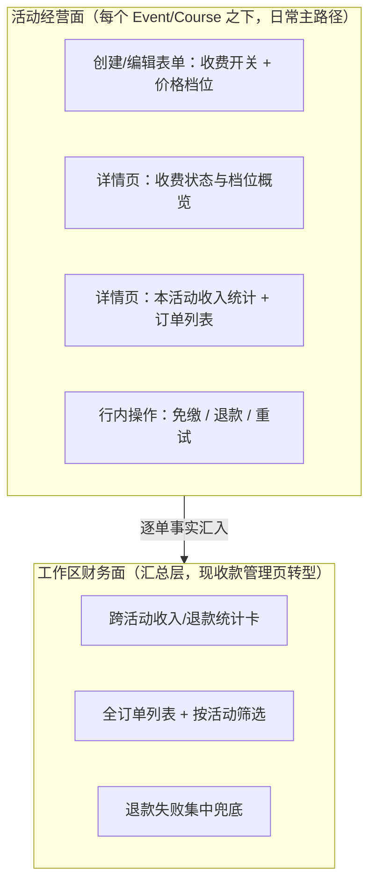
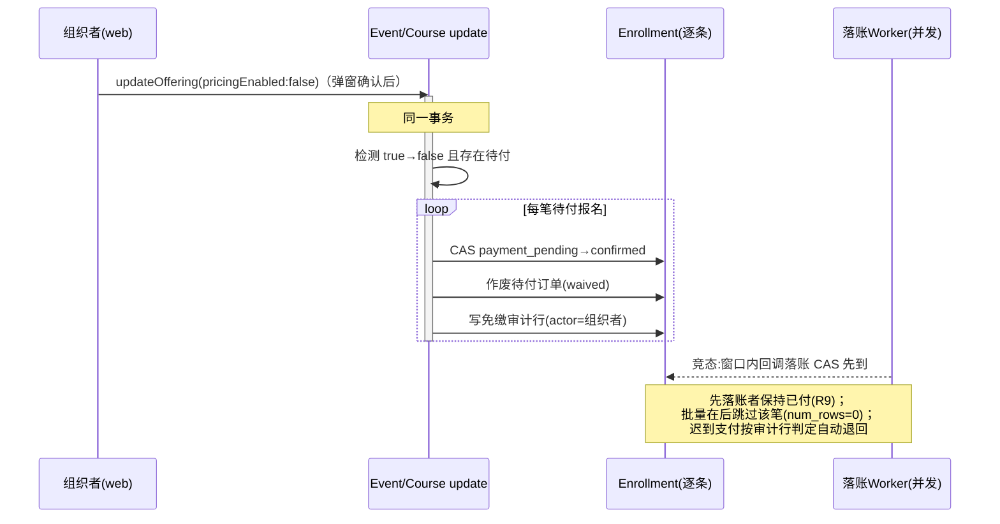

# Organizer Payment Experience - Plan

## Goal Capsule

- **Objective:** 主办方（Workspace Owner/Admin）在活动/课程自身的创建与管理流程内完成收费配置、订单管理与收款感知——发布一场收费活动不需要离开活动上下文；工作区级保留跨活动财务汇总。
- **Means:** 两层结构——活动经营面 + 工作区财务面（KD1）；实现全部延伸既有先例，不引入新抽象（KTD1–KTD9）。
- **Product authority:** 本文档 Product Contract。上游约束不被推翻：`docs/adr/0007-payment-architecture.md`（统一商户号、限时占位、退款即取消）与 `docs/plans/2026-08-15-024-feat-payment-loop-plan.md`（既有缴费闭环）。
- **Stop conditions:** 资金路径行为与 R9/R15/KTD4 的正确性约束冲突时停下询问；免费活动报名路径出现任何回归即停（AE4）。
- **Execution profile:** 后端单元先行（U1–U5），web 随后（U6–U9）；资金相关单元 test-first；每单元过 `mix precommit` / `pnpm` 门禁再前进。
- **Tail ownership:** commit / PR / CI 追踪由实施会话负责；本文档不承载执行进度。

---

## Product Contract

### Summary

把主办方的收钱体验重组为两层：定价与订单跟着活动走——创建/编辑表单内配置收费，活动详情页新增经营面（收费状态、本活动收入统计、订单列表与免缴/退款/重试操作）；工作区级只留财务汇总。同时补上资金安全守卫（关收费/删档警告、取消活动明示退款）和组织者收款通知。

### Problem Frame

2026-08-15 缴费闭环落地后，支付链路的大部分环节已完整：后端定价字段与校验、订单状态机、微信/支付宝真实适配器、小程序学员端缴费、退款与管理员免缴。但配置入口断裂：定价配置页（工作区设置下）是孤儿路由——设置导航没有它的条目，全站没有任何链接指向它，页面自身的标签栏也不含自己。创建/编辑活动的表单零定价字段。

真实后果已发生：workspace owner 本人不知道平台能收费，有活动和课程等着收费却从未配置过，在生产环境主动寻找也找不到入口。

走查还发现两类次生问题。资金安全盲区：取消 Event 会自动批量退款但确认弹窗只字不提钱；**取消 Course 则根本没有批量退款机制**——取消信号已发布但无退款监听者，已付订单原样滞留（违背「取消即批量退」的既定架构决策，per ADR-0007 家族拍板）；活动有已付订单后关闭收费或删除档位，前后端均无守卫；退款失败的订单显示红标却没有重试入口（后端重试能力存在但未暴露给任何客户端）。经营失明：组织者看不到「这场活动谁付了钱、收了多少」——统计与订单列表只有工作区维度；学员付款成功组织者收不到任何通知；订单超时双方都无通知。

### Key Decisions

- KD1. **两层结构：定价与订单随活动走，工作区级仅留财务汇总**（session-settled: user-approved — chosen over 修复工作区定价中心入口、创建轻量+详情页全量两案：owner 本人在生产中找不到定价入口，实证了集中式配置面的失败；票务领域惯例即钱随活动走。）Governs R1–R8。
- KD2. **关闭收费 = 警告后放行，待付单转免费确认**（session-settled: user-directed — chosen over 硬性禁止、放行但不处置待付单：灵活优先，且待付者的体验必须有定义而非等订单自然过期。）Governs R9。
- KD3. **收款通知逐笔实时推送**（session-settled: user-directed — chosen over 面板可见不推送、仅关键事件推送：社区活动规模下即时感优先于防通知疲劳。）Governs R12。
- KD4. **活动经营面统一「活动管理」能力门控，工作区财务面维持「成员管理」能力门控**（session-settled: user-approved。界面归属约定：经营面随详情页管理视角走 `manage_events`，财务面导航维持 `manage_members`。）Governs R14。
  - 修正（plan 阶段核实，用户已确认）：brainstorm 时的「配价与看订单能力错配」理由不成立——两能力由同一谓词派生（`backend/lib/cgc_2046/rbac.ex:139-141`），任何成员要么同时持有要么都不持有。本决策因此不涉及任何权限行为变化，纯为 UI 门控标注一致性；「志愿者组织者」类细粒度权限是 RBAC 结构改动，记入 Scope Boundaries 后续。

两层结构的操作归属：



### Requirements

**活动内定价配置**

- R1. 创建 Event/Course 的表单包含收费设置区：收费开关与价格档位（名称、金额、可选停售时间）。默认免费且收起，免费路径零额外操作。
- R2. 编辑表单支持同样的定价配置，就地修改。
- R3. 活动/课程详情页（管理视角）显示收费状态（收费中/免费）与档位概览。
- R4. 工作区级定价配置页退役，其配置能力由 R1–R3 承接。

**活动经营面：订单与操作**

- R5. 详情页提供本活动的收入统计：已收、待付、已退、退款失败待处理（与工作区面板同一套四数口径）。
- R6. 详情页提供本活动的订单列表：报名人、档位、金额、状态；默认展示非终态与已退款订单，终态（已取消/已过期）经状态筛选可见。
- R7. 订单支持行内操作：待付单免缴、已付单退款、退款失败单重试。
- R8. 工作区收款管理页转型为跨活动财务汇总：统计卡与全订单列表保留，订单列表增加按活动筛选，退款失败单在此集中兜底处理。

**资金安全守卫**

- R9. 有订单的活动关闭收费时，明示影响并需确认后执行：已付订单不自动退款、待付报名直接转免费确认且其订单作废。开关翻转与批量转换在同一事务内、以发起组织者为操作者；确认瞬间已完成支付者保持已付（不退款）。
- R10. 删除或修改金额的档位若已被已付订单引用，警告后放行（档位快照保证已付订单金额与有效性不受影响）；新增档位无需警告。
- R11. 取消收费 Event/Course 的确认弹窗明示将自动退款的笔数与总金额。
- R15. 取消收费 Course 时，已付订单获得与 Event 一致的批量原路退款（补齐缺失的 Course 侧退款机制；正常结束不退款的语义两者一致）。
- R16. 免费活动开启收费时，若存在待审批报名，明示影响并需确认后执行：已确认报名不受影响，待审批者通过后需选档付款。
- R17. 正常结束（close）收费活动的确认弹窗附一行披露：待付订单将自然过期，已付款不退。

**收款感知**

- R12. 学员付款成功时，组织者逐笔实时收到通知（含活动名、档位、金额）。送达为尽力而为（通道机制见 KTD6），经营面面板为可靠兜底。
- R13. 订单超时作废时，学员与组织者各收到通知：学员知晓名额已释放（报名截止未过时提示可重新报名，已过时不作此承诺），组织者知晓该笔待付已失效。

**权限口径**

- R14. 活动经营面全部操作（配价、订单查看、免缴、退款、重试）由「活动管理」能力门控；工作区财务面维持「成员管理」能力门控。（纯 UI 门控归属，无权限行为变化，见 KD4 修正。）

### Actors

- A1. 组织者：Workspace Owner/Admin（当前 RBAC 下即「活动管理」能力持有者）——配置定价、管理本活动订单、发起免缴/退款/重试。
- A2. 学员：报名缴费者——本次范围内报名与缴费行为不变，仅作为订单与通知的对端。
- A3. 平台管理员：退款兜底权维持现状（per ADR-0007）；本次不为其新增前端操作面。

### Key Flows

- F1. 发布收费活动
  - **Trigger:** 组织者创建活动/课程并打开收费开关。
  - **Steps:** 创建表单内配置档位 → 提交 → 落到详情页，收费状态与档位可见。
  - **Outcome:** 一步完成，全程不离开活动上下文。**Covers R1, R3.**
- F2. 售卖中管理
  - **Trigger:** 组织者打开活动详情页经营区。
  - **Steps:** 查看收入统计与订单列表 → 对个案执行免缴（志愿者）/退款/重试。
  - **Outcome:** 本活动的钱一屏可见可操作。**Covers R5, R6, R7.**
- F3. 改回免费（守卫流）
  - **Trigger:** 有订单的活动被关闭收费。
  - **Steps:** 弹窗明示「已付 N 人不退款、待付 M 人将免费确认」→ 组织者确认 → 待付单作废、对应报名转确认。
  - **Outcome:** 无人卡在「等着付一笔已不存在的钱」。**Covers R9.**
- F4. 取消活动（披露流）
  - **Trigger:** 组织者取消有已付订单的 Event 或 Course。
  - **Steps:** 确认弹窗明示「将自动退款 N 笔 共 ¥X」→ 确认 → 批量退款执行（Event 复用既有机制，Course 由 R15 补齐）。
  - **Outcome:** 批量退款不再被盲触发，也不再对 Course 缺席。**Covers R11, R15.**

### Acceptance Examples

- AE1. **Covers R9.** Given 活动有 3 笔已付、2 笔待付，When 组织者关闭收费并确认，Then 3 笔已付订单保持已付不退款，2 笔待付报名转确认且其订单作废。
- AE2. **Covers R10.** Given 已付订单引用档位 T1，When 组织者删除 T1 或修改其金额并在警告后确认，Then 该订单的金额与有效性不变。
- AE3. **Covers R11.** Given 收费活动有 5 笔已付订单，When 组织者发起取消，Then 确认弹窗显示自动退款 5 笔及总金额。
- AE7. **Covers R15.** Given 收费 Course 有已付订单，When 组织者确认取消，Then 已付订单批量原路退款、待付报名随取消作废——与 Event 取消行为一致；正常结束（closed）不触发退款。
- AE4. **Covers R1, R3.** Given 免费活动，When 组织者创建或查看详情，Then 收费设置保持收起、详情仅一行免费状态——免费路径零回归（per ADR-0007）。
- AE5. **Covers R12.** Given 学员完成支付且回调落账成功，Then 组织者收到一条含活动名、档位、金额的通知（微信订阅消息通道配置齐备时）。
- AE6. **Covers R14.** Given Owner/Admin 打开活动详情页，Then 经营区可见可操作（含退款）；Given 普通成员打开同页，Then 经营区不渲染；工作区财务面导航依「成员管理」能力显示。
- AE8. **Covers R16.** Given 免费活动有 2 笔待审批报名，When 组织者开启收费，Then 警告明示「已确认报名不受影响，2 名待审批者通过后需选档付款」，确认后生效。

### Scope Boundaries

- 学员侧缴费流程不动：价格披露、选档、下单、支付、轮询确认经走查确认完整。
- 小程序组织者侧维持 web-only 现状，不新增小程序端创建或定价能力。
- clip 端（非微信小程序构建）「请在网页端完成支付」缺跳转链接/二维码——学员侧断点，记录为后续候选，本次不修。
- 对账扩展（缴费对账规则⑦）、发票、财务导出不在本次范围。
- 定价新能力（折扣码、团购价、按人数阶梯）不做。
- RBAC 细粒度（如「志愿者组织者」仅持活动管理能力）需要权限结构改动，本次不做；R14 仅为 UI 门控归属。
- 平台管理员的前端资金操作面不新增（后端退款兜底权保留，走后端权威拦截）。

### Dependencies / Assumptions

- 后端创建/更新 Event 与 Course 的 GraphQL 输入已接受定价字段（已验证）——R1/R2 不需要新增后端字段面；web 端 `OfferingDraftInput`/`OfferingUpdateInput` 类型也已含定价字段，仅未发送。
- 退款重试的后端 action 存在且策略已与退款共管，但未暴露为 GraphQL mutation（已验证）——R7 依赖将其暴露，为一行 mutation 绑定。
- 订单查询与统计当前均无活动维度（订单筛选器无活动字段、统计仅工作区维度，已验证）——R5/R6/R8 需要后端查询面扩展；Order 上已有表达式计算字段自动进筛选输入的先例（tierName 等）。
- 档位快照机制已存在（下单物化档位与金额），R10 的语义由其保证（已验证）。
- 免缴 action 已存在于报名资源上，与 R9「待付转免费确认」语义一致（待付转确认 + 作废待付单）；但其现为单记录操作且要求操作者身份，批量场景需适配，且免缴后残留支付凭据的迟到支付由既有落账兜底自动退回（已验证）。
- Event 的取消批量退款由共享结束信号触发、按「已取消」状态判别（正常结束明确不退）；Course 发布同名信号但无退款监听者——R15 补的正是这个缺口（已验证缺失）。
- 通知模板现有三个（付款成功/退款成功/退款失败）；付款成功仅通知报名人（R12 需扩组织者收件人），退款两模板已含发起管理员；超时无任何模板，R13 需新增（已验证）。
- 已验证的非缺口（实施不要为这些建东西）：容量计数在报名占位时已扣、批量免费确认不会超容；Course 结束信号已有研究收割者订阅、双订阅互不干扰、幂等由状态判别+CAS 覆盖；作废/过期订单的迟到扣款已有自动原路退回兜底；订单列表所需列（档位名/报名人/报名状态）已作为计算字段存在。
- 部署依赖：R12/R13 的两个新通知模板需上线前在微信平台申请订阅消息模板并配置对应环境变量；未配置时通知静默跳过（既有 provider_not_configured 行为），不阻塞其余功能。

### Outstanding Questions

- Deferred to Implementation: 通知文案的最终措辞；守卫弹窗的具体文案（沿用既有 i18n 风格）；订单列表 keyset 分页的每页大小。

---

## Planning Contract

### Key Technical Decisions

- KTD1. **详情页经营区 = 自包含面板组件**：新组件自取数、自带测试文件，插入 `OfferingDetailPage` 的既有全宽面板栈（先例：`web/components/sponsorship-management.tsx`、`speaker-invitation-panel.tsx`）。不引入页签——该页无页签先例。Governs R3/R5/R6/R7 前端形态。
- KTD2. **订单活动维度 = Order 表达式计算字段**：在 Order 资源上加 `event_id`/`course_id` 表达式计算（`expr(enrollment.event_id)`），自动进入 `OrderFilterInput`，零 action/policy 改动（先例：`tierName`/`enrollmentStatus`/`learnerEmail`，`backend/lib/cgc_2046/payments/order.ex:120-143`）。Enrollment 无 GraphQL 对象类型，关系路径筛选不可用，计算字段是本仓库的惯用替代。
- KTD3. **单活动统计 = workspace_payment_stats 扩可选参数**：加可选 `event_id`/`course_id` 参数 + JOIN enrollments，四数形状（已收/待付/已退/退款失败待处理）与工作区口径同源；授权仍由 workspace_id 参数解析，不变。chosen over 新建独立 action 或 Ash aggregate（无先例，手写 SQL 是该资源既有形状）。
- KTD4. **关闭收费批量 = update 变更内检测 + 逐条复用免缴三元组**（继承 KD2 的 session-settled: user-directed）：Event/Course 的 update 动作检测 `pricing_enabled` true→false 且存在待付报名时，事务内逐条执行既有免缴三元组——CAS 待付转确认 + 作废待付单（`enrollment.ex:747-755`）+ 写免缴审计行；以发起组织者为操作者。正确性约束：落账兜底 worker 以「免缴审计行存在」判定迟到支付是否退回（`payment_settlement_worker.ex:198-211`），跳过审计行会让迟到支付被错误保留——三元组必须完整复用。窗口语义：翻转前落账成功者保持已付（CAS 先到先得）。Governs R9。
- KTD5. **Course 退款 = 扩展现有 worker 双信号订阅**：`EventCancelRefundWorker` 订阅 `["event.ended", "course.ended"]`，按 payload 键（`event_id`/`course_id`）分派（先例：`workflows/research_run_reaper.ex:15-37`）。chosen over 复制新 worker——键集分页、逐条隔离、审计逻辑零重复。前置：`AdminActionLog` 枚举补 `:event`/`:course` target_type 与 Course 批量 action 值——顺带修复现存 bug：Event 批量退款审计行因 `target_type: :event` 不在枚举而一直静默写入失败。枚举改动触发 Ash 迁移快照门禁。Governs R15。
- KTD6. **组织者通知 = 独立模板键，尽力送达**（继承 KD3 的 session-settled: user-directed）：新增 `payment_received`（组织者收款，数据含活动名/档位/金额）与 `payment_expired`（超时，学员+组织者），不复用学员侧 `payment_succeeded`（语义与数据形状不同，且 unique/stale 语义按收件人独立）。挂钩点：落账 worker 的通知函数加管理员收件人合并（先例：`payment_refund_worker.ex:218-226` 的 managers 合并写法）；过期 worker 的成功分支挂通知。新模板键 = 四处协调编辑（notification_worker 类型表、config.exs 三平台、runtime.exs 三平台+环境变量、payments 模板访问器），双射测试兜底。web 无站内通知面：推送尽力而为，可靠面 = 经营区面板（KTD1）。Governs R12/R13。
- KTD7. **档位编辑器 = 从孤儿页抽共享子组件**：`pricing-management.tsx` 的 `TierDraft[]` 状态 + 三个纯转换器 + 行块渲染抽为共享 TierEditor 子组件（props：drafts/onChange/manage），嵌入创建表单、编辑表单与详情面板；offering 选择器与保存壳留在原页随 R4 退役。JsonString 序列化遵循 caller-serializes 先例（`sponsorshipTiers` 同款）。Governs R1/R2 实现形态。
- KTD8. **定价页退役 = 删除**（非重定向）：孤儿路由无任何入站链接，重定向无服务对象。删除路由目录、导航类型联合中的死成员、双语言 i18n 键（键等值检查强制两边同删）。Governs R4。
- KTD9. **详情页编辑档位必须读全量档位字段**：现有详情查询只取 `availablePriceTiers`（后端已滤掉过期档），编辑面改用/加读 `priceTiers` 全量字段——否则保存会静默丢弃全部过期档位。Governs R2/R10 正确性。

### High-Level Technical Design

关闭收费批量转换（KTD4）的时序与竞态窗口：



Course 取消批量退款的信号分派（KTD5）：

```mermaid
flowchart TB
  EV[Event closed/cancelled] -->|event.ended| W[OfferingCancelRefundWorker<br/>（现 EventCancelRefundWorker 扩展）]
  CO[Course closed/cancelled] -->|course.ended| W
  W --> D{payload 键 + 重读实体状态}
  D -->|cancelled| R[批量：待付报名取消<br/>已付订单 start_refund→退款Worker<br/>审计行(修复后的枚举)]
  D -->|closed| N[明确不退款 no-op]
  D -->|未定态| RETRY[不认领，信号重投]
```

### Sequencing

Phase A（后端，U1→U5）先行：U1 是 U2 的枚举前置；U4 产出前端三单元共用的查询面。Phase B（web，U6→U9）依赖 U4 落地后的 schema；U10 收尾。

---

## Implementation Units

| U-ID | 一句话 | 关键文件 | 依赖 |
|---|---|---|---|
| U1 | 审计枚举修复与回归 | accounts/admin_action_log.ex | — |
| U2 | 退款 worker 双 offering 化 | workers/event_cancel_refund_worker.ex | U1 |
| U3 | 关闭收费批量免费确认 | events/event.ex, course.ex, enrollment.ex | — |
| U4 | 订单活动维度与重试暴露 | payments/order.ex | — |
| U5 | 支付通知补盲 | workers/, payments/notification_templates.ex | — |
| U6 | 档位编辑器组件化与表单集成 | web/components/offering-pages.tsx 等 | U4* |
| U7 | 详情页收费与订单面板 | web/components/(新面板) | U4 |
| U8 | 守卫与披露弹窗 | web/components/offering-pages.tsx 等 | U4, U6 |
| U9 | 财务面转型与定价页退役 | web/components/payments-management.tsx 等 | U4 |
| U10 | 术语与文档同步 | CONTEXT.md | U1–U9 |

*U6 仅在编辑面需要 U4 的已售档数据时弱依赖；表单本体不依赖。

### U1. 审计日志枚举修复与回归测试

- **Goal:** `AdminActionLog` 能真实记录 Event/Course 批量退款——修复现存的静默写入失败。
- **Requirements:** R15 前置；独立 bug 修复（Event 侧批量退款审计自上线以来未落一行）。
- **Dependencies:** 无。
- **Files:** `backend/lib/cgc_2046/accounts/admin_action_log.ex`；`backend/test/cgc_2046/payments/refund_test.exs`；迁移快照（`mix ash_postgres.generate_migrations --snapshots-only` 产物）。
- **Approach:**
  1. `target_type` 枚举补 `:event`、`:course`；`action` 枚举补 Course 批量退款值（与既有 `event_cancel_batch_refund` 命名对齐）。
  2. 重新生成迁移快照（枚举约束改动触发 CI `--check` 门禁）。
- **Patterns to follow:** 枚举定义在 `admin_action_log.ex:37-64`；快照义务见 `backend/AGENTS.md:111`。
- **Test scenarios:**
  - 回归：Event 批量退款路径写入的审计行（`target_type: :event`）通过校验并可查回——现状它抛校验错误且被 `Logger.warning` 吞掉。
  - Course 值同样通过校验。
- **Verification:** `mix test` 该文件通过；`mix ash_postgres.generate_migrations --check` 绿。
- **Execution note:** 先写现状失败的回归测试（红），再改枚举（绿）。

### U2. 退款 worker 双 offering 化

- **Goal:** 取消收费 Course 时已付订单批量原路退款，与 Event 行为一致。
- **Requirements:** R15、AE7；KTD5。
- **Dependencies:** U1。
- **Files:** `backend/lib/cgc_2046/workers/event_cancel_refund_worker.ex`（可随扩展更名，注意 `application.ex:32` 子进程注册同步）；`backend/test/cgc_2046/payments/refund_test.exs`。
- **Approach:**
  1. 订阅 patterns 扩为 `["event.ended", "course.ended"]`，按 payload 键分派到 Event/Course 读取。
  2. Course 分支复用既有键集分页 + 逐条隔离 + 审计路径；`closed` 明确 no-op、未定态不认领重投（照 Event 分支）。
- **Patterns to follow:** 双信号分派先例 `backend/lib/cgc_2046/workflows/research_run_reaper.ex:15-37`；既有 Event 分支结构 `event_cancel_refund_worker.ex:44-146`。
- **Test scenarios:**
  - Covers AE7. Course cancelled：已付订单进入 refunding 且退款 job 入队；待付报名转取消。
  - Course closed：零订单变化（明确不退）。
  - 信号重投幂等：同一 idempotency_key 二次投递不重复退款。
  - Event 既有用例零回归。
- **Verification:** `refund_test.exs` 全绿；审计行按 U1 修复后的枚举可查。
- **Execution note:** 资金路径，test-first。

### U3. 关闭收费的批量免费确认

- **Goal:** `pricing_enabled` true→false 时待付报名事务内转免费确认，订单作废，审计完整。
- **Requirements:** R9、AE1；KTD4。
- **Dependencies:** 无（与 U1/U2 并行安全）。
- **Files:** `backend/lib/cgc_2046/events/event.ex`、`course.ex`（update 动作 change）；`backend/lib/cgc_2046/events/enrollment.ex`（批量适配，复用 `prepare_waive` 三元组）；`backend/test/cgc_2046/events/` 相应测试。
- **Approach:**
  1. Event/Course update 动作加 change：检测 `pricing_enabled` true→false，事务内逐条执行免缴三元组（CAS 转确认 + `void_pending_orders(id, "waived")` + 免缴审计行），actor 取自 update 的操作者。
  2. 开启方向（false→true）不做后端拦截（披露在前端 U8；待审批者通过后自然进 payment_pending，`enrollment.ex:662-671` 既有语义）。
- **Patterns to follow:** 三元组 `enrollment.ex:783-800`（`claim_waive` CAS）与 `:747-755`（作废订单）；落账竞态语义 `:757-768`。
- **Test scenarios:**
  - Covers AE1. 3 已付 + 2 待付 → 关闭收费：已付不动，2 笔转确认、订单 cancelled(waived)、每笔有免缴审计行。
  - 竞态：批量执行前某笔已被落账 CAS 转确认 → 批量跳过该笔（num_rows=0），其订单保持已付。
  - 迟到支付：批量转换后的报名收到渠道迟到扣款 → 落账兜底按免缴审计行自动原路退回（KTD4 正确性约束的直接验证）。
  - 无订单的免费↔收费切换零副作用（AE4 回归面）。
- **Verification:** 事务内全部成功或全部回滚；`mix precommit` 绿。
- **Execution note:** 资金路径，test-first；迟到支付用例必须存在（守护 KTD4 的审计行依赖）。

### U4. 订单活动维度与重试暴露

- **Goal:** 订单与统计获得活动维度；退款重试可从客户端触发。
- **Requirements:** R5、R6、R7、R8 后端面；KTD2、KTD3。
- **Dependencies:** 无。
- **Files:** `backend/lib/cgc_2046/payments/order.ex`；`backend/test/cgc_2046_web/graphql_payment_admin_test.exs`；`backend/priv/graphql/schema.graphql`（编译再生成）；`miniprogram/src/api/generated/*`（codegen 再生成提交）。
- **Approach:**
  1. Order 加公开表达式计算 `event_id`/`course_id`（自动进 OrderFilterInput）。
  2. `workspace_payment_stats` 加可选 `event_id`/`course_id` 参数 + JOIN enrollments；四数口径不变。
  3. graphql mutations 块加 `update(:retry_refund, :retry_refund)` 一行。
- **Patterns to follow:** 计算字段先例 `order.ex:120-143`；stats 手写 SQL 形状 `order.ex:387-425`；mutation 绑定形状 `order.ex:494-499`；权限矩阵测试模板 `graphql_payment_admin_test.exs`。
- **Test scenarios:**
  - 按 event_id 筛选 workspace_orders 只返回该活动订单；course_id 同。
  - 带 offering 参数的 stats 与全工作区 stats 口径一致（同一状态集分桶）。
  - retryRefund：refund_failed → refunding 且退款 job 入队；对 paid 状态调用被拒；权限矩阵 Owner/Admin 可、成员 403、PlatformAdmin 可。
- **Verification:** `mix test` 绿；`mix compile` 后 schema.graphql 已更新；`cd miniprogram && pnpm codegen` 后 generated 无未提交 diff（CI check:ci 口径）。

### U5. 支付通知补盲

- **Goal:** 组织者逐笔收到收款通知；订单超时双方收到通知。
- **Requirements:** R12、R13、AE5；KTD6。
- **Dependencies:** 无。
- **Files:** `backend/lib/cgc_2046/workers/notification_worker.ex`（类型表）；`backend/config/config.exs`、`backend/config/runtime.exs`（三平台模板配置+环境变量）；`backend/lib/cgc_2046/payments/notification_templates.ex`；`backend/lib/cgc_2046/workers/payment_settlement_worker.ex`、`payment_expiry_worker.ex`；`backend/test/cgc_2046/workers/notification_worker_test.exs` 等。
- **Approach:**
  1. 新模板键 `payment_received`（组织者，data 含活动名/档位名/金额）与 `payment_expired`（学员+组织者），四处协调编辑齐全。
  2. 落账 worker 的通知函数合并管理员收件人（managers 合并先例）；过期 worker 的成功过期分支挂通知。
  3. 超时学员文案按报名截止是否已过分叉（R13 的不承诺语义），数据键携带该标志。
- **Patterns to follow:** 收件人合并 `payment_refund_worker.ex:218-226`；过期挂钩点 `payment_expiry_worker.ex:86-95`；`payment_data/1` 是 payload builder 先例（扩展它而非另起炉灶）。
- **Test scenarios:**
  - Covers AE5. 落账成功 → 组织者们各收到一条 payment_received，data 含活动名/档位/金额；学员 payment_succeeded 不受影响。
  - 订单过期 → 学员与组织者各一条 payment_expired；截止已过时学员数据不含「可重新报名」标志。
  - 双射测试：类型表与三平台配置键一致。
  - 模板未配置（provider_not_configured）→ 静默跳过不报错。
- **Verification:** `notification_worker_test.exs` 双射绿；`mix precommit` 绿。
- **Execution note:** test-first；新环境变量在 plan 的部署依赖中已声明，实施时在 runtime.exs 注释清楚。

### U6. 档位编辑器组件化与表单集成

- **Goal:** 创建/编辑表单内可配置收费；档位编辑逻辑单一来源。
- **Requirements:** R1、R2、AE4；KTD7、KTD9。
- **Dependencies:** 弱依赖 U4（编辑面「已售档」警告数据；表单本体不依赖）。
- **Files:** 新 `web/components/tier-editor.tsx`（从 `pricing-management.tsx` 抽取）；`web/components/offering-pages.tsx`（创建 ~:1376-1421、编辑 ~:585-660 两处集成）；`web/lib/graphql/events.ts`（GET_EVENT/GET_COURSE 加 `priceTiers`）;`web/components/offering-pages.test.tsx`（mock 块更新）；`web/messages/zh-CN.json` + `en.json`。
- **Approach:**
  1. 抽取 TierDraft 状态 + 三个纯转换器 + 行块渲染为 TierEditor（props: drafts/onChange/manage）；`pricing-management.tsx` 原页暂改用该组件（U9 再整页退役）。
  2. 创建表单加「收费设置」折叠区：开关默认关（免费默认收起，AE4）；开启时至少一档的客户端校验对齐后端 PriceTiersValidation（金额 ≥ 1 分、缺名拒绝）。
  3. 提交时 caller-serializes：`priceTiers: validTiers.map(t => JSON.stringify(t))`（sponsorshipTiers 同款）。
  4. 编辑表单同区块；详情查询补 `priceTiers` 全量字段（KTD9——防止保存丢过期档）。
- **Patterns to follow:** 表单 state 惯例（创建每字段 useState、编辑 MetaDraft 对象）`offering-pages.tsx:1376-1387/:410-423`；序列化先例 `offering-pages.tsx:1306`；错误映射 `friendlyOfferingError`。
- **Test scenarios:**
  - Covers AE4. 免费创建：收费区收起、提交 payload 不含定价字段变化、详情一行免费态。
  - 开启收费但零档位 → 客户端拦截提交。
  - 创建收费活动：payload 含 pricingEnabled + 序列化档位；成功后详情显示档位。
  - 编辑面加载含过期档的活动 → 全量档位可见可编辑，保存不丢过期档（KTD9 回归）。
- **Verification:** `cd web && pnpm vitest` 相关文件绿；`pnpm typecheck && pnpm lint` 绿；i18n 键双语等值检查绿。

### U7. 详情页收费与订单面板

- **Goal:** 组织者在活动详情页看到本活动的钱并可操作。
- **Requirements:** R3、R5、R6、R7 前端、AE6；KTD1。
- **Dependencies:** U4。
- **Files:** 新 `web/components/offering-payments-panel.tsx` + 同名 test；`web/components/offering-pages.tsx`（面板栈插入 + 详情页收费状态行）；`web/lib/`（订单查询封装复用 payments-management 的取数路径，带 offering 筛选）；i18n 双语键。
- **Approach:**
  1. 自包含面板：`manage = canManageEvents(...)` 门控渲染（AE6）；`pricing_enabled: false` 时收敛为一行免费状态 + 开启入口。
  2. 四数统计卡（带 offering 参数的 stats）；订单列表（event_id/course_id 筛选 + keyset 分页），默认非终态+已退款，终态经状态筛选。
  3. 行内操作复用既有 mutation：免缴（waivePayment）、退款（refundOrder，二次确认先例照 `payments-management.tsx:338-368`）、重试（U4 新 retryRefund）。
- **Patterns to follow:** 面板先例 `sponsorship-management.tsx`（自取数+own test）；列表/操作先例 `payments-management.tsx`。
- **Test scenarios:**
  - Covers AE6. manage 用户见面板可操作；非 manage 用户不渲染。
  - 四数与订单列表按本活动过滤（不同活动订单不串）。
  - refund_failed 行出现重试按钮，点击后行状态转 refunding（此前该状态无任何操作入口的回归对照）。
  - 免费活动 → 一行免费状态 + 开启入口，不拉订单查询。
- **Verification:** 面板测试文件绿；`offering-pages.test.tsx` 面板 stub 更新后全绿。

### U8. 守卫与披露弹窗

- **Goal:** 四类资金相关操作全部有明示披露：关收费、开收费、删/改已售档、取消与结束。
- **Requirements:** R9、R10、R11、R16、R17 前端、AE1/AE2/AE3/AE8；KD2。
- **Dependencies:** U4（弹窗数字来自 offering stats/订单数据）、U6（编辑面）。
- **Files:** `web/components/offering-pages.tsx`（transition 确认块 ~:1213-1276 扩展）；`web/components/tier-editor.tsx` 或编辑区（已售档警告）；i18n 双语键（`transitionConfirmCancel` 邻域）。
- **Approach:**
  1. 关闭收费：确认弹窗显示「已付 N 人不退款、待付 M 人将免费确认」（数字来自 U4 stats/订单计数），确认后才发 updateOffering。
  2. 开启收费（编辑面，活动已有报名）：披露「已确认不受影响、待审批 M 人通过后需付款」（AE8）。
  3. 删除/修改金额的已售档：从面板订单数据派生已售 tier id 集合，命中时警告（快照保护语义写进文案）。
  4. 取消收费活动：确认文案扩为「将自动退款 N 笔 共 ¥X」（R11）；close 加一行「待付订单将自然过期，已付款不退」（R17）；免费活动两处文案不变。
  5. 披露数字为确认时点快照，文案用「约」语气容忍执行窗口内变化。
- **Patterns to follow:** 两步确认先例 `offering-pages.tsx:1215-1250`（inline warning 替换按钮）；amber banner 先例 `payments-management.tsx:338-368`。
- **Test scenarios:**
  - Covers AE1（前端半）. 关闭收费弹窗显示正确 N/M，取消则不发 mutation。
  - Covers AE8. 开启收费且有待审批 → 披露 M；无待审批 → 直接保存无弹窗。
  - Covers AE2（前端半）. 删除/改价已售档触发警告；未售档静默。
  - Covers AE3. 取消收费活动弹窗含笔数与总金额；免费活动文案不变；close 含 R17 一行。
- **Verification:** 相关组件测试绿；i18n 键双语齐。

### U9. 财务面转型与定价页退役

- **Goal:** 工作区收款页获得活动筛选成为财务汇总层；孤儿定价页删除。
- **Requirements:** R4、R8、KTD8。
- **Dependencies:** U4（筛选字段）；U6（TierEditor 已迁出）。
- **Files:** `web/components/payments-management.tsx`（活动筛选下拉）；删除 `web/app/[locale]/w/[slug]/settings/pricing/` 与 `web/components/pricing-management.tsx`；`web/components/workspace-nav.ts`（`"settings-pricing"` 联合成员与注释清理）；`web/messages/zh-CN.json` + `en.json`（`workspacePages.pricing` 与 picker 专属键删除，两边同删）。
- **Approach:**
  1. payments 页筛选区加活动选择（workspace offerings 列表复用），选中后订单查询带 event_id/course_id 过滤；统计卡保持工作区口径（活动维度看板在 U7 详情页）。
  2. 定价页整目录删除；类型联合、导航注释、i18n 键同步清理。
- **Patterns to follow:** 既有状态筛选形状 `payments-management.tsx:183-211`。
- **Test scenarios:**
  - 选中某活动 → 列表只含该活动订单；清除筛选恢复全量。
  - 删除后：`pnpm typecheck` 无对已删模块的引用残留；i18n 键等值检查绿。
- **Verification:** `pnpm typecheck && lint && test && build` 全绿。

### U10. 术语与文档同步

- **Goal:** CONTEXT.md 与实现同步，术语单一来源不漂移。
- **Requirements:** 仓库文档纪律（CONTEXT.md 为术语权威）；先例：payment-loop plan 的文档同步单元。
- **Dependencies:** U1–U9 落定后。
- **Files:** `CONTEXT.md`（Order 词条补活动维度查询面与 retryRefund；管理员免缴词条补「关闭收费批量转换复用其三元组」语义；Event/Course 词条或新词条记录「活动经营面/工作区财务面」两层归属与定价页退役；通知面补两个新模板键）。
- **Approach:** 按既有词条格式（定义 + 架构位置）增改；不新建平行文档。
- **Test scenarios:** Test expectation: none — 纯文档。
- **Verification:** 词条与最终实现一致；无留存对已删定价页的引用。

---

## Verification Contract

| 命令 | 范围 | 门槛 |
|---|---|---|
| `cd backend && mix precommit` | 编译（警告即错）+ 格式 + 测试 | U1–U5 每单元后绿 |
| `cd backend && mix ash_postgres.generate_migrations --check` | 枚举/资源快照一致 | U1 后必须绿 |
| `cd backend && mix test test/cgc_2046/payments/ test/cgc_2046/events/` | 资金回归面 | AE1/AE2/AE7 对应用例在列 |
| `cd web && pnpm typecheck && pnpm lint && pnpm test && pnpm build` | web 全门禁（test 含 i18n 键等值与硬编码中文扫描） | U6–U9 每单元后绿 |
| `cd miniprogram && pnpm check:ci` | codegen 无漂移 | U4 改 schema 后必须绿（重生成并提交 generated） |

质量门：免费活动创建/报名路径零回归（AE4）是全程红线；资金单元（U2/U3/U5）test-first；批量退款审计行可查询（U1 修复后的口径）。

---

## Definition of Done

- 全局：R1–R17 全部有落地实现与对应测试；AE1–AE8 各有至少一条测试直接覆盖（`Covers AE<N>` 标注）；上表五条命令全绿；两个新通知模板的环境变量在部署文档/运维侧登记（未配置时静默跳过已验证）。
- 每单元：其 Verification 条目满足；资金单元额外要求竞态/迟到支付用例在列。
- 清理：`pricing-management.tsx` 与定价路由删除后无死引用；实验性/弃用代码不留在 diff；CONTEXT.md 同步完成（U10）。
- Product Contract preservation note：restructured + changed —— R9/R10/R11/R12/R13 增补限定语句，R16/R17/AE8 新增（研究驱动、用户 2026-08-24 会话确认），KD4 rationale 修正（原「能力错配」前提被 rbac.ex 证伪），AE6 重述为可实现口径；R1–R8/R14/R15 含义未变；无 ID 重编号。

---

## Sources / Research

- `docs/adr/0007-payment-architecture.md` — 缴费架构拍板：统一商户号、占位限时支付、迟到支付原路退、退款即取消报名。
- `docs/plans/2026-08-15-024-feat-payment-loop-plan.md` — 既有缴费闭环 14 单元（本工作在其之上补组织者体验层）。
- 走查证据锚点：`web/components/offering-pages.tsx`（创建/编辑表单与详情页）、`web/components/workspace-nav.ts`（设置导航，定价条目缺失处）、`web/components/pricing-management.tsx`（现有档位编辑器，抽取来源）、`web/components/payments-management.tsx`（现有订单管理面）、`backend/lib/cgc_2046/payments/order.ex`（订单 actions 与统计）、`backend/lib/cgc_2046/events/price_tier.ex`（档位校验与快照规则）、`backend/lib/cgc_2046/payments/notification_templates.ex`（通知模板现状）、`backend/lib/cgc_2046/workers/event_cancel_refund_worker.ex`（Event 取消批量退款：订阅共享结束信号、按已取消状态判别执行，正常结束不退；Course 无对应监听者，R15 缺口证据）。
- 关键机制锚点（plan 阶段核实）：`backend/lib/cgc_2046/rbac.ex:139-141`（两管理能力同谓词派生，KD4 修正依据）；`backend/lib/cgc_2046/workers/payment_settlement_worker.ex:198-211`（迟到支付按免缴审计行判定，KTD4 正确性约束）；`backend/lib/cgc_2046/events/enrollment.ex:747-800`（免缴三元组与落账 CAS）；`backend/lib/cgc_2046/workflows/research_run_reaper.ex:15-37`（双信号 worker 先例）；`backend/lib/cgc_2046/accounts/admin_action_log.ex:37-64`（枚举缺值，现存审计静默失败）；`web/lib/graphql/events.ts:216-250`（详情查询缺 priceTiers 全量字段，KTD9 依据）。
