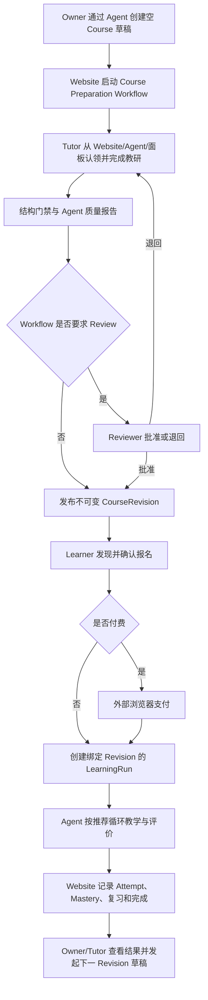

# OpenClacky BYO 多角色 Agent 核心旅程 - Plan

## Goal Capsule

- **Objective:** 让平台管理员、Workspace Owner/Admin、Tutor 与 Learner 安装同一套开源 OpenClacky 扩展后，可以通过 Agent 对话与右侧上下文面板完成各自的核心职责，并打通「开课 → 教研 → 审核发布 → 发现报名 → 支付 → 自适应学习 → 结果反馈」黄金链路。
- **Means:** 用户本地 BYO OpenClacky 负责对话与执行，CGC 网站负责身份、权限、Workflow、共享草稿、课程版本、交易和结构化学习记忆，扩展负责角色入口与上下文面板。
- **Product authority:** 本轮角色旅程讨论中的用户决策，以及 `docs/adr/0001-website-as-mcp-server-byo.md`、`docs/adr/0002-workflow-first-jido.md`、`docs/adr/0005-workflow-run-worthiness.md` 的既有边界。
- **Open blockers:** 无。尚未确定的实现细节由后续规划在本产品契约内选择，不得重新发明产品行为。

---

## Product Contract

### Summary

把现有网站能力组织成一个角色感知的 OpenClacky 工作台：同一个 CGC Assistant 根据用户身份、当前 Workspace 与任务加载对应工作模式，Agent 对话和可编辑侧边栏共同操作网站上的同一份业务状态。

第一条必须跑通的黄金链路是：Owner 发起一个可以为空的 Course 草稿，Tutor 通过 Agent 与面板完成教研，Course Preparation Workflow 按策略审核并发布，Learner 通过 Agent 发现、报名、支付和学习，Owner/Tutor 最终看到报名与学习结果。

### Problem Frame

平台已经有平台后台、Workspace 管理、Workflow、课程内容、报名支付、公开发现、学习记录和 OpenClacky 面板，但这些能力仍是分散的页面与工具。不同角色无法从一个清晰入口知道“我现在可以做什么、接下来应完成什么、这次操作会产生什么结果”。

当前课程面板是只读视图，并从已有学习记录反推课程；新报名但尚未产生记录的课程不会出现。课程内容是无版本的活文档，学习记录按 checklist 最新值覆盖，学习 Agent 线性选择第一个未完成 Issue。这些设计足以展示最小闭环，但不足以支撑跨角色交接、可审计评价、课程迭代和真正的自适应路径。

### Key Decisions

- **本地 BYO OpenClacky 是当前唯一 Agent 执行宿主。** (session-settled: user-directed — chosen over `oc.codingirlsclub.com` 或平台托管 Agent: `oc` 是企业 license 管理服务，当前产品链路只依赖用户本地 OpenClacky 与开源扩展) Governs R1, R2
- **一套扩展、一个 CGC Assistant、多个角色工作模式。** 按身份和任务动态加载角色 Playbook，避免多 Agent 安装、切换和版本漂移。Governs R2-R6
- **网站承担跨用户共享状态。** (session-settled: user-directed — chosen over OpenClacky 任务收件箱与跨客户端派活: Owner 与 Tutor 的交接应由网站 Workflow、任务和草稿承载) Governs R7, R8, R20
- **Agent 对话与可编辑侧边栏是两个等价入口。** (session-settled: user-directed — chosen over 只在对话里补齐和确认信息: 面板让用户看清正在编辑、即将创建和等待确认的内容) Governs R5, R9-R11
- **Owner 可以零输入发起 Course 草稿，Tutor 负责把它做完整。** (session-settled: user-directed — chosen over Owner 必须先填完整课程表单: 开课发起与教研生产是不同角色的职责) Governs R21, R24, R25
- **审核和最终发布由 Course Preparation Workflow 策略决定。** (session-settled: user-directed — chosen over Tutor 完成后再临时通知 Owner 决定: review、reviewer 与 direct publish 应在流程启动时确定) Governs R22, R23, R27, R28
- **审核默认开启，但允许 Workspace 关闭；Reviewer 可以是任一 Workspace 成员，包含 Tutor 本人。** (session-settled: user-directed — chosen over 强制 Owner 终审或禁止自审: 小团队需要低摩擦，审计与质量门禁负责透明度) Governs R22, R28
- **Learner 的发现范围是全部公开 Offering 加本人有权访问的 Workspace Offering。** (session-settled: user-directed — chosen over 只看公开内容或只看当前 Workspace: 学员需要一个完整且不越权的发现面) Governs R30
- **支付在网站的外部浏览器页面完成。** (session-settled: user-directed — chosen over 在 OpenClacky 侧边栏嵌入支付: 外部结算更快、更安全，面板只展示安全状态) Governs R33, R34
- **学习评价由 Agent 自动完成，不设置 Tutor 逐次审核。** (session-settled: user-directed — chosen over Tutor 审核每次评估: v1 需要即时反馈与无限重试，Tutor 通过规则和分析改进课程) Governs R42-R44
- **Website 保存结构化学习记忆，完整教学对话留在本地。** (session-settled: user-directed — chosen over 上传完整 Agent 对话: 跨会话恢复需要稳定事实，不需要复制私密聊天) Governs R42, R47, R48
- **每个 LearningRun 永久绑定一个 CourseRevision，不做原地升级。** (session-settled: user-directed — chosen over 自动升级或 Tutor 强制迁移: 进行中和已完成学习记录必须保持可解释、可复现) Governs R29, R36, R37
- **老学员学习新版时创建独立 LearningRun。** (session-settled: user-approved — chosen over 跨版本迁移掌握度: 保留旧 Run 与完成结果，新 Run 从新版事实重新评价) Governs R36, R37
- **LearningObjective 是最小掌握单位。** (session-settled: user-approved — chosen over Course、Issue 或单道 Activity 作为掌握单位: Agent 可以更换讲解和练习，而不会把做过一次误判为掌握) Governs R38, R39, R43, R44
- **确定性路径算法属于网站，教学执行属于 Agent。** 统一推荐、解锁、完成和复习口径，同时保留 BYO Agent 的教学表达能力。Governs R39-R46

### Actors

- A1. **Platform Admin** — 管理全平台用户、Workspace、申请、平台管理员身份与运行审计，但默认不能读取学员教学内容。
- A2. **Workspace Owner/Admin** — 管理成员、角色、加入策略、Course、Workflow、定价、订单、退款和 Workspace 级结果。
- A3. **Tutor/Reviewer** — 领取 Course 教研或审核任务，通过 Agent 和面板生产、修改、评价与提交课程内容。
- A4. **Learner** — 发现有权访问的 Event/Course，报名、支付、学习、复习并查看自己的学习记忆。
- A5. **CGC Assistant** — 扩展内唯一 Agent 入口，按当前用户、Workspace、资源与任务加载角色 Playbook。
- A6. **OpenClacky Extension** — 提供连接、角色入口、任务列表和上下文侧边栏，不持有跨用户业务事实。
- A7. **CGC Website** — 身份、权限、Workflow、共享草稿、CourseRevision、Enrollment、Order、LearningRun 与学习投影的事实源。
- A8. **Payment Provider** — 在网站结算页完成支付；支付回调由网站验证并落账。

### Requirements

**BYO 角色工作台**

- R1. 产品必须仅依赖用户本地 OpenClacky、开源 `cgc-2046` 扩展和 CGC 网站 MCP/API，不依赖 `oc.codingirlsclub.com` 或平台托管 LLM。
- R2. 扩展必须提供一个 CGC Assistant 入口，并从网站加载 Platform Admin、Workspace Admin、Course Tutor/Reviewer 与 Learner 的版本化 Playbook。
- R3. 扩展必须按当前用户列出可访问的 Workspace 和角色能力，用户按名称选择上下文而不是手填 `workspace_id`。
- R4. 面板顶部必须持续显示当前身份模式、Workspace 和目标资源，切换上下文后所有读写都重新按服务端权限计算。
- R5. 每项核心任务必须同时支持 Agent 对话发起和上下文面板操作；任一入口的结果都立即反映到另一入口。
- R6. 角色 Playbook 只能组织用户已有能力，面板隐藏、Agent 提示或本地缓存都不能扩大网站 RBAC 权限。

**共享任务、草稿与交互一致性**

- R7. Website 必须作为跨用户任务、共享草稿、Workflow 状态和学习状态的唯一事实源，OpenClacky 对话不能成为交接依赖。
- R8. Website、Agent 和扩展必须提供同源的“我的任务”读取面，任务来自可执行 Workflow Step、待认领工作和业务待办，不建设 OpenClacky 客户端之间的派活通道。
- R9. Agent 与面板必须编辑同一份带版本的服务端草稿，面板字段变更后 Agent 在下一次解释或写入前读取最新版本。
- R10. 面板按钮与 Agent 对话触发的同一业务动作必须共享幂等语义，重复点击、重试或双入口并发不能创建重复资源。
- R11. 可见面板必须自动刷新任务、草稿、Workflow、Enrollment 和 Order 状态，并提供手动刷新；具体使用 WebSocket、事件流或轮询由规划选择。
- R12. 可逆的私有草稿编辑可以直接保存；发布、退款、角色变更、审批和平台治理等高风险动作必须展示影响摘要并走现有确认流。

**Platform Admin 旅程**

- R13. 仅 `is_platform_admin` 用户可以进入 Platform 模式，其他用户不得看到平台治理任务或调用对应写操作。
- R14. Platform Admin 必须能通过 Agent 和面板查看、搜索与检查用户、Workspace、WorkspaceApplication、平台运行审计及异常状态。
- R15. Platform Admin 必须能审批或拒绝 WorkspaceApplication、直接创建 Workspace 并指定 Owner、处理 pending-owner，以及提升或降级平台管理员；所有写操作遵守现有领域不变量与 R12。
- R16. Platform Admin 的平台审计默认只展示学习操作元数据，不提供学员对话、答案或提交证据的全局读取能力。

**Workspace Owner/Admin 旅程**

- R17. Workspace 模式必须汇总成员、加入申请、角色、Course、Course Preparation Workflow、待审核任务、订单退款和需要处理的异常。
- R18. Owner/Admin 必须能通过 Agent 和面板完成成员邀请、加入审批、角色分配、加入策略、Course 生命周期、Workflow 策略、定价、免缴和退款管理。
- R19. Agent、侧边栏与网站管理页必须调用同一领域动作并返回同一权限、验证、确认和错误语义。
- R20. Tutor/Reviewer 的任务可通过 Website、Agent 或扩展主动读取；站内信、微信、邮件或线下提醒可以增强触达，但不得成为任务可发现或 Workflow 前进的必要条件。

**Course Preparation 与 Tutor 旅程**

- R21. Owner 可以不提供任何字段即创建私有 Course 草稿；系统生成可识别的临时标题，发布前再由 Tutor 补齐必填信息。
- R22. 每个 Course Preparation WorkflowRun 必须固定一份策略快照，默认 `review_required=true`、质量阈值 `80/100`，Owner/Admin 可在 Tutor 提交前调整该 Run 的策略。
- R23. Course Preparation 的固定状态流是 `Draft → Authoring → Quality Check → Review（可选）→ Published`，`Request Changes` 返回 Authoring。
- R24. Owner 可以指定 Tutor；未指定的 Authoring 任务可由有权限的 Tutor 原子认领，Owner/Admin 可以审计并重新分配。
- R25. Tutor 必须能让 Agent 起草并在面板修改课程标题、学员画像、课程目标、Issue 地图、LearningObjective、先修关系、材料、Activity、Assessment 与 Rubric。
- R26. Quality Check 必须先执行确定性结构门禁，缺少必填字段、稳定 ID、目标、Rubric 或存在无效先修关系时不得提交或发布。
- R27. Tutor 的本地 Agent 必须对当前草稿版本提交结构化质量报告；低于 R22 阈值时返回 Authoring，Reviewer 或 Owner/Admin 只能以记录理由的方式覆盖。
- R28. `review_required=true` 时 Reviewer 可批准或退回，Reviewer 可以是任一 Workspace 成员并允许 Tutor 自审；关闭 Review 时，通过 R26-R27 后自动发布。
- R29. 发布必须生成不可变 CourseRevision；后续编辑从当前 Published Revision 创建新草稿，旧 Revision 与其 LearningRun 永不被改写。

**Learner 发现、报名与支付旅程**

- R30. Learner 发现面必须合并全部公开 Offering 与本人所在 Workspace 中有权访问的 Offering，并按每条 Offering 的真实可见性过滤。
- R31. Agent 或面板必须先展示目标、时间、价格、报名策略和将创建的 Enrollment 摘要，用户在面板确认或对话明确确认后才提交一个幂等报名请求。
- R32. 报名必须保留 open、request、invite_only、capacity、deadline 与重复报名等既有领域语义，并在面板显示 pending、payment_pending、confirmed、rejected、expired 或 cancelled 等真实状态。
- R33. 免费报名确认后直接进入学习；付费报名返回网站结算入口并在外部浏览器完成，侧边栏不得承载支付凭证、卡号、支付 SDK 页面或渠道原始回调数据。
- R34. 支付回调与网站 Order 是支付事实源，侧边栏只显示金额摘要和安全状态，并在可见时自动查询、失败时允许手动刷新。
- R35. Enrollment confirmed 后面板必须切换到“开始/继续学习”，并从 Enrollment 或 LearningRun 列出课程，不能再依赖已有 LearningRecord 才显示课程。

**CourseRevision 与自适应学习**

- R36. 每个 LearningRun 创建时必须绑定当时的 Published CourseRevision，同一 Enrollment 与 Revision 的重复启动返回既有 Run。
- R37. LearningRun 不支持原地升级；有有效 Enrollment 的老学员可以显式创建绑定最新版的独立 Run，旧 Run 与完成结果保留且不迁移掌握度，需要再次收费的新版必须发布为新 Offering。
- R38. CourseRevision 必须由稳定 Issue、LearningObjective、机器可读先修关系、Activity/Assessment、Rubric、必修或选修标志与材料组成。
- R39. LearningObjective 是最小掌握单位；全部必修 Objective 首次达到 `mastered` 时 LearningRun 完成，选修 Objective 不阻塞完成。
- R40. Website 必须计算并解释下一学习动作，优先级依次为到期复习、目标先修补救、当前 developing Objective、下一已解锁必修 Objective、选修 Objective。
- R41. Learner 可以选择任一已解锁 Objective，锁定项必须显示缺少的先修条件，Agent 不得仅因用户要求而绕过锁定关系。
- R42. 每次正式评估必须创建不可变 LearningAttempt，记录 CourseRevision、LearningRun、Objective、已提交证据、Rubric 结果、通过或未通过、理由、置信度与评估 Agent 元数据。
- R43. Website 必须从 LearningAttempt 推导 `unassessed`、`developing`、`mastered`、`needs_review`，Agent 不能直接写 Mastery；Rubric 未达标或置信度低于 `0.8` 时继续教学或复测。
- R44. 评估失败后 Agent 必须给出针对性反馈并允许无限重试，所有 Attempt 永久保留；Tutor 不逐次审核。
- R45. Objective 首次 Mastered 后默认在第 1、7、30 天进入复习队列；复习失败可把当前 Mastery 标为 `needs_review`，但不得撤销已经产生的 LearningRun 完成结果。
- R46. 每次学习必须执行“目标说明 → 诊断 → 讲解或示范 → 练习 → 反馈 → 正式评价 → 下一步建议”的循环，面板持续展示完整课程地图、当前 Objective、证据和进度。

**记忆、隐私、审计与反馈回路**

- R47. Website 必须保存 CourseRevision、Enrollment、LearningRun、LearningAttempt、已提交 Evidence、Mastery 投影、复习日程、完成记录和结构化恢复摘要；完整聊天、chain-of-thought、未提交回答和任意本地文件留在 OpenClacky。
- R48. 学习 MCP 审计必须记录 operation/attempt 引用而不是原始 evidence；Learner 可读本人数据，负责该 Course 的 Tutor 可读必要证据，Owner/Admin 默认看聚合，Platform Admin 默认只看操作元数据。
- R49. Owner 必须看到报名、支付、退款、活跃学习和完成结果；Tutor 必须看到 Objective 掌握分布、重试热点、低置信度和流失位置，但分析不得包含完整聊天。
- R50. 分析结果可以由 Tutor Agent 发起新的 CourseRevision 草稿，但不得自动修改或发布当前 Revision；学习停滞必须以最近 LearningAttempt 或学习活动时间判定。

### Source-of-Truth Boundary

R7、R33、R42、R47-R48 共同定义以下边界：

| 信息 | 事实源 | OpenClacky 面板中的形态 |
| --- | --- | --- |
| 身份、角色、Workspace 权限 | CGC Website | 角色模式与可执行动作 |
| Course 草稿、Workflow、Published Revision | CGC Website | 可编辑表单、状态和确认按钮 |
| Enrollment、Order、退款 | CGC Website 与支付回调 | 安全摘要、跳转和状态刷新 |
| LearningAttempt、Mastery、复习日程 | CGC Website | 课程地图、当前任务、证据与反馈 |
| 教学对话与临时推理 | 用户本地 OpenClacky | 当前会话，不上传 |
| 支付凭证与渠道敏感数据 | Payment Provider | 不展示、不存储 |

### Core User Journeys

- F1. **连接与角色进入。** **Trigger:** 用户安装扩展并连接网站。**Steps:** CGC Assistant 读取身份和可访问 Workspace → 展示角色模式与任务 → 用户选择上下文 → Agent 与面板加载同一资源。**Outcome:** 无需手填 ID 即可开始角色工作。**Covers R1-R8.**
- F2. **Platform Admin 治理。** **Trigger:** Platform Admin 请求查看待处理工作。**Steps:** Agent 汇总申请和异常 → 面板展示详情 → 管理员发起审批、创建或权限变更 → 确认影响 → 网站执行并审计。**Outcome:** 平台治理无需离开 OpenClacky，同时 Web 后台保持同源。**Covers R12-R16.**
- F3. **Owner 发起课程。** **Trigger:** Owner 说“开一个课程”或点击“新建 Course”。**Steps:** 网站立即创建私有临时草稿和 WorkflowRun → 面板显示默认策略与可选指派 → Owner 可以不再填写。**Outcome:** Tutor 可从任务面接手。**Covers R7-R10, R17-R24.**
- F4. **Tutor 教研与发布。** **Trigger:** Tutor 领取 Authoring 任务。**Steps:** Agent 读取草稿和策略 → 与 Tutor 生产 R25 内容 → 面板双向编辑 → Quality Check → 可选 Review → 发布 CourseRevision。**Outcome:** 课程按启动时已知规则完成，不依赖临时通知 Owner。**Covers R22-R29.**
- F5. **Learner 发现、报名和支付。** **Trigger:** Learner 描述兴趣或打开发现面板。**Steps:** Agent 搜索有权访问的 Offering → 展示详情 → 用户确认 → 网站创建 Enrollment → 需要时打开外部支付 → 面板等候网站状态。**Outcome:** confirmed 后直接出现学习入口。**Covers R30-R35.**
- F6. **自适应学习与恢复。** **Trigger:** Learner 选择开始或继续。**Steps:** Website 返回 LearningRun、Mastery、复习队列和下一步理由 → Agent 执行教学循环 → 提交 Attempt → Website 更新投影 → 面板刷新。**Outcome:** 换会话或设备仍可从结构化记忆继续。**Covers R36, R38-R48.**
- F7. **学习新版。** **Trigger:** 老学员在已有 Enrollment 下选择“学习新版”。**Steps:** 网站保留旧 Run → 为最新 Revision 创建新 Run → 从零评价新版 Objective。**Outcome:** 新旧学习历史并存且可解释。**Covers R29, R36-R37.**
- F8. **数据回流教研。** **Trigger:** Tutor/Owner 查看课程结果。**Steps:** 网站聚合报名、Attempt 和 Mastery → Agent 解释卡点 → Tutor 发起新版草稿 → 重新进入 F4。**Outcome:** 数据推动修订，但不会自动改动已发布课程。**Covers R49-R50.**

### Acceptance Examples

- AE1. **Covers R21-R24.** Given Owner 没有准备课程名或内容，When 她通过 Agent 发起开课，Then 私有临时 Course 与 Course Preparation WorkflowRun 创建成功，Tutor 能立即看到并认领任务。
- AE2. **Covers R9-R11.** Given Tutor 与 Agent 已打开同一草稿，When Tutor 在面板修改目标，Then Agent 下一次回复基于新版本；若 Agent 同时提交旧版本，网站返回冲突而不是覆盖面板修改。
- AE3. **Covers R10, R31.** Given Learner 在面板和对话中几乎同时确认报名，When 两个入口提交同一意图，Then 只产生一个 Enrollment 并返回同一结果。
- AE4. **Covers R22-R28.** Given策略要求 Review，When Tutor 通过全部门禁，Then Course 进入 Review 而不发布；Given Review 被关闭，Then 同样内容通过门禁后自动发布。
- AE5. **Covers R26-R28.** Given 质量报告低于阈值，When Reviewer 决定覆盖，Then 必须填写理由并留下审计；无授权的 Tutor 不能绕过门禁。
- AE6. **Covers R30.** Given Learner 属于 Workspace A，When 搜索课程，Then 她看到全平台公开课程和 A 中本人可访问课程，不看到 Workspace B 的非公开课程。
- AE7. **Covers R33-R35.** Given 报名需要支付，When Learner 确认，Then OpenClacky 只打开网站结算页并显示 payment_pending；支付回调落账后面板自动变为“开始学习”。
- AE8. **Covers R35.** Given Learner 已 confirmed 但从未产生 LearningAttempt，When 打开课程面板，Then 课程仍从 Enrollment/LearningRun 出现。
- AE9. **Covers R42-R44.** Given Learner 回答未达到 Rubric 或 Agent 置信度为 `0.72`，When Agent 提交 Attempt，Then Mastery 不得变为 mastered，Attempt 保留且 Agent 给出反馈并安排新练习。
- AE10. **Covers R39, R45.** Given Learner 已完成全部必修 Objective，When 后续到期复习失败，Then当前 Mastery 可变为 needs_review，但原 LearningRun 完成记录不撤销。
- AE11. **Covers R36-R37.** Given Learner 在 Revision 1 已完成，When Course 发布 Revision 2 且 Learner选择学习新版，Then创建新 Run、旧 Run 保留、Revision 1 Mastery 不复制到 Revision 2。
- AE12. **Covers R47-R48.** Given Agent 完成一次教学会话，When 网站持久化学习结果与 MCP 审计，Then保存结构化 Attempt 和引用，完整聊天、chain-of-thought 与未提交草稿不出现在网站或 ToolCallLog。
- AE13. **Covers R13-R16.** Given Platform Admin 不是课程 Tutor，When 查看平台审计，Then可以看到某次学习工具调用的 actor、operation、attempt id 和结果，不能读取学员答案或 Evidence 正文。
- AE14. **Covers R49-R50.** Given某 Objective 重试率显著升高，When Tutor 让 Agent 分析，Then Agent 可以据聚合数据生成新版草稿建议，但当前 Published Revision 保持不变。

### Success Criteria

- 一名新用户只安装一次扩展并连接一次，即可按自己拥有的多个角色切换工作模式，无需输入 Workspace UUID 或资源 ID。
- Platform Admin 可以完成“查看待审批申请 → 检查详情 → 批准并指定 Owner”的 Agent 旅程，结果与 Web 后台一致。
- Owner、Tutor、Reviewer、Learner 能在不同 OpenClacky 实例中完成整条黄金链路，任何交接都只依赖网站状态。
- Agent 与面板对同一草稿、报名和学习启动的重复操作不会产生重复资源，也不会静默覆盖新版本。
- Learner 更换 OpenClacky 会话后可以恢复 CourseRevision、当前 Objective、Mastery、复习任务和最近结构化摘要。
- 网站与审计中不出现支付凭证、完整教学对话、chain-of-thought 或未提交本地内容。
- Owner/Tutor 能从网站结果判断“哪些 Objective 卡住、为什么卡住、是否值得修订”，而不需要读取所有聊天。

### Current-to-Target Delta

| 当前能力 | 本计划目标 | Requirement owner |
| --- | --- | --- |
| Agent 指令为模块常量 | Website 版本化角色 Playbook，由一个 CGC Assistant 动态加载 | R2 |
| MCP 工具零散、缺少完整角色动作 | 角色工作模式组织同源读写、确认和错误语义 | R5-R6, R13-R20 |
| Course 面板只读并按 LearningRecord 反推课程 | Agent 与面板共同编辑，课程按 Enrollment/LearningRun 展示 | R9, R35 |
| Course 内容为无版本活文档 | Published CourseRevision 不可变，LearningRun 固定版本 | R29, R36-R37 |
| LearningRecord 最新值覆盖 | LearningAttempt 不可变，Mastery 为投影 | R42-R44 |
| 第一个未 Done Issue | Website 按先修、掌握度和复习队列推荐下一步 | R38-R41 |
| ToolCallLog 可携带完整普通参数 | 学习审计只存 attempt 引用，不重复存 Evidence | R48 |

### Scope Boundaries

**Included in this product contract**

- Platform Admin、Workspace Owner/Admin、Tutor/Reviewer、Learner 四类核心角色的 OpenClacky 入口和实际业务闭环。
- Course Preparation 固定 Workflow 与少量策略配置，不要求用户设计 DAG。
- 免费、申请制、邀请制和付费报名的 Agent/面板旅程，以及外部网站支付跳转。
- Objective 级掌握、不可变 Attempt、先修解锁、复习调度、课程版本和基础结果分析。

**Deferred for later**

- Volunteer、Sponsor、Speaker 的完整角色工作模式；当前只保留其既有 Web/Workflow 能力。
- Role Playbook A/B 测试、Workspace 自定义教学法、复杂知识追踪模型和心理测量校准。
- 若自动刷新已满足体验，再评估专用 WebSocket 通道；本计划不把传输协议当作产品承诺。
- 小程序或网站内的托管 Agent fallback；只有未来明确改变 BYO 产品边界时才单独决策。
- 证书、跨 Course 能力图谱、跨 Revision Mastery 迁移和自动免修。

**Outside this product's identity**

- `oc.codingirlsclub.com` 的企业 license 管理、OpenClacky 企业部署和 Agent 托管。
- CGC 网站内自建聊天页、LLM ToolLoop 或平台承担推理费用。
- OpenClacky 客户端之间的远程控制、任务派发或共享完整会话。
- 在侧边栏嵌入支付 SDK、采集支付凭证或代替支付渠道结算页。
- 自动修改或自动发布 CourseRevision，以及上传完整教学对话或 chain-of-thought。

### Dependencies / Assumptions

- 既有 ADR 的 BYO、MCP、RBAC、确认流和 Workflow 边界继续有效；本计划不重开托管 Agent 争论。
- 当前 17 个 MCP 工具已覆盖 Workspace 基础读取、成员管理、课程内容、学习记录和公开发现，但角色旅程需要补齐 Course、Enrollment、Order、治理与自适应工具面。
- 当前 Platform Admin 和 Workspace Web 领域动作是 Agent 工具的复用基础，不再建设第二套管理语义。
- 当前 Agent Playbook 仍为代码常量，角色化工作台依赖网站侧 Agent/Playbook 资源与动态指令读取能力。
- 本计划明确替代 `docs/plans/2026-08-16-001-feat-course-issue-learning-loop-plan.md` 中“不引入内容版本”“LearningRecord 最新值即记忆”“确定性路径算法全部留在 Agent”的旧产品决策；既有实现作为迁移起点，不作为兼容约束。
- 当前 ToolCallLog 已具备 `client_name` 与 `session_id`，后续规划不得把它们再次列为缺失能力。
- 当前没有可作为跨角色任务事实源的 OpenClacky 收件箱，本计划也不创建；Website 任务读取面承担该职责。

### Sources / Research

- `CONTEXT.md` — BYO、角色、Workflow、MCP、Course、Enrollment、学习记录、支付和通知的当前术语。
- `docs/adr/0001-website-as-mcp-server-byo.md` — 本地 BYO、Website MCP server、确认流和任务指令模式。
- `docs/adr/0002-workflow-first-jido.md` — WorkflowDefinition/Run、跨角色流程与 BYO 分工。
- `docs/adr/0005-workflow-run-worthiness.md` — 实体事实源与 WorkflowRun 使用判据。
- `docs/01-定稿设计/用户旅程与Web功能清单.md` — 既有角色旅程与 Web 管理面。
- `docs/plans/2026-08-10-001-feat-platform-admin-dashboard-plan.md` — 已有平台治理能力。
- `docs/plans/2026-08-16-001-feat-course-issue-learning-loop-plan.md` — 当前 Course Issue 学习闭环及本计划替代的旧决策。
- `backend/lib/cgc_2046/mcp/server.ex` — 当前 17 个 MCP 工具注册面。
- `backend/lib/cgc_2046/workflows/course_content.ex` — 当前 Course Content 形状。
- `backend/lib/cgc_2046/learning/learning_record.ex` — 当前 latest-only LearningRecord。
- `backend/lib/cgc_2046/workflows/agent_instructions.ex` — 当前线性八步学习与教研指令。
- `backend/lib/cgc_2046/mcp/tool_call_log.ex` — 当前审计和客户端/会话归因。
- `openclacky-ext/cgc-2046/panels/cgc-course/view.js` — 当前只读课程面板及按学习记录反推课程的行为。
