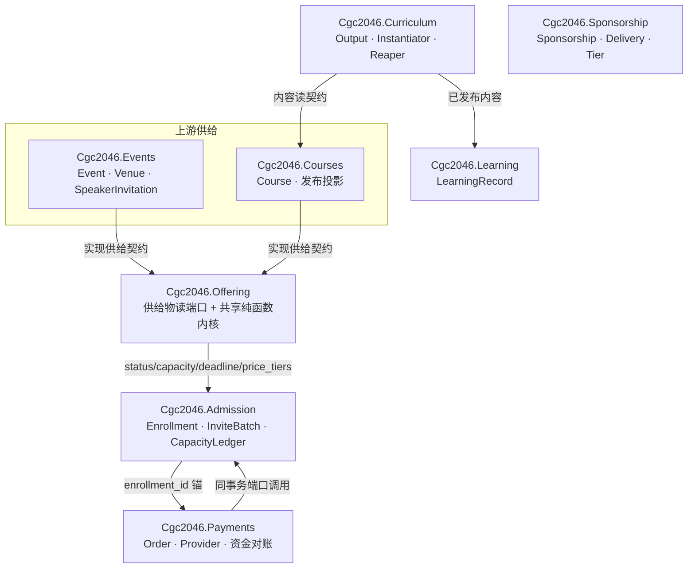
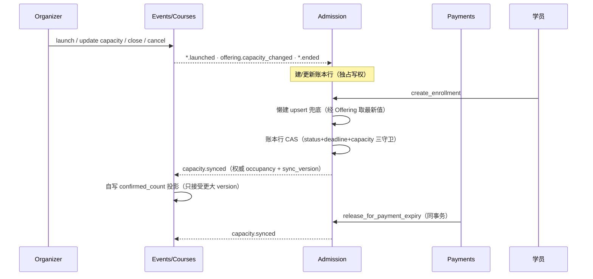
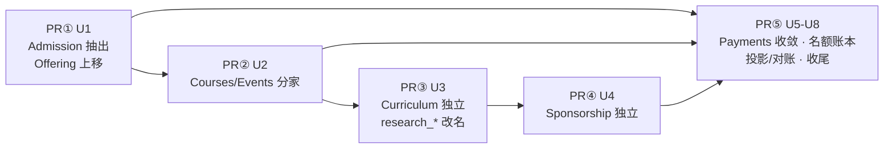

# 限界上下文重构（ADR-0009） - Plan

## Goal Capsule

- **Objective:** Events / Courses / Admission / Curriculum / Sponsorship 五个限界上下文在目录、模块命名空间与 Ash domain 三层实体化，跨 context 写点清零；对外契约（GraphQL schema、信号协议、MCP 工具名、前端行为）除 PR③ 一次白名单字段改名外逐字节不变。外部验证者无需读实现即可判定：五个 domain 存在、SDL diff 仅白名单、测试套件全绿。
- **Means:** ADR-0009 五步 PR 序列 + 每 context 实体化真 `Ash.Domain`（KTD1）。
- **Authority hierarchy:** ADR-0009（D1-D8，已接受） > 本计划 KTD > 实现期发现。冲突即停。
- **Stop conditions:** 需要改任一既有信号名或 payload 键；需要数据迁移（违反 KD7 前提）；SDL 出现白名单外 diff 且无机械解释；需要新增依赖。
- **Execution profile:** 交互式顺序执行，五个 PR 各自从最新 develop 切独立分支，在当前 worktree 依次承载；每 PR 全量验证门通过才开下一步。
- **Tail ownership:** product owner 逐 PR review；PR⑤ 合入后执行一次部署端 DB reset（KD7）。

---

## Product Contract

### Summary

把 `events/` 大杂烩拆成五个独立限界上下文，并把它们物化为真 Ash.Domain。Enrollment/InviteBatch 与名额账本归 Admission；Course 独立成 Courses；教研产出物归 Curriculum 并完成 research_* 改名；Sponsorship 独立；Payments 收敛为纯 supporting。名额账本（`confirmed_count` 写权下移 Admission + 展示投影）是序列中唯一的行为变化点，其余全部是行为保持搬迁。

### Problem Frame

`events/` 目录捆着六群变化原因不同的聚合（Event/Course/Enrollment/InviteBatch/Sponsorship/SpeakerInvitation），是 D-A4「Enrollment 归活动 context」的直接后果。Course 侧迭代重心在长内容形态与学习闭环，Event 侧在长运营能力；同一目录使两类变更永远互相搅扰 review 与回归面。课程内容读写错放在供给物资源上，Payments 直接裸 SQL 写 events/courses 表，跨 context 写点存在三处。平台用户量一人、DB 可重置，是低成本完成结构性拆分的窗口期。动机与边界判据（persona 分叉、变更频率分叉、统一语言检验）已由 ADR-0009 拍板，此处不重复。

### Key Decisions

- KD1. **Admission 独立 + enrollments 单表。** (session-settled: user-approved — chosen over Enrollment 双表复制： 一词两义违背统一语言，名额 CAS 与缴费状态机纪律双份维护。) Governs R1, R12, R13, R14.
- KD2. **名额账本归 Admission，confirmed_count 退化为展示投影。** (session-settled: user-approved — chosen over 保留跨域 CAS: 服务独占自己数据更新权，跨 context 写点清零。) Governs R12, R13, R14, R15, R16, R17, R18.
- KD3. **内容归 Curriculum，Course 持发布投影。** (session-settled: user-approved — chosen over 归 Learning / 留 Course: 内容写侧是教研产出，写作权不能错配给消费方。) Governs R4, R5.
- KD4. **Sponsorship 独立 context。** (session-settled: user-approved — chosen over 留在 events/: 两级赞助含 Workspace 级，非 Event 附属。) Governs R6.
- KD5. **Offering 保留命名、中文定名供给物、转正为发布语言读端口。** (session-settled: user-directed — chosen over 改名 Catalog / 删除: 消费面横跨六处，改名无收益。) Governs R2.
- KD6. **Payments 为 supporting domain，Order 锚 enrollment_id 不泛化。** (session-settled: user-approved — chosen over (subject_kind, subject_id) 泛化: 报名是唯一收费场景，无需求抽象。) Governs R19, R20.
- KD7. **DB 可重置、模型先行整体切换。** (session-settled: user-directed — chosen over 绞杀式迁移 / 数据迁移: 用户量一人。) Governs R5, R16, R21.
- KD8. **既有信号名与 payload 键冻结。** (session-settled: user-approved — chosen over 随 context 改名: 信号是跨 context 发布语言，改名成本极高。) Governs R9.
- KD9. **教研英文命名 = Curriculum。** (session-settled: user-directed — chosen over InstructionalDesign / TeachingResearch: 命名取产出物本质，Teaching Research 为中式英语。) Governs R5.

### Requirements

**Context 结构**

- R1. Enrollment 与 InviteBatch 迁 `backend/lib/cgc_2046/admission/`，注册进新 `Cgc2046.Admission` domain；enrollments 表保持单表不动。
- R2. `Cgc2046.Events.Offering` 上移为 `Cgc2046.Offering`（`backend/lib/cgc_2046/offering.ex`），纯读取端口，全部现有消费方签名不变。
- R3. Course 迁 `backend/lib/cgc_2046/courses/` 并注册进新 `Cgc2046.Courses` domain；Event / Venue / SpeakerInvitation 家族留 `events/` 并注册进新 `Cgc2046.Events` domain。
- R4. ResearchOutput 家族（含 ResearchInstantiator / ResearchRunReaper / 教研相关 AgentInstructions）迁 `backend/lib/cgc_2046/curriculum/` 并注册进新 `Cgc2046.Curriculum` domain；内容读契约归 Curriculum，`Course.course_content/1` 与 `issue_map_rows/1` 变为对 Curriculum 的委托。
- R5. `research_*` 代码词汇全量改名 `curriculum_*`：模块名、属性名、DB 列名、GraphQL 字段名、`:research` 枚举原子。中文「教研」表述不变。
- R6. Sponsorship 家族（Sponsorship / SponsorshipDelivery / SponsorshipTier / SponsorshipEndedSubscriber + 两条 policy）迁 `backend/lib/cgc_2046/sponsorship/` 并注册进新 `Cgc2046.Sponsorship` domain；Event 对 Sponsorship 保持软引用。
- R7. `Cgc2046.Api` 退役删除：Workflows / Learning / Reconciliation 命名空间各建 domain 并归位资源；`ash_domains` 配置、GraphqlSchema domains 列表、`domains_test.exs` 同步。

**行为保持门**

- R8. GraphQL 对外面：除 R5 白名单（`researchRequirements` / `researchEnabled` 及其派生 input / filter 类型改名）外，SDL 内容不变（仅按 domain 分组重排）；每个 PR 的验收以排序归一化后逐行对比为空为准（`git show BASE:backend/priv/graphql/schema.graphql | LC_ALL=C sort` 与当前文件同样排序后 diff 为空）。
- R9. 既有信号名（`event.*` / `course.*` / `enrollment.*` / `order.*` / `sponsorship.*` / `speaker.*`）与 payload 键逐字节冻结。仅允许新增 `offering.capacity_changed` 与 `capacity.synced` 两个信号。
- R10. MCP 工具对外名、审计名、meta 不变；工具实现仅改委托目标。
- R11. 纯搬迁 PR（①②④）不改任何测试断言逻辑，测试仅随迁 alias 与文件路径。

**名额账本（序列中唯一行为变化点）**

- R12. 新表 `admission_capacity_ledgers`：每个 offering 唯一一行（`(offering_kind, offering_id)` 唯一索引），缓存 `status` / `capacity` / `registration_deadline` / `occupancy` / `sync_version`，attribute multitenancy `workspace_id`。
- R13. 账本行建立 = 订阅 `*.launched` 信号建行 + 报名路径懒建 upsert 兜底（经 Offering 端口取最新 capacity / deadline）；两路并发建行由唯一索引幂等。
- R14. 占位 / 释放的原子 CAS 全部收编到账本行，守卫复刻现有三条件（`status='open'`、`registration_deadline > NOW()`、`occupancy < capacity`）。写点清单 = `enrollment.ex` reserve / release + 支付超时释放链，三处清零。
- R15. `events.courses.confirmed_count` 退化为展示投影：Admission 每次占位 / 释放后发布 `capacity.synced`（携带权威 occupancy + 单调递增 `sync_version`，覆盖式写入），Events / Courses 各自订阅并自写本表列；只接受更大 `sync_version`。
- R16. capacity / registration_deadline 编辑经 `offering.capacity_changed` 信号同步账本缓存。调小容量低于当前 occupancy 放行：删除 events / courses 上 `confirmed_count` 两条 check constraint，新单由账本 CAS 拒，存量占位靠自然释放收敛。
- R17. 对账新增四条规则：open offering 无账本行；账本 occupancy ≠ 占位报名计数；投影漂移超 N 拍；occupancy > capacity。
- R18. web 端 capacity 编辑表单在「新容量 < 当前已占席数」时显示警告文案。

**Payments 收敛**

- R19. `order.ex` admin 统计查询的 event / course 双分叉 JOIN 收敛为对 enrollments 的单 JOIN。
- R20. Order `:expire` 的 enrollment 状态 CAS 与计数释放收编为 `Cgc2046.Admission` 暴露的同事务端口函数，Payments 不再持有这两段裸 SQL。

**文档同步**

- R21. CONTEXT.md、`docs/01-定稿设计/领域模型定稿.md` §5.4、ADR-0009 随 PR 同步至目标态；ADR 正文补记两处修正：Sponsorship 独立单列为第④步（原 D8 序列漏排）；原「系统唯一跨 context 写点」更正为三处（enrollment.ex reserve / release、order.ex expire 链、check constraint 耦合）。

### Acceptance Examples

- AE1. **Given** 某课程 capacity=2 且已占 2 席，**When** 新学员提交报名，**Then** 账本 CAS 拒单（名额已满错误），账本 occupancy 与课程 confirmed_count 均保持 2。Covers R14.
- AE2. **Given** 收费报名 payment_pending 已占 1 席，**When** 订单超时过期，**Then** Order CAS expired 同事务调 Admission 端口释放，账本 occupancy 减 1，`capacity.synced` 异步把课程 confirmed_count 收敛到同一值。Covers R14, R15, R20.
- AE3. **Given** 某 offering 的账本行因 launched 信号丢失不存在，**When** 首位学员报名，**Then** 懒建 upsert 经 Offering 端口取最新 capacity / deadline 建行并完成占位，报名成功。Covers R13.
- AE4. **Given** organizer 把 capacity 从 10 调小到 1（当前已占 3 席），**When** 保存，**Then** 更新放行；此后新报名被账本 CAS 拒；对账规则「occupancy > capacity」产出 finding 直至自然释放收敛。Covers R16, R17.

### Scope Boundaries

**不做（Out）**

- 数据迁移与绞杀式兼容层（KD7：DB 可重置，直接改 baseline migration）。
- 拆微服务；本次是单体内的模块边界实体化。
- 既有信号名 / payload 键改名（KD8）。
- R5 白名单外的任何 GraphQL 对外变更。
- 新增第三方依赖。

### Deferred to Follow-Up Work

- Venue / ScheduleValidation 与 Sponsorship 对 Event 的依赖解耦深化（ADR-0009 已列为另行讨论项）。
- Agent 资源落地（roadmap 项，events 稳定后再起）。
- `payments/providers/` 剥离成独立 app（已被泛化决策 KD6 压低优先级）。
- Sponsorship 独立后 Event ↔ Sponsorship 跨域读面的性能复核（如出现 N+1 再议）。

---

## Planning Contract

### Key Technical Decisions

- KTD1. **每 context 实体化真 `Ash.Domain`**（Events / Courses / Admission / Curriculum / Sponsorship，收尾补 Workflows / Learning / Reconciliation），单 Absinthe schema 聚合列表随之变长但拓扑不变。依据：Ash 官方 glossary 定义 domain ≈ bounded context；项目零 code interface、全部调用走 `Ash.*`，迁移成本≈0；AshAdmin 按 `:ash_domains` 自动发现分组。每个新 domain 继承 `graphql do authorize?(true) end` 防御惯例与中文 `resource_group_labels`。
- KTD2. **Offering 落 `Cgc2046.Offering` 中立位置**，共享纯函数内核（PriceTier / ScheduleValidation / EnrollmentBadge / Readiness / 状态机 CAS helper）同层收进 `backend/lib/cgc_2046/offering/`。消费方横跨 Notification / Sponsorship / Miniprogram / Workflows / GraphQL，非 Admission 专属下游，故不挂 `Admission.Offering`。纯函数共享不破坏 bounded context（无状态、无表）。Instantiates KD5.
- KTD3. **PR③ 是唯一允许 SDL 内容变更的 PR**，白名单 = `researchRequirements→curriculumRequirements`、`researchEnabled→curriculumEnabled` 及派生 input / filter；另含 workflow_definition type 属性 description 文本随迁一处（description-only，review finding #1）；其余 PR 的验收门为 SDL 排序归一化后逐行 diff 为空（domain 归属切换引起的分组重排属合法形态，口径同 R8；全部 type / query / mutation 名已显式声明，语义冻结可机械证明）。
- KTD4. **名额账本同步全信号化**：上行 `offering.capacity_changed`（编辑传播）、下行 `capacity.synced`（覆盖式 + sync_version）。Admission 独占账本写权；Events / Courses 自写各自投影列（自写不算跨 context 写）；反向直写（Admission 写 events/courses 表）禁止。Instantiates KD2.
- KTD5. **建行双路 = launched 订阅 + 报名路径懒建 upsert 兜底**；launched payload 不扩字段（订阅方经 Offering 端口回读，永远拿最新 capacity / deadline，优于信号快照）；双路竞态由 `(offering_kind, offering_id)` 唯一索引幂等吸收。Instantiates KD2.
- KTD6. **支付超时释放 = 同事务端口调用** `Admission.release_for_payment_expiry/1`，不用异步信号：保「名额回池后才通知可重报」的现有语义；同库单事务，事务性不破，只改模块归属。Instantiates KD6.
- KTD7. **invite_only 双 CAS 锁序固化**：offering 侧行（账本行）永远先于 invite_batches 行获取；写入 CONTEXT.md 名额账本词条。
- KTD8. **五步序列**：Sponsorship 独立单列为 PR④（ADR D8 漏排），Payments 收敛 + 名额账本为 PR⑤；ADR / CONTEXT 文本随迁更正（R21）。每 PR 一个 context，验证门同形。
- KTD9. **每 PR 内分步提交：先建 domain 并切换资源 `domain:` 归属，后改模块名 / 目录**，SDL diff 在每一步后可独立验证，隔离变量。

### High-Level Technical Design

目标态 context / domain 拓扑（`Cgc2046Web.GraphqlSchema` 单 schema 聚合全部 domain，对外不变）：



名额账本写权与同步流（KTD4 / KTD5 / KTD6）：



PR 序列与依赖（KTD8）：



### Assumptions

- 懒建兜底经 Offering 端口读到的 capacity / deadline 永远是最新值，优于在 launched payload 里放快照。
- AshAdmin 导航从单个大分组变为按语境多分组（中文标签保持），ops（product owner 本人）可接受。
- `:research → :curriculum` 枚举原子改名随 DB reset 无迁移负担；既有 WorkflowDefinition 数据随重置重建。
- PR⑤ 合入后部署端执行一次 DB reset（KD7 授权）；本计划不含 reset 的编排脚本。
- 信号同步窗口内公开报名徽章可能出现 `full → enrolling` 回跳、成员详情页计数短暂滞后；可接受，对账规则 3 兜真卡死。

### Sequencing

五个 PR 严格顺序执行（依赖见 HTD 图）：PR①=U1，PR②=U2，PR③=U3，PR④=U4，PR⑤=U5→U6→U7→U8。每 PR 从最新 develop 切分支，CI 四检查全绿合入后再切下一支。PR③ 与 PR④ 互相无依赖，顺序可按 develop 拥堵情况互换，其余顺序固定。

### Deferred Implementation Notes

- CapacityLedger 的 Ash action 形状与具体函数名（如 `reserve!/2`、`release/1`）实现期定。
- `capacity.synced` 在事务提交后入 outbox 的挂接点（after_action vs after_transaction）实现期定，以不发「回滚幻影信号」为准。
- 懒建 upsert 与 launched 订阅建行的撞行细节（`ON CONFLICT` 语义）实现期定，唯一索引已保证幂等。
- PR③ 新模块命名（如 `Curriculum.Output` vs `CurriculumOutput`）实现期定，沿用「目录名=命名空间第二段」惯例。

---

## Output Structure

```text
backend/lib/cgc_2046/
├── admission.ex                 # Cgc2046.Admission domain（新）
├── admission/
│   ├── enrollment.ex            # 自 events/ 迁入改名
│   ├── invite_batch.ex          # 自 events/ 迁入改名
│   └── capacity_ledger.ex       # 名额账本（PR⑤ 新增）
├── courses.ex                   # Cgc2046.Courses domain（新）
├── courses/
│   └── course.ex                # 自 events/ 迁入改名
├── curriculum.ex                # Cgc2046.Curriculum domain（新）
├── curriculum/                  # 自 workflows/ 迁入改名（PR③）
├── events.ex                    # Cgc2046.Events domain（新）
├── events/                      # 收窄：event / venue / speaker_invitation* 留存
├── offering.ex                  # Cgc2046.Offering 读端口（自 events/offering.ex 上移）
├── offering/                    # 共享纯函数内核：price_tier / schedule_validation /
│                                #   enrollment_badge / readiness / 状态机 CAS helper
├── pending_approvals.ex         # 跨 context 读模型上移（自 events/）
├── sponsorship.ex               # Cgc2046.Sponsorship domain（新）
├── sponsorship/                 # sponsorship 家族自 events/ 迁入
├── workflows.ex / learning.ex / reconciliation.ex   # PR⑤ 收尾新建
└── api.ex                       # 最终删除（PR⑤）
```

---

## Implementation Units

### U1. Admission 抽出与 Offering 端口上移（PR①）

- **Goal:** Enrollment / InviteBatch 迁 `admission/` 并注册 `Cgc2046.Admission`；Offering 与 PendingApprovals 上移顶层；消费方 alias 全量随迁。
- **Requirements:** R1, R2, R8, R9, R10, R11（KD1, KD5；KTD1, KTD2, KTD9）
- **Dependencies:** 无
- **Files:**
  - 新建：`backend/lib/cgc_2046/admission.ex`、`backend/lib/cgc_2046/admission/enrollment.ex`、`backend/lib/cgc_2046/admission/invite_batch.ex`、`backend/lib/cgc_2046/offering.ex`、`backend/lib/cgc_2046/pending_approvals.ex`
  - 删除：`backend/lib/cgc_2046/events/{enrollment,invite_batch,offering,pending_approvals}.ex`
  - 修改注册面：`backend/lib/cgc_2046/api.ex`（移除两行注册 + admin labels 随迁）、`backend/config/config.exs`（ash_domains）、`backend/lib/cgc_2046_web/graphql_schema.ex`（domains 列表）
  - 消费方 alias 随迁（机械替换，不改逻辑）：workers×10（approval_expiry / approval_reminder / event_lifecycle / learning_progress / notification / offering_cancel_refund / payment_expiry / payment_refund / payment_settlement / reconciliation_scan）、`workflows/{learning_instantiator,step_authorization,research_instantiator}.ex`、`changes/waive_pending_on_pricing_disable.ex`、`mcp/tools/{learner_authorization,save_learning_records}.ex`、`notification_subscriber.ex`、`speaker_subscriber.ex`、`events/sponsorship.ex`、`miniprogram/share_scheme_service.ex`、`graphql_schema.ex`
  - 测试随迁：`backend/test/cgc_2046/events/enrollment*` → `test/cgc_2046/admission/`，`graphql_{create_enrollment,enrollment_my_query,invite_batch,pending_approvals*}_test.exs`、payments 三测试、`test/support/events_fixtures.ex` 等约 20 文件
- **Approach:**
  1. 建 `Cgc2046.Admission` domain（KTD1 配置惯例：`AshGraphql.Domain` + `AshAdmin.Domain` 扩展、`graphql authorize?(true)`、`admin show?/name/中文 labels`）。
  2. 切换 Enrollment / InviteBatch 的 `domain:` 归属并提交（KTD9 第一步）。
  3. 改模块名与目录、平移 offering.ex / pending_approvals.ex（KTD9 第二步）。
  4. 消费方 alias 机械替换；`payment_expiry_worker.ex` 等内联全限定引用一并改。
  5. 测试文件与 alias 随迁，断言逻辑零改动（R11）。
- **Patterns to follow:** `backend/lib/cgc_2046/payments.ex`（domain 模块与命名空间同名先例）；Accounts.* 注册进 GlobalApi（命名空间 ≠ domain 先例）。
- **Execution note:** 纯改名搬迁。先 domain 归属 + 编译通过，再模块改名，再消费方，再测试；每步独立可编译。
- **Test scenarios:**
  - 编译零警告（`--warnings-as-errors`）通过。
  - 既有 `enrollment_concurrency_test`（并发占位不超卖）原样全绿——占位 CAS 口径不变。
  - 既有 `graphql_create_enrollment` / `graphql_enrollment_my_query` / 支付三测试原样全绿。
  - SDL 内容不变（仅按 domain 分组重排）：`priv/graphql/schema.graphql` 排序归一化后逐行对比为空（`git show BASE:backend/priv/graphql/schema.graphql | LC_ALL=C sort` 与当前文件同样排序后 diff 为空；R8 门）。
- **Verification:** `cd backend && mix compile --warnings-as-errors` 与 `mix test` 全绿；SDL 排序归一化后逐行 diff 为空（口径同 R8）；`grep -rE "Events\.(Enrollment|InviteBatch|Offering|PendingApprovals)([^A-Za-z0-9_]|$)" backend/lib backend/test` 零命中（词边界匹配，排除合法存续的 Events.EnrollmentBadge）。

### U2. Courses / Events 分家（PR②）

- **Goal:** Course 迁 `courses/` + `Cgc2046.Courses` domain；Event 家族注册新 `Cgc2046.Events` domain；共享纯函数内核收进 `offering/`。
- **Requirements:** R3, R8, R9, R10, R11（KTD1, KTD2, KTD9）
- **Dependencies:** U1
- **Files:**
  - 新建：`backend/lib/cgc_2046/{courses.ex,events.ex}`、`backend/lib/cgc_2046/courses/course.ex`、`backend/lib/cgc_2046/offering/{price_tier,schedule_validation,enrollment_badge,readiness}.ex`（状态机 CAS helper 一并入此层）
  - 删除：`events/{course,price_tier,schedule_validation,enrollment_badge,readiness}.ex`；`events/` 留存 `event.ex` / `venue.ex` / `speaker_invitation*.ex` / `sponsorship*.ex`（后者待 U4）
  - 修改：`api.ex`（注册行清空 events 家族）、config / graphql_schema domains 列表、`admission/enrollment.ex` 与 `admission/invite_batch.ex` 的 belongs_to 目标、workers（event_lifecycle / offering_cancel_refund / payment_expiry / reconciliation_scan）、mcp 工具×4、`offering.ex`、graphql_schema.ex
  - 测试随迁：course_visibility / event_visibility / event_slug / event_lifecycle / u6_course_pipeline / readiness / price_tier / schedule_venue / enrollment_badge / offering 等约 12 文件
- **Approach:**
  1. 建 Courses / Events 两个 domain（KTD1 惯例）。
  2. Course `domain:` → Courses；Event / SpeakerInvitation `domain:` → Events（KTD9 第一步）。
  3. 模块改名与目录搬迁；共享纯函数入 `offering/` 层（KTD2）。
  4. Course 上的 `course_content/1` 与 `issue_map_rows/1` 本步原样保留在 Course（内容归位是 U3 的事）。
  5. 测试随迁，断言零改动。
- **Patterns to follow:** 同 U1。
- **Test scenarios:**
  - 编译零警告；既有事件生命周期 / 可见性 / Readiness / 徽章测试原样全绿。
  - SDL 零 diff（R8 门）。
  - 信号字面量扫描：`course.launched` / `course.ended` / `event.*` 字符串零变化（R9 门）。
- **Verification:** 同 U1 口径 + `grep -rE "Events\.Course" backend/lib backend/test` 零命中。

### U3. Curriculum 独立与 research_* 改名（PR③）

- **Goal:** 教研家族迁 `curriculum/`；`research_* → curriculum_*` 全代码词汇改名；内容读契约归 Curriculum，Course 委托；本 PR 是唯一允许 SDL 白名单 diff 的 PR（KTD3）。
- **Requirements:** R4, R5, R8（白名单）, R9, R10（KD3, KD7, KD9；KTD1, KTD3）
- **Dependencies:** U2
- **Files:**
  - 新建：`backend/lib/cgc_2046/curriculum.ex`、`backend/lib/cgc_2046/curriculum/`（ResearchOutput / ResearchInstantiator / ResearchRunReaper 迁入改名，AgentInstructions 教研段随迁）
  - 修改：`courses/course.ex`（`course_content/1`、`issue_map_rows/1` 改为委托 Curriculum；属性 `research_enabled/research_requirements` → `curriculum_*`）、`events/event.ex`（同名属性 + `link_research_run` action 改名）、`workflows/`（删除已迁出模块）、`admission/enrollment.ex`（payload 键引用）、`reconciliation_scan_worker.ex`（`:research` filter）、`offering/readiness.ex`（`:research` 定义类型引用）、`payments/notification_templates.ex`（如引用）、mcp 工具×3（get_course_content / save_course_content / save_learning_records 委托目标）、`graphql_schema.ex`（resolve_course_map 委托目标）
  - 数据面：`squash_baseline.exs` 列名 / `research_outputs` 表名 / `:research` 枚举值随改（KD7，无迁移）
  - 前端：`web/lib/graphql/events.ts`（两字段名 + 派生类型）、`miniprogram/src/api/operations.ts` + `pnpm codegen` 重生成
  - 测试随迁：research workflow / readiness / reconciliation / teaching_learning / u6_course_pipeline / mcp course_tools 等
- **Approach:**
  1. 建 `Cgc2046.Curriculum` domain；ResearchOutput `domain:` 切换（KTD9 第一步）。
  2. 模块迁 `curriculum/` 并改名；内容读契约实现落 Curriculum，Course / MCP / GraphQL resolver 全改委托（R4）。
  3. 属性 / 列 / GraphQL 字段 / 枚举原子机械改名（R5）；GraphQL 侧 diff 必须且仅含白名单（KTD3）。
  4. web 手改两字段；小程序 codegen 重生成并提交，generated diff 与 SDL diff 一一对应。
- **Patterns to follow:** 同 U1；改名面以编译错误为驱动清单（低成本失败模式）。
- **Test scenarios:**
  - 编译零警告；教研实例化 / readiness / 对账既有测试改名后全绿。
  - SDL diff 逐行核对仅白名单（R8）。
  - `pnpm -C web typecheck` 通过；小程序 `generated/` diff 与 SDL 白名单一致。
  - 公开地图 / 学员详情内容读取回归（`graphql_course_learning` / mcp course_tools 测试）全绿——委托不改行为。
- **Verification:** backend 全绿 + SDL 白名单 diff 评审；前端 typecheck + codegen diff 一致；`grep -ri "research_" backend/lib backend/test` 仅剩迁移历史与无关命中（逐条确认）。

### U4. Sponsorship 独立（PR④）

- **Goal:** Sponsorship 家族迁 `sponsorship/` + `Cgc2046.Sponsorship` domain；Event 侧软引用保持。
- **Requirements:** R6, R8, R9, R10, R11（KD4；KTD1, KTD9）
- **Dependencies:** U1
- **Files:**
  - 新建：`backend/lib/cgc_2046/sponsorship.ex`、`backend/lib/cgc_2046/sponsorship/{sponsorship,sponsorship_delivery,sponsorship_tier,sponsorship_ended_subscriber}.ex`
  - 删除：events/ 下对应四文件
  - 修改：`api.ex`、`application.ex`（subscriber child 引用）、`accounts/workspace.ex`（SponsorshipTiersValidation 引用）、`pending_approvals.ex`、`policies/sponsorship_*.ex`、workers×4（approval_expiry / approval_reminder / notification / reconciliation_scan）、graphql_schema.ex
  - 测试随迁：sponsorship_flow / sponsorship_concurrency / sponsorship_delivery_read / graphql_sponsorship* / policies/sponsorship_approver 等约 8 文件
- **Approach:** 与 U1 同形（建 domain → 切归属 → 改名搬迁 → alias 随迁 → 测试随迁）。
- **Test scenarios:**
  - 编译零警告；sponsorship 全流程与并发测试原样全绿。
  - SDL 零 diff；`sponsorship.*` 信号字面量零变化。
- **Verification:** 同 U1 口径 + `grep -rE "Events\.Sponsorship" backend/lib backend/test` 零命中。

### U5. Payments 收敛（PR⑤ 第一部分）

- **Goal:** Order 对 enrollments 单 JOIN；支付超时释放收编为 Admission 同事务端口函数。
- **Requirements:** R19, R20（KD6；KTD6）
- **Dependencies:** U1
- **Files:** `backend/lib/cgc_2046/payments/order.ex`、`backend/lib/cgc_2046/admission/enrollment.ex`（新增端口函数）、`backend/test/cgc_2046/payments/`（order / refund / replay_settlement 测试）
- **Approach:**
  1. `order.ex` 的 `expire_enrollment/1` + `decrement_confirmed_count/2` 两段裸 SQL 移入 Admission，暴露 `release_for_payment_expiry/1`；Order `:expire` 同事务调用（KTD6）。
  2. admin 统计查询 event / course 双分叉 JOIN（现按 kind 分叉）收敛为单 JOIN enrollments（R19）。
  3. 本步暂保留对 events/courses.confirmed_count 的直写——投影化在 U6/U7 完成，本步只改归属不改机制。
- **Patterns to follow:** 端口函数命名沿用 Enrollment 现有公共函数风格。
- **Test scenarios:**
  - 支付超时全流程测试原样全绿（expired + 名额释放 + 通知文案分叉不变）。
  - admin 支付统计 GraphQL 测试原样全绿（查询结果不变）。
- **Verification:** `mix test` 全绿；`order.ex` 内零 `UPDATE events|UPDATE courses|UPDATE enrollments` 裸 SQL 残留。

### U6. 名额账本（PR⑤ 核心）

- **Goal:** CapacityLedger 资源落地；占位 / 释放 CAS 收编账本行；建行双路与编辑同步信号接通。
- **Requirements:** R12, R13, R14, R16（KD2；KTD4, KTD5, KTD7）
- **Dependencies:** U1, U2, U5
- **Files:**
  - 新建：`backend/lib/cgc_2046/admission/capacity_ledger.ex`、账本订阅器（launched / ended / capacity_changed 三信号）
  - 修改：`squash_baseline.exs`（新表 + 删 events/courses 两条 confirmed_count check constraint）、`admission/enrollment.ex`（reserve / release 改打账本行；`capacity_seq` 语义改指账本 occupancy）、U5 端口函数并入账本释放、`events/event.ex` / `courses/course.ex`（`:update` 检测 capacity / deadline 变更发 `offering.capacity_changed`；`:close` / `:cancel` 的 ended 信号订阅方含账本）、`test/support/events_fixtures.ex`（`set_confirmed_count/3` 改置账本 occupancy）
  - 测试：`test/cgc_2046/admission/capacity_ledger_test.exs`（新）、`enrollment_concurrency_test.exs`（口径平移）
- **Approach:**
  1. 建表与 Ash 资源（R12 字段集 + attribute multitenancy + 唯一索引）；不进 GraphQL（无 graphql 块）。
  2. 订阅器：launched 建行、capacity_changed 更新缓存、ended 回查 status 更新缓存（KTD5 / R16）。
  3. reserve / release 的裸 SQL 目标从 events/courses 行改账本行，CAS 守卫三条件原样复刻（R14）；invite_only 保持账本行 → invite_batches 行锁序（KTD7）。
  4. 报名路径懒建 upsert 兜底（KTD5）。
  5. 删两条 check constraint（R16）。
- **Technical design（方向性）:** 账本行字段 = `offering_kind :atom`、`offering_id :uuid`、`status :atom`、`capacity :integer nilable`、`registration_deadline :utc_datetime nilable`、`occupancy :integer default 0`、`sync_version :bigint`、`workspace_id`；reserve CAS 语义 = `UPDATE ... SET occupancy=occupancy+1, sync_version=sync_version+1 WHERE kind/id 匹配 AND status='open' AND (deadline IS NULL OR deadline > now()) AND (capacity IS NULL OR occupancy < capacity) RETURNING occupancy`。
- **Execution note:** 行为变化单元。先写失败测试：并发占位不超卖、懒建兜底、deadline 守卫复刻。
- **Test scenarios:**
  - Happy path：免费 open 报名占位 +1，账本 occupancy 与返回值正确（`capacity_seq` = 账本 occupancy）。
  - 并发：N 并发报名 capacity=N-1，恰好 N-1 成功，无超卖（既有并发测试口径平移到账本行）。
  - 懒建：无账本行时报名成功且建行字段取自 Offering 最新值（AE3）。
  - 守卫复刻：deadline 过后报名被拒；status 非 open（closed/cancelled）报名被拒。
  - 编辑同步：capacity 调大 / 调小 / NULL↔有限，capacity_changed 后账本缓存更新；调小低于 occupancy 放行且新单被拒（AE4 前半）。
  - invite_only：占位 + 配额扣减双 CAS 顺序不变，配额不足时整体回滚。
  - 错误路径：信号重投 / 乱序下建行幂等（唯一索引吸收冲突）。
- **Verification:** 新增与平移测试全绿；`grep -n "confirmed_count" backend/lib/cgc_2046/admission/enrollment.ex backend/lib/cgc_2046/payments/order.ex` 仅剩投影读路径引用（写点清零）；全量 `mix test` 绿。

### U7. 展示投影、对账规则与 UI 提示（PR⑤ 收尾）

- **Goal:** confirmed_count 投影化同步回路闭合；对账四规则上线；web capacity 警告提示。
- **Requirements:** R15, R16, R17, R18（KD2；KTD4）
- **Dependencies:** U6
- **Files:**
  - 新建：`backend/lib/cgc_2046/events/capacity_projection_subscriber.ex`、`backend/lib/cgc_2046/courses/capacity_projection_subscriber.ex`
  - 修改：Admission 发信号点（reserve / release / 支付超时释放端口）、`workers/reconciliation_scan_worker.ex`（+4 规则）、`web/` capacity 编辑表单（警告文案）、`application.ex`（subscriber 注册）
  - 测试：`test/cgc_2046/admission/capacity_sync_test.exs`（新）、reconciliation 测试 +4 例、web 组件测试或结构断言
- **Approach:**
  1. 占位 / 释放 / 超时释放三处在账本写成功后发布 `capacity.synced`（权威 occupancy + sync_version，走既有 SignalEmitter outbox）。
  2. Events / Courses 各自订阅并自写本表 confirmed_count 列，条件 `sync_version > 现存值`（覆盖式幂等 + 乱序收敛）。
  3. 对账四规则按 R17 落 ReconciliationScanWorker，复用 `:pending_without_deadline` 的 findings upsert / refresh / delete_stale 语义。
  4. web 表单：目标容量 < 当前已占席数时显示警告（R18），提交不拦截。
- **Test scenarios:**
  - 同步幂等：同一 `capacity.synced` 重投不改结果；旧 sync_version 不覆盖新值。
  - 端到端：报名 → 账本 +1 → 投影最终一致到同一值（AE1 / AE2 全链）。
  - 对账四规则各一例：构造 open 无账本行 / occupancy 计数不符 / 投影漂移 / occupancy>capacity，各产出一条 finding，恢复后 finding 自动消除。
  - UI：capacity 输入小于已占席数时警告文案渲染（结构断言）。
- **Verification:** 新增测试全绿；对账规则在 /admin 对账页可见；全量 `mix test` + web 检查绿。

### U8. Domain 实体化收尾与文档（PR⑤ 尾）

- **Goal:** Workflows / Learning / Reconciliation domain 归位，`Cgc2046.Api` 退役删除；文档同步至目标态。
- **Requirements:** R7, R21（KTD1, KTD8）
- **Dependencies:** U2, U3, U4
- **Files:**
  - 新建：`backend/lib/cgc_2046/{workflows.ex,learning.ex,reconciliation.ex}`
  - 删除：`backend/lib/cgc_2046/api.ex`
  - 修改：残留资源 `domain:` 归位（WorkflowRun 等 → Workflows；LearningRecord → Learning；Finding → Reconciliation）、`config.exs`、`graphql_schema.ex`、`domains_test.exs`
  - 文档：CONTEXT.md（Admission / Curriculum / 供给物 / 名额账本词条目标态 + 锁序 KTD7）、`docs/01-定稿设计/领域模型定稿.md` §5.4（去「待代码迁移」标注）、ADR-0009（R21 两处更正 + 状态备注）
- **Approach:** 与前序单元同形的机械归位；文档与代码同 PR。
- **Test scenarios:**
  - `domains_test.exs` 更新断言（Api 不再注册；八个新 domain 在列）。
  - SDL 零 diff；全量测试绿。
- **Verification:** `grep -r "Cgc2046.Api\b" backend/` 仅剩历史文档；`mix test` 全绿；CONTEXT.md 词条与代码目录一一对应。

---

## Verification Contract

| 门 | 适用 PR | 通过标准 |
|---|---|---|
| `cd backend && mix compile --warnings-as-errors` | 全部 | 零警告 |
| `cd backend && mix test` | 全部 | 全绿，纯搬迁 PR 断言零改动（R11） |
| `backend/priv/graphql/schema.graphql` diff | 全部 | 排序归一化后逐行为空（允许 domain 分组重排，口径同 R8）；PR③ 仅 KTD3 白名单 |
| 信号字面量扫描（冻结清单见 Appendix） | 全部 | 既有名与 payload 键零变化（R9） |
| 旧模块名残留 grep（每 PR 指定模式） | 全部 | 零命中 |
| web `pnpm typecheck` / lint | ③⑤ | 通过 |
| miniprogram `pnpm codegen` 后 generated diff | ③ | 与 SDL 白名单一一对应 |
| 名额并发与对账新测试 | ⑤ | U6/U7 测试场景全绿 |
| CI 四检查（strict 保护分支） | 全部 | 全绿后 auto-merge 合入 develop |

---

## Definition of Done

**全局**

- 五个 PR 全部合入 develop，CI 全绿。
- SDL 除 PR③ 白名单外逐字节不变；信号冻结扫描通过。
- `Cgc2046.Api` 删除；`Cgc2046.Events` 命名空间只剩 Event 家族；旧模块引用 grep 零命中。
- CONTEXT.md / 领域模型定稿 §5.4 / ADR-0009 与代码状态一致。
- 清理：无任何为过渡而建的 shim / 兼容别名 / 注释掉的旧代码；探索性死代码不进 diff。
- 部署端 DB reset 已执行（KD7），新表结构与 baseline 一致。

**单元级**：各单元 `Verification` 字段即完成判据；U6/U7 另以其测试场景全部落地为准。

---

## System-Wide Impact

- **Ops（product owner）**：AshAdmin 导航从「Workflows & Events」大组变为按语境多分组（中文标签保持）；PR⑤ 后需一次 DB reset。
- **前端**：仅 PR③ 两个 GraphQL 字段改名（web 手改 + 小程序 codegen）与 PR⑤ 一处 capacity 警告；其余零牵连。
- **MCP / 小程序用户面**：工具名、审计名、对外 schema 不变。
- **对账**：新增四规则，/admin 对账页可见新 finding 类型。
- **CI / 依赖**：无新依赖；`mix cgc2046.check_licenses` 无感。
- **并发语义**：名额判定源从 offering 行移到账本行；同步窗口内公开徽章可能短暂回跳（Assumptions）。

---

## Risks & Dependencies

| 风险 | 等级 | 缓解 |
|---|---|---|
| 名额账本并发正确性回归 | 高 | CAS 三守卫逐字复刻现有实现；既有并发测试口径平移；U6 先写失败测试 |
| PR③ 前端字段随迁遗漏 | 中 | SDL 白名单 diff + codegen diff 一一对应 + typecheck 三重门 |
| 与 develop 上并行 PR 的大面积改名冲突 | 中 | 五 PR 串行、每 PR 前 rebase 最新 develop；改名窗口期内避免并行触碰 events/ 的 PR |
| AshAdmin 分组键漂移（resource_group atom 与 labels 不匹配） | 低 | 每 domain 建立时同步 labels；U8 收尾统一核对 |
| 懒建 upsert 与 launched 订阅建行撞行 | 低 | 唯一索引幂等吸收；对账规则 1 兜「open 无账本行」 |
| 投影同步信号丢失导致 confirmed_count 长期漂移 | 低 | 覆盖式 + sync_version 天然幂等；对账规则 3 兜持续漂移 |

**依赖：** 无外部依赖；每 PR 依赖前序 PR 合入（HTD 序列图）。

---

## Sources / Research

- 决策源：`docs/adr/0009-bounded-context-restructure.md`（D1-D8 + 拒绝的替代）；`docs/01-定稿设计/领域模型定稿.md` §5.4；CONTEXT.md 词条。
- 方法源：DDD 事件工作坊三讲义（事件风暴 / 战术设计 / Beyond DDD，2026-08-28 讨论记录于 ADR 缘起）。
- Repo 调研（2026-08-28，worktree 实证）：消费方地图（Enrollment 消费面最宽：10 workers + 2 workflows + 2 MCP 工具 + 约 20 测试文件）；GraphQL 类型名全部显式声明（零 diff 门的证据）；零 code interface；信号链路字符串透传（`changes/signal_emitter.ex`、`workers/signal_publish_worker.ex`）；MCP 工具名派生自模块末段（`deps/anubis_mcp/lib/anubis/server.ex`）；confirmed_count 三写点（`events/enrollment.ex` reserve / release + `payments/order.ex` expire 链）。
- Ash 外部调研：Ash glossary「domain ≈ bounded context」（ash.hexdocs.pm/ash/domains.html、glossary.html）；多 domain 聚合单 schema 为官方一等用法（ash-graphql getting-started）；跨域 relationship 解析顺序（`Ash.Domain.Info.related_domain/3`）；Zach Daniel：资源单一归属 domain + 跨域 relate，仅当职责分叉才拆（ElixirForum #64904）。版本锚：ash 3.32.0 / ash_graphql 1.10.0 / ash_admin 1.2.0 / 无 ash_oban。
- 名额账本流分析：F1-F12 流程与 G1-G10 缺口（账本行建行窗口、check constraint 现状 `squash_baseline.exs:1262-1276`、confirmed_count 读方清单 = EnrollmentBadge / 成员详情页 / AshAdmin / GraphQL sortable）。

---

## Appendix

**confirmed_count 写点清零清单（R14 验收口径）**

1. `admission/enrollment.ex` reserve_capacity（占位 +1）→ 改打账本行（U6）。
2. `admission/enrollment.ex` release_capacity（取消 / 退款释放 -1）→ 改打账本行（U6）。
3. `payments/order.ex` expire 链（超时释放 -1）→ 先归位 Admission 端口（U5），再并入账本（U6）。
4. `squash_baseline.exs` 两条 check constraint → 删除（U6）。

**冻结信号清单（R9 扫描基线）**

`course.launched` / `course.ended` / `event.launched` / `event.ended` / `enrollment.submitted` / `enrollment.approved` / `enrollment.rejected` / `enrollment.completed` / `order.paid` / `sponsorship.submitted` / `sponsorship.approved` / `sponsorship.rejected` / `sponsorship.active` / `speaker.*`；payload 键与 idempotency_key 格式（`<type>:<record_id>`）含 enrollment 免缴批量路径的手工拼接，逐值不变。

**新增信号（仅两个）**

`offering.capacity_changed`（Events/Courses → Admission，R16）；`capacity.synced`（Admission → Events/Courses，R15）。
