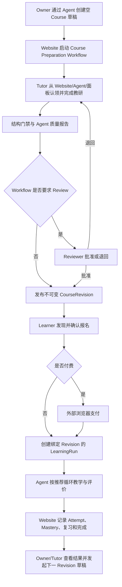

# OpenClacky BYO 多角色 Agent 核心旅程 v2 — 合并实施计划

## Goal Capsule

- **Objective:** 让平台管理员、Workspace Owner/Admin、Tutor 与 Learner 安装同一套开源 OpenClacky 扩展后，通过 Agent 对话与右侧上下文面板完成各自核心职责，打通「开课 → 教研 → 审核发布 → 发现报名 → 支付 → 自适应学习 → 结果反馈」黄金链路。
- **Means:** 用户本地 BYO OpenClacky 负责对话与执行，CGC 网站负责身份、权限、Workflow、共享草稿、课程版本、交易和结构化学习记忆，扩展负责角色入口与上下文面板。
- **Product authority:** 2026-08-27-1636 产品契约（R1–R50，本文档全文继承）；ADR-0001/0002/0005 既有边界。
- **Technical authority:** ADR-0009（限界上下文地图 D1–D8）、ADR-0010（worker/change 归属 W1/W2 + G1 账目）、CONTEXT.md、`领域模型定稿.md` §5.4——**旧参考实现的模块路径/domain 注册/目录形态全部过时，本计划技术设计全部按新地图重做**。
- **Reference truth:** 旧分支 `feat/openclacky-role-agent-journeys` 已完整实现过一版（60 工具、CoursePrep、CourseRevision、Learning v2 全家族），其**语义与行为边界**（含 24 条计划外边界，见 §技术设计-B）作为需求真相继承；其**技术形态**按 §Scope Boundaries 的改判表逐项换血。
- **Stop conditions:** 每切片后端 `mix precommit` + 扩展 minitest + 门禁（wrapper_gate_test / error codes contract / migration snapshot check）全绿方可合入；黄金链路在 S8 后端到端可走通。

---

## 第一部分 · Product Contract（自 1636 继承，勘误标注 ✏️）

### Summary

把现有网站能力组织成一个角色感知的 OpenClacky 工作台：同一个 CGC Assistant 根据用户身份、当前 Workspace 与任务加载对应工作模式，Agent 对话和可编辑侧边栏共同操作网站上的同一份业务状态。

第一条必须跑通的黄金链路是：Owner 发起一个可以为空的 Course 草稿，Tutor 通过 Agent 与面板完成教研，Course Preparation Workflow 按策略审核并发布，Learner 通过 Agent 发现、报名、支付和学习，Owner/Tutor 最终看到报名与学习结果。

### Problem Frame

平台已经有平台后台、Workspace 管理、Workflow、课程内容、报名支付、公开发现、学习记录和 OpenClacky 面板，但这些能力仍是分散的页面与工具。不同角色无法从一个清晰入口知道"我现在可以做什么、接下来应完成什么、这次操作会产生什么结果"。

当前课程面板是只读视图，并从已有学习记录反推课程；新报名但尚未产生记录的课程不会出现。课程内容是无版本的活文档（✏️ 现为 `Curriculum.Output`，原 ResearchOutput，ADR-0009 PR③ 改名迁域，活文档语义未变），学习记录按 checklist 最新值覆盖，学习 Agent 线性选择第一个未完成 Issue。这些设计足以展示最小闭环，但不足以支撑跨角色交接、可审计评价、课程迭代和真正的自适应路径。

### Key Decisions（产品级，原文继承）

- **本地 BYO OpenClacky 是当前唯一 Agent 执行宿主。** Governs R1, R2
- **一套扩展、一个 CGC Assistant、多个角色工作模式。** 按身份和任务动态加载角色 Playbook。Governs R2-R6
- **网站承担跨用户共享状态。** Owner 与 Tutor 的交接由网站 Workflow、任务和草稿承载。Governs R7, R8, R20
- **Agent 对话与可编辑侧边栏是两个等价入口。** Governs R5, R9-R11
- **Owner 可以零输入发起 Course 草稿，Tutor 负责把它做完整。** Governs R21, R24, R25
- **审核和最终发布由 Course Preparation Workflow 策略决定。** Governs R22, R23, R27, R28
- **审核默认开启，但允许 Workspace 关闭；Reviewer 可以是任一 Workspace 成员，包含 Tutor 本人。** Governs R22, R28
- **Learner 的发现范围是全部公开 Offering 加本人有权访问的 Workspace Offering。** Governs R30
- **支付在网站的外部浏览器页面完成。** Governs R33, R34
- **学习评价由 Agent 自动完成，不设置 Tutor 逐次审核。** Governs R42-R44
- **Website 保存结构化学习记忆，完整教学对话留在本地。** Governs R42, R47, R48
- **每个 LearningRun 永久绑定一个 CourseRevision，不做原地升级。** Governs R29, R36, R37
- **老学员学习新版时创建独立 LearningRun。** Governs R36, R37
- **LearningObjective 是最小掌握单位。** Governs R38, R39, R43, R44
- **确定性路径算法属于网站，教学执行属于 Agent。** Governs R39-R46

### Actors

- A1. **Platform Admin** — 管理全平台用户、Workspace、申请、平台管理员身份与运行审计，但默认不能读取学员教学内容。
- A2. **Workspace Owner/Admin** — 管理成员、角色、加入策略、Course、Workflow、定价、订单、退款和 Workspace 级结果。
- A3. **Tutor/Reviewer** — 领取 Course 教研或审核任务，通过 Agent 和面板生产、修改、评价与提交课程内容。
- A4. **Learner** — 发现有权访问的 Event/Course，报名、支付、学习、复习并查看自己的学习记忆。
- A5. **CGC Assistant** — 扩展内唯一 Agent 入口，按当前用户、Workspace、资源与任务加载角色 Playbook。
- A6. **OpenClacky Extension** — 提供连接、角色入口、任务列表和上下文侧边栏，不持有跨用户业务事实。
- A7. **CGC Website** — 身份、权限、Workflow、共享草稿、CourseRevision、Enrollment、Order、LearningRun 与学习投影的事实源。
- A8. **Payment Provider** — 在网站结算页完成支付；支付回调由网站验证并落账。

### Requirements（R1–R50，原文继承）

**BYO 角色工作台**

- R1. 产品必须仅依赖用户本地 OpenClacky、开源 `cgc-2046` 扩展和 CGC 网站 MCP/API，不依赖 `oc.codingirlsclub.com` 或平台托管 LLM。
- R2. 扩展必须提供一个 CGC Assistant 入口，并从网站加载 Platform Admin、Workspace Admin、Course Tutor/Reviewer 与 Learner 的版本化 Playbook。
- R3. 扩展必须按当前用户列出可访问的 Workspace 和角色能力，用户按名称选择上下文而不是手填 `workspace_id`。
- R4. 面板顶部必须持续显示当前身份模式、Workspace 和目标资源，切换上下文后所有读写都重新按服务端权限计算。
- R5. 每项核心任务必须同时支持 Agent 对话发起和上下文面板操作；任一入口的结果都立即反映到另一入口。
- R6. 角色 Playbook 只能组织用户已有能力，面板隐藏、Agent 提示或本地缓存都不能扩大网站 RBAC 权限。

**共享任务、草稿与交互一致性**

- R7. Website 必须作为跨用户任务、共享草稿、Workflow 状态和学习状态的唯一事实源，OpenClacky 对话不能成为交接依赖。
- R8. Website、Agent 和扩展必须提供同源的"我的任务"读取面，任务来自可执行 Workflow Step、待认领工作和业务待办，不建设 OpenClacky 客户端之间的派活通道。
- R9. Agent 与面板必须编辑同一份带版本的服务端草稿，面板字段变更后 Agent 在下一次解释或写入前读取最新版本。
- R10. 面板按钮与 Agent 对话触发的同一业务动作必须共享幂等语义，重复点击、重试或双入口并发不能创建重复资源。
- R11. 可见面板必须自动刷新任务、草稿、Workflow、Enrollment 和 Order 状态，并提供手动刷新；具体使用 WebSocket、事件流或轮询由规划选择。
- R12. 可逆的私有草稿编辑可以直接保存；发布、退款、角色变更、审批和平台治理等高风险动作必须展示影响摘要并走现有确认流。

**Platform Admin 旅程**

- R13. 仅 `is_platform_admin` 用户可以进入 Platform 模式，其他用户不得看到平台治理任务或调用对应写操作。
- R14. Platform Admin 必须能通过 Agent 和面板查看、搜索与检查用户、Workspace、WorkspaceApplication、平台运行审计及异常状态。
- R15. Platform Admin 必须能审批或拒绝 WorkspaceApplication、直接创建 Workspace 并指定 Owner、处理 pending-owner，以及提升或降级平台管理员；所有写操作遵守现有领域不变量与 R12。
- R16. Platform Admin 的平台审计默认只展示学习操作元数据，不提供学员对话、答案或提交证据的全局读取能力。

**Workspace Owner/Admin 旅程**

- R17. Workspace 模式必须汇总成员、加入申请、角色、Course、Course Preparation Workflow、待审核任务、订单退款和需要处理的异常。
- R18. Owner/Admin 必须能通过 Agent 和面板完成成员邀请、加入审批、角色分配、加入策略、Course 生命周期、Workflow 策略、定价、免缴和退款管理。
- R19. Agent、侧边栏与网站管理页必须调用同一领域动作并返回同一权限、验证、确认和错误语义。
- R20. Tutor/Reviewer 的任务可通过 Website、Agent 或扩展主动读取；站内信、微信、邮件或线下提醒可以增强触达，但不得成为任务可发现或 Workflow 前进的必要条件。

**Course Preparation 与 Tutor 旅程**

- R21. Owner 可以不提供任何字段即创建私有 Course 草稿；系统生成可识别的临时标题，发布前再由 Tutor 补齐必填信息。
- R22. 每个 Course Preparation WorkflowRun 必须固定一份策略快照，默认 `review_required=true`、质量阈值 `80/100`，Owner/Admin 可在 Tutor 提交前调整该 Run 的策略。
- R23. Course Preparation 的固定状态流是 `Draft → Authoring → Quality Check → Review（可选）→ Published`，`Request Changes` 返回 Authoring。
- R24. Owner 可以指定 Tutor；未指定的 Authoring 任务可由有权限的 Tutor 原子认领，Owner/Admin 可以审计并重新分配。
- R25. Tutor 必须能让 Agent 起草并在面板修改课程标题、学员画像、课程目标、Issue 地图、LearningObjective、先修关系、材料、Activity、Assessment 与 Rubric。
- R26. Quality Check 必须先执行确定性结构门禁，缺少必填字段、稳定 ID、目标、Rubric 或存在无效先修关系时不得提交或发布。
- R27. Tutor 的本地 Agent 必须对当前草稿版本提交结构化质量报告；低于 R22 阈值时返回 Authoring，Reviewer 或 Owner/Admin 只能以记录理由的方式覆盖。
- R28. `review_required=true` 时 Reviewer 可批准或退回，Reviewer 可以是任一 Workspace 成员并允许 Tutor 自审；关闭 Review 时，通过 R26-R27 后自动发布。
- R29. 发布必须生成不可变 CourseRevision；后续编辑从当前 Published Revision 创建新草稿，旧 Revision 与其 LearningRun 永不被改写。

**Learner 发现、报名与支付旅程**

- R30. Learner 发现面必须合并全部公开 Offering 与本人所在 Workspace 中有权访问的 Offering，并按每条 Offering 的真实可见性过滤。
- R31. Agent 或面板必须先展示目标、时间、价格、报名策略和将创建的 Enrollment 摘要，用户在面板确认或对话明确确认后才提交一个幂等报名请求。
- R32. 报名必须保留 open、request、invite_only、capacity、deadline 与重复报名等既有领域语义，并在面板显示 pending、payment_pending、confirmed、rejected、expired 或 cancelled 等真实状态。
- R33. 免费报名确认后直接进入学习；付费报名返回网站结算入口并在外部浏览器完成，侧边栏不得承载支付凭证、卡号、支付 SDK 页面或渠道原始回调数据。
- R34. 支付回调与网站 Order 是支付事实源，侧边栏只显示金额摘要和安全状态，并在可见时自动查询、失败时允许手动刷新。
- R35. Enrollment confirmed 后面板必须切换到"开始/继续学习"，并从 Enrollment 或 LearningRun 列出课程，不能再依赖已有 LearningRecord 才显示课程。

**CourseRevision 与自适应学习**

- R36. 每个 LearningRun 创建时必须绑定当时的 Published CourseRevision，同一 Enrollment 与 Revision 的重复启动返回既有 Run。
- R37. LearningRun 不支持原地升级；有有效 Enrollment 的老学员可以显式创建绑定最新版的独立 Run，旧 Run 与完成结果保留且不迁移掌握度，需要再次收费的新版必须发布为新 Offering。
- R38. CourseRevision 必须由稳定 Issue、LearningObjective、机器可读先修关系、Activity/Assessment、Rubric、必修或选修标志与材料组成。
- R39. LearningObjective 是最小掌握单位；全部必修 Objective 首次达到 `mastered` 时 LearningRun 完成，选修 Objective 不阻塞完成。
- R40. Website 必须计算并解释下一学习动作，优先级依次为到期复习、目标先修补救、当前 developing Objective、下一已解锁必修 Objective、选修 Objective。
- R41. Learner 可以选择任一已解锁 Objective，锁定项必须显示缺少的先修条件，Agent 不得仅因用户要求而绕过锁定关系。
- R42. 每次正式评估必须创建不可变 LearningAttempt，记录 CourseRevision、LearningRun、Objective、已提交证据、Rubric 结果、通过或未通过、理由、置信度与评估 Agent 元数据。
- R43. Website 必须从 LearningAttempt 推导 `unassessed`、`developing`、`mastered`、`needs_review`，Agent 不能直接写 Mastery；Rubric 未达标或置信度低于 `0.8` 时继续教学或复测。
- R44. 评估失败后 Agent 必须给出针对性反馈并允许无限重试，所有 Attempt 永久保留；Tutor 不逐次审核。
- R45. Objective 首次 Mastered 后默认在第 1、7、30 天进入复习队列；复习失败可把当前 Mastery 标为 `needs_review`，但不得撤销已经产生的 LearningRun 完成结果。
- R46. 每次学习必须执行"目标说明 → 诊断 → 讲解或示范 → 练习 → 反馈 → 正式评价 → 下一步建议"的循环，面板持续展示完整课程地图、当前 Objective、证据和进度。

**记忆、隐私、审计与反馈回路**

- R47. Website 必须保存 CourseRevision、Enrollment、LearningRun、LearningAttempt、已提交 Evidence、Mastery 投影、复习日程、完成记录和结构化恢复摘要；完整聊天、chain-of-thought、未提交回答和任意本地文件留在 OpenClacky。
- R48. 学习 MCP 审计必须记录 operation/attempt 引用而不是原始 evidence；Learner 可读本人数据，负责该 Course 的 Tutor 可读必要证据，Owner/Admin 默认看聚合，Platform Admin 默认只看操作元数据。
- R49. Owner 必须看到报名、支付、退款、活跃学习和完成结果；Tutor 必须看到 Objective 掌握分布、重试热点、低置信度和流失位置，但分析不得包含完整聊天。
- R50. 分析结果可以由 Tutor Agent 发起新的 CourseRevision 草稿，但不得自动修改或发布当前 Revision；学习停滞必须以最近 LearningAttempt 或学习活动时间判定。

### Source-of-Truth Boundary（原文继承）

| 信息 | 事实源 | OpenClacky 面板中的形态 |
| --- | --- | --- |
| 身份、角色、Workspace 权限 | CGC Website | 角色模式与可执行动作 |
| Course 草稿、Workflow、Published Revision | CGC Website | 可编辑表单、状态和确认按钮 |
| Enrollment、Order、退款 | CGC Website 与支付回调 | 安全摘要、跳转和状态刷新 |
| LearningAttempt、Mastery、复习日程 | CGC Website | 课程地图、当前任务、证据与反馈 |
| 教学对话与临时推理 | 用户本地 OpenClacky | 当前会话，不上传 |
| 支付凭证与渠道敏感数据 | Payment Provider | 不展示、不存储 |

### Core User Journeys（F1–F8，原文继承）



- F1. **连接与角色进入。** Covers R1-R8.
- F2. **Platform Admin 治理。** Covers R12-R16.
- F3. **Owner 发起课程。** Covers R7-R10, R17-R24.
- F4. **Tutor 教研与发布。** Covers R22-R29.
- F5. **Learner 发现、报名和支付。** Covers R30-R35.
- F6. **自适应学习与恢复。** Covers R36, R38-R48.
- F7. **学习新版。** Covers R29, R36-R37.
- F8. **数据回流教研。** Covers R49-R50.

（各 Journey 的 Trigger/Steps/Outcome 详述以 1636 原文为准，此处不重复；行为语义逐条落在 §切片。）

### Acceptance Examples（AE1–AE14，原文继承）

- AE1. **Covers R21-R24.** Given Owner 没有准备课程名或内容，When 她通过 Agent 发起开课，Then 私有临时 Course 与 Course Preparation WorkflowRun 创建成功，Tutor 能立即看到并认领任务。
- AE2. **Covers R9-R11.** Given Tutor 与 Agent 已打开同一草稿，When Tutor 在面板修改目标，Then Agent 下一次回复基于新版本；若 Agent 同时提交旧版本，网站返回冲突而不是覆盖面板修改。
- AE3. **Covers R10, R31.** Given Learner 在面板和对话中几乎同时确认报名，When 两个入口提交同一意图，Then 只产生一个 Enrollment 并返回同一结果。
- AE4. **Covers R22-R28.** Given 策略要求 Review，When Tutor 通过全部门禁，Then Course 进入 Review 而不发布；Given Review 被关闭，Then 同样内容通过门禁后自动发布。
- AE5. **Covers R26-R28.** Given 质量报告低于阈值，When Reviewer 决定覆盖，Then 必须填写理由并留下审计；无授权的 Tutor 不能绕过门禁。
- AE6. **Covers R30.** Given Learner 属于 Workspace A，When 搜索课程，Then 她看到全平台公开课程和 A 中本人可访问课程，不看到 Workspace B 的非公开课程。
- AE7. **Covers R33-R35.** Given 报名需要支付，When Learner 确认，Then OpenClacky 只打开网站结算页并显示 payment_pending；支付回调落账后面板自动变为"开始学习"。
- AE8. **Covers R35.** Given Learner 已 confirmed 但从未产生 LearningAttempt，When 打开课程面板，Then 课程仍从 Enrollment/LearningRun 出现。
- AE9. **Covers R42-R44.** Given Learner 回答未达到 Rubric 或 Agent 置信度为 `0.72`，When Agent 提交 Attempt，Then Mastery 不得变为 mastered，Attempt 保留且 Agent 给出反馈并安排新练习。
- AE10. **Covers R39, R45.** Given Learner 已完成全部必修 Objective，When 后续到期复习失败，Then 当前 Mastery 可变为 needs_review，但原 LearningRun 完成记录不撤销。
- AE11. **Covers R36-R37.** Given Learner 在 Revision 1 已完成，When Course 发布 Revision 2 且 Learner 选择学习新版，Then 创建新 Run、旧 Run 保留、Revision 1 Mastery 不复制到 Revision 2。
- AE12. **Covers R47-R48.** Given Agent 完成一次教学会话，When 网站持久化学习结果与 MCP 审计，Then 保存结构化 Attempt 和引用，完整聊天、chain-of-thought 与未提交草稿不出现在网站或 ToolCallLog。
- AE13. **Covers R13-R16.** Given Platform Admin 不是课程 Tutor，When 查看平台审计，Then 可以看到某次学习工具调用的 actor、operation、attempt id 和结果，不能读取学员答案或 Evidence 正文。
- AE14. **Covers R49-R50.** Given 某 Objective 重试率显著升高，When Tutor 让 Agent 分析，Then Agent 可以据聚合数据生成新版草稿建议，但当前 Published Revision 保持不变。

### Success Criteria（原文继承）

- 一名新用户只安装一次扩展并连接一次，即可按自己拥有的多个角色切换工作模式，无需输入 Workspace UUID 或资源 ID。
- Platform Admin 可以完成"查看待审批申请 → 检查详情 → 批准并指定 Owner"的 Agent 旅程，结果与 Web 后台一致。
- Owner、Tutor、Reviewer、Learner 能在不同 OpenClacky 实例中完成整条黄金链路，任何交接都只依赖网站状态。
- Agent 与面板对同一草稿、报名和学习启动的重复操作不会产生重复资源，也不会静默覆盖新版本。
- Learner 更换 OpenClacky 会话后可以恢复 CourseRevision、当前 Objective、Mastery、复习任务和最近结构化摘要。
- 网站与审计中不出现支付凭证、完整教学对话、chain-of-thought 或未提交本地内容。
- Owner/Tutor 能从网站结果判断"哪些 Objective 卡住、为什么卡住、是否值得修订"，而不需要读取所有聊天。

### Dependencies / Assumptions（✏️ 勘误版）

- 既有 ADR 的 BYO、MCP、RBAC、确认流和 Workflow 边界继续有效；**新增 ADR-0009/0010 为技术设计的最高权威**。
- 当前 17 个 MCP 工具已覆盖 Workspace 基础读取、成员管理、课程内容、学习记录和公开发现（名单由 `wrapper_gate_test` 钉死）；角色旅程需要补齐 Course、Enrollment、Order、治理与自适应工具面。
- 当前 Platform Admin 和 Workspace Web 领域动作是 Agent 工具的复用基础（`accounts/` 域动作 + AdminActionLog 留痕齐备），不建设第二套管理语义。
- ✏️ Agent 指令现状比旧契约描述更弱：`Learning.AgentInstructions` 与 `Curriculum.AgentInstructions`（原 `Workflows.AgentInstructions` 随 ADR-0009 PR③ 一分为二）均为**零消费死代码**（唯一引用是 seeds 的 byte_size 打印）；不存在任何 Playbook 下发通道。
- ✏️ 课程内容唯一持久层是 `Cgc2046.Curriculum.Output`（原 ResearchOutput），活文档 upsert、无 version 列；内容形状契约在 `curriculum/content.ex`（A4 收敛的唯一读入口 `Curriculum.content_output/2`）。
- ✏️ 任务书中提到的 `Accounts.SignUpFlow` 实际为 `Accounts.WebAuthFlow`（web resolver 编排）+ `Accounts.SignInFlow`（跨端共享原子步骤），本计划按真实模块名引用。
- 当前 ToolCallLog 已具备 `client_name` 与 `session_id` 归因维度。
- 当前没有可作为跨角色任务事实源的 OpenClacky 收件箱，本计划也不创建；Website 任务读取面（PendingApprovals + prep 任务行）承担该职责。
- 本计划继续替代 2026-08-16-001 学习闭环计划中"不引入内容版本""LearningRecord 最新值即记忆""确定性路径算法全部留在 Agent"的旧产品决策。

### Sources / Research（✏️ 路径已按新地图更新）

- `CONTEXT.md`、`docs/adr/0009-bounded-context-restructure.md`、`docs/adr/0010-workers-changes-directory-closure.md`、`docs/01-定稿设计/领域模型定稿.md` §5.4
- `docs/adr/0001-website-as-mcp-server-byo.md` / `0002-workflow-first-jido.md` / `0005-workflow-run-worthiness.md`
- `backend/lib/cgc_2046/mcp/server.ex`（17 工具注册面）、`mcp/wrapper.ex`（门控派生）、`mcp/confirmation.ex`（two-tool 分派表）
- `backend/lib/cgc_2046/curriculum/{output.ex,content.ex,instantiator.ex}`、`backend/lib/cgc_2046/courses/course.ex`
- `backend/lib/cgc_2046/learning/{learning_record.ex,progress.ex,run_projection.ex,learning_instantiator.ex,learning_progress_worker.ex}`
- `backend/lib/cgc_2046/workflows/{workflow_run.ex,workflow_definition.ex,signal_subscriber.ex,signal_emitter.ex}`
- `backend/lib/cgc_2046/admission/enrollment.ex`（policy/graphql 模板范例 + 端口面）、`payments/order.ex`（端口先例）
- 旧参考实现：`.worktrees/role-agent-journeys`（分支 `feat/openclacky-role-agent-journeys`，base `f2796b2`，6 个功能提交）

---

## 第二部分 · 新基线核对（develop @ 98a71ec × Journeys/Acceptance）

> 逐条核对结论：**重构没有顺带实现任何一条 AE，也没有作废任何一条**；它改变的是落位坐标系与若干底座的成色。CourseRevision / LearningAttempt / Mastery / RolePlaybook / course_preparation 在新基线上均为零痕迹。

### Journey 级现状

| Journey | 新基线已有 | 缺口 |
| --- | --- | --- |
| F1 连接与角色进入 | MCP Token（90 天滚动过期/10 枚上限）、McpAuthPlug（失败节流 20 次/15min）、扩展连接流 | Playbook 通道、workspace 按名选择（面板仍手填 UUID）、身份栏 |
| F2 Platform Admin | 域动作全齐（application approve/reject、create workspace、promote/demote、AdminActionLog）、`Policies.PlatformAdmin` 唯一真源 | MCP 面零（仅 GraphQL）、`:platform_admin` 门控族 |
| F3 Owner 发起课程 | `Course :create`（title 必填）、slug 自动兜底 `c-<hex>` | 零输入草稿、`course.created` 信号、prep run |
| F4 Tutor 教研与发布 | `save_course_content`/`get_course_content`（无版本）、`Curriculum.Content` v1 校验、Readiness 三项 GO/NO-GO | 草稿版本、prep 状态机、门禁 v2、CourseRevision |
| F5 发现报名支付 | 公开发现 2 工具（KTD2 匿名姿态）、Enrollment 全状态机 + 部分唯一索引幂等 + CapacityLedger CAS、`/orders/new`+`/orders/[id]` 结算闭环、webhook 落账、`waive_payment`/`settle_paid` | 成员段发现并集、报名/订单 MCP 写读面、discovery 面板报名流 |
| F6 自适应学习 | LearningRecord 旧闭环（将被整体替代）、`Learning.RunProjection`（myLearningRuns）、`LearningProgressWorker` | Attempt/Mastery/NextAction/复习/learning_state 全部 |
| F7 学习新版 | 无（run 不绑版本） | instance key 含 revision + input_snapshot 绑定 |
| F8 数据回流 | `workspaceOrders`/`workspacePaymentStats`（报名支付聚合读面） | 学习分析工具、tutor playbook 回流章节 |

### Acceptance 级现状（部分实现标注）

| AE | 新基线状态 |
| --- | --- |
| AE1 | ✗ 零（title NOT NULL；无 prep）。可复用：slug 兜底生成、`find_or_create_and_start/4` 幂等 |
| AE2 | ✗ 零（Output 无 version）。可复用：`upsert_identity` 单语句写路径（`upsert_condition` 挂点现成） |
| AE3 | ◐ **域层已实现一半**：部分唯一索引（active 报名唯一）+ `enrollment_duplicate_active` 错误在；缺 MCP 幂等重放语义 |
| AE4/AE5 | ✗ 零。可复用：WorkflowRun `facts`/`input_snapshot`/`version` 乐观锁 |
| AE6 | ◐ 公开段已在（`list_public_offerings`）；成员段与并集去重零 |
| AE7 | ◐ **网站侧全链路已在**（结算页、webhook、`settle_paid`、payment_received 通知）；缺 MCP 面与面板等待流 |
| AE8 | ◐ web 端 `myLearningRuns` 已按 Enrollment 锚链（RunProjection 四重校验）；扩展课程面板仍按 LearningRecord 反推 |
| AE9-AE11 | ✗ 零（Learning v2 全家族缺席，见 ADR-0011 草案） |
| AE12/AE13 | ◐ 底座在（ToolCallLog + `mcp/redact.ex` 通用敏感键 + client_name/session_id）；per-tool 白名单收窄与 admin 元数据读面零 |
| AE14 | ✗ 零 |

---

## 第三部分 · Current-to-Target Delta（Current = develop @ 98a71ec）

| 当前能力（新基线实况） | 本计划目标 | Requirement |
| --- | --- | --- |
| Playbook 通道零：两个 AgentInstructions 模块为死代码，扩展 system_prompt 静态打包且内嵌手工工具清单 | `Mcp.Playbooks` 版本化四角色 playbook + `get_role_playbook` 工具，扩展改路由器人设 | R2, R6 |
| 面板手填 workspace UUID（localStorage） | `list_my_workspaces` 按名称选上下文 | R3, R4 |
| MCP 17 工具，四门控族；治理/课程管理/报名/订单/学习评价写面全缺 | 终态 60 工具、五门控族（新增 `:platform_admin`） | R5-R6, R13-R20, R30-R44 |
| Platform Admin 能力仅 GraphQL | `admin_*` 10 工具（读 4 + 确认流写 6），元数据投影红线 | R13-R16 |
| `Curriculum.Output` 活文档无版本（KTD4"id 稳定纪律"） | 草稿层加 `version` 乐观锁（AE2）；发布层新增不可变 `Curriculum.CourseRevision`（分层后活文档纪律保留于草稿层） | R9, R29 |
| Course launch 即上线，无教研流程 | `:course_preparation` 协议 run（状态机属主 = Curriculum），launch 加命名门 + 教研门 | R21-R28 |
| WorkflowDefinition type 5 枚举（learning/enrollment/sponsorship/speaker_invitation/curriculum） | +`:course_preparation`（6 枚举）+ seeds | R22 |
| LearningRecord checklist 最新值覆盖；`Learning.Progress` issue 口径投影 | 不可变 `Learning.Attempt` + Mastery/NextAction/ReviewSchedule 派生（ADR-0011），LearningRecord 家族删除 | R42-R46 |
| 学习 run 不绑内容版本（instance key 只含 enrollment 锚） | instance key `learning_<enrollment>_<revision>` + input_snapshot 绑定 | R36-R37 |
| 扩展三面板：课程/发现只读、课程按 LearningRecord 反推 | 可编辑课程面板（版本冲突 409）、发现面板报名/支付流、课程列表按 Enrollment | R9-R11, R31-R35 |
| `mcp/redact.ex` 仅通用敏感键脱敏 | per-tool 白名单收窄（学习证据永不落审计）+ `admin_list_audit_logs` 元数据投影 | R47-R48 |
| 学习分析零；报名支付聚合已有 | `get_course_learning_analytics`（红线：不含证据正文） | R49-R50 |
| Curriculum.Instantiator 对 Event/Course 双侧实例化教研 run | 收窄 event-only（Course 侧被 prep 流程取代）；Readiness/规④⑤ 同步分派 | R22-R29 派生 |

---

## 第四部分 · 技术设计（按 ADR-0009/0010 新地图全部重做）

### A. 落位总表（每个新构件 → 限界上下文，含对旧实现的改判）

| 构件 | 旧实现落位（过时） | v2 落位 | 改判依据 |
| --- | --- | --- | --- |
| 四角色 RolePlaybooks | `Workflows.RolePlaybooks` | **`Cgc2046.Mcp.Playbooks`**（`mcp/playbooks.ex`，模块常量 + 版本号） | playbook 是"如何经工具面完成角色职责"的说明书 = interface layer 资产（§5.4 MCP gateway 行）；Workflows 是 generic 引擎域，不持角色内容。是内容不是领域逻辑，不违反"gateway 不含领域逻辑"。Agent 资源 DB 化（plan 020）时整体替换，不留兼容层 |
| CourseRevision | `Events.CourseRevision` | **`Cgc2046.Curriculum.CourseRevision`**（表 `curriculum_course_revisions`，新表按域前缀惯例） | ADR-0009 D3：内容归 Curriculum，Course 只持"哪版已发布"投影；revision 正是教研产出物的发布归档（Output `kind` 设计里预留的 archive 语义的成熟形态） |
| CoursePrep 域服务 / 结构门禁 / 实例化订阅者 | `Workflows.CoursePrep` / `CoursePrepGate` / `CoursePrepInstantiator` | **`Curriculum.Prep` / `Curriculum.PrepGate` / `Curriculum.PrepInstantiator`** | ADR-0010 W1 同款判据：prep 推进的状态机 = 教研产出物"起草→审核→发布归档"生命周期，属主 = Curriculum（§5.4"产出物起草/审核/归档唯一归属"） |
| 内容 schema v2（objectives 家族） | `Workflows.CourseContent` | **`curriculum/content.ex` 就地升级**（`Curriculum.Content` + `ContentValidation`） | ADR-0010 A4 已把内容形状契约收敛至此，唯一读入口 `Curriculum.content_output/2` 不再分叉 |
| definition type `:course_preparation` | Workflows | **Workflows（不变）**：`workflow_definition.ex` 枚举 +1、seeds +1 | 引擎枚举归引擎 |
| prep facts 写路径 | WorkflowRun `:update_prep_facts` + **认领用裸 SQL 条件 UPDATE** | WorkflowRun `:update_prep_facts`（乐观锁 + 终态拒绝，保留）；**认领改为 run `version` 乐观锁 CAS**（读 version → 校验 assignee 空 → 带 version 更新，冲突方即落败） | "跨 context 写点清零"：Curriculum 直写 `workflow_runs` 表的裸 SQL 是新的跨域写点；乐观锁语义等价（两 tutor 并发认领恰一成一败），零裸 SQL、零新端口 |
| 发布编排 | CoursePrep 单事务直写三域（建 revision + Course bind/launch + run complete） | **`Curriculum.Prep.publish/2` 单事务** = 复跑门禁 → 建 CourseRevision（本域写）→ 调 **Courses 发布端口 `Course.bind_revision_for_publish/3`**（属主域内实现 bind_current_revision + 必要时 launch `via_prep: true`）→ prep facts→published + run `:complete`（经 Workflows action 接口） | 端口范式（`Order.void_pending_for_enrollment` / `Enrollment.lock_for_order` 先例：端口发布在数据属主域、`_for_<场景>` 命名、调用方一行委托、可在调用方事务内执行）。单事务保留旧实现的原子性（无"revision 已建课程未绑"中间态），比信号投影少一个订阅者与一组对账规则 |
| `course.created` 信号 | `Course :create` 挂 SignalEmitter | **同（Courses 域）**；信号名新增不改旧名 | 信号名是发布语言（ADR-0009 后果节） |
| Course 新字段/门禁 | `Events.Course` | **`Courses.Course`**：`provisional_title`、`current_revision_id`（唯一写入口 `:bind_current_revision`）、launch 命名门 + 教研门（`via_prep` changeset context 防绕过）、`published_content/1`、field_policy 排除新字段匿名可见 | ADR-0009 PR② 分家后 Course 在 `courses/` |
| LearningAttempt | `Learning.LearningAttempt` 注册进 `Cgc2046.Api` | **`Learning.Attempt`**，注册进 **`Cgc2046.Learning` domain**（域级 `graphql do authorize?(true) end` 已在） | `Cgc2046.Api` 已退役（ADR-0009 PR⑤） |
| Mastery / NextAction / ReviewSchedule / Analytics / Runs（IO 粘合单源） | `Learning.*` | **`Learning.*`（learning/ 目录，落位不变）** | A3 已把 Learning 逻辑主体归位 `learning/`，新纯函数族同目录 |
| 学习 run 绑 revision | `workflow_runs.course_revision_id` 列 + `find_or_create_and_start` 加 `extra_attrs` opt | **`input_snapshot["course_revision_id"]` + `Learning.Runs` 域内读取面**（anchor/1 同款先例）；instance key `learning_<enrollment_id>_<revision_id>` | enrollment 锚先例：run 创建期固化的域事实住 input_snapshot、由属主域发布唯一读取面；generic 引擎表零域列；可查询性由 `learning_attempts.course_revision_id` 实列承担（分析/对账全走账本）；免改 `find_or_create_and_start` 公共 API |
| LearningInstantiator / LearningProgressWorker | `Workflows.LearningInstantiator` / `Workers.LearningProgressWorker` | **`learning/learning_instantiator.ex` / `learning/learning_progress_worker.ex` 就地修改**（consumer_key `learning_instantiator` 与幂等 claim 键不变） | ADR-0010 W1/A3 已归位；改内容不改名（避开 Oban 模块名字符串雷区） |
| 教研实例化 event-only 收窄 | `Workflows.ResearchInstantiator` | **`curriculum/instantiator.ex` 就地收窄**（Course 分支删除，`course.launched` 不再种教研 run）；`curriculum/reaper.ex` 与规⑤ 同步 event-only | PR③ 改名已完成；决策本身继承旧实现 |
| 对账规则④⑤⑦ | `Workers.ReconciliationScanWorker` | **`reconciliation/reconciliation_scan_worker.ex` 就地修改**：规④ Course 分支只认 `course_preparation` 定义；规⑤ event-only；规⑦ 停滞判据改"最新 attempt `created_at`，零 attempt 回退 run `inserted_at`"（detail 键 `last_update_at`→`last_activity_at`） | W1 已归位；**不改名**（`@dead_letter_workers` 三处字符串字面量雷区不触发，ADR-0010 迁移注意 2） |
| Readiness 清单项分派 | `Events.Readiness` | **`offering/readiness.ex`（shared kernel）**：Course 查 `:course_preparation` 定义、Event 查 `:curriculum` 定义 | G1-⑧ 纪律：offering/ 改动需 Events/Courses 两侧同时回归（两侧 launch 测试都要跑） |
| MCP 工具 / 门控 / 确认流 / redact | `mcp/` | **`mcp/`（不变）**：工具全部薄壳直调各域 domain action / 域服务，不含领域逻辑 | interface layer 未被重构触碰 |
| GraphQL 学习投影 | graphql_schema 内联 | **resolver 薄壳直调 `Learning.Runs.learning_state/2`**（与 MCP `get_learning_state` 同源）；`RunProjection` 就地改 objective 口径（#217 锚链头注随迁纪律不动） | ADR-0010 ⑥ 薄壳范式（RunProjection/WebAuthFlow 先例） |

**不新增 domain**：全部构件落入既有 Learning / Curriculum / Courses / Workflows / Mcp 五域，`config.exs` ash_domains、`domains_test` 精确集合、graphql_schema domains 列表零变更。

### B. 从旧实现继承的行为边界（需求真相，实施必须显式承接）

以下语义与红线在旧实现中已被测试钉死，v2 逐条继承（完整枚举见旧分支测试文件，此处列计划文档级别的 24 条）：

1. 门控映射缓存自愈顺序：先读 Server md5 再读 components（反序 = 永久陈旧）。
2. `gate_family/1` map 子集匹配的**子句顺序即语义**：`:public`、`:platform_admin` 必须排在 `:optional` 之前。
3. 审计写失败不阻塞工具响应；错误消息 `"forbidden"` 前缀是审计归类约定。
4. 正文不入审计的两种手法并存：`create_enrollment` 的 `reason` 在进 Wrapper 前摘除；`submit_learning_attempt` 走 Redact per-tool 白名单（只留 workspace_id/course_id/objective_id/passed/confidence）。
5. PendingOperation TTL 10 分钟、读时派生过期、effect 失败回滚 pending、他人 pending ≡ 不存在（不泄露存在性）。
6. `Confirmation.execute/3` 是手写分派表——每个新确认流工具必须加子句，否则静默 `no executor`。
7. 确认流两段式快速失败纪律：第一段完整前置校验（不满足不建 pending），第二段域 policy 兜底（角色可能在确认窗口内被撤）。
8. 草稿 `base_version` 乐观并发用 `upsert_condition`（单语句 check-and-write）；并发首存撞唯一索引归并为同一 `version_conflict` 语义；冲突返回业务错误非崩溃，附最新 version 引导重读。
9. 发布步单事务 + 发布前防御性复跑门禁（提交后草稿可再改）；revision number 撞唯一索引重读 max 重试一次。
10. `via_prep: true` 是 changeset context 而非参数——GraphQL/MCP 参数面无法伪造（教研门防绕过机制）。
11. 学习 run instance key 含 revision_id，按 key 命中**任意状态（含终态）**即 resume——"同版重进 = 续学，新版发布 = 新 run"。
12. attempt 落库与完成判定**刻意非同事务**（账本为真源，完成失败只记 warning，5 分钟 worker 兜底收敛）。
13. rubric **精确覆盖**（不多不少，重复 criterion_id 视为不精确），不是包含关系。
14. `all_required_ever_mastered?` 对空必修集返回 **false**（防空内容误判完成）。
15. ReviewSchedule 里程碑按序消费 + "上一里程碑锚点"前提（防突击刷档）；失败复习不消费里程碑；needs_review 恒立即到期。
16. 读面硬封顶：admin 列表 50、公开浏览 20、`discover_offerings` / `get_my_enrollments` 100（`total_count` 为截断前小计）。
17. `Learning.Attempt` 读面**刻意不放行平台管理员**（与"平台治理只读操作元数据"配套红线）；写面仅本人（run 持有者）fail-closed。
18. `discover_offerings` 两段授权手法不可混用：公开段 `authorize?: false` + 显式过滤 + DTO 显式投影；成员段 actor policy 授权读。invite_only 工作台块对非成员落 nil。
19. `get_order_status` 永不返回渠道凭据（jsapi 参数/prepay/nonce/签名/回调原文）。
20. `would_create_status` 精确镜像域 prepare_policy 分支，驱动因子是 offering 的 enrollment_policy 而非 workspace join_policy。
21. `admin_list_audit_logs` 三源投影**不读 `params`/`metadata` 列**（结构性免疫，不靠查询后裁剪）。
22. Apollo 缓存 `LearningIssue` / `LearningObjectiveState` 必须 `keyFields: false`（内容内字符串 id 非全局唯一，规范化会跨课程/跨 run 串掌握态——有同型事故先例）。
23. 扩展错误分层：`version_conflict:` 前缀 → HTTP 409；McpError 502；未连接 503；意外 500；token 只存在于 `mcp.json`，路由模块不读不写凭证。
24. 既有限流/配额边界不回退：McpAuthPlug 失败节流 20 次/15min、Token 90 天闲置过期、每用户 10 枚 active 上限。

### C. 边界纪律遵守清单（ADR-0009/0010 合规声明）

- **跨域写走端口**：本计划新增端口恰一个——`Courses.Course.bind_revision_for_publish/3`（Curriculum→Courses，发布事务内调用）；其余跨域写全部复用既有端口/领域 action（`waive_payment`、`settle_paid`、`void_pending_for_enrollment` 等）。禁止任何域对 `workflow_runs` / 他域表写裸 SQL（旧实现的 prep 认领裸 SQL 按 §A 改判为乐观锁 CAS）。
- **Offering 纯读零写**：本计划唯一 offering/ 变更 = `readiness.ex` 只读分派逻辑；按 G1-⑧ 需 Events/Courses 两侧同时回归。（备注：offering/ 目前无"零写"自动化门禁，仅注释 + ADR 记账——本计划不扩此面，登记为已知缺口，修 readiness 时若顺手可加一条纯度测试，非承诺项。）
- **worker 随状态机属主域**：零新增 worker、零新增 Oban queue；两个既有 worker（learning_progress / reconciliation_scan）就地改逻辑**不改模块名**（规避 Oban `jobs.worker` 字符串与 `@dead_letter_workers` 三处字面量雷区）。
- **新 SignalSubscriber 显式 consumer_key**：本计划新增订阅者恰一个——`Curriculum.PrepInstantiator`（patterns `["course.created"]`，`idempotency: :state_based`，`consumer_key: "course_prep_instantiator"` 显式声明）；发布端 `course.created` 经 SignalEmitter 标准挂载（emitter 注入 `idempotency_key = "course.created:<course_id>"`）。发布→Courses 投影不走信号（走端口，见 §A），刻意少一个订阅者。
- **graphql authorize?(true) 与 policy**：不新增 domain（五个宿主域的 `graphql do authorize?(true) end` 均已在位）。新资源 `Learning.Attempt` 与 `Curriculum.CourseRevision` 必带完整 policies 块（模板 = `admission/enrollment.ex` 的逐 action 命名 policy 形状）；两者**刻意不开 GraphQL 面**（消费全走 MCP 工具 + 域投影，先例 = CapacityLedger / WebhookEvent：无 AshGraphql 扩展即无泄露面）。Course 新字段带 field_policy 排除匿名可见。
- **新 MCP 工具五件套 checklist**（每片逐条执行）：① `mcp/server.ex` component 注册；② 工具模块 `meta:` 声明（未声明 = fail-closed member-only）；③ 确认流工具加 `confirmation.ex` 分派子句；④ `wrapper_gate_test.exs` 精确名单更新；⑤ **手改 `openclacky-ext/cgc-2046/agents/cgc-assistant/system_prompt.md`**（无同步机制的静态副本——S1 起工具清单收缩为跨角色公共 7 个，角色专属工具改由 playbook 携带，把这个脆点收敛到 playbook 单点）。
- **migration 纪律**：全部幂等（`create_if_not_exists`/`add_if_not_exists`）+ 显式 down；每片跑 `mix ash_postgres.generate_migrations --check`（snapshot 漂移门禁）；库可重置（用户量 = product owner），**无数据迁移、无兼容层**（ADR-0009 D8 先例）。
- **契约工件**：涉及 error code 变更的切片跑 `mix cgc2046.gen_error_codes_contract --check` 并再生成；GraphQL 学习类型的破坏性变更是有意为之（登录面），公开匿名面（`courseMap` 内容源切 `published_content/1`）改动需比照"公开 SDL 从紧"先例（`courses/course.ex:117-121`）逐字段评审。
- **信号名冻结**：`enrollment.*`/`course.*`/`event.*` 不改；新增 `course.created` 一个。DB 冻结原子（规④⑤ `research_*`、payload 键 `"research_requirements"`）不动。

### D. 工具面终态总账

终态 **60 注册 / 28 豁免**（旧实现 gate test 钉死值，v2 沿用）：17 现有 − 2 删除（`get_learning_records`/`save_learning_records` 随 LearningRecord 退役）+ 45 新增。门控族分布：member_only 32 / platform_admin 10 / deferred 9 / optional 2 / optional+deferred 双键 4 / public 2 + 既有 optional 2（confirm/cancel_operation）——逐片名单见 §切片，最终由 `wrapper_gate_test` 钉死。工具的输入/输出/副作用/授权语义**逐个继承旧实现**（见旧分支 `mcp/tools/` 与 12 个测试文件的行为断言），本计划不重新发明。

---

## 第五部分 · ADR-0011 草案：Learning v2——不可变评价账本与派生掌握投影

> 状态：**草案（随本计划评审）** ｜ 决策者：product owner ｜ 对照：ADR-0009 §目标地图 Learning 行（"Learning (core) —— LearningRecord（记忆挂人）、进度投影"）与 CONTEXT.md「学习记录」词条

### 背景

- 现状 Learning 域 = `LearningRecord`（checklist 条目打勾账本，唯一键 `(course_id, user_id, issue_id, item_id)` upsert 最新为准，"记忆挂人不挂报名"）+ `Progress`（issue 口径纯函数投影）+ `RunProjection` + `LearningInstantiator` + `LearningProgressWorker`。
- 产品契约 R36–R48 要求：不可变评价（Attempt）、四态掌握（Mastery）、间隔复习（ReviewSchedule）、确定性下一步（NextAction）、版本绑定（run × CourseRevision）、无限重试、Agent 不可直写掌握态。checklist 打勾模型无法承载"评价可审计、掌握可解释、复习可调度"。
- 旧参考实现已给出完整语义（`.worktrees/role-agent-journeys`），本 ADR 把它按新地图定型。

### 决策

- **L1：`Learning.Attempt` 不可变评价账本（唯一写模型）。** 属性：workspace_id（租户，writable? false）/ learning_run_id / course_revision_id / objective_id（string 宽存）/ evidence / rubric_results / passed / rationale（恒必填）/ confidence（0..1）/ agent_meta / 仅 `created_at`。**actions 只有 `:create` 与 `:read`**——失败评价永不删除，重试写新行（R44）。policy：写 = 仅 run 持有者本人（fail-closed）；读 = run 持有者 ∪ 本台 tutor/owner/admin；**平台管理员刻意不放行**（R16/R48 配套红线）。不开 GraphQL 面（投影消费）。
- **L2：Mastery 为纯函数投影，不建表。** qualifying 判据单源：`passed ∧ confidence ≥ 0.8 ∧ rubric 精确覆盖全部 criterion 且逐条 met`。四态 latest-attempt-driven：无 attempt = unassessed；无一 qualifying = developing；最新 qualifying = mastered；曾 qualifying 但最新失败 = needs_review。`ever_mastered` 粘性（解锁与完成判定用它，复习失败不倒退）；`first_mastered_at` 锚首条 qualifying。
- **L3：掌握聚合键 = (learning_run, objective)。** 每个 run 的掌握态独立派生——与参考实现一致，且是 R36/R37"新 Run 从新版事实重新评价"的直接落法。**语义修订**：CONTEXT.md「记忆挂人不挂报名」词条随 LearningRecord 退役改写为"**账本挂人**（attempts 永久保留、跨 run 可审计可回放），**掌握态挂 run × revision**"。跨 run/跨 enrollment 的掌握延续 = deferred（投影不建表的红利：账本俱在，未来按人×revision 重算即可，无需迁移）。
- **L4：ReviewSchedule 派生不建表。** 里程碑 [1, 7, 30] 天锚 `first_mastered_at`；掌握后 qualifying attempt 按序消费里程碑（须晚于上一里程碑锚点，防突击刷档）；失败复习不消费任何里程碑且使当前态 needs_review 立即到期；全必修 ever_mastered 后完成守卫生效（run 完成记录不因复习失败撤销，AE10）。**v1 已知边界**：已 succeeded 的 run 不接受新 attempt——完成后的复习提交通道留后续切片单独决策。
- **L5：NextAction 纯函数五级优先。** 完成守卫先行（全必修 ever_mastered → nil）；否则 review → remediation（developing 的先修中有 needs_review 者）→ developing（最近活动者）→ next_required（内容序首个已解锁必修 unassessed）→ elective。`unlocked?` = 全部 prereq_ids ever_mastered；锁定项返回缺失先修 id+title，工具层拒绝对锁定 objective 提交 attempt（R41 不可绕过）。"确定性路径算法属网站"由本函数族独占。
- **L6：LearningRun 维持 WorkflowRun 载体（ADR-0005 复审通过），revision 绑定走 input_snapshot。** 证成：run 承担进度投影、停滞看护（规⑦）、完成账本，与既有 instantiator/对账/通知链路连续；无新增跨角色编排诉求，不值得自建 Run 资源。绑定机制沿 enrollment 锚先例：`input_snapshot["course_revision_id"]` 创建期固化 + `Learning.Runs` 域内唯一读取面；instance key `learning_<enrollment_id>_<revision_id>`（revision 缺失兜底 `"none"`），按 key 命中任意状态即 resume；`LearningInstantiator`（信号路径）与 `start_learning_run`（工具路径）共用 `Learning.Runs.instance_key/2`，两路径幂等互通。**不在 `workflow_runs` 加域列、不给 `find_or_create_and_start/4` 加 opt**——generic 引擎面零膨胀；查询/分析一律走 `learning_attempts` 实列。
- **L7：退役清单（无兼容层、无数据迁移）。** 删除 `Learning.LearningRecord`（drop `learning_records` 表）、`Learning.Progress`（issue 口径投影，objective 口径由 Mastery/Runs 取代）、MCP `get_learning_records`/`save_learning_records`、内容 `story.checklist` 的学习语义；`Learning.AgentInstructions` 与 `Curriculum.AgentInstructions` 死代码由 `Mcp.Playbooks` 吸收后删除。web `myLearningRuns` / `courseLearningDetail` 与扩展课程面板同步切 objective 口径。

### 拒绝的替代

- **Mastery 建表（写模型）**：Agent 或任何写路径都可能污染掌握态；投影可从账本重算，建表引入双写一致性负担（R43"Agent 不能直接写 Mastery"的最强执行 = 根本没有可写的表）。
- **掌握按 (user, revision) 穿透 run 聚合**：会使退款重报/学新版的新 run"出生即完成"，与 R36/R37"新 Run 从新版事实重新评价"矛盾；且参考实现语义为 per-run，不重新发明产品行为。
- **跨 Revision 掌握迁移**：产品契约明拒（R37）。
- **`workflow_runs.course_revision_id` 列**（参考实现路径）：generic 引擎表加域列重开 ADR-0009 关闭的门；enrollment 锚先例已确立 input_snapshot + 域读取面为 run 域事实的正统形态；列的可查询性收益由 attempts 实列覆盖。
- **Learning 自建 LearningRun 资源**：instantiator/progress/对账规①⑦/通知全链重接线，无新增不变量，纯搬家成本。
- **Tutor 逐次审核评价**：产品契约明拒（R44，即时反馈 + 无限重试）。

### 后果

- `领域模型定稿.md` §5.4 Learning 行改写：`LearningRecord` → `Attempt（不可变评价账本）+ Mastery/ReviewSchedule/NextAction（派生投影与纯函数族）`；CONTEXT.md 词条同步（「学习记录」词条退役改写 + 新增 Attempt/Mastery/复习调度/NextAction/Runs 词条），随落地切片（S8/S9）入册。
- 对账规⑦ 停滞判据改"最新 attempt created_at"；规① 不变（仍按 input_snapshot enrollment 锚）。
- 已知代价：完成判定与账本非同事务（一拍窗口，worker 兜底）；succeeded run 无复习提交通道（v1 边界）；GraphQL 学习类型破坏性变更（登录面，一次性切换）。

---

## 第六部分 · 实施切片（S1–S10）

> 通用完成标准（每片）：`cd backend && mix precommit`（format + compile --warnings-as-errors + test）全绿；涉迁移片加 `mix ash_postgres.generate_migrations --check`；涉 error code 片加 `mix cgc2046.gen_error_codes_contract --check` 并提交再生成工件；涉扩展片加 `cd openclacky-ext/cgc-2046 && mise exec -- ruby test/<各文件>.rb`（CI 不含 Ruby job，必须本地跑并在 PR 描述贴输出）；涉 web 片加 `cd web && pnpm typecheck && pnpm lint && pnpm test && pnpm build`。每片独立 PR 回 develop，CI 全绿再进下一片；CONTEXT.md 新术语随对应切片入册。

### S1 — 角色工作台基座（R1–R6，R8 v0）

**Backend**
- 新增 `mcp/playbooks.ex`（`Cgc2046.Mcp.Playbooks`）：四角色 playbook 模块常量 + 版本号字符串，API `roles/0` / `fetch/1` / `version/1`；吸收 `Learning.AgentInstructions` 与 `Curriculum.AgentInstructions` 内容后**删除两死代码模块**，seeds 打印改遍历 `Playbooks.roles()`。
- 新 MCP 工具 ×3：`list_my_workspaces`（optional 族；数据 = `MembershipContext.memberships_of_actor/1` + 角色并集 + `is_platform_admin`，按名排序）、`get_role_playbook`（optional+deferred 双键；工具层四分支授权——learner 任何已认证 / tutor 与 workspace_admin 须对应角色 / platform_admin 须全局标记）、`list_my_tasks`（member-only；聚合 `PendingApprovals`，prep 任务行 S5 接入）。
- gate test 17→20。

**Extension**
- `system_prompt.md` 重写为路由器人设（先 `list_my_workspaces` 按名称选上下文 → `get_role_playbook` 加载工作模式 → 展示 playbook 版本号 → 严格按 playbook 与确认流工作；**永不索要/编造 UUID**）；静态工具清单收缩为 7 个跨角色公共工具。
- 新增 `api/workbench_routes.rb`（`GET /me/workspaces` / `GET /playbook` / `GET /tasks`，缺参 400）；workspace 面板加身份栏 + 按名称选择器（选中 workspace_id 存 localStorage，但用户永不手填）。

**验收**：backend precommit + `wrapper_gate_test`；ext minitest（workbench 路由 + 缺参 400）；e2e 面 = 真机 OpenClacky 连接 → 按名称选台 → 拉到带版本号的 playbook。

### S2 — Platform Admin 旅程（R12–R16）

**Backend**
- Wrapper 新增 `:platform_admin` 门控族（子句排 `:optional` 前；委托 `Accounts.Policies.PlatformAdmin` 唯一真源；**member-only 双面契约不动**——非成员平台管理员调 member 工具仍 Forbidden）。
- 读 4：`admin_list_users` / `admin_list_workspaces` / `admin_list_workspace_applications` / `admin_list_audit_logs`（三源元数据投影，结构性不读 params/metadata 列；各封顶 50）。
- 确认流写 6（`confirmation.ex` 分派子句 ×6，全部委托 accounts 域既有 action + `LogAdminAction` 留痕）：`admin_approve_workspace_application` / `admin_reject_workspace_application` / `admin_create_workspace`（Owner 二选一：现有用户入座 / pending-owner 预授权邀请，明文 token 仅 confirm 结果一次性返回）/ `admin_reassign_workspace_owner`（仅 pending-owner 期间）/ `admin_promote_user` / `admin_demote_user`（最后一名管理员不变量原文透传，pending 回滚可重试）。
- gate test 20→30。

**Extension**：platform_admin playbook 充实为完整治理旅程；workspace 面板 `is_platform_admin` 时显示 Platform 模式入口。

**验收**：precommit + 确认流 race 测试范式复用（并发双确认恰一成）；e2e 面 = admin 经 agent 完成"查申请 → 批准 → 建台指定 Owner"，与 Web 后台读面一致。

### S3 — Workspace Owner/Admin 管理面（R17–R19，R21 前半）

**Backend** — 13 工具（member-only 门 + 工具层 `Role.manage_role?/1` 判定；写走确认流，两段式快速失败）：
- Course 生命周期 5：`create_course`（**直接写，零输入草稿一步到位**——`Courses.Course` 改动：title 可缺省 + 服务端生成 `未命名课程 <hex8>` + `provisional_title` 标记 + launch 命名门；migration：`provisional_title` 列）、`update_course`（确认流；`pricing_enabled` true→false 触发批量免缴的影响摘要）、`launch_course` / `close_course` / `cancel_course`（确认流；终态不可逆提示）。
- 报名管理 4：`list_course_enrollments`（读；报名人摘要投影纪律——policy 收窄后 `authorize?: false` 批量投影）、`confirm_enrollment` / `reject_enrollment` / `waive_payment`（确认流，委托 Admission 既有 action，免缴同事务作废 pending 单 + 补发 completed 信号既有语义）。
- 订单 3：`list_workspace_orders`（读）、`refund_order` / `retry_refund`（确认流，委托 Payments 既有 CAS action）。
- 加入策略 1：`update_join_policy`（确认流）。
- gate test 30→43；migration snapshot --check。

**Extension**：workspace_admin playbook 充实；workspace 面板加管理任务入口。

**验收**：precommit + migrations --check；e2e 面 = Owner 经 agent 零输入建课、改定价、免缴、退款，跨租户 course_id ≡ not found。

### S4 — 草稿版本化 + 可编辑面板（R9–R11，AE2）

**Backend**
- `Curriculum.Output` 加 `version` 列（integer，writable? false，默认 1）；`:upsert_content` 加 `base_version` argument + `upsert_condition(expr(version == ^arg(:base_version)))` 单语句 CAS + `atomic_update(:version, version + 1)`；`version_conflict_message/1` 文案单源。
- `get_course_content` 响应加 `version`；`save_course_content` 加必填 `base_version`（首存传 0；陈旧基准 → `version_conflict` 业务错误附最新 version，草稿不变）。
- migration + snapshot --check；error codes contract 再生成（version_conflict）。

**Extension**
- 课程面板 v1 可编辑模式（tutor/owner/admin 可见）：标题/goals/issues 表单化编辑 → 同一 `save_course_content`（携带 base_version）；`course_routes.rb` 加 `conflict_409:` 开关（`version_conflict:` 前缀 → HTTP 409），冲突时提示并重载最新版。
- 自动刷新：面板可见时 10s 轮询 + 手动刷新按钮。

**验收**：precommit + migrations --check + error codes --check；ext minitest（409 映射 + 编辑往返）；e2e 面 = AE2 双入口并发编辑，面板修改不被 Agent 旧版本覆盖。

### S5 — Course Preparation Workflow（R22–R28）

**Backend**
- Workflows：`workflow_definition.ex` type 枚举 +`:course_preparation`；seeds 加"课程教研 workflow"定义；`WorkflowRun` 加 `:update_prep_facts` action（facts 整体替换 + `optimistic_lock(:version)` + 终态拒绝 + bypass policy 成员放行、学员不放行）。
- Courses：`:create` 挂 SignalEmitter 发 `course.created`（payload 键新定义，emitter 注入幂等键）。
- Curriculum：
  - `PrepInstantiator`（新订阅者，patterns `["course.created"]`，`:state_based`，**`consumer_key: "course_prep_instantiator"` 显式**；仅课程仍为 draft 时实例化，instance key `course_prep_<course_id>`，经 `find_or_create_and_start/4`；策略快照固化 `input_snapshot["prep_policy"]` = `{review_required: true, quality_threshold: 80, reviewer_user_id: nil}`；回写 `course.workflow_run_id` 失败只记日志）。
  - `Prep` 域服务：状态机 `facts["prep_state"]`（draft→authoring→quality_check→review→published，缺省 draft）；策略 override-first 合并（快照本体不可变，调整写 `facts["prep_policy_override"]`，仅 draft/authoring 可改）；**认领 = run version 乐观锁 CAS**（并发双认领恰一成一败）；`reviewer?/2`（指定即本人 / 未指定任何成员含自审 / Owner-Admin 豁免并集）。
  - `PrepGate` 结构门禁 v1 纯函数（标题非占位 / 草稿存在 / goals、issues 非空 / v1 形状复核；S6 加严 objectives）。
- MCP 工具 ×9：`get_prep_status`（读：状态/生效策略/tutor/最新质量报告/实时门禁违规/run version）、`assign_prep_tutor`（直接写）、`claim_prep_authoring`（直接写，CAS）、`update_prep_policy`（确认流）、`submit_prep_for_check`（直接写；不过门禁 → `passed:false + violations` 业务结果非错误）、`submit_prep_quality_report`（直接写；score < 阈值回 authoring 记 `below_threshold_pending`；≥ 阈值按策略进 review 或发布——**S5 暂以 launch 语义发布，S6 切 revision**）、`override_prep_gate`（确认流，理由必填落 facts）、`approve_prep`（确认流）、`request_changes_prep`（直接写，理由累积）。
- `Courses.Course :launch` 加教研门（存在非 published prep run → 拒带外发布；`via_prep: true` changeset context 放行；**存量无 prep run 课程放行**）。
- `list_my_tasks` 完整化（course_prep_claimable / authoring / review 行，R8/R20）。
- `offering/readiness.ex` 清单项 2 分派：Course 查 `:course_preparation`、Event 查 `:curriculum`（**Events/Courses 两侧 launch 回归都要跑**，G1-⑧）。
- gate test 43→52。

**Extension**：tutor playbook 充实为教研旅程；课程面板显示 prep_state / 门禁 / 质量报告。

**验收**：precommit；prep 黄金链路测试（review ON/OFF 双路 + 自审 + 并发认领恰一成 + 策略冻结 + launch 双层拦截）；e2e 面 = Owner 建课 → Tutor 认领 → 门禁 → 质检 → 审核（S5 末发布 = launch）。

### S6 — CourseRevision + 内容 schema v2（R29，R38）

**Backend**
- Curriculum：新资源 `CourseRevision`（表 `curriculum_course_revisions`：workspace_id / course_id / number（min 1）/ content 快照 / prep_run_id / published_by_id / published_at；identity `(course_id, number)` `all_tenants?: true`；**actions 仅 create+read**；policies 成员∪PlatformAdmin，不开 GraphQL 面）；`Curriculum` 域模块加发布内容读入口（`content_output/2` 先例旁新增 revision 读函数，Learning 消费）。
- Courses：`current_revision_id` 列 + `:bind_current_revision`（唯一写入口）+ **发布端口 `bind_revision_for_publish/3`**（内部 bind + 课程 draft 时 launch `via_prep: true`，已 open 则只换绑）+ `published_content/1`（公开 courseMap 改此源，无 revision 回退草稿）+ field_policy 排除新字段。
- `Curriculum.Prep.publish/2` 发布步单事务：复跑门禁（失败整体回滚）→ 建 revision（number = max+1，撞号重读重试一次）→ 调 Courses 端口 → facts published + run `:complete`；`ensure_active_run/2` 懒开发布次周期 run（沿用上任 assignee）。
- `Curriculum.Content` schema v2：issue 加 `objectives[]`（id 课程级唯一 / title / rubric 非空且组内 id 唯一 / required 缺省 true / prereq_ids 引用存在且 DAG / activity / assessment / materials）；`PrepGate` 加严（≥1 objective 且 ≥1 必修 + 全部 objectives 规则）；**v1-only 旧草稿不能发布，无数据迁移**。
- `Curriculum.Instantiator` 收窄 event-only；`reaper` 与规④（Course 分支只认 course_preparation 定义）/规⑤（event-only）同步。
- MCP +1：`get_course_revision`（deferred：成员任意版本 / confirmed 学员仅最新版 / 其他 forbidden；从未发布 → 明确错误不回退草稿）。
- migration ×2（revisions 表 + current_revision_id）+ snapshot --check；gate test 52→53。

**Web**：`resolve_course_map` 内容源切 `Course.published_content/1`（公开面变更，按"公开 SDL 从紧"先例评审）。

**验收**：precommit + migrations --check；发布链测试（revision 1→2 且 revision 1 字节不变 / 并发发布撞号重试 / 门禁复跑回滚）；e2e 面 = S5 链路末端真正产出不可变 revision，courseMap 读到已发布版。

### S7 — Learner 发现 / 报名 / 支付（R30–R35）

**Backend** — 5 工具：
- `discover_offerings`（optional；两段并集按 {kind,id} 去重：公开段 `authorize?: false` + 显式过滤 + DTO 投影 / 成员段 actor policy 读 + 排除 draft-cancelled；invite_only 台 workspace 块对非成员 nil；封顶 100 + total_count）。
- `get_enrollment_summary`（deferred；目标/时间/定价/策略 + `would_create_status` 镜像域 prepare_policy；capacity_info 仅成员；goals 取 published revision 无则回退草稿）。
- `create_enrollment`（deferred，直接写——确认在客户端完成，R31 契约；委托 `Admission.Enrollment :create_enrollment`；撞 `enrollment_duplicate_active` → 加载既有报名 + `idempotent_replay: true` 幂等成功；收费落 payment_pending + `checkout_url = /orders/new?enrollmentId=`；`reason` 进 Wrapper 前摘除）。
- `get_my_enrollments`（optional；全状态、封顶 100；供给标题 `authorize?: false` 批量投影）。
- `get_order_status`（deferred；本人报名最新订单摘要，**无渠道凭据红线**）。
- gate test 53→58。

**Extension**
- 新增 `api/learner_routes.rb`（discover / enrollment_summary / enrollments POST / me/enrollments / order_status）；discovery 面板 v2：报名确认对话框（summary 展示）→ 状态徽章 → payment_pending 打开外部结算页 + 可见时轮询（AE7）。
- 课程面板课程列表改 `get_my_enrollments` + learning run（**消灭 LearningRecord 反推**，AE8/R35）。

**验收**：precommit；幂等与红线测试（顺序双提交同 id / 并发双建全系统恰一条 / 订单摘要无凭据键 / 他台非公开不可见）；ext minitest；e2e 面 = Learner 真机走"发现 → 确认报名 → 外部支付 → 面板自动变开始学习"。

### S8 — Learning v2 核心：ADR-0011 落地（R36–R44，R46）

**Backend**
- `Learning.Attempt` 资源（L1 全形状 + policies；migration：`learning_attempts` 表 + 三索引）。
- `Learning.Mastery` / `Learning.NextAction` 纯函数族（L2/L5，含 confidence 0.79/0.80 边界、空必修集 false、锁定判定）。
- `Learning.Runs` IO 粘合单源（L6）：`instance_key/2`（含 revision）/ 授权谓词 / `start/2` 幂等（任意状态命中 resume）/ `complete_when_mastered/1` / 停滞口径（最新 attempt，零 attempt 回退 inserted_at）/ `learning_state/2` 投影（**MCP 与 GraphQL 共用**，含 stale_revision 语义——旧版 run 报自己版本的 objectives 不换底）。
- `LearningInstantiator`：instance key 切 `Runs.instance_key/2` + input_snapshot 绑 `course_revision_id`（无 revision 课程 nil 宽限；event 报名不绑定）；`LearningProgressWorker` 完成/停滞判定改委托 `Runs`。
- MCP：+3 `start_learning_run` / `submit_learning_attempt`（六步校验链：本人 confirmed → 非终态 run → run 绑 revision → objective 存在且 rubric 精确覆盖 → confidence/evidence/rationale 校验 → **先修锁不可绕过**；返回 attempt_id + mastery + ever_mastered + run_completed + next_action；完成判定非同事务）/ `get_learning_state`；−2 删除 `get_learning_records` / `save_learning_records`。**Redact per-tool 白名单随本片同步落地**（证据正文不落审计——安全红线不留窗口期，较旧切片计划从 S10 提前）。
- 删除族：`Learning.LearningRecord` + drop `learning_records` 表 + `Learning.Progress`；`learner_authorization` 第三层改"学习 run 持有者"；`get_course_content` 授权同步。
- 规⑦ 停滞判据切最新 attempt（detail 键 `last_activity_at`）。
- gate test 58→59（+3−2）；migrations --check；error codes contract 再生成。

**Web**：`RunProjection` 切 objective 口径（masteredRequired/totalRequired/complete 等）；`courseLearningDetail` resolver 委托 `Runs.learning_state/2`；`learning-tab.tsx` 全量替换（课程地图四态/锁定与缺失先修/next_action）；**Apollo `keyFields: false`**（LearningIssue/LearningObjectiveState）。

**Extension**：课程面板 v2——objective 课程地图 + 当前任务 + 进度（R46）；learner playbook 重写为"目标说明 → 诊断 → 讲解 → 练习 → 反馈 → 正式评价 → 下一步"循环。

**验收**：precommit + migrations --check + error codes --check + web 四连（typecheck/lint/test/build）+ ext minitest；核心行为测试继承旧实现断言（幂等启动/新版新 run/先修锁/全必修 qualifying 即时完成/失败重试新行/审计收窄标记串扫描）；e2e 面 = 学员真机完整学习循环 + 换会话恢复（AE9/AE11 前半）。

### S9 — 复习调度 + 完成语义收尾（R45）

**Backend**
- `Learning.ReviewSchedule` 纯函数（L4：里程碑按序消费 + 锚点前提 + needs_review 立即到期 + 完成守卫）；Mastery 四态 latest-attempt-driven 完整化（needs_review 可恢复/再失败仍 needs_review）；`get_learning_state` 复习队列完整化；NextAction review 分支接通。
- 完成不可撤销钉测（AE10：复习失败翻转 mastery 但 run succeeded 不动）；v1 边界声明：succeeded run 无提交通道。

**Extension**：面板复习队列展示。

**验收**：precommit；review_schedule 全断言（不跳档/突击不消费/迟到按序/三里程碑后永不到期）；e2e 面 = 掌握后复习到期 → 复习失败 needs_review → 完成记录不变。

### S10 — 学习分析 + 审计面收尾（R47–R50）

**Backend**
- `Learning.Analytics` 两层（`for_course/2` IO 读后即忘证据字段 + `compute/5` 纯函数）；MCP +1 `get_course_learning_analytics`（member-only 门 + 工具层 tutor∪owner/admin；run_stats 零 run null 语义 / 逐 objective 四态按 run 计 / orphan_objectives / stale_run_count；**红线：响应 JSON 标记串扫描断言不含 evidence/rationale**）。
- 审计面回归复核：S2 元数据投影 + S8 白名单收窄的组合断言（AE12/AE13 终验）。
- gate test 59→**60**（终态；豁免 28 名单终验）。

**Extension**：tutor playbook 加"据聚合数据起草新 Revision 建议"章节（不自动改已发布 Revision，R50——回流即重新进入 S4-S6 教研链）。

**验收**：precommit；e2e 面 = Tutor 经 agent 读分析 → 发起新版草稿 → 当前 published revision 保持不变（AE14）。

### 依赖序与合入策略

```
S1 → S2 → S3 → S4 → S5 → S6 → S7 → S8 → S9 → S10
```

S1 是地基（playbook 通道 + 上下文切换）；S2/S3 彼此独立但按序合入避免 gate test 名单冲突；S4→S5→S6 是课程生产链；S7 的发现/报名部分可在 S4 后并行开发，但依赖 S6 合入（enrollment_summary/学习入口引用 revision）；S8 依赖 S6/S7；S9/S10 收尾。每片一个 feature 分支 PR 回 develop；**预期零新 Hex/npm 依赖**（复用 anubis_mcp ~2.0 / Ash 3.31 / Oban / 扩展裸 JS+Ruby），license gate 无新增面。

### 全量验收映射

AE1→S3/S5 ｜ AE2→S4 ｜ AE3→S7 ｜ AE4/AE5→S5 ｜ AE6/AE7/AE8→S7 ｜ AE9→S8 ｜ AE10→S9 ｜ AE11→S8 ｜ AE12/AE13→S2+S8（S10 终验）｜ AE14→S10。Success Criteria："一次安装多角色切换"→S1；"Platform Admin 与 Web 后台一致"→S2；"黄金链路跨实例交接"→S3–S8；"幂等/不覆盖新版本"→S4/S7；"换会话恢复学习"→S8/S9；"审计无敏感内容"→S2/S8/S10；"分析不靠读聊天"→S10。

---

## 第七部分 · Scope Boundaries

### 本计划包含

- 四类核心角色的 OpenClacky 入口与实际业务闭环（工具面终态 60）。
- Course Preparation 固定协议流程 + 少量策略配置（不做 DAG 编辑）。
- 免费、申请制、邀请制和付费报名的 Agent/面板旅程 + 外部网站支付跳转。
- Objective 级掌握、不可变 Attempt、先修解锁、复习调度、课程版本与基础结果分析（ADR-0011）。

### 旧参考实现中，新地图下**不再照原样要**的部分（逐项理由，不静默丢弃）

1. **`Cgc2046.Api` 域注册**（旧实现把 LearningAttempt/CourseRevision 注册于此）——该 domain 已随 ADR-0009 PR⑤ 退役删除；v2 注册进 `Learning` / `Curriculum` 各自 domain。
2. **`Events.CourseRevision` 落位**——改判 `Curriculum.CourseRevision`（D3：内容归 Curriculum，Course 只持发布投影指针）。
3. **`Workflows.CoursePrep` / `CoursePrepGate` / `CoursePrepInstantiator` / `RolePlaybooks` / `CourseContent` 落位**——分别改判 Curriculum ×3（状态机属主域）、Mcp（接口层资产）、`curriculum/content.ex` 就地（A4 收敛后的唯一形状契约点）。
4. **`workflow_runs.course_revision_id` 列 + `find_or_create_and_start/4` 的 `extra_attrs` opt**——不再要；revision 绑定改 input_snapshot + `Learning.Runs` 读取面（ADR-0011 L6，enrollment 锚先例）；随之 GraphQL `WorkflowRun.courseRevisionId` 字段也不再要（revision 信息经学习投影下发）。
5. **prep 认领的裸 SQL 条件 UPDATE**——不再要；Curriculum 直写 `workflow_runs` 表违反"跨 context 写点清零"；改 run version 乐观锁 CAS，语义等价（并发恰一成一败）。
6. **发布步直调 Course 两个内部 action（bind + launch）**——收编为单一 Courses 发布端口 `bind_revision_for_publish/3`（端口范式先例），原子性保留。
7. **`Workers.LearningProgressWorker` / `Workers.ReconciliationScanWorker` 路径引用**——workers/ 目录已消亡（ADR-0010 W1），改动落 `learning/` 与 `reconciliation/` 现址，**不改模块名**（Oban 字符串 + 死信白名单雷区）。
8. **旧 migration 编号序列（20260901120002-120006）与 seeds 细节**——全部按新基线重排（须排在 squash baseline 之后，编号实施时按当时最新序取）。
9. **`Workflows.LearningProgress` 删除项**——新世界对应物是 `Learning.Progress`（A3 已迁），退役决策继承、对象换名。
10. **扩展/前端文件级 diff**——面板与路由的**行为语义**继承（§B 22/23 条边界），代码按当前 `openclacky-ext` 与 `web/` 现状重写（重构虽未动它们，但后端工具响应形状经由新落位重新生成，不做旧分支 cherry-pick）。

### Deferred（沿产品契约 + ADR-0011 新增）

- Volunteer/Sponsor/Speaker 角色工作模式；Playbook DB 化（Agent 资源 plan 020 钩子，届时 `Mcp.Playbooks` 整体替换）；WebSocket 推送（轮询已满足 R11）；跨 Revision / 跨 run 掌握迁移与自动免修；succeeded run 的复习提交通道（ADR-0011 L4 边界）；证书与跨 Course 能力图谱；小程序侧新工具面（仅 schema codegen 同步）；offering/ 零写入自动化门禁（登记的既有缺口，非本计划义务）。

### Outside（产品身份之外，原文继承）

- `oc.codingirlsclub.com` 企业 license / OpenClacky 企业部署 / Agent 托管；网站内自建聊天页或平台承担推理费用；OpenClacky 客户端间派活/远程控制；侧边栏内嵌支付 SDK 或采集凭证；自动修改/自动发布 CourseRevision；上传完整教学对话或 chain-of-thought。

---

## 附：给评审者的三个关键取舍（product owner 请重点看）

1. **发布链走"端口同步单事务"而非"信号最终一致"**（§A 发布编排行）：保住"无中间态"的原子性，少一个订阅者和一组对账规则；代价是 Curriculum→Courses 出现一条显式端口依赖（先例充分）。若你更偏好投影一拍延迟 + 信号解耦，改动面是 S6 内部，不影响其他切片。
2. **掌握态按 run 聚合（ADR-0011 L3）**：与参考实现一致、与 R36/R37 自洽；代价是"记忆挂人"词条语义收窄为"账本挂人"。退款重报同版课程的掌握延续被显式 deferred——账本俱在，未来可无迁移重算。
3. **RolePlaybooks 归 Mcp 接口层**（§A 首行）：把"平台加工具必须手改扩展 system_prompt"这个最脆的同步点收敛为 playbook 单点维护；代价是接口层持有一份跨角色文本资产。备选（各域各持本角色 playbook 段、Mcp 聚合）会把一次 playbook 修订摊成跨四域 PR，v1 不取。
