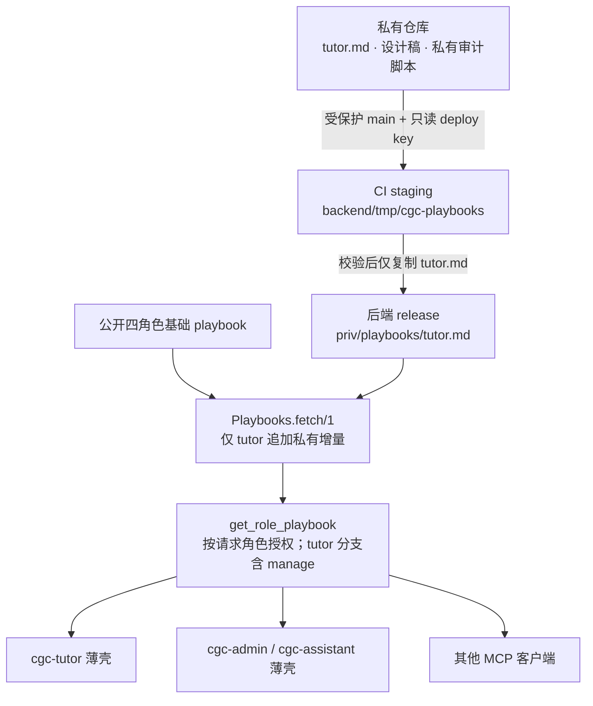
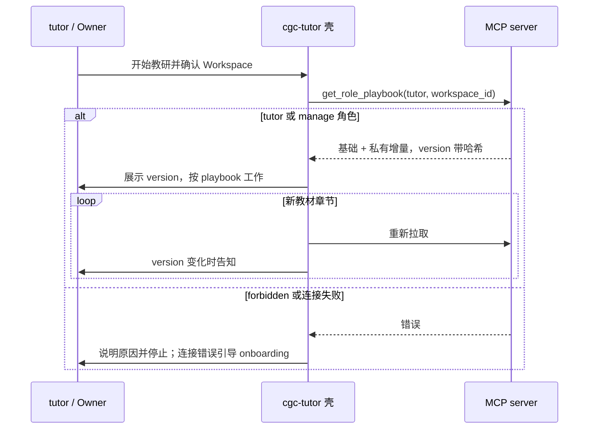
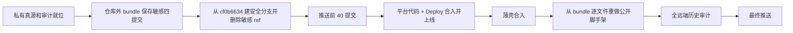

# SOP 平台化与单扩展分发 - Plan

## 执行状态更新（2026-09-05）

用户最新决定覆盖本文 U1/U9/KTD8/DoD 的删除要求：本地敏感旧分支与仓库外 bundle 保留作备份，不删除、不推送；公开提交不得含敏感祖先。

U3/U4 和薄壳代码已实现；U5 补回邀请邮件交付说明，迁移清单见下。U7 搬运脚本、校验测试和 workflow 接线已编写，外部权限、生产部署、镜像内容及 API 哈希闭环尚未验收。U8 ADR 与词条已补。U1/U9 的公开发布状态须另行核对，不能将本地完成记为发布完成。

### U5 非敏感段落迁移对照

| 旧 prompt 段落 | 新归属 |
|---|---|
| tutor 身份、可信上下文、建课转介 | tutor 壳身份/启动/宿主入口 |
| tutor 先读、渐进共创、完整内容、保存版本与冲突 | tutor 基础 playbook 起草/提交/版本纪律 |
| tutor 教研流程、诚实评分、发布确认 | tutor 基础 playbook 教研旅程/发布；壳保留发布确认 |
| tutor 作者决策与确认来源 | tutor 基础 playbook 纪律 |
| admin 身份、权限、待办、安全 | admin 壳启动/待办/安全 |
| admin 建课字段、草稿、正式标题 | workspace_admin 基础 playbook 从零建课/课程生命周期 |
| admin 已有 tutor 指派、外部邀请、预授权、绑课、邮件与后续追加 | workspace_admin 基础 playbook 课程创建后分流/邮件交付说明 |
| admin 成员管理、课程管理 | workspace_admin 基础 playbook 工作面 |
| 两壳面板、转介、视频技能 | 宿主壳；issue-video 公开 skill |

## Goal Capsule

- **Objective:** OpenClacky 用户只安装一个公开 AGPL 扩展；tutor 在教研工作台、Owner/Admin 在直接开启的 cgc-tutor 会话或其他 MCP 客户端中，均可取得平台当前已部署的教研方法论；教材锚定 SOP 正文与设计稿不进入公开 Git 历史。cgc-tutor、cgc-admin、cgc-assistant 三条 agent 统一为启动拉取 playbook，消除平台与扩展的双份方法论。
- **Means:** 四角色公开基础 playbook 继续留在后端；只有 tutor 的教材锚定增量来自私有内容仓库并在构建期进入 release（KTD1、KTD3）；cgc-tutor 与 cgc-admin 变为安全薄壳（KTD6）；扩展保持单包（KD1）。
- **Product authority:** 本会话拍板 KD1 至 KD6；ADR-0001 D10 任务指令模式；role-agent-journeys-v2 R2/R6 playbook 契约。
- **Technical authority:** ADR-0009 限界上下文地图（playbook 归 mcp/ interface layer）；CONTEXT.md「角色 Playbook」词条；deploy.yml 与 Kamal 现状。
- **Execution profile:** 先建立私有真源并隔离含 SOP 的本地提交（U2 → U1），再从无敏感祖先的分支依次落地平台、部署、壳和公开脚手架（U3–U9）。任何将推送的分支都不得从含 SOP 的四个提交派生。
- **Stop conditions:** public origin 所有已公布 refs 的可达历史通过私有内容审计；生产 tutor playbook 与镜像版本均带内容哈希；薄壳静态测试与真机行为验收通过；ADR 与词条入册。
- **Tail ownership:** 私有内容维护、审核与手动部署触发由本计划交付并写入运维文档；plan 020 DB 化、收费门、拆包不在本计划。

---

## Product Contract

### Summary

教材锚定 SOP 从未推送提交迁到私有内容仓库。生产构建只把 `playbooks/tutor.md` 复制进后端 release，`get_role_playbook` 在公开 tutor 基础 playbook 后追加它；运行时文件损坏时回落公开基础内容。cgc-tutor 与 cgc-admin 改成 cgc-assistant 同款薄壳，非敏感方法论归并到公开 playbook。OpenClacky 继续只发布一个 AGPL 扩展，不采用 protected skill 或客户端 license。

### Problem Frame

仓库公开，backend 与扩展同仓。ADR-0001 D10 已定「Agent 定义存网站、运行时拉取」，`get_role_playbook` 是现有载体，但只有 cgc-assistant 在使用。cgc-tutor 与 cgc-admin 仍把方法论写死在扩展 prompt，平台与客户端已经分叉。教材锚定 SOP 只存在于本地未推送提交和设计稿；一旦任何含这些对象的 ref 被推到 public origin，之后删除文件也无法撤回公开历史。OpenClacky 的加密只覆盖 skill，保护不了 agent prompt、面板和 handler，并会增加授权服务依赖。

### Key Decisions

- KD1. **单扩展，不拆 learner/tutor 两包** (session-settled: user-directed — chosen over 拆两包: 安装资格与实际权限由服务端 RBAC 决定；拆包会复制连接和 hub 代码，并给多角色用户制造双入口)。Governs R12
- KD2. **方法论由平台 playbook 下发，不走 OpenClacky 加密渠道** (session-settled: user-directed — chosen over marketplace 加密 skill: 加密只覆盖 SKILL.md、依赖 OpenClacky 授权服务，面板与 handler 仍明文)。Governs R3, R8
- KD3. **只有教材锚定 SOP 私有，其余方法论进公开 playbook** (session-settled: user-approved — chosen over 整份 tutor playbook 私有: 四角色基础内容已经公开，继续作为客户端中立的工具与工作纪律说明)。Governs R1, R7
- KD4. **issue-video skill 随扩展公开** (session-settled: user-approved — chosen over 一并私有化: 它是可执行脚手架而非私有教研方法论，文本 playbook 也无法承载脚本与素材)。Governs R10
- KD5. **plan 020 DB 化、marketplace 加密、拆包、平台收费门全部推后** (session-settled: user-directed — chosen over 本计划一并实现: 等真实产品信号再做)。Governs Scope Boundaries
- KD6. **新增 ADR 记录本组决策** (session-settled: user-approved — chosen over 只留计划文档: 防止重新争论，并与 ADR-0001 D10 衔接)。Governs R15

### Requirements

**发布纪律**

- R1. 教材锚定 SOP 正文、私有设计稿及其原始提交不得出现在 public origin 的任何已公布 ref（含 branch、tag、PR ref）或其可达历史；本计划与 ADR 只写公开边界和指针，不复述私有正文。
- R2. 无敏感内容的前 40 个提交在完成私有备份和历史审计后先行进入评审；SOP 迁移不阻塞这批改动。

**平台侧下发**

- R3. 生产 tutor playbook = 公开基础内容 + 私有 tutor 增量；私有增量的唯一真源是受保护的私有仓库。
- R4. 已运行实例遇到补充文件缺失、空白、不可读、非普通文件或非法 UTF-8 时回落公开基础内容并记不含正文的 warning，工具调用不失败；构建期遇到同类问题则停止部署。
- R5. API playbook version 区分有无补充并随补充内容变化；后端镜像 version 同时包含公开提交与补充内容身份，禁止同一镜像 tag 对应不同 SOP。
- R6. Workspace Owner/Admin 可读取 tutor playbook，授权口径与 `claim_prep_authoring` 一致；这不改变任何写工具权限或既有 UI 入口。
- R7. cgc-tutor 与 cgc-admin 的全部非敏感工作纪律先逐项映射到对应公开 playbook，再删除客户端副本。

**客户端壳**

- R8. cgc-tutor 与 cgc-admin 启动时必须先拉取对应角色 playbook；cgc-tutor 在教材章节边界重新拉取并展示 version。拉取失败时不得凭记忆继续工作。
- R9. 壳保留不可被 playbook 覆盖的安全纪律：标识只取自可信上下文；RBAC 是唯一权限权威；写操作先复述并获同意；凭证不进入额外文件或日志；拉取失败时停止并引导 onboarding。tutor 壳另保留发布确认与不可信教材/课程文本的 prompt-injection 防线。
- R10. 教材锚定的配套视频分支留在 tutor 壳内，`issue-video` skill 随扩展公开。
- R11. 壳只含身份、启动协议、宿主特有说明和 R9 安全纪律；面板行为、skill 触发、宿主工具与 hub 转介措辞不得进入平台 playbook。

**分发形态**

- R12. 扩展保持单包、AGPL-3.0-only、现有按角色显隐不变；不新增 `.enc`、客户端 license 或第二个扩展。

**部署与供应链**

- R13. Deploy 只从私有仓库受保护的 main 读取一个 tutor 补充文件，经临时 staging 校验后复制进 release；staging、Git 元数据、凭证、README 与设计稿均不得进入镜像或公开 Actions 日志。
- R14. 私有内容单独更新时可从受保护的 public main 手动触发部署；运维文档记录触发、验证、凭证轮换与失败恢复。生产 registry/build cache 必须保持私有。

**决策记录**

- R15. 新 ADR 记录 KD1 至 KD5、私有载体的生命周期和拒绝方案；CONTEXT.md「角色 Playbook」词条同步。

### Actors

- A1. tutor：通过 OpenClacky 教研工作台或任一 MCP 客户端共创课程。
- A2. Workspace Owner/Admin：通过 cgc-admin 管理工作台；需要直接教研时手动开启 cgc-tutor 或使用其他 MCP 客户端，扩展不为其增加教研 UI 入口。
- A3. 平台 MCP server：按角色授权下发 playbook；ToolCallLog 只记录调用参数与状态，不记录响应正文。
- A4. 部署流水线：GitHub Actions 与 Kamal 构建、标识并上线后端镜像。
- A5. 内容维护者：经私有仓库 PR 修改 SOP，触发部署并核对版本。

### Key Flows

- F1. tutor 会话启动
  - **Trigger:** 教研工作台/侧栏注入课程上下文，或 tutor、Owner/Admin 直接开启 cgc-tutor 会话。
  - **Actors:** A1, A2, A3
  - **Steps:** 壳用 `list_my_workspaces` 定位并让用户确认工作台 → 调 `get_role_playbook(tutor, workspace_id)` → 展示 version → 按 playbook 工作；进入新的教材章节前重新拉取并在 version 变化时明确告知。
  - **Outcome:** tutor 或 manage 角色得到当前已部署的完整 tutor playbook；权限不足或连接失败时，壳如实告知并停止。
  - **Covers:** R3, R6, R8, R9
- F2. 私有内容到生产
  - **Trigger:** main push 触发 Deploy，或维护者从 public main 手动触发。
  - **Actors:** A4, A5
  - **Steps:** 主仓库 checkout → 私有仓库 checkout 到 gitignored staging（不持久化凭证）→ 校验固定 ref、普通文件、非空白与 UTF-8 → 只复制 tutor.md 到 `backend/priv/playbooks` → 记录私有 commit 与内容哈希 → 删除 staging → 用「公开 SHA + 内容哈希」作为 Kamal version 构建并部署。
  - **Outcome:** 镜像只携带 tutor.md；生产 API version 带补充哈希，镜像 tag 可唯一回滚到同一内容。
  - **Covers:** R3, R5, R13, R14
- F3. 公开发布顺序
  - **Trigger:** 本计划开工。
  - **Actors:** A5
  - **Steps:** 私有真源和审计工具就位 → 把敏感四提交保存到仓库外 bundle → 从 cf0b6634 建安全评审分支并删除本仓库中的敏感 branch ref → 审计后推前 40 提交 → 后续单元只基于安全分支或其合并后的 develop → 平台部署完成后薄壳化 → 从 bundle 逐文件重做公开脚手架，禁止 cherry-pick/merge 敏感提交 → 再审计并推送。
  - **Outcome:** public origin 的全部可达历史始终不含私有正文，敏感提交不成为任何公开提交的祖先。
  - **Covers:** R1, R2

### Acceptance Examples

- AE1. **Covers R3, R5.** Given 生产镜像含已校验的 tutor 补充，When tutor 调 `get_role_playbook`，Then content 为公开基础内容加私有增量，API version 形如 `<基础版本>+<8 位哈希>`。
- AE2. **Covers R4, R5.** Given 运行时补充文件缺失或损坏，When 调 tutor playbook，Then content 与 version 回落公开基础值、调用成功且 warning 不含正文；其他三个角色始终返回公开常量。
- AE3. **Covers R6.** Given 用户在工作台只有 owner 或 admin 角色，When 请求 tutor playbook，Then 成功；只有 learner 角色时仍 forbidden。
- AE4. **Covers R1.** Given 已同步 public origin 公布的全部 refs，When 私有审计工具扫描其完整可达历史，Then 敏感提交可达性、受保护文件 blob 和由私有历史派生的正文片段均零命中；检查输出不回显正文。
- AE5. **Covers R13.** Given 私有 checkout 失败，或 tutor.md 是 symlink、空白或非法 UTF-8，When Deploy 运行，Then 在 Kamal 前失败且旧容器继续服务；有效文件只复制 tutor.md，staging 和 Git 元数据均已删除。
- AE6. **Covers R8, R9.** Given MCP 未连接、token 失效、server 不可达或角色 forbidden，When 薄壳启动，Then 停止教研/管理操作，说明原因并在连接类错误时引导 `cgc2046-onboarding`，不使用内置旧方法论。
- AE7. **Covers R3, R8.** Given 生产 tutor playbook 含私有增量，When tutor 提供触发该模式的教材输入，Then cgc-tutor 的首个业务动作停在私有 playbook 指定的确认门，不直接写课程内容。
- AE8. **Covers R12.** Given 扩展完成打包，When 检查 manifest、license 与产物，Then 仍只有 `cgc-2046` 一个扩展、三个角色 agent，无加密文件或客户端 license 分支。

### Scope Boundaries

- 不改 `get_role_playbook` 以外的工具授权，不改 Wrapper 门控，不扩写权限。
- 不新增 MCP prompts/resources capability；现有 tools/list + tools/call 即为下发通道。
- 不做离线 playbook 缓存或 last-known-good 回退；平台不可达时薄壳停止操作，避免执行过期方法论或策略。
- 不改 cgc-assistant 结构，只在安全措辞需要统一时做最小对齐。
- 不改私有 SOP 的方法论内容，只迁移位置并去除宿主特有措辞。
- 不实现收费门；未来收费点在平台套餐/工具授权，不在扩展 license。
- 教研 UI 保持 tutor-only，这是三角色分工的既有产品决定；Owner/Admin 是否增加教研入口另议。

#### Deferred to Follow-Up Work

- plan 020：playbook DB 化与后台编辑；届时从私有仓库导入后退役 CI checkout 和 deploy key，不保留双真源。
- marketplace 上架与 protected skill。
- 私有仓库变更自动触发主仓库部署。
- 是否为 Owner/Admin 增加教研 UI 入口。

### Open Questions

- OQ1（执行期测量，不阻塞）：每章重拉的响应字节数和上下文增量；试跑后若成本显著，再评估在现有工具上增加 `known_version` 条件返回，当前不新增协议面。

---

## Planning Contract

### Key Technical Decisions

- KTD1. **v1 只支持一个私有增量文件 `playbooks/tutor.md`，不抽象为四角色私有目录。** 公开常量仍是四角色基础真源；只有教材锚定增量追加到 tutor，避免为未出现的需求扩大授权与配置面。
- KTD2. **API version = 基础版本 + `+` + tutor.md 的 SHA-256 前 8 位。** 无有效补充时保持基础 version；内容变化自动体现，无需手工 bump。
- KTD3. **生产只读 release 固定的 `priv/playbooks/tutor.md`。** dev 可用 `CGC_PLAYBOOKS_DIR` 指向私有仓库的 playbooks 子目录；test 固定指向不存在目录，runtime 覆盖不得作用于 test 或 prod (session-settled: user-approved — chosen over 宿主机卷挂载: 工作树构建已能把受控文件带入 release，无需新增服务器状态)。
- KTD4. **运行时补充异常 fail-open 到公开基础内容，构建时同类异常 fail-closed。** 运行中的单次磁盘异常不击穿 MCP；发布流水线不得把无私有增量的新镜像误报为成功。
- KTD5. **tutor playbook 授权扩为 tutor ∪ manage roles，镜像 `claim_prep_authoring`。** playbook 只组织现有能力，不授予写权限。
- KTD6. **平台写客户端中立方法论，壳写身份/启动、宿主能力和安全纪律。** 安全纪律优先于运行时 playbook；cgc-tutor 在教材章节边界重拉，cgc-admin 只需会话启动拉取 (session-settled: user-approved — chosen over 壳继续内置方法论: 双份内容已发生漂移)。
- KTD7. **私有仓库只作 CI staging，不整仓进入 build context。** checkout 到 `backend/tmp/cgc-playbooks`，关闭凭证持久化；校验后只复制 tutor.md，删除 staging。Kamal version 使用公开 SHA 与内容哈希组合，保证内容可回滚。
- KTD8. **敏感提交备份放在公共仓库之外。** 将 cf0b6634 之后的四个提交保存为权限收紧的 bundle，安全分支从 cf0b6634 创建；验证 bundle 后切走并删除 `feat/cgc-ext-improvements` 本地 ref，后续不得 cherry-pick、merge 或 rebase 敏感提交 (session-settled: user-approved — chosen over 原分支继续工作: 任一推送都会带上敏感祖先)。
- KTD9. **发布审计从私有内容和私有 Git 历史派生，不靠事后手选标记词。** 私有脚本扫描 public origin 公布的全部 refs 及其可达对象，只报告 ref/path/object，不输出命中正文。公开计划、ADR、测试与提交信息只引用模式名和私有章节指针。
- KTD10. **私有仓库是 agent 指令供应链。** 私有 main 必须走 PR review、禁止直推；CI 使用只读 deploy key；GitHub production environment 只允许 public main；registry/cache 不得公开。

### High-Level Technical Design

以下图只表达边界与顺序，不是实现代码。

### System-Wide Impact

- 授权：tutor playbook 读取扩到 Owner/Admin；写权限与 UI 入口不变。
- CI/CD：Deploy 增加一个私有 checkout、内容校验、唯一镜像 version 与一个只读 deploy key secret。
- Agent：三条 OpenClacky agent 统一启动拉取；cgc-tutor 额外按教材章节刷新。
- 制品：tutor.md 进入私有后端镜像；私有仓库其他内容、Git 元数据与凭证不进入。
- 文档：新增 ADR-0012，更新 CONTEXT.md、运维文档和扩展 README。

### Risks & Dependencies

- 工具结果中的方法论服从度可能低于 system prompt。缓解：硬安全纪律留壳；壳明确平台 playbook 的权威边界；AE7 做真机行为探针。
- 每章重拉会再次占用上下文。接受 v1 的一次工具往返，记录响应字节数；只有实测显著时才增加条件返回。
- 持 tutor 或 manage 角色的用户可读取并复制 SOP。接受：目标是控制活版本、变更与审计，不承诺对授权用户保密。
- 私有内容更新不会自动上线。产品文案统一称「当前已部署版本」；维护者按 R14 手动触发，自动触发后续再做。
- 私有仓库或 deploy key 故障会阻断后端新部署，旧容器继续服务。选择无强制到期的只读 deploy key，运维文档记录轮换与恢复；不在本计划加入绕过私有内容的热修通道。
- 私有仓库被误改会影响所有教研会话。私有 main 禁直推并要求 PR review；部署日志记录私有 commit 和内容哈希，但不输出正文。
- 镜像层与构建缓存包含 tutor.md。U7 前确认 TCR namespace/cache 为私有，访问主体仅 CI、部署与运行环境；不满足则停止上线。
- public workflow 若能从任意 ref 使用 production secret 会扩大泄露面。production environment 必须限制到 protected main；私有 checkout 不持久化凭证。
- 现有 ToolCallLog 只落调用参数和状态，不落工具响应，因此不会复制 SOP 正文；本计划不改日志 schema。
- 扩展 minitest 不在 ci.yml。U1、U6、U9 均要求本地全量执行并把结果附在 PR。
- 依赖：私有仓库、branch protection、deploy key、production environment branch rule 和私有 registry 检查须在 U7 合并前完成。

---

## Implementation Units

### U1. 敏感提交隔离与公开首推

- **Goal:** 让无 SOP 的前 40 个提交安全进入评审，并建立后续工作的唯一安全祖先。
- **Requirements:** R1, R2, KTD8, KTD9
- **Dependencies:** U2
- **Files:** 无产品文件改动；操作对象为本地 bundle、分支引用和 public origin。
- **Approach:**
  1. 在仓库外创建仅当前用户可读的 bundle，保存 cf0b6634 之后四个提交；用 `git bundle verify` 和树读取验证可恢复。
  2. 从 cf0b6634 创建新的评审分支并切换当前 worktree；确认 bundle 后删除本仓库中的 `feat/cgc-ext-improvements` branch ref，不创建 tag 或 `refs/backup`。
  3. 规定 U3–U9 的所有公开提交只以该安全分支或其合并后的 develop 为祖先；禁止从 bundle 中的提交 cherry-pick、merge 或 rebase。
  4. 在 cf0b6634 树运行扩展全量 minitest，并用 U2 私有审计脚本检查将推送的 ref 与当前 public origin。
  5. 审计通过后推送评审分支、向 develop 开 PR，沿用 merge commit 策略；推送后同步远端 refs 并再次审计。
- **Test scenarios:** Test expectation: none -- 分支隔离操作；由 bundle 验证、可达性检查、私有历史审计和扩展测试共同验收。
- **Verification:** bundle 可恢复；本仓库没有指向敏感提交的 branch/tag；前 40 提交的扩展 minitest 全绿；推送前后 AE4 均成立；PR CI 绿。

### U2. 私有内容仓库与审计工具

- **Goal:** 建立教材锚定 SOP 的唯一真源、变更控制和不可自欺的公开历史检查。
- **Requirements:** R1, R3, R13, R14, KTD1, KTD9, KTD10
- **Dependencies:** 无
- **Files:**（私有仓库）`playbooks/tutor.md`、`docs/2026-09-01-2329-feat-textbook-anchored-course-authoring-plan.md`、`scripts/audit-public-history`、`README.md`
- **Approach:**
  1. 在 CodingGirlsClub 下创建私有仓库 `cgc-playbooks`；main 禁直推并要求 PR review。
  2. 将当前 tutor prompt 中已标记的教材锚定私有章节迁为客户端中立的 tutor 增量；本计划、公开 ADR 和 commit message 只引用章节，不复述正文。
  3. 配套视频条款不进入私有 tutor.md，继续由公开 tutor 壳和 issue-video skill 持有（R10）。
  4. 将现有私有设计稿迁入该仓库；公开仓库最终不得保留文件或历史对象。
  5. 新增私有审计脚本：从私有文件当前版本和历史生成受保护 blob/片段集合，扫描 public origin 公布的全部 refs（含 PR refs）及完整可达对象；同时检查四个敏感源提交不可达。允许清单只列已经决定公开的名称，不得手工缩窄受保护集合。输出只含 ref/path/object id。
  6. README 记录文件约定、授权读者、内容审核、hash/version 规则、公开审计、部署触发、deploy key 轮换，以及「私有不等于对 tutor/Owner/Admin 保密」。
- **Test scenarios:**
  - 对已知含私有正文的本地 bundle 扫描必须失败，但日志不回显正文。
  - 对 cf0b6634 与当前 public origin 扫描通过。
  - 把敏感文件改名或放到仓库其他目录，扫描仍失败。
  - 仅出现允许公开的模式名时不误报。
- **Verification:** 私有仓库四类文件就位、main 保护生效；审计脚本的正反例通过；公开工作树没有私有设计稿。

### U3. Playbooks 运行时 tutor 增量源

- **Goal:** `Playbooks.fetch/1` 为 tutor 追加私有增量并派生 version，异常时安全回落。
- **Requirements:** R3, R4, R5, KTD1, KTD2, KTD3, KTD4
- **Dependencies:** 无（测试使用临时夹具，不依赖私有仓库）
- **Files:** `backend/lib/cgc_2046/mcp/playbooks.ex`、`backend/config/runtime.exs`、`backend/config/test.exs`、`backend/.gitignore`、`backend/test/cgc_2046/mcp/playbooks_test.exs`（新）
- **Approach:**
  1. 仅 tutor 分支读取 `<dir>/tutor.md`；prod 的 dir 固定为 release priv，dev 才接受 `CGC_PLAYBOOKS_DIR`，test 始终使用固定不存在目录。
  2. 文件必须是普通非 symlink 文件、trim 后非空且为合法 UTF-8；有效时用一个空行拼接基础内容与增量，API version 加 SHA-256 前 8 位。其他角色不查私有目录。
  3. 缺失、非法或读取失败返回原常量；除预期缺失外记 warning，日志只写错误类别和安全路径，不写内容。
  4. 更新 moduledoc：公开常量是四角色基础真源，tutor 可有构建期增量；plan 020 将整体替换该载体。
  5. `backend/.gitignore` 增加 `/priv/playbooks/`；seeds 打印逻辑继续走 `version/1`。
- **Patterns to follow:** `backend/lib/cgc_2046/release.ex` 的 priv 解析；现有全局 Application env 测试的恢复方式。
- **Test scenarios:**
  - 测试模块 `async: false`，每次修改 Application env 后在 on_exit 恢复。
  - 无目录：四角色 content/version 与公开常量一致。
  - 有有效 tutor.md：只给 tutor 追加；content 前后边界正确；version 为基础值加 8 位十六进制。
  - 同内容两次 version 相同；内容改变后 version 改变。
  - 缺文件、全空白、symlink、非普通文件、非法 UTF-8 与读取错误：回落基础 tutor，warning 不含正文。
  - learner、workspace_admin、platform_admin 即使目录里有同名角色文件也不追加。
  - 未知角色仍返回 `{:error, :unknown_role}`。
  - 导出 dev 覆盖变量后运行 test，test 的固定目录仍不被覆盖。
- **Verification:** 新测试全绿；`mix precommit` 绿；dev 指向私有仓库 playbooks 子目录时 tutor version 带哈希，test 仍返回基础版本。

### U4. tutor playbook 授权扩到 Owner/Admin

- **Goal:** 能认领教研的人都能读取 tutor playbook。
- **Requirements:** R6, KTD5
- **Dependencies:** 无
- **Files:** `backend/lib/cgc_2046/mcp/tools/get_role_playbook.ex`、`backend/test/cgc_2046/mcp/role_workbench_tools_test.exs`
- **Approach:** tutor 授权改为 `Prep.tutor?/2 or Prep.manage?/2`，与认领教研工具同源；同步 `get_role_playbook` 的 moduledoc 和 forbidden 文案。写工具继续各自授权，不因 playbook 读取成功放宽。
- **Patterns to follow:** `backend/lib/cgc_2046/mcp/tools/claim_prep_authoring.ex` 的授权形状。
- **Test scenarios:**
  - owner 成员请求 tutor playbook 成功；admin 成员成功。
  - 只有 learner 角色的成员 forbidden，ToolCallLog 记 forbidden。
  - tutor、platform_admin、workspace_admin、learner 既有分支与缺 workspace_id 错误保持不变。
- **Verification:** role_workbench_tools_test 全绿。

### U5. 公开 playbook 吸收非敏感方法论

- **Goal:** 在删客户端正文前，以逐项清单证明 cgc-tutor 与 cgc-admin 的非敏感纪律都有平台归宿。
- **Requirements:** R7, KD3
- **Dependencies:** U3, U4
- **Files:** `backend/lib/cgc_2046/mcp/playbooks.ex`、`backend/test/cgc_2046/mcp/role_workbench_tools_test.exs`
- **Approach:**
  1. 以两份现有 prompt 的非敏感段落为左侧，建立 PR 内逐项迁移清单；每项只允许「已在公开 playbook」「本单元新增到公开 playbook」「按 KTD6 留壳」三种归宿，未归类不得进入 U6。
  2. tutor 公开 playbook 补齐：创作前读取草稿与 prep 状态；对话渐进但落盘整卡；乐观并发冲突重读合并；保存后报告摘要/version；tutor 对方向性问题拍板；事实材料只用 tutor 提供或确认的来源；诚实质量报告；发布须明确确认；课程创建转交管理角色。
  3. tutor 公开 playbook 同时加入客户端中立的不可信教材/课程文本纪律；该纪律与 tutor 壳重复是刻意的纵深防护。
  4. workspace_admin 公开 playbook 补齐：从零建课的对话式收集与完整参数语义；指派已有成员或邀请外部 tutor 的两条路径；正式标题门；管理助手不创作课程内容。
  5. 两常量 bump version；公开测试为每类新增纪律设正向锚点，不把私有正文片段写入测试。
- **Test scenarios:**
  - 迁移清单覆盖两份 prompt 的每个非敏感段落，且每项有目标章节或壳归属。
  - tutor playbook 包含先读后写、整卡、冲突合并、变更摘要、tutor 决策、确认来源、诚实评分、发布确认、不可信数据与角色转介锚点。
  - workspace_admin playbook 包含课程需求、两条 tutor 指派路径、预授权角色/绑课、正式标题与不写课程内容锚点。
  - learner 与 platform_admin content/version 不变。
- **Verification:** role_workbench_tools_test 全绿；seeds 打印新版本；迁移清单无未归类项。

### U6. cgc-tutor 与 cgc-admin 薄壳化

- **Goal:** 两条 agent 与 cgc-assistant 同构，同时维持一个扩展和既有角色入口。
- **Requirements:** R8, R9, R10, R11, R12, KTD6, KD1, KD4
- **Dependencies:** U4, U5；生产平台 playbook 已完成 U7 成功部署后才发布薄壳
- **Files:** `openclacky-ext/cgc-2046/agents/cgc-tutor/system_prompt.md`、`openclacky-ext/cgc-2046/agents/cgc-admin/system_prompt.md`、`openclacky-ext/cgc-2046/README.md`、`openclacky-ext/cgc-2046/test/cgc_home_panel_test.rb`、`openclacky-ext/cgc-2046/test/issue_video_skill_test.rb`
- **Approach:**
  1. 两 prompt 统一为：身份与职责边界 → 选择可信 Workspace → 拉对应 playbook 并展示 version → 宿主特有能力 → 共享及角色专属安全纪律。
  2. 拉取出现连接错误、401 或 server 不存在时，引导 `cgc2046-onboarding` 并停止；forbidden 时说明所需角色并停止。任何错误都不得凭旧 prompt 记忆继续。
  3. cgc-tutor 只保留教研侧栏/面板注入、公开 issue-video 条款、课程创建的 hub 转介、教材章节边界重拉，以及 tutor 专属安全纪律。
  4. cgc-admin 只保留 hub/管理侧栏/待办入口、转介教研工作台和共享安全纪律；启动只拉 workspace_admin playbook，不隐式拉 tutor playbook。
  5. 删除已经由 U5 接管的方法论和私有章节；用 U2 私有审计验证没有正文残留，不在公开测试中登记私有片段。
  6. README agents 段改为薄壳描述；不改变面板可见角色。
- **Patterns to follow:** `openclacky-ext/cgc-2046/agents/cgc-assistant/system_prompt.md` 的启动、RBAC、连接失败和不可信数据结构。
- **Test scenarios:**
  - 两 prompt 均含上下文选择、对应 role 的 playbook 拉取、version 展示、RBAC 权威、连接失败/onboarding 和 forbidden 停止。
  - 共享安全纪律在两壳存在；发布确认与教材/课程不可信数据纪律只要求 tutor 壳存在。
  - tutor 壳保留视频分支、章节重拉、侧栏与 hub 转介；admin 壳保留管理入口与教研转介。
  - 私有审计脚本对两 prompt 与整个将推送 ref 零命中。
  - `ext.yml` 仍为一个 `cgc-2046` 包并注册三 agent；根 LICENSE 与 manifest 仍为 AGPL-3.0-only；无 `.enc` 或客户端 license 代码。
- **Verification:** 扩展 minitest 与 `bin/pack` 全绿；tutor 真机会话通过 AE6、AE7；owner 直接开启 cgc-tutor 能读 tutor playbook；cgc-admin 会话读 workspace_admin playbook。

### U7. 部署管线内置私有内容

- **Goal:** 生产镜像可验证、可回滚地携带 tutor 私有增量，且不携带私有仓库其他内容。
- **Requirements:** R5, R13, R14, KTD3, KTD7, KTD10
- **Dependencies:** U2, U3
- **Files:** `.github/workflows/deploy.yml`、`docs/运维/邮件与CD环境注入.md`（或同目录新文）
- **Approach:**
  1. 为私有仓库配置 read-only deploy key；私钥存 public repo 的 production environment secret，environment deployment branch rule 只允许 protected main。
  2. backend job 主 checkout 后，用 actions/checkout 将私有 main checkout 到 `backend/tmp/cgc-playbooks`，设置 `persist-credentials: false`；记录解析到的 private commit。
  3. 在不输出文件内容的前提下，验证 source 是普通非 symlink 文件、trim 后非空且合法 UTF-8；只复制 tutor.md 到 `backend/priv/playbooks/tutor.md`，计算内容哈希后删除整个 staging。
  4. Kamal deploy 显式使用 `<public SHA>-pb<内容哈希前 8 位>` 作为 version；同一 public SHA 下 SOP 更新也产生新 tag，可精确回滚。
  5. 私有 checkout、校验、复制和错误注解不得使用 cat/head/diff 或 shell trace，不得把正文写入 Actions log/summary；构建前断言 staging 与 `priv/playbooks/.git` 不存在。
  6. 运维文档记录 secret/权限、main 限制、deploy key owner 与轮换、私有 repo commit 到镜像 version 的追踪、手动部署、失败恢复、本地 dev 变量，以及 registry/cache 私有性验收。
- **Execution note:** 先把 U1–U5 与 U7 经安全分支合入 develop，再按仓库 develop→main 发布流程让新 workflow 落到 protected main；随后从 main 执行一次手动部署和生产验收。不得对未受保护的 feature ref 运行含 production secret 的 workflow。
- **Test scenarios:**
  - 有效 tutor.md：只复制该文件；staging 与 Git 元数据在构建前不存在；version 包含内容哈希。
  - 缺 deploy key/checkout 失败：backend job 在 Kamal 前停止。
  - 文件缺失、空白、symlink 或非法 UTF-8：校验失败且日志不含正文。
  - 同一 public SHA、两份不同 tutor.md：得到两个不同镜像 version。
  - production environment 拒绝非 main ref 使用 secret；无权限身份不能拉取/解包 registry 制品。
- **Verification:** workflow 配置评审通过；main 手动部署成功；生产 `get_role_playbook(tutor)` 与镜像 version 的哈希一致；构建日志/镜像不含 staging、`.git`、README、设计稿或凭证。

### U8. ADR-0012 与词条同步

- **Goal:** 决策、威胁边界与未来退役路径入册。
- **Requirements:** R15, KD6
- **Dependencies:** U3, U4, U7
- **Files:** `docs/adr/0012-single-extension-platform-sop-private-supplement.md`（新）、`CONTEXT.md`
- **Approach:** 按 ADR-0011 格式记录：与 ADR-0001 D10 的关系；单扩展与平台 playbook；只私有 tutor 增量；授权扩面但写权限不变；构建期 staging 与内容版本；公开历史审计；拒绝拆包、加密 skill、宿主机卷与现在 DB 化。只用私有章节指针，不复述正文。明确私有仓库是 plan 020 前的载体：DB 化时一次性导入并退役 checkout/deploy key。
- **Test scenarios:** Test expectation: none -- 决策文档；以指针纪律和源码一致性验收。
- **Verification:** ADR 不含私有审计命中；CONTEXT.md 的载体、授权、版本和退役描述与代码一致。

### U9. 公开脚手架重做与收尾推送

- **Goal:** 把 issue-video 等可公开内容从仓库外 bundle 逐文件重做到安全历史，绝不带入敏感提交祖先。
- **Requirements:** R1, R2, R10, KTD8, KTD9
- **Dependencies:** U2, U6, U7
- **Files:** 原四提交中的公开 issue-video 文件、`ext.yml`、README 与相关测试；不创建公开设计稿。
- **Approach:**
  1. 从最新安全 develop 新建分支，只用 `git show <bundle-ref>:<path>` 或补丁人工选取公开文件；禁止 cherry-pick、merge、rebase 或把原提交作为父提交。
  2. 保留 issue-video 脚本/素材、skill 注册与测试；tutor prompt 以 U6 薄壳为基底，仅加入公开视频分支；保留 course_content_write_test 新增的 EDIT_ROLES tutor-only 断言。
  3. 公开 README、测试、commit message 与 PR 描述不复述私有方法论；PR 只说明 SOP 由平台私有增量提供。
  4. 提交前运行扩展门、私有历史审计和祖先可达性检查；推送后 fetch public origin 公布的全部 refs 并再审计。
  5. PR 合并且远端复核通过后，删除仓库外 bundle 和任何临时提取目录，并复核不存在敏感本地 ref。
- **Test scenarios:** Test expectation: none -- 历史重做；公开脚手架行为由现有 issue-video 测试、扩展门和 AE4 验收。
- **Verification:** 扩展 minitest/打包全绿；新分支祖先不含四个敏感提交；推送前后 AE4 成立；bundle 与临时目录在合并后删除。

---

## Verification Contract

| 门 | 命令或检查 | 适用单元 | 通过信号 |
|---|---|---|---|
| 后端 | `cd backend && mix precommit` | U3, U4, U5 | 编译无警告、格式与测试全绿 |
| 扩展 | `cd openclacky-ext/cgc-2046 && set -e; for f in test/*.rb; do mise exec -- ruby "$f"; done` | U1, U6, U9 | 任一测试失败即非零；完整结果附 PR |
| 扩展打包 | `openclacky-ext/cgc-2046/bin/pack` | U6, U9 | `openclacky ext verify` 通过，仍为单包 AGPL |
| 私有发布审计 | 私有仓库 `scripts/audit-public-history` | U1, U2, U6, U8, U9 | public origin 公布的全部 refs 及可达历史零命中；日志不输出正文 |
| 分支祖先 | 检查将推送 ref 不含四个敏感提交且本仓库无敏感 branch/tag | U1, U9 | 四提交对所有 public refs 均不可达 |
| 部署 | protected main 的 Deploy workflow + 生产探针 | U7 | staging/内容校验通过；API 与镜像 version 哈希一致；制品访问保持私有 |
| 真机行为 | OpenClacky tutor/owner/admin 三条会话 | U6, U7 | AE6、AE7 与角色映射成立 |

---

## Definition of Done

- 全局：AE1 至 AE8 成立；R1 至 R15 均有实施单元和验证；未引入第二扩展、客户端 license 或兼容层。
- U1：前 40 提交的安全 PR 已开启；后续公开分支都从安全祖先派生；敏感提交只在仓库外 bundle。
- U2：私有仓库内容、保护规则和审计工具就位，正反例通过。
- U3：运行时有效/异常/隔离场景全绿，dev 覆盖不污染 test/prod。
- U4：tutor、owner、admin 与 learner 的授权矩阵测试全绿。
- U5：两 agent 的非敏感纪律逐项有归宿，公开 playbook 版本与测试更新。
- U6：两薄壳只含允许边界；单包、AGPL、静态测试、打包与真机行为通过。
- U7：受保护 main 完成一次带私有内容的部署；API 与唯一镜像 version 对得上；日志、镜像和 registry 边界通过。
- U8：ADR-0012 与 CONTEXT.md 入册且通过私有审计。
- U9：公开脚手架 PR 合并；远端全历史复核通过；仓库外 bundle 与临时提取目录已删除。

---

## Appendix

### Sources

- `docs/adr/0001-website-as-mcp-server-byo.md` D10：任务指令模式。
- `backend/lib/cgc_2046/mcp/playbooks.ex`、`backend/lib/cgc_2046/mcp/tools/get_role_playbook.ex`：现有载体与授权分支。
- `backend/lib/cgc_2046/mcp/tools/claim_prep_authoring.ex`：tutor ∪ manage 授权先例。
- `backend/lib/cgc_2046/release.ex`：release priv 解析先例。
- `backend/lib/cgc_2046/mcp/wrapper.ex`、`backend/lib/cgc_2046/mcp/tool_call_log.ex`：审计只落参数/状态，不落工具响应。
- `.github/workflows/deploy.yml`、`backend/config/deploy.yml`：protected main 部署、Kamal context 与 secrets 断言。
- Kamal 2.10.1 `configuration.rb` 与 CLI：显式 version 可覆盖 Git SHA，构建工作树由 context 提供。
- OpenClacky 1.5.12 loader/packager/brand config：加密仅覆盖 skill，解密依赖 license 服务。
- `openclacky-ext/cgc-2046/test/cgc_home_panel_test.rb`、`openclacky-ext/cgc-2046/test/issue_video_skill_test.rb`：现有 agent 与 skill 契约测试。
