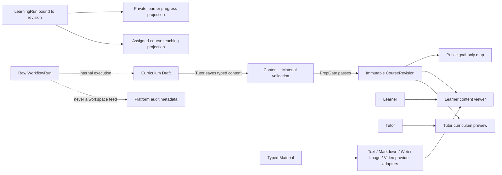

# feat: 课程内容阅读、媒体引用与 WorkflowRun 隐私边界实施计划

## Goal Capsule

**Objective:** 学员可以在 Web 端按已发布课程版本阅读章节、Issue、Objective 及其文字、Markdown、网页、图片和视频材料；Tutor、Owner、Admin 获得与职责匹配的课程内容或统计投影；任何角色都不会因为 Workspace 成员资格而自动看到 Learner 的原始 WorkflowRun 或个人学习过程。

**Means:** 将 WorkflowRun 从 Workspace 共享列表降级为内部执行记录，改用“本人原始运行 + 角色化业务投影”；把 Curriculum 内容扩展为可选 chapter 与带类型的 Material；以不可变 CourseRevision 作为 Web 学习内容事实源；第一阶段通过 provider adapter 使用 B 站等外部视频托管，不在 CGC 小服务器保存视频二进制。

**Authority hierarchy:** 本计划的 Product Contract 优先于当前页面形态；现有 ADR-0009、ADR-0011、AGENTS.md 的多租户、BYO、不可变 revision、无兼容层规则优先于局部实现便利；执行中如发现会改变 R1/R2/R5 或 KTD1/KTD4 的证据，暂停并回到产品决策，不自行扩大权限或媒体能力。

**Stop conditions:** 不把原始 learner facts 暴露给 Workspace Owner/Admin/Tutor；不把章节当作依赖关系；不把任意 iframe/HTML 当成媒体协议；不在第一阶段加入视频上传、转码、对象存储或 Learning Path 引擎；不通过兼容分支继续接受旧自由字符串作为正式内容协议。

**Tail ownership:** 本计划完成后由实现者运行 Verification Contract，并在实现结束前清理未采用的临时代码、旧 Workflows 共享入口和失效测试夹具；发布、合并和部署仍遵守仓库的 Mainline 与 merge-commit 规则。

---

## Product Contract

### Problem Frame

当前 `/w/[slug]/workflows` 使用 `listWorkflowRuns` 按 Workspace 读取执行实例，后端 WorkflowRun 的 read policy 是 Workspace 成员或平台管理员，因此 Owner/Admin/Tutor/普通成员都可能看到同一 Workspace 的运行记录。对于 learning run，这种“成员可读”会把 Learner 的学习过程、facts 和步骤产物当成 Workspace 公共数据。

课程内容又处在另一条不完整的链路上：Curriculum 内容已经保存 goals、issues、objectives 和 materials，但 Web 公开地图只展示 goal-only 投影，`courseLearningDetail` 只返回掌握状态，Web 没有正式的内容阅读器。OpenClacky 扩展已有 `/content`、`/revision` 和局部材料展示，但该能力没有成为 Web 的共享内容协议。

Issue #427 已确认内容模型缺少 chapter 叙事维度。章节只是目录投影，Objective 的 `prereq_ids` DAG 才是知识依赖事实；两者必须同时存在且互不替代。

### Actors

- **Learner:** 阅读已报名课程，查看自己的掌握状态，按章节和目标进入 OpenClacky 学习；只能看自己的学习过程投影。
- **Tutor:** 负责课程教研和教学支持，编辑/预览负责课程的 draft，查看发布版本和必要的教学状态投影；不读取 Learner 原始 run、会话或个人证据全文。
- **Owner/Admin:** 管理课程供给、发布门禁和 Workspace 统计；查看课程内容与聚合结果，不因管理角色获得 Learner 原始学习过程权限。
- **Platform Admin:** 负责跨 Workspace 运行健康和故障审计，默认只看脱敏的运行元数据；若未来需要查看受保护内容，必须是有理由、可审计的 break-glass 能力。
- **OpenClacky / cgc-2046:** Tutor 和 Learner 的 BYO 执行环境，通过 MCP 获取领域内容和写入教研/学习结果；不成为 Web 的内容事实源。

### Requirements

- R1. **原始 WorkflowRun 私有化。** Learning run 的原始输入、facts、步骤产物和执行日志默认只对被绑定的 User 可读；Owner/Admin/Tutor 不因 Workspace membership 取得该读取权。
- R2. **平台审计脱敏。** Platform Admin 可以查看跨 Workspace 的状态、类型、耗时、经过 allowlist 的错误摘要和关联资源等技术元数据；默认不返回 learner facts、对话内容、证据全文或长期个人材料，错误摘要不得直接拼接用户输入或 facts。
- R3. **角色化业务投影。** Learner 读取自己的学习投影；Tutor 读取被分配课程的教学投影；Owner/Admin 读取课程发布和聚合统计投影；这些投影不能通过参数拼接成任意 User 视角。
- R4. **移除共享 Workflows 心智模型。** 普通 Workspace 页面不再提供全量 WorkflowRun 列表；Learner 使用 My Learning，Tutor 使用 Curriculum Workbench，Owner/Admin 使用 Course Governance，Platform Admin 使用 Operational Audit。
- R5. **Chapter 是可选叙事标签。** 内容支持 `chapters[]` 与 issue 的可选 `chapter_id`；有归属的 Issue 按章节分组，无归属的 Issue 进入“未分组”；章节不承载顺序、先修或路径依赖。
- R6. **Material 使用强类型合同。** 材料至少支持 `text`、`markdown`、`web`、`image`、`video` 五类；每类使用受约束的 source locator，不继续把任意 `ref` 当作播放器、HTML 或安全策略。
- R7. **CourseRevision 是 Web 学习事实源。** 已发布内容随不可变 CourseRevision 冻结；Learner 的 LearningRun 绑定 revision，不能因为后续发布而静默改写历史学习版本。
- R8. **Learner Web 阅读器。** 已确认报名或合法学习持有者可以在 Web 按 CourseRevision 浏览 Chapter → Issue → Objective，查看正文、活动、评估、rubric 和有权限的 Material。
- R9. **Tutor/管理 Web 预览。** Tutor 能查看负责课程的 draft 与已发布 revision；Owner/Admin 能查看发布状态、版本和课程内容，但不直接读取 Learner 原始 run。
- R10. **媒体渲染安全。** Markdown 必须安全渲染；网页默认是外链卡片而不是任意 iframe；图片需要 alt；视频只允许已注册 provider adapter；未知 provider 退化为安全外链，不执行原始 HTML。
- R11. **外部视频托管。** 第一阶段使用 Bilibili provider 作为首个视频 adapter，保存 provider 与外部 ID/规范 URL，不在 CGC 服务器上传、保存或转码视频；外部公开视频不能被当作报名权限的安全边界，带 `enrolled`/`workspace` 访问范围的材料在没有签名 URL provider 前必须拒绝发布。
- R12. **发布前内容校验。** 发布/保存时拒绝缺少必需字段、无效 locator、未注册 provider、危险 Markdown/URL、缺少视频 ID 或图片 alt 的新内容；已有发布版本不被就地修改。
- R13. **扩展与 Web 共享形状。** OpenClacky 教研、课程学习面板与 Web 使用同一 typed Material、chapter 和 revision 形状；扩展可以先消费 MCP 投影，但不得继续发明另一套 `video:` 约定。
- R14. **失败可理解。** 外部视频不可访问、网页失效或图片加载失败不会阻塞课程主体；UI 展示失败状态和原始链接，并保留章节、目标和学习进度。
- R15. **隐私可验证。** 非成员、其他 Workspace 成员、Owner/Admin/Tutor 对 Learner 原始 run 的 GraphQL/API 读取均被拒绝或返回空；参数中不得存在任意 `user_id` 视角绕过。

### Key Flows

- F1. **教研与发布：** Tutor 通过 OpenClacky 编写 chapter、Issue、Objective 和 typed materials → 保存 draft → 预览媒体 → 通过 PrepGate → Owner/Admin 审核 → 发布不可变 CourseRevision。
- F2. **Learner 学习：** Learner 报名并确认 → My Learning 打开绑定 revision → 按章节阅读材料/播放视频 → CTA 进入 OpenClacky → LearningRun 只更新自己的学习账本与投影。
- F3. **Tutor 教学支持：** Tutor 打开被分配课程 → 查看 draft/已发布内容与教学投影 → 通过材料和 Objective 协助学习；看不到 learner 原始 facts 或会话全文。
- F4. **Owner/Admin 治理：** Owner/Admin 查看课程状态、发布版本、草稿版本和聚合进度 → 管理供给与发布，不打开 learner raw run。
- F5. **Platform Audit：** Platform Admin 按 Workspace、run kind、status、时间过滤运行元数据 → 诊断失败和积压；敏感事实默认脱敏，任何增强访问必须单独审计。

### Acceptance Examples

- AE1. Workspace 中有 Learner A 的 learning run，Owner、Admin、Tutor 查询原始 run 均无结果或 forbidden；Learner A 查询自己的过程成功；Learner B 不能通过修改 course/workspace 参数读取 A。
- AE2. Platform Admin 可以看到 A 的 run status、definition type、workspace、started/finished time 和 error summary，但响应不含 facts、input snapshot 或证据全文。
- AE3. 一门课程包含 `chapters` 和带/不带 `chapter_id` 的 issues；Tutor 面板、Web 学习页和扩展学习地图按章分组，未分组内容集中显示，Objective 跨章节 `prereq_ids` 仍按 DAG 锁定。
- AE4. 一个 Objective 含纯文本、Markdown、网页、图片和 B 站视频材料；Learner Web 页面分别以安全文本、Markdown、外链卡片、带 alt 图片和点击播放视频呈现，视频 provider 失败时显示原链接。
- AE5. 发布后的 CourseRevision v3 仍包含原材料和章节；编辑生成 v4 后，绑定 v3 的 LearningRun 继续显示 v3 并标记 stale，不能被 v4 静默覆盖。
- AE6. 保存未知 `video:` 字符串、危险 URL、任意 iframe、缺少图片 alt 或缺少 provider ID 的新内容时，服务端拒绝并返回可修复错误；不会把原始字符串直接注入 Web/扩展 DOM。
- AE7. 公开未报名用户只能看到 goal-only 课程地图；不能通过公开 query 取得 enrolled materials、rubric 或 learning state。

### Success Criteria

- 权限验收中，Learner 原始 run 泄漏路径为零；Owner/Admin/Tutor 的课程业务页面仍可完成其职责而不依赖 raw WorkflowRun。
- Web 学习页能从真实 GraphQL/HTTP 入口加载一个已发布 revision，并在同一页完成 chapter 展开、Objective 选择、五类材料渲染和视频失败回退。
- `courseLearningDetail` 与内容 query 的 actor 锚定不出现可选 `user_id` 参数；跨 Workspace 请求不返回目标 Workspace 内容。
- #427 的 chapter 结构在 Curriculum 面板、Tutor aside、Web 学习页和扩展课程面板形状一致。
- 新内容校验、发布版本冻结、媒体 provider 白名单和隐私投影均有 backend integration test；Web UI 有结构/交互断言和 agent-browser E2E 证据。

### Scope Boundaries

本计划包含 WorkflowRun 隐私边界、chapter 内容模型、typed materials、CourseRevision Web 读取、Web 学习阅读器、Tutor/管理预览、OpenClacky 面板同步和 Bilibili 视频播放。

本计划不包含视频上传/转码/自建媒体 CDN、私有视频签名 URL、任意网页 iframe、完整 Learning Path 引擎、学习推荐算法、Owner/Admin 查看 learner 对话全文、Platform Admin 默认查看 learner 内容、将 chapter 建成层级依赖容器。

### Dependencies and Sources

- `docs/adr/0009-bounded-context-restructure.md`：Curriculum 负责教研产出，Learning 负责消费，Course 保存发布投影。
- `docs/adr/0011-learning-v2-immutable-attempt-ledger.md`：LearningRun 绑定 CourseRevision，Attempt 不可变，学习投影以 objective 为粒度。
- `backend/lib/cgc_2046/curriculum/content.ex`：当前 schema v2、Objective DAG 和 `{title, ref}` materials 校验。
- `backend/lib/cgc_2046/curriculum/output.ex`：Curriculum.Output 活草稿和 version CAS；materials/archive 仍是后置设计。
- `backend/lib/cgc_2046/workflows/workflow_run.ex`：当前 WorkflowRun read policy 和 GraphQL 自动 query，正是本计划要收紧的共享面。
- `backend/lib/cgc_2046_web/graphql_schema.ex`：当前 public course map、course learning detail 和 my learning runs 投影。
- `openclacky-ext/cgc-2046/panels/cgc-2046-curriculum/view.js`、`panels/cgc-course/view.js`：扩展当前的教研编辑和材料消费入口。
- Issue #427：chapter 叙事标签的“图真树影”约束。

### Deferred Questions

以下问题不阻塞第一阶段：

- Bilibili 之外的 provider 何时加入：由 provider adapter 的实际失败率和课程来源需求决定。
- 私有材料是否需要签名 URL：只有出现受保护视频或图片不能公开托管的真实需求时启动下一阶段。
- 材料点击/播放/完成分析：先不作为课程阅读的事实源，避免把外部播放器行为误当作学习掌握。

### Post-discussion product decisions

- Web is a course reader and learning-state navigator. It does not pretend to be the teaching agent.
- The Objective surface is the smallest meaningful learning unit: objective, related materials, activity, assessment, rubric and mastery state stay together.
- The OpenClacky handoff remains valid. The Objective drawer explains the next target and copies the learning instruction; OpenClacky performs the teaching conversation and evaluation.
- `/learning` is the learner entry point. `/learning/courses/:id` is the course reader. `/participations` remains the historical participation summary rather than the primary learning route.
- The current implementation is intentionally left uncommitted in the working tree for review. No commit or push is part of this execution.

---

## Planning Contract

**Product Contract preservation:** Product Contract unchanged from the approved product discussion; this document adds implementation sequencing and concrete privacy/content contracts without changing the agreed actor boundaries or media scope.

### Key Technical Decisions

- KTD1. **Raw run 与业务投影分离。** `WorkflowRun` 是执行内核实体，不再作为 Workspace 共享 feed；Learner 自己的 raw run 通过 actor 锚定读取，Tutor/Owner/Admin 通过不可反推用户的业务投影读取。（session-settled: user-directed — chosen over Workspace-member raw sharing to protect learner privacy）
- KTD2. **显式 run subject 和 kind。** Learning run 的 User subject、course、enrollment 和 revision 绑定必须是可查询的显式关系/属性，不能用 `input_snapshot` 的任意 JSON 键作为长期授权真源；本计划中“learning-run holder”专指 `WorkflowRun.subject_user_id == actor.id` 且 run kind 为 learning、并且该 run 绑定目标 course 的用户，允许其读取自己曾经拥有的学习投影；“confirmed learner”专指该 actor 在目标 course 上存在 confirmed Enrollment；未分类旧 run fail-closed 到平台运维面。
- KTD3. **读取面采用专用 GraphQL shapes。** 新增本人学习、课程内容、课程教研状态和平台审计的专用 query/type；不继续扩大自动暴露的通用 `listWorkflowRuns/getWorkflowRun` 作为业务 API。
- KTD4. **Chapter 只做叙事分组。** `chapter_id` 是可选标签，章节没有依赖、顺序或完成状态；学习锁、完成判定和 NextAction 继续只读 Objective DAG。（session-settled: user-directed — chosen over making chapter a hierarchy or learning path）
- KTD5. **Typed Material locator。** 内容保存的是受约束的 typed source（inline body、HTTPS URL、provider+external ID），而不是任意 HTML/iframe；渲染器按 kind/provider 分派，未知类型 fail closed。
- KTD6. **外部视频优先。** Bilibili 是首个 provider adapter；CGC 保存引用和展示元数据，不保存视频二进制。公开视频不能承诺报名级保密。（session-settled: user-directed — chosen over self-hosted upload/CDN for the small-server constraint）
- KTD7. **Revision snapshot 是 Web 内容唯一事实源。** Draft 只能由 Tutor/管理面编辑；发布生成不可变 CourseRevision；Learner 按 LearningRun 绑定版本读内容，最新版本提醒不能静默迁移运行实例。
- KTD8. **破坏性切换旧材料合同。** 新内容只接受 typed Material，不增加 `ref` 解析兼容层或任意 `video:` fallback；旧草稿由内容负责人重新保存，旧发布版本继续作为不可变历史但在新阅读器中对未解析材料显示不可播放提示，不能把旧字符串当安全 HTML 执行。
- KTD9. **Web、扩展和 MCP 共用领域形状。** Web 不直接依赖扩展 loopback；扩展和 Web 都消费 Curriculum/MCP 的同一 typed content contract，MCP 只负责授权和投影，宿主 UI 负责渲染。

### High-Level Technical Design

The authorization boundary is applied before content assembly: public map is goal-only; learner content requires confirmed enrollment or the explicitly defined learning-run holder; tutor content requires Workspace role plus course assignment; owner/admin content requires management ability; raw WorkflowRun requires self subject or platform audit policy.

The logical ER map is delivered as `docs/diagrams/course-content-learning-privacy.puml` in U7. Its authoritative relationships are Course → Draft/Revision → Chapter → Issue → Objective, Material → MaterialPlacement, Course → Enrollment → LearningRun, LearningRun → role-specific business projections, and WorkflowRun → redacted platform-audit metadata. The latter is an operational association only and is never the source of Tutor/Owner/Admin business projections.

### Sequencing and phase independence

- **Phase 1: contract and privacy foundation (U1, U2).** After this phase, new content is validated against a typed contract and raw WorkflowRun reads are fail-closed; no new Web viewer is required for the phase to be internally safe.
- **Phase 2: authoring and API surfaces (U3, U4).** After this phase, Tutor can create/preview the content shape and authorized clients can read a published revision; the existing public goal map remains usable.
- **Phase 3: learner and role experiences (U5, U6).** After this phase, Web learners can consume content and role-specific navigation no longer presents a shared raw workflow list.
- **Phase 4: evidence and operational handoff (U7).** After this phase, the permission model, media contract, diagrams, rollout notes and regression gates are reviewable as one release packet.

### Alternatives Considered

- **Keep Workspace-member access to raw WorkflowRun:** rejected because it makes learner personal process a shared Workspace record and cannot be repaired by UI hiding alone.
- **Make all raw WorkflowRun self-only with no projections:** rejected because Tutor would lose the minimum teaching state and Owner/Admin would lose course governance status; projections preserve utility without exposing raw facts.
- **Upload videos to CGC storage now:** rejected because the current server constraint adds storage, transcoding, CDN, retention and privacy work unrelated to validating the course viewer; provider adapters leave a reversible seam.
- **Render arbitrary `ref` as link/iframe:** rejected because free strings do not express media type or access policy and create XSS, unsafe navigation and broken playback behavior.

### System-Wide Impact

- **Backend:** WorkflowRun read/query contract becomes narrower; Curriculum.Content gains chapter/material rules; GraphQL gains dedicated content/projection types; CourseRevision remains immutable.
- **Web:** `/w/[slug]/workflows` is removed from the ordinary Workspace navigation or reduced to an authorized course-preparation projection; learner content moves into My Learning and a dedicated reader.
- **OpenClacky:** Tutor and learner panels adopt chapter grouping and typed material render/preview; their API remains a view/adapter, not a second source of truth.
- **Operations:** External media availability is a dependency; support must show provider/link failures without treating them as learning-state failures.
- **Privacy:** Owner/Admin/Tutor access to raw learner facts is removed; platform audit is metadata-first and must be tested as a negative surface.

### Rollback and rollout

- Roll out the content viewer behind a route/feature gate only after the backend content query and typed validator are deployed.
- Keep public goal-only `courseMap` unchanged in its privacy level; optionally add chapter labels without adding materials to the anonymous projection.
- For existing drafts, require a new typed save before they can be republished; do not introduce a runtime parser for arbitrary legacy `ref` values.
- If a provider adapter fails, disable that provider in the allowlist and render a safe external link; do not roll back WorkflowRun privacy to recover media playback.
- If the new viewer is disabled, existing OpenClacky learning panels and public goal maps remain the fallback surfaces; no published CourseRevision is mutated.

---

## Implementation Units

### U1. Curriculum chapter and typed Material contract

**Goal:** Make chapter grouping and material rendering inputs explicit, validated and shared by Curriculum, MCP, Web and OpenClacky.

**Requirements:** R5, R6, R10, R12, R13; AE3, AE6.

**Dependencies:** None.

**Files:**

- `backend/lib/cgc_2046/curriculum/content.ex`
- `backend/lib/cgc_2046/curriculum/output.ex`
- `backend/lib/cgc_2046/curriculum/prep_gate.ex`
- `backend/lib/cgc_2046/mcp/tools/save_course_content.ex`
- `backend/lib/cgc_2046/mcp/tools/get_course_content.ex`
- `backend/lib/cgc_2046/mcp/tools/get_course_revision.ex`
- `backend/test/cgc_2046/curriculum/content_test.exs` (new)
- `backend/test/cgc_2046/curriculum/output_test.exs`
- `backend/test/cgc_2046/curriculum/prep_gate_test.exs` (new)
- `backend/test/cgc_2046/mcp/course_content_tools_test.exs` (new)
- `backend/test/cgc_2046/mcp/course_revision_tool_test.exs`

**Approach:**

1. Add optional `chapters[]` entries with stable `id/title` and optional `chapter_id` on Issue; validate uniqueness and references without imposing order or DAG semantics.
2. Replace the formal new-content material shape with typed `kind` and constrained source fields; keep presentation metadata (`title`, `caption`, `alt_text`, attribution/license, order, access scope) explicit.
3. Define source rules: inline body for text/Markdown, HTTPS URL for web/image, provider plus external ID for video; reject arbitrary iframe/HTML and unknown providers.
4. Reject `enrolled`/`workspace` access scopes for external public providers until a signed-URL provider exists; public Bilibili material must be explicitly classified as public/low-sensitivity.
5. Keep `CourseRevision` content snapshots immutable and make `PrepGate` validate the full published shape before creating a revision.
6. Update MCP tool responses so Web and extensions receive the same chapter/material shape; do not make the client infer `video:` semantics.
7. Treat legacy free-string materials as unresolved content requiring a new typed save before republish; do not add a compatibility parser. Emit a stable structured validation error (`legacy_material_ref`, `invalid_material_source`, or `missing_material_metadata`) with the issue/objective/material location so the authoring panel can repair it.

**Patterns to follow:** `Curriculum.Content.objective_violations/1` for structured violation lists, `CourseRevision` immutable create-only behavior, and `save_course_content` version CAS.

**Test scenarios:**

- A valid content document with chapters, ungrouped issues, cross-chapter objective prerequisites and all five material kinds passes validation.
- Duplicate chapter IDs, unknown issue chapter IDs, duplicate objective IDs and chapter fields with dependency/order semantics are rejected.
- Text/Markdown with inline body, web/image with HTTPS URL, and video with Bilibili provider plus ID pass; missing locator, unknown provider, unsafe URL and arbitrary iframe fail.
- Legacy `{title, ref}` materials are reported as unresolved for new save/publish and are never returned as executable HTML.
- Publish freezes chapter and material data in CourseRevision; editing the draft does not change the published snapshot.
- MCP `get_course_content` and `get_course_revision` return identical typed material and chapter shapes for authorized callers.

**Verification:** Backend shape, publish-gate, CAS and MCP tool tests pass; schema snapshots or generated contracts are updated only from the typed source of truth.

### U2. WorkflowRun privacy boundary and dedicated query projections

**Goal:** Enforce raw-run privacy at the backend/API boundary and provide only purpose-specific projections to business roles.

**Requirements:** R1, R2, R3, R4, R15; AE1, AE2.

**Dependencies:** U1 for course/revision identifiers used by learning projections.

**Files:**

- `backend/lib/cgc_2046/workflows/workflow_run.ex`
- `backend/lib/cgc_2046/workflows/workflow_definition.ex`
- `backend/lib/cgc_2046/learning/runs.ex`
- `backend/lib/cgc_2046/learning/run_projection.ex`
- `backend/lib/cgc_2046/admission/policies/actor_is_enrolled_learner.ex`
- `backend/lib/cgc_2046_web/graphql_schema.ex`
- `backend/priv/repo/migrations/20260906000003_add_workflow_run_subject_scope.exs` (new)
- `backend/test/cgc_2046/workflows/workflow_run_test.exs`
- `backend/test/cgc_2046_web/graphql_workflow_test.exs`
- `backend/test/cgc_2046_web/graphql_course_learning_test.exs`
- `backend/test/cgc_2046/learning/run_projection_test.exs` (new)
- `backend/test/cgc_2046/workflows/workflow_run_subject_scope_migration_test.exs` (new)

**Approach:**

1. Add explicit run classification and subject/binding data for learning runs; do not use arbitrary `input_snapshot` keys as the authorization source.
2. Backfill every historical learning run from its enrollment and revision anchors in `20260906000003_add_workflow_run_subject_scope.exs`; run a preflight query before the write, abort if any learning run cannot resolve a single subject/course binding, and keep unresolved rows outside business reads until manually reconciled through platform audit.
3. Remove the automatic `listWorkflowRuns/getWorkflowRun` GraphQL queries in the same cutover that installs the new policy; expose dedicated `myWorkflowRuns`, course-preparation status, learner-progress, tutor-teaching and platform-audit shapes instead of leaving a legacy API route behind a hidden UI.
4. Allow raw learning run details only to the bound learner; allow platform audit metadata without facts/input snapshot by default; fail closed for unclassified historical runs outside the platform audit surface.
5. Preserve the existing enrolled-learner authorization for learning writes, but make reads use the same shared actor/enrollment/run-holder access module without accepting a caller-supplied user ID.
6. Keep course preparation output and revision status available through a domain projection so Tutor/Owner/Admin can manage courses without reading raw engine facts.
7. Remove raw facts from any generic GraphQL query that can be called by Workspace members; add negative tests for cross-user, cross-course and cross-Workspace attempts.

The migration must be deployed before the new read policy is enabled, and the legacy automatic GraphQL queries must be removed in the same release as the policy switch. A failed preflight leaves the old data untouched and blocks the release; it does not justify temporarily reopening member-wide raw reads.

**Patterns to follow:** `LearnerAuthorization`, `Learning.RunProjection`, `my_workspace_tool_calls` actor-plus-workspace filtering, and platform-admin metadata-only audit projections.

**Test scenarios:**

- Learner A can read only A’s learning run and bound revision; Learner B receives empty/forbidden for A’s ID.
- Owner, Admin and Tutor cannot read A’s raw run even when they share the Workspace and manage the course.
- Tutor can read the assigned course teaching projection without facts, input snapshot, conversation text or arbitrary user selection.
- Owner/Admin can read course preparation status, revision number and aggregate progress but not per-learner raw records.
- Platform Admin can list status/type/timing/error metadata across Workspaces, and the response contains no facts or input snapshot.
- Unclassified historical run data fails closed for business queries and remains visible only through the platform audit metadata contract.
- A caller cannot bypass the actor anchor by adding `user_id`, changing `course_id`, or omitting `workspace_id`.

**Verification:** Real `/api/graphql` integration tests prove policy filtering and response shape; resource policy tests cover self, enrolled, assigned Tutor, management and platform-admin paths.

### U3. OpenClacky authoring panels and chapter-aware teaching workflow

**Goal:** Let Tutor create and review the same chapter/material contract that Web and MCP consume.

**Requirements:** R5, R6, R13; AE3, AE6.

**Dependencies:** U1.

**Files:**

- `openclacky-ext/cgc-2046/panels/cgc-2046-curriculum/view.js`
- `openclacky-ext/cgc-2046/panels/cgc-2046-tutor-aside/view.js`
- `openclacky-ext/cgc-2046/panels/cgc-course/view.js`
- `openclacky-ext/cgc-2046/agents/cgc-tutor/system_prompt.md`
- `openclacky-ext/cgc-2046/skills/cgc2046-onboarding/SKILL.md` (only if the shared content instruction is referenced there)
- `openclacky-ext/cgc-2046/test/course_content_write_test.rb`
- `openclacky-ext/cgc-2046/test/panel_behavior_harness.js`
- `openclacky-ext/cgc-2046/test/learner_journey_routes_test.rb`
- `openclacky-ext/cgc-2046/test/cgc_home_panel_test.rb`
- `openclacky-ext/cgc-2046/test/course_routes_test.rb`

**Approach:**

1. Add chapter editor/selector and render chapter groups with an explicit ungrouped section.
2. Replace title-plus-free-ref material rows with typed material fields appropriate to text, Markdown, web, image and video providers.
3. Keep is-changed highlighting, issue expansion state and version CAS behavior across chapter regrouping.
4. Make tutor playbook language state that chapter is a narrative label and Objective prerequisites remain the DAG.
5. Reuse the typed material renderer contract for course/learner panels; use escaped DOM values and provider adapter output only.

**Patterns to follow:** Existing structured issue editor rows, `escapeHtml`, material assertions in `course_routes_test.rb` (this unit updates that existing test), and `panel_behavior_harness.js` round-trip checks.

**Test scenarios:**

- Editing a chapter title or issue chapter assignment round-trips through `save_course_content` without losing objectives, rubric or materials.
- Issues without a chapter remain visible under “未分组”; reordering chapters does not change prerequisite behavior.
- Each material kind renders the correct input fields and serializes the typed source; unknown providers are rejected before save.
- A Bilibili video stores provider/ID rather than iframe HTML; the preview displays a safe adapter result or a safe external link.
- Existing unsaved editor content survives chapter regrouping and a version-conflict response still requires re-read/merge.
- Learner panel shows chapter grouping and typed materials but never renders raw WorkflowRun facts.

**Verification:** Ruby tests and the panel behavior harness pass; manual OpenClacky acceptance confirms authoring, preview, save conflict and learner rendering on a real connected extension.

### U4. Authorized CourseRevision and curriculum Web read surfaces

**Goal:** Expose a version-aware, actor-authorized course content query for learner and staff readers without reusing the raw workflow API.

**Requirements:** R7, R8, R9, R13, R15; AE3, AE5, AE7.

**Dependencies:** U1, U2.

**Files:**

- `backend/lib/cgc_2046_web/graphql_schema.ex`
- `backend/lib/cgc_2046/curriculum.ex`
- `backend/lib/cgc_2046/curriculum/course_revision.ex`
- `backend/lib/cgc_2046/mcp/tools/get_course_revision.ex`
- `backend/test/cgc_2046_web/graphql_course_learning_test.exs`
- `backend/test/cgc_2046_web/graphql_course_content_test.exs` (new)
- `backend/test/cgc_2046/curriculum/course_revision_test.exs`
- `web/lib/graphql/course-content.ts` (new)
- `web/lib/graphql/course-content.test.ts` (new)
- `web/lib/course-content.ts` (new adapter if mapping is needed)

**Approach:**

1. Add a dedicated hand-written `courseContent`/`courseRevision` resolver and GraphQL types containing revision number, chapters, issues, objectives and typed materials; do not auto-expose `CourseRevision` as an AshGraphql resource and do not add materials to the anonymous goal-only `courseMap`.
2. Centralize authorization in a Curriculum read module shared by this resolver and `get_course_revision`: confirmed enrollment or the KTD2-defined learning-run holder for learner latest/bound revision; assigned Tutor for draft/teaching view; Owner/Admin for Workspace curriculum governance; no caller-supplied learner identity and no `authorize?: false` path outside that module.
3. Return the revision bound to the learner’s active run when one exists; expose `stale_revision` and latest revision metadata without mutating the bound run.
4. Keep published revisions immutable and make draft reads explicit to staff only; a draft must never leak through the public catalog or anonymous course map. Add integration coverage for resolver errors and nil/empty/error paths so a failed revision lookup cannot fall back to draft or bypass authorization.
5. Ensure MCP `get_course_revision` and GraphQL `courseContent` use the same Curriculum read contract and authorization vocabulary.

**Patterns to follow:** `Course.published_content/1`, `courseMap` goal-only resolver, `LearnerAuthorization`, `CourseRevision` create-only resource and `CourseLearningDetail` actor-only resolver.

**Test scenarios:**

- Confirmed Learner reads the latest/bound published revision and receives chapters, objectives and materials.
- Learner without enrollment or run holder status receives null/forbidden without course existence leakage.
- Assigned Tutor can read draft and published content for the assigned course; unassigned Tutor cannot.
- Owner/Admin can read staff content for their Workspace; another Workspace cannot.
- Anonymous `courseMap` remains goal-only and contains no material, rubric or objective mastery data.
- Publishing v4 leaves a learner run bound to v3 and returns an explicit stale indicator.
- GraphQL and MCP responses agree on chapter/material shape and revision number.

**Verification:** Real GraphQL endpoint tests prove authorization and revision binding; generated schema/types and Apollo cache policies are updated with stable cache keys for course/revision/objective scope.

### U5. Web Course Reader and typed Material renderer

**Goal:** Provide the missing Web learning surface where Learner and staff can read course content and safely consume referenced media.

**Requirements:** R7, R8, R9, R10, R11, R14; AE3, AE4, AE5, AE6.

**Dependencies:** U4.

**Files:**

- `web/app/[locale]/participations/courses/[id]/page.tsx` (new)
- `web/app/[locale]/w/[slug]/courses/[id]/curriculum/page.tsx` (new staff preview route)
- `web/components/learning/course-content-viewer.tsx` (new)
- `web/components/learning/course-outline.tsx` (new)
- `web/components/learning/material-renderer.tsx` (new)
- `web/components/learning/material-renderer.test.tsx` (new)
- `web/components/learning/course-content-viewer.test.tsx` (new)
- `web/lib/media-providers.ts` (new)
- `web/lib/media-providers.test.ts` (new)
- `web/app/globals.css` or the existing learning-specific style surface
- `web/next.config.ts` (CSP/provider allowlist only)
- `web/messages/zh-CN.json`
- `web/messages/en.json`

**Approach:**

1. Build the reader around Chapter → Issue → Objective, preserving Objective mastery/lock state from the learner projection and showing chapter as narrative grouping only.
2. Render text and safe Markdown inline; render web references as external cards; render images lazily with mandatory alt/caption; render Bilibili through an allowlisted provider adapter with poster/play/fallback states, a restrictive referrer policy and no credential-bearing query parameters.
3. Keep external media failures local to the material card so course structure, progress and OpenClacky CTA remain usable.
4. Show revision number and stale state; never silently switch a run to a new CourseRevision.
5. Reuse existing i18n, WorkspaceShell for staff only, and SitePage/participations patterns for learners who are not Workspace members.
6. Add CSP/frame/image source entries only for the explicit provider allowlist; never permit arbitrary `frame-src` or HTML injection. Sanitize fallback URLs again at render time and use safe target/referrer attributes for external links.

**Patterns to follow:** `LearningTab` drawer and `COURSE_LEARNING_DETAIL`, `CourseMapSection` goal-only separation, `escapeHtml`/safe markdown conventions, and the repository’s agent-browser deterministic DOM/style acceptance rules.

**Test scenarios:**

- Learner opens a confirmed course and sees chapter groups, issue titles, objectives, activities, assessments and materials from the bound revision.
- Unchaptered issues appear in a stable “未分组” section; changing chapter order does not alter Objective locks.
- Plain text and safe Markdown render readable content; raw HTML/script, javascript URLs and unsafe external schemes are removed or rejected.
- Web link opens a new tab with safe rel attributes; image requires alt and displays a local failure state when the URL fails.
- Bilibili provider renders a click-to-play embed using the canonical provider ID; unknown/blocked provider renders a safe external link without an iframe.
- A stale learner revision shows the update notice while keeping the current run’s content and progress consistent.
- Staff preview shows draft/published status only to allowed roles and never exposes learner raw run details.
- Loading, empty, forbidden, provider failure and network error states are distinguishable and recoverable.

**Verification:** Targeted Vitest suites pass; agent-browser verifies computed structure/style, chapter expansion, material rendering, video fallback and navigation in a real dev server; screenshot review is used only after deterministic assertions pass.

### U6. Role-specific navigation, teaching projection and Workflow page removal

**Goal:** Replace the shared `/workflows` product surface with role-specific journeys and remove misleading raw-run affordances.

**Requirements:** R1, R3, R4, R9, R15; AE1, AE2, AE7.

**Dependencies:** U2, U4, U5.

**Files:**

- `web/components/workspace-shell.tsx`
- `web/components/workspace-nav.ts`
- `web/app/[locale]/w/[slug]/workflows/page.tsx`
- `web/app/[locale]/w/[slug]/workflows/page.test.tsx`
- `web/app/[locale]/w/[slug]/courses/[id]/page.tsx`
- `web/app/[locale]/w/[slug]/courses/[id]/curriculum/page.tsx`
- `web/app/[locale]/participations/page.tsx`
- `web/components/learning/learning-tab.tsx`
- `web/app/[locale]/admin/audit/page.tsx`
- `web/app/[locale]/admin/audit/page.test.tsx`
- `web/messages/zh-CN.json`
- `web/messages/en.json`
- `web/lib/workflows.ts` and its tests, if the generic adapter is retired
- `web/lib/graphql/workflow.ts` and its tests, if the generic query is retired

**Approach:**

1. Remove the generic Workflows entry from ordinary Workspace navigation for Learner/Volunteer and stop fetching a Workspace-wide raw run list there.
2. Route Learner to My Learning and the Course Reader; route Tutor to assigned Curriculum Workbench; route Owner/Admin to Course Governance; keep Platform Admin in Operational Audit.
3. Replace raw run cards with course-preparation status, draft/version/reviewer state and content links for staff.
4. Keep learner self-process inspection optional and self-only; it must not become a Workspace feed.
5. Update admin audit UI to consume redacted workflow metadata and make the absence of facts explicit.
6. Remove obsolete tests and translations for shared raw run presentation instead of retaining a hidden compatibility route.

**Patterns to follow:** `WorkspaceShell` capability filtering, `readOnlyVisitor` platform-admin behavior, `LearningTab` actor-only course detail, and existing admin audit filters.

**Test scenarios:**

- Learner/Volunteer do not see a Workflows navigation item and cannot load a Workspace-wide raw run list.
- Tutor sees only assigned curriculum workbench entries and can open content preview without raw run facts.
- Owner/Admin sees course governance status and aggregate metrics but not individual learner run details.
- Platform Admin sees redacted audit metadata across Workspaces.
- Direct navigation to the old workflow route resolves to the role-appropriate surface or a non-leaking not-available state.
- Workspace switching cannot display the previous Workspace’s runs or course content while the new context is loading.

**Verification:** Web unit tests cover role matrices and stale Workspace guards; agent-browser checks the visible navigation and direct-route behavior for representative roles; GraphQL negative tests remain the authority for data access.

### U7. Documentation, diagram, migration cutover and release evidence

**Goal:** Make the privacy/content contract durable, reviewable and deployable without introducing a compatibility shadow system.

**Requirements:** R1–R15; all acceptance examples.

**Dependencies:** U1–U6.

**Files:**

- `docs/adr/0013-workflow-run-privacy-and-content-projections.md` (new)
- `docs/diagrams/course-content-learning-privacy.puml` (new)
- `docs/diagrams/course-content-learning-privacy.svg` (generated review artifact)
- `docs/agents/domain.md` or the canonical domain glossary location if new terms need registration
- `docs/运维/私有教研Playbook部署.md` (only the sections describing content shape or role visibility)
- `docs/合规上架/个人信息处理规则.md` (only if the final data visibility contract changes the declared processing purpose)
- Relevant release checklist and test evidence files

**Approach:**

1. Record the raw-run/projection boundary, CourseRevision source-of-truth rule, typed Material contract and external video limitation in an ADR because the trade-off is privacy-sensitive and expensive to reverse.
2. Add the ER map requested by the product design, including User, Workspace, Membership/Role, Course, CurriculumDraft, CourseRevision, Chapter, Issue, Objective, Material/MaterialPlacement, Enrollment, WorkflowDefinition, WorkflowRun and role projections.
3. Run a read-only inventory of existing draft materials and historical WorkflowRuns before cutover; publish the inventory with counts and unresolved identifiers, then require content-owner re-save for old free-ref drafts and explicit reconciliation for unresolved runs. Do not add parser branches or silently reinterpret unknown strings.
4. Produce release evidence for a fresh draft, published revision, confirmed learner, assigned tutor, owner/admin, platform-admin audit and external provider failure.
5. Update domain and privacy documentation only where the implemented contract changes a durable user-facing or data-processing promise.

**Test scenarios:**

- The PUML renders and its relationships agree with the Product Contract and backend authorization tests.
- The ADR does not claim that platform-admin access grants unrestricted learner-content access.
- Cutover documentation identifies unresolved legacy material refs and the required typed re-save path.
- Cutover evidence proves the migration preflight ran before the raw-run policy switch and that an unresolved row blocks the release rather than reopening member-wide reads.
- Release evidence includes a real Web reader, real MCP/extension content load and negative privacy probes.

**Verification:** Documentation review finds no stale “Workspace members can read all WorkflowRuns” language, diagrams render, and the release packet links each R-ID to an implementation/test result.

---

## Verification Contract

### Backend gates

- Run targeted Curriculum content, PrepGate, CourseRevision, WorkflowRun policy, learning projection and GraphQL integration tests under `backend/`.
- Verify real `/api/graphql` responses for self, enrolled learner, assigned Tutor, Owner/Admin, platform-admin and outsider actors; unit tests alone are insufficient for the authorization contract.
- Regenerate and check the GraphQL schema/type artifacts after the dedicated content and projection queries are settled.
- Run the backend formatter, compiler and the repository’s license checks for any changed dependency or schema tool.

### Web gates

- Run targeted tests for `course-content`, `material-renderer`, `learning-tab`, role navigation, workflow removal and admin audit.
- Run Web typecheck/lint and the relevant build/check scripts from `web/`.
- Start a dev server and use agent-browser to assert DOM roles, chapter grouping, visible/hidden navigation, computed media dimensions, link targets, video fallback and cross-Workspace loading guards.
- Use screenshots only after structural and interaction assertions pass; visual review must not substitute for permission or schema checks.

### Extension gates

- Run the Ruby extension tests and `panel_behavior_harness.js` for typed material round-trip, chapter grouping, escaping, version conflict and learner panel behavior.
- Run `openclacky ext verify` for the extension manifest.
- Verify a real connected OpenClacky instance can read the same typed revision through MCP and does not display raw WorkflowRun facts in learner/tutor panels.

### Security and content gates

- Probe unknown URL schemes, javascript URLs, raw HTML, arbitrary iframe input, unknown video provider, missing provider ID, missing image alt and malformed Markdown.
- Confirm external provider URLs are labeled as externally hosted and are never represented as enrollment-grade access control.
- Confirm raw facts/input snapshots are absent from role-projection responses, logs, screenshots and copied handoff payloads.
- Run the repository’s dependency/license checks if a Markdown/media/CSP package is introduced; do not add a package before license approval.

---

## Definition of Done

### Global

- Product roles can complete the target journeys without a shared Workspace raw WorkflowRun page.
- Learner raw learning facts are self-only; staff and platform audit surfaces are projection-based and tested fail-closed.
- CourseRevision is the immutable Web content source, with chapter grouping and typed materials represented consistently across Web, MCP and OpenClacky.
- Text, Markdown, web, image and Bilibili video all have safe render/fallback behavior; no arbitrary iframe or HTML path exists.
- Existing published revisions are not mutated; unresolved legacy refs are explicit content issues and are not silently executed.
- The requested ER map and ADR are committed with the implementation evidence, and the domain/privacy docs do not contradict the new boundary.
- No abandoned raw-workflow route, obsolete free-ref parser, or experimental provider code remains in the final diff.

### Per unit

- U1 passes content, publish and MCP contract tests and rejects unsafe/ambiguous materials.
- U2 passes real GraphQL privacy probes for every actor class, completes the historical run backfill preflight, and exposes no generic member-readable raw run query.
- U3 passes extension authoring/round-trip tests and renders chapter-aware typed materials.
- U4 passes authorized revision/content query tests and keeps public course map goal-only.
- U5 passes Web reader/material tests and agent-browser acceptance, including video failure fallback.
- U6 passes role navigation, direct-route, Workspace-switch and admin audit tests.
- U7 delivers the ADR, PUML/SVG, cutover notes and release evidence with no stale permission language.

---

## Appendix

### Current gaps this plan closes

| Current surface | Current behavior | Planned destination |
|---|---|---|
| `backend/lib/cgc_2046/workflows/workflow_run.ex` | Workspace members can read WorkflowRun | Self-only raw learning run + role projections + redacted platform audit |
| `web/app/[locale]/w/[slug]/workflows/page.tsx` | Workspace-wide run cards | Role-specific course preparation/audit surfaces |
| `backend/lib/cgc_2046/curriculum/content.ex` | Flat issues and `{title, ref}` materials | Optional chapter labels and typed Material contract |
| `web/components/learning/course-map-section.tsx` | Anonymous goal-only map | Remains goal-only; authenticated reader gets separate content query |
| `web/lib/graphql/participations.ts` | Learning detail has mastery but no materials | Reader combines bound CourseRevision with private learning projection |
| `openclacky-ext/cgc-2046/panels/cgc-course/view.js` | Extension can read local materials | Same typed shape and provider rules as Web |

### Terms

- **Raw WorkflowRun:** engine execution record, including status, input snapshot, facts and step output; never a general Workspace feed.
- **Business projection:** purpose-specific read model that exposes only the fields an actor needs for teaching, governance or audit.
- **CourseRevision:** immutable published content snapshot bound to a learning run.
- **Chapter:** optional narrative grouping label; it does not encode Objective prerequisites.
- **Material:** typed learning resource with a constrained source locator and explicit rendering/access metadata.
