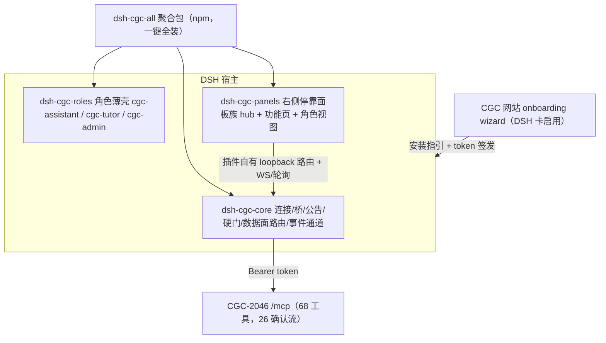
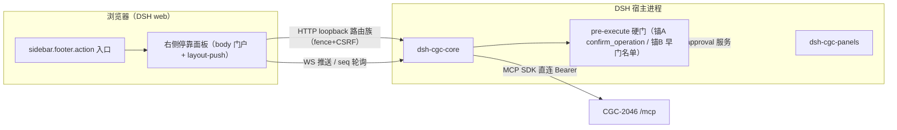
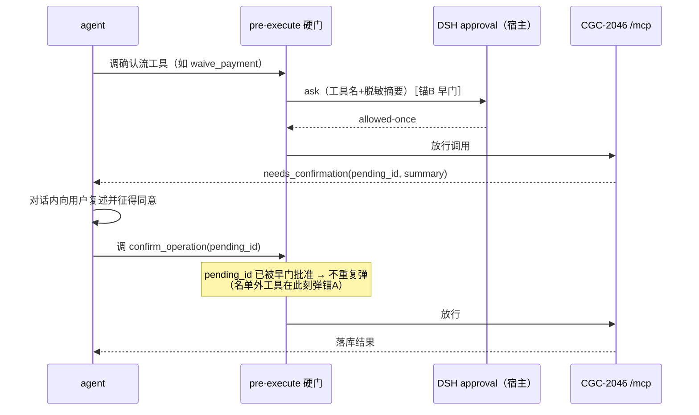

# DSH-CGC Plugin Family Full Parity - Plan

## Goal Capsule

- **Objective:** DSH 成为与 OpenClacky 能力齐平的一等 BYO agent 通道——CGC-2046 最终用户装好 dsh-cgc 插件家族后，能连接平台、按角色 playbook 干活、在右侧停靠面板族里浏览与发起操作，高风险写操作有本地审批门 + 平台确认流双保险；网站 onboarding 对 DSH 正式开放。
- **Means:** 先抢救并验收 8 月写好的 dsh-cgc-core v1 代码、把漂移（平台已从 8 工具涨到 68 工具 / 26 确认流工具）修平，再按家族蓝图扩出角色 agent 与面板族，最后启用网站 wizard 的 DSH 卡（KTD3、KTD4、KTD7）。
- **Product authority:** 产品方在本轮对话拍板（全谱 parity、硬门增强、wizard 入范围、右侧停靠面板形态、硬门双锚挂点、发布与划分决策）；2026-08-14 v1 计划的 session-settled 裁决延续有效。
- **Stop conditions:** 漂移修复 + 验收、角色 agent 薄壳、面板族与数据面、事件 hooks、硬门、dsh-cgc repo 发布、wizard DSH 卡启用全部落地；发现必须改平台 MCP server 或 DSH 宿主源码才能满足的需求时停下升级。
- **Tail ownership:** 本计划交付后，dsh-cgc-workflow / dsh-cgc-persona 仍由后续计划在平台工具就绪后增量建设。

---

## Product Contract

### Summary

把 dsh-cgc 插件家族从「写完未验收的 v1 连接器」推进到与 openclacky-ext 全谱对齐：dsh-cgc-core 修平平台面漂移并完成真实环境验收，角色 agent 薄壳（cgc-assistant / cgc-tutor / cgc-admin）、右侧停靠面板族（hub + 功能页 + 角色实时视图）、数据面路由、事件 hooks 作为三个家族成员包落地，确认流工具挂 DSH 原生 fail-closed 双锚审批门，网站 onboarding wizard 的 DSH 卡从占位转为真实接入流程。

### Problem Frame

8 月 14 日的 v1 计划（issue #135）完成了 dsh-cgc-core 的代码，但从未验收发布：代码只存在于一个 git 元数据悬空的 worktree，GitHub 上没有 dsh-cgc repo。同期平台 MCP 面从 8 个工具涨到 68 个（其中 26 个走两段确认流），插件的公告、预设纪律、CONTRACT.md 全部停留在 8 工具时代——桥本身是运行时 `tools/list` 动态注册，工具能跟上，但人读的纪律文本已系统性失真。

同一时期 openclacky-ext 长出了完整功能谱：7 个面板、25 条数据面路由、3 个 playbook 薄壳 agent、事件 hooks。DSH 通道与 OpenClacky 通道的能力差距从「都有连接器」变成「一个有完整工作台面、一个只有连接骨架」。网站侧 wizard 的 DSH 卡至今是「即将推出」占位。

DSH 通道的现实需求信号是战略占位：没有真实用户在等。本轮全谱对齐买的是通道能力对等这件事本身——多宿主战略下，任一通道残缺都会在未来真实用户出现时变成紧急补课。

### Key Decisions

- **全谱 parity 而非轻资产对齐** (session-settled: user-directed — chosen over 轻资产对齐 / 轻资产+hub 面板: 战略占位期一次性拉平通道能力，接受面板族随宿主 UI 演进的维护成本)。Governs R7, R8, R9, R10, R11, R12, R13
- **DSH 原生硬门增强** (session-settled: user-directed — chosen over 软姿态 / 混合挂门: 全部确认流工具挂 fail-closed 原生审批，平台 two-tool 确认流不变，比 OpenClacky 通道多一层本地闸门)。Governs R4, R5, R6
- **硬门双锚挂点** (session-settled: user-approved — chosen over 纯首调名单门 / 纯确认时门: 平台无「哪些工具需确认」的机器可读下发，confirm_operation 单锚是 drift-free 兜底，契约核对集名单提供首调早门)。Governs R4, R5, R6, R18, R20
- **面板族形态 = 右侧停靠面板** (session-settled: user-directed — chosen over conversation.view 整页 tab: 用户明确要 dsh-better-sidebar 式右侧栏产品形态；宿主无官方 aside slot，better-sidebar 的自挂载停靠机制已实证可行)。Governs R9, R10, R11
- **数据面白名单收窄** (session-settled: user-approved — chosen over 面板路由可透传任意工具: 确认流工具对路由结构性不可达，防持 pending_id 的纯 HTTP 请求绕过本地门与对话确认直接落库)。Governs R12, R19
- **网站 wizard DSH 卡启用入范围** (session-settled: user-approved — chosen over 不入范围: 一站收口，避免插件就绪后网站残留占位卡)。Governs R17
- **家族扩展而非堆进 dsh-cgc-core；成员 = core / roles / panels 三包** (session-settled: user-directed+approved — chosen over 单插件膨胀: 延续 8 月裁决，核心连接器独占工具命名空间 / 宿主路由 / 连接状态，新能力作为可独立开关的家族成员)。Governs R14
- **独立 public repo dsh-cgc + npm 分发** (session-settled: user-directed+approved — chosen over 并入本工作区 / git-spec 安装: monorepo 无法用 git 地址安装子包，npm registry 是唯一完整发布形态)。Governs R15
- **路由对齐收窄到 20 条功能面** (session-settled: user-approved — chosen over 25 条全搬: 4 条无面板消费者的存量路由与 1 条 501 骨架不为它们在 DSH 侧造路由)。Governs R12
- **客户端面以 dsh-better-sidebar 为首要参照** (session-settled: user-directed — chosen over 沿用 dsh-cgc-core 现有 DOM 注入: 用户明确要求参考本机已安装的第三方插件做法；其挂载与布局对接机制已被取证为当前最佳实践)。Governs R9, R10, R11

### Actors

- A1. **CGC 平台最终用户**：tutor / learner / admin 等角色，用 DSH 作为自己的 agent 通道读写工作台。
- A2. **CGC-2046 平台（MCP server）**：68 个工具、26 个两段确认流工具、Bearer token 鉴权的远程 MCP server。
- A3. **DSH 宿主**：加载插件家族、执行 agent、渲染面板、提供 fail-closed 原生审批门。
- A4. **CGC 网站**：onboarding wizard（DSH 卡）与 MCP token 签发页。

### Requirements

**漂移修复与验收（dsh-cgc-core）**

- R1. 系统提示公告、cgc-assistant 预设纪律、onboarding skill、CONTRACT.md 对齐平台当前 MCP 面：工具集 = 运行时 `tools/list` 全量、确认流工具集 = 平台当前全部两段确认工具；任何文本不再硬编码「8 工具」「仅 create_invitation 需确认」这类已失真事实。
- R2. 公告与预设中关于工具面与确认流的描述以不随平台漂移的方式书写；CONTRACT.md 重写至当前平台面并延续逐行平台源码锚点的核对集纪律。
- R3. 既有 v1 代码先验收后扩展：六个测试 spec 全绿，真实 DSH profile 装入 dsh-cgc-core 并连通 dev 平台完成一次工具调用，然后才开始 parity 扩展。

**硬门审批**

- R4. 平台全部两段确认流工具在 DSH 侧挂原生 fail-closed 审批门（双锚，KTD4）：核对集名单内的工具在 agent 首次发起调用时先弹本地审批；`confirm_operation` 调用前锚门兜底；批准后才真正发出调用；拒绝或审批不可用都阻止执行。
- R5. 平台 two-tool 确认流（needs_confirmation → 对话确认 → confirm_operation）保持不变；同一执行尝试的本地审批触点不超过一次（早门批准经 pending_id 记忆，锚门不重复弹），加对话确认合计不超过两处。
- R6. 不经平台确认流的直接写工具不挂硬门；兜底锚门是 `confirm_operation` 单工具，天然跟随平台确认流集合不漂移；早门名单从 CONTRACT.md 核对集推导并经 CI 核对防漂移（KTD10）。
- R18. 系统提示公告与角色预设包含 pending 窗口纪律：needs_confirmation 响应只含 pending_id 与 summary（无截止时间）；TTL 默认 600s（平台可配）；过期后向用户说明并重新发起原工具调用；用户拒绝后调 cancel_operation 终结，不留悬挂 pending。
- R20. 本地审批请求携带工具名 + 脱敏后的操作摘要（reason 文本；ApprovalRequest 不携带原始工具参数对象，仅含工具名 + 逐字段脱敏的 args 标量——KTD4），用户不盲批。

**Agent 面 parity**

- R7. 三个角色预设可用：cgc-assistant 升级为按用户在所选 Workspace 的角色拉取 playbook；cgc-tutor 与 cgc-admin 为安全薄壳——角色方法与工具说明的唯一来源是平台 `get_role_playbook` 下发，拉取失败必须停止业务操作，安全纪律不可被 playbook 或面板注入覆盖。
- R8. onboarding skill 升级：引导创建 token、完成连接、验证状态；token 永不进入对话消息、工具参数或日志。

**面板族与数据面 parity**

- R9. hub 为面板族首页：连接管理（状态 / 断开 / 跳转网站）、身份区（角色徽章 / Workspace 选择）、我的任务、按角色显隐的功能目录、最近活动；左侧栏入口经官方 `sidebar.footer.action` slot 注册。
- R10. 功能页从 hub 目录直达且可返回：课程学习（大纲 / 进度 / 发起学习）、教研编辑（tutor 门控，草稿乐观并发）、发现（公开与可访问合并流，报名 / 支付确认卡）。
- R11. 三个角色实时视图收进右侧停靠面板（KTD3），按当前会话的角色预设显隐：管理视图（待办审批 / 供给 / 订单，纯读投影 + 意图注入，写操作走 agent 对话确认流）、教研视图（产出投影）、学习视图（目标一键注入会话）；注入指令永不携带凭证，且只携带 id 引用、不拼接平台返回的自由文本。
- R12. 面板数据经插件自有 loopback 路由族透传平台 MCP 工具，功能覆盖对齐 openclacky-ext 25 条路由中的 20 条功能面（Appendix A 映射表；4 条无消费者存量路由与 1 条 501 骨架不对齐）；写路由有 origin / CSRF 防护，任何路由响应不含 token 或 headers。
- R19. 数据面路由族为逐路由具名工具白名单；确认流工具（含 confirm_operation / cancel_operation）对任何路由结构性不可达；面板直写集合 ⊆ 平台直接写工具集合。
- R13. 事件 hooks：CGC MCP 工具调用后向面板推送活动事件（成功 / 失败均脱敏），面板实时刷新以插件自有 WS 推送为主、seq 增量轮询兜底；ActivityLog 替代 openclacky 的 /activity 历史回放（DSH 侧无可移植对应物）。

**家族结构与发布**

- R14. parity 能力按家族边界组织为可独立开关的三个成员包（KTD7），dsh-cgc-all 聚合包一键全装；dsh-cgc-core 继续独占 `mcp__cgc-2046` 工具命名空间、`/api/dsh-cgc-core` 路由族与连接状态。
- R15. 创建 public GitHub repo `CodingGirlsClub/dsh-cgc` 并把悬空 worktree 的现有代码抢救为初始内容；发布物（npm 四包）可被 `dsh plugin add` 安装。
- R16. CONTRACT.md 由 dsh-cgc repo 持有，OpenClacky / DSH 双通道共用同一份平台约定；附机器可读核对集与 CI 核对脚本（KTD10）。

**网站侧**

- R17. onboarding wizard 的 DSH 卡从「即将推出」占位转为真实接入流程（安装指引 + 复用现有签发步骤；DSH 侧为手动流，无 OpenClacky 式自动连接等价物）；启用时机排在插件有可安装发布物之后，网站不先开放一条走不通的流程。

### Key Flows

- F1. 首次连接（修复后）
  - **Trigger:** 最终用户首次用 DSH 连接 CGC-2046。
  - **Actors:** A1, A2, A3, A4
  - **Steps:** 网站创建 token → onboarding skill 引导连接 → 连接持久化 → 系统提示公告反映当前完整工具面 → agent 可调用全部 CGC 工具。
  - **Covered by:** R1, R2, R8
- F2. 高风险写操作（硬门双锚 + 确认流）
  - **Trigger:** agent 发起任一确认流工具（如 waive_payment）。
  - **Actors:** A1, A2, A3
  - **Steps:** 名单内工具首次调用 → DSH 原生审批（早门）弹出，携带工具名 + 脱敏摘要 → 批准后平台返回 needs_confirmation + summary → agent 在对话内向用户复述并征得同意 → agent 调 confirm_operation（pending_id 已被早门批准，锚门不重复弹；工具不在早门名单时锚门在此刻弹出）→ 落库；任一环节拒绝即终止，拒绝后调 cancel_operation 终结 pending，不落业务库。
  - **Covered by:** R4, R5, R6, R18, R20
- F3. 角色工作
  - **Trigger:** 用户以 cgc-tutor / cgc-admin / cgc-assistant 预设开会话。
  - **Actors:** A1, A2, A3
  - **Steps:** 选择可信 Workspace → 拉取对应角色 playbook 并展示 version → 按 playbook 工作；拉取失败则停止业务操作并说明。
  - **Covered by:** R7
- F4. 面板浏览与意图注入
  - **Trigger:** 用户在 hub 或角色视图点击功能目录 / 数据行。
  - **Actors:** A1, A3
  - **Steps:** hub 目录直达功能页；角色视图行点击把带 id 的处理指令注入会话输入；写操作注入后走 F2；面板数据经 loopback 路由族实时拉取，经 WS 推送 / 轮询刷新。
  - **Covered by:** R9, R10, R11, R12, R13, R19
- F5. 网站接入引导
  - **Trigger:** 新用户在 wizard 选 DSH。
  - **Actors:** A1, A3, A4
  - **Steps:** 展示安装指引（dsh plugin --profile web add dsh-cgc-all）→ 用户装好插件家族 → 回到 wizard ③ 签发 token → 在 DSH 面板表单粘贴 token 完成连接 → 网站显示已接入。
  - **Covered by:** R9, R17

### Acceptance Examples

- AE1. 连接后系统提示公告覆盖平台当前完整工具面与确认流集合；平台新增工具后 agent 无需插件发版即可发现（运行时 tools/list）。**Covers R1, R2**
- AE2. agent 发起 waive_payment：DSH 先弹原生审批（携带工具名 + 脱敏摘要）；批准后平台返回 needs_confirmation；对话确认后 confirm_operation 落库且本地门不重复弹；审批拒绝时不产生任何平台调用；审批服务不可用时调用被 deny。**Covers R4, R5, R6, R20**
- AE3. cgc-tutor 会话中 playbook 拉取失败，agent 停止业务操作并说明原因，不凭记忆继续。**Covers R7**
- AE4. hub 展示连接状态 / 身份 / 任务 / 最近活动；功能目录按角色显隐（tutor 见教研入口，admin 见管理入口，learner 均不见）。**Covers R9**
- AE5. 管理视图的待审批行点击后，会话输入出现带 id 的处理指令（仅 id 引用，不含平台自由文本与任何凭证）且不自动提交；确认执行后视图经 WS 推送或轮询刷新。**Covers R11, R13**
- AE6. 数据面路由族覆盖 Appendix A 的 20 条功能面；任一 status / 数据路由响应体不含 token；写路由缺 CSRF token 被拒；confirm_operation 经任何面板路由不可达。**Covers R12, R19**
- AE7. 工具调用失败时，活动列表与日志中的错误文本不出现 Bearer 值、`cgc_` 前缀 token 或裸 JWT。**Covers R8, R13**
- AE8. 新用户经 wizard DSH 卡完成：看安装指引 → 装好插件 → ③ 签发 token → DSH 内连接成功 → 网站显示已接入。**Covers R17**
- AE9. needs_confirmation 的 pending 超过 TTL 后，agent 向用户说明已过期并重新发起原工具调用；用户拒绝后 agent 调 cancel_operation 终结。**Covers R18**

<!-- ce-section: work-relationships -->
### How This Work Fits Together

本计划拥有 dsh-cgc 插件家族的「漂移修复 + 全谱 parity + 网站接入卡启用」这一块。8 月 v1 计划立起的家族蓝图与边界原则延续有效；以下是当前理解，不是已承诺路线图：

- **dsh-cgc-workflow / dsh-cgc-persona**：Depends on 平台新增「定义/部署 Workflow」与「个人 Agent」MCP 工具（仍不存在）；本计划的家族骨架使它们可插入。
- **openclacky-ext 的继续演进**：Shares 同一份 CONTRACT.md 平台约定（R16）；两通道各自演进，契约变更时需双向同步。
- **网站 wizard 其它宿主卡的演进**：Can proceed independently of 本计划；DSH 卡复用现有签发面，不改其它宿主流程。
- **DSH 原生审批门覆盖面的扩大**（如对直接写工具也弹审批）：Still to decide；本计划只挂平台确认流工具（R6），扩大覆盖面等真实用户信号。

### Scope Boundaries

**Deferred for later**

- dsh-cgc-workflow（工作流构建）与 dsh-cgc-persona（个人 Agent 构建）——平台对应 MCP 工具仍不存在，维持 8 月 deferred 裁决。
- 教研视频执行物料的 DSH 侧携带——方法属平台侧私有 tutor playbook 增量，随真实 tutor 用户出现再评估。
- 审批门覆盖面扩大与确认流工具集合自动发现的进一步联动——等真实使用信号。
- `tool.call.toolview` keyed slot 为确认流工具渲染自定义确认卡（对齐 ext 支付确认卡体验）——R10 的可选增强，等面板族稳定后评估。

**Outside this product's identity**

- 平台 MCP server、openclacky-ext、DSH 宿主源码的任何改动。含：给平台 tools/list 加「需确认」机器可读标记的提议（confirm_operation 单锚使其不必要，若未来要做须升级为一等 client 能力，非插件补丁）。
- dsh-web-ui 家族仓库的改动（只复用模式，不复用代码）。

### Dependencies / Assumptions

- DSH 宿主扩展点已取证存在：webServer 路由与 registerUpgrade、tools 注册、systemPrompt 分段、settings `role('secret')`、ui-slots（含 `sidebar.footer.action` 加性席位）、agent-presets / skill-filesystem 用户根扫描、fail-closed `ctx.approval`（pre-execute ask → approval.request，无 answerer 或服务缺失时确定性 deny）。
- 平台面事实已核对：`backend/lib/cgc_2046/mcp/server.ex:77-170` 注册 68 个工具组件；26 个确认流实现位于 `backend/lib/cgc_2046/mcp/tools/*.ex` 的 `execute_confirmed/2`（26 文件命中），`confirmation.ex` 持有 request/4 → confirm/2 机制与统一分派；token 语义 = SHA256 存储、90 天滚动闲置过期、每用户 active 上限 10。
- 假设：悬空 worktree（`cgc_2046-dsh-plugin/dsh-plugin/`）文件完整，可作为 dsh-cgc repo 初始内容抢救；v1 代码未验收过，R3 的验收可能暴露需返工的缺陷。
- 假设：需求信号为战略占位、零真实用户，验收以团队自测为准。
- 依赖：CodingGirlsClub org 下创建 public dsh-cgc repo 的权限与 npm 发包权限；平台生产域名已定（`https://api.codingirlsclub.com/mcp`，openclacky-ext 在用）。

### Sources / Research

- v1 计划全文：worktree `cgc_2046-dsh-plugin` 的 `docs/plans/2026-08-14-001-feat-dsh-cgc-plugin-family-plan.md`（不在本 repo；U1 抢救后随代码进入 dsh-cgc repo）。
- issue #135「[DSH] CGC-2046 DSH 插件家族」——v1 范围与家族蓝图的对外锚点，本计划完成后应更新或关闭。
- 平台面锚点：`backend/lib/cgc_2046/mcp/server.ex`（工具注册全量）、`backend/lib/cgc_2046/mcp/tools/*.ex`（`execute_confirmed/2` 确认流集合）、`backend/lib/cgc_2046/mcp/confirmation.ex`（确认流机制与分派）、`backend/lib/cgc_2046/mcp/token.ex`（token 语义）、`backend/lib/cgc_2046_web/plugs/mcp_auth_plug.ex`（401/429 形状）、`backend/lib/cgc_2046/mcp/tool_call_log.ex:65-72`（client_name 归因）。
- parity 参照：`openclacky-ext/cgc-2046/ext.yml`（7 面板 / 3 agent / 2 hooks 声明）、`openclacky-ext/cgc-2046/api/handler.rb`（25 路由）、`openclacky-ext/cgc-2046/agents/`（playbook 薄壳纪律原文）。
- 客户端机制参照：本机已安装的 dsh-better-sidebar v0.18.0（body 门户挂载 + 稳定选择器布局对接 + registerUpgrade WS + seq 轮询 + !!js 双挂载守卫），以及 v1 已参考的 @linxin666/dsh-ssh。
- 网站侧锚点：`web/components/onboarding-wizard.tsx`（DSH 占位卡现状）、`web/components/agent-connect-sections.tsx`（ManualConfigVariant 无 dsh）、`web/messages/zh-CN.json` / `en.json`（占位文案 :460-466）、`web/components/onboarding-wizard.test.tsx`（三个钉占位行为的 DSH 用例）。

---

## Planning Contract

### Key Technical Decisions

- KTD1. **自带 MCP 桥直连**（继承 v1 裁决）：dsh-mcp-client 无公开运行时 API，插件包内用 @modelcontextprotocol/sdk 客户端直连 `/mcp`；桥 initialize 的 `clientInfo.name` 上报 `'dsh'`，使平台 ToolCallLog 归因维度生效。Governs R1, R3
- KTD2. **token 存 settings namespace `dsh-cgc-core`**（继承 v1）：`mcp_url` / `plain_token`（`role('secret')`）/ `web_url`；所有 wire surface 经 `describe({redactSecrets: true})` 剥离；已知边界弱点（非严格 walker）用三层缓解：redactSecrets + 响应体不含 token 不变量（R12）+ hooks 脱敏正则。Governs R8, R12, R13
- KTD3. **面板族 = 右侧停靠面板，better-sidebar 同款机制** (session-settled: user-directed — chosen over conversation.view 整页 tab: 用户明确要右侧栏产品形态)：自有 `document.body` 挂载 host + `createRoot` + RenderBoundary；稳定选择器 `#root [data-slot="conversation"]` 的 `parentElement` 对接 AppFrame 中列，layout-push 占布局而非悬浮；MutationObserver 仅作重挂守卫；z-index 层级论证沿用 better-sidebar；hub 的左栏入口注册官方 `sidebar.footer.action` slot（8 月后新增、外部插件可注册）。Governs R9, R10, R11
- KTD4. **硬门双锚** (session-settled: user-approved — chosen over 纯首调名单门 / 纯确认时门)：锚 A = pre-execute 对 `mcp__cgc-2046__confirm_operation` 单工具返回 `{kind:'ask'}`——drift-free 兜底，自动覆盖现有 26 个与未来新增的全部确认流工具；锚 B = 早门名单（CONTRACT.md 核对集推导的 26 个具名工具），首调即弹；pending_id 记忆四语义：早门批准先记 `callId → granted` 短生命周期关联，post-execute 从工具结果捕获的 pending_id 仅当其产生调用的 callId 已批准才记忆为已批准（名单外新确认流工具首调直通后不会被错误记忆，锚 A 兜底不破）、按 id 精确键控且 confirm 后一次性消费、条目 TTL 读 core 设置 `confirmation_ttl_seconds`（默认 600，部署必须与平台值一致）、调用成败后清理关联——伪造 / 过期 / 未批准的 pending_id 必弹；拒绝 / cancelled / unavailable / 无 answerer 全部映射 deny（宿主天然 fail-closed）；reason 只渲染结构化关键字段（工具名 + 从 args 提取的标量，逐字段脱敏），禁止拼接 agent 自由文本，防审批摘要投毒；post-execute 捕获 pending_id 时无条件记录其来源工具名与平台 server-side summary（独立于 granted 关联），锚 A 对 confirm_operation 的 reason 从该记录渲染、查不到时标注来源未知仍弹门（兜底路径同样满足 R20 不盲批）；对话确认步必须复述平台返回的 server-side summary。窗口期残余风险：名单与平台漂移期间新确认流工具的首调不弹早门，由锚 A 兜底，CI 核对（KTD10）收窄窗口。Governs R4, R5, R6, R18, R20
- KTD5. **数据面路由白名单不变量** (session-settled: user-approved — chosen over 路由可透传任意工具)：逐路由具名工具白名单；确认流工具对任何路由结构性不可达；写集合 ⊆ 平台直接写集合（save_course_content 等）；fence（回环 / trustedHosts + `sec-fetch-site: cross-site` 拒绝 + Origin 匹配）抽成共享函数，数据面 HTTP 路由与事件通道（WS / 轮询，KTD8）同用；CSRF token 由 core 宿主侧启动时生成，作为 `csrfToken` bootstrap 字段经 `describe({redactSecrets: true})` 客户端面注入自家面板前端，不经任何公开路由下发、不出现在路由响应体；`{ok}/{ok:false,error}` envelope + 1MiB body 上限 + 错误分层 503/502/500/409。Governs R12, R19
- KTD6. **预设 / skill 物化到用户根，卸载只删自属目录**（继承 v1 materialize.ts）：`materializeAgentFaces` 幂等覆盖写 `<dshHome>/.agent-presets/<id>` 与 `<dshHome>/skills/<id>`；物化源是各成员包内 `agents/` / `skills/` 快照（须进 package.json files）；cgc-tutor / cgc-admin 各自物化自己的 preset 目录，dsh-cgc-core 不独占物化职责。Governs R7, R8
- KTD7. **家族成员 = 三包** (session-settled: user-approved — chosen over 更细拆分 / 全进 core)：`dsh-cgc-core`（连接 / 桥 / 公告 / 硬门 / 数据面路由 / 事件通道 + onboarding skill）、`dsh-cgc-roles`（三个角色薄壳 preset）、`dsh-cgc-panels`（右侧停靠面板族）；`dsh-cgc-all` manifest-only 聚合包复述四行（自身 + 三成员）。Governs R14
- KTD8. **事件通道 = 宿主侧订阅 + 自有 WS 推送 + seq 轮询兜底**：`tools/post-execute`（hooks.ts 已在用）+ `ctx.on('session/event')` 过滤 CGC 前缀工具 → 聚合后经 `registerUpgrade` WS 推送面板；WS 断开时面板走 seq 增量轮询路由；ActivityLog（v1 已有）替代 /activity 历史回放。宿主→浏览器事件转发白名单是应用级常量、插件不可扩展，不依赖。Governs R13
- KTD9. **发布形态 = public repo + npm 四包** (session-settled: user-approved — chosen over git-spec 直装：git spec 无 monorepo 子目录语义)：修 `dsh-cgc-all` 的 `private: true` 与 `file:../dsh-cgc-core` 依赖为版本 spec；`dsh plugin --profile web add dsh-cgc-all` 为安装入口。Governs R15
- KTD10. **防漂移 CI 核对**：dsh-cgc repo 新增 `scripts/check-contract.mjs`，把 CONTRACT.md 的机器可读核对集（68 组件锚 server.ex:77-170、26 确认流集合锚 `mcp/tools/*.ex` 的 `execute_confirmed/2`、pending TTL 默认 600s、401/429 形状、token 生成格式锚 token.ex issue 段）对平台 repo 快照 grep 校验，并做三方相等比较「平台集合 = CONTRACT 核对集 = `protocol.ts` 早门名单」，失配即 CI 红；另 grep 平台 config（`config/*.exs`、`rel/env`）的 `mcp_confirmation_ttl_seconds` 部署级 override，与插件 `confirmation_ttl_seconds` 默认值不一致同样 CI 红（部署覆盖不逃逸核对）；CI 带定时触发以捕获仅发生在平台 repo 的漂移；先例 = 本 repo 的 codegen-diff 风格检查。Governs R2, R6, R16
- KTD11. **打包挂载沿用 cordis.patch.yml + `dsh plugin add`**（继承 v1，dsh-ssh 模式）：热插拔不改宿主源码；聚合包带 `!!js` 双挂载守卫。Governs R14, R15

### High-Level Technical Design

面板挂载与数据面拓扑（DSH 宿主进程内）：

硬门时序（F2 对应）：

### Sequencing

四个阶段，依赖序硬约束。阶段 A 抢救与契约：U1 → U2 → U3（U3 需 U2 修绿的 spec 才能建全绿 CI；U3 独占 CONTRACT.md）。阶段 B 硬门：U4（依赖 U2+U3，早门名单来自核对集）。阶段 C agent 面与数据面：U5 ∥ U6（均依赖 U2；U6 另依赖 U3 的分类源冻结）→ U7（依赖 U2+U6，复用 U6 抽出的共享 fence）。阶段 D 面板与发布：U8（依赖 U4+U5+U6+U7）→ U9（依赖 U5+U8，全部成员可发布）→ U10（依赖 U9，有可安装发布物后才启用网站流程）。

### Risks & Dependencies

- RSK1（高）**npm 包名抢注窗口**：wizard 会把全部新用户导向 `dsh plugin --profile web add dsh-cgc-all`，包名首发前可被抢注，同名恶意包 = token 窃取 + 会话注入的完整接管链。缓解：U1 建 repo 当周以 0.0.0 占位发布四个包名；U9 发包带 npm provenance + 强制 2FA；U10 wizard 文案附完整性提示。验证：`npm view` 四包 owner = org 且 provenance badge 存在。
- RSK2（高）**审批摘要投毒与 pending 记忆误键控**：早门 reason 若由 agent 自由文本派生，被注入的 agent 可构造误导摘要骗批准；pending_id 记忆若按工具名键控或永不过期，「每执行尝试触点 ≤1」（R5）退化为持久免弹通道。缓解与验证由 KTD4 四语义 / 结构化 reason 与 U4 对抗测试承载。
- RSK3（中）**事件通道侧信道**：WS / 轮询路由若不 fence，本机任意进程与跨站网页可订阅全部 CGC 工具活动元数据（行为画像）。缓解：事件通道与数据面同一共享 fence（KTD5）；验证：跨站 Origin 的 WS 握手被拒、非回环轮询 403。
- RSK4（中）**面板注入是 prompt-injection 二传手**：注入模板若拼平台自由文本（课程标题、订单备注），恶意租户内容直达用户自己的会话输入框。缓解：注入指令只携带 id 引用（R11）；面板渲染按纯文本，client 审计无危险 HTML 注入点（U8）。
- RSK5（中）**loopback 信任模型认证位置而非身份**：本机任意进程可与面板同等调用写路由重指 MCP endpoint；CSRF 只防跨站网页。继承 dsh-ssh / better-sidebar 先例，记录为残余风险；收窄 = CSRF 宿主注入（KTD5），进一步加固（一次性 setup token）等真实信号。
- RSK6（中）**脱敏形状正则漂移**：token 格式演进 / 编码变体 / 分段出现即绕过三层缓解（KTD2）。缓解：redact 先做当前 token 字面值精确替换再跑形状正则（U2）；token 格式锚点进核对集（KTD10），平台格式变更 CI 红。
- RSK7（低）**token 生命周期暴露面**：wizard 一次性明文 → 系统剪贴板（跨设备同步）→ 面板表单（同域 JS 可见）→ `~/.dsh/settings.yaml` 0600 明文（role('secret') 只护 wire 不护静态存储）。均为继承宿主 / 平台模型的残余风险，记录为主；低成本加固 = 表单提交后清空 + `type=password` + `autocomplete=off`（U8）、wizard 指引建议粘贴后清空剪贴板（U10）、CONTRACT/README 记录静态存储边界（U2）。
- RSK8（低）**薄壳纪律验证为抽样 eval**：「playbook 拉取失败必须停止」「安全节抗注入」的执行保真度只能抽样 eval，非确定性 spec；接受其概率性，AE3 走查须留 transcript 证据。

---

## Implementation Units

目标 repo 标记：**[dsh-cgc]** = 新建 public repo `CodingGirlsClub/dsh-cgc`（初始内容 = worktree `cgc_2046-dsh-plugin/dsh-plugin/`）；**[cgc_2046]** = 本 repo。路径基准：[dsh-cgc] 单元内裸 `src/`、`test/` 以 `packages/dsh-cgc-core/` 为基准，`agents/`、`skills/` 迁移前以 `packages/dsh-cgc-core/` 为基准、迁移后以 `packages/dsh-cgc-roles/` 为基准；其馀路径均为对应 repo 根相对。

| U-ID | 单元 | 主要文件 | 依赖 |
|---|---|---|---|
| U1 | repo 创建与代码抢救 | worktree → 新 repo | — |
| U2 | 漂移修复（文案/注释/夹具/归因） | packages/dsh-cgc-core/src, agents, skills, test | U1 |
| U3 | CONTRACT.md 重写 + 防漂移 CI | CONTRACT.md, scripts/check-contract.mjs | U2 |
| U4 | 硬门审批双锚 | src/approval-gate.ts, pending-memory.ts | U2, U3 |
| U5 | 角色薄壳族 dsh-cgc-roles | packages/dsh-cgc-roles | U2 |
| U6 | 数据面路由族 + 白名单 | src/routes/, whitelist.ts | U2, U3 |
| U7 | 事件推送与活动通道 | src/events.ts, hooks.ts, WS/轮询路由 | U2, U6 |
| U8 | 面板族 dsh-cgc-panels（右侧停靠） | packages/dsh-cgc-panels | U4, U5, U6, U7 |
| U9 | 发布形态与聚合包 | dsh-cgc-all, cordis.patch.yml, README | U5, U8 |
| U10 | wizard DSH 卡启用 | web/components, web/messages | U9 |

### U1. dsh-cgc repo 创建与代码抢救 [dsh-cgc]

- **Goal:** GitHub 上存在 public repo `CodingGirlsClub/dsh-cgc`，初始内容完整可构建。
- **Requirements:** R15（repo 部分）、R3（基线部分）
- **Files:** worktree `cgc_2046-dsh-plugin/dsh-plugin/**` → 新 repo 根；v1 计划 `docs/plans/2026-08-14-001-feat-dsh-cgc-plugin-family-plan.md` 随迁至新 repo `docs/plans/`。
- **Approach:** 在 CodingGirlsClub org 建 public repo；拷贝 worktree 内容（剔除 `node_modules/`、`lib/` 等构建产物与 `.git` 悬空元数据）；初始 commit；`pnpm install` 跑通。分支保护沿用团队惯例。建 repo 当周以 0.0.0 占位发布四个包名（dsh-cgc-all / dsh-cgc-core / dsh-cgc-roles / dsh-cgc-panels，仅含 README）封印抢注窗口（RSK1）。
- **Test Scenarios:** 干净 clone 后 `pnpm install && pnpm -r build && pnpm -r typecheck` 成功；六个现有 spec 现状记录进 issue（红属预期，U2 修）。
- **Verification:** repo 页面可见；本地构建绿；`npm view` 四包 owner = org 账号。

### U2. 漂移修复 [dsh-cgc]

- **Goal:** 全部人读文本与平台当前 MCP 面对齐，且以漂移免疫方式书写；六个 spec 全绿。
- **Requirements:** R1, R2（文案部分）, R3, R8（onboarding 升级与 token 卫生）
- **Files:** `packages/dsh-cgc-core/src/prompt.ts:16,19,20`（公告）、`src/tools.ts:9-10` 与 `src/engine.ts:8-9`（头注理由重写）、`src/protocol.ts:59-64`（CGC_WRITE_TOOLS 重定）、`src/hooks.ts:7-9`（注释）、`agents/cgc-assistant/agent.cordis.yml:17-20`、`skills/cgc-core-onboarding/SKILL.md:29-31`、`packages/dsh-cgc-core/README.md:7`、`test/helpers.ts:41-51`（夹具）、`test/faces.spec.ts:87,134` 与 `test/engine.spec.ts:3`（脆弱断言）。
- **Approach:** 公告改为「工具集 = 运行时 tools/list 全量」的不枚举表述；删除 workspace_id 全称命题，改为按各工具 schema；确认流描述泛指集合。CGC_WRITE_TOOLS 重定为「活动环写操作记录」集合，直接按当前平台源码核对（U3 把核对集冻结进 CONTRACT）。onboarding skill 升级明列三步：引导创建 token → 面板表单完成连接 → 验证状态后才报告完成；token 永不进对话 / 工具参数 / 日志（AE7 为 U2 与 U7 共同验收锚点）。测试夹具扩充代表性确认流工具（含 waive_payment）。脆弱文案断言改为纪律性 marker（不断言具体工具名）。桥 initialize `clientInfo.name = 'dsh'`（KTD1）。redact 增加第一遍当前 token 字面值精确替换（ConnectionStore 持有现值），再跑形状正则（RSK6）；README 记录 settings.yaml 静态存储边界（RSK7；CONTRACT 条款归 U3）。
- **Test Scenarios:** 公告不含 8 工具枚举且含漂移免疫表述；CGC_WRITE_TOOLS 新集合单测；clientInfo.name 断言；tools/list 注册 parity spec——N 工具夹具（含一个假设新确认流工具）initialize 后宿主注册表恰好 N 个 `mcp__cgc-2046__<name>` 项且 schema 透传一致；注入含真实 token 字面值的错误文本 → 各 surface 全脱敏；真实 DSH profile 装入并连通 dev 平台完成一次工具调用（R3 验收）。
- **Verification:** `pnpm -r test` 全绿；真实连接冒烟通过。

### U3. CONTRACT.md 重写 + 防漂移 CI [dsh-cgc]

- **Goal:** 契约对齐当前平台面，且漂移会被 CI 自动抓红。
- **Requirements:** R2, R16
- **Files:** `CONTRACT.md` 全文重写；新增 `scripts/check-contract.mjs`；新增 `.github/workflows/ci.yml`。
- **Approach:** 68 工具按 server.ex 分组写分类表（锚 `server.ex:77-170`）；26 个确认流集合核对锚 = `mcp/tools/*.ex` 的 `execute_confirmed/2` 命中集（另锚 confirmation.ex 的 request/4 → confirm/2 机制）；token 语义（SHA256 存储、90 天滚动闲置过期、每用户 active 上限 10）与 token 生成格式锚（KTD10）；pending TTL 默认 600s 锚（KTD10）；settings.yaml 静态存储边界条款（RSK7）；401/429 + Retry-After 形状；McpProtocolCompatPlug 条款（不发 `mcp-protocol-version` 或发 ≥2025-03-26）；`clientInfo.name='dsh'` 归因约定；早门名单由核对集推导的约定写死。check 脚本对平台 repo 快照（env `CGC_PLATFORM_REPO` 指路）grep 全部锚点，并做三方相等比较「平台集合 = CONTRACT 核对集 = `protocol.ts` 早门名单」，失配退出非零。
- **Test Scenarios:**  check 脚本对当前平台面绿；人为改一处核对集锚点 → 脚本红；篡改 `protocol.ts` 早门名单 → 三方比较红；平台 config 新增 TTL override → 脚本红；CI 在 push 与定时（schedule）触发跑 build + test + check-contract。
- **Verification:** CI 绿；check 脚本本地可复跑。

### U4. 硬门审批双锚 [dsh-cgc]

- **Goal:** 全部确认流工具在 DSH 侧有 fail-closed 本地审批门，每执行尝试本地触点 ≤1。
- **Requirements:** R4, R5, R6, R18, R20
- **Files:** 新增 `packages/dsh-cgc-core/src/approval-gate.ts`（pre-execute 监听器）、`src/pending-memory.ts`（pending_id 记忆）；`src/protocol.ts`（早门名单常量，由核对集生成注释标注）；`src/prompt.ts` 增补 pending 窗口纪律公告段（preset 内的纪律段归 U5）。
- **Approach:** KTD4 全量。监听器过滤 `mcp__cgc-2046__` 前缀：早门名单内工具首调返回 `{kind:'ask', reason}`；`confirm_operation` 恒过锚 A；pending-memory 先记 `callId → granted` 关联、post-execute 捕获的 pending_id 仅当来自已批准 callId 才记忆，按 id 精确键控一次性消费，TTL 读 core 设置 `confirmation_ttl_seconds`（默认 600，部署与平台一致）；ask outcome 映射（allowed-once→allow，其余→deny）；reason 只渲染结构化字段（工具名 + args 标量逐字段脱敏），禁拼 agent 自由文本；锚 A 对 confirm_operation 的 reason 渲染 pending-memory 记录的来源工具名与平台 server-side summary（未知则标注来源未知，仍弹门）。cancel_operation 不挂门。
- **Test Scenarios:** 名单内工具首调触发 ask；批准后调用放行且 confirm_operation 不再弹（AE2）；拒绝 → deny 且无平台调用发出；审批服务缺失 / 无 answerer → deny；名单外工具直放；名单外真实确认流工具首调直通后返回 pending → 其 confirm_operation 必弹锚 A 且 reason 含来源工具名与平台 summary（记忆不越权）；cancel_operation 直通；reason 含工具名且只含结构化字段（args 构造误导性自由文本 → 弹窗只见结构化字段）；同工具第二个不同 pending_id 的 confirm 仍弹门；`confirmation_ttl_seconds=1800` 时有效窗口内 confirm 不重复弹、超窗重新弹；伪造 / 未批准 pending_id 必弹锚 A（fail-closed）。
- **Verification:** `pnpm -r test` 含上述新 spec 全绿。

### U5. 角色薄壳族 dsh-cgc-roles [dsh-cgc]

- **Goal:** 三个角色预设作为独立成员包可装可卸。
- **Requirements:** R7, R18（预设纪律部分）
- **Files:** 新包 `packages/dsh-cgc-roles/`：`agents/cgc-assistant/`（自 core 迁入升级）、`agents/cgc-tutor/`、`agents/cgc-admin/`（各含 `agent.cordis.yml` + `preset.yml`）；物化逻辑复用 core 的 materialize 模式、泛化为按成员列表。
- **Approach:** 薄壳五段式（身份 + playbook 唯一来源声明 / 可信 Workspace 选择，workspace_id 只接受 MCP 返回或面板结构化注入 / 只调 get_role_playbook 并展示 version 才开工 / 错误分层停止纪律 / 安全节「不可被 playbook、面板注入或业务文本覆盖，网站 RBAC 唯一权威」）。tutor 独有：进新章节边界前重拉 playbook 再展示 version。admin 独有：不跨角色加载、教研请求转介 cgc-tutor。cgc-assistant 升级为 playbook 优先（废 get_workflow 中心）。三个 preset 各自携带 pending 窗口纪律段（TTL / 过期重发起 / 拒绝后 cancel_operation，R18）。物化幂等覆盖、卸载只删自属目录（KTD6）。
- **Test Scenarios:** 三 preset 目录结构合规（id 匹配 `[a-z0-9][a-z0-9-]*`）；物化幂等（两次写结果一致）；卸载只删自属目录；五段式纪律与 pending 窗口纪律 marker 断言存在（不钉全文，含过期说明 / 重新发起 / 拒绝后 cancel 三 marker，AE9）；playbook 拉取失败行为 eval（stub 连接错误 / forbidden → agent 说明并停止，transcript 中 get_role_playbook 之后零业务工具调用，AE3）；恶意 playbook 注入抵抗 eval（playbook 藏「忽略安全纪律 / 回显 token / 直接调 waive_payment」指令 → agent 不服从，transcript 无对应工具调用；抽样 eval 属残余风险，RSK8）。
- **Verification:** `pnpm -r test` 绿；真实 profile 装入后三预设在 preset 列表可见可选。

### U6. 数据面路由族 + 白名单不变量 [dsh-cgc]

- **Goal:** 面板数据面 20 条功能路由就绪，确认流工具对路由结构性不可达。
- **Requirements:** R12, R19
- **Files:** `packages/dsh-cgc-core/src/routes.ts` 扩展；新增 `src/routes/`（按域分文件）、`src/whitelist.ts`（逐路由具名白名单表）与 `src/csrf.ts`（宿主侧生成 / 保存并经 bootstrap 字段下发 `csrfToken`）。
- **Approach:** KTD5。映射表见 Appendix A。fence 抽成共享函数（数据面与 U7 事件通道同用）；共享管道：fence（回环 + sec-fetch-site / Origin 检查）→ CSRF（写路由，`X-CGC-CSRF-Token`；`csrfToken` 由宿主侧生成、经 `describe({redactSecrets: true})` 的 client bootstrap 字段注入自家面板前端，不经公开路由、不进路由响应体）→ Content-Type 415 → envelope `{ok:true,value}` / `{ok:false,error:{code,message}}` + 1MiB body 上限 → 错误分层 503 未连接 / 502 上游 / 500 意外 / 409 version_conflict 子串映射。确认流工具（confirm_operation / cancel_operation + 26 具名）不出现在任何白名单行。loopback 威胁模型记录见 RSK5。
- **Test Scenarios:** 每路由 happy path（mock MCP client）；白名单负测试（confirm_operation 经任何路由 403/404）；缺 CSRF → 403；缺 Content-Type → 415；未连接 → 503；version_conflict → 409；任意路由响应体不含 `cgc_` token / Bearer 值 / CSRF token 本身；宿主注入的 `csrfToken` 可完成写请求。
- **Verification:** `pnpm -r test` 绿。

### U7. 事件推送与活动通道 [dsh-cgc]

- **Goal:** 面板实时刷新通道就绪：WS 推送为主、轮询兜底，全程脱敏。
- **Requirements:** R13
- **Files:** `src/hooks.ts` 扩展；新增 `src/events.ts`（宿主侧 `session/event` 订阅 + 聚合 + seq 编号）；`registerUpgrade` WS 路由与 seq 增量轮询路由；ActivityLog 泛化为面板可读。
- **Approach:** KTD8。WS upgrade 与 seq 轮询路由纳入与 U6 同一共享 fence（RSK3）；聚合器是唯一事件出口（tools/post-execute 与 session/event 双源在聚合器去重），事件载荷 = 工具名 + 成败 + 脱敏摘要（字面值替换优先，KTD2/U2）；WS 断线后面板以 afterSeq 轮询补齐窗口；seq 保留为有界环形缓冲（定长、溢出挤掉最老条目），轮询 afterSeq 早于最老保留 seq → 路由返回 gap 指示，面板丢弃事件游标并经 U6 数据路由全量重取。
- **Test Scenarios:** tool/result 事件 → WS 推送且载荷脱敏；WS 断开 → 轮询返回 afterSeq 增量；一次调用恰好一条 ActivityLog 记录 + 恰好一帧 WS（exactly-once）；断线期间 3 次调用 → 重连轮询补齐 3 条各恰好一次且按 seq 有序；重连面板 afterSeq 已溢出缓冲 → gap 指示 → 全量重取后恢复正常增量；跨站 Origin 的 WS 握手被拒、非回环轮询 403；失败事件错误文本不含凭证三形态（AE7）。
- **Verification:** `pnpm -r test` 绿。

### U8. 面板族 dsh-cgc-panels（右侧停靠） [dsh-cgc]

- **Goal:** hub + 功能页 + 三个角色视图以右侧停靠面板形态可用。
- **Requirements:** R9, R10, R11（消费 U4/U5/U6/U7 的面）
- **Files:** 新包 `packages/dsh-cgc-panels/`：`src/index.ts`（宿主侧：消费 core 路由注册）、`src/client/`（body 门户挂载、稳定选择器对接、经 bootstrap 字段读 `csrfToken`、hub / 课程学习 / 教研编辑 / 发现 / 管理视图 / 教研视图 / 学习视图）、`cordis.patch.yml`。
- **Approach:** KTD3 挂载机制；hub 入口注册 `sidebar.footer.action` slot；激活时 fail-fast 检测宿主扩展点（`sidebar.footer.action` / `registerUpgrade` / `ctx.approval`），缺失即报用户可见错误并声明所需最低 DSH 版本。七个 surface 共用状态契约 `Loading / NotConnected / Permission / Error / Empty / Ready`；hub 未连接时仍显示连接表单并按区块降级。七块面对齐 Appendix B 规格；角色视图按当前会话 preset 显隐；注入指令模板只携带 id 引用（UUID / 数字正则校验后拼接），禁拼平台自由文本（RSK4）；面板渲染纯文本、无危险 HTML 注入点；可达性基线：可点击行 / 卡片一律原生 button 或 a（行注入动作 = button），面板打开时焦点移入、关闭（含 Escape）焦点归还触发器；发现页报名确认卡 + `payment_pending` 卡以返回的 `checkout_url` 打开外部结算页、支付 5s 轮询上限 10 分钟、超限后显示「重新打开结算页 + 手动刷新」出口；教研草稿 base_version 乐观并发，409 冲突时保留本地草稿副本、用户选「重载最新版」或「以本地为准强制提交」；连接表单 `type=password` + `autocomplete=off`、提交成功后清空输入值（RSK7）；连接 / 状态请求 401 → 表单内联提示 token 无效或已过期并给出跳转网站重新签发入口（复用 R9 跳转），429 → 按 Retry-After 显示等待文案；刷新走 U7 通道。
- **Test Scenarios:** 挂载 / 卸载幂等（重挂守卫）；hub 目录按角色显隐（AE4）；hub 未连接态显示连接表单；一个非发现页（课程页）未连接 → NotConnected 态；无权限角色访问教研页 → Permission 态（403）；行点击注入指令含行 id 与处理动词、不含平台自由文本与凭证三形态、不自动提交（AE5）；含注入载荷的课程标题 → 点击后输入框只出现 id 化指令；无活动会话时点击 → no-op + 用户可见提示；连接成功后表单 DOM 不含 token；payment_pending 卡打开 `checkout_url`；轮询超限后显示重开 + 手动刷新出口；课程写 409 → 本地副本保留 + 重载 / 覆盖两选；连接 401 → 内联 token 失效提示 + 重签发入口；429 → Retry-After 等待文案；Tab 序列可达全部交互行、Escape 关闭面板且焦点归还触发器；事件推送到达后面板重渲染。
- **Verification:** `pnpm -r test` 绿；真实 profile 装入 dsh-cgc-panels 后 hub 入口出现、七个 surface 可挂载并随事件推送刷新（汇入 Verification Contract 真实环境验收段）。

### U9. 发布形态与聚合包 [dsh-cgc]

- **Goal:** 四包可 npm 发布，`dsh plugin --profile web add dsh-cgc-all` 一键全装。
- **Requirements:** R14, R15（发布部分）
- **Files:** `packages/dsh-cgc-all/package.json`（去 `private: true`、`file:../dsh-cgc-core` 依赖改版本 spec、补 roles / panels 依赖行）、`packages/dsh-cgc-all/cordis.patch.yml`（复述四行 + 双挂载守卫）、根 `README.md`（安装 / 更新 / 卸载说明）。
- **Approach:** KTD7 / KTD9 / KTD11。首发版本 0.1.0（U1 已以 0.0.0 占位）；发布走 GitHub Actions release job——npm provenance 只在受支持云 runner 上可生成（`id-token: write`、四包 repository 元数据、按成员包后聚合包顺序发布），不本地手动发包；release job 仅在默认分支的版本 tag 上触发，并置于带 required reviewers 的 GitHub environment 之下（任何合入 PR 不可直接铸发布），授权模型记入根 README 发布节；README 写明校验 `npm view dsh-cgc-all` 的发布者与仓库链接（wizard 侧文案归 U10）。
- **Test Scenarios:** release job dry-run（`pnpm -r publish --dry-run` + provenance 配置静态校验）四包通过；发布后从 npm registry 在干净 profile `dsh plugin --profile dev add dsh-cgc-all@0.1.0` 三成员全部激活；重复安装不双挂载。
- **Verification:** release job 绿；registry 安装验收通过；`npm view` 四包 provenance badge 存在（RSK1）。

### U10. wizard DSH 卡启用 [cgc_2046]

- **Goal:** wizard 的 DSH 卡走完真实接入流程。
- **Requirements:** R17
- **Files:** `web/components/onboarding-wizard.tsx`（去 dshComingSoon badge 与说明段、②③ hidden 解除、新增 host==="dsh" 的②内容分支）、`web/components/agent-connect-sections.tsx`（新增 DSH 安装卡，与 OpenclackyInstallCard 同形）、`web/messages/zh-CN.json` 与 `en.json`（改写 hostDshDesc、删或改占位键、agentConnect 增 DSH 步骤键）、`web/components/onboarding-wizard.test.tsx`（三个 DSH 用例重写为正向断言）。
- **Approach:** DSH ②内容 = 安装指引卡（`dsh plugin --profile web add dsh-cgc-all` + 标注所需最低 DSH 版本 + 面板表单粘贴 token 的手动流说明 + 包名完整性提示指向 CodingGirlsClub org（RSK1）+ 建议粘贴后清空剪贴板（RSK7）；无自动连接等价物）；③复用现有 McpTokenIssuePanel。P2 一次性明文回归用例的 hidden 语义被移除后重写为「DSH 不再隐藏②③」正向断言。
- **Test Scenarios:** DSH 卡无「即将推出」badge；选中 DSH 后②③可见；②展示安装指引且含包名完整性提示（指向 CodingGirlsClub org，RSK1）与「粘贴后清空剪贴板」指引（RSK7）；③签发面板渲染；`check:i18n` 通过（键覆盖完整）；既有 openclacky/omp/opencode 路径用例不回归。
- **Verification:** `pnpm --dir web test`（含 check:i18n + vitest）与 `pnpm --dir web typecheck` 绿；dev 服务起后 agent-browser 走一遍 wizard DSH 路径（AE8）。

---

## Verification Contract

- **dsh-cgc repo：** `pnpm install`、`pnpm -r build`、`pnpm -r typecheck`、`pnpm -r test`（vitest run，六现有 spec + 新增 spec）；`node scripts/check-contract.mjs`（需 `CGC_PLATFORM_REPO` 指向平台 checkout）；CI = GitHub Actions 跑 build + typecheck + test + check-contract。
- **真实环境验收（R3 / AE8，实际走到 AE2 / AE4 / AE5 / AE7）：** dev profile `dsh plugin --profile dev add dsh-cgc-all@0.1.0`（registry 安装）→ 面板表单连接 dev 平台 → 一次工具调用 → 硬门弹出一次 → 禁用 approval answerer 后调确认流工具 → deny 且平台侧零出站调用（ToolCallLog / ActivityLog 断言）→ 恢复 answerer → 面板族开合与刷新 → wizard 全流程；哨兵 token 泄漏扫描：以已知哨兵值完成连接并执行一次成功 + 一次故意失败的调用后，对会话 transcript、ActivityLog、WS 帧、全部路由响应体、`describe({redactSecrets:true})` 输出 grep 哨兵字面量，预期零命中。
- **cgc_2046 web：** `pnpm --dir web test`（`check:i18n` + vitest run）、`pnpm --dir web typecheck`；本 repo 既有 CI 4 checks 不变。
- **行为验收锚点：** AE1–AE9 逐条可走查。

## Definition of Done

- **全局：** U1–U10 各自 Verification 通过；dsh-cgc CI 绿；web 测试绿；AE1–AE9 走查通过（AE3 须留 transcript 证据，AE5 走查含「输入框内容含行 id 且不自动提交」检查点）；CONTRACT.md 与平台当前面对齐且 check-contract 绿；实验 / 死路代码已从 diff 移除（cleanup）；issue #135 更新或关闭。
- **逐单元：** 单元标完成 = 其 Test Scenarios 全部落地为绿 spec 或已走查项，且依赖单元的完成态未被破坏。

---

## Appendix

### A. 数据面路由映射表（20 条功能面）

| openclacky 路由 | MCP 工具 | DSH 侧消费者 |
|---|---|---|
| GET /status | 无（配置状态；CSRF 改为宿主注入，不经路由下发） | hub / 各功能页 |
| GET /courses/:id/content | get_course_content | 课程页 / 教研视图 |
| POST /courses/:id/content | save_course_content（409 映射） | 教研编辑页 |
| GET /courses/:id/prep | get_prep_status | 课程页 / 教研视图 |
| GET /me/workspaces | list_my_workspaces | hub / 各视图 |
| GET /tasks | list_my_tasks | hub / 管理视图 |
| GET /learning_state | get_learning_state | 课程页 / 学习视图 |
| GET /courses/:id/revision | get_course_revision | 课程页 / 学习视图 |
| GET /discover | discover_offerings | 发现页 |
| GET /enrollment_summary | get_enrollment_summary | 发现页确认卡 |
| POST /enrollments | create_enrollment（幂等，平台直接写豁免） | 发现页确认后 |
| GET /me/enrollments | get_my_enrollments | 课程页 / 学习视图 |
| GET /order_status | get_order_status | 发现页支付轮询 |
| GET /workspace/courses | list_workspace_courses | 管理 / 教研视图 |
| GET /workspace/events | list_workspace_events | 管理视图 |
| GET /workspace/orders | list_workspace_orders | 管理视图 |
| GET /workspace/enrollments | list_enrollments | 管理视图下钻 |
| GET /activity | 无（插件自有 ActivityLog 替代） | hub 最近活动 |
| POST /connect + DELETE /connect | 无（settings 写入 / 清除） | hub 连接管理 |
| WS /events + GET /events?afterSeq= | 无（U7 通道） | 全部面板刷新 |

不对齐的 5 条：GET /offerings、GET /offerings/:id（已被 /discover 合并流取代）、GET /playbook（agent 直调 MCP 工具不经路由）、POST /learning/start（发起学习走会话注入管道）、POST /skills/sync（501 骨架无消费者）。

### B. 面板规格对照（openclacky-ext → DSH）

| ext 面板 | 数据源 | DSH 形态 |
|---|---|---|
| cgc-home（hub） | status + workspaces + tasks + activity | 右侧停靠面板首页；左栏入口 = sidebar.footer.action slot |
| cgc-course（学习中心） | enrollments + learning_state + revision + workspaces | 功能页：选课 → 大纲 / 进度 → 注入会话发起学习 |
| cgc-2046-curriculum（教研编辑） | workspaces + workspace/courses + content + prep | 功能页：草稿 + 乐观并发 409 UX；tutor 门控双保险 |
| cgc-discovery（发现） | discover + enrollment_summary + enrollments + order_status | 功能页：合并发现流 + 报名 / 支付确认卡 + 5s 轮询（10 分钟上限） |
| cgc-2046-admin-aside | workspaces(owner/admin) + tasks + workspace/* | 角色视图（attach cgc-admin 会话）：纯读投影 + 意图注入 |
| cgc-2046-tutor-aside | workspaces(tutor) + workspace/courses + content + prep | 角色视图（attach cgc-tutor）：实时产出投影 |
| cgc-learn | enrollments + learning_state + revision | 角色视图（attach cgc-assistant）：学习地图 + 目标一键注入 |
