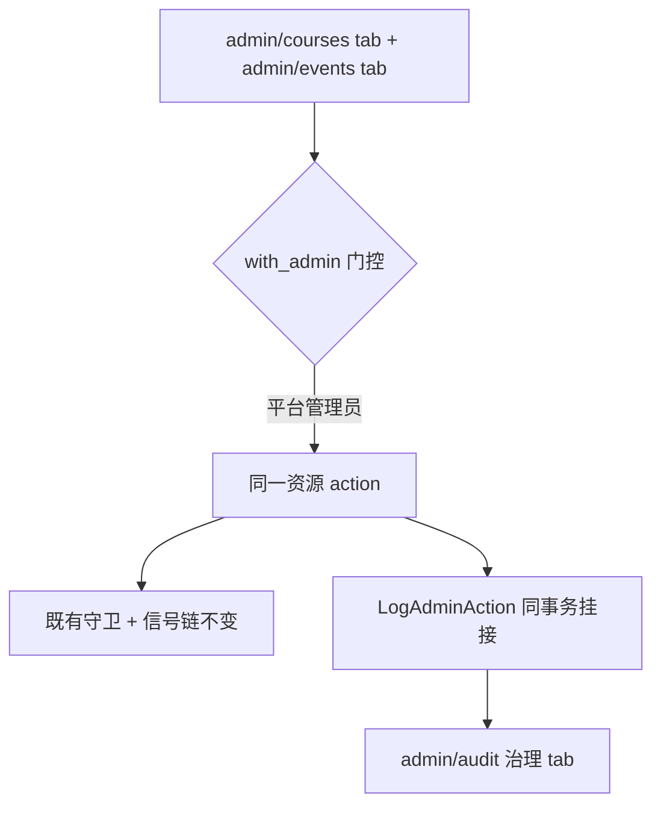

# 平台治理后台 Course 与 Event 管理 - Plan

## Goal Capsule

- **Objective:** 平台管理员在治理后台即可跨工作台定位、排查并全权处置 Course 与 Event（生命周期操作与元数据编辑），每笔治理写留痕可审计——日常治理不再依赖 psql 或 ops 调试面。
- **Means:** 治理后台新增 Courses 与 Events 两个 tab；后端复用既有治理三件套（`with_admin` 门控、`AdminList` 查询组合子、`LogAdminAction` 留痕）。
- **Product authority:** 平台管理员（本需求唯一 actor，由 repo owner 本人在对话中拍板全部范围决定）。
- **Open blockers:** 无——Outstanding Questions 全部为 Deferred to Planning。

---

## Product Contract

### Summary

治理后台新增 Courses、Events 两个 tab：平台管理员跨工作台定位与排查供给物（状态与生命周期、报名与名额、对账告警、基本信息），并全权处置——生命周期操作与元数据编辑，语义与工作台写完全一致，每笔写留痕进 audit。

### Problem Frame

平台管理员治理排查已常态化，现状路径是 psql 直查或 `/ops/admin` 调试面——英文、表格化、无跨资源关联、更无处置能力。缺口有三层：

- **授权**：Course/Event 写 policy 仅放行工作台 Owner/Admin（`course.ex:909-911` / `event.ex:1037-1039`），非成员平台管理员对 launch/close/cancel 一律被拒；读侧虽已放行（跨租户可读），但读与写之间没有治理面承接。
- **留痕**：`LogAdminAction` 注册表现覆盖约 20 个站点（initiative 五连、order 三连、免缴、主理人指派等），Course/Event 生命周期零挂接——即使有人经工作台改了场/课，audit 治理 tab 也不可见（平台管理员自己的工作台身份操作除外）。
- **页面**：`/admin` 八项导航无 courses/events，对账页的 finding（规④⑤⑧⑨⑩⑪⑫直接产 Event/Course finding）没有跳转到具体场/课的落点。

### Key Decisions

- **D1. 完整治理写**——平台管理员获得生命周期 + 元数据的全权处置，不是只读排查面 (session-settled: user-directed — chosen over read-only and minimal-write: 日常治理常态化需要全权处置)。Governs R4, R5
- **D2. 同语义写 + 逐笔留痕 + 高危动作后果披露**——治理写复用工作台同一 action，不造旁路；关定价/关押金（任一槽位 true→false）与 cancel 这类带级联财务后果的动作，确认弹窗披露后果数字 (session-settled: user-approved — 同语义与可追溯一体，级联财务后果由确认流兜住)。Governs R4–R6, R8
- **D3. 写边界 = 标准元数据全集**——slug 锁定（ADR-0014）与教研内容（prep 链）对平台管理员同样不可绕 (session-settled: user-directed — chosen over slug-unlock and curriculum-bypass: 资源级裁决不因治理面让步)。Governs R5, R7
- **D4. 双 tab 信息架构**——`/admin/courses` 与 `/admin/events` 独立成 tab，不做单一 offerings 合并面 (session-settled: user-directed — chosen over single offerings tab: 与现有 tab 模式和 `/events` `/courses` 公开面心智一致)。Governs R1–R3
- **D5. 对账承接走 entity 关联**——各 tab 按 `entity_type` + `entity_id` 过滤既有 findings 读面，不放开 detail 投影的 v1 裁剪 (session-settled: user-approved — 告警定位到「跳到场/课」粒度即可，detail 数值不可见是接受的取舍)。Governs R3

### Actors

- A1. **平台管理员**（`is_platform_admin`）：治理面唯一操作者；跨租户全量读，全权治理写。
- A2. **工作台 Owner/Admin**：语义锚——治理写复用其同款 action 与守卫，本需求不改变其能力。
- A3. **学员/报名者**：受治理写级联影响（批量免缴、退款），不直接接触此面。

### Requirements

**信息架构与读取**

- R1. `/admin` 新增 Courses 与 Events 两个 tab，纳入既有导航与治理守卫（AdminGuard 同款门控），平台管理员可跨工作台列出全部 Course/Event——含 draft 与终态行，不受公开可见性过滤。
- R2. 每个 tab 提供定位能力：按标题/slug 搜索、按状态过滤、按工作台过滤、分页；列表行含状态、容量与已确认数、所属工作台、关键时间。
- R3. 详情视图聚合四类排查投影：基本信息与公开链接、生命周期状态、报名与名额（容量/已确认/截止 + 关联 findings 列表，按 D5 承接、不含 detail 数值）；Course 侧加占位标题标记与当前 revision，Event 侧加主理人与挂载来源标记。

**治理写**

- R4. 平台管理员可执行生命周期操作（launch / close / cancel），与工作台 Owner/Admin 完全同语义：同一 action、同守卫、同信号链。
- R5. 平台管理员可编辑标准元数据全集（标题、时间、容量、截止、定价与押金槽位、visibility、venue 等工作台可编辑项），同语义；slug 与教研内容不在此列（R7）。
- R6. 高危动作执行前确认弹窗披露后果数字：定价或押金槽位 true→false 披露将批量免缴的 payment_pending 笔数；cancel 披露受影响的已付与待付报名笔数及其按既有取消链路产生的后果——照 initiatives 治理页确认文案先例。
- R7. slug 锁定与教研内容编辑对平台管理员同样拒绝：已发布实体改 slug 拒绝并返回与工作台路径一致的稳定错误码；教研内容仍只能走 prep 链。
- R8. 每笔治理写同事务留痕（挂接 `LogAdminAction` 注册表，target_type 区分 event/course），`/admin/audit` 治理 tab 可见操作者、动作、目标与时间；audit 的 metadata 投影按 #607 白名单纪律逐 action 显式收录，未收录 action 投影为 null（默认拒不破）。
- R9. 写放行的落点（资源 policy 直接追加平台管理员放行 vs 专用治理 mutation）由 planning 定，约束两条：不得绕过既有 action 守卫与信号链；平台管理员不因此获得工作台成员身份或角色。

**约束**

- R10. 新增列表/详情 GraphQL 文档满足 complexity 预算（非 dev `max_complexity 4000`，分页字段按 first × (字段数 + 2) 折算），预算回归测试同步。
- R11. `/ops/admin`（AshAdmin 调试面）保持现状：不迁移、不替换、不删配置。

治理写单源路径（R4–R8 的结构）：

### Key Flows

- F1. 排查闭环
  - **Trigger:** 平台管理员从对账页 finding、或从 tab 搜索入口进入。
  - **Steps:** 定位到场/课（标题/slug/状态/工作台过滤）→ 详情四类投影 → 判定。
  - **Covers:** R1, R2, R3.
- F2. 处置闭环
  - **Trigger:** 平台管理员在列表行或详情发起生命周期操作或元数据编辑。
  - **Steps:** 高危动作弹确认（后果数字）→ 同语义执行 → 同事务留痕 → audit 治理 tab 可查。
  - **Covers:** R4, R5, R6, R8.
- F3. 名额一致性排查
  - **Trigger:** 规⑧–⑫ finding（无账本行/occupancy 不一致/投影漂移等）指向某场/课。
  - **Steps:** 跳转详情 → 看容量/已确认/截止与名下全部 findings → 结合 offering 侧投影判定账本一致性。
  - **Covers:** R3.

### Acceptance Examples

- AE1. **Covers R1, R2.** 平台管理员打开 `/admin/events`，不选工作台能看到全部状态的场（含 draft 与 cancelled），按 slug 搜索定位到目标行。
- AE2. **Covers R4, R6, R8.** 平台管理员对 open 状态的场执行取消：确认弹窗披露受影响报名笔数与后果；确认后场转 cancelled、受影响报名按既有取消链路处理（不新增语义），audit 治理 tab 新增一条记录（操作者 = 该平台管理员，target_type = event）。
- AE3. **Covers R5, R6, R8.** 平台管理员把某场（pending ≤ 200）押金槽位 true→false：弹窗披露将批量免缴 N 笔 payment_pending；确认后 N 笔转 confirmed、待付单作废，audit 可查（同工作台路径语义，含 `WaivePendingOnFeeSlotDisable` 挂接）。pending > 200 的场，关槽位入口隐藏并引导走 cancel（KTD4）。
- AE4. **Covers R3.** 从对账页规⑨ finding（entity_type=event）跳转 events tab 详情：能看到该场及其名下全部 findings 列表；列表不含 detail 数值。
- AE5. **Covers R7.** 平台管理员尝试修改已发布场的 slug：被拒，稳定错误码与工作台路径一致（`event_slug_locked`）。
- AE6. **Covers R1.** 非平台管理员访问两个新 tab：被治理守卫导回，无数据暴露。

### Success Criteria

- 四类排查（状态与生命周期、报名与名额、对账处置、定位与基本信息）全部可在浏览器内闭环，无需 psql 或 `/ops/admin`。
- 每笔治理写在 `/admin/audit` 可追溯：操作者、动作、目标、时间。
- 治理写与工作台写无语义分叉：同一 action，无旁路实现。

### Scope Boundaries

**Deferred for later**

- 报名/订单个体级处置（退单、逐笔核销的操作面）——本次只到 offering 级定位与处置。
- MCP 治理族扩充（`admin_launch_course` 类工具化）——本次只做 web 治理面。
- finding detail 数值投影放开——若实际排查证明必须可见，另立需求推翻 v1 裁剪（#607 同款流程）。

**Outside this product's identity**

- `/ops/admin` 调试面不迁移不替换：治理面（面向日常治理、中文、留痕）与调试面（面向运维排查、全字段）长期并存。
- 平台管理员治理权 ≠ 工作台成员身份：治理写走治理面，不制造「超级成员」。

### Dependencies / Assumptions

- 假设：工作台侧 launch/close/cancel/update action 的守卫与信号链原样复用，不为治理面新增语义旁路（audit 挂接除外）。
- 假设：findings 读面可在既有 `reconciliation_findings` query 上以 `entity_type`/`entity_id` 过滤参数扩展。
- 依赖既有设施：`LogAdminAction` 注册表、#607 metadata 白名单投影、`AdminList` 组合子、`with_admin` 门控、AdminGuard。

### Outstanding Questions

**Deferred to Planning**

- 写放行落点：资源 policy 追加 `authorize_if(PlatformAdmin)` vs 专用治理 mutation（resolver 层门控）——planning 权衡「双面契约」（能力面语义、Rbac abilities）后定，受 R9 约束。
- 新留痕 action 命名与 metadata 白名单收录项（audit 投影粒度）。
- cancel 的报名侧级联语义盘点：确认既有 cancel action/worker 对已付与待付报名的实际处理（退款/作废），R6 确认弹窗文案按盘点结果披露。
- Event 侧详情字段层级：`detached_rule_provenance`、`curriculum_enabled` 在列表还是详情透出。
- 两个 tab 是否需要 `[id]` 子路由（initiatives 先例是同页列表 + 行内展开，users/audit 是纯列表；详情聚合投影 R3 的体量可能超过行内展开）。

### Sources / Research

- `backend/lib/cgc_2046/courses/course.ex` / `backend/lib/cgc_2046/events/event.ex`：生命周期 actions（launch/close/cancel）、policies（read 含 PlatformAdmin `:902-906`/`:1029-1034`；write 仅 OwnerOrAdmin `:909-911`/`:1037-1039`）、slug 锁定守卫（`course_slug_locked`/`event_slug_locked`）、资源级 GraphQL mutations。
- `backend/lib/cgc_2046/accounts/changes/log_admin_action.ex` + `backend/lib/cgc_2046/accounts/admin_action_log.ex`：留痕注册表（raw-or-fn/2 契约、fail-closed 同事务落库）与读路径；Course/Event 零挂接是缺口本体。
- `backend/lib/cgc_2046_web/graphql_schema.ex`：`with_admin/2`（`:3531`）、`admin_list/3-4` 工厂（`:3546-3560`）、initiative 治理链（`:555`/`:602`/`:1798-1879`，可复制范式）、#607 metadata 白名单投影（`:11-36`/`:2930-2966`）、`:admin_reconciliation_finding`（无 detail，`:2970-2979`）。
- `backend/lib/cgc_2046/admin_list.ex`：查询组合子（search/status/time-range/workspace filter/paginate `@max_first 200`）。
- `backend/lib/cgc_2046_web/router.ex`（`:7-33`）：complexity 预算与回归测试钉子 `graphql_complexity_budget_test.exs`。
- `backend/lib/cgc_2046/admission/changes/waive_pending_on_fee_slot_disable.ex`：定价/押金双槽 true→false 批量免缴（挂接 `course.ex:441` / `event.ex:614`；调用 `Enrollment.waive_pending_for_offering/4`，失败回滚整个 update）。
- `docs/adr/0014-slug-immutability.md`：slug 非 draft 一律锁死，无 rename 后门。
- `web/app/[locale]/admin/`：`layout.tsx:24-33` 导航单源、users/audit/initiatives 页面模式；`web/lib/admin.ts` + `web/lib/graphql/admin.ts` 数据面范式（`adminList()` 单模板、`MutationError` 信封）。
- `CONTEXT.md`：Offering（供给物）词条、Event/Course 词条、平台管理员双面契约词条、#624 解除挂载来源标记。
- 会话外 grounding dossier（transient scratch）：`/tmp/compound-engineering-501/ce-brainstorm/admin-offerings-governance/grounding.md`——150 行带 file:line 的证据表，本机可读。

---

## Planning Contract

Product Contract unchanged — 本阶段只增实现规划，不改任何 R/A/F/AE 语义。

### Key Technical Decisions

- KTD1. 写授权走「逐 action policy 放行 + 治理 mutation 标准授权」，守卫零复刻、范围零外溢。两资源新增**独立 policy 块** `policy action([:update, :launch, :close, :cancel]) do authorize_if(PlatformAdmin) end`（分块先例 `initiative.ex:249-255`）——不触碰既有 `action_type([:create, :update])` 块：create（含其副作用：event create 自动指派创建者为主理人、course create 触发 prep run 实例化）与内部 update 型 action（`:qualify`/`:link_curriculum_run`/`:bind_current_revision`）对平台管理员保持拒绝。治理 mutations 照 `initiative_status_mutation/1` 范式（`graphql_schema.ex:3478-3499`：with_admin 门控 + actor 直传 + 标准授权，无 `authorize?: false` 旁路）——slug 锁、状态机 CAS、命名门全部走既有 action 守卫。Rbac 能力面与 policy 面独立推导（`rbac.ex:90-106`：manage 类 ability 只看 `Role.manage_role?/1`），policy 放开对 ability 面零影响，双面契约的能力侧裁决（`policies/platform_admin.ex:14-18`）不破。 (session-settled: user-approved — D1/D2 的 how 级实例化：同语义不造旁路) Governs R4, R5, R9
- KTD2. 留痕只覆盖治理写，且必须 raise 型回滚。8 个治理目标 action（launch/close/cancel/update × event/course）以 **raise 型留痕**挂 `LogAdminAction`（经 `AdminActionLog.log!/1` 或等效上抛——`change/3` 内非 raise 的 `log/1` 在 Ash 3.33 的 after_action 返回 error 不回滚事务，先例 `attendance.ex:299`），`skip_unless` 谓词（`log_admin_action.ex:29,57`，模块级 public fn 满足远程捕获约束）判定 actor 非平台管理员即跳过——工作台 Owner/Admin 写不留痕，现状审计语义不变。`admin_action_log.ex` action 白名单（:36-82）追加 8 值（`admin_event_*`/`admin_course_*` 前缀消歧）。audit 变更投影：`admin_action_metadata/1` 的形状门固定为 rule_key 族（`projectable_metadata?/1` 要求 rule_key 字符串 + locked 布尔 + value_after map），offering 变更需**新增专用 GraphQL object**（`admin_offering_change_metadata`：闭集标量 title/visibility/capacity/pricing_enabled/deposit_enabled 的 value_before/after 分列；不收 description/venue 等自由文本，不复用 JSON 槽）+ 形状分支，未收录 action 仍投影 null（默认拒不破）；audit 前端 `ACTION_LABEL` 有原串回退（`audit/page.tsx:191`）。Governs R8
- KTD3. 治理读面照 initiative 工厂形状。`AdminList` 新增 `maybe_offering_search`（title/slug contains OR，通用组合子，照 `maybe_workspace_search` 形状 :38-43）；`list_events`/`list_courses` 走 `admin_list` 工厂（search/status/workspace/first/after，工作台过滤接既有 `maybe_real_workspace_filter` :125-129）；`get_event`/`get_course` 走 with_admin + `Ash.get`。Event/Course 均 `global?(true)` multitenant（`event.ex:379-383`、`course.ex:246-250`），无 tenant 全表读合法且 read policy 已放行。列表行带 workspace_id，前端以既有 workspaces 数据映射名称。Governs R1, R2
- KTD4. 确认数字取权威计数，弹窗单一取数契约，超限引导 cancel。详情 resolver 直接 count Enrollment（confirmed / payment_pending），不用 `confirmed_count` 展示投影（自述可能滞后一拍，`graphql_schema.ex:3044-3045`）。弹窗数字单一来源 = 打开确认（或展开详情）时对 get 查询一次现取：取数中渲染 loading、取不到渲染「计数不可用」态、不落假值；写成功后重取刷新。槽位 true→false 弹窗披露 pending 笔数；pending > 200（批量免缴上限，`waive_pending_on_fee_slot_disable.ex:52-61` 超限拒绝）时隐藏关槽位入口、引导走 cancel——该判定以同一次现取为准，取到前入口禁用。cancel 弹窗披露 confirmed/pending 笔数，退款表述为「取消后由系统异步处理」（`OfferingCancelRefundWorker` 订阅 ended 信号异步：cancelled 批量退已付、pending 作废释放名额，无同步回执）。交互形态：cancel 沿用 `window.confirm` 先例（KTD6），槽位关停因需异步取数等待反馈改用自绘 modal（initiatives 弹层先例）。Governs R6
- KTD5. findings 关联强制成对过滤。`reconciliation_findings`（`graphql_schema.ex:531-548`）增加 `entity_id` arg；resolver 校验 entity_id 必须与 entity_type 成对（entity_id 混装 uuid 与 oban_job 数字串，单独使用无歧义性）；前端按 `(entity_type, entity_id)` 查询。detail 投影 v1 裁剪不动（D5）。Governs R3
- KTD6. 页面照 initiatives 同页模式，不建子路由。列表 + 行展开详情 + 行内操作 + `window.confirm` 确认先例（`initiatives/page.tsx:340-351`）；按钮可见性矩阵：draft 行无 close/cancel（状态机仅 open 可迁移，`event.ex:696-758`），终态行无生命周期操作。events/courses 两 tab 独立实现，不抽共享抽象（admin 面现状无跨页组件先例）。Governs R1, R3

### Assumptions

实现层取舍（自动管线未逐一确认，评审可推翻）：

- 元数据写无并发保护：治理侧与 Owner 并发编辑为 last-write-wins（与现有 web/MCP 写路径一致），不加乐观锁。
- 非法状态迁移的后端错误为裸英文 prose（无稳定 code），治理 UI 呈现通用错误 message；slug 锁定走稳定 code 特殊呈现。裸错误 code 化是既有全局欠账，不进本 plan。
- findings 列表呈现「当前活 findings」（刷新语义会硬删除已消解行，`finding.ex:204-220`），不区分已消解三态。
- 列表 status 过滤用 UI 下拉枚举（`status_values/0`），规避 `maybe_status_filter` 非法值静默回退的误判面。
- 弹窗笔数与提交瞬间的漂移由后端既有语义兜底（批量免缴 CAS 先到先得、超限拒绝），前端数字仅为披露参考。

### Risks & Impact

- 授权面扩大：平台管理员获得全部租户 offerings 的写能力，是授权模型的单侧扩大。缓解：留痕 fail-closed（KTD2）+ audit tab 全程可查 + R9 禁止旁路。
- 级联财务动作进入一键射程：关定价/关押金/cancel 的级联后果（批量免缴、异步退款）从工作台操作扩展到治理面一键触发。缓解：KTD4 披露数字 + 超限引导 + 确认流；披露确认流只存在于 web 治理页——平台管理员经既有工作台 mutation（同 session 任意客户端）直调同 action 不经过披露，action 本体语义零改动。
- MCP 语义张力（记录不动）：同族 action 在 MCP 面用 PendingOperation 确认流、web 治理面用确认弹窗披露数字，两套确认语义并存。Scope Boundaries 已 defer MCP 族；action 本体零改动。

---

## Implementation Units

### U1. 写授权与治理留痕（后端）

- **Goal:** 平台管理员获得 Course/Event 写能力；治理写全部留痕，场主写审计语义不变。
- **Requirements:** R4, R5, R7, R8, R9 (KTD1, KTD2)
- **Dependencies:** 无（链起点）
- **Files:** `backend/lib/cgc_2046/courses/course.ex`、`backend/lib/cgc_2046/events/event.ex`（policy 块 + 8 挂接点）、`backend/lib/cgc_2046/accounts/changes/log_admin_action.ex`（public 谓词）、`backend/lib/cgc_2046/accounts/admin_action_log.ex`（action 白名单）、`backend/lib/cgc_2046_web/graphql_schema.ex`（治理 mutations + `admin_offering_change_metadata` object 与形状分支）、`web/lib/graphql/admin.ts` + `web/app/[locale]/admin/audit/page.tsx`（变更投影查询与渲染）、`backend/test/`（policy 与留痕测试，镜像既有 policy/slug 测试位置）
- **Approach:**
  1. 两资源新增独立 policy 块 `policy action([:update, :launch, :close, :cancel]) do authorize_if(PlatformAdmin) end`（分块先例 `initiative.ex:249-255`）——不触碰既有 `action_type([:create, :update])` 块；create 与 `:qualify`/`:link_curriculum_run`/`:bind_current_revision` 不放行。
  2. 8 个治理目标 action 挂 **raise 型** `LogAdminAction`（`log!/1` 或等效上抛），`skip_unless` 指向注册表模块新增 public 谓词（actor 非 platform_admin → 跳过）。
  3. action 白名单追加 `admin_event_update/launch/close/cancel` + `admin_course_update/launch/close/cancel`。
  4. graphql_schema 新增治理 mutations（`admin_launch/close/cancel/update_event|course` 八 fields，resolver 照 `initiative_status_mutation/1` 模式：with_admin + `Ash.get` + `Ash.update`，actor 直传）。
  5. `admin_offering_change_metadata` object + `admin_action_metadata/1` 形状分支（闭集标量 title/visibility/capacity/pricing_enabled/deposit_enabled 的 value_before/after 分列；不收自由文本，不复用 JSON 槽；未收录 action 仍 null）。
- **Patterns to follow:** `initiatives/initiative.ex:69-72,113-116` 挂接原文；`log_admin_action.ex` moduledoc 契约（metadata fn 必须 public 远程捕获）；`initiative.ex:249-255` policy 分块先例。
- **Test scenarios:**
  - 平台管理员（非成员）对 open 场执行 launch/close/cancel 成功。
  - 平台管理员对任意租户 create（createEvent/createCourse）被拒。
  - 平台管理员直调 `:link_curriculum_run`/`:qualify`/`:bind_current_revision` 被拒（无旁路授权）。
  - 平台管理员改已发布实体 slug 被拒且 code 为 `event_slug_locked` / `course_slug_locked`（AE5）。
  - 工作台 Owner 执行同一 launch：成功且不落 AdminActionLog 行（skip_unless 生效，现状不回归）。
  - 非成员普通用户写被拒（AE6 后端面）。
  - 留痕失败（log! 上抛）：治理写整体回滚、无半态（fail-closed）。
  - metadata 投影：两个 update action 在 audit 读面返回 `admin_offering_change_metadata` 字段；未收录 action 仍 null。
- **Verification:** 新增测试绿 + 既有 policy 测试零回归；后端 precommit 绿。
- **Execution note:** 变异验证——去掉逐 action 放行块或去掉 `skip_unless`，对应测试必须变红。

### U2. 治理读面与 findings 关联（后端）

- **Goal:** 跨租户列表/详情/搜索/分页 + 权威报名计数 + findings 成对过滤。
- **Requirements:** R1, R2, R3, R10 (KTD3, KTD4, KTD5)
- **Dependencies:** 无硬依赖（读 policy 既有放行）；与 U1 可并行
- **Files:** `backend/lib/cgc_2046/admin_list.ex`（新组合子）、`backend/lib/cgc_2046_web/graphql_schema.ex`（4 query + findings arg + 行投影）、`backend/lib/cgc_2046/events/event_moderator.ex`（主理人读面 PlatformAdmin 分支）、`backend/test/`（query 测试）
- **Approach:**
  1. `AdminList.maybe_offering_search/3`（title/slug contains OR）。
  2. `list_events` / `list_courses`：arg(status/search/workspace_id/first/after) + admin_list 工厂，工作台过滤接 `maybe_real_workspace_filter`。
  3. `get_event` / `get_course`：with_admin + `Ash.get` + 行投影带 confirmed / payment_pending 计数（按 offering count Enrollment）；`get_event` 另带主理人列表（`Moderators.list/3` 加 PlatformAdmin 分支，或治理面直读 EventModerator）与 `detached_rule_provenance`。
  4. `reconciliation_findings` 加 `entity_id` arg + filter 链一行 + 成对校验。
- **Patterns to follow:** `graphql_schema.ex:555-600` list_initiatives（组合子接线）；`:531-548` findings resolver（`maybe_real_workspace_filter` 追加先例）。
- **Test scenarios:**
  - 平台管理员无 workspace 过滤列出全租户（含 draft/cancelled）——AE1 后端面。
  - workspace 过滤命中只返回该台行、不命中返回空。
  - title/slug 搜索命中与不命中；status 过滤各值。
  - 分页 first 封顶与非法 after 回退。
  - 详情计数与 Enrollment 实际行数一致（免费场零计数、pending/confirmed 分列）。
  - 非成员平台管理员取主理人列表不返回 forbidden。
  - findings：entity_id 缺 entity_type 被拒；成对过滤命中。
  - 复杂度：新列表文档在 max_complexity 4000 内。
- **Verification:** query 测试绿；`graphql_complexity_budget_test.exs` 全量绿。
- **Execution note:** 测试库带 `PASEO_BRANCH_NAME`；本 plan 无日期断言，无时区双向要求。

### U3. Events 治理 tab（前端）

- **Goal:** `/admin/events` 全功能：定位、四类投影、生命周期处置、留痕可见。
- **Requirements:** R1, R2, R3, R4, R5, R6 (KTD3, KTD4, KTD6)
- **Dependencies:** U1, U2
- **Files:** `web/lib/graphql/admin.ts`、`web/lib/admin.ts`、`web/app/[locale]/admin/events/page.tsx`（新建）、`web/app/[locale]/admin/layout.tsx`（导航）、`web/app/[locale]/admin/reconciliation/page.tsx`（finding 跳转链接）、`web/messages/zh-CN.json` + `web/messages/en.json`、页面同目录测试（照 `initiatives/page.test.tsx` 惯例）
- **Approach:**
  1. 数据面：LIST/GET 文档 + 4 个 mutation 函数（adminList 构造器 + 信封范式）。
  2. 页面：列表（搜索框 + 状态下拉 + 工作台选择器（复用 `fetchWorkspaces`）+ 分页）+ 行展开详情（基本信息与公开链接、生命周期、报名计数、主理人与挂载来源标记、findings 列表）+ 行内状态操作 + 元数据编辑面（R5 全集：标题/时间/容量/截止/定价与押金槽位/visibility/venue，保存走治理 update mutation）。
  3. 高危确认（KTD4 单一取数契约）：打开弹窗现取 get_event，loading 与「计数不可用」态不落假值；槽位关停用自绘 modal（异步取数需等待反馈），cancel 用 `window.confirm`；pending > 200 隐藏关槽位入口、提示走 cancel（取到前入口禁用）；写成功后重取刷新计数。
  4. 对账跳转落地：`reconciliation/page.tsx` finding 行按 entity_type 渲染链接（event → `/admin/events?entity_id=<uuid>`，仅 event/course 可点）；本 tab 读参数、用 get 查询定位并自动展开对应行。
  5. 导航项 + admin 命名空间 i18n 双语。
- **Patterns to follow:** `initiatives/page.tsx:60-99`（state + seq 防迟到回包）、`:340-351`（transition + window.confirm）、`:556-604`（弹层 focus trap 与不可用态先例）、`:663-678`（状态按钮矩阵）；`layout.tsx:24-33` 导航接线。
- **Test scenarios:**
  - 列表渲染/搜索/状态与工作台过滤交互（vitest）。
  - 状态操作按钮可见性矩阵（draft 无 close/cancel；open 全量；终态无）。
  - 确认弹窗文案含笔数；pending > 200 时关槽位入口隐藏；取数失败渲染不可用态。
  - AE3 押金槽位路径（pending ≤ 200 披露并批量免缴）与元数据编辑提交路径。
  - entity_id 参数定位并自动展开对应行。
  - mutation 错误信封呈现在行内（MutationError → 行内 error）。
- **Verification:** `pnpm test` 绿；ego-browser 走查 AE1、AE2、AE4（events 侧）。
- **Execution note:** E2E 登录态按 repo 规则默认复用浏览器 profile；临时凭证验证后必须恢复。

### U4. Courses 治理 tab（前端）

- **Goal:** `/admin/courses` 全功能，同 U3 形状 + Course 特有投影。
- **Requirements:** R1, R2, R3, R4, R5, R6 (KTD3, KTD4, KTD6)
- **Dependencies:** U1, U2（与 U3 无依赖，可并行）
- **Files:** `web/lib/graphql/admin.ts`、`web/lib/admin.ts`、`web/app/[locale]/admin/courses/page.tsx`（新建）、`web/app/[locale]/admin/reconciliation/page.tsx`（course 侧跳转链接）、`web/messages/*`、同目录测试
- **Approach:** U3 步骤套 Course（含工作台选择器与对账跳转落地）；详情投影加 provisional_title 标记与 current_revision 信息（占位标题课程一眼可辨）；元数据编辑面（R5 全集：title/starts_at/ends_at/description/capacity/截止/定价槽位/visibility）；高危确认只覆盖定价槽位（押金为 Event-only 字段，AE3 场景在 events tab）。
- **Patterns to follow:** 同 U3。
- **Test scenarios:** 同 U3 形状 + 占位标题徽章渲染 + 定价槽位关闭弹窗披露 + 元数据编辑（含 starts_at/ends_at/description）提交路径 + entity_id 参数定位展开。
- **Verification:** `pnpm test` 绿；ego-browser 走查 courses 侧定位与编辑路径。
- **Execution note:** 与 U3 并行时共享文件（i18n、数据面）分段编辑或串行落地，避免同文件冲突。

### U5. 集成验证与预算回归

- **Goal:** AE1-AE6 全链验收 + 复杂度预算 + 全量质量门。
- **Requirements:** R1-R11 全量
- **Dependencies:** U1-U4
- **Files:** 无新文件（验证任务）；`backend/test/graphql_complexity_budget_test.exs` 仅在预算钉子需更新时触及
- **Approach:** 后端 precommit + 前端 test 全量；ego-browser 六条 AE 走查（数值断言优先）；复杂度预算测试；R11 以 git diff 确认 `/ops/admin` 配置零变更。
- **Test scenarios:**
  - AE1-AE6 逐条（定义见 Product Contract）。
  - 复杂度回归（R10）。
  - `/ops/admin` 零 diff（R11）。
- **Verification:** 全量绿 + AE 走查证据（命令原始输出/截图）留档。

---

## Verification Contract

| 门 | 命令 | 覆盖 |
|---|---|---|
| 后端全量 | `cd backend && PASEO_BRANCH_NAME=$(git branch --show-current) mix precommit` | U1、U2、编译/lint/全测试 |
| 前端全量 | `cd web && pnpm test` | U3、U4 |
| 复杂度预算 | `graphql_complexity_budget_test.exs`（precommit 内） | R10 |
| E2E | ego-browser（worktree 内 Dev 服务） | AE1-AE6、R1-R7 走查 |
| 变异验证 | 手工：去掉 KTD1 放行行 / KTD2 skip_unless | 对应测试必须变红 |

- worktree 并发纪律：后端测试恒带 `PASEO_BRANCH_NAME`（`docs/agents/worktree-orchestration.md` §5）。
- 变异验证纪律：新增守卫只「绿」不算钉住，必须验证摘除即红。
- 本 plan 无 schema 迁移、无时区敏感断言。

---

## Definition of Done

- AE1-AE6 全部通过且证据留档（命令原始输出/截图，数值断言优先）。
- 后端 precommit 与前端 test 全量绿（`PASEO_BRANCH_NAME` 正确）。
- 变异验证完成：KTD1 放行行与 KTD2 skip_unless 摘除均使对应测试变红。
- 无废弃代码与调试残留；`/ops/admin` 相关配置零 diff（R11）。
- 各单元自身 Verification 字段达成、测试场景全绿。
