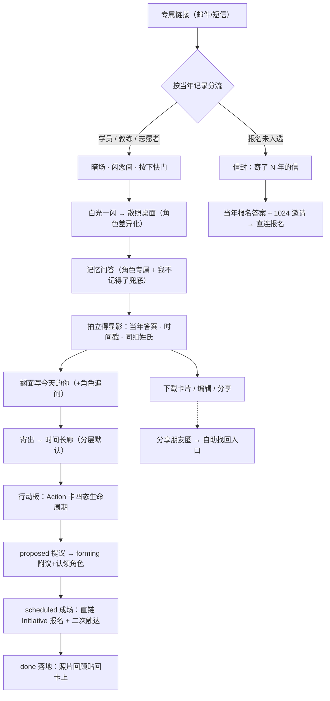

## Goal Capsule

- **Objective:** 把 2012-2018 年 Rails Girls / Girls Coding Day 报名表里的答案变成拍立得式的个人档案，通过专属链接唤醒当年的学员、教练、志愿者，圆梦报名未入选者，为 1024 各城市活动与 Initiative 动员收集参与意愿——先以 2014-01-11 北京场 pilot 验证完整链路：报名 344 人，录取（记忆线）102 人，未入选（圆梦线）约 242 人。教练数据此场缺失，教练线在全量阶段启用。(session-settled: user-directed)
- **Means:** 拍立得 + 信的交互隐喻（快门开场 → 散照认领 → 显影 → 翻面写字 → 寄出上墙；未入选者走信封），已用三变体可交互原型实证定案。
- **Product authority:** 产品行为、范围、调性由创始人（文洋）在本对话中逐项确定；意图→课程/工具的服务闭环、全量 18 场投放等周边区域为后续工作，不是当前范围。
- **Open blockers:** 其余 17 场 Excel 表结构与 `ui` sheet 含义待核（2014-01-11 场结构已核，见 R22，pilot 脚本可先行）。

---

## Product Contract

### Summary

「闪念间（In a flash）」：老校友从专属链接进入（首程 H5 免登录），按下快门、白光一闪，在模糊散照中认领自己那张——它慢慢显影出十几年前的自己（当年报名答案 + 报名时间戳）；翻过来写下今天的自己并寄出（此刻可一步注册），时间长廊里别的照片正在显影成 1024 的 Action 场次。未入选者收到的是一封迟到多年的信。管理员经一次性脚本导入 Excel、生成链接、看板跟踪。

### Problem Frame

从 2012 年 Rails Girls 上海首场起，到 Girls Coding Day 十城五十场，社区累计报名约 4000 名学员（另有教练与志愿者），全部数据留在本地 Excel 中，与现在的 cgc_2046 平台互不连通。2023 年，一位学员在微博上找到创始人：突然一瞬间想起十年前参加过这个活动，专程道谢——这条一个月后才被看到的私信，证明这段记忆在离散多年后仍有情感存量，缺的只是一个唤起它的瞬间。

当下有两个真实需求压在这笔存量上：其一，全国性 Initiative（各城市 10 月 24 日活动）需要赞助、宣传、教练、留言——这些资源最可能来自记得当年的人；其二，当年报名未入选的人（报名答案也在 Excel 里）如今可以被全国场次与线上课程圆梦。触达资产现状：18 场、约 4000 学员、手机与邮箱齐全，预估 60-70% 仍可有效触达。

### Actors

- A1. 学员——当年参与过工作坊，走记忆线。
- A2. 教练——当年带组（1 名教练带 3-4 名学员），记忆线的散照与追问有角色差异。
- A3. 志愿者/组织者——当年参与组织，记忆线的散照与追问有角色差异。
- A4. 未入选者——当年报名但未入选，走圆梦线（信封）。
- A5. 管理员——创始人/运营：脚本导入、生成链接、发送、看板、兑换处理。

### Key Decisions

- **调性「两者一体」**：重连的感动与 Initiative 动员是同一件事——当年他们写下「我为什么要参加」，今天我们问「你想做什么」，感动与邀请同屏发生。(session-settled: user-directed — chosen over 情感为主/动员为主：调性决定全部文案与页面走向)
- **交互隐喻：拍立得 + 信（原型实证混搭）**：电影式开场（暗场·闪念间·快门·白光）→ 桌面散照（快显影、把玩感）→ 寄出上墙；信物式信封专归圆梦线。显影/翻面/寄出是仪式，不是表单；自己认领的那张用中速显影——全流程唯一的慢时刻留给「认出自己」。Governs R4, R7, R9。(session-settled: user-approved — 三变体原型实测后用户定混搭)
- **展示三层递进，均本人主动**：不寄出（仅本人可见）→ 寄出到校友墙（同行者可见）→ 站外公开（互联网，需另开公开开关；实名支持 R31 是这一档的产品化用途——授权平台作品牌素材）。沉默的人永远安全。Governs R11, R14, R31。(session-settled: user-approved — 在两档授权基础上经寄出语义澄清确立)
- **分层默认：结构化层满员 + 内容层一键点亮；姓氏隐名；离线雾化**：墙分两层——结构化层（姓氏+城市+场次+年份+当年职业，全名隐去为「王\*\*」，隐名不隐姓）默认满员，同学录逻辑，墙由此是满的；内容层 opt-in，雾化在平台外由运营方的 agent 完成（标记语法），导入即雾化好，寄出确认时一键上墙。撤下与隐藏免注册（链接即身份）。未采纳「雾化后全部内容默认上墙、撤下需注册」：雾化≠PIPL 意义的匿名化（细节组合仍可识别），且默认曝光+高成本退出有舆论与合规风险——opt-in 的墙少而暖，opt-out 的墙满而险。Governs R12, R16a, R30。(session-settled: user-approved — 满墙诉求 user-directed，经风险折中定分层；姓氏隐名为用户收紧；雾化移至平台外为用户修正)
- **回信即参与 + Want/Give 分类存储**：参与字段（想参加什么场、能帮什么）内嵌回信问卷，提交后个人化揭示共同体（「已有 23 人想参加骑行场」）；数据层按 Want（想要）/Give（能给）分类，全量阶段可平滑升级为供需撮合。共创的可供性不靠问卷本身，靠 Action 卡的可见生命周期与真实出口（成形即跳 Initiative、落地有照片回流）——收集不是共创，交付才是。Governs R8, R13, R13a。(session-settled: user-approved — chosen over 独立共建面板/双栏面板：问卷式最轻且节奏与产品同构；用户后续修正：无交付的收集不是共创，遂将 R13 升级为四态生命周期)
- **三角色同隐喻、不同散照与追问**：学员看自己的场次照片，教练看当年带的那组学员名字，志愿者看组织场次档案；翻面时志愿者多问「愿意牵头组织 1024 你城市的场吗」。差异化但不碎片化。Governs R5, R8。(session-settled: user-directed)
- **AI 承载教学，人出意愿与资源**：教练、教材由 AI Agent 承载——动员清单里没有「当教练/写教材」，人力项整体移除；人被动员的是参加、宣传、捐赠。Governs R20。(session-settled: user-directed — 人力动员项删除：AI Agent 时代不需要人当教练；捐奖品项随奖品机制一并移除)
- **链接是邀请函，账号是归宿**：首程免登录（链接即身份，注册/删除前一直有效）；「寄出」的情感峰值引导一步注册（微信一键/手机验证），注册即链接作废、账号接管；回访走小程序「我的」/网站登录（复用现有手机/邮箱/微信认证，零新建），成场通知优先微信订阅消息。Governs R1, R27, R28。(session-settled: user-directed — 修正早前「链接永久有效」设计：零门槛要保护的是首程，回访时的注册是沉淀点而非流失点)
- **相对年数动态计算**：所有「X 年前」按每人的报名时间戳计算（2012 上海首场者见「14 年前」，2015 广州者见「11 年前」），无全局常数。Governs R3。(session-settled: user-directed — 修正原型固定文案缺陷)
- **Excel 导入走一次性脚本，不做产品内导入向导**：数据在本地、18 场一次性，导入 UI 是浪费；表头结构由用户提供后写脚本。Governs R22。(session-settled: user-directed — chosen over 导入向导)
- **单场 pilot 先行（2014-01-11 北京场：报名 344，录取 102 + 未入选 ~242；本场无教练/志愿者/小组数据，角色差异与同组线索在全量阶段启用）**：验证唤醒率与链路后再全量投放。Governs R24 的适用范围。(session-settled: user-directed)
- **内容默认仅本人 + 可编辑 + 可选公开**：当年自由文本答案默认只有本人可见（结构化身份字段按 R12 同学录规则默认在场次名册可见），本人可修改内容、可选择公开。Governs R11, R16。(session-settled: user-directed — chosen over 三层渐进授权(组内互见)/组内默认互见：沉默≠暴露)
- **原文不可改写，对外可雾化；摘要卡为分享默认**：当年原文永存本人档案、不可编辑改写（档案真实性）；对外展示时本人可对任意句标记「雾面」——形态在（“这里有一段当年写的话”）、内容藏，原文在本人视图中永远完整。分享默认为**摘要卡**（报名时间戳 + 城市 + 本人选定的一句金句 + 今天的回答），全文卡与站外公开档案页是更高一级的主动选择；卡片适配朋友圈/小红书。隐私与原汁原味在展示层分层解决，不改数据。Governs R14, R16。(session-settled: user-approved — chosen over 编辑后公开(丢原味、档案可信度受损)/硬开关(一段敏感即全篇藏))

### Requirements

**触达与身份**

- R1. 每位导入者获得专属链接：首程免登录（链接即身份），注册或删除前一直有效、可反复打开、进度不丢；**她注册的那一刻链接作废，账号接管一切**——链接是邀请函，账号是归宿。链接丢失/邮件被删：凭预留手机号或邮箱验证创建账号，档案自动绑定。
- R2. 链接按当年记录自动分流：参与过（学员/教练/志愿者）走记忆线；报名未入选走圆梦线；三角色身份来自导入数据。
- R3. 全部相对时间文案（「X 年前的你」等）按该人报名时间戳动态计算；源数据时间戳精度到秒（2014-01-11 场已证实），文案可精确到「12 年前的 13:06，你写下了这段话」。

**记忆线（参与过：学员/教练/志愿者）**

- R4. 开场为暗场 + 产品名「闪念间 / In a flash」+ 快门按钮；按下后白光一闪进入散照桌面。
- R5. 散照桌面呈现一叠模糊旧照片供点击认领；散照内容按角色差异化——学员为自己参加的场次，教练为当年所带组的学员名单（姓氏可见「王\*\*」、内容不可见，与 R12 隐名规则一致；组员寄出后对其显示全名），志愿者为所组织场次的档案。角色差异依赖导入数据含对应角色记录（2014-01-11 北京场仅学员，pilot 呈现学员视角）。
- R6. 记忆问答为角色专属问题（学员「还记得是哪一场吗」、教练「还记得你带的学员吗」、志愿者「还记得那场办在哪吗」），选项列出全部真实场次，必含「我不记得了」兜底；选择兜底直接给出正确答案，无挫败文案。
- R7. 认领的照片显影为拍立得：正面为当年报名答案——自由文本（自我介绍、有意思的事情等实际存在的题）+ 结构化字段拼出的「我是谁」（性别/职业/操作系统/城市/社交媒体链接，各场题集不同，按真实字段呈现）+ 报名时间戳 + 同组名字线索（姓氏可见「王\*\*」，内容需本人寄出或公开后可见；依赖小组数据，2014-01-11 场未见该字段，有数据的场次启用）；散照用快显影（约 0.6s），认领的主照用中速显影（约 1.2s）；答对时展示比特币未兑换提醒（见 R25）——当年奖品匿名发放、未兑换者名单不可知，故提醒对全场展示，由当年中奖者自行前来兑换。
- R8. 照片可翻面，背面为「今天的你」选填：现状、想做的事/想学的东西、需要什么帮助（旁配课程引导「不知道 AI Agent 能帮什么？我们有门课」）、想对 CGC/文洋说什么（过去或将来）；志愿者额外一问（愿意牵头组织 1024 你城市的场吗）。

**圆梦线（未入选）**

- R9. 未入选者收到信封式开场（「有一封信，寄了 N 年才到」，N 按报名时间动态计算）；拆开为当年报名答案 + 1024 活动/线上课邀请；强 CTA 直连 1024 报名，同样可写字寄出上墙。

**入口与传播**

- R10. 平台顶部导航在 Initiative 边上提供「闪念间」入口；闪念间有游客可读的公开首页（这件事是什么、我们是谁），首页提供自助找回入口，承接分享传播的回流流量。

**寄出、墙与分享**

- R11. 「寄出」= 本人的拍立得（当年正面 + 今天背面）上校友墙；墙对走过闪念间流程的校友可见。
- R12. 墙（时间长廊）分两层，各按各的逻辑默认：**结构化层默认满员**——未寄出者在场次名册以结构化卡呈现（姓氏 + 城市 + 场次 + 年份 + 当年职业，全名隐去显示为「王\*\*」——中文脱敏惯例：保留姓、隐去名，姓无识别度而名有）；场次名册仅含当年实际参与者，未入选者不进入场次名册（他们没走进那间教室），其卡在寄出后出现于「今天」位置；**内容层待点亮**——自由文本（自我介绍/有意思的事）显示为虚线内容位（「她的答案，还在等她」），寄出后完整显影、解锁附议。软门槛精神保留在内容层：缺席可见，但不拦人。
- R13. 墙上展示 Action 行动项卡，卡有四态生命周期：**proposed**（回信的 Want/Give 意愿经管理员人工挑卡确认后成卡上墙——本期无自动聚类）→ **forming**（同伴签名附议 +1，人数实时可见；可认领角色：组织者/宣传拉人/场地资源）→ **scheduled**（附议达阈值或管理员确认后成场，卡亮起并直链 Initiative 真实场次页——日期/城市/报名入口，不在闪念间内部闭环；所有附议者收到二次触达通知）→ **done**（1024 落地后活动照片/回顾贴回卡上，成为墙上最亮的部分）。墙是行动板不是纪念墙：每张卡任何时刻都有可见的下一步动作。pilot 阶段 proposed→scheduled 的确认由管理员人工完成。
- R13a. 二次触达：附议的卡成场（scheduled）时，经微信订阅消息（已注册者，优先）或邮件/短信通知所有附议者，附报名直达链接；闪念间由此成为持续触达通道，而非一次性活动。
- R14. 分享的默认物件是**摘要卡**：报名时间戳 + 城市 + 本人选定的一句金句 + 今天的回答，适配朋友圈与小红书（竖版卡片图，可保存/系统分享）；本人可另选「全文卡」（呈现雾化后的状态）；分享个人档案网页则需先开启站外公开开关。
**个人档案物件**

- R15. 拍立得全文卡可下载为图片与 Markdown；页面中翻转的卡片即下载所得的同一物件（分享默认物件是 R14 的摘要卡，全文卡为另选）。
- R16. 本人可编辑「今天的你」部分；**当年原文不可改写**，但本人可对任意句标记「雾面」——对外展示（校友墙/分享卡/公开页）时该句呈模糊形态、内容不显示，原文在本人视图中永远完整。编辑与雾化绑定链接身份。
- R16a. **离线雾化 + 标记语法导入**：平台不内置任何 AI。雾化在平台外完成（运营方私下用外部 agent 处理），产出带标记的文本（特定符号标出雾面区间）；导入脚本解析标记入库，结构化列（姓名/手机/邮箱等）在导入时直接标记雾面。寄出确认页展示雾化结果，本人可加雾/解雾后一键确认上墙——opt-in 的成本降到一次点击。导入管线带人工复核（dry-run 报告）。(session-settled: user-directed — chosen over 平台内置 LLM/确定性规则引擎：AI 在平台外做，平台只认标记语法)

**召集与延续**

- R17. 回信环节包含联系方式确认/更新（手机/邮箱），作为召集的实际沉淀与数据资产增值。
- R18. 提供 Newsletter 订阅选项（本期仅收集订阅意愿与邮箱）。
- R19. 提供 Reconnect 意愿勾选：求职、找项目、兴趣社交（如骑行/潜水/聚会）等。
- R20. 动员勾选包含：参加 1024 城市活动、帮宣传、捐赠意向；留言内容（想对 CGC 说的话）经授权后可展示于 Initiative 公开页。
- R21. 提供自助找回入口：未收到链接的当年报名者（含朋友圈传播回流者），凭手机/邮箱验证身份后进入自己的流程。

**管理员（运营）**

- R22. 数据经一次性脚本导入服务器（无导入 UI）。2014-01-11 场实测结构（`2014.1.11RailsGirlsChina.xls`）：Sheet1 = 六城全量报名 751 行（北京 344/深圳 121/成都 89/广州 82/上海 63/西安 50），20 列含姓名/性别/操作系统/城市/手机/邮箱/职业/「改变自己」会员标记/自我介绍/社交媒体/有意思的事/处理进度（值域近全空）/能否按时参加/能不能带电脑/备注/提交人/提交时间（ISO8601 到秒带时区）/修改时间；「学生」sheet = 录取名单（六城 256 人：北京 102/成都 41/广州 39/深圳 28/西安 27/上海 19）——参与状态靠 sheet 归属区分（在名单内=记忆线，不在=圆梦线），非状态列；另有「工作表1」（258 行无表头，与「学生」逐城差 1-2 人，两份名单的真源裁决列入 U3 dry-run 签收）与 `ui` sheet（20 行跨城，含义待核）。「2014.1.11RailsGirlsBeijing.xls」为北京单城切片（344 行、16 列、无处理状态列）。教练报名表为此外的独立文件（含语言/角色/双时间戳/浏览器/IP 列，属其他场次）。脚本按各表真实结构适配。
- R23. 管理员可按场次批量生成专属链接，并撰写文案经邮件/短信发送；通道使用运营方已有的短信服务商与邮件通道（具体接入方式 planning 确认）。(session-settled: user-directed)
- R24. 看板呈现 pilot 判据四率：链接打开率、显影完成率、寄出率、意图提交率；数据可导出。
- R25. 比特币等未兑现奖品的兑换申请进入人工处理队列（支付宝/微信/银行转账），不在产品内做支付。

**注册、回访与合规**

- R27. 注册发生在寄出时刻：首程 H5 全程免登录（链接即身份），「寄出」时引导一步注册——微信一键授权（小程序）或手机号验证（网站），话术为「想收好这张卡、并在你附议的场成真时收到通知吗？」；注册后链接作废，回访一律走账号（R1）。未注册者可继续用链接回访，直至注册或删除。
- R28. 双端分工：H5 承载首程（零摩擦完整旅程），小程序/网站承载回访——小程序「我的」提供「我的闪念间」入口（自己的卡、已附议的 Action 卡、编辑/雾化入口）；成场通知优先走微信订阅消息，已注册未关注小程序者退回邮件/短信。
- R29. 非 Event 意愿的期望管理：回信提交后明确告知「你的这些愿望不会消失——会通过 Newsletter 和具体的人逐个回应」；此类数据（Want/Give）进运营后台，作为课程开发与服务匹配的输入，不为它建站内展示实体。
- R30. 退订与删除：每封外发邮件页脚含退订入口；页面提供「删除我的档案」通道——删除后本人卡从墙上撤下、链接失效、数据清除（PIPL 删除权），从第一封邮件起生效。**撤下与隐藏免注册**：链接即身份，一键完成，不为行使删除权设注册门槛。

**金句与公开边界**

- R31. 金句授权两档：**匿名金句**——本人从其当年答案中圈选一句（候选句排除雾面段，见 R35），授权平台匿名传播（姓氏级脱敏）；**实名支持**——在匿名金句档之上，本人补充「现在在做什么、想法」并实名公开，授权平台用作品牌素材。授权在回信与编辑处均可调，默认两档皆关。
- R32. 路人（无链接游客）可见边界：公开首页、时间长廊统计层（城市/年份/场次/已回来人数）、匿名金句墙（本人圈选、脱敏后，见 R36）、实名支持（R31 第二档）的公开档案页可见；结构化名册（姓+职业）与一切未授权个人内容对路人不可见——路人看到的是故事与授权的名字，不是名单。
- R33. 平台传播素材的出口：匿名金句与实名档案可展示于闪念间公开首页与 Initiative 公开页（品牌内容位），标注来源场次与年份。
- R34. 时间长廊与名册支持按城市筛选：顶部城市钉（全部 + 有数据的城市，恒全量不随过滤收缩），点选后照片堆/名册/Action 卡过滤为该城（按人城市筛，筛空场次整架撤下）。web 与小程序端同款。(session-settled: user-directed — 2026-09-18 对照原型差异讨论补记；实现见 f15d0c8e/45985019)
- R35. 金句的诞生 = 本人圈选：平台不判断「是不是金句」——本人在回信或编辑处从当年答案中圈选候选句（候选 = 按句切分、排除雾面段；后端 `chosen_quote_span` 已有结构），圈选即上墙候选，未圈选 = 不上墙。web 选句器已实现，小程序本期补齐。(session-settled: user-directed — 2026-09-18 金句众包讨论定案)
- R36. 点赞与涌现排序：首页金句墙支持点赞——路人与登录用户均可（路人按设备去重 + IP 限频，登录用户按账号去重，唯一约束防重复）；墙排序 = 点赞数优先、更新时间次之；作者在回访处可见自己金句的点赞数；里程碑提醒（10/50/100）后置。(session-settled: user-directed — 同上)
- R37. 分享时刻的授权引导（opt-in）：分享浮层内置「同时允许闪念间把这句话展示在首页」选项，**默认不勾选**；勾选即开匿名金句档（span = 卡片金句）。授权永不预选——分享 ≠ 自动授权。(session-settled: user-directed — 同上)
- R38. 内容责任与平台边界：本人圈选并公开的内容由本人负责；平台不做审核流水线，保留管理端下线开关（`quote_licenses.hidden_at`，人工撤下红线问题）；举报入口后置。平台传播出口沿用 R33。(session-settled: user-directed — 同上)

### Key Flows



- F1. 记忆线
  - **Trigger:** 参与过的校友打开专属链接。
  - **Actors:** A1/A2/A3
  - **Steps:** 快门开场（R4）→ 散照认领（R5）→ 角色问答（R6）→ 显影（R7）→ 翻面写字（R8）→ 寄出（R11）。
  - **Covered by:** R4-R8, R11-R16a
- F2. 圆梦线
  - **Trigger:** 未入选者打开专属链接。
  - **Actors:** A4
  - **Steps:** 信封（R9）→ 报名答案 + 1024 邀请 → 写字寄出或直接报名。
  - **Covered by:** R9, R11-R16a
- F3. 时间长廊（分层墙）与行动板
  - **Trigger:** 任何人抵达时间长廊（无论是否寄出）。
  - **Actors:** A1-A4
  - **Steps:** 未寄出者以结构化卡满员在场次名册（姓+城市+场次+职业，R12）；内容层虚线待点亮；寄出→完整显影 + 附议解锁（R12）；Action 卡按四态演进，每张卡任何时刻有下一步动作（R13）。
  - **Covered by:** R12, R13
- F4. 管理员线
  - **Trigger:** pilot 启动。
  - **Actors:** A5
  - **Steps:** 脚本导入（R22）→ 选场次生成链接（R23）→ 发送（R23）→ 看板跟踪（R24）→ 兑换队列（R25）。
  - **Covered by:** R22-R25
- F5. 传播回流
  - **Trigger:** 校友把卡片分享到朋友圈，当年的同伴看到。
  - **Actors:** A1-A4（未触达者）
  - **Steps:** 看到分享 → 闪念间公开首页（R10）→ 自助找回入口（R21）→ 手机/邮箱验证 → 进入自己的流程。
  - **Covered by:** R10, R21
- F6. 共创闭环（从意愿到交付）
  - **Trigger:** 校友在回信中提议场次，或附议他人的卡。
  - **Actors:** A1-A4, A5
  - **Steps:** 提议成卡（proposed）→ 同伴附议/认领角色（forming）→ 成场（scheduled）：卡亮起直链 Initiative 场次页，附议者收到二次触达（R13a）→ 落地（done）：活动照片回顾贴回卡上。寄出照片不是终点，是进入行动板的入场券。
  - **Covered by:** R13, R13a, R20, R23

### Acceptance Examples

- AE1. **Covers R3.** 2012 年上海首场学员打开页面，文案显示「14 年前的你」；2015 年 8 月广州场学员显示「11 年前的你」；时间戳仅到日期者显示「当年的你」。
- AE2. **Covers R6.** 学员在问答中选择「我不记得了」，页面直接显示正确场次并进入显影，文案为「没关系——我们替你记得」，无任何错误/挫败提示。
- AE3. **Covers R12.** 未寄出者在场次名册显示为结构化卡：「王\*\* · 2014.1.11 · 北京 · 学生」，内容位为虚线（「她的答案，还在等她」）；该用户寄出后重进：自己的卡完整显影（当年正面 + 今天背面）、附议按钮可用。
- AE4. **Covers R2, R9.** 未入选者打开链接，看到的是信封而非快门；拆开后 CTA 直连 1024 报名入口。
- AE5. **Covers R1.** 用户换手机丢失链接，在自助入口输入预留手机号验证后，找回已编辑的「今天的你」内容继续流程。
- AE6. **Covers R8.** 志愿者翻面写字，多出一问「愿意牵头组织 1024 你城市的场吗」；学员与教练走同一标准问卷（无人力动员追问——AI 承载教学）。
- AE7. **Covers R13, R13a.** 校友附议「骑行场」卡；管理员确认成场后，该卡亮起并直链 Initiative 场次页，该校友收到微信订阅消息「你附议的骑行场成真了——10.24，来报名」，点开即达报名入口；1024 活动结束后，该卡进入 done 态并展示活动照片。
- AE8. **Covers R14, R16.** 学员在自我介绍中把含手机号的一句标记雾面后：本人视图始终显示完整原文；寄出到校友墙后，其他校友看到的卡上该句为模糊团；导出的摘要卡不含该句；她选择金句「我想亲眼看看是不是」+ 今天的回答生成竖版卡片，保存后发到小红书。
- AE9. **Covers R27, R28.** 学员寄出时选择「跳过注册」；两周后再次点开邮件链接，直接看到自己的卡在时间长廊「今天」格的位置并可编辑，不重走快门仪式；另一学员寄出时微信一键注册，此后在小程序「我的 · 我的闪念间」查看自己的卡与已附议的 Action 卡，某卡成场时收到微信订阅消息。
- AE10. **Covers R29, R30.** 学员在「需要什么帮助」里写下「想系统学 AI」并提交，页面显示「你的这些愿望不会消失——会通过 Newsletter 和具体的人逐个回应」；她点击页脚「删除我的档案」后，自己的卡从墙上消失、链接失效，收到数据已清除的确认。
- AE12. **Covers R31, R32.** 学员开启「匿名金句」授权后，平台筛选其答案中「我想亲眼看看是不是」一句匿名展示于公开金句墙（署「王\*\* · 2013 · 北京」）；另一位学员选择「实名支持」，补充「现在在做无障碍开发」，其公开档案页对无链接的路人可见并展示于 Initiative 页内容位；未开启任何授权者的内容对路人不可见。
- AE11. **Covers R16a.** 运营方在平台外用 agent 处理的导入文件中，「在盛大做测试」一句已带雾面标记，导入脚本解析标记入库；她点开寄出确认页时看到该句已呈模糊，解雾/加雾可调；一键确认后上墙的版本即为该雾化态，原文在她本人视图永远完整。

### Success Criteria

- Pilot（2014-01-11 北京场，344 人）四率被看板完整记录，且记忆线（102）与圆梦线（~242）分开统计：链接打开率、显影完成率、寄出率、意图提交率；目标值在 pilot 启动前由运营确定并记录。**全量 go/no-go 的并列放行输入**：四率之外，还需「数据就绪」三项——其余 17 场逐场 dry-run 报告人工签收、各场角色/小组字段可用清单、触达通道（手机/邮箱）有效率抽样。
- 定性信号：至少一条主动分享回流（朋友圈截图/自找回注册）；圆梦线至少一人完成 1024 报名。
- 全量投放的 go/no-go 决策可仅凭看板数据做出。

### Scope Boundaries

**Deferred for later**

- 全量 18 场 × 4000 人投放（pilot 验证后）。
- 意图 → 课程/工具的服务闭环（Agency 服务是长期方向，本期只采集意图）。
- Want/Give 供需撮合界面（数据已按分类存储，全量阶段可启用）。
- Newsletter 发送系统（本期只收集订阅意愿）。
- 意愿聚类→Action 卡的自动化（本期人工编排）。

**Outside this product's identity**

- 任何支付功能（捐赠、奖品兑换、比特币折算一律人工通道）。
- 奖品/中奖机制（奖品池未定，无奖品的「可能有奖品」是空头支票，不做）。
- 社交网络化（好友关系、私信、Feed）；重连靠墙 + Action 卡 + 线下活动，不做站内社交。
- 小组/同场内容互见（同组仅名字线索；内容可见性只走本人主动的三层递进）。

### Dependencies / Assumptions

- **已证实（2014-01-11 场，文件已核）：** 六城报名 751 行、时间戳 ISO8601 到秒带时区、录取名单为独立 sheet（257 人）、「改变自己」会员联动列、自由文本两问（自我介绍/有意思的事）+结构化身份字段；本场无教练表（教练表属其他场次，含「从 Rails Girls 走出来的教练」这类自我介绍——学员→教练的闭环叙事素材）。
- **假设：** 其余 17 场数据结构以 2014-01-11 场为参考但允许差异（各城表头/题集可能不同，用户口述「每个城市的数据其实是不太一样」）；小组归属字段本场未见，教练带组关系待全量阶段的数据核验。
- **依赖：** 站内既有 Initiative 公开页（`/initiatives/[slug]`，游客可读）承接 1024 活动发布与留言墙；平台课程功能承接「需要什么帮助」的课引导；顶部导航在 Initiative 边上增加闪念间入口。
- **系统事实（已验证）：** 系统无任何「看他人档案」读面（GraphQL `workspaceProfile` 固定本人），公开档案页为全新读面；数据层已有按 visibility 读取他人 WorkspaceProfile 的策略（未被任何出口消费）；Invitation 资源含 token/邮箱/预授权角色可承载专属链接；公开 slug 发布后不可变（`docs/adr/0014-slug-immutability.md`）。
- **原型：** `web/app/[locale]/prototype/in-a-flash`（throwaway，三变体 + 切换条）；实现按本文定案的混搭重写，原型代码不进生产。

### Outstanding Questions

**Deferred to Planning**

- 回信问卷各字段最终措辞与顺序。
- 已决策（2026-09-17 评审轮）：① Action 卡为意愿池语义，不加未成场终止机制——附议即表态，成不成场由运营裁量，没有也没关系（R13 的「每张卡任何时刻都有可见的下一步动作」指可继续附议/认领，不构成成场承诺）。(session-settled: user-directed — chosen over 截止日期+未成场标注：意愿表达无需闭环交代) ② 比特币提醒 pilot 直接展示且**全场告知**——当年奖品匿名发放，未兑换者名单本就不可知（用户确认），提醒不定向，由当年中奖者自行兑换；兑换口径（额度与形式）在首封触达文案发出前与承诺方尽量核实。(session-settled: user-directed — chosen over 核实后启用+定向名单：名单不存在，全场告知)③ 不排日期里程碑，按单元依赖序推进。(session-settled: user-directed) ④ U9 不后置，并行交付（U9 注记已同步）。(session-settled: user-directed)
- 显影/翻面/白光动效参数终值（原型值为 0.6s/1.2s/2.8s 档）。
- 拍立得卡片视觉模板与下载图片的生成方式（客户端/服务端）。
- 比特币兑换承诺的口径确认（对话中出现「每人 0.1 BTC 或等额人民币或 10 美金」多种表述，需与承诺方核实）。
- 意愿数据导出格式与 1024 场次编排的人工流程。

### Sources / Research

- Rails Girls 中国场次时间线（2012.2 上海首场起）：`https://railsgirls.com/events.html`
- Girls Coding Day 官网（10 城 50 场 2500 学员 500 教练；志愿者引言墙为当年答案呈现的邻近范例；Yunbi 云币网赞助即比特币出处）：`https://girlscodingday.org/`
- 校园行（2018，9 城 10 场 148 教练 449 学员）：`https://codinggirlsclub.github.io/girlscodingdayinCollege/`
- 系统接地：Workspace 三态加入策略与 Invitation 机制（`backend/lib/cgc_2046/accounts/invitation.ex`、`accounts/workspace.ex`）；WorkspaceProfile 三档可见性与仅本人读面（`accounts/workspace_profile.ex`、`backend/lib/cgc_2046_web/graphql_schema.ex:126-135`）；Initiative 平台级资源与公开投影（`backend/lib/cgc_2046/initiatives/`）；Enrollment 状态机无毕业态（`backend/lib/cgc_2046/admission/enrollment.ex:79-87`）；ADR-0004（per-workspace profile）、ADR-0014（slug 不可变）。
- 交互原型（三变体实证）：`web/app/[locale]/prototype/in-a-flash`
- 实施研究（ce-plan Phase 1）：仓库模式研究（SendCloud 双通道/Invitation 一次性语义/长期 token 模板/公开投影范式/CSP 策略/Oban crontab/小程序页面与订阅 registry/测试命令）；既有学习（token 身份房规 `plans/007-resend-renew-expiry.md`、订阅消息铁律 `docs/运维/小程序订阅消息构建与真机验证.md`、删除房规 `docs/adr/0015-draft-deletion.md`、公开投影纪律 `backend/lib/cgc_2046/courses/course.ex:881-884`、i18n 与错误文案纪律 `plans/009-error-copy-discipline.md`）。检索 `docs/solutions/`（不存在）→ 回退 ADR/plans/运维/CONTEXT 四层既有学习。

---

## Planning Contract

### Key Technical Decisions

- KTD1. **新建独立域 `Cgc2046.Flashback`**，承载闪念间全部数据：历史档案是死数据，不混入现行 admission/events 域；Action 卡成场（scheduled）时才创建真实 Event 挂 1024 Initiative 并关联。域样板照 `backend/lib/cgc_2046/admission.ex`（`Ash.Domain` + AshGraphql/AshAdmin + `authorize?(true)`），资源每文件一 `backend/lib/cgc_2046/flashback/`，注册进 `backend/lib/cgc_2046_web/graphql_schema.ex:39-53` 的 domains 列表（SDL 自动重写有 CI 新鲜度门）。Governs R2, R13。
- KTD2. **首程 token 新实体 `FlashbackToken`**：SHA256 哈希存储 + 唯一索引（`backend/lib/cgc_2046/accounts/token_credential.ex` 组合子），**明文不落任何持久化载体**——签发与发送在同一 outreach worker 内完成（生成→渲染→发送→只落 `token_hash`），Oban args 只带 person_id 与批次号；**注册或删除即作废**（`claimed_by_user_id` / `revoked_at`），注册前可反复使用；重发即重签新 token 且不吊销旧 token（作废只发生在注册或删除），人与 token 为一对多（含作废历史）；token 不进 `next` 参数、不跨 locale 跳转传递（`plans/README.md` 已认定足迹缺陷）。不复用 `Invitation`（一次性+工作台绑定，语义不符）。Governs R1, R27。
- KTD3. **读面三层投影，全部服务端 DTO 白名单**：路人层（统计/金句墙/实名档案页）与校友层（结构化名册+内容层）各一个投影模块，照 `backend/lib/cgc_2046/initiatives/public.ex` 的裸 `Repo.query` + 白名单 DTO 范式；`field_policy` denylist 辅助；测试必须断言「未授权内容不出现在任何响应」（`%Ash.ForbiddenField{}` 陷阱见 `backend/lib/cgc_2046/courses/course.ex:881-884`）。手机/邮箱不进任何投影与日志（`docs/合规上架/个人信息处理规则.md`）。Governs R12, R32, R33。
- KTD4. **原文不可变 + 雾面区间**：当年答案存原文 + `fog_spans`（区间列表，来源=导入期离线标记语法解析 + 本人后续调整）；对外渲染按区间遮蔽，本人视图永显原文。雾化 AI 在平台外（标记语法约定），平台零 LLM 依赖。Governs R16, R16a。
- KTD5. **Action 卡四态状态机 + 成场对接现行 Event**：`proposed → forming → scheduled → done` 为真业务生命周期（`docs/diagrams/DRIFT-EVIDENCE/L2-workflows.md` 状态建模取向）；**成卡由管理员入口创建**（从 Want/Give 导出人工挑卡：标题/城市/提议人，pilot 无自动聚类——Deferred「人工编排」的落地）；scheduled 由管理员确认时完成完整编排：创建 Event（归属 workspace 由运营在 1024 立项时指定，pilot 用默认 workspace `2046`；actor 走 `Accounts.Policies.PlatformAdmin`）→ `visibility: public` → 执行 `:launch`（draft→open，Initiative 公开投影只挂 open 场次）→ 回填 `event_id`，卡的报名按钮直链该 Event，测试断言「成场后 Event 出现在 Initiative 公开投影中」；附议提交前调 `requestSubscribeMessage`（一次授权一条消息，恰好覆盖「成场那一条」——`miniprogram/src/domain/subscription.ts:276-291` 的先授权后提交范式）；**成场通知通道分派**：有平台身份且有订阅配额者走 Fanout/NotificationWorker，其余（未注册链接持有者）经 U8 的 outreach 模块发邮件/短信——U7 依赖含 U8，「未注册附议者收到邮件」为 U7 验收项；**新订阅场景 registry 完备同步（七处，漏一即测试红/生产静默丢通知）**：后端 `runtime.exs :miniprogram_templates` + `notification_worker.ex @notification_types` + `.github/workflows/deploy.yml` + `config/deploy.yml` + `.env.example` 四处 allowlist（含 `template_allowlist_test.exs` 的 expected_size 18→19），小程序 `config/index.ts WECHAT_SCENARIOS` + `src/domain/models.ts SubscriptionScenario` + `src/domain/subscription.ts ALL_SCENARIOS`（含 `subscription-build.test.mjs` / `subscription-domain.test.ts` 两处硬编码计数 18→19）。Governs R13, R13a, R28。
- KTD6. **批量触达新 Oban 队列 + SendCloud 双通道复用**：邮件走 `Cgc2046.Mailer`（SendCloud adapter 已接入），短信走 `Integrations.SendCloud.Sms`（新模板 env，**短信模板附退订短链，复用同一 token 化一次性退订端点；退订按人抑制 email 与 sms 双通道**）；不复用 `Task.start` fire-and-forget（`docs/运维/邮件与CD环境注入.md` 已记风险）——收件人解析与入队分离（照 `notifications/fanout.ex` 形状），`unique: [fields: [:worker, :args], states: :all]` 幂等，断点续发；**行为事件统一落 FlashbackTouch 表**（见 KTD10），outreach 记录只留发送/退订状态，不引入四率之外的开信像素。退订为净新增（表 + 邮件页脚链接 + 短信短链 + 一键退订端点）。Governs R23, R24, R30。
- KTD7. **注册绑定与找回同一通道**：寄出时手机验证码（`accounts/web_auth_flow.ex` 既有发码）或小程序微信一键创建 User，`flashback_person.user_id` 绑定 + token 作废；链接丢失者走同一手机/邮箱验证→建号→自动绑定（R21 找回即正门）。**联系方式防劫持**：R17 的「更新」必须验证新通道（复用既有 `:change_phone` 用途发码校验），变更后向记录内原手机/邮箱发「联系方式已变更」通知；注册绑定成功时向记录内原通道发「档案已绑定」通知；确认页只回显掩码（138\*\*\*\*5678），完整号码不出任何接口（KTD3 与《隐私政策》§3）。找回入口复用既有双窗口限流（手机/邮箱 + IP，照 `WebAuthFlow.check_password_reset_request_limits` 形状），命中与未命中返回同一句文案（不泄露存在性）。Governs R17, R21, R27。
- KTD8. **删除走 ADR-0015 房规**：不可逆、二次确认（two-tool 摘要强提示）、级联清单逐项核查（token 作废/卡撤下/附议/回信/金句授权/发送记录个人字段）；token 有效期内免注册删除。同步 `docs/合规上架/` 三份对外文档（现承诺为邮件申请 15 工作日，与自助删除冲突）。Governs R30。
- KTD9. **前端：web H5 首程 + 时间长廊，动效全部 CSS 文件**：页面挂 `web/app/[locale]/flashback/**`（server wrapper + client 组件，照 `initiatives/[slug]/page.tsx`）；**禁止内联 style 依赖**（prod CSP `style-src` 仅 nonce，`web/proxy.ts:58-70`）——原型组件需重写为 CSS 模块 + `@keyframes` + CSS 变量（原型 `prototype.css` 可作素材）；文案双语同 PR（`pnpm check:i18n` 门）；错误按 code 映射（`plans/009-error-copy-discipline.md`）。Governs R4-R14。
- KTD10. **看板为 admin 投影查询 + 行为事件表**：四率的数据源是 U1 的新实体 **FlashbackTouch**（person_id/token_id、event ∈ {link_opened, revealed, sent_to_wall, intent_submitted}、at）——由 U2/U4 在 token 落地、认领显影、寄出、意图提交四个时刻写入；度量契约：分子=各事件计数，分母=成功送达人数（硬退信与退订剔除），记忆线/圆梦线分开统计。聚合查询照 `backend/lib/cgc_2046/admin_list.ex` / `mcp/tools/list_enrollments.ex` 模式（倒序封顶 + 白名单 + 未登记键 fail-closed），不建物化表。阅读面必备：`web/app/[locale]/admin/flashback/page.tsx`（四率+分线+导出）。Governs R24。
- KTD11. **导入脚本为一次性 mix task**：xlsx 解析新依赖过 `docs/开源合规/` 两道门 + `mix cgc2046.check_licenses`；列映射做成配置 + 逐场 dry-run 报告（各城表头差异）；**真实 PII 样本不进仓**（gitleaks fail-closed，fixture 纯合成）；脚本带特征测试（仓内把运维工具零测试列为审计发现）。Governs R22。
- KTD12. **原型目录移 throwaway 分支保存后从主分支删除**：后续迭代可参考其交互与文案；生产代码全新实现（KTD9）。Governs 无（流程动作）。

### High-Level Technical Design

**User Journey（全角色）**：

```plantuml
@startuml
title 闪念间 In a Flash · User Journey
start
:管理员: 一次性脚本导入 Excel\n(离线雾化标记 → dry-run 复核);
:批量生成专属链接;
:邮件 / 短信发送\n(SendCloud · Oban 队列 · 页脚退订);
partition "校友打开链接（首程免登录）" {
  if (当年记录?) then (参与过: 学员/教练/志愿者)
    :暗场 · 快门 · 白光;
    :散照认领（角色差异）;
    :记忆问答（“我不记得了”兜底）;
    :拍立得显影（当年答案 · 时间戳\n未兑换者见比特币提醒）;
  else (报名未入选)
    :迟到 N 年的信封;
    :当年报名答案 + 1024 邀请;
  endif
  :翻面写「今天的你」\n(+角色追问 · Want/Give 勾选 · 金句授权 R31);
  if (寄出?) then (是)
    :AI 已预雾化 → 确认雾面 → 一键上墙;
    :注册引导（微信一键/手机验证 · 可跳过）\n注册即链接作废，账号接管;
  else (否)
    :保存进度（链接可反复打开）;
  endif
}
partition "时间长廊（分层墙）" {
  :胶囊总览（桌面横 / 手机竖）;
  :场次页名册（结构化层满员: 王** · 城市 · 职业\n内容层虚线待点亮）;
  if (路人?) then (是)
    :统计层 + 匿名金句墙 + 实名支持档案;
  else (持链接校友)
    :结构化名册 + 已寄出者内容;
  endif
}
partition "行动板（Action 卡四态）" {
  :proposed 提议（回信成卡）;
  :forming 附议+1 · 认领角色\n(附议点击 = 订阅授权: 一次换一条);
  :scheduled 成场（管理员确认 → 建真 Event 挂 1024\n卡亮起直链报名 · 二次触达通知）;
  :done 落地（照片回顾贴回 · 未来变过去）;
}
:摘要卡分享（朋友圈/小红书）→ 自助找回回流;
:Newsletter / Reconnect / 合规出口（退订 · 删除）;
stop
@enduml
```

**实体关系（ERP）**：

```plantuml
@startuml
title 闪念间 · 实体关系
skinparam linetype ortho

entity "FlashbackEventArchive\n场次档案(死数据)" as FEV {
  * id : uuid
  --
  key : text (如 2014-01-11-bj)
  name / city / occurred_on
  applied_count / attended_count
}

entity "FlashbackPerson\n校友档案" as FP {
  * id : uuid
  --
  archive_event_id : uuid FK
  full_name / surname_only
  city / occupation_then / gender
  phone_hash? / email?  【敏感·不出投影】
  role : learner|coach|volunteer
  participation : attended|not_selected
  applied_at : utc (ISO8601 原值)
  user_id : uuid? FK → users
}

entity "FlashbackToken\n首程链接" as FT {
  * id : uuid
  --
  person_id : uuid FK
  token_hash : text unique
  claimed_by_user_id : uuid? FK
  revoked_at / replaced_by_id?
}

entity "FlashbackAnswer\n当年答案(原文不可变)" as FA {
  * id : uuid
  --
  person_id : uuid FK
  question_key : text
  raw_text : text
  fog_spans : jsonb [{start,len,reason}]
}

entity "FlashbackToday\n今天的你(回信)" as TODAY {
  * id : uuid
  --
  person_id : uuid FK
  now / want / need / say : text?
  want_give_tags : text[] 【分类存储】
  mobilization : jsonb 【参加/宣传/捐赠勾选】
  newsletter_opt_in / reconnect_tags
  sent_to_wall_at : utc?
}

entity "FlashbackQuoteLicense\n金句授权" as FQL {
  * id : uuid
  --
  person_id : uuid FK
  level : anonymous|credited
  chosen_quote_span : jsonb
  credited_note : text? 【实名补充】
}

entity "FlashbackActionCard\nAction 卡" as FAC {
  * id : uuid
  --
  title / city / status
  status : proposed|forming|scheduled|done
  event_id : uuid? FK → events 【成场才有】
}

entity "FlashbackEndorsement\n附议" as FEN {
  * id : uuid
  --
  card_id : uuid FK
  person_id : uuid FK
  role_claimed : text?
  consented_at : utc 【订阅授权时点】
}

entity "FlashbackTouch\n行为事件(四率数据源)" as TOUCH {
  * id : uuid
  --
  person_id / token_id : uuid FK
  event : link_opened|revealed|sent_to_wall|intent_submitted
  at : utc
}

entity "FlashbackOutreach\n外发记录" as OUT {
  * id : uuid
  --
  person_id : uuid FK
  channel : email|sms
  template / status / opened_at
  unsubscribed_at : utc?
}

FEV ||--o{ FP
FP ||--o{ FT
FP ||--o{ TOUCH
FP ||--o{ FA
FP ||--o| TODAY
FP ||--o{ FQL
FP ||--o{ FEN
FAC ||--o{ FEN
FP ||--o{ OUT
FAC }o..o| "events(现行)" : scheduled 时创建
FP }o..o| "users(现行)" : 注册绑定
@enduml
```

### Assumptions

- 其余 17 场数据结构以 2014-01-11 场为参考，列映射配置化吸收差异；「学生」sheet 录取名单的参与状态判定规则在导入 dry-run 中人工复核。
- 短信新模板（唤醒短信）需在 SendCloud 后台申请，模板 ID 进 deploy secrets（`SENDCLOUD_*` 惯例）。
- 微信新订阅消息模板需在小程序后台申请，三处 registry 同步（KTD5）；模板未批期间成场通知退回邮件/短信（R28 已容许）。
- 活动照片（done 态）v1 沿用头像的 data-URL 范式（`accounts/workspace_profile.ex:149-215`，3MB 上限），不引对象存储。
- 路由前缀定为 `/flashback`（对外文案「闪念间」）；公开 slug 一经发布不可变（ADR-0014）。

---

## Implementation Units

**Phase A · 地基（后端）**

### U1. Flashback 域与数据模型

- **Goal:** 建域、十个资源（ERP 全表含 FlashbackTouch 与 FlashbackPerson.public_slug）、migration、snapshot、SDL 注册、资源 policy。
- **Requirements:** R2, R12, R13, R24（FlashbackTouch）, R31（数据层承载）, R33（public_slug）
- **Dependencies:** 无
- **Files:** `backend/lib/cgc_2046/flashback.ex`、`backend/lib/cgc_2046/flashback/{event_archive,person,token,answer,today,quote_license,action_card,endorsement,outreach,touch}.ex`、`backend/priv/repo/migrations/*_create_flashback_*.exs`、`backend/priv/resource_snapshots/repo/flashback_*`、`backend/lib/cgc_2046_web/graphql_schema.ex`（domains 列表）
- **Approach:** 域样板照 `admission.ex`；资源头照 `initiatives/initiative.ex`；手写 Ecto migration（uuid 主键 + utc_datetime_usec + 显式索引，含 `fog_spans jsonb`、`token_hash` 唯一索引、`(person_id, question_key)` 唯一、`FlashbackPerson.public_slug` 全局唯一 identity 且随实名授权发布锁定——错误码 `flashback_slug_taken`/`flashback_slug_locked` 进契约与 i18n，ADR-0014 成套契约）；**资源 policy 明示**：token 面资源不向匿名放行读 policy（服务端 `authorize?: false` 路径），管理动作（建卡/成场/批量生成/群发/导出）gate 于 `Cgc2046.Accounts.Policies.PlatformAdmin`；`mix ash_postgres.generate_migrations --snapshots-only` 同步。
- **Patterns to follow:** `backend/lib/cgc_2046/admission.ex:1-33`、`backend/priv/repo/migrations/20260913155651_create_initiatives_and_moderators.exs`
- **Test scenarios:** identity 索引守卫测试自动覆盖（`identity_index_guard_test.exs`）；token_hash 唯一冲突拒绝重复插入；`fog_spans` 结构校验（区间非法/越界/重叠拒绝）；public_slug 重复拒绝与发布后锁定拒绝；**非管理员调用管理动作被拒**（变异验证）。
- **Verification:** `PASEO_BRANCH_NAME=$(git branch --show-current) mix test` 绿；SDL 新鲜门绿；**同 PR 执行 `cd miniprogram && pnpm codegen` 并提交 `src/api/generated/**`**（SDL 变更联动小程序 codegen，CI 门禁）。

### U2. 首程 token 读写面（免登录 GraphQL）

- **Goal:** 链接即身份的进入/分流/写字/寄出/雾化调整/金句授权/撤回/注册绑定全套 mutation。
- **Requirements:** R1, R2, R8, R11, R16, R16a（确认面）, R17（联系方式确认+防劫持验证）, R18, R19（回信字段）, R27（注册引导入口）, R30（撤下）；删除 mutation 本体在 U10
- **Dependencies:** U1
- **Files:** `backend/lib/cgc_2046/flashback/tokens.ex`（TokenCredential 消费）、`backend/lib/cgc_2046_web/graphql_schema.ex`（手写 field：`flashbackEnter(token)` 分流返回且**失效原因可区分**（已注册/已删除/不存在）、`flashbackSubmitToday`（含 R17-R19 字段与行为事件写入）、`flashbackSendToWall`、`flashbackAdjustFog`、`flashbackSetQuoteLicense(level, chosen_quote_span, credited_note)`、`flashbackRetract`（撤下，免注册一键、回到未寄出态）、`flashbackRegisterBind`）、`backend/test/cgc_2046_web/graphql_flashback_test.exs`
- **Approach:** 手写 mutation + `TokenCredential.fetch`（`authorize?: false` 定位）+ action 内复验 token；匿名 field 挂 `Cgc2046Web.Plugs.RateLimit`（先例 `graphql_schema.ex:976/1161`）；R17 联系方式更新走 KTD7 防劫持（验证新通道+原通道通知+掩码回显）；寄出时返回注册引导所需一次性凭据；token 落地/显影/寄出/意图提交四时刻写 FlashbackTouch（KTD10）；token 不进 next 参数。
- **Patterns to follow:** `graphql_schema.ex:1166-1170`（acceptInvitation 双因子+限流两件套）、`accounts/token_credential.ex`、ADR-0015
- **Test scenarios:** 有效 token 进入返回正确分流（记忆线/圆梦线）；已注册/已删除/不存在的 token 返回可区分的失效原因；未注册 token 可反复进入且进度保留；撤下后卡回到未寄出态（名册呈现结构化卡+虚线内容位）；金句授权两档写入且默认关；联系方式更新未验证新通道被拒；雾化调整只改 spans 不改 raw_text；手机/邮箱不出现在任何响应（投影断言）；同 token 高频调用被限流。
- **Verification:** `mix test test/cgc_2046_web/graphql_flashback_test.exs` 绿 + 变异验证（删级联项→红、去限流→红）。

### U3. Excel 导入脚本（一次性）

- **Goal:** xlsx（含 BIFF8 归一化）→ 标记语法解析 → 入库 → dry-run 报告 + 雾化标记语法说明页。
- **Requirements:** R22, R16a
- **Dependencies:** U1
- **Files:** `backend/lib/mix/tasks/flashback/import.ex`、`backend/lib/cgc_2046/flashback/import.ex`（列映射配置 + 格式归一化 + 标记解析 + dry-run）、`backend/test/cgc_2046/flashback/import_test.exs`（合成 fixture）、`docs/运维/闪念间雾化标记语法.md`（**交付物**：定死符号与区间规则+转义约定，解析器与外部离线 agent 共用）
- **Approach:** 入口 fail-closed 判定真实格式（magic bytes：ZIP `PK` = xlsx vs OLE2 `D0 CF 11 E0` = BIFF8 .xls——实测 2014-01-11 两份源文件均为 BIFF8，扩展名与真实格式在本批数据已错位）；非 xlsx 给稳定错误「先用 Excel/LibreOffice 另存为 .xlsx（或 `soffice --convert-to xlsx`）」，dry-run 报告头记录源格式与转换来源；列映射配置化（各城差异）；雾面标记语法解析入 `fog_spans`（定界符选自由文本中不可能出现的符号并定义转义，**解析后入库的 raw_text 剥离全部标记符，dry-run 断言残留标记数=0 且区间不重叠**）；结构化列（姓名/手机/邮箱）直接标雾；两份录取名单的真源裁决（「学生」sheet vs「工作表1」逐城差异）列入 dry-run 人工签收项；空值兜底（约 50 行空手机号：邮箱匹配兜底）；真实数据路径不进仓。
- **Patterns to follow:** mix task 带测试的运维工具期望（`plans/README.md` 审计发现）
- **Test scenarios:** 合成 xlsx 导入后场次/人数/参与状态正确；BIFF8 输入被归一化步骤拦截并给出转换指引；标记语法（含嵌套/越界/转义）解析正确且 raw_text 零残留；名单真源裁决字段进 dry-run；dry-run 报告字段齐全（含源格式）。
- **Verification:** `mix test` 绿；对真实文件的 dry-run 报告人工签收（不入库二次确认标志）。

**Phase B · 体验（读面与前端）**

### U4. web 首程 H5（旅程页面）

- **Goal:** 快门开场 → 散照 → 问答 → 显影 → 翻面写字（含联系方式/Newsletter/Reconnect/金句授权）→ 寄出+注册引导 的完整首程页面（生产版）+ 失效链接落地页。
- **Requirements:** R3, R4, R5, R6, R7, R8, R9, R14（摘要卡生成与分享入口）, R17（掩码回显的确认面）, R18, R19（回信勾选）, R27, R29
- **Dependencies:** U2；**发送闸门**：pilot 邮件发出前，相关城市 1024 场次页已发布且报名入口可用（否则圆梦 CTA 落空页——见 Approach 两态）
- **Files:** `web/app/[locale]/flashback/enter/page.tsx`（读 token query 参数）、`web/components/flashback/{intro,scatter,quiz,reveal,write,send-register,invalid-token}.tsx`、`web/app/[locale]/flashback/flashback.css`（全部动效）、`web/messages/{zh-CN,en}.json`、`web/lib/graphql/flashback.ts`、对应 `*.test.tsx`
- **Approach:** 圆梦线信封分支同页分流，**CTA 两态定死**：本城已有已发布 1024 场次时直链该 Event 报名页；尚无时落到 Initiative 公开页 1024 区块+兜底出口（留联系方式/订阅成场通知），两态写进验收断言；**散照认领规则（pilot 单场事实）**：单场数据下认领不设对错（文案「随便挑一张，它都会变成你的」），R6 场次问答定位为认领后的确认而非考察，「重挑一张」与「我不记得了」均为出口；**失效落地页**：已注册→引导登录/小程序并说明账号已接管；已删除→告知档案已清除+重新开始出口；不存在→自助找回入口；动效照原型 CSS 重写为正式样式（无内联 style）；相对年数前端由 `applied_at` 计算；token 从 URL 读入后即刻 `history.replaceState` 清除（`reset-password` 先例）；**无障碍验收**：快门/散照/翻面全键盘可操作且带可读文案、翻面只改视觉（背面内容对读屏始终可达）、`prefers-reduced-motion` 下跳过白光与显影直达终态、阶段推进焦点落新标题。
- **Patterns to follow:** `web/app/[locale]/(auth)/reset-password/page.tsx:34-40`、原型 `web/app/[locale]/prototype/in-a-flash/`（仅设计参考）、`web/components/modal-a11y.ts`（焦点管理单源）
- **Test scenarios:** 记忆线/圆梦线渲染分支；圆梦 CTA 两态（有/无已发布场次）；「我不记得了」兜底路径；相对年数（2012→14 年前）；注册引导可跳过且跳过后仍寄出成功；失效落地三分支；键盘走完快门→认领→翻面；reduced-motion 终态断言；i18n 键双语齐。
- **Verification:** `cd web && pnpm test` + `pnpm typecheck` 绿；ego-browser 走完整旅程（结构断言 + reduced-motion 模拟终态截图 + 截图）。

### U5. 时间长廊、场次名册、墙与 Action 卡前端（前端 + 校友层投影）

- **Goal:** 胶囊总览（桌面横/手机竖）、场次页名册（结构化层满员+内容层待点亮+雾卡）、「今天」格与回访态、行动板四态卡前端、摘要卡与全文卡出图、撤回后呈现。
- **Requirements:** R12, R13, R13a（Action 卡前端读面与附议/认领交互）, R14（摘要卡出图与缺省态）, R15（下载全文卡）, R28（回访入口的 web 侧）, R30（撤回后的三处呈现）
- **Dependencies:** U2（写面）、U4（样式与模板基础）、U7（Action 卡数据）
- **Files:** `web/app/[locale]/flashback/capsule/page.tsx`（token 或登录态）、`web/components/flashback/{corridor,event-roster,today-slot,action-board,endorse-form,card-export}.tsx`、`backend/lib/cgc_2046/flashback/alumni_projection.ex`（校友层 DTO）、对应测试
- **Approach:** 同一组件响应式：宽屏横滑、窄屏竖滑（原型 variant-d/mobile-journey 的双形态）；未寄出者「今天」格为虚线位；姓氏渲染 `王**`；场次页仅含 attended 者（R12）；**行动板逐态钉住**：空板文案、proposed 卡、forming（附议即时计数+认领角色选择）、scheduled（亮起+直链报名+web 端附议者拿不到订阅授权时的退回触达文案）、done（照片/回顾回贴）；**摘要卡**：金句候选只从非雾面句子取、未选金句/未填今天时的缺省版式、页面卡片与下载图共用同一模板源（U4 产出模板、U5 复用）；**撤回呈现**：名册回到结构化卡+虚线内容位、「今天」格回虚线、已附议卡保留附议记录；无障碍同 U4（键盘/reduced-motion/读屏）。
- **Test scenarios:** 两形态布局断言（computed style）；未寄出者内容位为虚线且无文本泄露；Action 卡四态渲染与附议交互断言；摘要卡缺省版式（未选金句/未填今天）；下载全文卡含雾化态；撤回后三处呈现断言；回访（已注册）直达胶囊不重走仪式。
- **Verification:** vitest 绿 + ego-browser 双视口断言（含四态卡与撤回态）。

### U6. 公开层（路人 · 金句墙 · 统计 · 自助找回）

- **Goal:** 游客可读的公开首页、统计层、匿名金句墙、实名支持档案页、Initiative 页内容位、自助找回入口与流程。
- **Requirements:** R10, R21（`flashbackRecover` 后端归属）, R31, R32, R33
- **Dependencies:** U1, U2（发码与绑定复用）
- **Files:** `backend/lib/cgc_2046/flashback/public.ex`（裸 SQL 白名单 DTO）、`backend/lib/cgc_2046_web/graphql_schema.ex`（`flashbackRecover(identifier)` 手写 field：手机号精确匹配→邮箱兜底，命中多条档案返回「你的 N 张卡」由本人选择）、`web/app/[locale]/flashback/page.tsx`（公开首页）、`web/app/[locale]/flashback/[publicSlug]/page.tsx`（实名档案页，server wrapper + canonical）、`web/lib/flashback-public.ts`、对应测试
- **Approach:** 公开 slug 发布即不可变（ADR-0014，slug 字段与错误码见 U1）；统计层只出聚合数字；金句墙出脱敏金句+署名（姓\*\*·年·城）；实名档案页仅 `quote_license.level = credited` 者可解析；导航入口加在 Initiative 边（R10）；**找回入口**：复用既有双窗口限流（KTD7）、命中与未命中同一句文案、验证通过但无档案者给明确下一步（登记意向/订阅 Newsletter）；**空态设计**：金句墙与统计层 pilot 首日必空——用「正在发生」进度叙事与场次档案代替空数字，未授权实名页 404 提供回首页出口。
- **Patterns to follow:** `initiatives/public.ex`、`initiatives/[slug]/page.tsx`
- **Test scenarios:** 未授权者的内容在公开响应中零出现（逐字段断言）；统计层数字与库一致；实名页 404 于未授权者且带回首页出口；找回命中/未命中同文案；同号超限被限流；多档案命中返回选择列表；空态渲染。
- **Verification:** `mix test`（投影）+ vitest 绿。

**Phase C · 行动与触达**

### U7. Action 卡域与成场对接

- **Goal:** 管理员建卡入口、四态状态机、附议+认领、管理员确认成场（完整 Event 编排挂 1024）、done 回贴、成场通知通道分派。
- **Requirements:** R13, R13a, R20（Want/Give 提议的数据源）, F6
- **Dependencies:** U1, U2（写面）, U8（未注册附议者的邮件/短信通道）
- **Files:** `backend/lib/cgc_2046/flashback/action_cards.ex`（管理员建卡 + 状态转移 + 成场编排）、`backend/lib/cgc_2046/flashback/workers/action_fanout_worker.ex`（成场通知）、`backend/test/cgc_2046/flashback/action_card_test.exs`
- **Approach:** **管理员建卡入口**（PlatformAdmin，从 Want/Give 导出人工挑卡：标题/城市/提议人——pilot 无自动聚类）；scheduled 编排按 KTD5 完整执行（workspace 归属/PlatformAdmin/visibility public/`:launch` 到 open/回填 event_id），测试断言成场后 Event 出现在 Initiative 公开投影；通知按 KTD5 通道分派（有身份+配额→Fanout/订阅消息；未注册→U8 outreach 邮件/短信），payload 带 `card_id` 锚点（stale 重查教训 L5）。
- **Test scenarios:** 四态非法转移拒绝；非管理员建卡/成场被拒；成场后 Event 为 open+public 且出现在 Initiative 公开投影；卡数据齐（event_id/时间地点）；附议者各收一条通知（注册者订阅消息、未注册者邮件——幂等：重复入队被 unique 吞）；done 回贴照片 data-URL 上限校验。
- **Verification:** `mix test` 绿 + Oban testing 断言（含「未注册附议者收到邮件」验收项）。

### U8. 批量触达与退订

- **Goal:** 邮件/短信批量发送（Oban 队列、断点续发、幂等）+ 退订 + 看板四率同源记录。
- **Requirements:** R23, R24（记录侧）, R30（退订）
- **Dependencies:** U1, U3（有人可发）
- **Files:** `backend/lib/cgc_2046/flashback/outreach.ex`、`backend/lib/cgc_2046/flashback/workers/outreach_worker.ex`、`backend/config/config.exs`（新队列 `outreach`）、`backend/config/runtime.exs`（新短信模板 env）、邮件模板模块、`backend/test/cgc_2046/flashback/outreach_test.exs`
- **Approach:** 收件人解析与入队分离（fanout 形状）；**token 铸造在 worker 内完成**（生成→渲染→发送→只落 hash，Oban args 只带 person_id+批次号，KTD2）；邮件 HTML 模板含页脚退订链接、**短信模板附退订短链**（同一 token 化一次性退订端点；退订按人抑制双通道）；分批发送速率可配；**outreach 发送记录的个人字段匿名化（保留聚合统计）在本单元建表同 PR 实现并测试**（从 U10 移入——消除「首次群发→匿名化落地」窗口期，R30「从第一封邮件起生效」）；四率行为事件由 U2 写入 FlashbackTouch，本单元不引入四率之外的开信像素。
- **Test scenarios:** 344 人批量入队幂等（重跑零新增）；失败重试后状态机推进；邮件与短信通道退订后均不再入队；退订者被二次触达跳过；删除请求后 outreach 行无个人字段；Oban args 与管理面不含明文 token。
- **Verification:** `mix test` 绿；dev 环境对测试邮箱组实发 smoke。

### U9. 小程序「我的闪念间」+ 订阅场景

- **Goal:** 回访页（我的卡/已附议/编辑雾化/入口）+ 新订阅场景 registry（七处完备同步，KTD5）+ 成场通知落小程序。
- **Requirements:** R28, R13a（触达端）, R31（金句授权的端内入口）, AE7/AE9 的小程序侧
- **Dependencies:** U7（通知源）；与全部单元并行交付（不后置——已决策），微信订阅模板审批为外部依赖，未批期间成场通知走邮件/短信退路（R28）
- **Files:** `miniprogram/src/pages/flashback/{index.tsx,index.module.css,index.config.ts}`、`miniprogram/src/app.config.ts`（fullPages + cutPages 注册）、`miniprogram/src/api/operations.ts` + codegen 产物、`miniprogram/src/api/mockTransport.ts`、`miniprogram/src/domain/subscription.ts`（新场景）、`backend/.../notification_worker.ex`（registry）、`config/index.ts`
- **Approach:** 页面逻辑下沉 `domain/`；深链落本页或 event-detail（订阅消息 page 仅小程序路径）；`requestSubscribeMessage` 挂在附议提交前（先授权后提交）。
- **Test scenarios:** registry 三处一致性守卫测试绿；mock 构建零导流检查绿；domain 逻辑 node --test 绿。
- **Verification:** `pnpm check:ci` 绿；wechatide e2e smoke。

**Phase D · 合规与收尾**

### U10. 删除级联与合规文档同步

- **Goal:** 删除 mutation（flashbackDelete 自 U2 移入）+ 完整级联 + 对外三文档更新。
- **Requirements:** R30
- **Dependencies:** U1-U8（级联对象齐——含 U8 的 outreach 表）
- **Files:** `backend/lib/cgc_2046/flashback/deletion.ex`（级联清单实现，含 `flashbackDelete` mutation 本体与二次确认）、`docs/合规上架/{隐私政策,个人信息处理规则,隐私指引草案}.md`
- **Approach:** 级联清单：token 作废/卡撤下/附议删除/回信删除/金句授权删除/公开 slug 下线/outreach 个人字段匿名化（**匿名化实现已移入 U8**，本单元消费其能力）；文档同步覆盖本次全部新增处理：自助删除与按次订阅口径、**「历史报名数据唤醒触达」的目的与处理方式（含打开统计告知）、SendCloud 用途扩为「交易类邮件、验证码与活动唤醒触达」**；R23 首封内容必须含数据来源说明与退出方式。
- **Test scenarios:** 删除后逐项断言（含公开页 404、退订状态保留）；变异验证。
- **Verification:** `mix test` 绿；文档 diff 人工复核。

### U11. 看板（admin 投影 + 阅读面）

- **Goal:** 四率 + 分线（记忆/圆梦）统计查询、阅读页面与导出。
- **Requirements:** R24, R25（兑换申请人工队列的记录面——运营小功能随本单元）
- **Dependencies:** U1（FlashbackTouch）, U8（发送状态）
- **Files:** `backend/lib/cgc_2046/flashback/admin_stats.ex`、`web/app/[locale]/admin/flashback/page.tsx`（**必备阅读面**：四率+分线+导出，照现有 admin 页测试范式）、`backend/lib/cgc_2046/mcp/tools/list_flashback_stats.ex`（agent 面，含 `mcp/server.ex` 注册）、R25 兑换申请记录（简单表+人工处理状态）
- **Approach:** 照 `admin_list.ex` 模式：倒序封顶 + 白名单 + 未登记键 fail-closed；**度量契约按 KTD10**（分子事件名、分母=成功送达、硬退信/退订剔除、分线）；导出 CSV 不含手机/邮箱（KTD3）；R25 兑换队列仅记录与状态流转（人工处理，无支付）。
- **Test scenarios:** 四率计算正确（合成 FlashbackTouch 事件流）；分线统计；导出无 PII 字段断言；兑换申请状态流转。
- **Verification:** `mix test` 绿 + admin 页 vitest 绿。

### U12. 原型归档与清理

- **Goal:** 原型目录移 throwaway 分支保存，主分支删除；pilot 上线清单。
- **Requirements:** KTD12
- **Dependencies:** U4-U6（生产版就位）
- **Files:** `web/app/[locale]/prototype/in-a-flash/**`（删除）、git 分支 `topic-in-a-flash`（原型已在实施前归档到该分支，实施 agent 可从该分支参考交互与文案）
- **Approach:** 原型已在实施前归档于 `topic-in-a-flash` 分支（编排侧完成）；本单元在 U4-U6 生产版就位后从工作分支删除该目录；无代码测试。
- **Test expectation:** none -- 归档动作，由分支存在性验证。
- **Verification:** 分支存在、主分支干净、`pnpm build` 绿。

---

## Verification Contract

- **backend:** `PASEO_BRANCH_NAME=$(git branch --show-current) mix test`（多 worktree 库隔离，必带）；收尾 `mix precommit`；CI 门含 SDL 新鲜、snapshot 一致、许可门、错误码契约、migration probe（`.github/workflows/ci.yml`）。
- **web:** `cd web && pnpm test`（含 `check:i18n` 双语覆盖）+ `pnpm typecheck` + `pnpm lint`；`pnpm build` 需 `BACKEND_URL`。
- **miniprogram:** `pnpm check:ci`（codegen 新鲜 + typecheck + 三端 build + 零导流 + mock 构建）；逻辑 `node --experimental-strip-types --test`。
- **守卫类断言（本计划的关键证明）:** 未授权内容不出现在任何公开/校友投影响应；手机/邮箱不进任何响应与日志；删除级联完整（变异验证）；token 注册即作废；批量发送幂等；**非管理员调用建卡/成场/群发/导出被拒**；明文 token 不出现在 Oban args/日志/管理面。每条守卫测试必须做变异验证（改坏→红→还原→绿）。
- **SDL 变更联动（跨端门禁）:** 任何 SDL 变更（U1 域注册、U2/U6/U7/U11 手写 field）的同一 PR 必须执行 `cd miniprogram && pnpm codegen` 并提交 `src/api/generated/**`，否则 CI miniprogram job 红。
- **UI 端到端:** web 用 ego-browser（computed style 数值断言为主：两形态胶囊布局、显影动画类切换、雾面渲染；截图兜底）；小程序用 wechatide e2e（CSS-module 选择器 + mock transport）。

## Definition of Done

- **全局:** R1-R25、R27-R33（共 34 条，R26 已废止）全部有对应实现与测试；AE1-AE12 逐条可演示复现；pilot（2014-01-11 北京场 344 人）可在 dev/staging 完整走通「导入 → 发送 → 首程 → 寄出 → 注册 → 胶囊 → 附议 → 成场通知 → 删除」全链；`docs/合规上架/` 三文档与实现一致；原型目录已归档至 `topic-in-a-flash` 分支。
- **每单元:** 单元 Verification 通过 + 引用的 AE/R 断言有测试钉住。
- **清理:** 无残留实验代码、无未用依赖（`mix deps.unlock --unused`）、无 TODO 存根；雾化标记语法在导入任务文档中留有一页说明（供后续离线 agent 使用）。
