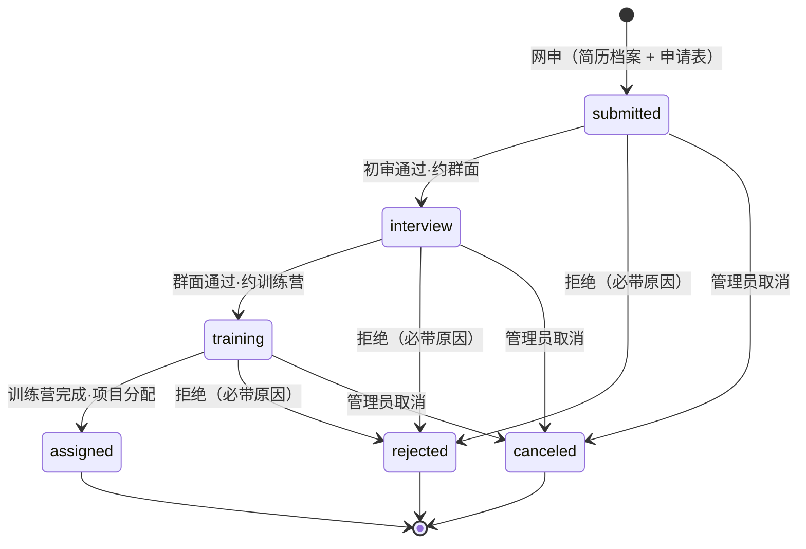
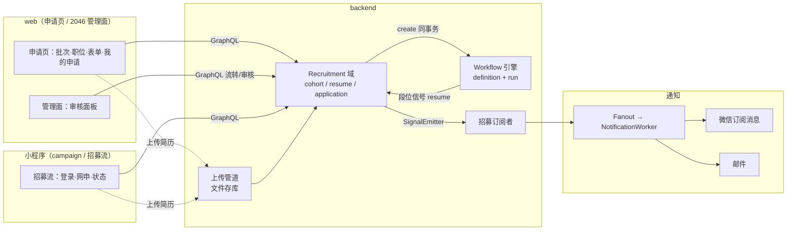

## Goal Capsule

- **Objective:** 2026.10.24 campaign 全量上线。公众经网站（codingirlsclub.com）或小程序进入 Hacker Start 1024 宣传页，沿三条路径行动——参加（→ `/initiatives` 场次页）、成为志愿者（→ 志愿者招募体系，从网申到项目分配全程走系统）、品牌合作（→ `partners@codingirlsclub.com`）。
- **Means:** PPT 视觉复刻的静态宣传页（zh-CN + en、移动端适配）+ 批次化三职位招募体系（申请状态机骑既有 Workflow 引擎〔KTD1〕、简历走最小上传管道〔KTD3〕、职位映射既有 workspace 角色〔KTD4〕、段位通知走微信订阅消息全链〔KTD6〕）+ 小程序端原生页面（campaign 页与招募流，只中文，视觉参照现有小程序）。
- **Product authority:** 本 plan 的产品决策全部来自 2026-09-17/18 与创始人的 brainstorm + grill 对话（Key Decisions 带 session-settled 标注）；内容底稿为《Hacker Start 1024 专场合作方案》（11 页定稿）；招募流程模型参照 ABC 美好社会咨询社（创始人第一手申请经历）；权限结论以代码取证为准。
- **Open blockers:** 均为素材与运营输入类——不阻塞规划，阻塞上线（清单见 Dependencies / Outstanding Questions）。

---

## Product Contract

### Summary

一页三入口的 Hacker Start 1024 对外宣传页（独立静态路由、zh-CN + en 双语、按合作方案 PPT 视觉复刻、遵守方案口径纪律、移动端适配），一套本期完整实现的志愿者招募体系（按批次招募、三职位〔场次主理人 Event Moderator + 教程研究员 Tutor + 活动教练 Coach〕、两步网申〔先完善简历档案、再申请项目〕、网申→面试→训练营→项目分配四段流程、每段邮件+微信小程序双通道通知、主理人分配时复用 EventModerator 指派上岗、场次由 2046 workspace Owner/Admin 预建录入发布），以及小程序端原生页面（campaign 页 + 完整招募流，只中文，视觉参照现有小程序）。

### Problem Frame

Campaign 定于 2026.10.24 全国启动，但公开面目前没有任何承载：`/initiatives` 列表页因后端无 Initiative 数据而常年空态，BD 方案的 11 页叙事只存在于线下 PDF/PPT；志愿者招募既无入口也无流程，40+ 城网络的扩张全靠人工对接；品牌触达只靠外发文件；小程序端也没有 campaign 入口。十周年（2016→2026，2¹⁰=1,024 场）是这轮 campaign 的叙事支点，需要一个能把它讲出来的页面；40+ 城滚动开班的组织能力，需要一个像样的招募体系来供给——网站与小程序两端都要能到达。

### Key Decisions

- **三入口单页（我要参加 / 成为志愿者 / 品牌合作）。** (session-settled: user-directed — chosen over 纯品牌页/双入口/四入口: 一页承载 campaign 全貌，入口经对话迭代定为三个)
- **志愿者体系统一入口，三职位，职位为枚举不建表。** hero 入口叫「成为志愿者」；申请页职位列表第一项 = 场次主理人（featured）。职位为**代码枚举（event_moderator | tutor | coach）+ i18n 文案（zh+en），不建职位表**（ER v2 裁决：文案内容中英两套走消息文件）。场次主理人只是志愿者体系里的一个职位，不等于组织者/工作台拥有者。(session-settled: user-directed)
- **三个职位：场次主理人（Event Moderator，slug `event_moderator`，对齐既有 EventModerator 机制）、教程研究员（Tutor）、活动教练（Coach）。** 活动教练 = 线下现场辅助陪跑（巡场答疑），学员自学为主、不授课——与 BD 方案「教学模式收敛到 Agent 自适应学习」口径不冲突；对应方案中 128 人志愿者体系的现场角色。中英文名创始人 2026-09-18 定名（旧称 Chapter Host/教程贡献者/场次教练弃用）。(session-settled: user-directed)
- **「我们是谁」标题定稿：「十年社区，可以被查证的十年」。** 「国家级背书」暗示机构担保关系、名不副实；新标题与「条条挂真链接」互证。英文区块标签 Recognition（弃 testimonial——语义是用户证言，与证据墙错位）。BD 落盘文档 P4 旧标题是否同步由创始人另行决定（OQ6）。(session-settled: user-directed)
- **主理人职责含媒体素材与社媒动员。** 现场收集照片/视频，发动参与者带 #hackerstart1024 发社媒。(session-settled: user-directed)
- **训练营 = 站内一门课程，页面仅简单说明。** 复用 course 系统；入选者由运营手动拉进对应课程，系统只记录段位流转，不做自动开课。(session-settled: user-directed)
- **招募按批次组织；人线与事线解耦。** 批次（cohort）含名称、申请截止、执行周期、状态徽章；**同一时间至多一个 open 批次**（先关旧批才开新批）；批次与 Initiative/Event 无外键，靠「本 campaign 唯一 Initiative」约定松耦合。(session-settled: user-directed — 参照 ABC 咨询季)
- **两段式网申：先完善简历档案，再申请项目。** 简历档案一人一份、跨批复用、可更新。(session-settled: user-directed — ABC 验证过的模式)
- **四段流程：网申 → 面试 → 训练营 → 项目分配。** 面试为线上群面（微信群线下协调，系统只记阶段与结果）；训练营必修；每段结果邮件+微信小程序双通道通知——**小程序订阅消息需用户授权，邮件是唯一保底通道**（申请完成页与我的申请页放订阅引导）。(session-settled: user-directed；通道裁决为邮件+小程序，非短信)
- **同一批次限申一个职位；rejected/canceled 后本批结束，下一批可换职位再申；批次关闭不影响在途申请走完。** (session-settled: user-directed — ABC 同款约束)
- **无申请人自撤流程；`canceled` 由 2046 workspace 管理员操作**（本人放弃等场景，备注选填）。(session-settled: user-directed)
- **申请要求登录后提交。** applicant = 当前用户（小程序端走既有手机号登录，账号同源）。(session-settled: user-directed)
- **项目分配 = 邀请加入 2046 workspace（既有主台，不新建 workspace）+ 主理人指派为场次 EventModerator；场次由 2046 Owner/Admin 预建 draft、录入信息并发布。** 取证结论（`backend/lib/cgc_2046/events/event.ex:1100-1102`）：Event 的 create/update/launch 唯一授权是 Workspace Owner/Admin，无 moderator 分支，普通成员连 draft 都不可读——主理人的系统内权限 = 本场核销（check-in）+ 名单展示，场次信息由主理人线下提供、运营录入发布；**不做 RBAC 扩权**。Tutor 分配记录课程任务，不进 EventModerator。(session-settled: user-directed — grill Q3/Q11)
- **审核权限 = Event 所在 workspace（2046）的 Owner/Admin；审核面板挂 2046 workspace 管理面**，platform_admin 保留穿透能力。(session-settled: user-directed — 所有倡导活动都在 2046 台)
- **独立静态宣传页，与 Initiative 系统解耦；批次状态不在宣传页写死**——批次卡只写「首批招募进行中」，真实状态由申请页动态承载。(session-settled: user-directed)
- **zh-CN 与 en 双语同步上线**（网站端）；小程序端只中文。en 口径纪律句与职位描述 en 文案为人工定稿。(session-settled: user-directed)
- **视觉按合作方案 PPT/PDF 复刻（方向 D）**，色板取自 pptx slide XML 精确值（#B0406B / #C9497D / #2B2B33 / #857F8F / #FAEDF2 / #E7F5F3 / #2FA69D）；小程序端视觉参照现有小程序（橙 #ea5504 / 浅灰底 / 白卡圆角 / 渐变 hero）。可运行原型见 Dependencies。(session-settled: user-directed)
- **品牌联系方式用通用邮箱 `partners@codingirlsclub.com`，个人信息不上页。** (session-settled: user-directed)
- **参与者 CTA 指向 `/initiatives`。** (session-settled: user-directed)
- **时间线首期口径 = 64 场**（2026.10.24 启动 → 首期 64 场 → 批次滚动至 1,024 场）；方案 P8「首期 20 场验收后续批」保留于品牌段交付承诺语境。(session-settled: user-directed — 创始人裁决)
- **场地模式：免费合作场地优先；咖啡馆场次由学员现场消费支持；无场地预算。** 志愿者零出资零抽成。(session-settled: user-directed)
- **志愿者叙事用 Give and Take 框架**（Grant 金句 + 「给出一个周末，收获一座城市」）。(session-settled: user-directed)
- **教程研究员投入口径：一门课程预估 5-10 小时。** (session-settled: user-directed)
- **微信分享 meta 进需求**（title / description / 分享卡图）。(session-settled: user-directed)
- **不做分期兜底，10.24 全量上线。** (session-settled: user-directed)
- **三层控制分离：Workflow 管流程、Policy 管边界、Permission 管风险。** 计划三层全覆盖（Implementation Units 按此分工）；**不新增任何 RBAC 角色**——职位映射既有角色（详见 KTD4/KTD5）。(session-settled: user-directed — 创始人 2026-09-18 提出并要求覆盖)
- **培训共备的线下部分不进系统**；群面约时、微信群协调均为线下运营动作。

### Actors

- A1. 游客/潜在参与者：浏览宣传页（网站或小程序），沿「我要参加」到 `/initiatives` 查看并报名场次。
- A2. 志愿者申请人（登录用户）：浏览职位与流程，两步网申（网站或小程序），全程查状态；职位为场次主理人、教程研究员或活动教练。
- A3. 招募审核方（2046 workspace 的 Owner/Admin）：在审核面板处理申请（段位流转、取消、拒绝原因、简历查看、批次管理、项目分配），并负责场次的预建、录入与发布；platform_admin 保留穿透能力。
- A4. 品牌方（站外）：经品牌段 mailto 发起合作，48 小时内人工回复。
- A5. campaign 运营（A3 的运营分工面）：上线前置数据准备（Initiative、批次、预建场次、训练营课程），线下组织群面与训练营。

### Requirements

**宣传页（网站）**

- R1. 新增公开路由 `/hackerstart-1024`，zh-CN 无前缀、en 走 `/en` 前缀，页面为静态文案（代码 + i18n 消息维护），不依赖后端接口。
- R2. 页面按定稿信息架构组织：Hero（三 CTA + 十周年刻度条「2016 · 成立 —— 第 10 年 —— 2026 · 2¹⁰＝1,024 场」）→ 为什么是现在 → 我要参加（15/120/30 分钟节奏卡 + 班型事实行 + CTA）→ 参与者 FAQ → 成为志愿者专区（三职位小卡 + 批次卡〔只写「首批招募进行中」，不写死日期——真实状态由申请页承载〕+ 支持一行；深读内容在申请页）→ 时间线（三节点）→ 我们是谁（十年数字带 + 证据链接墙 + 杠杆句）→ 品牌专场合作（一句话 + 16×64=1,024 公式行 + 权益四件 + 示例命名胶囊 + 交付能力三列 + 六层价值阶梯 + 开放共创议题 + 合作结构胶囊 + CTA）→ 留存位（公众号关注）→ Footer（含志愿者回链）。
- R3. 三入口落点：「我要参加」→ `/initiatives`；「成为志愿者」→ 志愿者申请页（R10）；「品牌合作」→ `mailto:partners@codingirlsclub.com`。
- R4. 口径纪律：不出现任何厂商名（含 OpenClacky）；不出现价格；历史累计（2016-2025）与本轮计划（2026.10-2027）分开标注、永不混用；关键数字沿 2 的幂标注（2⁰ 启动日 / 2³ / 2⁴ / 2⁵ / 2⁶ / 2⁷ / 2¹⁰），幂标记全站统一样式（等宽 + 玫红 + 缩小），与主数字视觉分离。
- R5. 证据墙挂真实外链：ICSE CHASE 2021 论文、UNDP 科技与慈善报告（2018）、UNDP China LinkedIn #科技遇见她# 帖、中国日报 2017 报道、环球时报 Ladies who code、CGTN 报道、微信公众号学员故事一篇（链接已挂、标题待补）；共青团中央「伙伴计划」与果壳网保留文字不挂链。
- R6. 页面声明 canonical/hreflang（#239 契约）、进入 sitemap，并配置微信分享 meta（title / description / 分享卡图——十周年主视觉延展）。
- R7. zh-CN 与 en 同步上线；en 口径纪律句与职位描述 en 文案为人工定稿，非机翻直出。

**志愿者招募体系（后端 + 网站申请页 + 2046 管理面）**

- R8. 新增志愿者招募领域模型：招募批次（recruitment_cohort：名称、申请截止时间、执行周期、状态 draft|open|closed；**同一时间至多一个 open**）；志愿者申请（application = 申请人 + 批次 + 职位枚举〔event_moderator | tutor | coach，职位不建表，职责/要求文案走 i18n zh+en〕+ 申请城市〔Tutor 可远程〕+ 如何得知我们 + 是否有内部推荐人 + 留言）。约束：同一批次同一申请人限一份申请；rejected/canceled 后本批结束、下一批可换职位再申；批次关闭不影响在途申请走完；入职后职位不互斥（跨职位参与按场次/任务分别指派；已上岗者再申请初审豁免、新职位训练营必修）。
- R9. 简历档案：登录用户建立一人一份档案（姓名 + **联系邮箱**〔必填；账号已有邮箱时预填只读，手机号建号必须填写——这是 R14 邮件保底通道的收件地址〕+ 简历文件 PDF/Word + 每周可投入小时数 + 技能多选），**文件经最小上传管道保存至数据库**（KTD3）；申请时关联引用，跨批复用、可更新；档案仅本人与招募审核方（A3）可见，遵循 PIPL，不用于招募以外的用途。
- R10. 志愿者申请页（公开落地页）：单页叙事——当前批次信息（**动态读取 open 批次**：名称/状态徽章/截止/执行周期；批次区三态：加载中〔骨架占位，不提前渲染空态文案〕/ 读取失败〔失败文案 + 重试，入口收起逻辑不生效〕/ 无 open 批次〔显示「当前无开放批次，下一批开放时间待定」并收起申请入口，页面其余叙事照常〕——与宣传页「首批招募进行中」的静态文案解耦，真实状态以此页为准）、三职位列表与职位描述（i18n 文案）、featured 职位深读（主理人职责三段 + 四项支持）、四段流程说明、按职位分组的 FAQ（共同关心 + 各职位小节）、两步表单入口、状态说明；未登录访问引导登录（**带回跳**：`/login?next=<当前申请页路径>`，照公开面既有写法），登录后提交。
- R11. 两步网申：第 1 步「完善简历」（**含采集告知与显式勾选同意台阶**——链既有《隐私政策》/《个人信息处理规则》，未勾选不得上传与提交，遵循 PIPL；上传/更新简历档案 + 姓名 + 联系邮箱 + 每周可投入 + 技能多选）；第 2 步「申请项目」（批次默认当前唯一 open 批次、职位单选、城市〔Tutor 可远程〕、如何得知我们、是否有内部推荐人、留言选填）。过往申请人可更新简历后直接申请。
- R12. 申请状态机：`submitted → interview → training → assigned`，任一审核段可转 `rejected`（必带原因文本）；另设 `canceled`（由 2046 workspace 管理员操作，备注选填，覆盖本人主动放弃等场景；无申请人自撤流程）；`assigned` = 项目分配完成。训练营段依托站内 course 系统：**入选者由运营建邀请码批次、本人凭码自助报名进入训练营课程**（不新增代报名动作、不改既有报名权限），系统记录段位流转与结果，不做自动开课。

- R13. 招募审核面板：挂载于 2046 workspace 管理面，**仅该台 Owner/Admin 可用**（platform_admin 穿透管理）；按批次/职位查看申请列表与详情（含简历档案）、段位流转、拒绝原因录入、取消操作、批次管理（创建/开放/关闭，受唯一 open 约束）、项目分配（选场次 + 邀请入台 + 指派）、志愿者角色撤销（离场撤权）；申请人可在站内查看自己的申请与当前段位。
- R14. 阶段通知：提交确认、初审结果、群面结果、训练营预约与结果、分配结果——每段邮件 + 微信小程序双通道（复用站内通知体系触达小程序；短信为可选补充）。**实现约束：小程序订阅消息需用户授权，且一次授权仅换一条配额（五段通知各需一次授权，见 R21）；邮件是唯一保底通道，发往档案联系邮箱（R9）**；订阅引导见 R21。**阶段通知映射表**（U4 按行落地）：网申提交 → 提交确认；初审通过流转 → 面试安排（含群面时间与入群方式）；群面通过流转 → 训练营预约（含排期与课程入口）；训练营完成流转 → 分配结果（含分配到的场次/课程任务）；任一拒绝 → 拒绝通知（含原因）；取消 → 取消通知。每行对应一个订阅场景。
- R15. 项目分配动作：**按职位映射既有 workspace 角色并邀请申请人加入 2046 workspace**（场次主理人与活动教练 → `volunteer` 角色；教程研究员 → `tutor` 角色——该授权为**工作台级**，覆盖该台全部课程草稿与教研面，非仅分配课程；**不新增 RBAC 角色**，KTD4）；主理人指派为对应预建场次（R16）的 EventModerator（复用 `EventModerator.assign` 及成员前提校验），**活动教练的核销指派按需由运营操作**（KTD5）；Tutor → 记录课程任务分配结果（application 上记录，不建任务实体）。分配后场次信息由 Owner/Admin 录入并发布；**志愿者退出时由 2046 Owner/Admin 撤销其 workspace 角色（离场撤权）**。
- R16. 上线前置检查单（全部完成后页面与申请流才可对外）：创建并发布 Hacker Start 1024 Initiative（slug `hackerstart1024`、status open、hashtag #hackerstart1024、规则 deposit 69 / age 18+ / min 8 / deadline_rule（值规划时定））；2046 workspace 即分配目标台（既有，无需创建）；预建首批城市 draft 场次并挂载 Initiative（城市清单由运营提供）；**首批城市场次录入信息并发布到可报名**（草稿对访客不可见，不发布则 F1 主路径仍是空列表）；第 1 批招募批次就绪（唯一 open）；训练营课程在 course 系统就绪 + 邀请码批次已创建。
- R17. 时间线呈现三节点：2026.10.24 启动 → 首期 64 场 → 批次滚动至 1,024 场。
- R18. 移动端适配：≤640px 断点下单列布局、序号徽章与标题同行、触屏间距（手机为主要传播场景）。

**小程序端（Taro 原生，只中文）**

- R19. 小程序 campaign 页（**微信端专属**，视觉按 weapp-d 原型，参照现有小程序样式）：hero（十周年 + 关键数字 + 幂标记）、三入口卡、时间线、可查证十年浓缩段；入口 = 「发现」页顶部 campaign 渐变入口卡（**按运行平台分流渲染**——裁剪端〔抖音/小红书〕不显示，含「微信」字样的文案按既有零导流先例做端侧替换；不动现有 4 Tab 结构）。
- R20. 小程序招募流（**微信端专属**，视觉按 weapp-host 原型）：批次卡（动态状态）、三职位与职位描述、四段流程、两步网申（简历经微信文件选择上传至 R9 档案；登录走小程序既有手机号登录，applicant 同源）、我的申请状态列表；审核面板不进小程序。
- R21. 小程序通知引导：**授权触点前移到第 2 步「提交申请」按钮**（先 `requestSubscribeMessage` 一次后逐个 grant 再提交，镜像报名流 submitAfterConsent——一次授权仅换一条配额，后置触点拿不到首段通知）；五段通知各对应一个订阅场景，场景映射表落进小程序订阅域；申请完成页与我的申请页保留为拒绝后的补授权位；未授权时邮件为唯一可达通道，页面文案不承诺小程序通知必达。

### Key Flows

- F1. 参与者路径
  - **Trigger:** 游客经传播进入宣传页（网站或小程序入口卡）。
  - **Actors:** A1。
  - **Steps:** 选「我要参加」→ 阅读节奏卡与 FAQ → CTA 跳 `/initiatives` → 按城市查看场次 → 既有报名流（69 元押金）。
  - **Outcome:** 参与者找到城市场次；不成班走既有退款。**Covers R2, R3, R16.**
- F2. 志愿者路径
  - **Trigger:** 用户在宣传页/小程序选「成为志愿者」。
  - **Actors:** A2, A3, A5。
  - **Steps:** 阅读职位与流程 → 申请页（未登录先登录）→ 第 1 步完善简历档案 → 第 2 步提交申请 → 确认通知 → 初审通过约群面（微信群协调）→ 群面通过约训练营 → 运营拉入课程、训练营完成 → 项目分配：邀请入 2046 台 + 主理人指派到预建 draft 场次 / Tutor 记录课程任务 → Owner/Admin 录入场次信息并发布 → 每段邮件+小程序通知，状态全程站内可查。
  - **Outcome:** 志愿者按职位上岗；场次发布后出现在 `/initiatives`。**Covers R8-R15.**
- F3. 品牌路径
  - **Trigger:** 品牌方经外发物料或传播进入宣传页。
  - **Actors:** A4。
  - **Steps:** 阅读品牌专场段 → mailto partners@ → 48 小时内人工回复。
  - **Outcome:** 线索进邮箱，页面不留个人信息。**Covers R3, R4.**

### Acceptance Examples

- AE1. **Covers R10.** 未登录访问申请页 → 登录引导而非表单；登录后可进入两步网申。
- AE2. **Covers R8, R11.** 同一用户同一批次已有申请，再提交第二个职位 → 被拒（单职位约束提示）；下一批申请其他职位 → 成功。
- AE3. **Covers R12, R13, R14.** 置 `rejected` 未填原因 → 保存被拒；填原因后保存 → 申请人站内可见并收到含原因的邮件+小程序通知。
- AE4. **Covers R12, R15.** 主理人申请到 `assigned` → 申请人是 2046 workspace 成员且被指派为预建场次的 EventModerator；系统未创建新 workspace；场次在 Owner/Admin 发布前不出现在公开面。
- AE5. **Covers R9, R11.** 第 1 批完善过简历档案，第 2 批再申请 → 无需重传；档案对非审核方不可见。
- AE6. **Covers R3, R16.** R16 前置完成前宣传页 CTA 落地为空列表（上线检查未通过）；完成后显示 Hacker Start 1024 卡片，且**匿名访客可在 `/initiatives` 看到并进入至少一个可报名场次**。
- AE7. **Covers R4, R7.** en 页面历史累计/本轮计划标注成对出现、不混标。
- AE8. **Covers R12, R13.** 管理员将申请置为 `canceled` → 申请人站内可见；`canceled` 无必填原因（区别于 rejected）。
- AE9. **Covers R8.** 已有一个 open 批次时再开放第二个 → 被拒（唯一 open 约束）；关闭旧批后开放成功。
- AE10. **Covers R14, R21.** 用户未在小程序授权订阅消息 → 提交与阶段通知仅邮件送达（发往 R9 档案联系邮箱），页面不报错、不承诺小程序通知。
- AE11. **Covers R8.** 已 `assigned` 志愿者下一批申请新职位 → 初审豁免直接进入面试段，但新职位训练营段必修。
- AE12. **Covers R10.** 唯一 open 批次被关闭且无新批次开放时访问申请页 → 批次区显示「当前无开放批次」且申请入口收起；下一批开放后自动恢复。

### How This Work Fits Together

<!-- ce-section: work-relationships -->

本 plan 覆盖 Hacker Start 1024 campaign 的公开宣传页、志愿者招募体系与小程序端页面（合并交付）。周边关系的当前理解（非承诺路线图）：

- 场次运营（报名/押金/核销）— **Depends on** 既有 Initiative/Event 系统，本 plan 仅做 R16 前置数据创建与预建场次，不改动其域。
- 志愿者上岗后的运营 — **Depends on** 既有 workspace/Event 协作机制，本 plan 止于指派与发布。
- 主理人工作台（为主理人开 Event 编辑/发布授权）— **Still to decide**；本期不做 RBAC 扩权（取证结论见 Key Decisions），未来独立工作。
- 更多职位的开放招募 — **Still to decide**；职位枚举预留扩展。
- 志愿者培训与陪跑的线上化 — **Can proceed independently of** 本 plan。
- 厂商定制版物料（如 OpenClacky 插槽稿）— **Can proceed independently of** 本 plan，属方案文档侧交付物。

### Scope Boundaries

**Deferred for later**

- 主理人工作台（为主理人开放 Event 编辑/发布授权的 RBAC 扩权）——v1 由 Owner/Admin 代操作。
- 更多职位的开放招募（职位枚举预留扩展）。
- 群面约时、训练营排期的系统化（微信群线下协调不进系统）。
- 训练营爽约的处置细则（本期不考虑，运营线下酌情）。
- 申请表单的免登录公开提交模式。
- 宣传页接入实时数据（报名进度、城市覆盖）——等 Initiative 真实数据积累后二期。
- 简历文件的保留期限策略与自助删除入口（PIPL 合规细化，见 OQ4）。

**Outside this product's identity**

- 价格、收款节奏、加购项等商务条款的对外展示（方案纪律：成品不展示价格）。
- 厂商定制版页面（插槽替换稿属方案文档侧，不进代码仓）。
- 报名功能本身（`/events/[slug]` 报名流是既有域，本 plan 只互链）。

### Dependencies / Assumptions

- `partners@codingirlsclub.com` 邮箱真实存在、有人处理。
- 微信订阅消息需在小程序后台申请模板，且用户授权后才可触达（R14/R21 的机制前提）；邮件为唯一保底。
- 素材与文案依赖（上线前收齐）：公众号二维码；FAQ「自带设备」运营口径；志愿者权益文案定稿；第 1 批批次日期定稿（页面草案 2026.10.10 23:59）；**Initiative 报名截止倒推规则取值（hours_before_start）与裁决人（OQ7，检查单第 1/3 步前置）**；训练营课程内容（运营侧）；首批预建城市清单（运营提供）；学员故事标题与主人公背景；微信分享卡图；职位描述 en 文案翻译（与 en 口径句同人把关）。
- EventModerator 机制按现状复用：成员前提（先邀请入台再指派）、成员离台级联撤销指派——既有不变量，不为本需求修改。
- 视觉与 IA 的可运行原型在 worktree `.worktrees/cgc_2046/hackerstart-1024-landing`（分支 `sundevilyang/hackerstart-1024-landing`）：`variant-d`（宣传页）、`host-apply`（申请页，实现时更名志愿者路由）、`mobile/page.tsx`（390px 手机壳预览）、`weapp-d` / `weapp-host` + `weapp.css`（小程序视觉版，token 取自 `miniprogram/src` 真实样式）、`hs1024.css`（PPT 色板 + ≤640px 响应式块）。原型目录本身不合并。

### Success Criteria

- 三条路径端到端走通（F1-F3 各一次真实穿越；志愿者路径含一次 rejected 与一次 assigned 分支），AE1-AE12 全部断言通过。
- 招募流水线一次真实走通：网申 → 面试 → 训练营 → 分配，每段通知（邮件必达；小程序通知在已授权前提下送达），申请人状态站内可见。
- 小程序端：discover 入口卡 → campaign 页 → 完整申请流 → 我的申请，全程 Taro 原生走通一次。
- 口径纪律全页可过检：grep 无厂商名、无价格；历史累计/本轮计划标注成对出现；en 为人工译文；页面无个人信息。
- 移动端可用：≤640px 视口下两页单列布局、无横向滚动、序号徽章与标题同行（R18）。
- 上线检查单（R16 + 素材依赖）全部勾选后页面与申请流才对外可见。

### Outstanding Questions

- OQ1. **Deferred to Planning** — FAQ「需要自带电脑吗」的运营口径（当前草案：建议自带，以场次报名页为准）。
- OQ2. **Deferred to Planning** — 志愿者权益定稿（场次激励/免费名额/证书等），同时作为审核标准输入；页面为「共创中」占位。
- OQ3. **Deferred to Planning** — en 口径纪律句与职位 en 文案的定稿人；公众号二维码素材。
- OQ4. **Deferred to Planning** — 简历档案的保留期限策略与 PIPL 删除请求处理流程（存储位置已定为数据库存库，见 KTD3）。
- OQ5. **Deferred to Planning** — 「学员的故事」微信文章的标题与主人公背景（页面为占位，链接已挂）。
- OQ6. **Deferred to Planning** — BD 落盘文档 P4「国家级背书」旧标题是否随页面同步修改（文档在仓外用户仓库）。
- OQ7. **Deferred to Planning** — Hacker Start 1024 Initiative 的 `deadline_rule`（报名截止 = 场次开始前 N 小时）取值与裁决人；**须在 U11 检查单第 1/3 步（创建 Initiative、预建场次挂载）之前定案**（缺值即挂载失败）。

### Sources / Research

- 内容底稿：《Hacker Start 1024 专场合作方案》11 页定稿 + 同源 PPT/PDF（用户仓库 `sundevilyang/hackerstart_1024`，仓外文件 `docs/10-专场合作方案-落盘.md`、`程序媛汇-Hacker Start 1024 专场合作方案.pptx/.pdf`）。
- 招募流程模型：ABC 美好社会咨询社志愿者招募——创始人第一手申请经历（批次化、两步网申、职位+职位描述、群面、训练营、项目分配，附小程序截图）+ [ABC 官网志愿者页](https://www.theabconline.org/volunteer)。
- 可运行原型（视觉/IA 参照）：worktree `.worktrees/cgc_2046/hackerstart-1024-landing/web/app/[locale]/prototype/hackerstart-1024/`——`variant-d`（宣传页）、`host-apply`（申请页）、`mobile`（390px 手机壳预览）、`weapp-d` / `weapp-host`（小程序视觉版）+ `hs1024.css`（PPT 色板 + ≤640px 响应式）与 `weapp.css`（小程序 token，取自 `miniprogram/src`）。
- 结构图：`docs/plans/2026-09-18-hackerstart1024-diagrams/`——`er-map.puml/.png`（实体关系 v2：3 张新表 + 既有复用，人线/事线解耦，position 走枚举+i18n）、`user-journey.puml/.png`（四条旅程）。
- 权限取证（grill Q11）：`backend/lib/cgc_2046/events/event.ex:1100-1102`（Event create/update/launch 唯一授权 Workspace Owner/Admin，无 moderator 分支）；`offering/actor_reads_offering.ex:23-30`（成员不可读 draft）；`admission/attendance.ex:177-180`（主理人仅有 check-in）；`initiatives/rule_inheritance.ex:335-363`（挂载发布门）。
- 现有代码参考：`web/components/initiative-index.tsx` / `initiative-detail.tsx`；`web/app/[locale]/apply/page.tsx`；`backend/lib/cgc_2046/events/moderators.ex`、`moderator_membership_validation.ex`；`backend/lib/cgc_2046/notifications/`；`miniprogram/src/app.config.ts`（4 Tab）与 `miniprogram/src/pages/discover/index.module.css`（小程序视觉 token）；`web/app/sitemap.ts`。
- 背书外链（已核实）：论文 `https://cmustrudel.github.io/papers/chase21code_camps.pdf`；UNDP 报告 `https://www.undp.org/zh/china/publications/kejiyucishankechixufazhanxingdongbaogao`；UNDP LinkedIn `https://www.linkedin.com/posts/undp-china_herstory-womenintech-科技遇见她-activity-6787232105513525248-w6vp`；中国日报 `https://www.chinadaily.com.cn/china/2017-01/13/content_27943492.htm`；环球时报 `https://www.globaltimes.cn/content/954372.shtml`；CGTN `https://news.cgtn.com/news/3d49544e31516a4d/share_p.html`；学员故事 `https://mp.weixin.qq.com/s/IfRSC8sA7THv-YPBa4_XAg`（标题待补）。

---

## Planning Contract

**Product Contract preservation:** 仅两处意义保持的明确化，无范围变化——R9 补「文件经最小上传管道保存至数据库」（存储实现，原条目未指定）；R15 补「按职位映射既有 workspace 角色」与「教练核销按需指派」（原条目只说「邀请加入成员」，未指定角色）。其余 Product Contract 逐字保留。

### Key Technical Decisions

- KTD1. **申请状态机骑既有 Workflow 引擎（申请行是状态权威，WorkflowRun 是执行镜像）。** 申请 create 的 before_action 同事务实例化并启动 run（镜像 `SpeakerInvitationInstantiator`）；四段门控为四个人工信号门控；段位推进 = 资源 update action 的 `after_transaction` 对 run `resume_signal`（best-effort，申请行才是 checkpoint）；拒绝/取消 = run `fail`/`cancel`。业务与引擎经 Signal 解耦：订阅者只发通知、不回写状态。**v1 只用人工门控**，自动步骤（如课程完成信号自动推进）留二期。Governs R12。(session-settled: user-directed — chosen over 纯状态机: 白拿审计链/幂等/挂起恢复，未来自动化只需加订阅)
- KTD2. **三资源的租户与 Policy 边界。** `recruitment_cohort` / `resume_profiles` / `volunteer_applications` 均带 `workspace_id` + `multitenancy global?(true)`（对齐 Enrollment/SpeakerInvitation 主流模式），policy 复用 `WorkspaceActorIsOwnerOrAdmin` 作管理面边界。读写面：cohort 匿名可读（open 批次），管理写限 Owner/Admin ∪ platform_admin；resume 仅本人 ∪ Owner/Admin ∪ platform_admin 可读、仅本人可写（PIPL 边界）；application 本人 ∪ Owner/Admin ∪ platform_admin 可读、create 限本人（unique 约束限同批一份）、段位流转限 Owner/Admin ∪ platform_admin。GraphQL 入口 `workspace_id` 走显式 argument（#104 惯例）。Governs R8, R9, R13。(session-settled: user-directed — 三层控制设计要求)
- KTD3. **简历走最小上传管道，文件存数据库。** 全仓无任何文件上传机制，这是从零建的第一块：单一上传入口（GraphQL 上传 mutation，**base64-over-JSON 编码**——走现有 GraphQL 接线、零新依赖；multipart 需要路由层改造，不在本期）+ 文件以数据库大字段存储 + 类型（PDF/Word）与大小上限校验（**原始文件 ≤5MB**，为 base64 约 33% 膨胀留余量；**endpoint 全局 8MB 请求体闸门（CachingBodyReader）不得抬高**——它是公开端点的唯一总量防线）。不做应用层加密（依赖数据库访问控制 + KTD2 的 policy 边界兜底）；保留期限策略留 OQ4。Governs R9。(session-settled: user-directed — chosen over 外链字段/对象存储管道: 满足上传体验且零新依赖)
- KTD4. **职位 → 既有 workspace 角色映射，不新增 RBAC 角色。** 场次主理人与活动教练 → `volunteer`；教程研究员 → `tutor`（`Rbac.staff?` 已授权 `save_course_content` 等教研面，正是写教程所需；**该授权为工作台级**——覆盖该台全部课程内容面，非单课程；退出时由运营撤权，见 R15）。职位枚举 `tutor` 与 RBAC 角色 `tutor` 同名两个概念（招募域职位 vs 权限域角色），代码注释区分。Governs R15。(session-settled: user-directed — chosen over 新建招募角色: 能力面恰好对齐，零权限扩散)
- KTD5. **事件级核销指派策略：主理人每场必给（EventModerator.assign），活动教练按需由运营指派。** 教练不默认获得核销权；现场需要时走同一指派机制（零新代码）。Governs R15。(session-settled: user-directed — chosen over 默认给/始终不给: 核销权最小化又不堵路)
- KTD6. **通知走既有微信订阅消息全链 + 邮件保底。** 段位信号 → 订阅者（`consumer_key` + `:claim_first` 幂等）→ `Notifications.Fanout.deliver` → `NotificationWorker` → `Service.render(:wechat, …)` 订阅消息；邮件走 Swoosh 内联 HTML（镜像 `speaker_invitation_email.ex` 的尽力而为模式）。新增通知 = worker 契约表加条目 + service 渲染子句 + config 模板 ID 三项。Governs R14, R21。
- KTD7. **教程产出落站内课程内容系统。** 教程研究员经 tutor 角色的既有教研面（`save_course_content` 等）把课程写成站内可复用内容，全国场次直接复用；不建外部仓同步。Governs R8, R15。(session-settled: user-directed — chosen over 外部仓: 复用零额外基建)
- KTD8. **审核面板复用 workspace 级面板模式。** 挂 2046 台管理面（`w/[slug]` 系），列表/行内操作镜像 `admin/applications` 面板交互，授权走 KTD2 的 WorkspaceActorIsOwnerOrAdmin（非 platform_admin 专属）。Governs R13。(session-settled: user-directed — 所有倡导活动都在 2046 台)

### High-Level Technical Design

招募体系的组件与信号流（状态机见 R12 的状态图）：

信号时序（一次段位推进）：资源 update action（Owner/Admin 或系统）→ 同事务写 `SignalEmitter`（outbox）→ `after_transaction` 对 run `resume_signal` → run 从 `waiting` 推进到下一门控或终态 → `SignalPublishWorker` 投递信号 → 招募订阅者（幂等 claim）→ `Fanout.deliver` → 邮件 + 小程序通知。

### Sequencing

四个阶段，按依赖推进：**A 后端地基**（U1 → U2, U3 → U4, U5）→ **B web**（U6 可与 A 并行；U7, U8 依赖 U5）→ **C 小程序**（U9 可并行；U10 依赖 U2+U5）→ **D 上线**（U11 依赖全部）。U6 与 U9 为纯前端，可在 A 进行中并行启动。

### Implementation Constraints

- CI 门禁链（每单元完成时同步）：新 Ash 资源需手写 migration + `priv/resource_snapshots` 快照（`mix ash_postgres.generate_migrations --check`）；SDL 由编译钩子自动生成，提交 `priv/graphql/schema.graphql`；小程序 `pnpm codegen` 提交 `src/api/generated`；双语 messages 同步（zh-CN 与 en 键集一致）。
- 权限不变量：不为本需求修改任何既有 RBAC 资源与 policy；主理人权限取证结论（无 Event 编辑/发布/读 draft）是既有行为，不加测试之外的改动。
- 时间字段（`apply_deadline_at` 等）UTC 存储、展示走既有格式化路径；断言在 `TZ=UTC` 与 `TZ=Asia/Shanghai` 下各跑一次。

---

## Implementation Units

### Unit Index

| U-ID | 标题 | 主要文件 | 依赖 |
|---|---|---|---|
| U1 | 招募领域三资源与迁移 | `backend/lib/cgc_2046/recruitment*`、migration、snapshots | — |
| U2 | 简历上传管道 | `backend/lib/cgc_2046/recruitment/upload*` | U1 |
| U3 | 申请 workflow 集成 | `backend/lib/cgc_2046/recruitment/`、`workflows/` 接入 | U1 |
| U4 | 段位通知 | `backend/lib/cgc_2046/recruitment/subscriber.ex`、`notifications/` | U3 |
| U5 | GraphQL 契约与门禁同步 | `backend/lib/cgc_2046_web/graphql_schema.ex`、SDL、codegen | U1, U3 |
| U6 | 宣传页（web） | `web/app/[locale]/hackerstart-1024/`、messages | — |
| U7 | 志愿者申请页（web） | `web/app/[locale]/hackerstart-1024/volunteer/`、`web/lib/graphql/recruitment.ts` | U5, U2 |
| U8 | 招募审核面板（2046 管理面） | `web/app/[locale]/w/[slug]/recruitment/`、`web/lib/graphql/recruitment.ts` | U5 |
| U9 | 小程序 campaign 页与入口卡 | `miniprogram/src/pages/campaign/`、`pages/discover/` | — |
| U10 | 小程序招募流 | `miniprogram/src/pages/volunteer-apply/`、`api/` | U2, U5 |
| U11 | 上线前置数据与检查单 | 运营数据（Initiative/批次/场次/课程）+ 素材 | 全部 |

### U1. 招募领域三资源与迁移

- **Goal:** 建立 `recruitment_cohort` / `resume_profiles` / `volunteer_applications` 三张表与 Ash 资源，含 KTD2 的 policy 边界、unique 约束与 CI 门禁产物（migration + snapshots）。
- **Requirements:** R8, R9（数据面）, R13；Covers AE2, AE9。
- **Dependencies:** 无。
- **Files:**
  - `backend/lib/cgc_2046/recruitment.ex`（新 domain）
  - `backend/lib/cgc_2046/recruitment/recruitment_cohort.ex`
  - `backend/lib/cgc_2046/recruitment/resume_profile.ex`
  - `backend/lib/cgc_2046/recruitment/volunteer_application.ex`
  - `backend/priv/repo/migrations/<timestamp>_create_recruitment_tables.exs`
  - `backend/priv/resource_snapshots/repo/recruitment_cohorts/`、`.../resume_profiles/`、`.../volunteer_applications/`
  - `backend/test/cgc_2046/recruitment/cohort_test.exs`、`resume_profile_test.exs`、`application_test.exs`
- **Approach:**
  1. 三资源带 `workspace_id` + `global?(true)`（KTD2）；domain 级 `graphql do authorize?(true) end`。
  2. 约束：cohort「至多一个 open」用条件唯一索引或写入守卫承载；application `identity(:unique_per_cohort, [:user_id, :cohort_id])`；resume `identity(:one_per_workspace_user, [:workspace_id, :user_id])`。
  3. policy 按 KTD2 矩阵逐资源声明读写面（cohort 匿名读 open）。
  4. 手写 migration（`gen_random_uuid()` 主键惯例），生成 snapshots。
- **Patterns to follow:** `backend/lib/cgc_2046/initiatives/initiative.ex`（最近的全局资源）；`backend/lib/cgc_2046/admission/enrollment.ex`（workspace 租户 + global?(true)）；`backend/priv/repo/migrations/20260913155651_create_initiatives_and_moderators.exs`（手写 migration 风格）。
- **Test scenarios:**
  - 同一用户同一批次创建第二份申请（任意职位）→ 被拒（unique 约束，Covers AE2 前半）。
  - 已有一个 open 批次时创建第二个 open 批次 → 被拒；关闭旧批后创建成功（Covers AE9）。
  - 匿名读 open 批次 → 成功；匿名读非 open 批次 → 空/被拒。
  - 非本台成员读 resume/application → Forbidden；普通成员（volunteer 角色）读同台 resume → Forbidden。
  - 本人 upsert resume 幂等（一人一档，二次上传更新而非新建）；他人 write 被拒。
- **Execution note:** 先在克隆库上实跑 migration 验证（不动共享开发库）。
- **Verification:** `mix precommit` 绿；`mix ash_postgres.generate_migrations --check` 无 diff。

### U2. 简历上传管道

- **Goal:** 建立最小文件上传能力（单入口、存库、类型/大小校验）并接通简历档案——后端单入口 mutation，前端上传控件由 U7（web）与 U10（小程序）各自承载。
- **Requirements:** R9, R11（第 1 步）；Covers AE5。
- **Dependencies:** U1。
- **Files:**
  - `backend/lib/cgc_2046/recruitment/upload.ex`（校验与落库）
  - `backend/lib/cgc_2046/recruitment/resume_profile.ex`（文件列接入）
  - `backend/lib/cgc_2046_web/graphql_schema.ex`（上传 mutation）
  - `backend/test/cgc_2046/recruitment/upload_test.exs`
- **Approach:**
  1. 上传入口为 GraphQL mutation（base64-over-JSON 编码——KTD3；multipart 需路由层改造，本期不走）；请求含 workspace 语境（2046 台）与文件。
  2. 校验：MIME/扩展名（PDF/Word）**+ 文件头魔数校验（三者一致才收）**、大小上限（原始文件 ≤5MB；base64-over-JSON 请求体约 6.7MB，在 endpoint 8MB 闸门内，该闸门不抬高）；超限与类型错给稳定错误码（沿用 BusinessError 惯例）。
  3. 落库：文件内容入数据库大字段列，元数据（文件名/MIME/大小/时间）在同表；resume 资源关联引用。
  4. 更新语义：二次上传覆盖旧文件（一人一档）。
- **Patterns to follow:** 现有 GraphQL 手写 resolver 的授权模式（`moderators.ex` 的 `can_moderate?` 门）；`Errors.BusinessError` 稳定 code 惯例。
- **Test scenarios:**
  - PDF 上传 → 成功，档案含元数据（文件名/大小/MIME）。
  - 非 PDF/Word（如 .png/.exe）→ 稳定错误码，不入库；**改名伪装的文件（.exe→.pdf、HTML→.doc）→ 魔数校验拒绝**。
  - 超过大小上限（原始文件 >5MB）→ 稳定错误码；边界值（恰好 5MB）通过（请求体在 endpoint 8MB 闸门内）。
  - 未登录上传 → 被拒；他人读取某人简历 → Forbidden。
  - 二次上传 → 旧文件被替换，档案仍为一条（Covers AE5 的更新侧）。
- **Verification:** 上传→读取往返（内容字节一致）；类型/大小守卫去掉后对应测试变红（变异验证）。

### U3. 申请 workflow 集成

- **Goal:** 招募 workflow definition（四个人工门控）+ 申请 create 同事务 start run + 段位流转 action（resume/fail/cancel）全链。
- **Requirements:** R12, R8（约束执行）；Covers AE3, AE8, AE11, F2。
- **Dependencies:** U1。
- **Files:**
  - `backend/lib/cgc_2046/recruitment/application_workflow_instantiator.ex`
  - `backend/lib/cgc_2046/recruitment/volunteer_application.ex`（段位流转 update actions + SignalEmitter + after_transaction resume）
  - `backend/test/cgc_2046/recruitment/workflow_flow_test.exs`
- **Approach:**
  1. definition：四门控（submitted/interview/training/assigned 信号）人工步骤（manual-only，无需 StepHandlerRegistry），按 workspace find_or_create（并发首建幂等重读）。
  2. create 申请：before_action 同事务 `start_run`（失败回滚申请，不落孤儿 run）。
  3. 段位流转 action（Owner/Admin 或系统调用）：初始状态守卫 + 写入 `SignalEmitter` change + `after_transaction` 对 run `resume_signal`；`rejected`/`canceled` 走 run `fail`/`cancel`。
  4. 约束执行：同批一职位（unique）、初审豁免（已 `assigned` 者再申——create 时若存在 assigned 记录，同事务内对首段门控立即 `resume_signal`，豁免事实写入 run facts 与申请备注，且**不发初审结果通知**；Covers AE11）、批次关闭不放行新申请但在途可走完。
- **Patterns to follow:** `backend/lib/cgc_2046/workflows/speaker_invitation_instantiator.ex`（同事务实例化 + definition find_or_create）；`backend/lib/cgc_2046/events/speaker_invitation.ex`（SignalEmitter + after_transaction resume、ApprovalClaim 式原子状态守卫、best-effort 语义）。
- **Execution note:** 先写全链 flow test 钉住状态链（submitted→interview→training→assigned 与各拒绝/取消分支）再补实现细节。
- **Test scenarios:**
  - create 申请 → run 创建且 `waiting`（首门控），申请 status=submitted。
  - 初审通过 → 段位 interview、run 仍 waiting；依次推进至 assigned → run `succeeded`（Covers F2 主干）。
  - 任一阶段置 rejected 未填原因 → 保存被拒；填原因 → 申请 rejected 且 run `failed`（Covers AE3 前半）。
  - 置 canceled（无原因）→ 成功且 run `cancelled`（Covers AE8）。
  - create 失败（如 unique 冲突）→ 不落孤儿 run（事务回滚断言）。
  - 重复 resume 同一段位 → 不二次推进（run 状态守卫）。
  - 已 assigned 者新批次申请 → 直接进入 interview 段（run 首段已 resume、不发初审通知，Covers AE11）。
- **Verification:** flow test 全绿；状态一致性（申请 status ↔ run status 映射表）断言通过。

### U4. 段位通知

- **Goal:** 五个段位事件的邮件 + 小程序订阅消息双通道（邮件保底）。
- **Requirements:** R14, R21；Covers AE10。
- **Dependencies:** U3。
- **Files:**
  - `backend/lib/cgc_2046/recruitment/subscriber.ex`（信号订阅者）
  - `backend/lib/cgc_2046/recruitment/notification_email.ex`（Swoosh 内联 HTML 模板集）
  - `backend/lib/cgc_2046/notifications/notification_worker.ex`（`@notification_types` 加条目）
  - `backend/lib/cgc_2046/notifications/service.ex`（`render(:wechat, …)` 渲染子句）
  - `backend/config/*.exs`（`miniprogram_templates` 模板 ID）
  - `backend/test/cgc_2046/recruitment/subscriber_test.exs`
- **Approach:**
  1. 订阅者 `use Cgc2046.Workflows.SignalSubscriber`，patterns 覆盖 R14 阶段通知表的全部事件（含拒绝/取消），`consumer_key` 唯一，`:claim_first` 幂等。
  2. handle：解析申请人身份 → `Fanout.deliver` 入队小程序通知 + 异步发邮件（尽力而为，失败记日志不阻塞）。
  3. 未授权订阅消息：Consent 不足时不报错、邮件照发（Covers AE10）。
- **Patterns to follow:** `backend/lib/cgc_2046/events/speaker_subscriber.ex`（订阅者）；`backend/lib/cgc_2046/events/speaker_invitation_email.ex`（邮件内联模板与尽力而为）；`backend/lib/cgc_2046/notifications/service.ex` 既有渲染子句。
- **Test scenarios:**
  - 邮件收件地址 = 档案联系邮箱（R9，非账号 email）——手机号建号账号亦可达。
  - 五段映射：每段流转触发对应模板（含拒绝与取消模板的独立断言，按 R14 阶段通知表逐行）。
  - 每段信号 → 邮件发送被调用（邮件为保底，必测五事件）；已授权 → 小程序通知入队。
  - 未授权用户 → 邮件送达、无异常、不产生小程序投递（Covers AE10）。
  - 同一信号重复投递 → 幂等（只发一次）。
  - 邮件发送失败 → 不阻塞段位流转（best-effort 断言）。
- **Verification:** 真实走一遍信号链，两种授权状态各验一次；订阅者幂等测试通过。

### U5. GraphQL 契约与门禁同步

- **Goal:** 招募域对外 GraphQL 面（申请侧 + 管理侧）与全部 CI 门禁产物同步（SDL、小程序 codegen）。
- **Requirements:** R10（数据面）, R11, R13；Covers R13 的读写面。
- **Dependencies:** U1, U3。
- **Files:**
  - `backend/lib/cgc_2046_web/graphql_schema.ex`（手写 resolver：当前批次读、我的申请、管理列表分页）
  - `backend/priv/graphql/schema.graphql`（生成物，提交）
  - `miniprogram/src/api/generated/`（codegen 产物，提交）
  - `backend/test/cgc_2046_web/graphql/recruitment_queries_test.exs`
- **Approach:**
  1. 申请侧 query/mutation：`currentRecruitmentCohort`（匿名可读 open 批次）、`myResumeProfile` / upsert、`myVolunteerApplications`、`createVolunteerApplication`。
  2. 管理侧 query/mutation：按批次/职位过滤的申请列表（分页沿用 `AdminList.paginate` 惯例）、申请详情（含简历）、段位流转 mutation（advance/reject/cancel）、批次 CRUD（开放/关闭受唯一 open 约束）。
  3. `workspace_id` 显式 argument（#104 惯例）；domain 级 `authorize?(true)` 兜底。
- **Patterns to follow:** `backend/lib/cgc_2046_web/graphql_schema.ex:413-429`（admin_list helper + 分页 + 过滤）；`backend/lib/cgc_2046/accounts/workspace_application.ex:370-386`（AshGraphql 自动 mutation 声明）。
- **Test scenarios:**
  - 匿名读 open 批次成功；读非 open 批次被拒/空。
  - 未登录 createVolunteerApplication → 被拒。
  - 非 2046 Owner/Admin 调管理侧列表与流转 → Forbidden；platform_admin 穿透成功。
  - 列表分页与按批次/职位过滤正确。
  - SDL 生成后 `git diff` 干净；小程序 codegen 后 diff 干净。
- **Verification:** `mix precommit` 绿 + SDL/codegen 两处 diff 门禁干净。

### U6. 宣传页（web）

- **Goal:** `/hackerstart-1024` 静态宣传页上线（九段 IA、PPT 视觉、双语、移动端、分享 meta、sitemap）。
- **Requirements:** R1-R7, R17, R18；Covers AE6, AE7, F1, F3。
- **Dependencies:** 无（可并行）。
- **Files:**
  - `web/app/[locale]/hackerstart-1024/page.tsx` + `page.test.tsx`
  - `web/components/hackerstart-1024/*`（从原型迁移的区块组件）
  - `web/messages/zh-CN.json`、`web/messages/en.json`（新命名空间）
  - `web/app/sitemap.ts`
- **Approach:**
  1. 从 worktree 原型 `variant-d` 迁移视觉与结构（色板/声波柱/公式行/徽章标题已定稿），文案抽进 messages 双语。
  2. canonical/hreflang 走 `pageAlternates`（#239 契约）；微信分享 meta 进 generateMetadata。
  3. 移动端样式从 `hs1024.css` 的 ≤640px 块迁移（含序号同行、hero 数字单行）。
  4. 批次卡写静态「首批招募进行中」（不写死日期，R2）。
- **Patterns to follow:** `web/components/landing-page.tsx`（静态页结构与 ld-* 语言）；`web/app/[locale]/initiatives/[slug]/page.tsx`（server wrapper + generateMetadata）。
- **Test scenarios:**
  - 页面渲染：关键区块标题存在、i18n key 无缺失（zh/en 键集一致）。
  - canonical/hreflang 输出正确；sitemap 含 `/hackerstart-1024`。
  - 移动端 390px：单列、无横向滚动、序号与标题同行（R18 的数值断言）。
  - 口径 grep：无厂商名、无价格数字；历史累计/本轮计划成对出现（Covers AE7 的 zh 侧）。
  - 证据墙 7 条外链 href 与 R5 列举一致（含学员故事链接；共青团中央与果壳网保留文字不挂链）。
- **Verification:** `pnpm test` 绿 + 结构断言 + 口径 grep 过检。

### U7. 志愿者申请页（web）

- **Goal:** 志愿者申请页（批次动态读、三职位、featured 深读、四段流程、分组 FAQ、两步表单、我的申请），含简历上传控件与移动端适配。
- **Requirements:** R10, R11, R18；Covers AE1, AE5, AE12, F2 前端侧。
- **Dependencies:** U5, U2。
- **Files:**
  - `web/app/[locale]/hackerstart-1024/volunteer/page.tsx` + `page.test.tsx`
  - `web/components/recruitment/resume-upload.tsx`（简历上传控件，接 U2 后端单入口）
  - `web/lib/graphql/recruitment.ts`
  - `web/messages/*.json`（申请页命名空间）
- **Approach:**
  1. 从原型 `host-apply` 迁移叙事结构；批次卡改动态读（open 批次）+ 无批次空态（R10/AE12）。
  2. 两步表单：第 1 步简历（上传组件接 U2 + 姓名/投入/技能），第 2 步申请项；过往申请人跳过重传（AE5）。
  3. 未登录引导登录（AE1，**带回跳** `/login?next=<当前申请页路径>`，照公开面既有写法而非裸 `/login`）；我的申请状态区（段位展示）。
  4. 订阅消息授权引导位（web 侧可留提示，主引导在小程序 R21）。
  5. 移动端迁移原型 `hs1024.css` 的 ≤640px 响应式块（R18）。
- **Patterns to follow:** `web/app/[locale]/apply/page.tsx`（登录申请 + 状态列表模式）；原型 `host-apply/page.tsx`。
- **Test scenarios:**
  - 未登录 → 登录引导而非表单（Covers AE1）；登录 → 两步流可用。
  - 无 open 批次 → 空态文案 + 入口收起（Covers AE12）。
  - 已有简历档案 → 跳过上传直接进第 2 步（Covers AE5 前端侧）。
  - 手机号建号（账号无邮箱）→ 第 1 步联系邮箱必填，未填提交被拦截；账号已有邮箱 → 预填只读。
  - 未勾选采集同意台阶 → 上传与提交被拦截（PIPL 告知面）。
  - 简历上传控件：选择文件 → 上传成功 → 档案回显（接 U2 管道）。
  - 申请页 ≤640px：单列布局、无横向滚动（R18 数值断言）。
  - 提交成功 → 进入「我的申请」并显示当前段位。
  - 同批已有申请 → 提示本批已申请（AE2 前端侧）。
- **Verification:** `pnpm test` 绿 + 手动穿越一次完整两步流。

### U8. 招募审核面板（2046 管理面）

- **Goal:** 2046 台管理面招募面板（申请列表/详情/简历查看/段位流转/拒绝原因/取消/批次管理/项目分配/角色撤销）。
- **Requirements:** R13；Covers AE3, AE8, AE9, R13 的管理侧。
- **Dependencies:** U5。
- **Files:**
  - `web/app/[locale]/w/[slug]/recruitment/page.tsx` + `page.test.tsx`（挂载点实现时按现有 w 管理页结构落位）
  - `web/lib/graphql/recruitment.ts`（管理侧操作）
- **Approach:**
  1. 列表：按批次/职位过滤 + 状态徽章；行内操作（流转/拒绝/取消）镜像 `admin/applications` 面板交互。
  2. 详情：简历档案查看（含文件下载——**固定安全 Content-Type、`Content-Disposition: attachment`、`X-Content-Type-Options: nosniff`**）、申请人信息、流转历史（run facts 只读展示可选）。
  3. 批次管理：创建/开放/关闭（唯一 open 约束的表面错误提示）。
  4. 分配交互：推进到 `assigned` 的同一动作先完成 workspace 邀请，再从申请人城市的预建 draft 场次中选一场调 `EventModerator.assign`（成员前提在前；教练的按需指派仍走既有主理人卡，KTD5）。
  5. 角色撤销：离场撤权入口（撤销 volunteer/tutor workspace 角色）。
- **Patterns to follow:** `web/app/[locale]/admin/applications/page.tsx`（列表 + 行内拒绝原因输入）；`web/app/[locale]/approvals/page.tsx`（workspace 级确认流）。
- **Test scenarios:**
  - 非 Owner/Admin 访问 → 不可见/Forbidden（Covers KTD2 边界）。
  - 拒绝未填原因 → 前端拦截；填后提交 → 状态更新（Covers AE3 前端侧）。
  - 取消操作 → 无必填原因即可提交（Covers AE8 前端侧）。
  - 开放第二个批次 → 唯一 open 错误提示（Covers AE9 前端侧）。
  - 简历查看：非授权角色请求文件 → 被拒；下载响应头为 attachment + nosniff。
  - advance 到 `assigned` → 申请人是 2046 成员且被指派为所选场次的 EventModerator（Covers AE4 的面板侧）。
  - 离场撤权 → 角色被移除、场次指派级联撤销（既有不变量）。
- **Verification:** `pnpm test` 绿 + 真实审核一遍（含一次拒绝与一次取消）。

### U9. 小程序 campaign 页与入口卡

- **Goal:** 发现页 campaign 入口卡 + campaign 页（Taro 原生，视觉按 weapp-d）。
- **Requirements:** R19；Covers R19 的入口与内容。
- **Dependencies:** 无（静态内容，文案与 U6 对齐）。
- **Files:**
  - `miniprogram/src/pages/campaign/index.tsx` + `index.module.css` + `index.config.ts` + 测试
  - `miniprogram/src/pages/discover/index.tsx`（入口卡 + 端侧分流点，照 `my-enrollments` 既有写法）
  - `miniprogram/src/app.config.ts`（页面注册：campaign 仅登记进微信页清单，裁剪端不挂）
- **Approach:**
  1. 视觉 token 取自 `miniprogram/src` 既有样式（橙 #ea5504 / 渐变 hero / 白卡）；内容为 campaign 浓缩版（hero/三入口/时间线/十年/品牌段）。
  2. 入口卡挂在发现页顶部（**按运行平台分流：仅微信端渲染**——裁剪端与微信端共用发现页，未分流会让入口在裁剪端变死链，且「微信」字样会撞零导流扫描让 CI 红）；三入口定死：「我要参加」→ 小程序既有活动详情页（hackerstart1024）、「成为志愿者」→ 招募流（U10）、「品牌合作」→ 页面内展示邮箱 + **复制按钮**（照既有复制先例，不用 mailto）。
  3. 不改 4 Tab 结构；含「微信」字样的文案按既有零导流先例做端侧替换。
- **Patterns to follow:** `miniprogram/src/pages/discover/index.module.css`（卡片与 hero 样式）；既有页面注册与 config 惯例。
- **Test scenarios:**
  - 入口卡渲染 + 点击跳 campaign 页；返回正常；**非微信端构建不渲染入口卡（分流点断言）**。
  - campaign 页三入口跳转正确（招募流可达、复制邮箱可用）。
  - 页面在 mock 传输下渲染（既有 e2e/vitest 惯例）。
- **Verification:** 开发者工具预览 + 一次真机走查。

### U10. 小程序招募流

- **Goal:** 批次/职位浏览 → 登录 → 两步网申（简历上传）→ 我的申请 + 订阅消息授权引导。
- **Requirements:** R20, R21；Covers AE1（小程序侧）, AE10。
- **Dependencies:** U2, U5。
- **Files:**
  - `miniprogram/src/pages/volunteer-apply/index.tsx` + `index.module.css` + `index.config.ts` + 测试
  - `miniprogram/src/components/resume-upload/`（文件选择上传控件，`wx.chooseMessageFile` 路径，接 U2 后端单入口）
  - `miniprogram/src/api/real.ts`（新操作）
  - `miniprogram/src/api/generated/`（codegen）
  - `miniprogram/src/app.config.ts`（页面注册：招募流仅登记进微信页清单，裁剪端不挂）
- **Approach:**
  1. 复用既有手机号登录（登录态与 web 同源）；批次/职位读同 GraphQL 面。
  2. 简历上传走微信文件选择 + U2 管道；已有档案则跳过（AE5 小程序侧）。
  3. 授权触点前移至提交按钮（先授权后提交，镜像报名流 submitAfterConsent）；五段通知各一个订阅场景、场景映射表落进小程序订阅域；提交完成页与我的申请页保留补授权位；未授权文案不承诺小程序通知（Covers AE10 文案侧）。
- **Patterns to follow:** `miniprogram/src/platform/index.ts`（订阅消息封装）；`miniprogram/src/api/real.ts`（操作层）；既有页面结构如 `pages/my-enrollments/`。
- **Test scenarios:**
  - 未登录 → 登录引导；登录后批次/职位渲染。
  - 无 open 批次 → 空态（AE12 小程序侧）；批次读取失败 → 失败文案 + 重试，不显示无批次空态。
  - 简历文件选择上传成功 → 档案建立（小程序侧控件）；二次进入跳过上传。
  - 提交成功 → 我的申请显示段位。
  - 订阅授权拒绝 → 流程照常完成、文案不报错（Covers AE10）。
- **Verification:** `pnpm codegen` diff 干净 + 开发者工具完整穿越一次。

### U11. 上线前置数据与检查单

- **Goal:** 10.24 前全部前置数据与素材就绪，页面与申请流对外开放。
- **Requirements:** R16；Covers AE6。
- **Dependencies:** U1-U10。
- **Files:** 无代码主文件（运营动作 + 数据）。
- **Approach（检查单，逐项勾选）：**
  1. 创建并发布 Hacker Start 1024 Initiative（slug `hackerstart1024`、open、hashtag、四规则）。
  2. 创建第 1 批招募批次（唯一 open）并核对申请页显示。
  3. 按运营城市清单预建 draft 场次（挂 Initiative，2046 台），并**录入信息发布到可报名**（草稿对访客不可见——不发布则 F1 主路径仍是空列表）。
  4. 训练营课程在 course 系统就绪 + **邀请码批次已创建**（入选者凭码自助报名）。
  5. 素材收齐（公众号二维码、微信分享卡图、FAQ 设备口径、权益文案、批次日期、学员故事标题、首批城市清单、en 译文）。
  6. 上线验收：`/initiatives` 显示 campaign 卡片（Covers AE6）；宣传页三入口可达；小程序入口卡上线。
- **Test expectation: none -- 纯运营数据准备与上线验收，验收断言见上述检查单与 AE6。**
- **Verification:** 检查单全勾 + AE6 断言通过。

---

## Verification Contract

| 范围 | 命令/方式 | 何时 |
|---|---|---|
| 后端全量 | `cd backend && PASEO_BRANCH_NAME=$(git branch --show-current) mix precommit` | 每个后端单元 |
| migration 门禁 | `mix ash_postgres.generate_migrations --check`（无 diff） | U1 及任何资源变更后 |
| SDL 门禁 | `mix absinthe.schema.sdl` 后 `git diff --exit-code priv/graphql/schema.graphql` | U5 及任何 GraphQL 面变更后 |
| 小程序 | `cd miniprogram && pnpm codegen && pnpm test`（codegen 后 diff 干净） | U10 及任何 API 面变更后 |
| web | `cd web && pnpm test` | U6/U7/U8 |
| 端到端 | F1-F3 真实穿越（志愿者路径含 rejected 与 assigned 分支）；小程序用户工具走查 | U11 前 |
| 变异验证 | 关键守卫逐条去除验红：unique（同批一申请/一人一档/唯一 open）、上传类型与大小校验、policy 边界（非审核方读简历/流转） | 对应单元内 |
| 时区 | 日期断言在 `TZ=UTC` 与 `TZ=Asia/Shanghai` 各跑一次 | U1/U7 的时间相关断言 |
| 迁移 | 在克隆库上实跑（`createdb -T`），不动共享开发库 | U1 |

---

## Definition of Done

- R1-R21 全部落实；AE1-AE12 全部断言通过（含 rejected/canceled/assigned 分支与无批次空态）。
- 四端门禁全绿：`mix precommit`、SDL diff、小程序 codegen diff、`pnpm test`、双语 messages 键集一致。
- 三条用户路径 + 运营路径真实穿越一次（F1-F3 + 管理面审核含一次拒绝、一次取消、一次分配）。
- 三层控制可验证：Workflow（run 状态与申请状态一致、信号幂等、豁免路径首段已 resume）、Policy（非授权角色逐资源 Forbidden 断言、简历下载加固头）、Permission（volunteer/tutor 角色实际生效、教练按需指派可操作、离场撤权可操作）。
- 口径与合规：页面无个人信息、无价格、无厂商名；简历仅本人与审核方可见、采集点已告知并取得同意（PIPL）；双语人工译文到位。
- 上线检查单（R16 + 素材）全勾后对外。
- 清理：无 dead-end 探索代码、无临时脚本残留；worktree 原型目录不并入主仓（其内容已按本计划重写为正式实现）。
