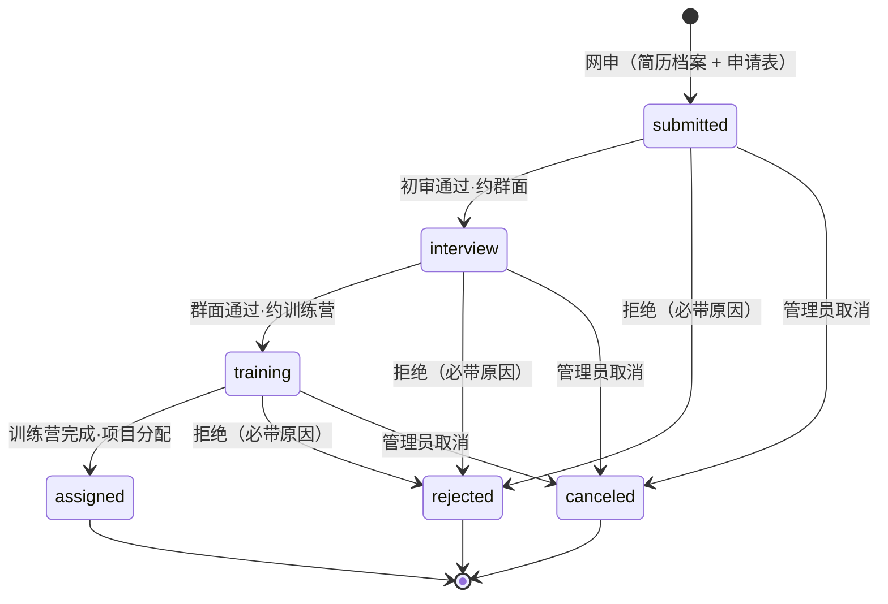

## Goal Capsule

- **Objective:** 2026.10.24 campaign 全量上线。公众经网站（codingirlsclub.com）或小程序进入 Hacker Start 1024 宣传页，沿三条路径行动——参加（→ `/initiatives` 场次页）、成为志愿者（→ 志愿者招募体系，从网申到项目分配全程走系统）、品牌合作（→ `partners@codingirlsclub.com`）。
- **Means:** 一个 PPT 视觉复刻的静态宣传页（zh-CN + en、移动端适配）+ 一条批次化、三职位的志愿者招募体系（简历档案 + 两步网申 + 网申→面试→训练营→项目分配四段流程，每段邮件+微信小程序双通道通知，通过 = 指派上岗）+ 小程序端原生页面（campaign 页与招募流，只中文，视觉参照现有小程序）。
- **Product authority:** 本 plan 的产品决策全部来自 2026-09-17/18 与创始人的 brainstorm + grill 对话（Key Decisions 带 session-settled 标注）；内容底稿为《Hacker Start 1024 专场合作方案》（11 页定稿）；招募流程模型参照 ABC 美好社会咨询社（创始人第一手申请经历）。
- **Open blockers:** 均为素材与文案定稿类——不阻塞规划，阻塞上线（清单见 Dependencies / Outstanding Questions）。

---

## Product Contract

### Summary

一页三入口的 Hacker Start 1024 对外宣传页（独立静态路由、zh-CN + en 双语、按合作方案 PPT 视觉复刻、遵守方案口径纪律、移动端适配），一套本期完整实现的志愿者招募体系（按批次招募、三职位〔场次主理人 Event Moderator + 教程研究员 Tutor + 活动教练 Coach〕、两步网申〔先完善简历档案、再申请项目〕、网申→面试→训练营→项目分配四段流程、每段邮件+微信小程序双通道通知、主理人分配时复用 EventModerator 指派上岗、场次由 2046 workspace Owner/Admin 预建录入发布），以及小程序端原生页面（campaign 页 + 完整招募流，只中文，视觉参照现有小程序）。

### Problem Frame

Campaign 定于 2026.10.24 全国启动，但公开面目前没有任何承载：`/initiatives` 列表页因后端无 Initiative 数据而常年空态，BD 方案的 11 页叙事只存在于线下 PDF/PPT；志愿者招募既无入口也无流程，40+ 城网络的扩张全靠人工对接；品牌触达只靠外发文件；小程序端也没有 campaign 入口。十周年（2016→2026，2¹⁰=1,024 场）是这轮 campaign 的叙事支点，需要一个能把它讲出来的页面；40+ 城滚动开班的组织能力，需要一个像样的招募体系来供给——网站与小程序两端都要能到达。

### Key Decisions

- **三入口单页（我要参加 / 成为志愿者 / 品牌合作）。** (session-settled: user-directed — chosen over 纯品牌页/双入口/四入口: 一页承载 campaign 全貌，入口经对话迭代定为三个)
- **志愿者体系统一入口，三职位，职位为枚举不建表。** hero 入口叫「成为志愿者」；申请页职位列表第一项 = 场次主理人（featured）。职位为**代码枚举（event_moderator | tutor | coach）+ i18n 文案（zh+en），不建职位表**（ER v2 裁决：文案内容中英两套走消息文件）。场次主理人只是志愿者体系里的一个职位，不等于组织者/工作台拥有者。(session-settled: user-directed)
- **三个职位：场次主理人（Event Moderator，slug `event_moderator`，对齐既有 EventModerator 机制）、教程研究员（Tutor）、活动教练（Coach）。** 活动教练 = 线下现场辅助陪跑（巡场答疑），学员自学为主、不授课——与 BD 方案「教学模式收敛到 Agent 自适应学习」口径不冲突；对应方案中 128 人志愿者体系的现场角色。中英文名创始人 2026-09-18 定名（旧称 Chapter Host/教程贡献者/场次教练弃用）。(session-settled: user-directed)
- **「我们是谁」标题定稿：「十年社区，可以被查证的十年」。** 「国家级背书」暗示机构担保关系、名不副实；新标题与「条条挂真链接」互证。英文区块标签 Recognition（弃 testimonial——语义是用户证言，与证据墙错位）。BD 落盘文档 P4 旧标题是否同步由创始人另行决定（OQ6）。(session-settled: user-directed)
- **主理人职责含媒体素材与社媒动员。** 现场收集照片/视频，发动参与者带 #hackerstart1024 发社媒。(session-settled: user-directed)
- **训练营 = 站内一门课程，页面仅简单说明。** 复用 course 系统；入选者由运营手动拉进对应课程，系统只记录段位流转，不做自动开课。(session-settled: user-directed)
- **招募按批次组织；人线与事线解耦。** 批次（cohort）含名称、申请截止、执行周期、状态徽章；**同一时间至多一个 open 批次**（先关旧批才开新批，grill A4）；批次与 Initiative/Event 无外键，靠「本 campaign 唯一 Initiative」约定松耦合（ER v2 人线/事线）。(session-settled: user-directed — 参照 ABC 咨询季)
- **两段式网申：先完善简历档案，再申请项目。** 简历档案一人一份、跨批复用、可更新。(session-settled: user-directed — ABC 验证过的模式)
- **四段流程：网申 → 面试 → 训练营 → 项目分配。** 面试为线上群面（微信群线下协调，系统只记阶段与结果）；训练营必修；每段结果邮件+微信小程序双通道通知——**小程序订阅消息需用户授权，邮件是唯一保底通道**（申请完成页与我的申请页放订阅引导）。(session-settled: user-directed；通道裁决为邮件+小程序，非短信)
- **同一批次限申一个职位；rejected/canceled 后本批结束，下一批可换职位再申；批次关闭不影响在途申请走完。** (session-settled: user-directed — ABC 同款约束 + grill A4/B3)
- **无申请人自撤流程；`canceled` 由 2046 workspace 管理员操作**（本人放弃等场景，备注选填）。(session-settled: user-directed — grill A1: 不为个别放弃做专门流程)
- **申请要求登录后提交。** applicant = 当前用户（小程序端走既有手机号登录，账号同源）。(session-settled: user-directed)
- **项目分配 = 邀请加入 2046 workspace（既有主台，不新建 workspace）+ 主理人指派为场次 EventModerator；场次由 2046 Owner/Admin 预建 draft、录入信息并发布。** 取证结论（`backend/lib/cgc_2046/events/event.ex:1100-1102`）：Event 的 create/update/launch 唯一授权是 Workspace Owner/Admin，无 moderator 分支，普通成员连 draft 都不可读——主理人的系统内权限 = 本场核销（check-in）+ 名单展示，场次信息由主理人线下提供、运营录入发布；**不做 RBAC 扩权**。Tutor 分配记录课程任务，不进 EventModerator。(session-settled: user-directed — grill Q3/Q11)
- **审核权限 = Event 所在 workspace（2046）的 Owner/Admin；审核面板挂 2046 workspace 管理面**，platform_admin 保留穿透能力。(session-settled: user-directed — grill Q5/Q10: 所有倡导活动都在 2046 台)
- **独立静态宣传页，与 Initiative 系统解耦；批次状态不在宣传页写死**——批次卡只写「首批招募进行中」，真实状态由申请页动态承载。(session-settled: user-directed — grill Q2)
- **zh-CN 与 en 双语同步上线**（网站端）；小程序端只中文。en 口径纪律句与职位描述 en 文案为人工定稿。(session-settled: user-directed)
- **视觉按合作方案 PPT/PDF 复刻（方向 D）**，色板取自 pptx slide XML 精确值（#B0406B / #C9497D / #2B2B33 / #857F8F / #FAEDF2 / #E7F5F3 / #2FA69D）；小程序端视觉参照现有小程序（橙 #ea5504 / 浅灰底 / 白卡圆角 / 渐变 hero）。可运行原型见 Dependencies。(session-settled: user-directed)
- **品牌联系方式用通用邮箱 `partners@codingirlsclub.com`，个人信息不上页。** (session-settled: user-directed)
- **参与者 CTA 指向 `/initiatives`。** (session-settled: user-directed)
- **时间线首期口径 = 64 场**（2026.10.24 启动 → 首期 64 场 → 批次滚动至 1,024 场）；方案 P8「首期 20 场验收后续批」保留于品牌段交付承诺语境。(session-settled: user-directed — 创始人裁决)
- **场地模式：免费合作场地优先；咖啡馆场次由学员现场消费支持；无场地预算。** 志愿者零出资零抽成。(session-settled: user-directed)
- **志愿者叙事用 Give and Take 框架**（Grant 金句 + 「给出一个周末，收获一座城市」）。(session-settled: user-directed)
- **教程研究员投入口径：一门课程预估 5-10 小时。** (session-settled: user-directed)
- **微信分享 meta 进需求**（title / description / 分享卡图）。(session-settled: user-directed — grill Q7)
- **不做分期兜底，10.24 全量上线。** (session-settled: user-directed — grill Q6)
- **培训共备的线下部分不进系统**；群面约时、微信群协调均为线下运营动作。

### Actors

- A1. 游客/潜在参与者：浏览宣传页（网站或小程序），沿「我要参加」到 `/initiatives` 查看并报名场次。
- A2. 志愿者申请人（登录用户）：浏览职位与流程，两步网申（网站或小程序），全程查状态；职位为场次主理人、教程研究员或活动教练。
- A3. 招募审核方（2046 workspace 的 Owner/Admin）：在审核面板处理申请（段位流转、取消、拒绝原因、简历查看、批次管理、项目分配），并负责场次的预建、录入与发布；platform_admin 保留穿透能力。
- A4. 品牌方（站外）：经品牌段 mailto 发起合作，48 小时内人工回复。
- A5. campaign 运营（A3 的运营分工面）：上线前置数据准备（Initiative、批次、预建场次、训练营课程），线下组织群面与训练营。

### Requirements

**宣传页（网站）**

- R1. 新增公开路由 `/hackerstart-1024`，zh-CN 无前缀、en 走 `/en` 前缀，页面为静态文案（代码 + i18n 消息维护），不依赖后端接口。
- R2. 页面按定稿信息架构组织：Hero（三 CTA + 十周年刻度条「2016 · 成立 —— 第 10 年 —— 2026 · 2¹⁰＝1,024 场」）→ 为什么是现在 → 我要参加（15/120/30 分钟节奏卡 + 班型事实行 + CTA）→ 参与者 FAQ → 成为志愿者专区（三职位小卡 + 批次卡〔只写「首批招募进行中」，不写死日期——真实状态由申请页承载〕+ 支持一行；深读内容在申请页）→ 时间线（三节点）→ 我们是谁（十年数字带 + 证据链接墙 + 杠杆句）→ 品牌专场合作（一句话 + 16×64=1,024 公式行 + 权益四件 + 示例命名胶囊 + 交付能力三列 + 六层价值阶梯 + 开放共创议题 + 合作结构胶囊 + CTA）→ 留存位（公众号关注）→ Footer（含志愿者回链）。
- R3. 三入口落点：「我要参加」→ `/initiatives`；「成为志愿者」→ 志愿者申请页（R10）；「品牌合作」→ `mailto:partners@codingirlsclub.com`。
- R4. 口径纪律：不出现任何厂商名（含 OpenClacky）；不出现价格；历史累计（2016-2025）与本轮计划（2026.10-2027）分开标注、永不混用；关键数字沿 2 的幂标注（2⁰ 启动日 / 2³ / 2⁴ / 2⁵ / 2⁶ / 2⁷ / 2¹⁰），幂标记全站统一样式（等宽 + 玫红 + 缩小），与主数字视觉分离。
- R5. 证据墙挂真实外链：ICSE CHASE 2021 论文、UNDP 科技与慈善报告（2018）、UNDP China LinkedIn #科技遇见她# 帖、中国日报 2017 报道、环球时报 Ladies who code、CGTN 报道、微信公众号学员故事一篇（链接已挂、标题待补）；共青团中央「伙伴计划」与果壳网保留文字不挂链。
- R6. 页面声明 canonical/hreflang（#239 契约）、进入 sitemap，并配置微信分享 meta（title / description / 分享卡图——十周年主视觉延展）。
- R7. zh-CN 与 en 同步上线；en 口径纪律句与职位描述 en 文案为人工定稿，非机翻直出。

**志愿者招募体系（后端 + 网站申请页 + 2046 管理面）**

- R8. 新增志愿者招募领域模型：招募批次（recruitment_cohort：名称、申请截止时间、执行周期、状态 draft|open|closed；**同一时间至多一个 open**）；志愿者申请（application = 申请人 + 批次 + 职位枚举〔event_moderator | tutor | coach，职位不建表，职责/要求文案走 i18n zh+en〕+ 申请城市〔Tutor 可远程〕+ 如何得知我们 + 是否有内部推荐人 + 留言）。约束：同一批次同一申请人限一份申请；rejected/canceled 后本批结束、下一批可换职位再申；批次关闭不影响在途申请走完；入职后职位不互斥（跨职位参与按场次/任务分别指派；已上岗者再申请初审豁免、新职位训练营必修）。
- R9. 简历档案：登录用户建立一人一份档案（姓名 + 简历文件 PDF/Word + 每周可投入小时数 + 技能多选），申请时关联引用，跨批复用、可更新；档案仅招募审核方（A3）可见，遵循 PIPL，不用于招募以外的用途。
- R10. 志愿者申请页（公开落地页）：单页叙事——当前批次信息（**动态读取 open 批次**：名称/状态徽章/截止/执行周期）、三职位列表与职位描述（i18n 文案）、featured 职位深读（主理人职责三段 + 四项支持）、四段流程说明、按职位分组的 FAQ（共同关心 + 各职位小节）、两步表单入口、状态说明；未登录访问引导登录，登录后提交；**无 open 批次时**批次区显示「当前无开放批次，下一批开放时间待定」并收起申请入口（页面其余叙事照常）——与宣传页「首批招募进行中」的静态文案解耦，真实状态以此页为准。
- R11. 两步网申：第 1 步「完善简历」（上传/更新简历档案 + 姓名 + 每周可投入 + 技能多选）；第 2 步「申请项目」（批次默认当前唯一 open 批次、职位单选、城市〔Tutor 可远程〕、如何得知我们、是否有内部推荐人、留言选填）。过往申请人可更新简历后直接申请。
- R12. 申请状态机：`submitted → interview → training → assigned`，任一审核段可转 `rejected`（必带原因文本）；另设 `canceled`（由 2046 workspace 管理员操作，备注选填，覆盖本人主动放弃等场景；无申请人自撤流程）；`assigned` = 项目分配完成。训练营段依托站内 course 系统（运营拉人），系统记录段位流转与结果，不做自动开课。

- R13. 招募审核面板：挂载于 2046 workspace 管理面，**仅该台 Owner/Admin 可用**（platform_admin 穿透管理）；按批次/职位查看申请列表与详情（含简历档案）、段位流转、拒绝原因录入、取消操作、批次管理（创建/开放/关闭，受唯一 open 约束）；申请人可在站内查看自己的申请与当前段位。
- R14. 阶段通知：提交确认、初审结果、群面结果、训练营预约与结果、分配结果——每段邮件 + 微信小程序双通道（复用站内通知体系触达小程序；短信为可选补充）。**实现约束：小程序订阅消息需用户授权，邮件是唯一保底通道**；订阅引导见 R21。
- R15. 项目分配动作：主理人职位 → 邀请申请人加入 2046 workspace 成员 + 指派为对应预建场次（R16）的 EventModerator（复用 `EventModerator.assign` 及成员前提校验）；Tutor → 记录课程任务分配结果（application 上记录，不建任务实体）。分配后场次信息由 Owner/Admin 录入并发布。
- R16. 上线前置检查单（全部完成后页面与申请流才可对外）：创建并发布 Hacker Start 1024 Initiative（slug `hacker-start-1024`、status open、hashtag #hackerstart1024、规则 deposit 69 / age 18+ / min 8 / deadline_rule（值规划时定））；2046 workspace 即分配目标台（既有，无需创建）；预建首批城市 draft 场次并挂载 Initiative（城市清单由运营提供）；第 1 批招募批次就绪（唯一 open）；训练营课程在 course 系统就绪。
- R17. 时间线呈现三节点：2026.10.24 启动 → 首期 64 场 → 批次滚动至 1,024 场。
- R18. 移动端适配：≤640px 断点下单列布局、序号徽章与标题同行、触屏间距（手机为主要传播场景）。

**小程序端（Taro 原生，只中文）**

- R19. 小程序 campaign 页（视觉按 weapp-d 原型，参照现有小程序样式）：hero（十周年 + 关键数字 + 幂标记）、三入口卡、时间线、可查证十年浓缩段；入口 = 「发现」页顶部 campaign 渐变入口卡（不动现有 4 Tab 结构）。
- R20. 小程序招募流（视觉按 weapp-host 原型）：批次卡（动态状态）、三职位与职位描述、四段流程、两步网申（简历经微信文件选择上传至 R9 档案；登录走小程序既有手机号登录，applicant 同源）、我的申请状态列表；审核面板不进小程序。
- R21. 小程序通知引导：申请完成页与我的申请页提供微信订阅消息授权引导（R14 双通道的小程序侧前提）；未授权时邮件为唯一可达通道，页面文案不承诺小程序通知必达。

### Key Flows

- F1. 参与者路径
  - **Trigger:** 游客经传播进入宣传页（网站或小程序入口卡）。
  - **Actors:** A1。
  - **Steps:** 选「我要参加」→ 阅读节奏卡与 FAQ → CTA 跳 `/initiatives` → 按城市查看场次 → 既有报名流（69 元押金）。
  - **Outcome:** 参与者找到城市场次；不成班走既有退款。**Covers R2, R3, R16.**
- F2. 志愿者路径
  - **Trigger:** 用户在宣传页/小程序选「成为志愿者」。
  - **Actors:** A2, A3, A5。
  - **Steps:** 阅读职位与流程 → 申请页（未登录先登录）→ 第 1 步完善简历档案 → 第 2 步提交申请 → 确认通知 → 初审通过约群面（微信群协调）→ 群面通过约训练营 → 运营拉入课程、训练营完成 → 项目分配：邀请入 2046 台 + 主理人指派到预建 draft 场次 / Tutor 记录课程任务 → Owner/Admin 录入场次信息并发布 → 每段邮件+小程序通知，状态全程站内可查。
  - **Outcome:** 志愿者按职位上岗；场次发布后出现在 `/initiatives`。**Covers R8-R15.**
- F3. 品牌路径
  - **Trigger:** 品牌方经外发物料或传播进入宣传页。
  - **Actors:** A4。
  - **Steps:** 阅读品牌专场段 → mailto partners@ → 48 小时内人工回复。
  - **Outcome:** 线索进邮箱，页面不留个人信息。**Covers R3, R4.**

### Acceptance Examples

- AE1. **Covers R10.** 未登录访问申请页 → 登录引导而非表单；登录后可进入两步网申。
- AE2. **Covers R8, R11.** 同一用户同一批次已有申请，再提交第二个职位 → 被拒（单职位约束提示）；下一批申请其他职位 → 成功。
- AE3. **Covers R12, R13, R14.** 置 `rejected` 未填原因 → 保存被拒；填原因后保存 → 申请人站内可见并收到含原因的邮件+小程序通知。
- AE4. **Covers R12, R15.** 主理人申请到 `assigned` → 申请人是 2046 workspace 成员且被指派为预建场次的 EventModerator；系统未创建新 workspace；场次在 Owner/Admin 发布前不出现在公开面。
- AE5. **Covers R9, R11.** 第 1 批完善过简历档案，第 2 批再申请 → 无需重传；档案对非审核方不可见。
- AE6. **Covers R3, R16.** R16 前置完成前宣传页 CTA 落地为空列表（上线检查未通过）；完成后显示 Hacker Start 1024 卡片。
- AE7. **Covers R4, R7.** en 页面历史累计/本轮计划标注成对出现、不混标。
- AE8. **Covers R12, R13.** 管理员将申请置为 `canceled` → 申请人站内可见；`canceled` 无必填原因（区别于 rejected）。
- AE9. **Covers R8.** 已有一个 open 批次时再开放第二个 → 被拒（唯一 open 约束）；关闭旧批后开放成功。
- AE10. **Covers R14, R21.** 用户未在小程序授权订阅消息 → 提交与阶段通知仅邮件送达，页面不报错、不承诺小程序通知。
- AE11. **Covers R8.** 已 `assigned` 志愿者下一批申请新职位 → 初审豁免直接进入面试段，但新职位训练营段必修。
- AE12. **Covers R10.** 唯一 open 批次被关闭且无新批次开放时访问申请页 → 批次区显示「当前无开放批次」且申请入口收起；下一批开放后自动恢复。

### How This Work Fits Together

<!-- ce-section: work-relationships -->

本 plan 覆盖 Hacker Start 1024 campaign 的公开宣传页、志愿者招募体系与小程序端页面（合并交付）。周边关系的当前理解（非承诺路线图）：

- 场次运营（报名/押金/核销）— **Depends on** 既有 Initiative/Event 系统，本 plan 仅做 R16 前置数据创建与预建场次，不改动其域。
- 志愿者上岗后的运营 — **Depends on** 既有 workspace/Event 协作机制，本 plan 止于指派与发布。
- 主理人工作台（为主理人开 Event 编辑/发布授权）— **Still to decide**；本期不做 RBAC 扩权（取证结论见 Key Decisions），未来独立工作。
- 更多职位的开放招募 — **Still to decide**；职位枚举预留扩展。
- 志愿者培训与陪跑的线上化 — **Can proceed independently of** 本 plan。
- 厂商定制版物料（如 OpenClacky 插槽稿）— **Can proceed independently of** 本 plan，属方案文档侧交付物。

### Scope Boundaries

**Deferred for later**

- 主理人工作台（为主理人开放 Event 编辑/发布授权的 RBAC 扩权）——v1 由 Owner/Admin 代操作。
- 更多职位的开放招募（职位枚举预留扩展）。
- 群面约时、训练营排期的系统化（微信群线下协调不进系统）。
- 训练营爽约的处置细则（本期不考虑，运营线下酌情）。
- 申请表单的免登录公开提交模式。
- 宣传页接入实时数据（报名进度、城市覆盖）——等 Initiative 真实数据积累后二期。

**Outside this product's identity**

- 价格、收款节奏、加购项等商务条款的对外展示（方案纪律：成品不展示价格）。
- 厂商定制版页面（插槽替换稿属方案文档侧，不进代码仓）。
- 报名功能本身（`/events/[slug]` 报名流是既有域，本 plan 只互链）。

### Dependencies / Assumptions

- `partners@codingirlsclub.com` 邮箱真实存在、有人处理。
- 微信订阅消息需在小程序后台申请模板，且用户授权后才可触达（R14/R21 的机制前提）；邮件为唯一保底。
- 素材与文案依赖（上线前收齐）：公众号二维码；FAQ「自带设备」运营口径；志愿者权益文案定稿；第 1 批批次日期定稿（页面草案 2026.10.10 23:59）；训练营课程内容（运营侧）；首批预建城市清单（运营提供）；学员故事标题与主人公背景；微信分享卡图；职位描述 en 文案翻译（与 en 口径句同人把关）。
- EventModerator 机制按现状复用：成员前提（先邀请入台再指派）、成员离台级联撤销指派——既有不变量，不为本需求修改。
- 视觉与 IA 的可运行原型在 worktree `.worktrees/cgc_2046/hackerstart-1024-landing`（分支 `sundevilyang/hackerstart-1024-landing`）：`variant-d`（宣传页）、`host-apply`（申请页，实现时更名志愿者路由）、`mobile/page.tsx`（390px 手机壳预览）、`weapp-d` / `weapp-host` + `weapp.css`（小程序视觉版，token 取自 `miniprogram/src` 真实样式）、`hs1024.css`（PPT 色板 + ≤640px 响应式块）。原型目录本身不合并。

### Success Criteria

- 三条路径端到端走通（F1-F3 各一次真实穿越；志愿者路径含一次 rejected 与一次 assigned 分支），AE1-AE12 全部断言通过。
- 招募流水线一次真实走通：网申 → 面试 → 训练营 → 分配，每段通知（邮件必达；小程序通知在已授权前提下送达），申请人状态站内可见。
- 小程序端：discover 入口卡 → campaign 页 → 完整申请流 → 我的申请，全程 Taro 原生走通一次。
- 口径纪律全页可过检：grep 无厂商名、无价格；历史累计/本轮计划标注成对出现；en 为人工译文；页面无个人信息。
- 移动端可用：≤640px 视口下两页单列布局、无横向滚动、序号徽章与标题同行（R18）。
- 上线检查单（R16 + 素材依赖）全部勾选后页面与申请流才对外可见。

### Outstanding Questions

- OQ1. **Deferred to Planning** — FAQ「需要自带电脑吗」的运营口径（当前草案：建议自带，以场次报名页为准）。
- OQ2. **Deferred to Planning** — 志愿者权益定稿（场次激励/免费名额/证书等），同时作为审核标准输入；页面为「共创中」占位。
- OQ3. **Deferred to Planning** — en 口径纪律句与职位 en 文案的定稿人；公众号二维码素材。
- OQ4. **Deferred to Planning** — 简历档案的存储位置与保留期限策略（PIPL 细节）。
- OQ5. **Deferred to Planning** — 「学员的故事」微信文章的标题与主人公背景（页面为占位，链接已挂）。
- OQ6. **Deferred to Planning** — BD 落盘文档 P4「国家级背书」旧标题是否随页面同步修改（文档在仓外用户仓库）。

### Sources / Research

- 内容底稿：《Hacker Start 1024 专场合作方案》11 页定稿 + 同源 PPT/PDF（用户仓库 `sundevilyang/hackerstart_1024`，仓外文件 `docs/10-专场合作方案-落盘.md`、`程序媛汇-Hacker Start 1024 专场合作方案.pptx/.pdf`）。
- 招募流程模型：ABC 美好社会咨询社志愿者招募——创始人第一手申请经历（批次化、两步网申、职位+职位描述、群面、训练营、项目分配，附小程序截图）+ [ABC 官网志愿者页](https://www.theabconline.org/volunteer)。
- 可运行原型（视觉/IA 参照）：worktree `.worktrees/cgc_2046/hackerstart-1024-landing/web/app/[locale]/prototype/hackerstart-1024/`——`variant-d`（宣传页）、`host-apply`（申请页）、`mobile`（390px 手机壳预览）、`weapp-d` / `weapp-host`（小程序视觉版）+ `hs1024.css`（PPT 色板 + ≤640px 响应式）与 `weapp.css`（小程序 token，取自 `miniprogram/src`）。
- 结构图：`docs/plans/2026-09-18-hackerstart1024-diagrams/`——`er-map.puml/.png`（实体关系 v2：4 张新表 + 既有复用，人线/事线解耦，position 走枚举+i18n）、`user-journey.puml/.png`（四条旅程）。
- 权限取证（grill Q11）：`backend/lib/cgc_2046/events/event.ex:1100-1102`（Event create/update/launch 唯一授权 Workspace Owner/Admin，无 moderator 分支）；`offering/actor_reads_offering.ex:23-30`（成员不可读 draft）；`admission/attendance.ex:177-180`（主理人仅有 check-in）；`initiatives/rule_inheritance.ex:335-363`（挂载发布门）。
- 现有代码参考：`web/components/initiative-index.tsx` / `initiative-detail.tsx`；`web/app/[locale]/apply/page.tsx`；`backend/lib/cgc_2046/events/moderators.ex`、`moderator_membership_validation.ex`；`backend/lib/cgc_2046/notifications/`；`miniprogram/src/app.config.ts`（4 Tab）与 `miniprogram/src/pages/discover/index.module.css`（小程序视觉 token）；`web/app/sitemap.ts`。
- 背书外链（已核实）：论文 `https://cmustrudel.github.io/papers/chase21code_camps.pdf`；UNDP 报告 `https://www.undp.org/zh/china/publications/kejiyucishankechixufazhanxingdongbaogao`；UNDP LinkedIn `https://www.linkedin.com/posts/undp-china_herstory-womenintech-科技遇见她-activity-6787232105513525248-w6vp`；中国日报 `https://www.chinadaily.com.cn/china/2017-01/13/content_27943492.htm`；环球时报 `https://www.globaltimes.cn/content/954372.shtml`；CGTN `https://news.cgtn.com/news/3d49544e31516a4d/share_p.html`；学员故事 `https://mp.weixin.qq.com/s/IfRSC8sA7THv-YPBa4_XAg`（标题待补）。
