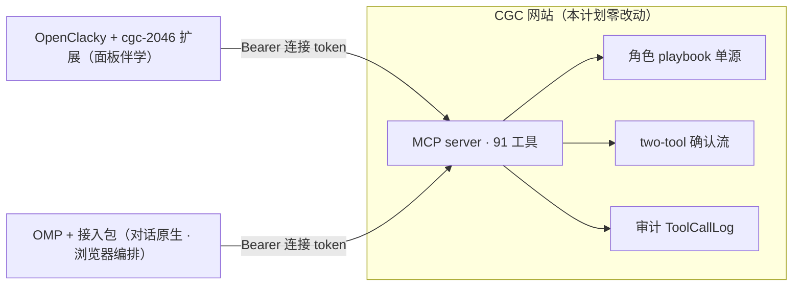
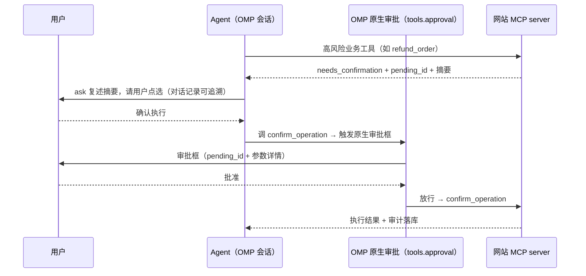

# OMP 第二官方 Agent 宿主接入 - Plan

## Goal Capsule

- **Objective:** 平台四类角色用户（平台管理员、Workspace Owner/Admin、Tutor、Learner）能在 OMP（oh-my-pi）终端里通过 MCP 完成 OpenClacky 宿主所支持的全部平台操作，且高风险确认流的安全强度不降级。
- **Means:** 交付一个 OMP 接入包（一个 `cgc` 主 agent + 连接 onboarding skill + `/cgc` 斜杠命令 extension + 安装脚本与 README），全部能力复用网站既有 MCP server 与 OMP 原生能力，网站侧零改动。（KTD1-KTD5）
- **Product authority:** 本轮对话的用户决策，以及 `docs/adr/0001-website-as-mcp-server-byo.md`（BYO 架构）、`docs/adr/0012-single-extension-platform-sop-private-supplement.md`（playbook 单源）的既有边界。
- **Stop conditions:** 任何一步需要改动网站（backend/web）才能继续时停止并上报（R14 红线）；确认守门无法经 OMP 原生审批配置达成时停止（R3 红线）。
- **Execution profile:** `execution: code`；实现与验证归执行者（ce-work 或人工），交付物全部位于 `omp-access-pack/`。

<!-- ce-section: work-relationships -->
## How This Work Fits Together

本计划只覆盖 OMP 宿主接入的阶段一（终端自助接入）。当前理解下的周边关系（非承诺路线图）：

- 与 OpenClacky `cgc-2046` 扩展**并列共存**：两宿主共享网站 playbook 单源与同一 MCP server，角色能力等权；OpenClacky 面板伴学形态不变。
- **Enables** 阶段二「品牌一键安装包」：接入包稳定后，把安装门槛降到非技术用户可自助；本计划不实施。
- **Can proceed independently of** 网站 MCP server 演进：本计划不改动网站任何行为。

---

## Product Contract

### Summary

让 OMP 成为 CGC 平台第二官方 Agent 宿主：一个 OMP 接入包让平台四类角色在 OMP 里通过对话操作网站，能力全部走现有网站 MCP server，网站侧零改动。体验对话原生——OpenClacky 的面板不移植，视觉面由网站既有页面与 OMP 内置浏览器编排承担；确认守门、角色入口、发现入口全部用 OMP 原生能力（审批配置、playbook 动态拉取、斜杠命令）而非自研组件。

### Problem Frame

平台的 BYO 架构（ADR-0001）已把「Agent 执行宿主」与「业务中枢」解耦：网站是 MCP server + RBAC + 审计，宿主负责对话与执行。目前唯一受支持的宿主是 OpenClacky（`cgc-2046` 扩展 + 一键安装包）。团队与部分用户日常主力环境是 OMP，却无法直接操作网站——要么切到 OpenClacky，要么手写 curl。宿主无关的基座（91 个 MCP 工具、版本化角色 playbook、two-tool 确认流、连接 token）已经稳定，缺的只是 OMP 侧的接入层：角色 agent 入口、连接引导、与 OpenClacky 同强度的确认守门。

### Key Decisions

- **OMP 是面向平台四类角色（含 Learner）的第二官方宿主，不是内部团队工具。** (session-settled: user-directed — chosen over 开发团队先行与内部职能团队定位: 接入体验按产品化标准规划) Governs R1-R9, R13
- **对话原生宿主：面板不移植，网站页面 + OMP 浏览器编排承担视觉面。** (session-settled: user-approved — chosen over 对等复刻面板与嵌入式图形壳: 对等复刻产生双宿主 UI 维护税，嵌入图形壳与 ADR-0001 形态 X 冲突) Governs R5
- **四角色能力第一版全量；分阶段的只是分发形态——阶段一终端自助接入，阶段二品牌一键安装包。** (session-settled: user-approved — chosen over 按角色划线分阶段与不分阶段直接做安装包: Learner/Tutor 旅程不因接入方式被裁剪，安装包链路不阻塞能力验证) Governs R6-R9, R13
- **确认守门用 OMP 原生审批配置（`tools.approval`），不自研守门 extension。** (session-settled: user-approved — chosen over 自研 `ctx.ui.confirm` 守门 extension: 原生审批是 OMP 一等公民，零代码零维护，headless 子代理中 prompt 直接拒绝调用比自研 extension 的 headless 放行更强) Governs R3
- **一个 `cgc` 主 agent + 网站 playbook 动态拉取，零个角色 skill 文件。** (session-settled: user-approved — chosen over 四个静态 agent 文件与四个角色 skill: 角色方法论全来自 `get_role_playbook` 运行时拉取（ADR-0012 单源），本地角色文件只会复制单源；切换角色零成本) Governs R1, R4
- **网站侧零改动。** MCP server、RBAC、确认流、token 机制是两宿主共享的稳定基座，本计划不触碰。Governs R14

双宿主共享单一事实基座：



### Actors

- A1. **平台管理员（Platform Admin）** — 通过 OMP 进入平台管理模式：审批申请、创建工作区、管理平台权限、查看审计。
- A2. **Workspace Owner/Admin** — 通过 OMP 管理成员、课程/活动生命周期、报名审批、订单退款。
- A3. **Tutor/Reviewer** — 通过 OMP 领取并完成教研任务：草稿生产、质检提交、审核发布。
- A4. **Learner** — 通过 OMP 发现、报名、支付并完成学习循环。
- A5. **OMP 接入包** — 本计划交付物：一个 `cgc` 主 agent、onboarding skill、`/cgc` 斜杠命令 extension、安装脚本与 README。
- A6. **CGC 网站 MCP server** — 既有宿主无关基座：91 工具、Bearer 鉴权、RBAC、确认流、审计；零改动。
- A7. **网站连接页/token 管理页** — 既有页面；用户在此生成连接 token，本计划不改其行为。

### Requirements

**接入包交付**

- R1. 接入包提供一个 `cgc` 主 agent 对话入口，覆盖四角色（platform_admin / workspace_admin / tutor / learner）：入口协议（连接、选上下文、拉 playbook、纪律）从 `openclacky-ext/cgc-2046/agents/` 移植并去除 OpenClacky 宿主耦合（宿主 `ask_user` 映射为 OMP `ask`，移除面板引用）；角色方法论全部来自 `get_role_playbook` 运行时拉取，接入包不内嵌角色 skill 文件。
- R2. 接入包提供连接 onboarding skill，自动连接为主路径：agent 经 OMP 内置浏览器（relay 接管用户已登录的 Chrome）代操作网站 token 页——清理旧 `omp-auto-*` token（只动本命名）、签发新 token、把 MCP server 条目写入 OMP 配置（项目级 `.omp/mcp.json` 或用户级 `~/.omp/agent/mcp.json`）并完成健康检查；用户只做关键确认，不代填账号密码；relay 不可用或未登录时回退手工引导路径，不伪装成功。
- R3. 接入包经 OMP 原生审批配置实现确认守门：install 往用户级 `~/.omp/agent/config.yml` merge 写入 `tools.approval.mcp__cgc_2046_confirm_operation: prompt`，使 `confirm_operation` 每次调用弹 OMP 原生审批框，用户批准才执行；headless 子代理中 `prompt` 策略直接拒绝调用（比 OpenClacky 守门 hook 的 headless 放行更强）；install 后必须实测验证（调一次 confirm 类工具确认弹审批框），配置丢失/被覆盖即静默无闸的脆弱性记入 Risks。业务工具第一段（建 pending）与 `cancel_operation` 不拦。
- R4. 角色 playbook 运行时从网站拉取（`get_role_playbook`），接入包不内嵌静态角色指令副本；playbook 版本号向用户展示。
- R5. 面板功能不移植：角色工作台的视觉面由网站既有页面承担（学习→网站学习页、教研→网站课程页、发现→网站公开页、管理→网站后台），agent 可在会话中用 OMP 内置浏览器打开对应页面。
- R6. 接入包提供 `/cgc` 斜杠命令（extension `registerCommand`），一键显示连接状态、我的待办（`list_my_tasks`）、可进入的角色（`list_my_workspaces` 的角色列表）与快捷操作（连接/断开/打开网站）——用户主动可发现的入口。

**四角色旅程（能力全量）**

- R7. Learner 旅程完整可用：发现（`discover_offerings`）→ 报名（`create_enrollment`，含幂等与确认）→ 支付（`checkout_url` 外部结算，`get_order_status` 跟踪）→ 学习循环（`start_learning_run` / `submit_learning_attempt` / `get_learning_state`）。
- R8. Tutor 教研旅程完整可用：任务认领（`claim_prep_authoring`）→ 草稿生产 → 质检提交（`submit_prep_for_check` / `submit_prep_quality_report`）→ 审核发布（`approve_prep` / `request_changes_prep` / `override_prep_gate`）。Tutor 可选 vibe 模式并行教研（fast worker 起草、good worker 审查），但 vibe worker 是 headless 子代理（yolo），`prompt` 策略在 headless 里直接拒绝调用——`approve_prep` 等确认流工具在 worker 里全被拒，director 又没有 MCP 工具，所以 vibe 并行只覆盖起草/质检阶段（`claim_prep_authoring` 等直写工具），最终审核发布必须退出 vibe 由主会话执行。
- R9. Owner/Admin 管理旅程完整可用：成员与加入审批、课程/活动生命周期、报名处理、订单退款（确认流两段式）。
- R10. 平台管理员旅程完整可用：工作区申请审批、创建工作区、平台权限管理（确认流两段式）、运行审计查看（仅元数据投影）。

**连接与配置**

- R11. MCP 配置使用 http transport 指向网站 MCP 端点（生产 `https://api.codingirlsclub.com/mcp`），连接 token 以 `Authorization: Bearer <token>` 值写入用户级 mcp.json（0600 权限语义），不硬编码进仓库文件。
- R12. 连接可自证：提供健康检查方式（OMP `/mcp test` 或 onboarding skill 内置检查），返回结构化状态且永不回显 token。
- R13. token 纪律与 OpenClacky 宿主一致：自动签发的 token 用可识别命名（如 `omp-auto-<日期>`），清理旧 token 只动本命名；token 不进入对话记录、日志或配置以外的文件；凭证类返回（如 `invitation_token`）只展示一次。

**长任务与偏好**

- R14. 长任务（Tutor 教研、Learner 学习循环）经 `todo` 集成暴露阶段进度：agent prompt 约定进入长任务时建任务清单（如「教研：草稿 → 质检 → 提交 → 审核」），每完成一步更新状态，用户在 OMP 界面实时看到进度。
- R15. 接入包引导用户开 `memory.backend: local`，跨会话记住常用 workspace 与上次角色等偏好；学习事实仍由网站 LearningRun 承担，本地 memory 只补偏好，不重复。

**交付边界**

- R16. 本计划交付阶段一（终端自助接入），发布对象为全量平台用户：接入包一经交付即对所有角色公开，任何能装 OMP 的用户可自助接入，不设团队内测期；品牌一键安装包为阶段二，不阻塞阶段一。
- R17. 网站侧零改动：不改 MCP server、RBAC、确认流、token 机制与任何页面行为。

### Key Flows

- F1. **连接 onboarding。** **Trigger:** 用户拿到接入包后首次使用或工具调用 401。**Steps:** 用户发起连接 → agent 经 relay 接管已登录 Chrome → 清理旧 `omp-auto-*` token → 签发新 token（进剪贴板，不读明文）→ 剪贴板管道写入 OMP MCP 配置 → 健康检查。**Outcome:** 连接建立，token 未经过对话；任一步失败回退手工指引。**Covers R2, R11-R13.**
- F2. **角色进入。** **Trigger:** 用户开始工作或切换上下文。**Steps:** `list_my_workspaces` → 按名称选择工作区与角色 → `get_role_playbook` 加载工作模式。**Outcome:** 全程无 UUID 手填，后续操作按服务端 RBAC 判定；切换角色 = 重新调 `get_role_playbook`，零成本。**Covers R1, R4.**
- F3. **高风险写确认。** **Trigger:** 角色调用确认流工具（退款、审批、发布等）。**Steps:** 业务工具返回 `needs_confirmation` + 摘要 → agent 复述摘要并调 `ask` 让用户点选（对话记录可追溯）→ 用户批准则 `confirm_operation` 触发 OMP 原生审批框（`tools.approval` 配置生效）→ 用户在审批框确认后落库，拒绝则 `cancel_operation`。**Outcome:** 无确认不落库，LLM 无法自问自答完成点火；ask 复述与原生审批两层都有记录。**Covers R3, R9, R10.**
- F4. **Learner 学习旅程。** **Trigger:** Learner 描述兴趣或选择继续学习。**Steps:** 发现 → 确认报名（幂等）→ 需要时打开外部结算页 → `start_learning_run` → 教学循环（`todo` 暴露进度）→ `submit_learning_attempt`。**Outcome:** 与 OpenClacky 宿主等权的学习闭环。**Covers R7, R14.**
- F5. **Tutor 教研旅程。** **Trigger:** Tutor 查看 `list_my_tasks` 或领取任务。**Steps:** 认领 → 生产草稿（可选 vibe 并行：fast 起草/good 审查）→ 结构门禁与质量报告 → 退出 vibe → 主会话审核/发布。**Outcome:** 教研全流程在 OMP 可完成，vibe 并行只覆盖起草/质检。**Covers R8, R14.**
- F6. **主动发现。** **Trigger:** 用户输入 `/cgc`。**Steps:** extension 调 `list_my_workspaces` + `list_my_tasks` → 展示连接状态、待办、可进入角色、快捷操作。**Outcome:** 用户主动可发现「我现在能干什么」。**Covers R6.**

### Acceptance Examples

- AE1. **Covers R3, F3.** Given Owner 发起退款，When agent 调业务工具拿到 `needs_confirmation` 且用户在 `ask` 中点「取消」，Then 调用 `cancel_operation`，业务库无变更；点「确认执行」则 `confirm_operation` 触发 OMP 原生审批框，用户在审批框确认后才落库并留审计。
- AE2. **Covers R3.** Given install 已写入 `tools.approval.mcp__cgc_2046_confirm_operation: prompt`，When agent 调用 `confirm_operation`，Then OMP 原生审批框弹出，用户批准才执行；headless 子代理中同一调用被直接拒绝。
- AE3. **Covers R2, R13, F1.** Given 用户走完 onboarding，Then 检查对话记录与工具调用参数，连接 token 不出现于其中；`~/.omp` 下配置文件权限不宽于 0600 语义（用户本人可读）。
- AE4. **Covers R7, F4.** Given Learner 报名付费课程，When 确认报名，Then 返回 `checkout_url` 且状态为 `payment_pending`；外部支付回调落账后 `get_order_status` 显示终态，随后可 `start_learning_run`。
- AE5. **Covers R1, R4, R7.** Given 一名 Learner 已装 OMP 与接入包，When 从零开始学习某课程，Then 全程无需 OpenClacky：选上下文 → 加载 learner playbook → 学习循环（`todo` 可见进度）→ 正式评价入库。
- AE6. **Covers R10, R17.** Given 同一平台管理员分别在 OMP 与 OpenClacky 执行同一审批操作，Then 网站审计记录语义一致（actor、tool、参数摘要、确认记录），OMP 不产生第二套审计语义。
- AE7. **Covers R2, F1.** Given 用户 Chrome 已装 relay 扩展并登录网站，When 用户在 OMP 发起连接，Then agent 自动完成旧 token 清理（仅 `omp-auto-*`）、签发、配置写入与健康检查，用户只需浏览器端常规确认；relay 不可用时回退手工指引而非报错中断。
- AE8. **Covers R6, F6.** Given 用户已连接，When 输入 `/cgc`，Then 看到连接状态、待办列表、可进入角色与快捷操作，无需先问 agent。
- AE9. **Covers R8, F5.** Given Tutor 在 vibe 模式并行教研，When fast worker 完成起草、good worker 完成审查，Then 最终 `approve_prep` 必须退出 vibe 由主会话执行——worker 里该调用被 headless prompt 策略直接拒绝。

### Success Criteria

- 已装 OMP 的用户从拿到接入包到完成首次角色操作不超过 15 分钟（不含 OMP 本体安装）。
- 四角色黄金链路（开课 → 教研 → 发布 → 报名 → 支付 → 学习 → 结果）在 OMP 完整走通，与 OpenClacky 宿主无角色能力差异。
- 确认流安全强度不弱于 OpenClacky 宿主：`confirm_operation` 在有 UI 时始终经原生审批框，headless 子代理中直接拒绝（比 OpenClacky 守门 hook 的 headless 放行更强）。
- 阶段一落地后 `backend/` 与 `web/` 零 diff。
- 全量公开不依赖人工支持：接入包自带安装、连接、故障恢复指引，手工回退路径（无 relay 扩展、未登录、配对失败）可独立走通。
- 用户输入 `/cgc` 即可主动发现连接状态、待办与可进入角色，无需先问 agent。

### Scope Boundaries

**Deferred for later（阶段二及以后）**

- 品牌一键安装包：品牌化分发链（下载、checksum、升级、宿主兼容矩阵），把门槛降到非技术用户可自助。
- OMP marketplace/npm plugin 分发形态。
- 网站连接引导页增加「连接 OMP」内容卡（现由接入包 README 与 onboarding skill 承担）。

**Outside this product's identity**

- TUI 面板/widget 复刻 OpenClacky 面板——对话原生是 OMP 宿主的形态定位。
- 嵌入式图形壳（OMP headless/SDK 嵌网站对话页）——与 ADR-0001 形态 X 冲突，仅当未来放弃 BYO 宿主多样性时重开。
- 网站侧任何改动：MCP server、RBAC、确认流、token 机制、playbook 存储。
- OpenClacky `cgc-2046` 扩展的行为变更。
- 自研守门 extension——确认守门用 OMP 原生审批配置，不写 `ctx.ui.confirm` 拦截代码。

### Dependencies / Assumptions

- ADR-0001（BYO、网站作为 MCP server）与 ADR-0012（playbook 单源、tutor 私有增量）继续有效；多宿主不改变「网站 = 业务中枢 + MCP server」定位。
- 网站 MCP server 当前基线已具备全部所需能力（本计划零网站改动的依据）：91 工具注册面、`get_role_playbook` 四角色版本化 playbook（`backend/lib/cgc_2046/mcp/playbooks.ex`）、two-tool 确认流与 600 秒 pending TTL（`backend/lib/cgc_2046/mcp/pending_operation.ex`）、连接 token 90 天滚动闲置过期与每用户 10 个 active 上限（`backend/lib/cgc_2046/mcp/token.ex`）。
- OMP 已内置本计划依赖的全部宿主能力：MCP http client（Bearer header、`${VAR}`/`!command` 间接引用）、`.omp/agents` task agents、`.omp/skills` skills、extension 的 `registerCommand`、`tools.approval` 审批配置（MCP 工具默认 write tier，按工具名 prompt 覆盖）、`ask` 阻塞问答、内置浏览器（含 relay 接管用户 Chrome）、`todo` 任务追踪、`memory.backend: local` 偏好记忆、vibe 模式（fast/good worker 并行）。
- `openclacky-ext/cgc-2046/agents/` 的三个 system prompt 是角色指令的移植源；`openclacky-ext/cgc-2046/hooks/before_tool_use.rb` 是确认守门强度的对照基线（本计划用原生审批配置达到同等强度，headless 更强）。
- OMP browser relay 需要用户 Chrome 安装 relay 扩展（一次性门槛）；不可用时 onboarding 走手工回退，不阻塞阶段一交付。

### Outstanding Questions

**Deferred to Planning**

- 接入包分发载体：git 仓库、npm extension package 还是 zip（OMP extension package 可同时声明 agents/skills/MCP server 条目，可能收敛安装步骤）。
- 守门配置的工具名匹配规则（`mcp__cgc_2046_confirm_operation` 命名清洗，实现时用 `/mcp list` 校验实际注册名）。
- onboarding skill 对项目级配置（cgc_2046 仓库内开发场景）与用户级配置（平台用户场景）是否分两条指引。
- `/cgc` 命令的 extension 是否同时注册 `registerMessageRenderer` 把 MCP 工具返回的课程卡片/报名摘要渲染成富文本（可选增强，不阻塞阶段一）。

### Sources / Research

- `backend/lib/cgc_2046/mcp/server.ex` — 91 工具注册面、鉴权、确认流、playbook、elicitation 未启用的依据。
- `backend/lib/cgc_2046/mcp/playbooks.ex`、`backend/lib/cgc_2046/mcp/pending_operation.ex`、`backend/lib/cgc_2046/mcp/token.ex` — playbook 单源、确认流 TTL、token 生命周期。
- `openclacky-ext/cgc-2046/ext.yml`、`openclacky-ext/cgc-2046/hooks/before_tool_use.rb` — 既有扩展容器结构与守门先例。
- `openclacky-ext/cgc-2046/agents/cgc-assistant/system_prompt.md` — 角色指令宿主耦合点清单（ask_user、browser、面板注入）。
- `docs/adr/0001-website-as-mcp-server-byo.md`、`docs/adr/0012-single-extension-platform-sop-private-supplement.md` — 架构边界。
- `docs/plans/2026-08-27-1636-feat-openclacky-role-agent-journeys-plan.md` — 四角色旅程需求基线（本计划复用其旅程语义，不重定义业务行为）。
- `docs/plans/cgc-2046-openclacky-extension-refactor.md` — OpenClacky 侧接入体验对照（配对、健康检查、安装包链路）。
- OMP 文档（`omp://mcp-config`、`omp://task-agent-discovery`、`omp://skills`、`omp://extensions`）— 宿主能力依据。
- OMP 文档（`omp://extension-loading`、`omp://mcp-server-tool-authoring`、`omp://user-facing-packages` 的 browser-relay 节）— 落盘布局、工具命名清洗规则、relay 安装命令的依据。
- OMP 文档（`omp://approval-mode`、`omp://vibe-mode`、`omp://tools/hub`、`omp://memory`）— 原生审批配置、vibe 并行形态、多 agent 协作、偏好记忆的依据。

---

## Planning Contract

Product Contract preservation: 本版为重写版（2026-09-20），替代 2026-09-19 版；R-ID 重排（R1-R17），核心变化：确认守门从自研 extension 改为 OMP 原生审批配置（KTD4），角色入口从四个静态 agent 改为一个主 agent + 动态 playbook（KTD5），新增 `/cgc` 斜杠命令（R6）、`todo` 长任务进度（R14）、`memory` 偏好（R15）、Tutor vibe 并行约束（R8）。

### Key Technical Decisions

- KTD1. 接入包落点与分发形态：cgc_2046 仓库内 `omp-access-pack/` 目录承载全部交付物，安装经 `install.sh`；zip URL 直装与 npm 插件包分发链留阶段二。 (session-settled: user-approved — chosen over 独立 npm 包或立即建 zip 托管链: 阶段一最小分发链) Governs R16
- KTD2. 用户级落盘布局：主 agent 拷贝到 `~/.omp/agent/agents/cgc.md`、onboarding skill 到 `~/.omp/agent/skills/cgc2046-onboarding/`、`/cgc` 命令 extension 到 `~/.omp/agent/extensions/cgc-command.ts`（单文件 TS，repo 内 `.omp/extensions/backend-format-gate.ts` 先例同款）；install 对同名已有文件先备份再覆盖。 (session-settled: user-approved — chosen over 项目级 `.omp/` 落盘: 平台用户不在本仓库内工作) Governs R2, R11
- KTD3. token 直写配置：连接 token 以 `Authorization: Bearer <token>` 值直接写入 `~/.omp/agent/mcp.json`（0600 权限语义），不经环境变量或 keychain 间接引用。 (session-settled: user-approved — chosen over 环境变量/keychain 间接: 与 OpenClacky `Cgc2046McpConfig` 原子写先例和 ADR-0001 D13 单一配置点一致，少一步配置) Governs R2, R11, R13
- KTD4. 确认守门用 OMP 原生审批配置：install 往 `~/.omp/agent/config.yml` merge 写入 `tools.approval.mcp__cgc_2046_confirm_operation: prompt`；headless 子代理中 prompt 直接拒绝调用（比自研 extension 的 headless 放行更强）；install 后实测验证（调一次 confirm 类工具确认弹审批框）；配置丢失/被覆盖即静默无闸的脆弱性记入 Risks。 (session-settled: user-approved — chosen over 自研 `ctx.ui.confirm` 守门 extension: 原生审批是 OMP 一等公民，零代码零维护，headless 更强) Governs R3
- KTD5. 一个 `cgc` 主 agent + 网站 playbook 动态拉取，零个角色 skill 文件：主 agent 只承载入口协议（连接、选上下文、拉 playbook、纪律），角色方法论全部来自 `get_role_playbook` 运行时拉取（ADR-0012 单源）；`autoloadSkills` 只装 onboarding 那一个。 (session-settled: user-approved — chosen over 四个静态 agent 文件与四个角色 skill: 本地角色文件只会复制网站单源；切换角色零成本) Governs R1, R4
- KTD6. MCP 配置写法：`http` transport 指向生产 `https://api.codingirlsclub.com/mcp`（dev 可用 `--url` 覆盖），install/onboarding 对 mcp.json 做 read-merge-write（临时文件 + 原子替换，保留其他 server 与未知字段）。 Governs R2, R11

### High-Level Technical Design

安装后用户级布局：

```text
~/.omp/agent/
├── agents/
│   └── cgc.md                    ← 唯一主 agent（入口协议 + 纪律）
├── skills/
│   └── cgc2046-onboarding/
│       └── SKILL.md              ← 连接引导（自动/手工）
├── extensions/
│   └── cgc-command.ts            ← /cgc 斜杠命令（唯一自研组件）
├── config.yml                    ← merge 写入 tools.approval 守门配置
└── mcp.json                      ← merge 写入 cgc-2046 条目，0600
```

two-tool 确认流在 OMP 侧的完整时序（守门为 KTD4 的原生审批配置）：



### Assumptions

- OMP task agent frontmatter（`name` / `description` / `autoloadSkills`）与用户级发现路径按当前 OMP 版本行为；实现时以 `/agents` 实际表现为准。
- `mcp__cgc_2046_confirm_operation` 命名依 tool-bridge 清洗规则推导，实现时用 `/mcp list` 校验实际注册名后再定 `tools.approval` 配置键。
- `tools.approval` 配置在 OMP 设置界面被重写时是否保留用户级 config.yml 的 merge 结果，实现时验证；若被覆盖，README 记录恢复方法。
- relay 扩展安装依赖 `omp browser-relay install`（一次性）；onboarding skill 引导用户执行，失败回退手工路径。

### Risks & Dependencies

- **配置即防线的脆弱性**：确认守门依赖 `tools.approval` 配置存在才生效——OMP 默认 yolo，config.yml 丢失/被设置界面重写 = 静默无闸。缓解：install 后实测验证（调一次 confirm 类工具确认弹审批框）；README 记录验证方法与恢复步骤；OpenClacky 用 hook 正是为防这个，OMP 侧用配置是权衡后的选择（零代码 vs 配置脆弱性）。
- 守门绕过边界：agent 以 bash curl 直调 MCP API 可绕过工具层审批（OpenClacky 版拦 curl 命令文本形态；OMP 版阶段一只拦工具层调用）。后端 pending TTL 与审计仍是防线；如需封堵，后续在 `user_bash` 事件加形态拦截（留作后续加固，不阻塞阶段一）。
- OMP 上游漂移：agent frontmatter 字段、tool-bridge 命名清洗、`tools.approval` 配置 schema 都可能随 OMP 版本变化——README 记录验证时的最低 OMP 版本，升级 OMP 后重跑 U5 checklist。
- relay 单点依赖：onboarding 主路径依赖用户 Chrome 已装 relay 扩展；回退路径已覆盖（U2），不阻塞交付。

### Sequencing

U1（主 agent）与 U3（`/cgc` 命令 extension）无相互依赖，可并行；U2（onboarding skill）引用 U1 的 agent 名与 KTD2/KTD3 落盘形态；U4（install + README）聚合 U1-U3 并写入 config.yml 守门配置；U5（端到端 smoke）最后。

---

## Implementation Units

### U1. 接入包骨架与 `cgc` 主 agent

**Goal:** 交付 `omp-access-pack/` 目录骨架与唯一主 agent prompt，宿主耦合全部去除。
**Requirements:** R1, R4（KTD5）。
**Dependencies:** 无。
**Files:** `omp-access-pack/agents/cgc.md`
**Approach:**
1. 以 `openclacky-ext/cgc-2046/agents/` 下三个 system prompt 为移植源，合并为一个主 agent：入口协议（连接、选上下文、拉 playbook、纪律）取三者公共部分，逐段去除宿主耦合：`ask_user` → `ask`、删除面板引用（学习地图/侧栏段落改为引导打开网站对应页面）、`~/.clacky/mcp.json` → 用户级 OMP 配置（KTD2）、连接 SOP 段替换为指向 onboarding skill。
2. frontmatter 携带 `name: cgc` 与 `description`；`autoloadSkills` 只引用 `cgc2046-onboarding`。
3. 角色方法论全部来自 `get_role_playbook` 运行时拉取，主 agent 不内嵌任何角色 skill 文件；切换角色 = 重新调 `get_role_playbook`。
4. 长任务进度约定：进入教研/学习循环时用 `todo` 建任务清单，每完成一步更新状态（R14）。
**Patterns to follow:** `openclacky-ext/cgc-2046/agents/cgc-assistant/system_prompt.md` 的章节结构与纪律措辞。
**Test scenarios:**
- agent 文件 frontmatter 含 `name: cgc` 与非空 `description`，`autoloadSkills` 只含 `cgc2046-onboarding`。
- 全文 grep 零宿主耦合残留：`ask_user`、`~/.clacky`、面板 id（`cgc-2046-learn` 等）。
- prompt 引用的工具名（`list_my_workspaces`、`get_role_playbook`、`confirm_operation` 等）全部存在于 `backend/lib/cgc_2046/mcp/server.ex` 注册面。
- prompt 含 two-tool 确认流纪律段、「playbook 不授予额外权限」声明、`todo` 长任务进度约定。
**Verification:** 结构断言（grep 清单或小脚本）全绿；安装后 `/agents` 可见 `cgc`（联动 U5）。

### U2. 连接 onboarding skill

**Goal:** 自动连接为主、手工回退兜底的 onboarding skill，token 全程不进对话。
**Requirements:** R2, R12, R13（KTD2, KTD3, KTD6；F1, AE3, AE7）。
**Dependencies:** U1（agent 引导语与 skill 名一致）。
**Files:** `omp-access-pack/skills/cgc2046-onboarding/SKILL.md`
**Approach:**
1. 首选路径（relay 自动连接）：打开网站 token 页 → 未登录则提醒登录后重试（不代填凭证）→ 撤销旧 `omp-auto-*`（只动本命名）→ 签发新 token → 点页面复制按钮（不读明文）→ 剪贴板管道写入用户级 mcp.json（KTD3/KTD6 形态）→ 健康检查。
2. 回退路径：relay 不可用、未登录、健康检查失败三种分支各自给出可执行指引（用户自建 token、粘贴 merge 片段或跑 install 脚本），并明确凭证只显示一次，不伪装成功。
3. 健康检查段：`/mcp test cgc-2046` 或等效 initialize + tools/list 探测，输出结构化状态，永不回显 token。
4. 项目级开发场景附注：cgc_2046 仓库内可用项目级 `.omp/mcp.json`（dev URL）。
**Patterns to follow:** `openclacky-ext/cgc-2046/skills/` 原 onboarding skill 的剪贴板管道与断言连接成功模式。
**Test scenarios:**
- SKILL.md frontmatter 含 `name` 与 `description`（OMP skill 发现必需）。
- skill 全文无「读取 token 明文并转述/写日志」的指令形态；token 只出现在剪贴板与配置写入动作。
- 旧 token 清理步骤限定 `omp-auto-*` 命名（R13）。
- 回退三分支（relay 缺失、未登录、健康检查失败）各自完整可执行。
**Verification:** 对照 F1 逐步走查 SKILL.md；安装后 `skill://cgc2046-onboarding` 可解析（联动 U5）。

### U3. `/cgc` 斜杠命令 extension

**Goal:** 用户主动可发现的入口，一键显示连接状态、待办、可进入角色与快捷操作。
**Requirements:** R6（F6, AE8）。
**Dependencies:** 无（与 U1/U2 并行）。
**Files:** `omp-access-pack/extensions/cgc-command.ts`
**Approach:**
1. factory 内 `registerCommand("cgc", ...)`：handler 调 `list_my_workspaces` + `list_my_tasks`（经 OMP 的 MCP 工具调用机制），渲染连接状态、待办列表、可进入角色、快捷操作（连接/断开/打开网站）。
2. 未连接时显示「未连接」+ 引导跑 onboarding skill；连接失败显示错误与重试入口。
3. 可选增强（不阻塞阶段一）：`registerMessageRenderer` 把 MCP 工具返回的课程卡片/报名摘要渲染成富文本。
**Patterns to follow:** `.omp/extensions/backend-format-gate.ts`（repo 内单文件 extension 先例）；OMP extension 文档的 `registerCommand` 用法。
**Test scenarios:**
- 已连接：`/cgc` 显示连接状态、待办、角色列表、快捷操作。
- 未连接：`/cgc` 显示「未连接」+ onboarding 引导。
- 连接失败（401/网络错误）：显示错误与重试入口，不静默。
- extension 不注册任何工具，只注册 `/cgc` 命令。
**Verification:** 安装后 `/cgc` 可用且三态（已连接/未连接/失败）显示正确（联动 U5）。

### U4. 安装脚本与 README

**Goal:** 一条脚本完成用户级安装/升级/卸载 + 守门配置写入 + 实测验证，文档支撑全量公开自助。
**Requirements:** R3, R11, R16（KTD1, KTD2, KTD3, KTD4, KTD6）。
**Dependencies:** U1, U2, U3。
**Files:** `omp-access-pack/install.sh`、`omp-access-pack/install.test.sh`、`omp-access-pack/README.md`
**Approach:**
1. install.sh 子命令：`install`（拷 agent/skill/extension，同名先备份为 `*.bak-<时间戳>`；merge 写 mcp.json：临时文件 + chmod 600 + 原子替换；merge 写 config.yml：`tools.approval.mcp__cgc_2046_confirm_operation: prompt`）、`remove`（只删本包文件与本条目，保留备份）、`--dry-run`（只打印计划动作）。
2. mcp.json 条目：server 名 `cgc-2046`、http transport、生产 URL（`--url` 可覆盖 dev）；token 由 onboarding 流程补入，安装脚本不索要。
3. config.yml merge：YAML 层面 merge `tools.approval` 节，保留用户已有其他工具策略；实现时验证 OMP 设置界面重写 config.yml 时是否保留 merge 结果，若被覆盖则 README 记录恢复方法。
4. install 后实测验证：脚本末尾调一次 confirm 类工具（或引导用户调一次）确认弹审批框，验证守门配置生效；失败则提示 config.yml 可能被覆盖。
5. README：前置（安装 OMP、`omp browser-relay install` 并在 Chrome 手动加载 `~/.omp/browser-relay/extension` 的 unpacked 扩展——该命令只落盘扩展，不自动注入 Chrome）、三步接入、故障恢复（401、relay 失败、健康检查失败、守门配置被覆盖）、卸载、FAQ、最低 OMP 版本记录位。
**Patterns to follow:** `openclacky-ext/cgc-2046/bin/pack`（脚本化交付先例）；`Cgc2046McpConfig` 的 read-merge-write 语义。
**Test scenarios:**
- 干净环境 install：agent/skill/extension 落位，mcp.json 生成且权限 600，config.yml 含守门配置。
- 重复 install：幂等，无重复条目，已有同名文件产生新备份。
- 已含其他 MCP server 的 mcp.json 与已含其他工具策略的 config.yml：merge 后其他条目与未知字段保留。
- remove：本包文件与本条目消失，其他 server 与用户自建 agents/skills/工具策略不受影响。
- --dry-run：仅打印计划，零落盘。
- install 后实测验证：调一次 confirm 类工具确认弹审批框。
**Verification:** `bash omp-access-pack/install.test.sh` 全绿；全新 `$HOME` 沙盒实测一轮 install → remove。

### U5. 端到端 smoke 验证

**Goal:** 真实 OMP 会话验证黄金链路切片，产出可复验清单。
**Requirements:** Success Criteria 全部六条；AE1、AE2、AE3、AE5、AE7、AE8 必验，AE4/AE6/AE9 视环境可用性执行或记录豁免理由。
**Dependencies:** U4。
**Files:** `omp-access-pack/docs/verify-checklist.md`
**Approach:**
1. 清洁沙盒 `$HOME` 跑 install → 启动 omp → `/agents` 见 `cgc`、`/mcp list` 见 cgc-2046（校验守门实际工具名，回填 KTD4 配置键）、`/cgc` 三态显示正确。
2. 走 F1（relay 自动连接）与 F2（角色进入）；learner 身份跑 AE5 学习切片（start_learning_run → 一次 attempt → get_learning_state，`todo` 进度可见）。
3. 管理身份跑 AE1 确认流切片（一个低风险确认流工具全两段：ask 复述 + 原生审批框）+ AE2 守门验证（headless 子代理中同一调用被拒）+ AE3 token 不进对话检查。
4. checklist 记录每步预期/实际/结论；失败项回写本 plan Risks 后修复重跑。
**Execution note:** 优先真实环境 smoke 而非 mock——本交付物的价值主体在集成行为，单元测试只覆盖 install 脚本逻辑。
**Test scenarios:**
- checklist 每项含前置、操作、预期三要素，可独立复验。
- 覆盖 AE1/AE2/AE3/AE5/AE7/AE8；AE4/AE6/AE9 的豁免（如有）带环境理由。
**Verification:** checklist 全绿或带记录豁免；无静默失败项。

---

## Verification Contract

| 命令 | 覆盖 | 适用单元 | 通过信号 |
| --- | --- | --- | --- |
| `bash omp-access-pack/install.test.sh` | 安装/升级/卸载/merge/权限/守门配置写入 | U4 | 断言全绿，零副作用残留 |
| U1/U2 结构断言（grep 清单） | frontmatter、宿主耦合残留、工具名对表 | U1, U2 | 零命中、全一致 |
| `omp-access-pack/docs/verify-checklist.md` 现场执行 | 端到端集成（含 `/cgc` 三态、守门审批框、headless 拒绝） | U3, U5 | 全绿或记录豁免 |

- 零新依赖：接入包不引入任何新 npm/mix 依赖，`pnpm check:licenses` 与 `mix cgc2046.check_licenses` 不受影响。
- `/cgc` 命令 extension 无单元测试（逻辑薄，价值在集成）；其验证全在 U5 checklist。

---

## Definition of Done

- Global:
  - R1-R17 全部满足；`backend/` 与 `web/` 零 diff（R17）。
  - AE1-AE9 在 verify-checklist 中全绿或带理由豁免。
  - 确认流强度不弱于 OpenClacky 宿主：有 UI 时 `confirm_operation` 必经原生审批框，headless 子代理中直接拒绝（R3）。
  - 放弃的实验路径与临时脚本已从 `omp-access-pack/` 清除，diff 只含交付物。
  - 一名未参与本计划的用户仅凭 README 可完成接入，无需询问团队（对应 Success Criteria 第 2、5 条）。
  - 用户输入 `/cgc` 即可主动发现连接状态、待办与可进入角色（对应 Success Criteria 第 6 条）。
- Per-unit done 信号见各单元 Verification 字段。
