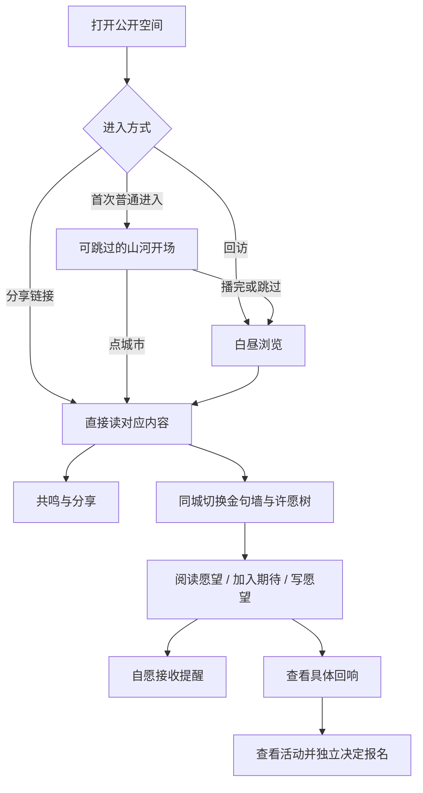

# 闪念间金句墙与许愿树需求计划

## Goal Capsule

- **目标**：让陌生访客在一片逐渐被点亮的中国山河中读到校友的声音、表达共鸣与分享，并在同一空间发现和参与面向未来的愿望。
- **当前交付**：先完成可供用户评审的 Web 交互原型，包含桌面和手机浏览器；正式业务接入与小程序后续另行规划。
- **产品依据**：本次完整对话及用户最后认可的中国地图版三张概念图。用户认可视觉方向，不等于认可现有原型的所有临时行为。
- **来源限制**：本计划仅由对话整理，本轮没有读取应用代码。过去的代码检查结果只存在于交接记录中，接手者应重新核实，不能当作本计划的需求来源。
- **未决项**：当前原型可以继续规划；正式产品在公开授权、游客期待身份、单句生命周期、回响治理等问题上仍需产品确认。

## Product Contract

### Summary

两个公开空间共用中国山河的视觉语言。金句墙承载过去的声音，许愿树承载未来的期待，回响让人看见愿望得到的具体回应。
当前先以合成内容完成可操作的 Web 原型，验证地图、昼夜过程、阅读和参与能否形成顺畅旅程。

### Problem Frame

陌生人从朋友分享进入，首先想读到打动朋友的那句话；地图与开场如果阻挡阅读，就会削弱传播。
校友则需要找到自己的位置，理解公开、私密与署名的区别，并看见自己发布或撤回的结果。
静态概念图已经确定气质，但不能证明动画节奏、城市选择、分享回流、移动端阅读和写愿望好用。

### Known Capability Gap

用户于 2026-09-21 补充现状：已有 Voices 与 Wishes，但没有 Echo 资源；愿望与具体回应 / 活动的关联、运营发布权限、通知触发均不存在。本条来自用户提供的信息，本轮没有独立读取代码验证。

因此 R19–R20 的生产落地需要新增 Echo 业务能力，不能被规划为已有接口的前端展示或简单接线。后续生产计划应单独覆盖回应的创建与发布、愿望关联、查看权限、可选活动关联、通知触发及撤回 / 更正后的行为。具体关联数量、发布者资格与通知规则仍需在 Outstanding Questions 中明确，不在本需求计划中擅自决定。

当前 Web 原型继续用合成回响验证用户旅程；“有回响了”卡片只证明演示呈现存在，不证明任何上述生产能力已经实现。

### Key Decisions

- **共同使用中国山河，而非星空。** Governs R2–R4。（session-settled: user-directed；用户在讨论天与地对仗之后，明确要求两页都采用山河脉络。）
- **最终进入白昼。** Governs R5。（session-settled: user-directed；用户在“黑夜中发光”和“黑夜逐渐成为白昼”之间选择后者。）
- **可供性优先。** Governs R6–R14；地图与动画必须帮助用户发现内容及操作，不能让用户猜如何阅读。
- **先交付 Web 原型。** Governs R1、R24–R25。（session-settled: user-directed；用户明确要求先完成 Web 端原型。）
- **不同入口走不同旅程。** Governs R6–R8。（session-settled: user-approved；用户接受首次进入、分享直达、回访区别处理的分析。）
- **采用中国地图版概念图。** Governs R2、R9；用户已明确认可三张修订稿，不再开展风格海选。

以下决策来自 2026-09-21 早些时候的讨论实录（见 Sources），当时已拍板但尚未落入本计划：

- **入口权重三件套。** Governs R26。（session-settled: user-directed）Web：独立页 `/flashback/voices`（命名 voices 拍板，否决 golden-quote / one-liner）+ header 公开入口；落地页金句段改为**随机几句 +「看全墙 →」**导流（用户明确：不是精选）；小程序：不给 tab 权重，走发现页入口卡 + 每张分享卡/金句卡自带「看全墙」。
- **实名身份从 `User.display_name` 读取，不加 username、不加账号侧 realname。** Governs R17。（session-settled: user-directed）realname（法定名）永不上公开墙；公开实名只读用户主动维护的 display_name，选档 UI 明示「将以 display_name 实名展示」。
- **金句墙先上，许愿树第二期。** Governs R15–R20 的生产排期。（session-settled: user-directed）金句墙有存量授权内容；许愿树等愿望攒到不显冷清再开公开面。
- **赞后转化轻提示。** Governs R14、R27。（session-settled: user-approved）首赞后给不打断的轻提示（「这句话是当年真实的报名答案——你也写过吗？」），转化钩子挂高意图动作，点赞本身不登录。
- **许愿树两个动作：期待与附议分离。** Governs R15、R19、R30–R31。（session-settled: user-directed，2026-09-21 讨论定稿）❤️「我也期待」= 零门槛匿名计数（许愿树的"点赞"，不单设点赞按钮）；「附议 · 我能出力」= 承诺动作，含订阅回响通知与出力表单；附议者自动计入期待数，同一人按身份去重不重复计数。
- **附议留言第一期仅运营可见。** Governs R31。公开面只显示聚合出力分布；公开留言墙等审核能力具备后再开。
- **Web 游客无订阅通道。** Governs R19。回响通知只在小程序提供（订阅消息授权，无需注册）；Web 游客可期待，想被通知引导去小程序（兼作转化）。
- **内容审核：机审前置 + 先发后审。** Governs R32。（session-settled: user-directed）微信内容安全检测硬拦为合规底线；机审通过直接上树保仪式感；admin 一键下架 + 举报入口 + 频控 + 信用分级兜底。
- **回响分期：一期回应发布 + 订阅通知，二期成场关联。** Governs R19–R20、R36。成场是 admin 手动动作，不由计数自动触发。
- **分享卡落地接续金句墙。** Governs R33。（session-settled: user-directed，讨论实录 GAP-2）
- **作者正反馈一期为回访可见。** Governs R34。（session-settled: user-directed，讨论实录 GAP-3）被赞里程碑通知与整体通知承诺一起后定，不抢跑。
- **金句排序沿用涌现序，加随机入口。** Governs R35。默认点赞优先 + 更新次之 + 最热 60 条不变；「随便听听」保障低热度内容可发现。
- **单句身份：QUOTE 独立实体、稳定 id、编辑原地生效、撤回可逆。** Governs R37。（session-settled: user-directed，2026-09-21）每个授权圈选段一行 QUOTE；编辑不换 id（旧链接与点赞保留）；撤回 = hidden_at 可逆，旧链接显示失效页并导流全墙；整份授权撤回级联隐藏；点赞从按人归集改为挂 quote_id。否决「person+span 哈希派生 id」方案（改 span 即断链）。

以上“已确认”只覆盖对应规则。以下带“建议”或列入 Outstanding Questions 的内容尚不能升级为产品定稿。

### Actors

- A1. 陌生访客：无需是校友，可阅读公开内容、表达轻量共鸣、分享。
- A2. 已认领校友：在自身资格与授权范围内提供内容、写愿望或找回档案；当前原型可以模拟此身份。
- A3. 运营者：未来发布愿望的具体回应或关联活动；后台操作不属于当前 Web 原型交付。
- A4. 评审者：通过不同入口、分镜停帧和双端界面判断视觉及旅程是否成立。

### Requirements

**Scope and content**

- R1. 当前交付是合成数据的 Web 交互原型，所有账户、通知、报名与持久化模拟必须让评审者辨认。
- R2. 地图应能被识别为中国，城市按真实地理位置呈现，保留台湾、海南与南海诸岛的完整表达。
- R3. 青绿山水维持已认可的纸面、浅青地貌和深绿文字气质，金色光路表达声音与愿望之间的连接。
- R4. 金色光路不得被误认成真实河道，活动源头与传播顺序未经核实只能标为示意。

**Entry and motion**

- R5. 开场按源起、流向远方、山河渐醒、白昼展开四个连续阶段呈现，日光从被点亮的脉络周边扩散。
- R6. 开场必须可跳过，用户点城市时应立即转入该城内容并结束开场。
- R7. 从具体内容的分享链接进入，应直接呈现对应句子或愿望，不被完整开场阻挡。
- R8. 回访与两页切换不强迫重看开场，并保留主动重播入口。
- R9. 白昼界面中，地图承担探索与定位，文字阅读区和动作承担主要任务；不依赖持续动画维持可用性。

**Voices**

- R10. 金句包含可完整阅读的句子、授权后的署名、城市、年份与点赞状态，先读句子再看辅助信息。
- R11. 访客无需登录即可赞金句，操作后得到清晰反馈，当前阅读内容不因热度变化突然跳走。
- R12. 每句金句和整面墙均有可发现的分享入口，分享结果应与实际完成的动作一致。
- R13. 用户可以选择城市及切换内容，地图与阅读区始终指向同一内容。
- R14. 无需操作地图也能继续浏览；找回入口自然可达且不打断阅读、点赞和分享。

**Wishes and Echo**

- R15. 愿望展示内容、作者公开署名、城市及期待状态，并能分享和加入期待。
- R16. 写愿望时应明确选择公开或私密；公开意味着任何人可读，私密内容不得进入公开地图与分享结果。
- R17. 公开署名应提供明确预览，原型展示匿名及展示名两种选择，不暗示展示名等于已验证法定姓名。
- R18. 公开愿望提交后应能找到其在地图与阅读区的位置，撤回后从公开展示移除。
- R19. 加入期待、接收提醒、活动报名必须是独立动作；拒绝提醒不能阻断浏览与分享。
- R20. 回响应指向具体回应或活动，不能把期待计数增加呈现为愿望已经实现。
- R21. 金句墙与许愿树切换时保持城市上下文，帮助用户理解同一地点的过去声音和未来愿望。

**Responsive and evaluation**

- R22. 桌面采用地图与阅读区并置，手机采用纵向布局；主要阅读动作不应被过大的地图或工具条遮挡。
- R23. 相邻城市、小光点和长内容都有可用的选择与阅读方式，低热度内容仍可被找到。
- R24. 减少动态效果、跳过动画或停止播放后，用户仍能阅读和操作全部公开内容。
- R25. 原型应提供可访问链接、可操作的入口场景、双端截图与真实验证结论，不以静态图或生成视频替代交互验收。

**Entry points and conversion（来自讨论实录的已拍板项，见 Sources）**

- R26. 入口权重：Web 有独立页与 header 公开入口，落地页以随机几句金句导流「看全墙」；小程序有发现页入口卡，且每张分享卡/金句卡自带「看全墙」入口（裂变自携带）。
- R27. 首赞后出现一次不打断的转化轻提示，引导找回档案；可忽略，不阻断继续阅读与点赞。
- R28. 实名档金句可链接到作者已公开的实名档案页；匿名档不出现任何可枚举身份的入口。
- R29. 匿名点赞按设备去重并有频控；刷赞风险以技术兜底，不因此给点赞加登录墙。

**Wishes: expectation, endorsement and moderation（2026-09-21 讨论定稿）**

- R30. 许愿树提供两个动作：❤️「我也期待」（任何人、匿名设备去重计数）与「附议 · 我能出力」（承诺动作，需触达通道）；附议者自动计入期待数，同一人不重复计数。
- R31. 附议表单包含：接收回响通知（默认勾选，小程序订阅消息授权）、我能出力（提供场地 / 我来组织 / 我来讲课或分享 / 出物资赞助 / 其他自由留言）；留言第一期仅运营可见，公开面显示聚合（N 人念念不忘 · M 人附议：场地 ×a · 组织 ×b …）。
- R32. 内容审核分层：机审前置硬拦（小程序 UGC 过微信内容安全检测，合规必须）；机审通过直接发布；admin 可一键下架（复用 hidden_at 下线模式）；公开面有举报入口；每人每日愿望频控；被下架作者转先审后发。私密愿望过机审但不进人工队列。
- R33. 分享卡（#771）落地页尾部接续金句墙（随机几句预览 + 看全墙入口），小程序分享卡同样自带入口；两个授权域不共享数据，仅导航接续。
- R34. 作者正反馈：校友回访时可见自己句子的共鸣与阅读数，并提供「再圈选几句」入口；被赞里程碑通知后续与通知承诺一起定。
- R35. 金句默认排序沿用涌现序（点赞优先、更新次之、最热 60 条）；提供「随便听听」随机入口，从全量出句、会话内不重复，保障低热度内容可发现。
- R36. 回响（Echo）生产语义：状态机 draft → published → corrected / revoked；一个愿望可有 0..n 个回响，默认展示最新；回响可选关联真实活动（成场为 admin 手动动作，非自动）；发布时向该愿望的订阅者（R31 的通知授权）发送通知；第一期不建成场关联。
- R37. 单句身份与生命周期：每句金句有稳定身份（一人多句各一行）；作者编辑圈选原地生效，旧分享链接与点赞保留；单句撤回可逆，旧链接显示失效页并导流全墙；整份授权撤回级联隐藏其所有句子；点赞按句计数与去重。

### Key Flows

- F1. **分享进入金句。Covers R7、R10–R14。** 打开朋友的单句链接 → 直接阅读 → 赞或分享 → 继续看其他内容 → 可选找回入口。无需先走地图故事。
- F2. **首次进入公开墙。Covers R5–R6、R9、R13–R14。** 打开入口 → 看光从源头传播 → 继续观看或点城市 / 跳过 → 白昼阅读区 → 读、赞、转发。
- F3. **回访。Covers R8–R9。** 再次进入 → 直接可读的白昼界面 → 按需要主动重播。回访记忆的时间和范围见未决问题。
- F4. **从过去走向未来。Covers R15、R19–R21。** 在某城读到金句 → 切到许愿树 → 看到同城愿望 → 加入期待 → 自愿选择提醒。相邻空间的切换不重走开场。
- F5. **写下愿望。Covers R16–R18。** 输入愿望 → 选择公开范围与署名 → 提交 → 公开愿望在地图与正文可找到，私密愿望只进入本人结果 → 可返回继续浏览。
- F6. **看到回响。Covers R19–R20。** 从愿望或提醒进入 → 读到具体回应 → 查看关联活动 → 单独决定是否报名。原型用合成活动演示这一关系。
- F7. **撤回。Covers R16、R18。** 作者撤回公开愿望 → 地图及公开阅读区移除。正式产品对旧链接、缓存和通知内容的处理需在生产需求中明确。

### Acceptance Examples

| 示例 | 覆盖 | 评审者应看到什么 |
|---|---|---|
| AE1. 首次开场 | R4–R6 | 光先沿连接移动，附近区域逐渐显露；未经过区域仍暗；没有未经核实的历史发源地断言 |
| AE2. 中途接管 | R6、R13 | 播放中点城市，进入该城内容；旧动画不再把界面拉回 |
| AE3. 分享直达 | R7、R12 | 链接打开的是被分享的那句话，不能先看到另一句或被开场遮住 |
| AE4. 不看动画 | R8、R24 | 跳过、回访或减少动态效果时仍有完整内容与操作 |
| AE5. 轻量共鸣 | R11、R15、R19 | 赞 / 期待得到反馈，不因此被当成已订阅或已报名 |
| AE6. 保留城市 | R13、R21 | 在成都读金句后切许愿树，仍以成都为上下文 |
| AE7. 公开与私密 | R16–R18 | 公开愿望能找到自己的纸签；私密愿望不出现在公开地图 |
| AE8. 撤回 | R18 | 自己的公开愿望从当前公开视图消失 |
| AE9. 具体回响 | R19–R20 | 有回响的愿望能查看回应内容或活动；没有回响的不显示伪造的达成状态 |
| AE10. 手机阅读 | R22–R23 | 390×800 作为当前参考视口，无横向溢出，读 / 赞 / 分享可操作，底部工具条不遮挡 |
| AE11. 长句与密集城市 | R10、R23 | 长句能完整读，相邻城市不要求精准点微小光点，低热度内容不消失 |
| AE12. 诚实交付 | R1、R25 | 评审者能区分真实可用操作、模拟操作、未验证性能；不能只交一组截图 |

### Success Criteria

- 金句墙以“被转发”为核心产品目标；本轮通过可体验的分享旅程检验可供性，不承诺尚未定义的转化率。
- 后续指标需区分分享点击、链接复制、可确认的分享完成与回流，不能互相替代。
- 许愿树的成功信号是愿望被表达、期待被聚集、具体回应可发现；数值目标尚未确定。
- 原型验收必须包含真实操作和动态观察；用户认可概念图不视为原型验收通过。

### Scope Boundaries

当前包含两页公开空间、共同地图开场、分享直达、阅读互动、写愿望与回响的演示闭环。
当前不包含生产接口与数据迁移、真实身份核验、真实通知与报名、运营后台、小程序实现或上线发布。
不重新开展视觉方向海选，不扩建通用社交平台、公开名册或账号身份体系。

<!-- ce-section: work-relationships -->
### How This Work Fits Together

当前工作是 Web 原型的需求约定，服务于用户确认交互体验。

- 后续生产业务计划依赖原型体验反馈，以及下列正式产品问题的确认。
- 小程序覆盖与 Web 共享产品语义，但其操作方式、分享能力和运行性能需要单独验证。
- 运营回响与通知是未来生产闭环的组成部分，不因原型有按钮就视为已具备。
- 上述后续方向不构成本轮的实施授权或既定技术拆分。

### Proposed Defaults

这些是可在原型中试验的建议，不是已经批准的永久规则：

- 自动开场先按约 4–6 秒体验，现有样片时长只是试验值；以阅读不被拖延为判断依据。
- 只在首次普通进入时自动播放，分享直达和回访走白昼；回访记忆范围另定。
- 同城声音与愿望共享城市位置，城市列表作为地图选择的补充。
- 公开署名默认匿名，展示名由作者主动选择并预览。
- 提醒邀请放在加入期待之后，允许直接跳过。
- 桌面与小程序入口已升级为 Key Decisions（R26）；小程序不预设新增底部 Tab。

### Outstanding Questions

**Resolve Before Production Planning**

以下不阻塞合成数据 Web 原型规划，但必须在对应生产实施单元定稿前由用户或业务负责人确认。接手 Agent 不得自行将建议写成已批准需求。

| 问题 | 为什么需要确认 | 原型中的暂定处理 |
|---|---|---|
| 哪些人能写愿望 | 可读不等于可投稿；是否扩大到新访客尚未定 | 模拟已认领校友 |
| 游客“我也期待”的身份与计数口径 | 动作模型已定（R30：匿名设备去重、附议计入去重）；设备次数不等于独立人数、与登录后身份关联的合并规则待定 | 本次会话的合成计数，不宣称真实人数精度 |
| 单句排序的“下一条”遍历细节 | 身份模型已定（R37）；会话内遍历与随机入口细节在 Deferred | 固定合成句 |
| 哪座城是活动源头、如何传播 | 当前概念不能当作史料 | 起点和传播顺序标示意 |
| 历史愿望的授权如何处理 | 原先成员可见不等于同意全网公开 | 只用合成内容，不扩大现有授权 |
| 展示名更新是否影响旧内容 | “当前展示名”还是“发布时署名”待定 | 明示模拟展示名 |
| 作者能否编辑内容与城市 | 已讨论撤回，但完整编辑与城市归属规则未定 | 演示发布与撤回，城市可选不等于生产已定 |
| 通知承诺的细节 | 通道已定（小程序订阅消息；Web 游客无通道、引导去小程序）；频率上限、退订范围、里程碑通知是否做仍待定 | 可跳过的提醒选择演示 |
| 回响治理的细节 | 状态机与分期已定（R36）；一个愿望可否多个回响的呈现、更正/撤回后旧通知如何处理、活动取消后回响呈现待定 | 预置具体合成回应 |

**Deferred to Planning**

- 用史料与业务负责人确认源头，取得适合生产使用的地图与素材条件。
- 确定“下一条”遍历的会话内规则与「随便听听」随机入口细节；默认涌现序已定（R35），时间衰减等二期优化另定。
- 定义第一次 / 回访的记忆范围，以及失效、撤回、无城市内容、网络失败的用户出口。
- 为长内容、密集点位、键盘操作、低性能环境和减少动态效果选择验证方法。
- 在真实环境验证开场时长、首屏大小与性能，再提出可解释的验收门槛。
- 根据现场证据拆分实施批次；已有原型代码可以被修正或替换，不能反过来限定需求。

### Sources

本计划未读取应用源码，不提供“现状已经实现”的保证。

- 用户在本对话中明确认可的图：`docs/handoffs/flashback-web-prototype-2026-09-21/concepts/china-dawn-storyboard-v2.png`、`china-voices-day-v2.png`、`china-wishes-day-v2.png`（后两者与第一张同目录）。
- 历史讨论：`docs/handoffs/flashback-web-prototype-2026-09-21/context/闪念间-金句墙讨论实录.md`，仅背景参考，不能覆盖本对话的后续决定。
- 合并验收与金句墙讨论记录：`docs/handoffs/flashback-web-prototype-2026-09-21/context/闪念间-合并验收与金句墙讨论记录.md`。含名册权限模型、金句墙既有口径（作者限名册授权者、涌现排序、最热 60 条）、许愿树 issue #791 与回响机制线索（admin「回应/成场」→ 建真 Event → `flashback_action_scheduled` 模板通知附议者）。
- 相关 issue：#790（测试基建债）、#791（许愿树分期：授权两档 + 实名读 display_name + 路人收窄 + 回响机制 + 山河脉络形态）。
- 工程现场交接：`docs/handoffs/flashback-web-prototype-2026-09-21/给接手Agent的提示词.md`。它描述已做与待验证事项，不替代产品需求。
