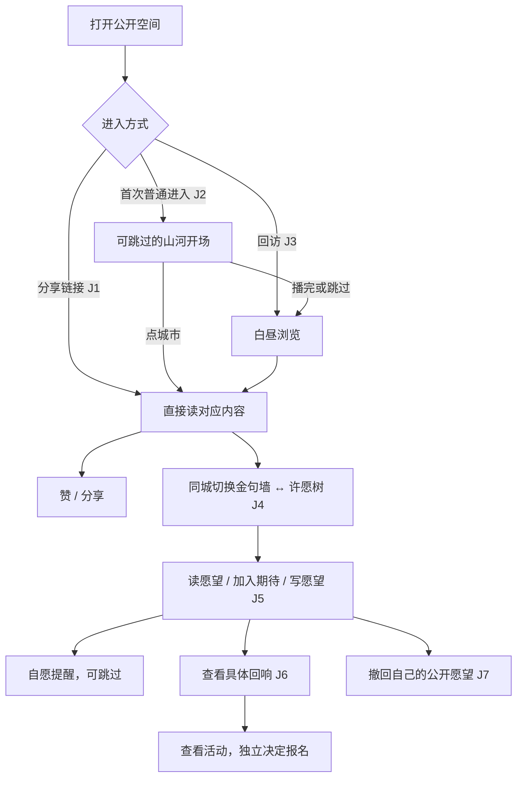
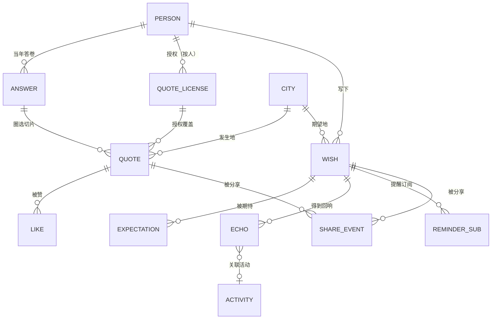

# 闪念间金句墙与许愿树 Web 原型实施计划

> 依据 `给规划Agent的提示词.md` 编写：先产出计划，不开始实施。本计划在只读核对现场后编写；规划期间未改产品代码、未提交、未 push。
> 重要现场事实：**需求计划所针对的 Web 原型在本计划编写时已经收尾并通过独立复验**。因此本计划的主体不是"怎么造原型"，而是：原型剩余收尾项 → 用户评审 → 生产接入的差距与决策清单。
> §4 User Journey 与 §5 ERM 按用户要求补充：Journey 落到步骤级（用户动作 → 系统行为 → 需求覆盖 → 原型现状）；ERM 区分「后端已存在 / 需扩建 / 纯新增」，并标注每个实体依赖的产品未决项。
> 2026-09-21 第二轮对齐（讨论实录比对）：A 组已拍板项（入口三件套、赞后轻提示、实名档链档案页、display_name 决策、上线节奏、点赞防刷）已补入需求计划 R26–R29 与 Key Decisions；B/C 组讨论定稿——许愿树两动作（❤️ 期待 / 附议·我能出力）、附议出力表单与留言一期仅运营可见、附议计入期待去重、Web 游客无订阅通道、审核分层（机审前置 + 先发后审）、Echo 分期、分享卡回流（GAP-2）、作者正反馈一期（GAP-3）、排序沿用涌现序 + 随机入口——已落入需求计划 R30–R36 与本计划 J4–J10、ERM、§8–§9。

## 1. 本次范围与完成定义

**本次范围（原型收尾）**：让评审者通过可访问 URL 完成需求计划 F1–F7 全部旅程，双端（桌面 1440×1000、手机 390×800）可读可操作，证据与模拟边界如实标注。

**完成定义**：

1. 需求计划 R1–R25 在原型中均有实现证据或明确标注的模拟/豁免；✅
2. 验收示例 AE1–AE12 逐条有实测结论；✅
3. ~~用户在真实可见浏览器窗口目测开场动画节奏并确认~~ ✅ 2026-09-21 通过；
4. 证据（截图 / 录屏 / 检查输出）收齐于原型目录 `evidence/`。✅

**非目标**：生产接口与数据迁移、真实身份核验、真实通知与报名、运营后台、小程序实现、上线发布、视觉方向重选。

## 2. 已核实的当前能力与缺口

### 2.1 工程现场（只读核对，2026-09-21）

- 工作区：隔离 git worktree `codex/voices-wishes-web-prototype`（同一仓库的 worktree，位于主仓外的 `~/.codex/worktrees/` 下；机器特定路径见交接包 `docs/handoffs/flashback-web-prototype-2026-09-21/给接手Agent的提示词.md` 第 3 节）。
- 提交链：`c9c6f568`（原型快照）→ `8652e2cc`（收尾：视觉微调、验证记录、证据）→ `75d60513`（独立复验、重拍桌面证据）。工作区干净，未 push。
- 运行：`http://localhost:3998/prototype/voices-wall/river-dawn`，Next 16.3.5 / React 19.2.4 / Node 24，无新增 npm 依赖。
- 旧原型工作区（`topic/in-a-flash` 分支的 throwaway worktree）的 WIP 未动；主仓 develop 未改。机器特定路径见交接包第 3 节。

### 2.2 需求追踪：R → 证据 → 缺口

| 需求 | 已有实现证据（文件 / 实测） | 缺口 |
|---|---|---|
| R1 合成数据可辨认 | 底部工具条"交互原型 · 合成数据"；私密/找回/通知弹层均明示演示 | 无 |
| R2 中国可识别、城市真实位置 | `geography.ts` 统一投影 + `china-geo.json`（DataV 100000_full，35 feature，含 `100000_JD` 南海插图）；截图 `evidence/voices-desktop.png` | 生产合规审查未做（见 §9） |
| R3 青绿山水气质 | `terrain.png` 位图材质按真实多边形裁切；非整图贴屏 | 无 |
| R4 金线≠河道、源头示意 | `map-scene.tsx` 青绿河道（Natural Earth 长江/黄河 5 段）与金色连接分层；开场文案标"传播起点与顺序为原型示意" | 无 |
| R5 四幕昼夜开场 | `river-dawn.tsx:75` 分幕阈值 0.18/0.46/0.86；实测墙钟 6.4s 依次推进 0.07→1.00；`evidence/dawn-frame-01..04.png`、`intro-playback.mp4` | 帧率数值验收环境受限（见 §7） |
| R6 可跳过、点城市中断 | 实测：播放中点广州即进入正文 progress=1；跳过片头直接白昼 | 无 |
| R7 分享直达不播开场 | `page.tsx:17` `entry=share`/`item` 抑制开场；实测 item=q4 直达成都句子 | 无 |
| R8 回访不重播、可主动重播 | `finishIntro` 写 `intro=0`；"重看山河亮起"入口；重复重播 epoch 防串帧（README 验证记录） | 回访记忆范围是产品未决项（§8） |
| R9 白昼为正常阅读界面 | 桌面地图左/阅读区右；无动画依赖 | 无 |
| R10–R14 金句读/赞/分享/选城/找回 | 实测：赞 32→33；下一句切换上海且地图同步；单句与整墙分享分开且链接真实可复制；找回弹层两步可走通 | 点赞为内存态，刷新重置（原型明示） |
| R15–R18 愿望展示/写公开私密/找到与撤回 | 实测：写广州公开愿望后城市/正文/纸签/"我的愿望"标一致；撤回后消失；私密进私密结果页不进公开地图 | 城市选择、提交后改可见性等是生产未决项（§8） |
| R19 期待/提醒/报名三动作独立 | 实测：加入期待 11→12 与"已加入期待"；提醒可跳过不阻断；回响详情弹层 Esc 关闭 | 无 |
| R20 回响指向具体回应 | 合成回响卡"北京 · 周末编程工作坊"可点开详情；无伪造达成态 | 无 |
| R21 双页切换保留城市 | 实测：成都/广州切换均保留 | 无 |
| R22 双端布局、动作不被遮挡 | 实测手机 390×800：无横向溢出；"我也期待"底 y=737 < 工具条顶 y=749 | 分页行在首屏被工具条部分覆盖，滚动 193px 可达——已记录，评审时确认是否接受 |
| R23 相邻城市与长句 | 沪杭合并地图按钮 + 城市栏分别可选；长句 `overflow-wrap` 完整可读 | 无 |
| R24 减少动态效果可用 | **根因已查明**：验证机 macOS `reduceMotion=1`，原型正确直接进入白昼；CDP 覆盖 `no-preference` 后开场正常播放 | 无（此前"采样异常"结案，见 §7） |
| R25 可访问链接与真实验证 | 四个体验 URL；eslint / tsc 通过；证据在 `evidence/` | 用户目测评审未进行 |

### 2.3 验收示例实测结论（AE1–AE12）

AE1–AE9、AE11–AE12 均有通过证据（对应上表与 README 验证记录）。AE10 手机阅读通过，附带 §2.2 R22 的分页遮挡记录。唯一未关闭项：**AE1 的"节奏是否舒服"属主观判断，需用户在可见窗口目测**，工具环境无法替代。

## 3. 实施单元（可独立验收）

原型实施已全部完成并验证。**U1 已于 2026-09-21 通过**（用户目测开场动画与双端界面后明确「通过」；评审中发现系统 reduce-motion 阻挡观看，补 `?motion=1` 强制播放参数，commit `3ea82e54`）。**U3 已于同日完成**：Mainline intent `int_5b4ea385` 已 seal（status: proposed，code_commit `b6bc25cb`），分支 `codex/voices-wishes-web-prototype` 保留不 push。U2 未触发（评审无修改意见）。

### U1 · 用户评审 ✅ 通过（2026-09-21）

- 内容：用户在可见浏览器窗口走四个入口 URL（§10），重点目测开场节奏、手机阅读、写愿望流程。
- 涉及：无代码改动；若评审提出修改，派生新单元。
- 完成条件：用户明确"原型验收通过"或提出具体修改清单。
- 依赖：无。
- Test expectation: none —— 评审动作由用户完成，无代码变更。

### U2 · 评审反馈修正（条件触发）

- 内容：仅当 U1 提出修改时立项；每处修改按项目 E2E 分层（结构数值断言 → 交互走通 → 截图）复验。
- 完成条件：修改点有对应实测证据；eslint / tsc 保持绿。
- 依赖：U1。
- Test expectation: 条件触发 —— 若产生行为修改，按修改点补 ego-browser 结构断言与交互复验（如修改涉及样式，补 computed style / 几何数值断言）；无修改则 none。

### U3 · 原型归档（收尾动作）

- 内容：U1 通过后，Mainline intent `int_5b4ea385` seal；分支保留不 push；交接包补记最终 commit 与验收结论。
- 完成条件：seal 记录存在；交接文档指向 `75d60513` 或其后继。
- 依赖：U1（及可能的 U2）。
- Test expectation: none —— 归档动作（seal 与文档补记），无代码变更。

## 4. User Journey（步骤级）

七条旅程对应需求计划 F1–F7。「原型现状」列：✅=已实测通过；🎭=演示实现（无真实副作用，界面已明示）；❌=原型未覆盖。

### J1 · 分享进入金句（陌生访客，F1，Covers R7、R10–R14）

| # | 用户动作 | 系统行为 | 原型现状 |
|---|---|---|---|
| 1 | 在微信/浏览器打开朋友的单句链接 `?entry=share&item=qN` | 直接呈现该句，不播开场（`page.tsx:17`） | ✅ |
| 2 | 读句子、署名（王\*\* · 2014 · 北京） | 句子最大层级，署名随后 | ✅ |
| 3 | 点「赞」 | 计数 +1、按钮态即时反馈；不跳转、不要求登录 | ✅（内存态） |
| 4 | 点「分享这句话」 | 弹层给出该句专属链接，可复制 | ✅（链接仅本机可开） |
| 5 | 点「下一句」或城市 | 内容与地图同步切换 | ✅ |
| 6 | 点「找回你的那一张」 | 找回演示弹层，可关闭可忽略 | 🎭 |

关键可供性：第 1 步必须 0 操作读到内容——任何开场、弹窗、登录墙出现在此步都视为旅程失败。

### J2 · 首次进入公开墙（陌生访客，F2，Covers R5–R6、R9、R13–R14）

| # | 用户动作 | 系统行为 | 原型现状 |
|---|---|---|---|
| 1 | 打开裸链接 | 黑夜山河，源头亮起（幕 1，progress<0.18） | ✅ |
| 2 | 观看 | 光沿金色连接扩散（幕 2 <0.46）→ 日光从已点亮区域向外推（幕 3 <0.86）→ 全白昼（幕 4） | ✅ 墙钟 6.4s |
| 3 | 播放中点某城市 | 立即结束开场，进入该城内容 | ✅ |
| 4 | 或点「跳过片头」 | 直接白昼 | ✅ |
| 5 | 白昼界面读/赞/分享/换城市 | 地图定位 + 阅读区操作，无动画依赖 | ✅ |

关键可供性：幕 1 起城市光点即可点；「跳过」常驻右上；系统减少动态效果时整段不播（`river-dawn.tsx:92-97`）。

### J3 · 回访（陌生访客/校友，F3，Covers R8–R9）

| # | 用户动作 | 系统行为 | 原型现状 |
|---|---|---|---|
| 1 | 再次打开 | URL 已带 `intro=0`，直接白昼 | ✅（URL 记忆；生产记忆范围未定，§8） |
| 2 | 点「重看山河亮起」 | 从 0 重播；重复点击不串帧（播放 epoch） | ✅ |

### J4 · 从过去走向未来（双页切换，F4，Covers R15、R19–R21、R30–R31）

| # | 用户动作 | 系统行为 | 原型现状 |
|---|---|---|---|
| 1 | 在成都读金句 | 地图定位成都 | ✅ |
| 2 | 点「许愿树」 | 保留成都上下文，展示同城愿望；不重播开场 | ✅ |
| 3 | 读愿望，点 ❤️「我也期待」 | 计数 +1、「已加入期待」；零门槛匿名去重，不隐含订阅 | ✅（内存态） |
| 4 | 点「附议 · 我能出力」 | 承诺表单：接收回响通知（默认勾选，需通道）+ 我能出力（场地/组织/讲课分享/物资/其他留言）；提交后期待数自动 +1 去重 | ❌ 原型未覆盖（生产需求 R31） |
| 5 | 非附议者点「有新进展时，告诉我」 | 提醒演示弹层，可跳过；跳过不影响浏览 | 🎭 |

### J5 · 写下愿望（已认领校友，F5，Covers R16–R18、R32）

| # | 用户动作 | 系统行为 | 原型现状 |
|---|---|---|---|
| 1 | 点「写下我的愿望」 | 表单：正文（500 字）、城市选择、公开/私密、署名方式 | ✅ |
| 2 | 提交 | 机审前置硬拦（生产：微信内容安全检测）；通过即直接上树，无人工等待 | 🎭（原型无机审） |
| 3 | 选「公开」并提交 | 镜头定位所选城市，新纸签出现在地图，正文区显示「我的愿望」标 | ✅ |
| 4 | 选「私密」并提交 | 进入私密结果页，明示不进公开地图 | ✅ |
| 5 | 分享公开愿望 | 新愿望无服务端身份，分享许愿树入口并明示原因 | ✅（诚实降级） |
| 6 | 内容被举报 / 巡检命中 | admin 一键下架（hidden_at 模式），公开面移除；被下架作者此后先审后发 | ❌ 原型未覆盖（生产需求 R32） |

关键可供性：公开=任何人可见必须在提交前明示；署名预览不暗示展示名=法定姓名（R17）。

### J6 · 看到回响（所有访客，F6，Covers R19–R20、R36）

| # | 用户动作 | 系统行为 | 原型现状 |
|---|---|---|---|
| 1 | 筛选「已有回响」 | 定位到有回响的愿望 | ✅ |
| 2 | 点回响卡 | 弹层：原愿望 + 具体回应（合成活动「北京 · 周末编程工作坊」） | ✅ |
| 3 | 查看活动 / 报名 | 报名是独立动作，不由「期待」或「提醒」隐含 | 🎭（演示） |
| 4 | 回响发布时 | 生产：向该愿望的订阅者（附议/提醒授权）发「你期待的愿望有回响了」；期待计数本身不触发任何通知 | ❌ 原型未覆盖 |

### J7 · 撤回（作者，F7，Covers R16、R18）

| # | 用户动作 | 系统行为 | 原型现状 |
|---|---|---|---|
| 1 | 对自己的愿望点「撤回我的愿望」 | 愿望从地图纸签与公开阅读区消失，有提示 | ✅（内存态） |
| 2 | 旧分享链接被打开 | 生产需定义失效页；原型未覆盖 | ❌（列入 §8 未决） |

### J8 · 入口与导流（生产需求，Covers R26）

| # | 用户动作 | 系统行为 | 原型现状 |
|---|---|---|---|
| 1 | Web：点 header「金句墙」公开入口 | 进入 `/flashback/voices` 独立页 | ❌ 原型为独立路由，未接真实 header |
| 2 | Web：落地页滚到金句段 | 随机几句（非精选）+「看全墙 →」导流 | ❌ 原型未覆盖 |
| 3 | 小程序：发现页点入口卡 | 进入许愿树/金句墙页面 | ❌ 原型未覆盖 |
| 4 | 任意分享卡/金句卡 | 卡片自带「看全墙」入口（裂变自携带） | ❌ 原型未覆盖 |

### J9 · 分享卡回流接续（GAP-2，Covers R33）

| # | 用户动作 | 系统行为 | 原型现状 |
|---|---|---|---|
| 1 | 打开朋友的 #771 档案分享卡 | 正常读卡（既有能力，授权域不变） | ❌ 原型未覆盖 |
| 2 | 滚到卡尾 | 「这面墙上，还有更多当年的声音 →」+ 随机 2–3 句金句预览 | ❌ 生产新增 |
| 3 | 点进全墙 | 进入金句墙白昼浏览（J3），可继续赞/分享/找回 | ❌ 生产新增 |
| 4 | 度量 | 分享卡打开 → 进墙点击 → 墙内赞/分享，三段漏斗分开埋点 | ❌ 生产新增 |

### J10 · 作者回访正反馈（GAP-3 一期，Covers R34）

| # | 用户动作 | 系统行为 | 原型现状 |
|---|---|---|---|
| 1 | 校友回访自己的档案/长廊 | 看到「你的句子已被 N 人共鸣」「本周被读 N 次」 | ❌ 生产新增 |
| 2 | 点「再圈选几句 →」 | 进入金句授权圈选流程（既有能力） | ❌ 生产新增（接续既有流程） |
| 3 | 被赞达里程碑 | 一期不做主动通知；与通知承诺一起后定 | ❌ 明确不做（一期） |

### 旅程总图

### 小程序 User Journey 差异（与 Web 对照，生产规划用）

产品语义相同：读/赞/分享/期待/写愿望/回响的动作集合、双页同城上下文、四幕叙事、公开/私密规则全部沿用 J1–J7。以下只列**差异**；小程序不阻塞本次 Web 原型收尾（U1），其操作方式、分享能力与性能按需求计划单独验证。

| 旅程 | Web | 小程序 | 差异本质 |
|---|---|---|---|
| J1 分享进入 | URL 链接，浏览器打开 | 小程序卡片（path+query，scene 1007/1008）冷启动直达对应内容页 | 入口从 URL 变为小程序路径参数；「直接读到那句话」的要求不变，开场同样被抑制 |
| J1 第 4 步 分享 | 弹层复制链接 | **无复制链接**：会话分享必须用户点 `button open-type="share"` 触发 `onShareAppMessage`；朋友圈走 `onShareTimeline` 或生成海报图 | 分享是系统能力而非复制动作；分享卡片的标题/图本身就是裂变物料，需单独设计 |
| J2 首次进入 | 地址栏/外部链接 | 多来自分享卡片、搜索、「最近使用」；无地址栏 | 首次进入即冷启动，开场动画叠加包加载，首屏性能门槛更严 |
| J3 回访 | URL 带 `intro=0` 记忆 | 无 URL，用本地 storage 记「已看过开场」；入口是微信下拉「最近使用」 | 记忆机制从 URL 变为端内存储 |
| J4 双页切换 | 顶部导航按钮 | 自定义顶部导航或 tabBar；**不预设新增底部 Tab**（需求计划 Proposed Defaults） | 无浏览器前进后退，用页面栈 navigateBack |
| J5 写愿望 | 模拟已认领校友 | `wx.login` 静默取身份，校友核验更自然（现有认领产品即小程序） | 身份从「模拟」变为可真实核验；表单用原生组件 |
| 赞/期待身份 | 匿名 voter_key（设备） | openid 天然去重 | 游客计数口径在小程序端更可信，但两端的计数合并规则待定（§8） |
| J6 提醒 / 附议 | 演示弹层 | `wx.requestSubscribeMessage` 订阅消息：按模板逐次授权，授权即系统弹窗；**附议（我能出力）在小程序无需注册即可有触达通道**（openid + 订阅授权），Web 游客无通道只有期待计数 | 从「演示」变为真实能力，但授权模型完全不同——模板需申请、一次授权一次推送；拒绝不影响浏览的要求不变 |
| J6 报名 | 演示跳转 | 小程序内活动页或跳公众号/企业微信，链路待定 | — |
| 布局 | 桌面 + 手机双视口 | 仅手机竖屏；**右上角胶囊按钮固定占位**，头部设计必须避让；无桌面形态 | 桌面阅读区并置不存在，只保留纵向布局 |
| 减少动态效果 | `prefers-reduced-motion` 媒体查询 | 无等价媒体查询，需靠系统设置探测或提供端内开关，真机验证 | 实现路径不同，语义不变（R24） |
| 渲染 | SVG + rAF（零依赖） | `<Canvas type="2d">` 或小程序 SVG 支持重写渲染层；真机性能未验证 | §9 差距 6 |

小程序特有的待决项已并入 §8（订阅消息模板、分享卡片物料、发现入口、冷启动性能门槛）。

## 5. ERM 领域模型

### 5.1 实体关系图（生产目标态）

### 5.2 实体清单与现状

| 实体 | 含义 | 后端现状（develop `717f11d`） | 生产差距 | 依赖未决项（§8） |
|---|---|---|---|---|
| PERSON | 名册成员/校友 | ✅ 现有 `person.ex`：full_name/surname/city/public_slug/user_id 等 | 无（读面直接用） | — |
| ANSWER | 当年答卷回答 | ✅ 现有 `answer.ex`：question_key/raw_text/fog_spans | 无 | — |
| QUOTE_LICENSE | 金句公开授权 | ✅ 现有 `quote_license.ex`：level(anonymous/credited)、chosen_quote_spans、hidden_at | 授权按人、spans 为区间数组；单句无独立身份 | 单句生命周期 |
| QUOTE | **单句金句** | ❌ 不存在——当前是 license spans 的查询切片（`public.ex`） | **新增，方案已定（需求计划 R37）**：独立表（稳定 UUID、license_id、answer_id、span、城市/年份快照、hidden_at）；编辑原地生效保留链接与点赞；撤回可逆；license 撤回级联 | —（已定） |
| LIKE | 金句点赞 | ⚠️ 现有 `like.ex`：person_id + voter_key 去重 | **扩建**：从按人归集改为按 QUOTE；游客 voter_key 口径沿用 | 游客计数口径 |
| WISH | 愿望 | ⚠️ 现有 `wish.ex`：person_id/content/visibility/city/deleted_at | **扩建**：城市来源（现取名册快照）、visibility 提交后定终（KD9）vs 产品可能要求可改、署名方式字段 | 投稿资格；可见性可改；署名规则 |
| EXPECTATION | 「我也期待」计数 | ⚠️ 现有 `wish_endorsement.ex`：wish_id + person_id（成员附议） | **扩建**：动作模型已定（需求计划 R30）——❤️ 期待 = 匿名 voter_key 去重（游客可及）；附议 = 承诺动作（下条 ENDORSEMENT）；期待数 = 纯期待 + 附议，按人去重 | 计数与登录身份合并规则 |
| ENDORSEMENT | 「附议 · 我能出力」 | ⚠️ 现有 `wish_endorsement.ex` 仅计数 | **扩建**：`contribution_types[]`（场地/组织/讲课分享/物资/其他）、`message`（一期仅运营可见）、`notify`（订阅回响）、可撤回；游客附议用 openid/voter_key，不强制 person | 留言公开化的审核前提 |
| MODERATION | 内容审核 | ❌ 不存在（愿望无下架字段；金句授权有 `hidden_at` 模式可复用） | **新增**：机审前置（微信内容安全检测）→ 直接发布；admin 一键下架；举报记录；频控；作者信用分级（被下架者转先审后发）；分层方案已定（需求计划 R32） | — |
| AUTHOR_FEEDBACK | 作者正反馈 | ❌ 不存在 | **新增（一期）**：回访可见——本人句子的共鸣数/阅读数 +「再圈选几句」入口；里程碑通知后定 | 通知承诺细节 |
| WISH_COMMENT | 愿望评论 | ✅ 现有 `wish_comment.ex` | 原型未用；公开面是否开放评论未定 | — |
| ECHO | **回响** | ❌ 不存在 | **新增业务能力，非"已有接口接前端"**：回应的创建/发布/修改/撤回、与 WISH 及 ACTIVITY 的关联、运营发布权限与访客查看范围、授权后通知触发，四个子域分别规划（§9 差距 3）；状态机与分期已定（需求计划 R36）：draft → published → corrected/revoked，一期回应发布 + 订阅通知，二期成场关联 | 回响治理细节 |
| ACTIVITY | 关联活动 | ❓ 主仓有活动体系，是否复用未评估 | 新增或复用待定 | 回响与活动关系 |
| REMINDER_SUB | 回响通知订阅 | ❌ 不存在 | **新增**：通道已定——小程序订阅消息（`wx.requestSubscribeMessage`，无需注册）；Web 游客无通道，引导去小程序；频率/退订待定 | 通知承诺细节 |
| SHARE_EVENT | 分享度量 | ❌ 不存在 | **新增**：点击/复制/可确认完成/回流分开计数；含分享卡→金句墙的三段回流漏斗（GAP-2） | 成功指标口径 |
| CITY | 城市维度 | ⚠️ 现为 person.city 字符串快照 | 是否独立维度表（坐标、别名、同城归并）待定 | 城市归属规则 |

### 5.3 ERM 的关键设计约束

1. **QUOTE 独立身份（已定，需求计划 R37）**：新建 QUOTE 表，稳定 UUID，引用 ANSWER 的 span 而非复制文本；编辑原地生效（链接与点赞保留）；撤回 = hidden_at 可逆；撤回 QUOTE_LICENSE 时级联隐藏其覆盖的 QUOTE。否决派生哈希 id。
2. **署名是快照还是引用**：若「展示名更新回溯旧内容」结论为否，QUOTE/WISH 需存发布时署名快照字段；若为是，引用 PERSON 当前展示名即可。两种结论影响不同字段，必须在建表前定（§8）。
3. **EXPECTATION 与 LIKE 的身份对称**：两者都面临「游客无 person」问题，应共用同一套 voter_key 口径（现有 `like.ex` 的 `u:<user_id>` / `a:<device_uuid>` 模式可复用），不要各造一套。
4. **ECHO 是待新增的业务能力，不是状态位、更不是"已有接口接个前端"**：回响有内容、有权限、有生命周期（R20 禁止把计数当达成）。其生产规划必须拆成四个独立子域分别设计——① 回应本身的创建、发布、修改、撤回；② 愿望与具体回应、活动的关联（数量关系、解除关联后的呈现）；③ 运营发布权限与访客查看范围；④ 用户授权后的通知触发。原型的合成回响卡只验证 J6 旅程体验，不构成任何上述能力已存在的证据。
5. **私密愿望不进任何公开查询**：WISH.visibility 必须在查询层强制过滤，私密内容不进公开地图、不进分享结果、不进期待计数（R16）。
6. **授权不扩大原则**：历史「成员可见」愿望与档案全文卡分享是独立授权域，新公开面不得复用其授权结论（§9 差距 4）。
7. **期待与附议的去重不变量**：念念不忘数 = 纯期待 + 附议，按身份（voter_key / openid / person）去重；附议提交即隐含期待，不允许出现「附议 5 人、期待 3 人」的矛盾读数（需求计划 R30）。
8. **审核不阻断仪式感**：机审是同步前置硬拦（合规底线），人工审核一律后置；任何「先审后发」只针对被信用降级的作者，正常作者的发布路径上不存在等待（需求计划 R32）。

## 6. 验证矩阵（桌面 1440×1000 / 手机 390×800）

| 场景 | 桌面 | 手机 | 当前状态 |
|---|---|---|---|
| 开场四幕完整播放 | ✅ 墙钟 6.4s 逐幕推进 + 抽帧证据 | 同一代码路径（容器查询布局） | 待用户目测节奏 |
| 中断（点城市）/ 跳过 / 重播 | ✅ 实测 | ✅ 实测 | 通过 |
| 减少动态效果 | ✅ 系统级真实生效 | 同左 | 通过 |
| 分享直达（item=q4） | ✅ 直达成都句、不播开场 | 同一代码路径 | 通过 |
| 双页切换保留城市 | ✅ | ✅ 广州实测 | 通过 |
| 长句完整阅读 | ✅ | ✅ 无横向溢出 | 通过 |
| 公开愿望：写→找到→撤回 | ✅ | ✅ 实测 | 通过 |
| 私密愿望不进公开 | ✅ | ✅ 实测 | 通过 |
| 可选提醒可跳过 | ✅ | ✅ | 通过 |
| 回响详情弹层 | ✅ | ✅ Esc 关闭实测 | 通过 |
| 工具条不遮挡主要动作 | ✅ | ✅ y737<y749；分页需滚动 193px | 通过（遮挡记录待评审确认） |

## 7. 动画性能核验方案（已结案 + 残余边界）

**原"采样异常"根因（已查明，不再是开放问题）**：两个叠加的环境因素——

1. 验证机 macOS 系统设置"减少动态效果"开启 → 浏览器 `prefers-reduced-motion: reduce` → 原型按设计直接进白昼（`river-dawn.tsx:92-97`），表现为"开场瞬间结束"；
2. 浏览器窗口未获系统焦点 / 被遮挡 → Chromium 将 rAF 节流至约 1–2Hz，静态页同样只能采到约 2 帧，证明与页面代码无关。

**已做的正向证据**：CDP `Emulation.setEmulatedMedia` 覆盖为 `no-preference` 后，进度按墙钟 0.07→1.00 依次经过四幕；播放全程无 >50ms longtask；进度按 `performance.now()` 计算，不依赖帧数，弱机只会掉帧不会拖长。

**残余边界（如实声明）**：不宣称 60fps；真实流畅度以 U1 用户在可见窗口目测为准。若目测发现卡顿，有限诊断顺序：① 关掉地形位图层对比；② 减少遮罩模糊半径；③ 将 progress 更新节流至每 2 帧。每步以目测为准，不做无限采样。

## 8. 尚需用户决定的问题

**阻塞本次 Web 原型收尾**：仅 1 项——U1 评审结论本身（含 R22 分页遮挡是否接受、开场节奏是否满意）。

**只阻塞后续生产接入**（原型已按"暂定处理"实现，不阻塞 U1）：

| 问题 | 影响面 | 原型暂定 |
|---|---|---|
| 期待与登录身份的计数合并规则 | 动作模型已定（R30：匿名去重、附议计入）；设备次数≠独立人数，登录后如何合并待定 | 会话内合成计数 |
| 历史"公开"愿望是否升级为全网授权 | 授权合规红线 | 只用合成内容 |
| 写愿望资格是否扩大到非校友 | 投稿门槛；ERM: WISH.person_id 是否可空；扩大后审核第 0 层失效，机审压力上升 | 模拟已认领校友 |
| 展示名变更是否回溯旧内容 | 署名一致性；ERM: 署名快照字段 | 模拟展示名 |
| 回响治理细节：多回响呈现、更正/撤回后旧通知处理、活动取消后呈现 | 状态机与分期已定（R36）；细节待定 | 预置合成回响，仅验证 J6 体验 |
| 通知频率上限、退订范围、被赞里程碑通知是否做 | 通道已定（小程序订阅消息；Web 游客无通道）；ERM: REMINDER_SUB | 可跳过演示 |
| 活动源头与传播顺序的史料核实 | 开场叙事真实性 | 标"示意" |
| 回访记忆范围（多久内不重播） | R8 产品规则；小程序端为端内 storage | URL 参数记忆 |
| 小程序订阅消息模板与授权时机 | J6 提醒/附议的真实实现；模板需申请，授权文案影响转化率 | Web 演示 |
| 小程序分享卡片物料（标题/图）与朋友圈海报 | J1 裂变主物料；没有复制链接可兜底 | Web 复制链接 |
| 小程序发现入口（搜索/最近使用/是否进 tabBar） | J2/J3 入口；不预设新增底部 Tab | Web 顶部导航 |
| 小程序冷启动性能门槛（包体积、首屏、动画掉帧） | J2 首次进入体验；渲染方案选型前提 | Web 已验证 |
| 附议留言何时公开化 | 一期仅运营可见（已定）；公开留言墙需审核能力具备 | 原型无留言 |

## 9. 生产版本差距清单（本次不实施）

只读核对主仓 develop HEAD `717f11d` 后确认：

1. **单句身份（方案已定，需求计划 R37）**：新建 QUOTE 表（稳定 UUID、span 引用、城市/年份快照、hidden_at），`backend/lib/cgc_2046/flashback/public.ex` 金句墙查询改为按句输出，`flashback_likes` 从按人归集迁移为 `quote_id + voter_key` 唯一索引（旧点赞归到该授权者第一句，与现状展示口径一致）。已纳入生产第一批实施计划。
2. **愿望模型差距**：`backend/lib/cgc_2046/flashback/wish.ex:5` visibility 提交时定终（KD9 不做转换）、城市取名册快照、附议依赖 person——与原型演示的城市可选、游客期待、公开范围说明均不同。
3. **回响（Echo）是待新增的业务能力，不能按"已有接口接个前端"规划**。后端不存在 Echo 资源；以下四个子域各自独立，生产计划应分别立项，且都依赖 §8 对应未决项先定稿：
   - **回应的生命周期**：创建、发布、修改、撤回/更正后的呈现（含关联活动取消时回响如何展示）；
   - **关联模型**：愿望与具体回应、活动的关联（一个愿望可否有多个回响、一个回响应否可关联多个愿望、解除关联的行为）；
   - **权限与查看范围**：谁（运营角色）能发布/修改/撤回回响，访客可见范围与审核态；
   - **通知触发**：用户授权（REMINDER_SUB）后的触达时机、通道、频率与退订，与回响状态机的联动。
   原型中的合成回响卡仅验证 J6 旅程，卡片出现不代表上述任何能力已实现。
4. **授权边界**：既有档案全文卡分享是独立授权，不能被单句分享替代或扩大；历史"成员可见"愿望不得默认升级为全网公开。
5. **地图与素材合规**：DataV GeoAtlas 与 Natural Earth 数据的生产使用条件、地图合规审查（含南海诸岛表达）未做；`terrain.png` 为 AI 生成材质，生产使用需确认素材政策。
6. **小程序**：User Journey 与 Web 存在本质差异（§4 小程序差异表：入口为卡片 path+query、分享靠 `open-type="share"`、身份用 openid、提醒走订阅消息、仅手机竖屏且避让胶囊）；渲染方案（`<Canvas type="2d">` / 小程序 SVG / 其他）未经真机验证，不预设与 Web 同构。
7. **分享回流度量**：分享点击、链接复制、可确认完成、回流需分开统计，当前无埋点（ERM: SHARE_EVENT）。
8. **入口三件套未实施**（需求计划 R26，已拍板）：Web `/flashback/voices` 独立页 + header 公开入口 + 落地页「随机几句 + 看全墙」导流；小程序发现页入口卡 + 分享卡/金句卡自带「看全墙」。原型是独立路由，未接真实导航。
9. **分享卡回流接续**（R33，GAP-2）：#771 分享卡落地页尾部接续金句墙（随机预览 + 看全墙），三段回流漏斗埋点。
10. **作者正反馈**（R34，GAP-3 一期）：回访可见共鸣/阅读数 +「再圈选几句」入口。
11. **附议承诺模型**（R30–R31）：`wish_endorsement` 扩 contribution_types/message/notify/可撤回；游客附议用 openid/voter_key；期待与附议去重；公开面聚合出力分布。
12. **内容审核体系**（R32）：微信内容安全检测接入（机审前置）、愿望下架字段（复用 hidden_at 模式）、举报入口、频控、作者信用分级。
13. **金句随机入口**（R35）：「随便听听」从全量出句、会话内不重复；默认涌现序沿用既有实现，无需改动。

## 10. 最终交付清单（已就位，待 U1 确认）

- 可访问 URL（dev 服务 3998）：
  - 首次开场 `…/river-dawn`
  - 白昼金句墙 `…/river-dawn?intro=0`
  - 许愿树 `…/river-dawn?view=wishes&intro=0`
  - 单句直达 `…/river-dawn?view=voices&entry=share&item=q4`
- 证据：`evidence/` 下 voices/wishes × desktop/mobile 四张、`dawn-frame-01..04.png`、`intro-playback.mp4`。
- 检查：eslint 通过、tsc 通过（输出留于会话与 README 验证记录）。
- 模拟能力说明：README"已知边界"节——内存态点赞/愿望、演示版找回/通知/报名、本地链接仅本机可开。
- 本地 commit：`75d60513`（链上含 `8652e2cc`、`c9c6f568`）；启动命令见 README；无新依赖。

## 11. 给用户的评审入口

请走 §10 的四个 URL。评审重点：开场节奏（仅首次进入可见）、手机端阅读与写愿望、双页切换的同城上下文。任何修改意见将按 U2 立项；验收通过则按 U3 归档。
