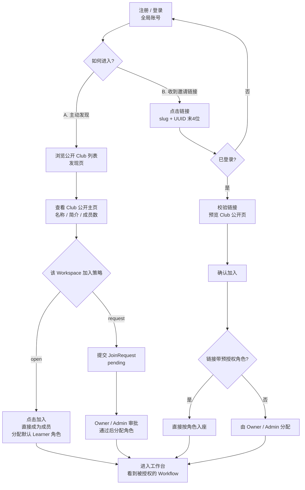
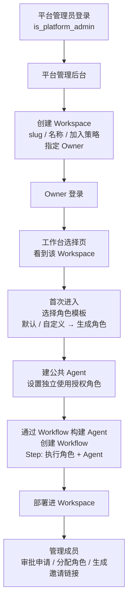
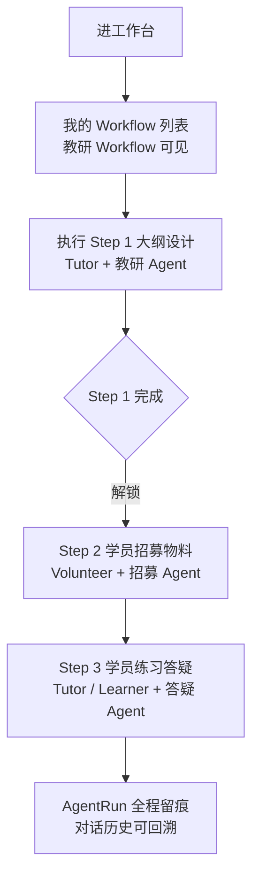

# 用户旅程与 Web 功能清单(定稿)

> 日期:2026-07-31
> 状态:已确认(J1 双路径 / J2 平台管理员创建 / J3 教研活动 / Workflow 构建方式 / 页面清单)
> 依赖:docs/领域模型定稿.md

---

## 1. User Journey

### J1 加入一个 Workspace(两条路径)

### J2 平台管理员创建 + Owner 运营 Workspace

### J3 教练组织教研活动

---

## 2. Web 页面清单(第一版)

| 页面 | 说明 | 可访问角色 |
|---|---|---|
| 注册/登录页 | 全局账号 | 所有人 |
| 公开 Club 发现页 | 浏览 open/request 空间 + 加入(直接加入或申请) | 游客/登录用户 |
| Club 公开主页 | 名称/简介/成员数 + 加入入口 | 游客 |
| 工作台选择页 | 我的 Workspace 列表 + 平台管理员入口 | 成员/平台管理员 |
| Workspace 设置页 | 成员管理(授角色)/申请审批/角色管理/邀请链接管理/加入策略 | Owner/Admin |
| 公共 Agent 列表/详情 | 建/编辑/停用/删除 + 授权角色 | Owner/Admin/Tutor |
| Workflow 执行页 | 当前用户可执行的 Step + 启动 | 按 Step 授权 |
| Agent 对话页 | 聊天 + AgentRun 历史 | 按授权 |
| 成员 Profile 页 | 公开资料(头像/简介/作品) | 成员 |
| 平台管理后台 | 创建 Workspace + 指定 Owner | 平台管理员 |

说明:
- Workflow 构建不做独立 UI 页面:通过 OpenClack 的 Workflow 构建 Agent/Skill 完成,产物部署为 Workspace 的 Workflow
- 个人设置页:并入注册/账号体系,二期再补
- 审计日志页:二期(接 AshAuditLog)
- 页面随开发过程按需增减

---

## 3. 关键权限补充

| 操作 | 允许角色 |
|---|---|
| 创建 Workspace + 指定 Owner | 仅平台管理员(is_platform_admin) |
| 设置/修改加入策略 | Owner |
| 审批加入申请(request 空间) | Owner/Admin |
| 用 Agent 构建 Workflow + 部署进 Workspace | Owner/Admin/Tutor(同"创建 Workflow"矩阵) |
| 生成邀请链接 | Owner/Admin/Volunteer;Volunteer 的链接不可预授权 Admin 级角色 |
