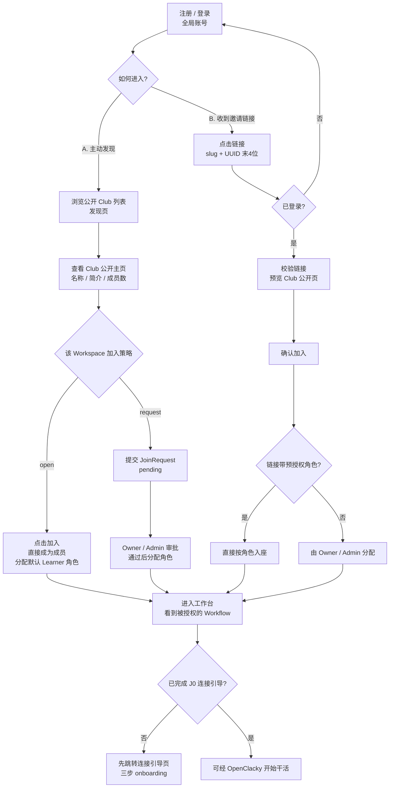
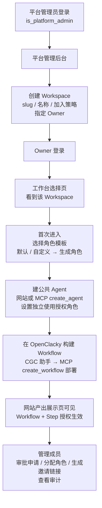
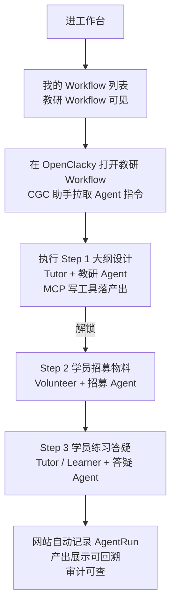
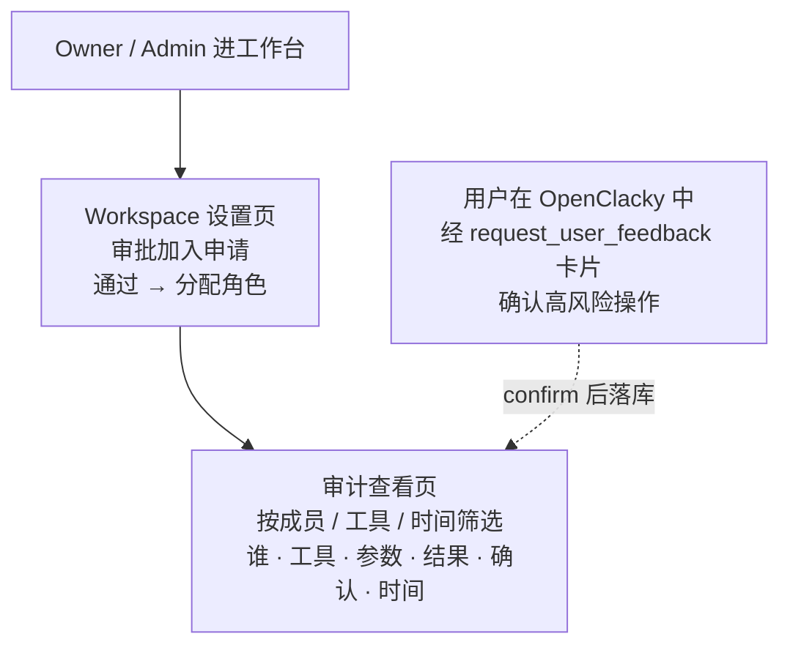

# 用户旅程与 Web 功能清单(定稿)

> 日期:2026-08-01(修订) · 原稿:2026-07-31
> 状态:已确认(J1 双路径 / J2 平台管理员创建 / J3 教研活动 / Workflow 构建方式 / 页面清单);按 grill 决策 D4/D13 修订为**形态 X**:网站无对话/执行页,专注业务中枢(工作台/成员角色/产出展示/审批/审计查看);新增 BYO 连接引导(J0)与审计查看页
> 依赖:docs/领域模型定稿.md、docs/grill-决策记录-2026-08-01.md

---

## 0. 形态 X(BYO,已确认)

- 网站 = **业务中枢**:工作台、成员/角色、Workflow 产出展示、审批、审计查看(D4)。
- **无对话页 / 无执行页**:聊天与 Agent 执行全在用户自己的 OpenClacky,经 MCP 调用网站(D4/D5)。
- 用户首次使用前需完成 **BYO 连接引导**(J0,三步,D13)。

---

## 1. User Journey

### J0 连接你的 OpenClacky(BYO Onboarding,一次性三步)

```mermaid
flowchart TD
    A[注册 / 登录<br/>全局账号] --> B[进入连接引导页<br/>onboarding]
    B --> C[Step 1 装 OpenClacky<br/>网站给出安装命令]
    C --> D[Step 2 添加 MCP 连接<br/>网站"连接设置"生成 token<br/>粘贴 mcp.json 片段]
    D --> E[Step 3 安装连接器扩展<br/>openclacky ext install <zip URL>]
    E --> F[完成<br/>进入工作台]
    F --> G[加入新 Workspace 无需重新配置<br/>token 通用,scope 靠 workspace_id]
```

- 单一配置点 = **mcp.json**:扩展自动读 mcp.json 的 cgc-2046 条目拿 URL + token(零额外配置,D13)。
- token 绑**用户不绑工作区**;不做"一条命令全自动"(扩展不代写 mcp.json,避免被覆盖)。

### J1 加入一个 Workspace(两条路径)



### J2 平台管理员创建 + Owner 运营 Workspace



### J3 教练组织教研活动



### J4 审批与审计查看(业务中枢)



- 确认流语义(D8):「确认写入」→ confirm 落库;「继续讨论」→ pending 保留(可再次 confirm 或超时清理);仅当用户在 WebUI 明确取消/关闭时才置 rejected。

---

## 2. Web 页面清单(第一版)

| 页面 | 说明 | 可访问角色 |
|---|---|---|
| 注册/登录页 | 全局账号 | 所有人 |
| 连接引导页(Onboarding) | 三步:装 OpenClacky → 添加 MCP 连接(粘贴 mcp.json 片段)→ 安装连接器扩展 cgc-2046 | 登录用户(首次) |
| 连接设置页 | 生成/撤销每用户 MCP 连接 token(绑用户不绑工作区);展示 mcp.json 配置片段与扩展安装命令 | 登录用户(仅本人) |
| 公开 Club 发现页 | 浏览 open/request 空间 + 加入(直接加入或申请) | 游客/登录用户 |
| Club 公开主页 | 名称/简介/成员数 + 加入入口 | 游客 |
| 工作台选择页 | 我的 Workspace 列表 + 平台管理员入口 | 成员/平台管理员 |
| Workspace 设置页 | 成员管理(授角色)/申请审批/角色管理/邀请链接管理/加入策略 | Owner/Admin |
| 公共 Agent 列表/详情 | 建/编辑/停用/删除 + 授权角色 + OpenClacky 配置引用(openclacky_profile/model/system_prompt/skills) | Owner/Admin/Tutor |
| Workflow 产出展示页 | 当前用户可执行的 Step + 各 Step 产出/AgentRun 记录;"在 OpenClacky 中执行"引导入口 | 按 Step 授权 |
| 审计查看页 | 工具调用审计(谁/工具/参数/结果/确认/时间)+ AgentRun 聚合;可筛选 | Owner/Admin 看 workspace 全量;成员看本人 |
| 成员 Profile 页 | 公开资料(头像/简介/作品) | 成员 |
| 平台管理后台 | 创建 Workspace + 指定 Owner | 平台管理员 |

说明:
- **形态 X(D4)**:无"Workflow 执行页"、无"Agent 对话页"——执行与聊天全在用户自己的 OpenClacky;网站只做业务中枢与产出/审计展示
- Workflow 构建不做独立 UI 页面:用户在 OpenClacky 中经 CGC 助手构建,经 MCP `create_workflow` 部署为 Workspace 的 Workflow
- 个人设置页:并入注册/账号体系,二期再补
- **审计查看页为 v1**(D6/D9:每次 MCP 工具调用 = 审计记录),不再二期
- 页面随开发过程按需增减

---

## 3. 关键权限补充

| 操作 | 允许角色 |
|---|---|
| 创建 Workspace + 指定 Owner | 仅平台管理员(is_platform_admin) |
| 设置/修改加入策略 | Owner |
| 审批加入申请(request 空间) | Owner/Admin |
| 用 Agent 构建 Workflow + 部署进 Workspace | Owner/Admin/Tutor(同"创建 Workflow"矩阵) |
| 生成邀请链接 | Owner/Admin/Volunteer;Volunteer 的链接不可预授权 Admin 级角色 |
| 生成/撤销 MCP 连接 token | 登录用户(仅本人,D13:绑用户不绑工作区) |
| 查看审计 | Owner/Admin 看 workspace 全量;成员仅本人(D6/D9) |
| 确认高风险 MCP 操作 | 操作发起者本人(经 OpenClacky 卡片,D8) |


