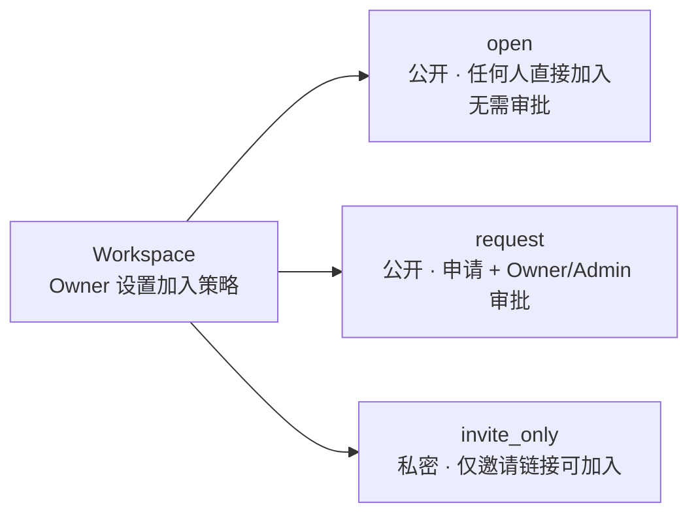
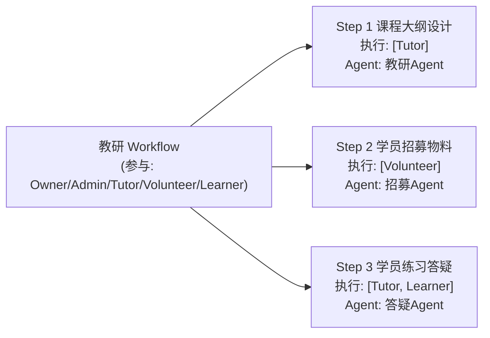
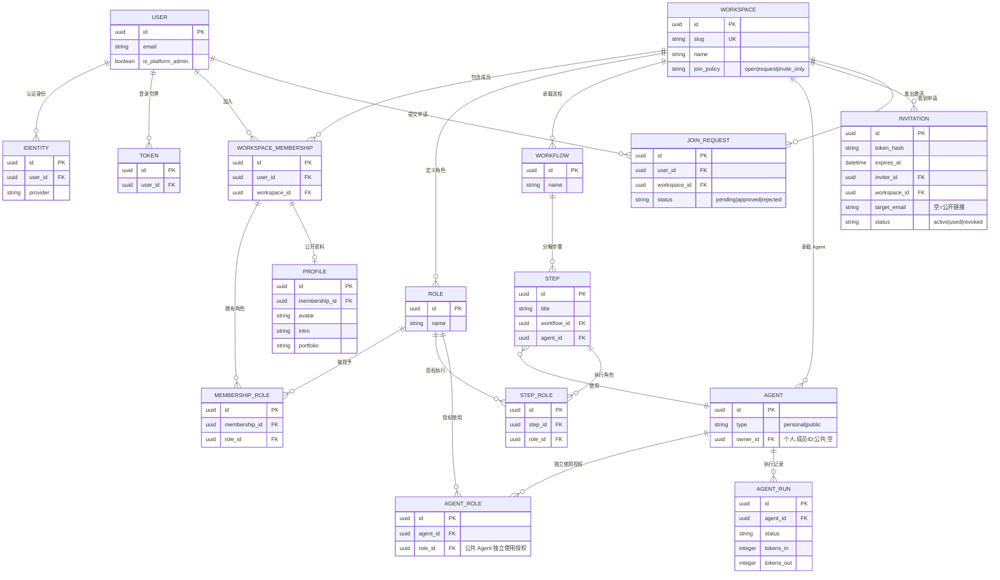

# CGC 平台领域模型定稿

> 日期:2026-07-31
> 状态:多租户地基 + 角色建模(含多角色)+ Agent 权限矩阵 + 资源清单/ER + Workflow 构建方式已确认;用户旅程见 docs/用户旅程与Web功能清单.md
> 依赖:docs/multitenancy-调研.md(5 个决策点全确认)、docs/brainstorm-多租户平台.md

---

## 1. 多租户地基(已定稿)

- 隔离级别:共享表 + tenant_id(Ash attribute 策略),不走 schema-per-tenant
- 账号模型:一人多 Workspace,全局账号(User/Identity/Token 全局)
- 租户解析:邀请链接(slug + UUID 末 4 位)+ 登录后工作台选择;子域名二期
- 租户标识:UUID 主键 + slug 展示,slug 全局唯一
- 全局资源:User、Workspace、Identity、Token
- 租户资源:WorkspaceMembership、MembershipRole、Role、Workflow、Step、Agent、AgentRun、Invitation、JoinRequest、Profile、Event、Course
- **平台管理员**(全局,非租户角色):User 上 `is_platform_admin` 标记,可多人;负责创建 Workspace 并指定 Owner,普通用户不可自助创建
- **Workspace 加入策略**(Owner 可设置):
  - `open`:公开可发现,任何人直接加入,**无需审批**
  - `request`:公开可发现,申请后由 Owner/Admin 审批
  - `invite_only`:私密,不可被发现,仅邀请链接可加入

---

## 2. 角色建模(已确认)

- 角色是**租户内可扩展实体**(非写死枚举),权限挂在角色上(RBAC)
- 平台提供**默认角色模板**,新 Workspace 初始化自动生成:
  - **Owner**(创始人):一切权限
  - **Admin**(管理员):管理成员/角色/公共 Agent/Workflow
  - **Tutor**(教练):创建个人 Agent、教研/教学类 Workflow、公共 Agent(教学向)
  - **Volunteer**(志愿者):执行被授权的 Workflow 步骤,不可建公共 Agent
  - **Learner**(学员):执行被授权的学习向步骤,不可建公共 Agent
- **一人多角色**:一个用户在一个 Workspace 可有多个角色(如 Owner 同时报名课程成为 Learner)
  - 存储:WorkspaceMembership(1 条/人/租户)+ MembershipRole 关联表(N:M Role)
  - 权限判定:**所有角色权限取并集**,命中任一角色即放行
  - Step 执行授权同理:用户角色集合命中 Step 的执行角色集合即可执行
  - Step/Agent 上存 `role_id` 引用;GraphQL 返回时嵌套 `role { id, name }`,前端展示名称

---

## 3. Agent 权限矩阵(已确认)

### 3.1 Agent 两种形态

| 形态 | 归属 | 例子 |
|---|---|---|
| 个人 Agent(角色分身) | 用户本人,仅本人可见 | 教练的"教学 Agent" |
| 公共 Agent(空间级) | Workspace,基于 Workflow 协作 | "活动筹备 Agent" |

### 3.2 授权最小单元:Workflow Step(不是 Workflow 整体)

Workflow 由多个 Step 组成,每个 Step 声明:**哪些角色可执行本步 + 本步用哪个 Agent**。

- 学员只能执行自己角色对应的 Step,其他 Step 的 Agent 不可见 → 堵死学员误用公共 Agent
- 长 Workflow、多角色参与天然支持

### 3.3 Agent 两层授权(取并集)

| 层 | 说明 | 默认 |
|---|---|---|
| ① 独立使用 | Agent 自身声明"哪些角色可直接用我"(Workflow 之外) | 创建者角色 + Admin/Owner |
| ② Workflow 内使用 | 跟随 Step 的执行角色 | 见 3.2 |

Learner 默认两层都拿不到,除非某 Step 明确授权(如答疑 Step)。

### 3.4 权限矩阵表

| 操作 | Owner | Admin | Tutor | Volunteer | Learner |
|---|---|---|---|---|---|
| 创建个人 Agent | ✅ | ✅ | ✅ | ✅ | ✅ |
| 使用自己的个人 Agent | ✅ | ✅ | ✅ | ✅ | ✅ |
| 使用他人个人 Agent | ❌ | ❌ | ❌ | ❌ | ❌ |
| 创建公共 Agent | ✅ | ✅ | ✅ | ❌ | ❌ |
| 编辑/停用公共 Agent | ✅ | ✅ | ✅ | ❌ | ❌ |
| 删除公共 Agent | ✅ | ✅ | ❌ | ❌ | ❌ |
| 独立使用公共 Agent | ✅ | ✅ | ✅(仅被授权的) | 按 Agent 声明 | 按 Agent 声明 |
| 执行 Workflow Step | ✅ | ✅ | 按 Step 授权 | 按 Step 授权 | 按 Step 授权 |
| 创建 Workflow | ✅ | ✅ | ✅ | ❌ | ❌ |

---

## 4. 资源清单与 ER 关系(已确认)

### 4.1 资源全集

**全局资源**:User、Identity、Token、Workspace

**按租户资源**:

| 资源 | 说明 |
|---|---|
| WorkspaceMembership | 成员关系(1 条/人/租户),存 user_id/workspace_id/加入时间/邀请人 |
| MembershipRole | 多角色关联表(membership_id, role_id) |
| Role | 可扩展角色,默认模板自动生成 |
| Workflow / Step | 流程 + 步骤,Step 声明执行角色 + 使用的 Agent |
| Agent | personal \| public,公共的有 allowed_roles 独立使用授权 |
| AgentRun | Agent 执行记录/对话历史:输入输出、token 用量、耗时、状态 |
| Invitation | 邀请链接:token(hash)、expires_at、邀请人、预授权角色、目标邮箱(空=公开链接)、状态(active/used/revoked) |
| JoinRequest | 加入申请:申请人、Workspace、状态(pending/approved/rejected);审批通过时分配角色 |
| Profile | 成员公开资料:头像、简介、标签(含 Portfolio 作品展示) |
| Event / Course | 插件占位(二期细化) |

### 4.2 ER 关系

说明:Event / Course 为插件占位,不入 ER;Portfolio 并入 PROFILE 字段(二期需要聚合展示时再拆)。AGENT_ROLE(独立使用授权)与 STEP_ROLE(Step 执行角色)是两张显式关联表,均引用 ROLE.id。

### 4.3 待细化(编码阶段)

- AgentRun 的 token 用量字段(tokens_in/tokens_out),为未来计费留底
- Invitation 的撤销流程(revoked 状态 + 到期清理)
- JoinRequest 审批通过时如何分配角色(申请人可请求角色 vs 仅审批方指定)
- 邀请链接权限:Volunteer 可生成链接但不得赋予 Admin 级角色(预授权角色范围受限)
- AuditLog(二期,接 AshAuditLog)敏感操作留痕

## 5. Workflow 构建与部署(已确认)

- **不做可视化/表单式构建 UI**;Workflow 通过 OpenClack 的 Agent/Skill 构建(平台提供"Workflow 构建器"Agent/Skill)
- 构建产物可**部署为 Workspace 的 Workflow**(Step:执行角色 + Agent)
- 关键权限:
  - 可用 Agent 构建 Workflow:Owner/Admin/Tutor(同"创建 Workflow"权限矩阵)
  - 可部署进 Workspace:同上;部署即保存为 Workflow/Step 资源,按 Step 授权生效
