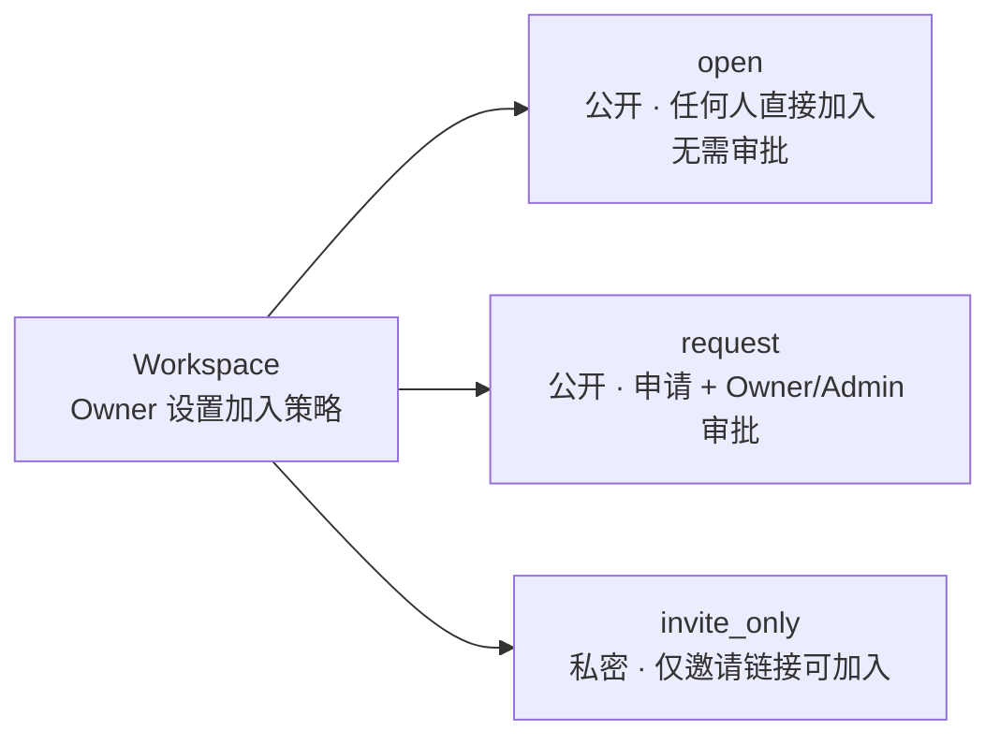
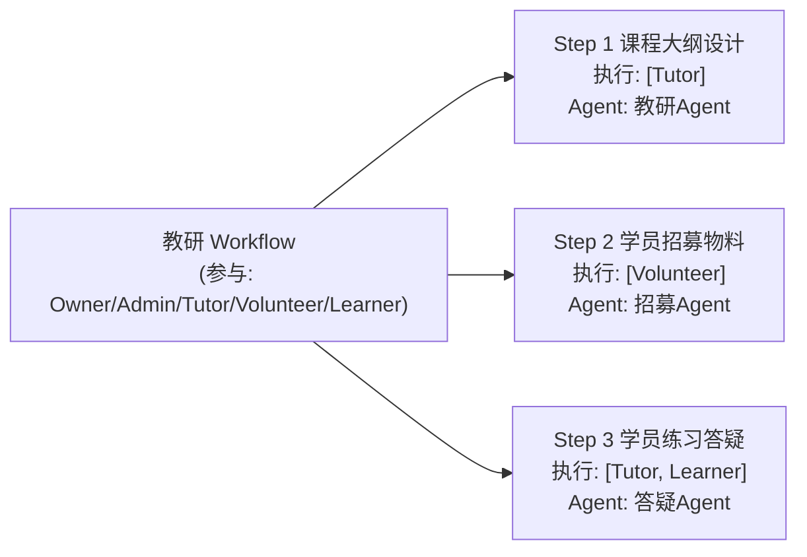
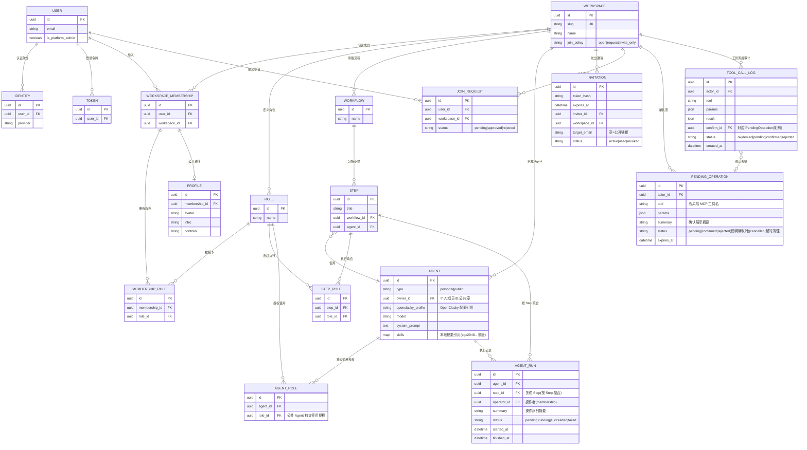
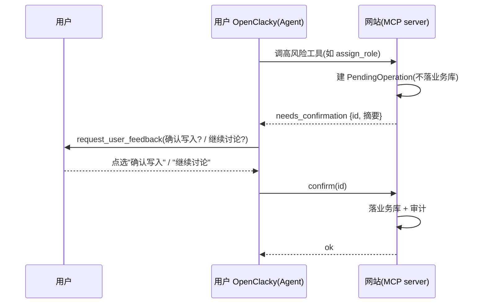

# CGC 平台领域模型定稿

> 日期:2026-08-01(修订) · 原稿:2026-07-31
> 状态:多租户地基 + 角色建模(含多角色)+ Agent 权限矩阵 + 资源清单/ER + Workflow 构建方式已确认;按 grill 决策(D1-D14)新增 **BYO 执行语义**:Agent=授权/配置登记、AgentRun=领域操作聚合、MCP 工具集、确认流、workspace_id 作用域
> 依赖:docs/grill-决策记录-2026-08-01.md、docs/multitenancy-调研.md、docs/brainstorm-多租户平台.md

---

## 0. 执行架构转向(BYO,已确认)

- **网站不再自行执行 Agent(D1)**:不跑 LLM/ToolLoop,平台零 AI 成本。
- **用户自带 OpenClacky 执行(D3)**:Agent 执行全部发生在用户本地 OpenClacky,经 **MCP 调用**网站(用户侧主动连、出站、无隧道)。
- 网站角色 = **业务中枢 + MCP server(D5/D6)**:暴露一个 MCP server(anubis_mcp),被用户的 OpenClacky 调用;每用户一个连接 token,RBAC 强制。
- 用户离线则该用户 Agent 任务不可用(接受,D3)。

---

## 1. 多租户地基(已定稿)

- 隔离级别:共享表 + tenant_id(Ash attribute 策略),不走 schema-per-tenant
- 账号模型:一人多 Workspace,全局账号(User/Identity/Token 全局)
- 租户解析:邀请链接(slug + UUID 末 4 位)+ 登录后工作台选择;子域名二期
- 租户标识:UUID 主键 + slug 展示,slug 全局唯一
- 全局资源:User、Workspace、Identity、Token
- 租户资源:WorkspaceMembership、MembershipRole、Role、Workflow、Step、Agent、AgentRun、Invitation、JoinRequest、Profile、Event、Course、PendingOperation、ToolCallLog
- **MCP 作用域 = workspace_id(D12)**:所有 MCP 工具带**必填 `workspace_id`**(无状态、每调用鉴权 + 审计);"当前工作区"由用户侧 CGC 助手维护,服务端不存会话状态。详见 §6.3。
- **平台管理员**(全局,非租户角色):User 上 `is_platform_admin` 标记,可多人;负责创建 Workspace 并指定 Owner,普通用户不可自助创建
- **Workspace 加入策略**(Owner 可设置):
  - `open`:公开可发现,任何人直接加入,**无需审批**
  - `request`:公开可发现,申请后由 Owner/Admin 审批
  - `invite_only`:私密,不可被发现,仅邀请链接可加入

---

## 2. 角色建模(已确认)

- 角色是**租户内可扩展实体**(非写死枚举),权限挂在角色上(RBAC)
- 平台提供**默认角色模板**,新 Workspace 初始化自动生成:
  - **Owner**(创始人):一切权限
  - **Admin**(管理员):管理成员/角色/公共 Agent/Workflow
  - **Tutor**(教练):创建个人 Agent、教研/教学类 Workflow、公共 Agent(教学向)
  - **Volunteer**(志愿者):执行被授权的 Workflow 步骤,不可建公共 Agent
  - **Learner**(学员):执行被授权的学习向步骤,不可建公共 Agent
- **一人多角色**:一个用户在一个 Workspace 可有多个角色(如 Owner 同时报名课程成为 Learner)
  - 存储:WorkspaceMembership(1 条/人/租户)+ MembershipRole 关联表(N:M Role)
  - 权限判定:**所有角色权限取并集**,命中任一角色即放行
  - Step 执行授权同理:用户角色集合命中 Step 的执行角色集合即可执行
  - Step/Agent 上存 `role_id` 引用;GraphQL 返回时嵌套 `role { id, name }`,前端展示名称

---

## 3. Agent 权限矩阵(已确认)

> **Agent 的定位已重定义(D2)**:Agent 不是网站侧执行实体,而是**授权/配置登记**——`type / allowed_roles / owner` + **OpenClacky 配置引用**(`openclacky_profile / model / system_prompt / skills`)。实际执行发生在用户本地 OpenClacky;网站按此登记做授权判定与指令分发。

### 3.1 Agent 两种形态

| 形态 | 归属 | 例子 |
|---|---|---|
| 个人 Agent(角色分身) | 用户本人,仅本人可见 | 教练的"教学 Agent" |
| 公共 Agent(空间级) | Workspace,基于 Workflow 协作 | "活动筹备 Agent" |

- **Agent 定义存网站**(D10 任务指令模式):公共 Agent 资源含 prompt/skills/授权;用户侧 CGC 助手经 MCP `get_agent_instruction(workspace_id, agent_id)` 拉取定义后按定义工作。
- 公共 Agent **动态创建天然支持**(定义存库即可被发现);**不做运行时下发文件**(热加载未验证、工程风险高)。

### 3.2 授权最小单元:Workflow Step(不是 Workflow 整体)

Workflow 由多个 Step 组成,每个 Step 声明:**哪些角色可执行本步 + 本步用哪个 Agent**。

- 学员只能执行自己角色对应的 Step,其他 Step 的 Agent 不可见 → 堵死学员误用公共 Agent
- 长 Workflow、多角色参与天然支持

### 3.3 Agent 两层授权(取并集)

| 层 | 说明 | 默认 |
|---|---|---|
| ① 独立使用 | Agent 自身声明"哪些角色可直接用我"(Workflow 之外) | 创建者角色 + Admin/Owner |
| ② Workflow 内使用 | 跟随 Step 的执行角色 | 见 3.2 |

Learner 默认两层都拿不到,除非某 Step 明确授权(如答疑 Step)。

### 3.4 权限矩阵表

| 操作 | Owner | Admin | Tutor | Volunteer | Learner |
|---|---|---|---|---|---|
| 创建个人 Agent | ✅ | ✅ | ✅ | ✅ | ✅ |
| 使用自己的个人 Agent | ✅ | ✅ | ✅ | ✅ | ✅ |
| 使用他人个人 Agent | ❌ | ❌ | ❌ | ❌ | ❌ |
| 创建公共 Agent | ✅ | ✅ | ✅ | ❌ | ❌ |
| 编辑/停用公共 Agent | ✅ | ✅ | ✅ | ❌ | ❌ |
| 删除公共 Agent | ✅ | ✅ | ❌ | ❌ | ❌ |
| 独立使用公共 Agent | ✅ | ✅ | ✅(仅被授权的) | 按 Agent 声明 | 按 Agent 声明 |
| 执行 Workflow Step | ✅ | ✅ | 按 Step 授权 | 按 Step 授权 | 按 Step 授权 |
| 创建 Workflow | ✅ | ✅ | ✅ | ❌ | ❌ |

> 本矩阵同时约束**网站页面**与 **MCP 管理类工具**(D7):Agent = 用户的执行分身,工具调用以**用户本人身份**判定,MCP 无额外权限(越权被拒,D6)。

---

## 4. 资源清单与 ER 关系(已确认)

### 4.1 资源全集

**全局资源**:User、Identity、Token、Workspace

**按租户资源**:

| 资源 | 说明 |
|---|---|
| WorkspaceMembership | 成员关系(1 条/人/租户),存 user_id/workspace_id/加入时间/邀请人 |
| MembershipRole | 多角色关联表(membership_id, role_id) |
| Role | 可扩展角色,默认模板自动生成 |
| Workflow / Step | 流程 + 步骤,Step 声明执行角色 + 使用的 Agent |
| Agent | **授权/配置登记(非执行实体,D2)**:type personal\|public、allowed_roles 独立使用授权、owner,及 OpenClacky 配置引用(openclacky_profile/model/system_prompt/skills) |
| AgentRun | **领域操作聚合记录(D9)**:网站根据 MCP 工具调用自动生成;按 Step 聚合(操作序列摘要、关联 Step、操作者);v1 就做;不含用户侧对话/token 用量 |
| PendingOperation | **确认流 pending 记录(D8)**:高风险 MCP 工具调用先建 pending,**无 confirm 不落业务库** |
| ToolCallLog | **MCP 工具调用审计(D6/D9)**:每次调用自动记录 谁/工具/参数/结果/确认/时间 |
| Invitation | 邀请链接:token(hash)、expires_at、邀请人、预授权角色、目标邮箱(空=公开链接)、状态(active/used/revoked) |
| JoinRequest | 加入申请:申请人、Workspace、状态(pending/approved/rejected);审批通过时分配角色 |
| Profile | 成员公开资料:头像、简介、标签(含 Portfolio 作品展示) |
| Event / Course | 插件占位(二期细化) |

### 4.2 ER 关系

说明:Event / Course 为插件占位,不入 ER;Portfolio 并入 PROFILE 字段(二期需要聚合展示时再拆)。AGENT_ROLE(独立使用授权)与 STEP_ROLE(Step 执行角色)是两张显式关联表,均引用 ROLE.id。PENDING_OPERATION 是确认流临时记录(不落业务表);TOOL_CALL_LOG 是每次 MCP 工具调用的审计流(v1)。

### 4.3 待细化(编码阶段)

- ~~AgentRun token 用量~~(已移除:D9 规定用户侧 token/对话不进 AgentRun)
- Invitation 的撤销流程(revoked 状态 + 到期清理)
- JoinRequest 审批通过时如何分配角色(申请人可请求角色 vs 仅审批方指定)
- 邀请链接权限:Volunteer 可生成链接但不得赋予 Admin 级角色(预授权角色范围受限)
- PendingOperation 过期清理策略 + confirm 幂等/过期处理(D8)
- auto_approve 模式 10s 倒计时自动决策的冷却期(二期,D8 已知风险)
- 审计:每次 MCP 工具调用 = 审计记录(v1,见 §6.4);通用 AuditLog 聚合/导出二期(接 ash_paper_trail)

---

## 5. Workflow 构建与部署(已确认)

- **不做可视化/表单式构建 UI**;构建发生在**用户自带 OpenClacky**:经连接器扩展(cgc-2046)内置的 CGC 助手/工作区技能完成(D10/D14)
- 构建产物经 **MCP 工具 `create_workflow`** 部署为 Workspace 的 Workflow(Step:执行角色 + Agent)(D7 低风险直做)
- **执行也在用户 OpenClacky**:用户经 CGC 助手按 Agent 指令干活,调 MCP 读写工具;网站自动记录 AgentRun 与产出(D9)
- 关键权限:
  - 可用 Agent 构建 Workflow:Owner/Admin/Tutor(同"创建 Workflow"权限矩阵)
  - 可部署进 Workspace:同上;部署即保存为 Workflow/Step 资源,按 Step 授权生效
  - MCP 工具与网站页面共享同一权限矩阵(D6)

---

## 6. MCP 工具集与执行语义(BYO,新增)

> 依据 grill 决策 D7/D8/D9/D12。网站暴露**一个** MCP server(anubis_mcp);用户侧 OpenClacky 经 MCP 调用平台;每次调用 = 用户本人身份 + 网站 RBAC 强制(Agent 权限 = 用户权限,越权被拒)。

### 6.1 工具集(D7):读 + 写 + 管理类全进

原则:**工具 = 形状、租户 = 过滤器、每次工具调用 = 审计记录**(D6)。

| 类别 | 工具 | 说明 |
|---|---|---|
| 读 | `get_workspace_context` | 定向工作区上下文:当前用户角色 / 可见 Agents / Skills / Steps(D10/D12) |
| 读 | `get_workflow` | 读取 Workflow 及其 Step 结构 |
| 读 | `get_step_output` | 读取 Step 产出(供后续步骤使用) |
| 读 | `list_members` | 成员列表(按角色可见范围) |
| 读 | `get_learner_history` | 学员学习历史(学习者本人 / 被授权角色) |
| 读 | `get_agent_instruction` | 拉取 Agent 定义(workspace_id, agent_id)→ prompt/skills/授权(D10) |
| 写 | `save_step_output` | 保存 Step 产出(落库) |
| 写 | `reply_learner_question` | 回复学员提问 |
| 管理(低风险直做) | `create_agent` / `create_workflow` 等 | 创建类,直接执行(受 RBAC 约束) |
| 管理(高风险确认流) | `approve_join_request` / `assign_role` / `create_invitation` / `update_join_policy` / 删除类 | 先建 pending,确认后落库(见 6.2) |

- 管理类进 MCP 的原因(用户拍板):**Agent = 用户的执行分身**,管理操作也应能被 Agent 代表用户执行;安全由 RBAC 兜底,不因"管理"而排除在 MCP 之外。
- 所有工具**必须**携带 `workspace_id`(D12);网站按目标资源判定租户。

### 6.2 确认流(D8):原生 request_user_feedback,无 confirm 不落库

高风险工具(审批/授权/邀请/策略/删除类)一律走确认流:

1. Agent 调高风险 MCP 工具 → 网站**不落业务库**,建 **PendingOperation**(pending)→ 返回 `needs_confirmation: {id, 摘要}`
2. Agent 调内置 `request_user_feedback(question, options: ["确认写入", "继续讨论"])` → 用户 OpenClacky WebUI 弹**可点击卡片**,Agent 停下等待
3. 用户点「确认写入」→ 文本回传 Agent → Agent 调 `confirm(id)` → 网站**落业务库 + 审计**,PendingOperation 置 confirmed
4. **网站永远不偷偷执行**(无 confirm 不落库):用户点「继续讨论」→ PendingOperation 保持 pending(可再次 confirm 或超时清理);仅当用户在 WebUI 明确取消/关闭时才置 rejected,工具返回取消

- 已知风险:auto_approve 模式 10s 倒计时自动决策(二期可加冷却期)。
- 低风险工具(读 / 创建类)不走确认流,直接执行。

### 6.3 多工作区作用域(D12):无状态 workspace_id

- **决定性事实**:OpenClacky 的 MCP client 是 **server 级全局长连接**(`@clients = {name => Client}`,进程级共享)→ 不能存服务端会话状态(会跨会话串)。
- 因此所有 MCP 工具带**必填 `workspace_id`**(无状态、每调用鉴权 + 审计)。
- "当前工作区" = 对话上下文,由用户侧 CGC 助手维护:`get_workspace_context(workspace_id)` 定向,返回角色 / 可见 Agents / Skills / Steps。
- 本地技能加工作区前缀 `cgc2046-<ws>-<skill>` 防多工作区撞名;网站生成 Agent 指令时引用带前缀的本地技能名。
- **Skill 本地同步的角色过滤在网站侧(D11)**——扩展只拉到该用户角色可见的技能。
- **不做**"每工作区一个 MCP server"(工具名合并冲突)。

### 6.4 审计与 AgentRun 聚合(D9)

- **每次 MCP 工具调用 = 审计记录**:网站自动记录 谁 / 工具 / 参数 / 结果 / 确认 / 时间(ToolCallLog)。
- **AgentRun = 按 Step 聚合的"一次干活"记录**:操作序列摘要、关联 Step、操作者;由网站根据工具调用自动生成,**v1 就做**。
- **不做用户侧上报**(上报不可靠/可篡改、连接器扩展工作量大)。
- 用户侧 OpenClacky 对话 / token 用量等执行详情**不进 AgentRun**。

